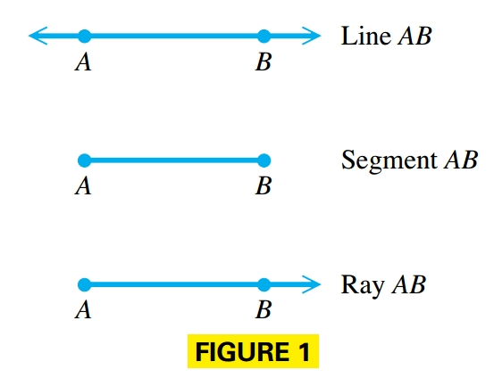
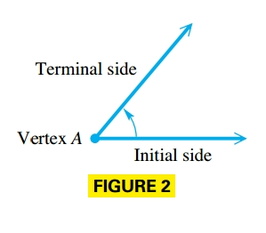
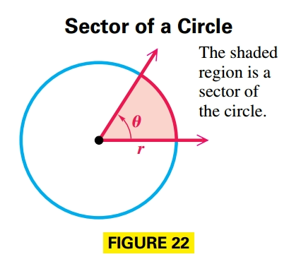
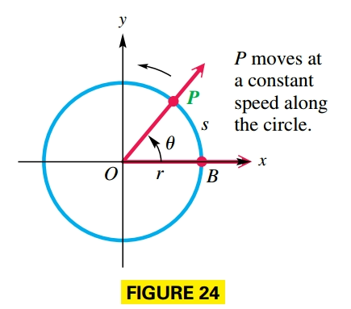
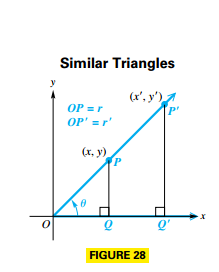
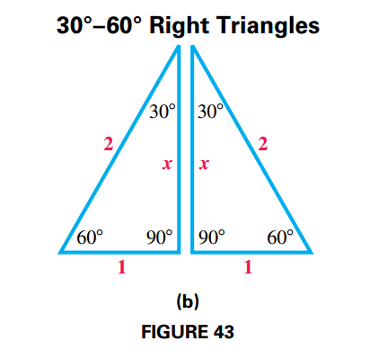
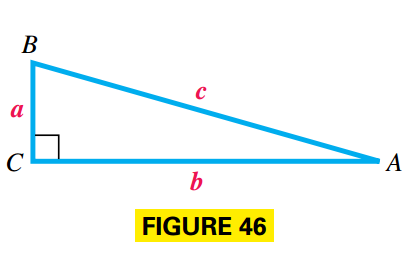
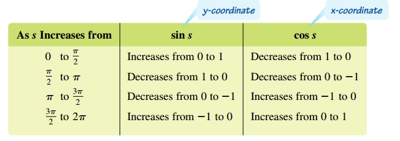
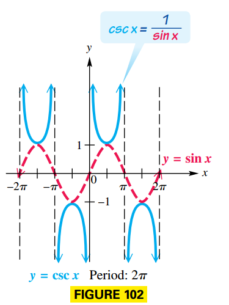
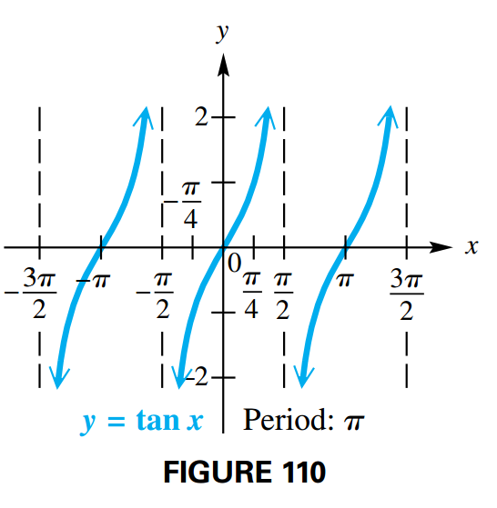

## Angles and Their Measures

### Basic Terminology

Two distinct points $A$ and $B$ determine a line called **line** $AB$. The portion of the line between $A$ and $B$, including points $A$ and $B$, is **segment** $AB$. The portion of line $AB$ that starts at $A$ and continues through $B$ and on past $B$ is called **ray** $AB$. Point $A$ is the endpoint of the ray.

In trigonometry, an **angle** consists of two rays in a plane with a common endpoint, or two line segments with a common endpoint. These two rays (or segments) are called the **sides** of the angle and the common endpoint is called the **vertex** of the angle.

Associated with an angle is its **measure**, generated by a rotation about the vertex. This measure is determined by rotating a ray starting at one side of the angle, called the **initial side**, to the position of the other side, called the **terminal side**.

A **counterclockwise rotation** generates an angle with **positive measure**, while a **clockwise rotation** generates an angle with **negative measure**.

### Degree Measure

The most common unit used to measure the size of angles is the **degree**. We assign $360$ degrees to a complete rotation of a ray.

An angle measuring between $0$° and $90$° is an **acute angle**. An angle measuring exactly $90$° is a **right angle**. An angle measuring more than $90$° but less than $180$° is an **obtuse angle**, and an angle of exactly $180$° is a **straight angle**.

If the sum of the measures of two positive angles is $90°$, the angles are called **complementary** and the angles are **complements**. Two positive angles with measures whose sum is $180°$ are **supplementary** and the angles are **supplements**.

One minute, written $1'$, is $\frac{1}{60}$ of a degree and one second, $1''$, is $\frac{1}{60}$ of a minute.However angles are commonly measured in decimal degrees.

### Standard Position and Coterminal Angles

An angle is in **standard position** if its vertex is at the origin and its initial side is along the positive x-axis. The angles in (a) and (b) are in standard position.

An angle in standard position is said to lie in the quadrant in which its terminal side lies, such as angles with measures $90°$, $180°$, $270°$, and so on, are called **quadrantal angles**. If the terminal side lies along an axis, then the angle does not lie in any quadrant. For example, an acute angle is in quadrant I (a) and an obtuse angle is in quadrant II (b).

The angles whose measures differ by a multiple of $360º$ are called **coterminal angles**.

### Radian Measure

An angle with vertex at the center of a circle that intercepts an arc on the circle equal in length to the radius of the circle has measure $1$ **radian**.

An angle $\theta$ whose vertex is at the center of a circle is called **central angle**.

In general, if $\theta$ is a central angle in a circle of radius $r$, and $\theta$ intercepts an arc of lengt $s$, the radian measure of $\theta$ is $\frac{s}{r}$.

#### Degree to Radian Conversion

We know that the circumference of a circle is given by $C = 2\pi r$, where $r$ is the radius. This shows that the radius can be laid $2\pi$ times around the circle.

Therefore, an angle of $360°$, which corresponds to a complete circle, intercepts an arc equal in length to $2\pi$ times the radius of the circle. Thus, an angle of $360º$ has measure $2\pi$.

$$
\begin{aligned}
360º = 2\pi \text{ radians}
\end{aligned}
$$

- To convert a degree measure to radians multiply the degree measure by $\frac{2\pi}{360} = \frac{\pi}{180}$
- To convert a radian measure to degrees multiply the radian measure by $\frac{360}{2\pi} = \frac{180}{\pi}$

### Arc Lengths and Areas of Sectors

In the following figure angle $QOP$ has measure $1$ radian and intercepts an arc of length $r$. While angle $ROT$ has measure $\theta$ radians and intercepts an arc of length $s$.

Since the lengths of the arcs are proportional to the measures of their central angles:

$$
\begin{aligned}
\frac{s}{r} = \frac{\theta}{1}
\end{aligned}
$$

$$
\begin{aligned}
s = r\theta
\end{aligned}
$$

A **sector** of a circle is the portion of the interior of a circle intercepted by a central angle.

The interior of a circle can be thought of as a sector intercepted by a central angle of measure $2\pi$ radians.

If a central angle for a sector has measure $\theta$ radians, then the sector makes up the fraction $\frac{\theta}{2\pi}$ of a complete circle. The area inside a circle with radius $r$ is $\mathcal{A} = \pi r^2$, Therefore,
the area of the sector is given by the product of the fraction $\frac{\theta}{2\pi}$ and the total area:

$$
\begin{aligned}
\mathcal{A} = \frac{\theta}{2\pi}(\pi r^2) = \frac{1}{1}r^2 \theta, \theta \text{ in radians}
\end{aligned}
$$

### Linear and Angular Speed

Suppose that point $P$ moves at a constant speed along a circle of radius $r$ and center $O$.

The measure of how fast the position of $P$ is changing is called **linear speed**. If $v$ represents linear speed, then:

$$
\begin{aligned}
v = \frac{s}{t}
\end{aligned}
$$

where $s$ is the length of the arc traced by point $P$ in time $t$. (This formula is just a restatement of $d = rt$ with $s$ as distance, $v$ as rate (speed), and $t$ as time.)

As point $P$ moves along the circle, ray $OP$ rotates around the origin, so the speed at which the measure ofthe angle changes is called **angular speed**, $\omega$ and is given by:

$$
\begin{aligned}
\omega = \frac{\theta}{t}, \theta \text{ in radians}
\end{aligned}
$$

where $\theta$ is the measure of angle $POB$.

To relate linear and angular speeds we use the result $s = r\theta$, therefor:

$$
\begin{aligned}
v = \frac{s}{t} = \frac{r\theta}{t} = r \frac{\theta}{t} = r \omega
\end{aligned}
$$

### Appendix

Latitude gives the measure of a central angle with vertex at Earth's center whose initial side goes through the equator and whose terminal side goes through the given location (basically like north-south orientation).

## Trigonometric Functions and Fundamental Identities

### Trigonometric Functions

Let $(x, y)$ be a point other than the origin on the terminal side of an angle $\theta$ instandard position. The distance from the point to the origin is $r = \sqrt{x^2 + y^2}$. The six trigonometric functions of $\theta$ are as follows:

$$
\begin{aligned}
\sin \theta = \frac{y}{r}
\end{aligned}
$$

$$
\begin{aligned}
\cos \theta = \frac{x}{r}
\end{aligned}
$$

$$
\begin{aligned}
\tan \theta = \frac{y}{x}, x \neq 0
\end{aligned}
$$

$$
\begin{aligned}
\csc \theta = \frac{r}{y}
\end{aligned}
$$

$$
\begin{aligned}
\sec \theta = \frac{r}{x}
\end{aligned}
$$

$$
\begin{aligned}
\cot \theta = \frac{x}{y}, y \neq 0
\end{aligned}
$$

$\sin \theta = \frac{y}{r}$ is the same no matter which point is used to find it. Refer to FIGURE 28, which shows an angle $\theta$ and two distinct points on its terminal side. Point $P$ has coordinates $(x, y)$, and point $P'$ with coordinates $(x', y')$. Let $r$ be the length of the hypotenuse of triangle $OPQ$, and let $r'$ be the length of the hypotenuse of triangle $OP'Q'$. Since corresponding sides of similar triangles are in proportion:

$$
\begin{aligned}
\frac{y}{r} = \frac{y'}{r'} = \sin \theta
\end{aligned}
$$

We can also find the trigonometric function values of an angle if we know the equation of the line coinciding with the terminal ray:

$$
\begin{aligned}
Ax + By = 0
\end{aligned}
$$

By choosing any point on the ray, we can find the trigonometric function values of the angle.

In general, it is true that $m = \tan \theta$.

### Function Values of Quadrantal Angles

Conditions for Undefined Function Values

- If the terminal side of the quadrantal angle lies along the y-axis ($x$ equals zero), then the tangent and secant functions are undefined.
- If the terminal side of the quadrantal angle lies along the x-axis ($y$ equals zero), then the cotangent and cosecant functions are undefined.

### Reciprocal Identities

The definitions of the trigonometric functions were written to illustrate that certain function pairs are reciprocals of each other. Since:

$$
\begin{aligned}
\sin \theta = \frac{y}{r}
\end{aligned}
$$

and

$$
\begin{aligned}
\csc \theta = \frac{r}{y}
\end{aligned}
$$

Then:

$$
\begin{aligned}
\sin \theta = \frac{1}{\csc \theta}
\end{aligned}
$$

Therefore, the reciprocal identities are listed below:

$$
\begin{aligned}
\sin \theta = \frac{1}{\csc \theta}
\end{aligned}
$$

$$
\begin{aligned}
\cos \theta = \frac{1}{\sec \theta}
\end{aligned}
$$

$$
\begin{aligned}
\tan \theta = \frac{1}{\cot \theta}
\end{aligned}
$$

$$
\begin{aligned}
\csc \theta = \frac{1}{\sin \theta}
\end{aligned}
$$

$$
\begin{aligned}
\sec \theta = \frac{1}{\cos \theta}
\end{aligned}
$$

$$
\begin{aligned}
\cot \theta = \frac{1}{\tan \theta}
\end{aligned}
$$

### Signs and Ranges of Function Values

A point $(x, y)$ in quadrant II has $x < 0$ and $y > 0$. This makes the values of sine and cosecant positive for quadrant II angles, while the other four functions take on negative values. Similar results can be obtained for the other quadrants, as summarized here.

In Figure 37 we can see that as the measure of the angle increases, $y$ increases, but never exceeds $r$, so $y \leq r$. In a similar way, angles in quadrant IV suggest that $-r \leq y$. Therefore:

$$
\begin{aligned}
-r \leq y \leq r
\end{aligned}
$$

$$
\begin{aligned}
-1 \leq \frac{y}{r} \leq 1
\end{aligned}
$$

$$
\begin{aligned}
-1 \leq \sin \theta \leq 1
\end{aligned}
$$

Similar reasoning leads to the following:

$$
\begin{aligned}
-1 \leq \cos \theta \leq 1
\end{aligned}
$$

The tangent of an angle is defined as $\frac{y}{x}$. It is possible that $x < y$, $x = y$, or $x > y$. For this reason, $\frac{y}{x}$ can take any value, so $\tan \theta$ can be any real number, as can $\cot \theta$.

The functions $\sec \theta$ and $\csc \theta$ are reciprocals of the functions $\cos \theta$ and $\sin \theta$, respectively, making the following true:

$$
\begin{aligned}
\sec \theta \leq -1 \text{ or } \sec \theta \geq 1
\end{aligned}
$$

and

$$
\begin{aligned}
\csc \theta \leq -1 \text{ or } \csc \theta \geq 1
\end{aligned}
$$

### Pythagorean Identities

Given $x^2 + y^2 = r^2$, then:

$$
\begin{aligned}
\frac{x^2}{r^2} + \frac{y^2}{r^2} = \frac{r^2}{r^2}
\end{aligned}
$$

$$
\begin{aligned}
\left(\frac{x}{r}\right)^2 + \left(\frac{y}{r}\right)^2 = 1
\end{aligned}
$$

$$
\begin{aligned}
\left(\cos \theta\right)^2 + \left(\sin \theta\right)^2 = 1
\end{aligned}
$$

Similarly:

$$
\begin{aligned}
\frac{x^2}{x^2} + \frac{y^2}{x^2} = \frac{r^2}{x^2}
\end{aligned}
$$

$$
\begin{aligned}
1 + \left(\frac{y}{x}\right)^2 = \left(\frac{r}{x}\right)^2
\end{aligned}
$$

$$
\begin{aligned}
1 + \left(\tan \theta\right)^2 = \left(\sec \theta\right)^2
\end{aligned}
$$

Similarly:

$$
\begin{aligned}
\frac{x^2}{y^2} + \frac{y^2}{y^2} = \frac{r^2}{y^2}
\end{aligned}
$$

$$
\begin{aligned}
\left(\frac{x}{y}\right)^2 + 1 = \left(\frac{r}{y}\right)^2
\end{aligned}
$$

$$
\begin{aligned}
\left(\cot \theta\right)^2 + 1 = \left(\csc \theta \right)^2
\end{aligned}
$$

### Quotient Identities

Consider the quotient of $\sin \theta$ and $\cos \theta$:

$$
\begin{aligned}
\frac{\sin \theta}{\cos \theta} = \frac{\frac{y}{r}}{\frac{x}{r}} = \frac{y}{x} = \tan \theta
\end{aligned}
$$

where $\cos \theta \neq 0$. Similarly:

$$
\begin{aligned}
\frac{\cos \theta}{\sin \theta} = \frac{\frac{x}{r}}{\frac{y}{r}} = \frac{x}{y} = \cot \theta
\end{aligned}
$$

## Right Triangles and Evaluating Trigonometric Functions

### Right-Triangle Definitions of the Trigonometric Functions

FIGURE 41 shows an acute angle $A$ in standard position. The side of length $y$ in FIGURE 41 is called the side opposite angle $A$, and the side of length $x$ is called the side adjacent to angle $A$.

Such that:

$$
\begin{aligned}
\sin A = \frac{y}{r} = \frac{\text{side opposite}}{\text{hypotenuse}}
\end{aligned}
$$

$$
\begin{aligned}
\cos A = \frac{x}{r} = \frac{\text{side adjacent}}{\text{hypotenuse}}
\end{aligned}
$$

$$
\begin{aligned}
\tan A = \frac{y}{x} = \frac{\text{side opposite}}{\text{side adjacent}}
\end{aligned}
$$

$$
\begin{aligned}
\csc A = \frac{r}{y} = \frac{\text{hypotenuse}}{\text{side opposite}}
\end{aligned}
$$

$$
\begin{aligned}
\sec A = \frac{r}{x} = \frac{\text{hypotenuse}}{\text{side adjacent}}
\end{aligned}
$$

$$
\begin{aligned}
\cot A = \frac{x}{y} = \frac{\text{side adjacent}}{\text{side opposite}}
\end{aligned}
$$

### Trigonometric Function Values of Special Angles

Certain special angles, such as $30º, 45º$ and $60º$ occur so often that they deserve special study. See Figure 43(a), for convenience the length of the sides is $2$.

Bisecting one angle of this equilateral triangle leads to two right triangles, each of which has angles of $30°, 60°$, and $90°$, as shown in FIGURE 43(b).

Let $x$ represent the length of the longer leg:

$$
\begin{aligned}
2^2 = 1^2 + x^2
\end{aligned}
$$

$$
\begin{aligned}
4 = 1 + x^2
\end{aligned}
$$

$$
\begin{aligned}
3 = x^2
\end{aligned}
$$

$$
\begin{aligned}
\sqrt{3} = x
\end{aligned}
$$

Therefore the hypotenuse is $2$, the side opposite is $1$ and the side adjacent is $\sqrt{3}$. From the definition of the trigonometric functions:

$$
\begin{aligned}
\sin 30º = \frac{\text{side opposite}}{\text{hypotenuse}} = \frac{1}{2}
\end{aligned}
$$

$$
\begin{aligned}
\cos 30º = \frac{\text{side adjacent}}{\text{hypotenuse}} = \frac{\sqrt{3}}{2}
\end{aligned}
$$

$$
\begin{aligned}
\tan 30º = \frac{\text{side opposite}}{\text{side adjacent}} = \frac{\sqrt{3}}{3}
\end{aligned}
$$

$$
\begin{aligned}
\csc 30º = \frac{\text{hypotenuse}}{\text{side opposite}} = \frac{2}{1} = 2
\end{aligned}
$$

$$
\begin{aligned}
\sec 30º = \frac{\text{hypotenuse}}{\text{side adjacent}} = \frac{2\sqrt{3}}{3}
\end{aligned}
$$

$$
\begin{aligned}
\cot 30º = \frac{\text{side adjacent}}{\text{side opposite}} = \frac{\sqrt{3}}{1} = \sqrt{3}
\end{aligned}
$$

For $60º$ refer to Figure 44, such that hypotenuse is $2$, side opposite is $\sqrt{3}$ and side adjacent is $1$.

Therefore from the definition of the trigonometric functions:

$$
\begin{aligned}
\sin 60º = \frac{\text{side opposite}}{\text{hypotenuse}} = \frac{\sqrt{3}}{2}
\end{aligned}
$$

$$
\begin{aligned}
\cos 60º = \frac{\text{side adjacent}}{\text{hypotenuse}} = \frac{1}{2}
\end{aligned}
$$

$$
\begin{aligned}
\tan 60º = \frac{\text{side opposite}}{\text{side adjacent}} = \frac{\sqrt{3}}{1} = \sqrt{3}
\end{aligned}
$$

$$
\begin{aligned}
\csc 60º = \frac{\text{hypotenuse}}{\text{side opposite}} = \frac{2\sqrt{3}}{3}
\end{aligned}
$$

$$
\begin{aligned}
\sec 60º = \frac{\text{hypotenuse}}{\text{side adjacent}} = \frac{2}{1} = 2
\end{aligned}
$$

$$
\begin{aligned}
\cot 60º = \frac{\text{side adjacent}}{\text{side opposite}} = \frac{\sqrt{3}}{3}
\end{aligned}
$$

For $45º$ we start with a $45º-45º$ right triangle as shown in Figure 45. This triangle has two equal sides whose length is $1$ unit.

Therefore, by the Pythagoread theorem:

$$
\begin{aligned}
1^2 + 1^2 = r^2
\end{aligned}
$$

$$
\begin{aligned}
r = \sqrt{2}
\end{aligned}
$$

That is the hypotenuse is $\sqrt{2}$, the side opposite is $1$ and the side adjacent is $1$, so
from the definition of the trigonometric functions:

$$
\begin{aligned}
\sin 45º = \frac{\text{side opposite}}{\text{hypotenuse}} = \frac{1}{\sqrt{2}} = \frac{\sqrt{2}}{2}
\end{aligned}
$$

$$
\begin{aligned}
\cos 45º = \frac{\text{side adjacent}}{\text{hypotenuse}} = \frac{1}{\sqrt{2}} = \frac{\sqrt{2}}{2}
\end{aligned}
$$

$$
\begin{aligned}
\tan 45º = \frac{\text{side opposite}}{\text{side adjacent}} = \frac{1}{1} = 1
\end{aligned}
$$

$$
\begin{aligned}
\csc 45º = \frac{\text{hypotenuse}}{\text{side opposite}} = \frac{\sqrt{2}}{1} = \sqrt{2}
\end{aligned}
$$

$$
\begin{aligned}
\sec 45º = \frac{\text{hypotenuse}}{\text{side adjacent}} = \frac{\sqrt{2}}{1} = \sqrt{2}
\end{aligned}
$$

$$
\begin{aligned}
\cot 45º = \frac{\text{side adjacent}}{\text{side opposite}} = \frac{1}{1} = 1
\end{aligned}
$$

### Cofunction Identities

In a right triangle $ABC$ with right angle $C$, the acute angles $A$ and $B$ are complementary. See FIGURE 46.

The length of the side opposite angle $A$ is $a$, and the length of the side opposite angle $B$ is $b$. The length of the hypotenuse is $c$. In this triangle, $\sin A = \frac{a}{c}$ and $\cos B$ is also equal to $\frac{a}{c}$.

Similar reasoning yields the following.

$$
\begin{aligned}
\tan A = \frac{a}{b} = \cot B
\end{aligned}
$$

$$
\begin{aligned}
\sec A = \frac{c}{b} = \csc B
\end{aligned}
$$

If these identities follow we say $\sin$ and $\cos$ are cofunctions, as well as $\tan$ and $\cot$ and $\sec$ and $\csc$.

Since angles $A$ and $B$ are complementary $A + B = 90º$, that is $B = 90º - A$, therefore:

$$
\begin{aligned}
\sin A = \cos B = \cos (90º - A)
\end{aligned}
$$

This is a cofunction identity, the rest are as follows: given an acute angle $A$ in degrees:

$$
\begin{aligned}
\cos A = \sin B = \sin (90º - A)
\end{aligned}
$$

$$
\begin{aligned}
\tan A = \cot B = \cot (90º - A)
\end{aligned}
$$

$$
\begin{aligned}
\csc A = \sec B = \sec (90º - A)
\end{aligned}
$$

$$
\begin{aligned}
\sec A = \csc B = \csc (90º - A)
\end{aligned}
$$

$$
\begin{aligned}
\cot A = \tan B = \tan (90º - A)
\end{aligned}
$$

Given an acute angle $A$ is radians:

$$
\begin{aligned}
\sin A = \cos B = \cos \left(\frac{\pi}{2} - A\right)
\end{aligned}
$$

$$
\begin{aligned}
\cos A = \sin B = \sin \left(\frac{\pi}{2} - A\right)
\end{aligned}
$$

$$
\begin{aligned}
\tan A = \cot B = \cot \left(\frac{\pi}{2} - A\right)
\end{aligned}
$$

$$
\begin{aligned}
\csc A = \sec B = \sec \left(\frac{\pi}{2} - A\right)
\end{aligned}
$$

$$
\begin{aligned}
\sec A = \csc B = \csc \left(\frac{\pi}{2} - A\right)
\end{aligned}
$$

$$
\begin{aligned}
\cot A = \tan B = \tan \left(\frac{\pi}{2} - A\right)
\end{aligned}
$$

### Reference Angles

A reference angle for an angle $\theta$, written $\theta'$, is the positive acute angle made by the terminal side of angle $\theta$ and the x-axis.

If an angle $\theta$ is negative or has measure greater than $360°$, its reference angle is found by first finding its coterminal angle that is between $0°$ and $360°$.

### Finding Trigonometric Function Values for a Nonquadrantal Angle $\theta$

1. If $\theta > 360°$, or if $\theta < 0°$, then find a coterminal angle.
2. Find the reference angle $\theta'$.
3. Find the trigonometric function values for reference angle $\theta'$.
4. Determine the correct signs for the values, given by the quadrant of $\theta$.

## Applications of Right Triangles

### Solving Triangles

To **solve a triangle** means to find the measures of all the angles and sides of the triangle.

### Angles of Elevation or Depression

The **angle of elevation** from point $X$ to point $Y$ (above $X$) is the acute angle formed by ray $XY$ and a horizontal ray with endpoint at $X$ (see FIGURE 61).

The **angle of depression** from point $X$ to point $Y$ (below $X$) is the acute angle formed by ray $XY$ and a horizontal ray with endpoint $X$ (see FIGURE 62).

### Bearing

When a single angle is given, such as $164°$, it is understood that the bearing is measured in a clockwise direction from due north (see FIGURE 64).

The second method for expressing bearing starts with a north–south line and uses an acute angle to show the direction, either east or west, from this line (see FIGURE 66).

## The Circular Functions

### Circular Functions

For any real number $s$ represented by a directed arc on the unit circle $x^2 + y^2 = 1$, the following definitions hold.

$$
\begin{aligned}
\sin s = \frac{y}{r} = y
\end{aligned}
$$

$$
\begin{aligned}
\cos s = \frac{x}{r} = x
\end{aligned}
$$

$$
\begin{aligned}
\tan s = \frac{y}{x}, x \neq 0
\end{aligned}
$$

$$
\begin{aligned}
\csc s = \frac{r}{y} = \frac{1}{y}, y \neq 0
\end{aligned}
$$

$$
\begin{aligned}
\sec s = \frac{r}{x} = \frac{1}{x}, x \neq 0
\end{aligned}
$$

$$
\begin{aligned}
\cot s = \frac{x}{y}, y \neq 0
\end{aligned}
$$

So circular function values of real numbers are obtained in the same manner as trigonometric function values of angles measured in radians.

We can use the following figure to easily obtain exact solutions to some angles:

The diagram shown in FIGURE 82 illustrates a correspondence that relates the right triangle ratio definitions of the trigonometric functions and the unit circle interpretation.

The arc $SR$ is the first-quadrant portion of the unit circle, and the standard-position angle $POQ$ is designated $\theta$. By definition, the coordinates of $P$ are $(cos \theta, sin \theta)$. The six trigonometric functions of $\theta$ can be interpreted as lengths of line segments.

For $\cos \theta$ and $\sin \theta$, use right triangle $POQ$ and right-triangle ratios:

$$
\begin{aligned}
\cos \theta = \frac{\text{adyacent}}{\text{hypotenuse}} = \frac{OQ}{OP} = \frac{OQ}{1} = OQ
\end{aligned}
$$

$$
\begin{aligned}
\sin \theta = \frac{\text{opposite}}{\text{hypotenuse}} = \frac{PQ}{OP} = \frac{PQ}{1} = PQ
\end{aligned}
$$

For $\tan \theta$ and $\sec \theta$, use right triangle $VOR$ and right-triangle ratios:

$$
\begin{aligned}
\tan \theta = \frac{\text{opposite}}{\text{adyacent}} = \frac{VR}{OR} = \frac{VR}{1} = VR
\end{aligned}
$$

$$
\begin{aligned}
\sec \theta = \frac{\text{hypotenuse}}{\text{adyacent}} = \frac{OV}{OR} = \frac{OV}{1} = OV
\end{aligned}
$$

For $\csc \theta$ and $\cot \theta$, first note that $US$ and $OR$ are parallel. Thus angle $SUO$ is equal to $\theta$:

$$
\begin{aligned}
\csc \theta = \frac{\text{hypotenuse}}{\text{opposite}} = \frac{OU}{OS} = \frac{OU}{1} = OU
\end{aligned}
$$

$$
\begin{aligned}
\cot \theta = \frac{\text{adjacent}}{\text{opposite}} = \frac{US}{OS} = \frac{US}{1} = US
\end{aligned}
$$

FIGURE 83 illustrates the results found above.

## Graphs of the Sine and Cosine Functions

### Periodic Function

A **periodic function** is a function $f$, such that:

$$
\begin{aligned}
f(x) = f(x + np)
\end{aligned}
$$

for every real number $x$ in the domain of $f$, every integer $n$ and some positive real number $p$. The least possible value of $p$ is the **period** of the function.

#### Graph of the Sine Function

See FIGURE 85, and trace along the circle to verify the results shown in the table.

This graph is called a **sine wave** or **sinusoid**.

### Amplitude

The graph of $y = a \sin x$ or $y = a \cos x$, with $a \neq 0$, will have the same shape as the graph of $y = \sin x$ or $y = \cos x$, respectively, except with range $[-|a|, |a|]$. The amplitude is $|a|$.

No matter what the value of the amplitude, the periods of $y = a \sin x$ and $y = a \cos x$ are still $2\pi$.

### Period

In general, the graph of a function of the form $y = \sin bx$ or $y = \cos bx$, for $b > 0$, will have a period different from $2\pi$ when $b \neq 1$.

We know that $bx$ ranges from $0$ to $2\pi$, therefore:

$$
\begin{aligned}
0 \leq bx \leq 2\pi
\end{aligned}
$$

$$
\begin{aligned}
0 \leq x \leq \frac{2\pi}{b}
\end{aligned}
$$

Therefore the period is $\frac{2\pi}{b}$. By dividing the interval $[0, \frac{2\pi}{b}]$ into four equal parts, we obtain the values for which $\sin bx$ or $\cos bx$ is $-1$, $0$, or $1$.

### Guidelines for Sketching Graphs of the Sine and Cosine Functions

To graph $y = a \sin bx$ or $y = a \cos bx$, with $b > 0$, follow these steps.

1. Find the period, $\frac{2\pi}{b}$.
2. Divide the interval into four equal parts.
3. Evaluate the function for each of the five x-values. The points will be maximum points, minimum points, and x-intercepts.
4. Plot the points found in Step 3, and join them with a sinusoidal curve having amplitude $|a|$.

### Translations and Transformations

In general, the graph of a function of the form:

$$
\begin{aligned}
y = f(x - d)
\end{aligned}
$$

is translated horizontally compared with the graph of $y = f(x)$. The translation is $d$ units to the right if $d > 0$ and $|d|$ units to the left if $d < 0$.

In general, the graph of a function of the form:

$$
\begin{aligned}
y = c + f(x)
\end{aligned}
$$

is translated vertically compared with the graph of $y = f(x)$. The translation is $c$ units up if $c > 0$ and $|c|$ units down if $c < 0$.

### Further Guidelines for Sketching Graphs of the Sine and Cosine Functions

A function of the form $y = c + a \sin [b(x − d)]$ or $y = c + a \cos [b(x − d)]$ , $b > 0$ can be graphed according to the following guidelines:

- Method 1:
  1. Find an interval whose length is one period $\frac{2\pi}{b}$ by solving the three-part inequality $0 \leq b(x - d) \leq 2\pi$.
  2. Divide the interval into four equal parts.
  3. Evaluate the function for each of the five x-values. The points will be maximum points, minimum points, and points that intersect the line $y = c$.
  4. Plot the points in Step 3, and join them with a sinusoidal curve having amplitude $|a|$.
- Method 2:
  1. Graph $y = a \sin bx$ or $y = a \cos bx$. The amplitude of the function is $|a|$, and the period is $\frac{2\pi}{b}$.
  2. Use translations to graph the desired function.

## Graphs of the Other Circular Functions

### Graphs of the Secant and Cosecant Functions

The secant function is undefined for odd multiples of $\frac{\pi}{2}$ and has vertical asymptotes for such values. Furthermore, since $\sec (-x) = \sec x$, the secant function is even and its graph is symmetric with respect to the y-axis.

FIGURE 100 shows how the graphs of $y = \cos x$ and $y = \sec x$ are related

The vertical asymptotes of the cosecant function are at $x$-values that are integer multiples of $\pi$. Because $\csc (-x) = -\csc x$, the cosecant function is odd and its graph is symmetric with respect to the origin.

FIGURE 102 shows how the graphs of $y = \sin x$ and $y = \csc x$ are related.

**Guidelines for Sketching Graphs of the Secant and Cosecant Functions**

To graph $y = a \sec bx$ or $y = a \csc bx$, with $b > 0$, follow these steps:

1. Graph the reciprocal function as a guide.

- For $y = a \sec bx$, graph $y = a \cos bx$
- For $y = a \csc bx$, graph $y = a \sin bx$

2. Sketch the vertical asymptotes with equations $x = k$, where $(k, 0)$ is an $x$-intercept of the graph of the guide function.
3. Sketch the graph of the desired function by drawing the typical U-shaped branches between the adjacent asymptotes. The branches will be above the graph of the guide function when the guide function values are positive and below the graph of the guide function when the guide function values are negative.

### Graphs of the Tangent and Cotangent Functions

The tangent function is undefined for odd multiples of $\frac{\pi}{2}$ and has vertical asymptotes for such values. Furthermore, since $\tan (-x) = -\tan x$, the tangent function is odd and its graph is symmetric with respect to the origin.

The tangent function has period $\pi$. Because $\tan x = \frac{\sin x}{\cos x}$, tangent values are $0$ when sine values are $0$ ($x = 0$), and undefined when cosine values are $0$ ($x = \frac{\pi}{2}$ or $x = -\frac{\pi}{2}$). As x-values go from $-\frac{\pi}{2}$ to $\frac{\pi}{2}$, tangent values go from $- \infty$ to $\infty$.

The graph of $y = \tan x$ is shown in FIGURE 110.

The cotangent function's vertical asymptotes are at x-values that are integer multiples of $\pi$. Because $\cot (-x) = -\cot x$, the cotangent function is odd and its graph is symmetric with respect to the origin. Its graph is plotted on Figure 112.

The cotangent function also has period $\pi$. Cotangent values are $0$ when cosine values are $0$ ($x = \frac{\pi}{2}$), and undefined when sine values are $0$ ($x = 0$ or $x = \pi$). As $x$-values go from $0$ to $\pi$, cotangent values go from $\infty$ to $-\infty$ and decrease throughout the interval.

**Guidelines for Sketching Graphs of the Tangent and Cotangent Functions**

To graph $y = a \tan bx$ or $y = a \cot bx$, with $b > 0$, follow these steps:

1. The period is $\frac{\pi}{b}$. To locate two adjacent vertical asymptotes, solve the following equations for $x$.

- For $y = a \tan bx$: $bx = - \frac{\pi}{2}$ and $bx = \frac{\pi}{2}$
- For $y = a \cot bx$: $bx = 0$ and $bx = \pi$

2. Sketch the two vertical asymptotes.
3. Divide the interval formed by the vertical asymptotes into four.
4. Evaluate the function for the first-quarter point, midpoint, and thirdquarter point.
5. Join the points with a smooth curve.

## Harmonic Motion

### Simple Harmonic Motion

Consider FIGURE 119, suppose the point $P(x, y)$ moves around the circle counterclockwise at a uniform angular speed $\omega$. Assume that at time $t = 0$, $P$ is at $(a, 0)$. The angle swept out by ray OP at time $t$ is given by:

$$
\begin{aligned}
\theta = \omega t
\end{aligned}
$$

The coordinates of point $P$ at time $t$ are:

$$
\begin{aligned}
x = a \cos \theta = a \cos \omega t
\end{aligned}
$$

and

$$
\begin{aligned}
y = a \sin \theta = a \sin \omega t
\end{aligned}
$$

The number of oscillations, or cycles per unit of time, called the **frequency**, is the reciprocal o the period.

The position of a point oscillating about an equilibrium position at time $t$ is modeled by either:

$$
\begin{aligned}
s(t) = a \cos \omega t
\end{aligned}
$$

or

$$
\begin{aligned}
s(t) = a \sin \omega t
\end{aligned}
$$

where $a$ and $\omega$ are constants with $\omega > 0$. The amplitude of the motion is $|a|$, the period is $\frac{2 \pi}{\omega}$ and the frequency is $\frac{\omega}{2 \pi}$.

### Dampled Oscillatory Motion

Up until now we disregarded the effect of friction, which causes the amplitude of the motion to diminish gradually. We say that the motion has been damped by the force of friction. Most oscillatory motions are damped, and the decrease in amplitude follows the pattern of exponential decay.

An example of damped oscillatory motion is given by the function:

$$
\begin{aligned}
s(t) = e^{-t} \sin t
\end{aligned}
$$
