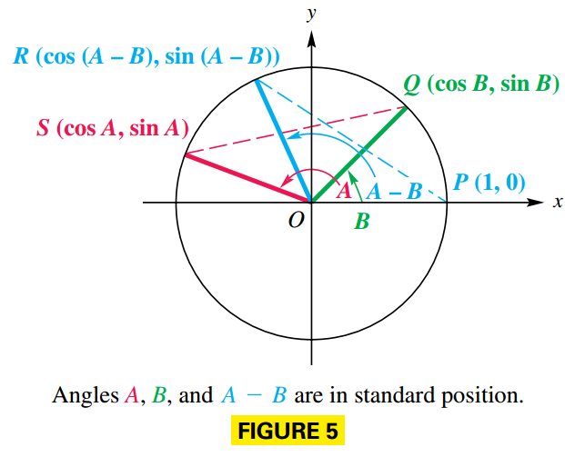
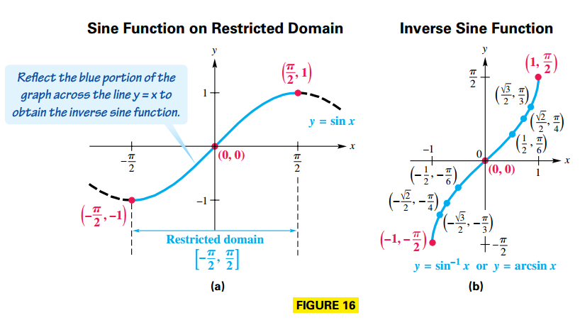
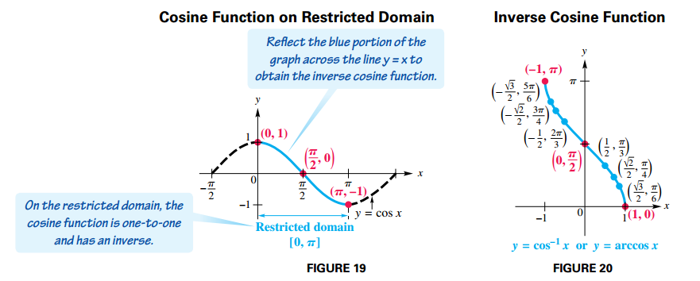
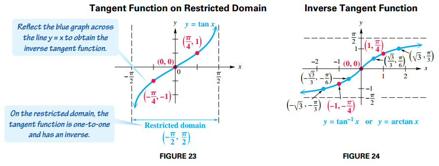

## Trigonometric Identities

### Fundamental Identities

#### Reciprocal Identities

$$
\begin{aligned}
\cot(\theta) = \frac{1}{\tan \theta}
\end{aligned}
$$

$$
\begin{aligned}
\sec(\theta) = \frac{1}{\cos \theta}
\end{aligned}
$$

$$
\begin{aligned}
\csc(\theta) = \frac{1}{\sin \theta}
\end{aligned}
$$

#### Quotient Identities

$$
\begin{aligned}
\tan(\theta) = \frac{\sin \theta}{\cos \theta}
\end{aligned}
$$

$$
\begin{aligned}
\cot(\theta) = \frac{\cos \theta}{\sin \theta}
\end{aligned}
$$

#### Pythagorean Identities

$$
\begin{aligned}
\sin^2 \theta + \cos^2 \theta = 1
\end{aligned}
$$

$$
\begin{aligned}
1 + \tan^2 \theta = \sec^2 \theta
\end{aligned}
$$

$$
\begin{aligned}
1 + \cot^2 \theta = \csc^2 \theta
\end{aligned}
$$

#### Negative-Number Identities

$$
\begin{aligned}
\sin (-\theta) = - \sin \theta
\end{aligned}
$$

$$
\begin{aligned}
\cos (-\theta) = \cos \theta
\end{aligned}
$$

$$
\begin{aligned}
\tan (-\theta) = -\tan \theta
\end{aligned}
$$

$$
\begin{aligned}
\csc (-\theta) = -\csc \theta
\end{aligned}
$$

$$
\begin{aligned}
\sec (-\theta) = \sec \theta
\end{aligned}
$$

$$
\begin{aligned}
\cot (-\theta) = -\cot \theta
\end{aligned}
$$

### Hits for Verifying Identities

1. Learn the fundamental identities.
2. Try to rewrite the more complicated side of the equation.
3. It is sometimes helpful to express all trigonometric functions in the equation in terms of sine and cosine.
4. Usually, any factoring, division involving complex fractions, or indicated algebraic operations should be performed.
5. As you select substitutions, keep in mind the side you are not changing, because it represents your goal.
6. If a fractional expression contains $1 + \sin x$, multiplying both numerator and denominator by $1 - \sin x$ would give $1 - \sin^2 x$, which could be replaced with $\cos^2 x$.

Note that verifying identities is not the same as solving equations. One strategy is to work with only one side and rewrite it to match the other side.

## Sum and Difference Identities

### Cosine Sum and Difference Identities

Let $S$ and $Q$ be the points where the terminal sides of angles $A$ and $B$, respectively, intersect the circle. Locate point $R$ on the unit circle so that angle $POR$ equals the difference $A - B$. See FIGURE 5.

We know:

- $Q$ has coordinates $(\cos B, \sin B)$
- $S$ has coordinates $(\cos A, \sin A)$
- $R$ has coordinates $(\cos (A - B), \sin (A - B))$

Angle $SOQ$ also equals $A - B$. Since the central angles $SOQ$ and $POR$ are equal, chords $PR$ and $SQ$ are equal. By the distance formula:

$$
\begin{aligned}
\sqrt{[\cos (A - B) - 1]^2 + [\sin(A - B) - 0]^2} = \sqrt{(\cos A - \cos B)^2 + (\sin A - \sin B)^2}
\end{aligned}
$$

$$
\begin{aligned}
[\cos (A - B) - 1]^2 + [\sin(A - B) - 0]^2 = (\cos A - \cos B)^2 + (\sin A - \sin B)^2
\end{aligned}
$$

$$
\begin{aligned}
\cos^2 (A - B)+ 1 - 2\cos(A - B) + \sin^2(A - B) = \cos^2 A + \cos^2 B - 2\cos A \cos B + \sin^2 A + \sin^2 B - 2\sin A \sin B
\end{aligned}
$$

Because $\sin^2 x + \cos^2 x = 1$

$$
\begin{aligned}
1 + 1 - 2\cos(A - B) = 1 + 1 - 2\cos A \cos B - 2\sin A \sin B
\end{aligned}
$$

$$
\begin{aligned}
-2\cos(A - B) = - 2\cos A \cos B - 2\sin A \sin B
\end{aligned}
$$

$$
\begin{aligned}
\cos(A - B) = \cos A \cos B + \sin A \sin B
\end{aligned}
$$

For $\cos (A + B)$, rewrite $A + B$ as $A - (- B)$, and use the identity for $\cos (A - B)$:

$$
\begin{aligned}
\cos(A + B) = \cos(A - (-B)) = \cos A \cos (-B) + \sin A \sin (-B)
\end{aligned}
$$

Given $\cos (-x) = \cos x$ and $\sin -x = - \sin x$, then:

$$
\begin{aligned}
= \cos A \cos B - \sin A \sin B
\end{aligned}
$$

### Sine and Tangent Sum and Difference Identities

Use the cofunction identity $\sin \theta = \cos (\frac{\pi}{2} - \theta)$ and replace $\theta$ with $A + B$:

$$
\begin{aligned}
\sin (A + B) = \cos \left[\frac{\pi}{2} - (A + B)\right]
\end{aligned}
$$

$$
\begin{aligned}
= \cos \left[(\frac{\pi}{2} - A) - B)\right]
\end{aligned}
$$

$$
\begin{aligned}
= \cos \left(\frac{\pi}{2} - A\right)\cos B + \sin \left(\frac{\pi}{2} - A\right) \sin B
\end{aligned}
$$

We apply the cofunction identity again for $\cos \left(\frac{\pi}{2} - A\right)$ and $\sin \left(\frac{\pi}{2} - A\right)$:

$$
\begin{aligned}
= \sin A\cos B + \cos A \sin B
\end{aligned}
$$

Now we write $\sin (A - B)$ as $\sin[A + (-B)]$ and use the identity for $\sin (A + B)$:

$$
\begin{aligned}
\sin (A - B) = \sin (A + (-B)) = \sin A\cos (-B) + \cos A \sin (-B)
\end{aligned}
$$

Given $\cos (-x) = \cos x$ and $\sin -x = - \sin x$, then:

$$
\begin{aligned}
= \sin A\cos B - \cos A \sin B
\end{aligned}
$$

To derive the identity for $\tan (A + B)$, proceed as follows

$$
\begin{aligned}
\tan (A + B) = \frac{\sin (A + B)}{\cos (A + B)}
\end{aligned}
$$

$$
\begin{aligned}
= \frac{\sin A \cos B + \cos A \sin B}{\cos A \cos B - \sin A \sin B}
\end{aligned}
$$

We multiply the numerator and denominator by $\frac{1}{\cos A \cos B}$:

$$
\begin{aligned}
= \frac{\frac{\sin A \cos B + \cos A \sin B}{\cos A \cos B}}{\frac{\cos A \cos B - \sin A \sin B}{\cos A \cos B}}
\end{aligned}
$$

$$
\begin{aligned}
= \frac{\frac{\sin A \cos B}{\cos A \cos B} + \frac{\cos A \sin B}{\cos A \cos B}}{\frac{\cos A \cos B}{\cos A \cos B} - \frac{\sin A \sin B}{\cos A \cos B}}
\end{aligned}
$$

$$
\begin{aligned}
= \frac{\frac{\sin A}{\cos A} + \frac{\sin B}{\cos B}}{1 - \frac{\sin A \sin B}{\cos A \cos B}}
\end{aligned}
$$

$$
\begin{aligned}
= \frac{\tan A + \tan B}{1 - \tan A \tan B}
\end{aligned}
$$

Replacing $B$ with $-B$ and the fact that $\tan (-B) = -\tan B$ gives the identity for the tangent of the difference of two numbers:

$$
\begin{aligned}
\tan (A + B) = \tan (A + (-B))= \frac{\tan A + \tan (-B)}{1 - \tan A \tan (-B)}
\end{aligned}
$$

$$
\begin{aligned}
= \frac{\tan A - \tan B}{1 + \tan A \tan B}
\end{aligned}
$$

## Further Identities

### Double-Number Identities

The double-number identities, or double-angle identities, result from the sum identities when $A = B$ so that $A + B = A + A = 2A$.

$$
\begin{aligned}
\cos 2A = \cos(A + A) = \cos A \cos A - \sin A \sin A
\end{aligned}
$$

$$
\begin{aligned}
= \cos^2 A - \sin^2 A
\end{aligned}
$$

Two other common forms of this identity are obtained by substitution:

$$
\begin{aligned}
\cos 2A = \cos^2 A - \sin^2 A = (1 - \sin^2 A) - \sin^2 A
\end{aligned}
$$

$$
\begin{aligned}
1 - 2\sin^2 A
\end{aligned}
$$

and

$$
\begin{aligned}
\cos 2A = \cos^2 A - \sin^2 A = \cos^2 A - (1 - \cos^2 A)
\end{aligned}
$$

$$
\begin{aligned}
= 2\cos^2 A - 1
\end{aligned}
$$

We find $\sin 2A$ with the identity for $\sin (A + B)$

$$
\begin{aligned}
\sin 2A = \sin (A + A) = \sin A \cos A + \sin A \cos A
\end{aligned}
$$

$$
\begin{aligned}
= 2\sin A \cos A
\end{aligned}
$$

Similarly, we use the identity for $\tan (A + B)$ to find $\tan 2A$.

$$
\begin{aligned}
\tan 2A = \tan (A + A) = \frac{\tan A + \tan A}{1- \tan A \tan A}
\end{aligned}
$$

$$
\begin{aligned}
= \frac{2 \tan A}{1 - \tan^2 A}
\end{aligned}
$$

### Product-to-Sum Identities

Adding the identities for $\cos (A + B)$ and $\cos (A - B)$ gives the following:

$$
\begin{aligned}
\cos (A + B) + \cos (A - B) = \cos A \cos B - \sin A \sin B + \cos A \cos B + \sin A \sin B
\end{aligned}
$$

$$
\begin{aligned}
= 2\cos A \cos B
\end{aligned}
$$

Thus:

$$
\begin{aligned}
2 \cos A \cos B = \left[\cos(A + B) + \cos(A - B)\right]
\end{aligned}
$$

$$
\begin{aligned}
\cos A \cos B = \frac{1}{2} \left[\cos(A + B) + \cos(A - B)\right]
\end{aligned}
$$

Substracting $\cos(A - B)$ from $\cos (A + B)$ gives the following:

$$
\begin{aligned}
\cos (A + B) - \cos (A - B) = \cos A \cos B - \sin A \sin B - \cos A \cos B - \sin A \sin B
\end{aligned}
$$

$$
\begin{aligned}
= -2 \sin A \sin B
\end{aligned}
$$

Thus:

$$
\begin{aligned}
- 2 \sin A \sin B = \left[\cos(A + B) - \cos(A - B)\right]
\end{aligned}
$$

$$
\begin{aligned}
2 \sin A \sin B = -\frac{1}{2} \left[\cos(A + B) - \cos(A - B)\right]
\end{aligned}
$$

$$
\begin{aligned}
\sin A \sin B = \frac{1}{2} \left[\cos(A - B) - \cos(A + B)\right]
\end{aligned}
$$

Adding the identities for $\sin (A + B)$ and $\sin (A - B)$ gives the following:

$$
\begin{aligned}
\sin(A + B) + \sin (A - B) = \sin A \cos B + \sin B \cos A + \sin A \cos B - \sin B \cos A
\end{aligned}
$$

$$
\begin{aligned}
= 2 \sin A \cos B
\end{aligned}
$$

Thus:

$$
\begin{aligned}
2 \sin A \cos B = \sin (A + B) + \sin (A - B)
\end{aligned}
$$

$$
\begin{aligned}
\sin A \cos B = \frac{1}{2} \left[\sin (A + B) + \sin (A - B)\right]
\end{aligned}
$$

Substracting $\sin (A - B)$ from $\sin (A + B)$ gives the following:

$$
\begin{aligned}
\sin(A + B) - \sin (A - B) = \sin A \cos B + \sin B \cos A - \sin A \cos B + \sin B \cos A
\end{aligned}
$$

$$
\begin{aligned}
= 2 \sin B \cos A
\end{aligned}
$$

Thus:

$$
\begin{aligned}
2 \sin B \cos A = \sin (A + B) - \sin (A - B)
\end{aligned}
$$

$$
\begin{aligned}
\sin B \cos A = \frac{1}{2} \left[\sin (A + B) - \sin (A - B)\right]
\end{aligned}
$$

### Sum-to-Product Identities

From the previous identities we can derive another group of identities. For the sum of sines we have:

$$
\begin{aligned}
\sin A + \sin B = \sin (\frac{2A}{2} + \frac{B - B}{2}) + \sin (\frac{2B}{2} + \frac{A - A}{2})
\end{aligned}
$$

$$
\begin{aligned}
= \sin (\frac{(A + B) + (A - B)}{2}) + \sin (\frac{(A + B) - (A - B)}{2})
\end{aligned}
$$

If $x = \frac{A + B}{2}$ and $y = \frac{A - B}{2}$, then

$$
\begin{aligned}
= \sin (x + y) + \sin (x - y)
\end{aligned}
$$

By the product to sum identity we have:

$$
\begin{aligned}
= 2 (\sin x \cos y) = 2 \sin(\frac{A + B}{2}) \cos(\frac{A - B}{2})
\end{aligned}
$$

For the difference of sines we have:

$$
\begin{aligned}
\sin A - \sin B = \sin (\frac{2A}{2} + \frac{B - B}{2}) - \sin (\frac{2B}{2} + \frac{A - A}{2})
\end{aligned}
$$

$$
\begin{aligned}
= \sin (\frac{(A + B) + (A - B)}{2}) - \sin (\frac{(A + B) - (A - B)}{2})
\end{aligned}
$$

If $x = \frac{A + B}{2}$ and $y = \frac{A - B}{2}$, then

$$
\begin{aligned}
= \sin (x + y) - \sin (x - y)
\end{aligned}
$$

By the product to sum identity we have:

$$
\begin{aligned}
= 2 (\cos x \sin y) = 2 \cos(\frac{A + B}{2}) \sin(\frac{A - B}{2})
\end{aligned}
$$

For the sum of cosines we have:

$$
\begin{aligned}
\cos A + \cos B = \cos (\frac{2A}{2} + \frac{B - B}{2}) + \cos (\frac{2B}{2} + \frac{A - A}{2})
\end{aligned}
$$

$$
\begin{aligned}
= \cos (\frac{(A + B) + (A - B)}{2}) + \cos (\frac{(A + B) - (A - B)}{2})
\end{aligned}
$$

If $x = \frac{A + B}{2}$ and $y = \frac{A - B}{2}$, then

$$
\begin{aligned}
= 2 \cos (x + y) + \cos (x - y)
\end{aligned}
$$

By the product to sum identity we have:

$$
\begin{aligned}
= 2 (\cos x \cos y) = 2 \cos(\frac{A + B}{2}) \cos(\frac{A - B}{2})
\end{aligned}
$$

For the difference of cosines we have:

$$
\begin{aligned}
\cos A - \cos B = \cos (\frac{2A}{2} + \frac{B - B}{2}) - \cos (\frac{2B}{2} + \frac{A - A}{2})
\end{aligned}
$$

$$
\begin{aligned}
= \cos (\frac{(A + B) + (A - B)}{2}) - \cos (\frac{(A + B) - (A - B)}{2})
\end{aligned}
$$

If $x = \frac{A + B}{2}$ and $y = \frac{A - B}{2}$, then

$$
\begin{aligned}
= \cos (x + y) - \cos (x - y)
\end{aligned}
$$

By the product to sum identity we have:

$$
\begin{aligned}
= -2 (\sin x \sin y) = -2 \sin(\frac{A + B}{2}) \sin(\frac{A - B}{2})
\end{aligned}
$$

### Half-Number Identities

We derive identities for $\sin \frac{A}{2}$, $\cos \frac{A}{2}$ and $\tan \frac{A}{2}$. These are known as **half-number identities**, or **half-angle identities**.

We derive the identity for $\cos \frac{A}{2}$ as follows:

$$
\begin{aligned}
\cos 2x = 2 \cos^2 x - 1
\end{aligned}
$$

$$
\begin{aligned}
\cos 2x + 1 = 2 \cos^2 x
\end{aligned}
$$

$$
\begin{aligned}
\cos x = \pm \sqrt{\frac{1 + \cos 2x}{2}}
\end{aligned}
$$

Now we replace $x$ with $\frac{A}{2}$, such that:

$$
\begin{aligned}
\cos \frac{A}{2} = \pm \sqrt{\frac{1 + \cos A}{2}}
\end{aligned}
$$

We derive the identity for $\sin \frac{A}{2}$ as follows:

$$
\begin{aligned}
\cos 2x = 1 - 2 \sin^2 x
\end{aligned}
$$

$$
\begin{aligned}
\frac{1 - \cos 2x}{2} = \sin^2 x
\end{aligned}
$$

$$
\begin{aligned}
\sin x = \pm \sqrt{\frac{1 - \cos 2x}{2}}
\end{aligned}
$$

Now we replace $x$ with $\frac{A}{2}$ to obtain:

$$
\begin{aligned}
\sin \frac{A}{2} = \pm \sqrt{\frac{1 - \cos A}{2}}
\end{aligned}
$$

An identity for $\tan \frac{A}{2}$ comes from the half-number identities for sine and cosine.

$$
\begin{aligned}
\tan {\frac{A}{2}} = \frac{\sin \frac{A}{2}}{\cos \frac{A}{2}}
\end{aligned}
$$

$$
\begin{aligned}
= \frac{\pm \sqrt{\frac{1 - \cos A}{2}}}{\pm \sqrt{\frac{1 + \cos A}{2}}}
\end{aligned}
$$

$$
\begin{aligned}
= \pm \sqrt{\frac{\frac{1 - \cos A}{2}}{\frac{1 + \cos A}{2}}} = \pm \sqrt{\frac{1 - \cos A}{1 + \cos A}}
\end{aligned}
$$

We derive an alternative identity for $\tan \frac{A}{2}$ by using double-number identities.

$$
\begin{aligned}
\tan \frac{A}{2} = \frac{\sin \frac{A}{2}}{\cos \frac{A}{2}}
\end{aligned}
$$

We multiply by $2 \cos \frac{A}{2}$ on both the numerator and the denominator:

$$
\begin{aligned}
= \frac{2 \sin \frac{A}{2} \cos \frac{A}{2}}{2 \cos^2 \frac{A}{2}}
\end{aligned}
$$

We apply the double-number identity $\sin 2A = 2 \sin A \cos A$ and $\cos 2A = 2 \cos^2 A - 1$:

$$
\begin{aligned}
= \frac{\sin \left[2 \frac{A}{2}\right]}{1 + \cos\left[2 \frac{A}{2}\right]}
\end{aligned}
$$

$$
\begin{aligned}
= \frac{\sin A}{1 + \cos A}
\end{aligned}
$$

If we multiply this identity by $\frac{1 - \cos A}{1 - \cos A}$ we obtain:

$$
\begin{aligned}
= \frac{(\sin A)(1 - \cos A)}{(1 + \cos A) (1 - \cos A)}
\end{aligned}
$$

$$
\begin{aligned}
= \frac{(\sin A)(1 - \cos A)}{1 - \cos^2 A}
\end{aligned}
$$

Given $\cos^2 x + \sin^2 x = 1$:

$$
\begin{aligned}
= \frac{(\sin A)(1 - \cos A)}{\sin^2 A}
\end{aligned}
$$

$$
\begin{aligned}
= \frac{1 - \cos A}{\sin A}
\end{aligned}
$$

## The Inverse Circular Functions

### Inverse Sine Function

Applying the horizontal line test, we see that $y = \sin x$ does not define a one-to-one function. If we restrict the domain to the interval $[-\frac{\pi}{2}, \frac{\pi}{2}]$ the function is one-to-one and has an inverse function. See FIGURE 16:

$y = \sin^{-1} x$ or $y = \arcsin x$ means that $x = \sin y$, for $-\frac{\pi}{2} \leq y \leq \frac{\pi}{2}$

### Inverse Cosine Function

The function $y = \cos^{-1} x$ (or $y = \arccos x$) is defined by restricting the domain of the function to the interval $[0, \pi]$, as in FIGURE 19. The graph of $y = \cos^{-1} x$ is shown in FIGURE 20.

$y = \cos^{-1} x$ or $y = \arccos x$ means that $x = \cos y$, for $0 \leq y \leq \pi$.

### Inverse Tangent Function

Restricting the domain of the function $y = \tan x$ to the open interval $(-\frac{\pi}{2}, \frac{\pi}{2})$ yields a one-to-one function. FIGURE 23 shows the graph of the restricted tangent function. FIGURE 24 gives the graph of $y = \tan^{-1} x$.

$y = \tan^{-1} x$ or $y = \arctan x$ means $x = \tan y$, for $-\frac{\pi}{2} < y < \frac{\pi}{2}$

### Other Inverse Trigonometric Functions

$y = \cot^{-1} x$ or $y = arc\cot x$ means that $x = \cot y$, for $0 < y < \pi$.

$y = \sec^{-1} x$ or $y = arc\sec x$ means that $x = \sec y$, for $0 \leq y \leq \pi, y \neq \frac{\pi}{2}$.

$y = \csc^{-1} x$ or $y = arc\csc x$ means that $x = \csc y$, for $-\frac{\pi}{2} \leq y \leq \frac{\pi}{2}, y \neq 0$

Finding $\cot^{-1} x$, $\sec^{-1} x$, and $\csc^{-1} x$ can be achieved by expressing these functions in terms of $\tan^{-1} x$, $\cos{-1} x$ and $\sin^{-1} x$.

If $y = \sec^{-1} x$, then $\sec y = x$, so it follows:

$$
\begin{aligned}
\sec y = \frac{1}{\cos y} = x
\end{aligned}
$$

$$
\begin{aligned}
\cos y = \frac{1}{x}
\end{aligned}
$$

Therefore:

$$
\begin{aligned}
y = \cos^{-1}\left(\frac{1}{x}\right)
\end{aligned}
$$

For the cosecant function:

$$
\begin{aligned}
\csc y = \frac{1}{\sin y} = x
\end{aligned}
$$

$$
\begin{aligned}
\sin y = \frac{1}{x}
\end{aligned}
$$

Therefore:

$$
\begin{aligned}
y = \sin^{-1}\left(\frac{1}{x}\right)
\end{aligned}
$$

Finally the inverse cotangent function can be evaluated as $90º - \tan^{-1}x$.
