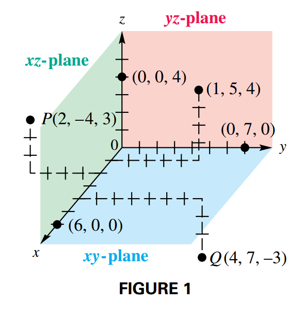
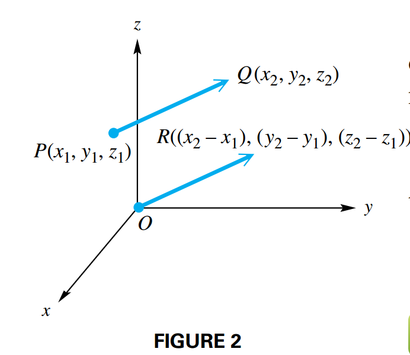
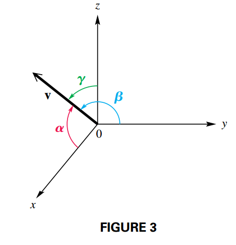
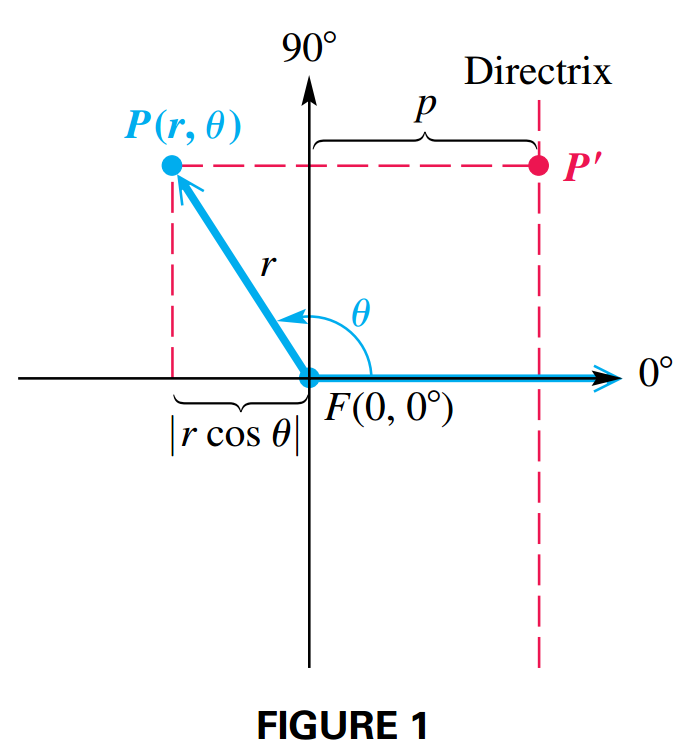
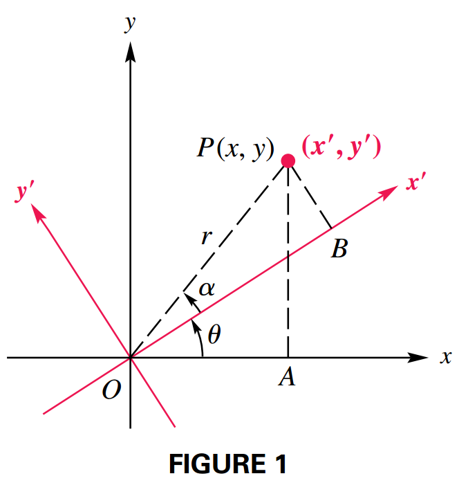

## Vectors in Space

### Rectangular Coordinates in Space

On a three dimensional space, we associate each point with an **ordered triple** $(x, y, z)$ (see FIGURE 1). The region of three-dimensional space where are coordinates are positive is called the **first octant**. There are eight octants in all.

#### Distance Formula

If $P_1(x_1, y_1, z_1)$ and $P_2(x_2, y_2, z_2)$ are two points in a three-dimensional coordinate system, then the distance between $P_1$ and $P_2$ is given by:

$$
\begin{aligned}
d(P_1, P_2) = \sqrt{(x_2 - x_1)^2 + (y_2 - y_1)^2 + (z_2 - z_1)^2}
\end{aligned}
$$

### Vectors in Space

We denote a vector $\textbf{v}$ in space with initial point $O$ at the origin as:

$$
\begin{aligned}
\textbf{v} = \langle a, b, c \rangle
\end{aligned}
$$

Using the unit vectors $\textbf{i} = \langle 1, 0, 0 \rangle$, $\textbf{j} = \langle 0, 1, 0 \rangle$ and $\textbf{k} = \langle 0, 0, 1 \rangle$, we can represent $\textbf{v}$ as:

$$
\begin{aligned}
\textbf{v} = a\textbf{i} + b \textbf{j} + c \textbf{k}
\end{aligned}
$$

where the scalars $a$, $b$ and $c$ are the **components** of vector $\textbf{v}$.

Not all vectors are position vectors, and they are computed differently. For example, the component form of vector $\textbf{PQ}$ is represented as follows:

$$
\begin{aligned}
\textbf{PQ} = \langle x_2 - x_1, y_2 - y_1, z_2 - z_1 \rangle
\end{aligned}
$$

As FIGURE 2 suggests, $\textbf{PQ}$ is equal to the following position vector:

$$
\begin{aligned}
\textbf{OR} = (x_2 - x_1)\textbf{i} + (y_2 - y_1)\textbf{j} + (z_2 - z_1)\textbf{k}
\end{aligned}
$$

### Vector Definitions and Operations

If $\textbf{v} = a\textbf{i} + b\textbf{j} + c\textbf{k}$ and $\textbf{w} = d\textbf{i} + e \textbf{j} + f\textbf{k}$ are vectors and $g$ is a scalar, the following hold.

- $\textbf{v} = \textbf{w}$ if and only if $a = d$, $b = e$ and $c = f$.
- $\textbf{v} + \textbf{w} = (a + d)\textbf{i} + (b + e)\textbf{j} + (c + f)\textbf{k}$
- $\textbf{v} - \textbf{w} = (a - d)\textbf{i} + (b - e)\textbf{j} + (c - f)\textbf{k}$
- $g\textbf{v} = ga \textbf{i} + gb \textbf{j} + gc \textbf{k}$
- $|\textbf{v}| = \sqrt{a^2 + b^2 + c^2}$
- $\textbf{v} \cdot \textbf{w} = ad + be + cf$

### Angle between Two Vectors

If $\theta$ is the angle between two nonzero vectors $\textbf{v}$ and $\textbf{w}$, where $0º \leq \theta \leq 180º$, then:

$$
\begin{aligned}
\cos \theta = \frac{\textbf{v} \cdot \textbf{w}}{|\textbf{v}||\textbf{w}|}
\end{aligned}
$$

### Direction Angles in Space

In three dimensions, a vector is determined by its magnitude and three direction angles. As shown in FIGURE 3:

- $\alpha$ is the direction angle between $\textbf{v}$ and the positive $x$-axis
- $\beta$ is the direction angle between $\textbf{v}$ and the positive $y$-axis
- $\gamma$ is the direction angle between $\textbf{v}$ and the positive $z$-axis

We can evaluate these angles using the expression for the cosine of the angle between two vectors. Note that $\textbf{i} = \langle 1, 0, 0 \rangle$, $\textbf{j} = \langle 0, 1, 0 \rangle$ and $\textbf{k} = \langle 0, 0, 1 \rangle$, where each one has magnitude $1$. For $\textbf{v} = a\textbf{i} + b \textbf{j} + c\textbf{k}$:

$$
\begin{aligned}
\cos \alpha = \frac{\textbf{v} \cdot \textbf{i}}{|\textbf{v}||\textbf{i}|} = \frac{a}{|\textbf{v}|}
\end{aligned}
$$

$$
\begin{aligned}
\cos \beta = \frac{\textbf{v} \cdot \textbf{j}}{|\textbf{v}||\textbf{j}|} = \frac{b}{|\textbf{v}|}
\end{aligned}
$$

$$
\begin{aligned}
\cos \gamma = \frac{\textbf{v} \cdot \textbf{k}}{|\textbf{v}||\textbf{k}|} = \frac{c}{|\textbf{v}|}
\end{aligned}
$$

These quantities, $\cos \alpha$, $\cos \beta$ and $\cos \gamma$ are called **direction cosines**. And they satisfy:

$$
\begin{aligned}
\cos^2 \alpha + \cos^2 \beta + \cos^2 \gamma = 1
\end{aligned}
$$

## Polar Form of Conic Sections

### Polar Forms of Conic Sections

A polar equation of the form:

$$
\begin{aligned}
r = \frac{ep}{1 \pm e \cos \theta}
\end{aligned}
$$

or

$$
\begin{aligned}
r = \frac{ep}{1 \pm e \sin \theta}
\end{aligned}
$$

has a conic section as its graph. The eccentricity is $e$ (where $e > 0$), and $|p|$ is the distance between the pole (focus) and the directrix.

We can verify that those equations satisfy the [definition of a conic section](../07_analytic_geometry#eccentricity). Consider FIGURE 1, where the directrix is vertical and $p > 0$ units to the right of the focus $F(0, 0º)$. Let $P(r, \theta)$ be a point on the graph, then the distance between $P$ and the directrix is obtained as:

$$
\begin{aligned}
PP' = |p - x|
\end{aligned}
$$

$$
\begin{aligned}
= |p - r \cos \theta|
\end{aligned}
$$

We substitute $r$ by $\frac{ep}{1 \pm e \cos \theta}$.

$$
\begin{aligned}
= |p - \left(\frac{ep}{1 \pm e \cos \theta} \right) \cos \theta|
\end{aligned}
$$

$$
\begin{aligned}
= |\frac{(1 + e \cos \theta) - ep\cos \theta}{1 \pm e \cos \theta} |
\end{aligned}
$$

$$
\begin{aligned}
= |\frac{p + ep \cos \theta - ep\cos \theta}{1 \pm e \cos \theta}|
\end{aligned}
$$

$$
\begin{aligned}
= |\frac{p}{1 \pm e \cos \theta}|
\end{aligned}
$$

Given:

$$
\begin{aligned}
r = \frac{ep}{1 \pm e \cos \theta}
\end{aligned}
$$

Then we can multiply each side by $\frac{1}{e}$

$$
\begin{aligned}
\frac{r}{e} = \frac{p}{1 \pm e \cos \theta}
\end{aligned}
$$

We substitute this expression for $\frac{r}{e}$:

$$
\begin{aligned}
PP' = |\frac{p}{1 \pm e \cos \theta}| = |\frac{r}{e}| = \frac{|r|}{|e|} = \frac{|r|}{e}
\end{aligned}
$$

Note that $e > 0$, therefore $|e| = e$.

The distance between the pole and $P$ is $PF = |r|$, so the ratio of $PF$ to $PP'$ is:

$$
\begin{aligned}
\frac{PF}{PP'} = \frac{|r|}{\frac{|r|}{e}} = e
\end{aligned}
$$

Thus, by definition, the graph has eccentricity $e$ and must be a conic.

In the previous discussion, we assumed a vertical directrix to the right of the pole. There a re three other possible situations:

| Equation                           | Directrix                                    |
| ---------------------------------- | -------------------------------------------- |
| $r = \frac{ep}{1 + e \cos \theta}$ | vertical, $p$ units to the right of the pole |
| $r = \frac{ep}{1 - e \cos \theta}$ | vertical, $p$ units to the left of the pole  |
| $r = \frac{ep}{1 + e \sin \theta}$ | horizontal, $p$ units above the pole         |
| $r = \frac{ep}{1 - e \sin \theta}$ | horizontal, $p$ units below the pole         |

## Rotation of Axes

### Derivation of Rotation Equations

Given a $xy$-coordinate system having origin $O$. If we rotate the axes about $O$ through an angle $\theta$, the new coordinate system is called a **rotation** of the $xy$-system.

Let $P$ be any point other than the origin, with coordinates $(x, y)$ in the $xy$-system and $(x', y')$ in the $x'y'$-system (See FIGURE 1). Let $OP = r$ and $\alpha$ be the angle made by $OP$ and the $x'$ axis. Then the following holds:

$$
\begin{aligned}
\cos (\theta + \alpha) = \frac{OA}{r} = \frac{x}{r}
\end{aligned}
$$

$$
\begin{aligned}
\sin (\theta + \alpha) = \frac{AP}{r} = \frac{y}{r}
\end{aligned}
$$

$$
\begin{aligned}
\cos (\alpha) = \frac{OB}{r} = \frac{x'}{r}
\end{aligned}
$$

$$
\begin{aligned}
\sin (\alpha) = \frac{PB}{r} = \frac{y'}{r}
\end{aligned}
$$

Such that we can rewrite the statements as follows:

$$
\begin{aligned}
x = r \cos (\theta + \alpha)
\end{aligned}
$$

$$
\begin{aligned}
y = r \sin (\theta + \alpha)
\end{aligned}
$$

$$
\begin{aligned}
x' = r \cos \alpha
\end{aligned}
$$

$$
\begin{aligned}
y' = r \sin \alpha
\end{aligned}
$$

Therefore:

$$
\begin{aligned}
x = r \cos (\theta + \alpha)
\end{aligned}
$$

$$
\begin{aligned}
= r (\cos\theta \cos\alpha - \sin\theta \sin \alpha)
\end{aligned}
$$

$$
\begin{aligned}
= \cos\theta (r\cos\alpha) - \sin\theta (r\sin \alpha)
\end{aligned}
$$

$$
\begin{aligned}
= \cos\theta x' - \sin\theta y'
\end{aligned}
$$

The same goes for $y$

$$
\begin{aligned}
y = r \sin (\theta + \alpha)
\end{aligned}
$$

$$
\begin{aligned}
= r (\sin\theta \cos\alpha + \cos\theta \sin \alpha)
\end{aligned}
$$

$$
\begin{aligned}
= \sin\theta (r\cos\alpha) + \cos\theta (r\sin \alpha)
\end{aligned}
$$

$$
\begin{aligned}
= \sin\theta x' + \cos\theta y'
\end{aligned}
$$

### Angle of Rotation

The $xy$-term is removed from the standard equation:

$$
\begin{aligned}
Ax^2 + Bxy + Cy^2 + Dx + Ey + F = 0
\end{aligned}
$$

by a rotation of the axes through an angle $\theta$, $0º < \theta < 90º$, where:

$$
\begin{aligned}
\cot 2\theta = \frac{A - C}{B}
\end{aligned}
$$

### Equations of Conics with xy-Term

If the standard second-degree equation:

$$
\begin{aligned}
Ax^2 + Bxy + Cy^2 + Dx + Ey + F = 0
\end{aligned}
$$

has a graph, it will be one of the following:

- A circle or an ellipse (or a point) if $B^2 - 4AC < 0$
- A parabola (or one line or two parallel lines) if $B^2 - 4AC = 0$
- A hyperbola (or two intersecting lines) if $B^2 - 4AC > 0$
- A straight line if $A = B = C = 0$ and $D \neq 0$ or $E \neq 0$
