## Four Ways to Represent a Function

### Representation of Functions

We consider four different ways to represent a function:

- Verbally: by a description in words.
- Numerically: by a table of values.
- Visually: by a graph.
- Algebraically: by an explicit formula.

A function with an explicit formula that approximates the behavior of a given "true" function its called a **mathematical model**.

## Mathematical Models: A Catalog of Essential Functions

### Mathematical Model

A **mathematical model** is a mathematical description (generally by the means of a function or an equation) of a real-world phenomenon. Its purpose is to understan the phenomenon and perhaps make predictions about future behaviour.

The process of mathematical modeling is a follows:

1. Formulate a mathematical model by identifying the independent and dependent variables and making assumptions that simplify the phenomenon.
2. Apply the mathematics that we know to derive mathematical conclusions.
3. Take those mathematics conclusions and interpret them as information about the original real-world phenomenon.
4. Test our predictions against real-world data.

This process is illustrated on the following figure.

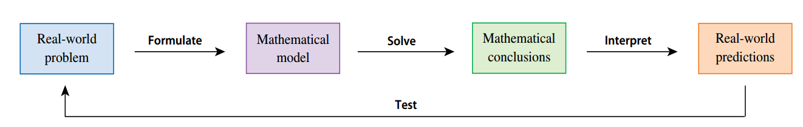

If there is no physical law or principle to help us formulate a model, we construct an **empirical model** that is a model that captures the basic trend of the data points.

### Algebraic Function

A function $f$ is an **algebraic function** if it can be constructed using algebraic operations (such as addition, substraction, multiplication, division and taking roots).

Functions that are not algebraic are called **transcendental**, these include trigonometric, exponential and logarithmic functions.

### Faimilies of Essential Functions and Their Graphs

On the following table we show a summary of graphs of some families of essential functions.

| Function                | Form                           | Graph                                                            |
| ----------------------- | ------------------------------ | ---------------------------------------------------------------- |
| Linear Function         | $f(x) = mx + b$                | 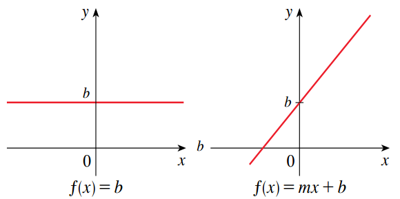           |
| Power Function          | $f(x) = x^n$                   | 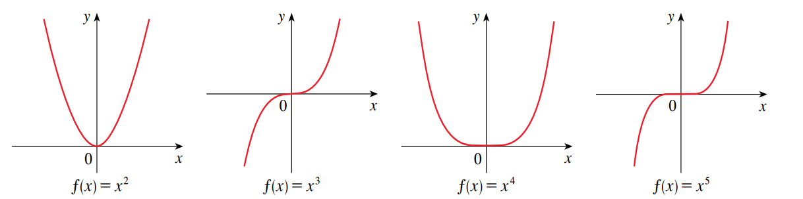             |
| Root Function           | $f(x) = \sqrt[n]{x}$           |                |
| Reciprocal Function     | $f(x) = \frac{1}{\sqrt[n]{x}}$ | 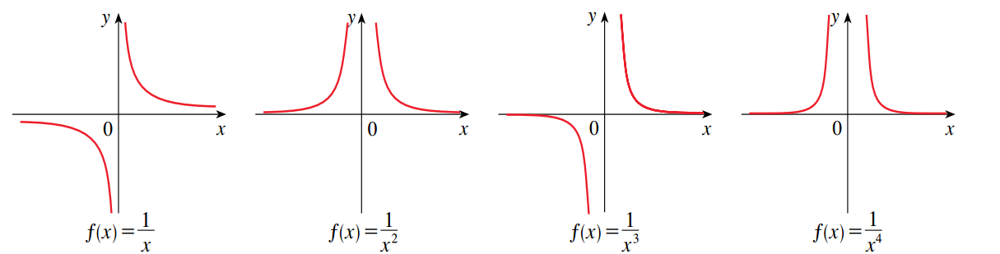   |
| Exponential Function    | $f(x) = b^x$                   |  |
| Logarithmic Function    | $f(x) = \log_b x$              | 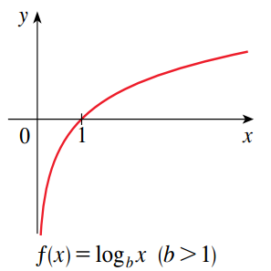 |
| Trigonimetric Functions | $f(x) = \sin x$                | 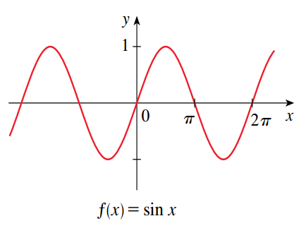               |
| Trigonimetric Functions | $f(x) = \cos x$                | 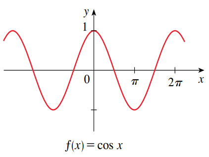           |
| Trigonimetric Functions | $f(x) = \tan x$                | 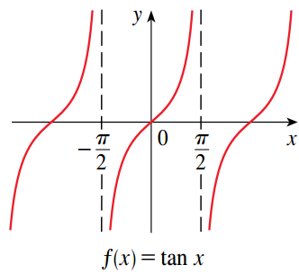         |

## New Functions from Old Functions

See the following for the theory on function transformations:

- [Vertical and Horizontal Shifts of Graphs](../../agaa/02_graph_analysis#vertical-and-horizontal-shifts-of-graphs)
- [Stretching, Shrinking and Reflecting Graphs](../../agaa/02_graph_analysis#vertical-and-horizontal-shifts-of-graphsstretching-shrinking-and-reflecting-graphs)

And for more information on [Operations and Composition](../../agaa/02_graph_analysis#composition-of-functions).

## Exponential Functions

### The Number e

Figures 12 and 13 show the tangent lines to the graphs of $y = 2^x$ and $y = 3^x$ at the point $(0, 1)$. The slopes for these tangent lines are $m \approx 0.7$ and $m \approx 1.1$ respectively.

Some formulas of calculus will be simplified if we choose the base $b$ so that the slope of the tangent line to $y = b^x$ at $(0, 1)$ is exactly $1$ (see Figure 14). Such a base is denoted by the letter $e$. This notation was chosen by the Swiss mathematician Leonhard Euler in 1727.

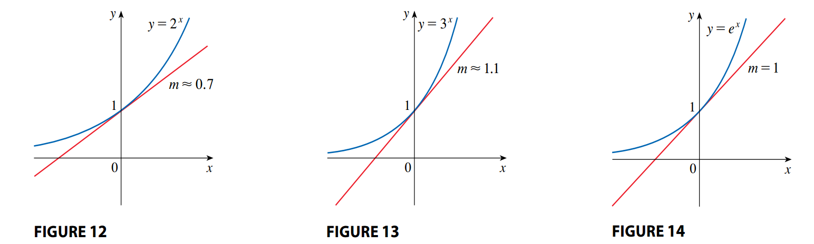

## Inverse Functions and Logarithms

### Inverse Functions

We know that a function is [one-to-one](../../agaa/05_exp_functions#one-to-one-functions) graphically by applying the [horizontal line test](../../agaa/05_exp_functions#horizontal-line-test).

Any function $f$ has an [inverse](../../agaa/05_exp_functions#inverse-function) if and only if $f$ is one-to-one.

#### Cancellation Equations

Given a function $f: A \rightarrow B$ whose inverse $f^{-1}$ exists, then its cancellation equations are defined as follows:

$$
\begin{aligned}
f^{-1}(f(x)) = x, \forall x \in A
\end{aligned}
$$

$$
\begin{aligned}
f(f^{-1}(x)) = x, \forall x \in B
\end{aligned}
$$

On the first cancellation equation $f^{-1}$ undoes what $f$ does, and viceversa for the second equation.

#### Graphing the Inverse

The [process of finding the inverse](../../agaa/05_exp_functions#finding-the-equation-of-the-inverse-of-y--ƒx) gives us a method for obtaining the graph of $f^{-1}$ from the graph of $f$.

Since $f(a) = b$ if and only if $f^{-1}(b) = a$ then the point $(a, b)$ is on the graph of $f$ if and only if the point $(b, a)$ is on the graph $f^{-1}$. But we get the point $(b, a)$ from $(a, b)$ by reflecting about the line $y = x$ (See Figure 8).

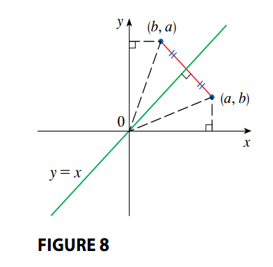

So the graph of $f^{-1}$ is obtained by reflecting the graph of $f$ about the line $y = x$.

### Logarithmic Functions

If $b > 0$ and $b \neq 1$ then the exponential function $f(x) = b^x$ is either increasing or decreasing, and so it is one-to-one. Therefore its inverse exists and is called the logarithmic function with base $b$:

$$
\begin{aligned}
\log_b x = y \leftrightarrow b^y = x
\end{aligned}
$$

If we apply the [cancellation equations](#cancellation-equations) we obtain:

$$
\begin{aligned}
\log_b(b^x) = x, \forall x \in \mathbb{R}
\end{aligned}
$$

$$
\begin{aligned}
b^{\log_b x} = x, \forall x > 0
\end{aligned}
$$

The logarithmic function has domain $(0, \infty)$ and range $\mathbb{R}$. Its graph is the reflection of the graph of $y = b^x$ about the line $y = x$ (See Figure 11).

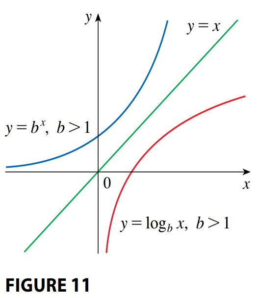

### Natural Logarithms

The logarithm with base $e$ is called the **natural logarithm** and is denoted as:

$$
\begin{aligned}
\log_e x = \ln x
\end{aligned}
$$

If we apply the [cancellation equations](#cancellation-equations) we obtain:

$$
\begin{aligned}
\ln(e^x) = x, x \in \mathbb{R}
\end{aligned}
$$

$$
\begin{aligned}
e^{\ln x} = x, x > 0
\end{aligned}
$$

In particular if we set $x = 1$ we get:

$$
\begin{aligned}
\ln e = 1
\end{aligned}
$$

Therefore:

$$
\begin{aligned}
x^r = \left(e^{\ln(x)}\right)^r = e^{r \ln(x)}
\end{aligned}
$$

### Inverse Trigonometric Functions

Trigonometric functions are not one-to-one, as their are periodic function. However if their domain to an interval that "lats" one period of the function then it is one-to-on.

#### Inverse Sine Function

The inverse of the sine function is denoted by $\sin^{-1}$ or $\arcsin$, and it is defined as:

$$
\begin{aligned}
\sin^{-1}(x) = y \leftrightarrow \sin y = x, -\frac{\pi}{2} \leq y \leq \frac{\pi}{2}
\end{aligned}
$$

As you can see the domain has been restricted to $[-\frac{\pi}{2}, \frac{-pi}{2}]$ (See Figure 18).

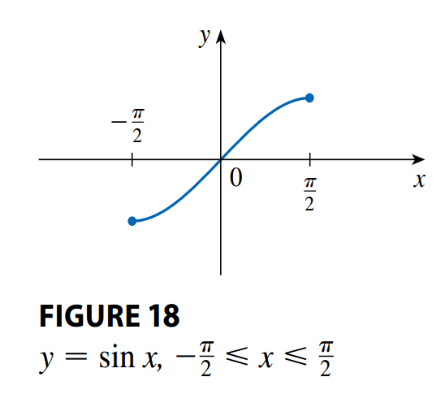

By the [cancellation equations](#cancellation-equations) we obtain:

$$
\begin{aligned}
\sin^{-1}(\sin x) = x, -\frac{\pi}{2} \leq x \leq \frac{\pi}{2}
\end{aligned}
$$

$$
\begin{aligned}
\sin(\sin^{-1} x) = x, -1 \leq x \leq 1
\end{aligned}
$$

The inverse sine function has domain $[-1, 1]$ and range $[-\frac{\pi}{2}, \frac{\pi}{2}]$ and its graph is shown on Figure 20.

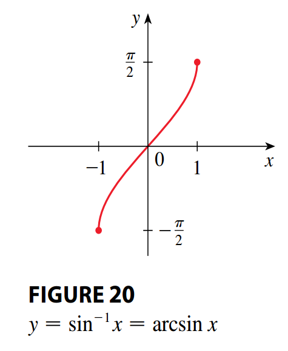

#### Inverse Cosine Function

The inverse of the cosine function is denoted by $\cos^{-1}$ or $\arccos$, and it is defined as:

$$
\begin{aligned}
\cos^{-1}(x) = y \leftrightarrow \cos y = x, 0 \leq y \leq \pi
\end{aligned}
$$

As you can see the domain has been restricted to $[0, \pi]$ (See Figure 21).

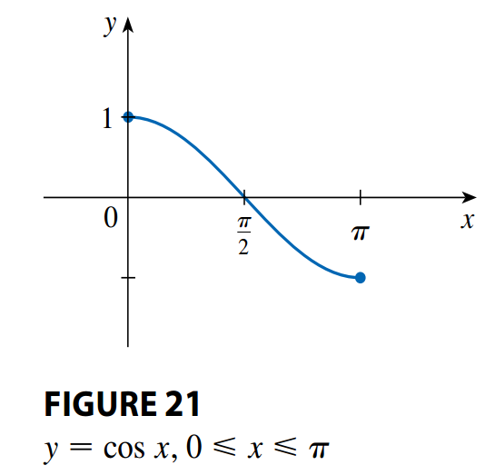

By the [cancellation equations](<#Cancellation Equations>) we obtain:

$$
\begin{aligned}
\cos^{-1}(\cos x) = x, 0 \leq x \leq \pi
\end{aligned}
$$

$$
\begin{aligned}
\cos(\cos^{-1} x) = x, -1 \leq x \leq 1
\end{aligned}
$$

The inverse cosine function has domain $[-1, 1]$ and range $[0, \pi]$ and its graph is shown on Figure 22.

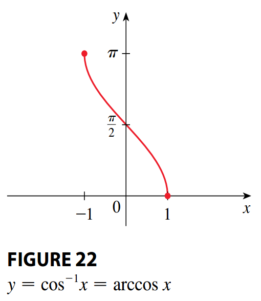

#### Inverse Tangent Function

The inverse of the tangent function is denoted by $\tan^{-1}$ or $\arctan$, and it is defined as:

$$
\begin{aligned}
\tan^{-1}(x) = y \leftrightarrow \tan y = x, -\frac{\pi}{2} \leq y \leq \frac{\pi}{2}
\end{aligned}
$$

As you can see the domain has been restricted to $[-\frac{\pi}{2}, \frac{\pi}{2}]$ (See Figure 23).

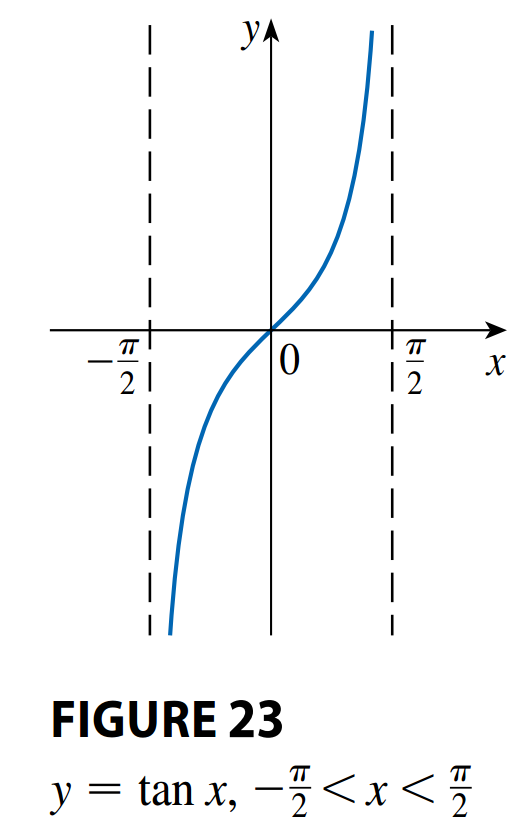

By the [cancellation equations](<#Cancellation Equations>) we obtain:

$$
\begin{aligned}
\tan^{-1}(\tan x) = x, -\frac{\pi}{2} \leq x \leq \frac{\pi}{2}
\end{aligned}
$$

$$
\begin{aligned}
\tan(\tan^{-1} x) = x, -1 \leq x \leq 1
\end{aligned}
$$

The inverse tangent function has domain $[-1, 1]$ and range $[-\frac{\pi}{2}, \frac{\pi}{2}]$ and its graph is shown on Figure 25.

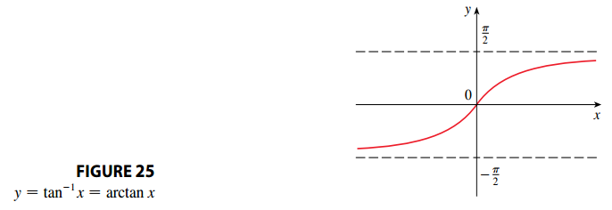

We know that the lines $x = \pm \frac{\pi}{2}$ are vertical asymptotes of the graph of the tangent function. Since the graph of $\tan^{-1}$ is obtained by reflecting the graph of the restricted tangnet function about the line $y = x$, the the lines $y = \frac{\pi}{2}$ and $y = -\frac{\pi}{2}$ are horizontal asymptotes of the graph of $\tan^{-1}$.

#### Other Inverse Functions

[See](../../agaa/09_trig_identities#other-inverse-trigonometric-functions) for information about the remaning inverse trigonometric functions.
