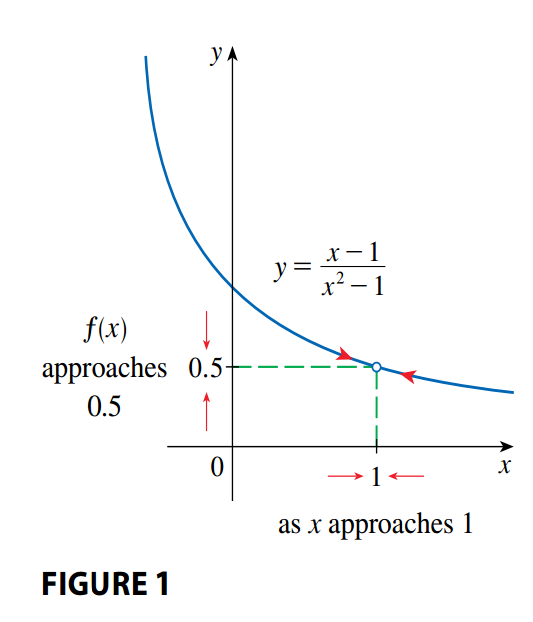
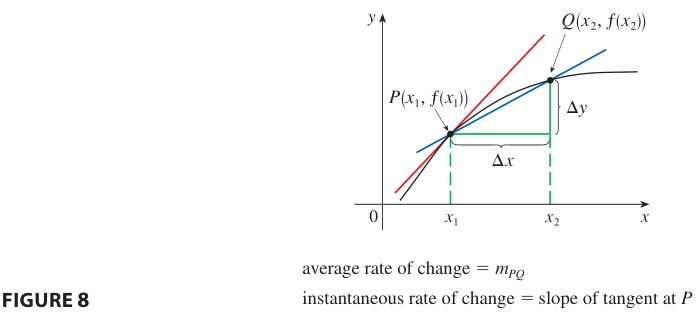

## The Tangent and Velocity Problems

### The Tangent Problem

We can think of a tangent to a curve as a line that touches the curve an follows the same direction as the curve at the point of contact.

Let's look at the next example, where we want to find an equation for the tangent line to the parabola $y = x^2$ at point $P(1, 1)$. To do so we only need to know the slope $m$, however to find the slope of the line we need two points on the curve, and as of now we only have $P(1, 1)$.

But observe that we can compute an approximation by choosing a nearby point $Q(x, x^2)$ (see Figure 2) and computing the slope $m_{PQ}$ of the secant line $PQ$. (A **secant line** if a line that intersects a curve more than once):

$$
\begin{aligned}
m_{PQ} = \frac{x^2 - 1}{x - 1}
\end{aligned}
$$

On the following tables we see that the closer $Q$ is to $P$, that is the closer $x$ is to $1$, then the closer $m_{PQ}$ is to $2$.

| $x$     | $m_{PQ}$ |
| ------- | -------- |
| $2$     | $3$      |
| $1.5$   | $2.5$    |
| $1.1$   | $2.1$    |
| $1.01$  | $2.01$   |
| $1.001$ | $2.001$  |

| $x$     | $m_{PQ}$ |
| ------- | -------- |
| $0$     | $1$      |
| $0.5$   | $1.5$    |
| $0.9$   | $1.9$    |
| $0.99$  | $1.99$   |
| $0.999$ | $1.999$  |

This suggests that the slope of the tangent line is the **limit** of the slopes of the secant lines:

$$
\begin{aligned}
\lim_{Q \rightarrow P} m_{PQ} = m
\end{aligned}
$$

$$
\begin{aligned}
\lim_{x \rightarrow 1} \frac{x^2 - 1}{x - 1} = 2
\end{aligned}
$$

Assuming that the slope of the tangent is indeed $2$, we define the equation of the tangent line through $(1, 1)$ as:

$$
\begin{aligned}
y - 1 = 2(x - 1)
\end{aligned}
$$

$$
\begin{aligned}
y = 2x - 1
\end{aligned}
$$

Figure 3 illustrates the process that occurs on this example. As $Q$ approaches $P$ the secant lines rotate about $P$ and approach the tangent line $\mathcal{l}$.

Another method to approximate the slope of the tangent line at $P$ is to measure the sides of a triangle $ABC$ as in Figure 5:

This gives an estimate of the slope of the tangent line as:

$$
\begin{aligned}
- \frac{AB}{BC} \approx -\frac{8.0 - 5.4}{0.06 - 0.02} = -65.0
\end{aligned}
$$

### The Velocity Problem

The **instantaneous velocity** is defined to be the **limiting value** of the average velocities over shorter and shorter time periods. Thus there is a close connection between the tangent problem and the velocity problem. If we draw the grapf of the distance function and we consider points $P(5, f(5))$ and $Q(5 + h, f(5 + h))$ (see Figure 6).

Then the slope of the secant line $PQ$ is:

$$
\begin{aligned}
m_{PQ} = \frac{f(5 + h) - f(5)}{(5 + h) - 5}
\end{aligned}
$$

which is the same as the average velocity over the time interval $[5, 5 + h]$.

## The Limit of a Function

### Limits

Suppose $f(x)$ is defined when $x$ is near the number $a$, then we write:

$$
\begin{aligned}
\lim_{x \rightarrow a} f(x) = L
\end{aligned}
$$

If we can make the values of $f(x)$ arbitrarily close to $L$ by restricting $x$ to be sufficiently close to $a$ (on either side of $a$) but not equal to $a$ (See Figure 1).

An alternative notation is:

$$
\begin{aligned}
f(x) \rightarrow L \text{ as } x \rightarrow a
\end{aligned}
$$

Notice that we never consider $x = a$. In fact, $f(x)$ need not even be defined when $x = a$. The only thing that matters is how $f$ is defined near $a$.

### One-Sided Limits

The notation $t \rightarrow 0^{-}$ indicates that we consider only values of $t$ that are less than 0. Likewise, $t \rightarrow 0^{+}$ indicates that we consider only values of $t$ that are greater than 0.

We write:

$$
\begin{aligned}
\lim_{x \rightarrow a^{-}} f(x) = L
\end{aligned}
$$

and say that the **left-hand limit** of $f(x)$ as $x$ approaches $a$ is equal to $L$ if we can make the values of $f(x)$ arbitrarily clsoe to $L$ by restricting $x$ to be sufficiently close to $a$ with $x$ less than $a$.

We write:

$$
\begin{aligned}
\lim_{x \rightarrow a^{+}} f(x) = L
\end{aligned}
$$

and say that the **right-hand limit** of $f(x)$ as $x$ approaches $a$ is equal to $L$ if we can make the values of $f(x)$ arbitrarily clsoe to $L$ by restricting $x$ to be sufficiently close to $a$ with $x$ greater than $a$.

See Figure 6 for a graphical representation.

By both definitions, we see that the following is true:

$$
\begin{aligned}
\lim_{x \rightarrow a} f(x) = L \leftrightarrow \lim_{x \rightarrow a^{-}} f(x) = L \text{ and } \lim_{x \rightarrow a^{+}} f(x) = L
\end{aligned}
$$

### How Can a Limit Fail to Exist?

A limit fails to exist at a number $a$ if the left- and right-hand limits are not equal.

When guessing the value of a limit it is easy to guess the wrong value if we use inapproapriate values of $x$. It is also hard to know when to stop calculating value (sometimes calculators and computers give the wrong values due to precission issues).

#### Infinite Limits: Vertical Asymptotes

Another way a limit at a number $a$ can fail to exist is when the function values grow arbitrarily large (in absolute value) as $x$ approaches $a$.

Let $f$ be a function defined on both sides of $a$, except possible at $a$ itself, then:

$$
\begin{aligned}
\lim_{x \rightarrow a} f(x) = \infty
\end{aligned}
$$

means that the values of $f(x)$ can be arbitrarily large by taking $x$ sufficiently close to $a$, but not equal to $a$ (See Figure 10).

Let $f$ be a function defined on both sides of $a$, except possible at $a$ itself, then:

$$
\begin{aligned}
\lim_{x \rightarrow a} f(x) = -\infty
\end{aligned}
$$

means that the values of $f(x)$ can be arbitrarily large negative by taking $x$ sufficiently close to $a$, but not equal to $a$ (See Figure 11).

This does not mean that the limit exists, it simply expresses the particular way in which the limit does not exist.

Similar definitions can be given for one-sided limits:

$$
\begin{aligned}
\lim_{x \rightarrow a^{-}} f(x) = \infty
\end{aligned}
$$

$$
\begin{aligned}
\lim_{x \rightarrow a^{-}} f(x) = -\infty
\end{aligned}
$$

$$
\begin{aligned}
\lim_{x \rightarrow a^{+}} f(x) = \infty
\end{aligned}
$$

$$
\begin{aligned}
\lim_{x \rightarrow a^{+}} f(x) = -\infty
\end{aligned}
$$

These are illustrated on the following figure:

#### Vertical Asymptotes

The vertical line $x = a$ is called a **vertical asymptotes** of the curve $y = f(x)$ if at least one of the following statements is true:

$$
\begin{aligned}
\lim_{x \rightarrow a} f(x) = \infty
\end{aligned}
$$

$$
\begin{aligned}
\lim_{x \rightarrow a} f(x) = -\infty
\end{aligned}
$$

$$
\begin{aligned}
\lim_{x \rightarrow a^{-}} f(x) = \infty
\end{aligned}
$$

$$
\begin{aligned}
\lim_{x \rightarrow a^{-}} f(x) = -\infty
\end{aligned}
$$

$$
\begin{aligned}
\lim_{x \rightarrow a^{+}} f(x) = \infty
\end{aligned}
$$

$$
\begin{aligned}
\lim_{x \rightarrow a^{+}} f(x) = -\infty
\end{aligned}
$$

## Calculating Limits Using the Limits Laws

### Properties of Limits

Supporse that $c$ is a constant and the limits:

$$
\begin{aligned}
\lim_{x \rightarrow a} f(x)
\end{aligned}
$$

$$
\begin{aligned}
\lim_{x \rightarrow a} g(x)
\end{aligned}
$$

exist. Then:

**Sum Law**

$$
\begin{aligned}
\lim_{x \rightarrow a} [f(x) + g(x)] = \lim_{x \rightarrow a} f(x) + \lim_{x \rightarrow a} g(x)
\end{aligned}
$$

**Difference Law**

$$
\begin{aligned}
\lim_{x \rightarrow a} [f(x) - g(x)] = \lim_{x \rightarrow a} f(x) - \lim_{x \rightarrow a} g(x)
\end{aligned}
$$

**Constant Multiple Law**

$$
\begin{aligned}
\lim_{x \rightarrow a} [cf(x)] = c\lim_{x \rightarrow a} f(x)
\end{aligned}
$$

**Product Law**

$$
\begin{aligned}
\lim_{x \rightarrow a} [f(x) g(x)] = \lim_{x \rightarrow a} f(x) \cdot \lim_{x \rightarrow a} g(x)
\end{aligned}
$$

**Quotient Law**

$$
\begin{aligned}
\lim_{x \rightarrow a} [\frac{f(x)}{g(x)}] = \frac{\lim_{x \rightarrow a} f(x)}{\lim_{x \rightarrow a} g(x)}
\end{aligned}
$$

If we use the Product Law repeteadly with $g(x) = f(x)$, then we arrive at the **Power Law**:

$$
\begin{aligned}
\lim_{x \rightarrow a} \left[f(x)\right]^n = [\lim_{x \rightarrow a} f(x)]^n
\end{aligned}
$$

**Root Law**

$$
\begin{aligned}
\lim_{x \rightarrow a} \sqrt[n]{f(x)} = \sqrt[n]{\lim_{x \rightarrow a} f(x)}
\end{aligned}
$$

Let's now see two special limits:

$$
\begin{aligned}
\lim_{x \rightarrow a} c = c
\end{aligned}
$$

$$
\begin{aligned}
\lim_{x \rightarrow a} x = a
\end{aligned}
$$

If we now let $f(x) = x$ on the **Power Law** and use $\lim_{x \rightarrow a} x = a$, then:

$$
\begin{aligned}
\lim_{x \rightarrow a} x^n = [\lim_{x \rightarrow a} x]^n = a^n
\end{aligned}
$$

If we now let $f(x) = x$ on the **Root Law** and use $\lim_{x \rightarrow a} x = a$, then:

$$
\begin{aligned}
\lim_{x \rightarrow a} \sqrt[n]{x} = \sqrt[n]{\lim_{x \rightarrow a} x} = \sqrt[n]{a}
\end{aligned}
$$

where $n$ is a positive integer. Also, if $n$ is even then we assume that $a > 0$.

### Evaluating Limits by Direct Substitution

The **Limit Laws** prove that direct substitution can be used to obtain the value of a limit for polynomial and rational functions.

If $f$ is a polynomial or a rational function and $a$ is in the domain of $f$, then:

$$
\begin{aligned}
\lim_{x \rightarrow a} f(x) = f(a)
\end{aligned}
$$

Functions that satisfy this property are said to be **continuous** at $a$. However, not all limits can be evaluated initially by direct substitution.

### Limit Equality

If $f(x) = g(x)$ when $x \neq a$, then $\lim_{x \rightarrow a} f(x) = \lim_{x \rightarrow a} g(a)$

### Using One-Sided Limits

We say:

$$
\begin{aligned}
\lim_{x \rightarrow a} f(x) = L
\end{aligned}
$$

if and only if

$$
\begin{aligned}
\lim_{x \rightarrow a^{-}} f(x) = L = \lim_{x \rightarrow a^{+}} f(x)
\end{aligned}
$$

### The Squeeze Theorem

The following two theorems describe how the limits of functions are related when the values of one function are greater than (or equal to) those of another.

If $f(x) \leq g(x)$ when $x$ is near $a$ (except possibly at $a$) and the limits of $f$ and $g$ both exist as $x$ approaches $a$, then:

$$
\begin{aligned}
\lim_{x \rightarrow a} f(x) \leq \lim_{x \rightarrow a} g(x)
\end{aligned}
$$

The **Squeeze Theorem** states:

If $f(x) \leq g(x) \leq h(x)$ when $x$ is near $a$ (except possibly at $a$) and:

$$
\begin{aligned}
\lim_{x \rightarrow a} f(x) = \lim_{x \rightarrow a} h(x) = L
\end{aligned}
$$

then:

$$
\begin{aligned}
\lim_{x \rightarrow a} g(x) = L
\end{aligned}
$$

This theorem is illustrated on Figure 7. It says that if $g(x)$ is squeezed between $f(x)$ and $h(x)$ near $a$, and if $f$ and $h$ have the same limit $L$ at $a$, then $g$ is forced to have the same limit $L$ at $a$.

## The Precise Definition of a Limit

### The Precise Definition of a Limit

As motivation consier the following function:

$$
\begin{aligned}
f(x) = \begin{cases}
2x - 1 & \text{ if } x \neq 3 \\
6 & \text{ if } x = 3 \\
\end{cases}
\end{aligned}
$$

Think about how close to $3$ does $x$ have to be so that $f(x)$ differs from $5$ less than $0.1$?

We know that the distance from $x$ to $3$ is $|x - 3|$ and the distance from $f(x)$ to $5$ is $|f(x) - 5|$, so out problem becomes:

$$
\begin{aligned}
| f(x) - 5 | < 0.1 \text{ if } 0 < | x - 3 | < \delta
\end{aligned}
$$

Notice that if:

$$
\begin{aligned}
0 < |x - 3| < \frac{0.1}{2} = 0.5
\end{aligned}
$$

then:

$$
\begin{aligned}
|f(x) - 5| = |(2x - 1) - 5| = |2x - 6| = 2|x - 3| < 2(0.05) = 0.1
\end{aligned}
$$

that is:

$$
\begin{aligned}
|f(x) - 5| < 0.1 \text { if } 0 < |x - 3| < 0.05
\end{aligned}
$$

Thus an answer to the proposed problem is given by $\delta = 0.05$. However, if we change the limit $0.1$ to $0.01$ by using the same method we find that $\delta = 0.005$, such that:

$$
\begin{aligned}
|f(x) - 5| < 0.01 \text { if } 0 < |x - 3| < 0.005
\end{aligned}
$$

And similarly:

$$
\begin{aligned}
|f(x) - 5| < 0.001 \text { if } 0 < |x - 3| < 0.0005
\end{aligned}
$$

These values: $0.1, 0.01$ and $0.001$ are what we call **error tolerances**. But to actually compute the limit we must be able to find a $\delta$ for any arbitrarily small positive number $\epsilon$:

$$
\begin{aligned}
|f(x) - 5| < \epsilon \text { if } 0 < |x - 3| < \delta = \frac{\epsilon}{2}
\end{aligned}
$$

This is the precise way of saying that $f(x)$ is close to $5$ when $x$ is close to $3$ because the previous statement says that we can make the values of $f(x)$ within an arbitrary distance $\epsilon$ from $5$ by restricting $x$ to be within a distance $\frac{\epsilon}{2}$ from $3$ (See Figure 1).

The precise definition of a limit is as follows:

Let $f$ be a function defined on some open interval that contains the number $a$, except possible at $a$ itself. Then we say that the limit of $f(x)$ as $x$ approaches $a$ is $L$ and we write:

$$
\begin{aligned}
\lim_{x \rightarrow a} f(x) = L
\end{aligned}
$$

if for every number $\epsilon > 0$ there is a number $\delta > 0$ such that:

$$
\begin{aligned}
\text{ if } 0 < |x - a| < \delta \text{ then } |f(x) - L| < \epsilon
\end{aligned}
$$

We can reformulate this definition in terms of intervals:

$$
\begin{aligned}
\lim_{x \rightarrow a} f(x) = L
\end{aligned}
$$

means that for every $\epsilon > 0$ we can find $\delta > 0$ such that if $x \in (a - \delta, a + \delta)$ and $x \neq a$, then $f(x) \in (L - \epsilon, L + \epsilon)$ (See Figure 3).

Also we can interpret the definition geometrically in terms of the graph of a function. If $\epsilon > 0$ is given we draw horizontal lines $y = L + \epsilon$ and $y = L - \epsilon$ as well as the graph of $f$ (see Figure 4).

If $\lim_{x \rightarrow a} f(x) = L$ then we can find a number $\delta > 0$ such that if $x \in (a - \delta, a + \delta)$ and $x \neq a$, then the curve $y = f(x)$ lies between the lines $y = L - \epsilon$ and $y = L + \epsilon$ (see Figure 5). Once $\delta$ has been found, then any smaller $\delta$ will also work.

Note that this process must work for every positive number $\epsilon$, no matter how small (See Figure 6).

### One-Sided Limits

#### Precise Definition of Left-Hand Limit

$$
\begin{aligned}
\lim_{x \rightarrow a^{-}} f(x) = L
\end{aligned}
$$

if for every number $\epsilon > 0$ there is a number $\delta > 0$ such that:

$$
\begin{aligned}
\text{ if } a - \delta < x < a \text{ then } |f(x) - L| < \epsilon
\end{aligned}
$$

that is, $x$ is restricted to lie in the left half of the interval $(a - \delta, a + \delta)$.

#### Precise Definition of Right-Hand Limit

$$
\begin{aligned}
\lim_{x \rightarrow a^{+}} f(x) = L
\end{aligned}
$$

if for every number $\epsilon > 0$ there is a number $\delta > 0$ such that:

$$
\begin{aligned}
\text{ if } a < x < a + \delta \text{ then } |f(x) - L| < \epsilon
\end{aligned}
$$

that is, $x$ is restricted to lie in the right half of the interval $(a - \delta, a + \delta)$.

### Limit Laws

Up until now we have used the [precise definition of a limit](#the-precise-definition-of-a-limit) to compute the limit of a given function. However if we were given a more complicated funtion a proof would require a great deal of ingenuity.

Fortunately we can use the [Limit Laws](#limit-laws), which can be proved using the definition of a limit. So the limits of complicated function can be found rigorously from the Limit Laws without resorting to the definition directly.

#### Proof of the Sum Law

The Sum Law states that if the limits:

$$
\begin{aligned}
\lim_{x \rightarrow a} f(x)
\end{aligned}
$$

$$
\begin{aligned}
\lim_{x \rightarrow a} g(x)
\end{aligned}
$$

exist. Then:

$$
\begin{aligned}
\lim_{x \rightarrow a} [f(x) + g(x)] = \lim_{x \rightarrow a} f(x) + \lim_{x \rightarrow a} g(x)
\end{aligned}
$$

**Proof**

Let $\epsilon > 0$ be given, we must find $\delta > 0$ such that:

$$
\begin{aligned}
\text{ if } 0 < |x - a| < \delta \text{ then } |f(x) + g(x) - (L + M)| < \epsilon
\end{aligned}
$$

By the means of the Triangle Inequality:

$$
\begin{aligned}
| f(x) + g(x) - (L + M) | = | (f(x) - L) + (g(x) - M) | \leq | f(x) - L | + | g(x) - M |
\end{aligned}
$$

We make $|f(x) + g(x) - (L + M)|$ less that $\epsilon$ by letting:

$$
\begin{aligned}
| f(x) - L | < \frac{\epsilon}{2}
\end{aligned}
$$

and

$$
\begin{aligned}
| g(x) - M | < \frac{\epsilon}{2}
\end{aligned}
$$

Since $\frac{\epsilon}{2} > 0$ and $\lim_{x \rightarrow a} f(x) = L$ there exists a number $\delta_1 > 0$ such that:

$$
\begin{aligned}
\text{ if } 0 < |x - a| < \delta_1 \text{ then } |f(x) - L| < \frac{\epsilon}{2}
\end{aligned}
$$

Similarly, since $\frac{\epsilon}{2} > 0$ and $\lim_{x \rightarrow a} g(x) = M$ there exists a number $\delta_2 > 0$ such that:

$$
\begin{aligned}
\text{ if } 0 < |x - a| < \delta_2 \text{ then } |g(x) - M| < \frac{\epsilon}{2}
\end{aligned}
$$

Let $\delta = \min\{\delta_1, \delta_2\}$, notice:

$$
\begin{aligned}
\text{ if } 0 < |x - a| < \delta \text{ then } 0 < |x - a| < \delta_1 \text{ and } 0 < |x - a| < \delta_2
\end{aligned}
$$

and also:

$$
\begin{aligned}
| f(x) - L | < \frac{\epsilon}{2} \text{ and } | g(x) - M | < \frac{\epsilon}{2}
\end{aligned}
$$

And, therefore by the triangle inequality we showed before:

$$
\begin{aligned}
|f(x) + g(x) - (L + M)| \leq | f(x) - L | + | g(x) - M | < \frac{\epsilon}{2} + \frac{\epsilon}{2} = \epsilon
\end{aligned}
$$

Thus, by the definition of a limit:

$$
\begin{aligned}
\lim_{x \rightarrow a} [f(x) + g(x)] = L + M
\end{aligned}
$$

### Infinite Limits

Let $f$ be a function defined on some open interval that contains the number $a$, except possibly at $a$ itself. Then:

$$
\begin{aligned}
\lim_{x \rightarrow a} f(x) = \infty
\end{aligned}
$$

means that for every postive number $M$ there is a positive number $\delta$ such that:

$$
\begin{aligned}
\text{ if } 0 < |x - a| < \delta \text{ then } f(x) > M
\end{aligned}
$$

This says that the values of $f(x)$ ca be made arbitrarily large (larger than any given number $M$) by requiring $x$ to be close enough to $a$ (See Figure 10).

Let $f$ be a function defined on some open interval that contains the number $a$, except possibly at $a$ itself. Then:

$$
\begin{aligned}
\lim_{x \rightarrow a} f(x) = -\infty
\end{aligned}
$$

means that for every postive number $N$ there is a positive number $\delta$ such that:

$$
\begin{aligned}
\text{ if } 0 < |x - a| < \delta \text{ then } f(x) < N
\end{aligned}
$$

See Figure 11.

## Continuity

### Continuity of a Function

A function $f$ is **continuous at a number** $a$ if:

$$
\begin{aligned}
\lim_{x\rightarrow a} f(x) = f(a)
\end{aligned}
$$

This definition implicitly requires:

1. $f(a)$ is defined
2. $\lim_{x\rightarrow a} f(x)$ exists
3. $\lim_{x\rightarrow a} f(x) = f(a)$

This definition says that $f$ is continuous at $a$ if $f(x)$ approaches $f(a)$ as $x$ approaches $a$.

And we say that $f$ is **discontinuous** at $a$ if $f$ is not continuous at $a$. We distinguish three cases of discontinuity:

- **Removable discontinuity**

- **Infinite discontinuity**

- **Jump discontinuity**

A function $f$ **continuous from the right at a number** $a$ if:

$$
\begin{aligned}
\lim_{x\rightarrow a^{+}} f(x) = f(a)
\end{aligned}
$$

A function $f$ **continuous from the left at a number** $a$ if:

$$
\begin{aligned}
\lim_{x\rightarrow a^{-}} f(x) = f(a)
\end{aligned}
$$

A function $f$ **is continuous on an interval** if it is continuous at every number on the interval.

### Properties of Continuous Functions

If $f$ and $g$ are continuous at a number $a$ and $c$ is constant, then the following functions are also continuous at $a$:

- $f + g$
- $f - g$
- $cf$
- $f\cdot g$
- $\frac{f}{g}, g(a) \neq 0$

**Proof**

Since $f$ and $g$ are continuous at $a$ we have that:

$$
\begin{aligned}
\lim_{x \rightarrow a} f(x) = f(a)
\end{aligned}
$$

and

$$
\begin{aligned}
\lim_{x \rightarrow a} g(x) = g(a)
\end{aligned}
$$

by the [Properties of Limits](#properties-of-limits):

$$
\begin{aligned}
\lim_{x \rightarrow a} [f(x) + g(x)] = [\lim_{x \rightarrow a} f(x)] + [\lim_{x \rightarrow a} g(x)]
\end{aligned}
$$

$$
\begin{aligned}
= f(a) + g(a) = (f + g)(a)
\end{aligned}
$$

And thus, $f + g$ is continuous at $a$.

### Continuity of Polynomial and Rational Functions

- Any polynomial functions is continuous on $\mathbb{R}$.

**Proof**

A polynomial is a function of the form:

$$
\begin{aligned}
P(x) = c_nx^n + c_{n-1}x^{n-1} + \cdots + c_1x + c_0
\end{aligned}
$$

where $c_i \in \mathbb{R}$, we know that:

$$
\begin{aligned}
\lim_{x \rightarrow a} c_0 = c_0
\end{aligned}
$$

and

$$
\begin{aligned}
\lim_{x \rightarrow a} x^m = a^m, m = 1, 2, \cdots, n
\end{aligned}
$$

therefore:

$$
\begin{aligned}
\lim_{x \rightarrow a} P(x) = \lim_{x \rightarrow a} c_nx^n + c_{n-1}x^{n-1} + \cdots + c_1x + c_0
\end{aligned}
$$

by the [Properties of Limits](#properties-of-limits):

$$
\begin{aligned}
\lim_{x \rightarrow a} P(x) = \sum_{i = 0}^n \lim_{x \rightarrow a} c_i x^{i}
\end{aligned}
$$

$$
\begin{aligned}
= \left(\sum_{i = 1}^n \lim_{x \rightarrow a} c_i x^{i}\right) + \lim_{x \rightarrow} c_0
\end{aligned}
$$

$$
\begin{aligned}
= \left(\sum_{i = 1}^n c_i a^i\right) + c_0
\end{aligned}
$$

$$
\begin{aligned}
= P(a)
\end{aligned}
$$

Thus $P$ is continuous at $a$, where $a \in \mathbb{R}$.

- Any ration function is continuous whenever it is defined, that is, it is continuous on its domain.

**Proof**

A rational function is a function of the form:

$$
\begin{aligned}
f(x) = \frac{P(x)}{Q(x)}
\end{aligned}
$$

where $P$ and $Q$ are polynomials. The domain of $f$ is $D = \{x \in \mathbb{R} | Q(x) \neq 0\}$. So we now, by the previous proof, that $P$ and $Q$ are continuous everywhere. Thus by the [Properties of Continuous Functions](#properties-of-continuous-functions) $f$ is continuous at every number in $D$ (its domain).

### Continuous Functions

The following types of functions are continuous on their domains:

- Polynomial functions
- Rational functions
- Root functions
- Trigonometric functions
- Inverse trigonometric functions
- Exponential functions
- Logarithmic functions

Note that the inverse of a continuous one-to-one function is also continuous. Our geometric intuitions makes it seem plausible: we know that the graph of $f^{-1}$ is obtained by reflecting the graph of $f$ on the line $y = x$. So if the graph of $f$ has no break in it (the function is continuous), then the graph of $f^{-1}$ also has no break in it.

### Continuity of Composite Functions

If $f$ is continuous at $b$ and $\lim_{x \rightarrow a} g(x) = b$, then $\lim_{x \rightarrow a} f(g(x)) = b$, that is:

$$
\begin{aligned}
\lim_{x \rightarrow a} f(g(x)) = f\left(\lim_{x \rightarrow a} g(x)\right)
\end{aligned}
$$

If $g$ is continuous at $a$ and $f$ is continuous at $g(a)$, then the composite function $f \circ g$, given by $(f \circ g)(x) = f(g(x))$ is continuous at $a$

**Proof**

Since $g$ is continuous at $a$ we have that:

$$
\begin{aligned}
\lim_{x \rightarrow a} g(x) = g(a)
\end{aligned}
$$

Since $f$ is continuous at $b = g(a)$ we have that:

$$
\begin{aligned}
\lim_{x \rightarrow a} f(g(x)) = f(b) = f(g(a))
\end{aligned}
$$

thus $f \circ g$ is continuous at $a$.

### The Intermediate Value Theorem

Suppose that $f$ is continuous at the closed interval $[a, b]$ and let $N$ be any number between $f(a)$ and $f(b)$, where $f(a) \neq f(b)$. There there exists a number $c \in (a, b)$, such that $f(c) = N$.

The Intermediate Value Theorem states that a continuous functions takes on every intermediate value between the function values $f(a)$ and $f(b)$ (See Figure 8).

## Limits at Infinity. Horizontal Asymptotes

### Intuitive Definition of a Limit at Infinity

Let $f$ be a function defined on some interval $(a, \infty)$, then:

$$
\begin{aligned}
\lim_{x\rightarrow \infty} f(x) = L
\end{aligned}
$$

means that the values of $f(x)$ can be made arbitrarily close to $L$ by requiring $x$ to be sufficiently large.

Geometric illustration of this defintion are shown in Figure $2$.

Let $f$ be a function defined on some interval $(-\infty, a)$, then:

$$
\begin{aligned}
\lim_{x\rightarrow -\infty} f(x) = L
\end{aligned}
$$

means that the values of $f(x)$ can be made arbitrarily close to $L$ by requiring $x$ to be sufficiently large negative.

This definition is illustrated in Figure $3$.

### Horizontal Asymptote

The line $y = L$ is called a **horizontal asymptote** of the curve $y = f(x)$ if either:

$$
\begin{aligned}
\lim_{x \rightarrow \infty} f(x) = L
\end{aligned}
$$

or

$$
\begin{aligned}
\lim_{x \rightarrow -\infty} f(x) = L
\end{aligned}
$$

### Evaluating Limits at Infinity

Most of the [Limit Laws](#properties-of-limits) also hold for limits at infinity, with the exception of Laws $10$ and $11$.

Let's see the following theorem on the limit at infinity of a rational function:

If $r > 0$ is a rational number, then:

$$
\begin{aligned}
\lim_{x \rightarrow \infty} \frac{1}{x^r} = 0
\end{aligned}
$$

If $r > 0$ is a rational number such that $x^r$ is defined for all $x$, then:

$$
\begin{aligned}
\lim_{x \rightarrow -\infty} \frac{1}{x^r} = 0
\end{aligned}
$$

### Infinite Limits at Infinity

The notation:

$$
\begin{aligned}
\lim_{x \rightarrow \infty} f(x) = \infty
\end{aligned}
$$

means that the values of $f(x)$ become large as $x$ becomes large. Similarly:

$$
\begin{aligned}
\lim_{x \rightarrow -\infty} f(x) = \infty
\end{aligned}
$$

$$
\begin{aligned}
\lim_{x \rightarrow \infty} f(x) = -\infty
\end{aligned}
$$

$$
\begin{aligned}
\lim_{x \rightarrow -\infty} f(x) = -\infty
\end{aligned}
$$

In general, the [Limit Laws](#properties-of-limits) cannot be applied to infinite limits, because $\infty$ is not a number.

### Precise Definition of a Limit at Infinity

Let $f$ be a function defined on some interval $(a, \infty)$, then:

$$
\begin{aligned}
\lim_{x \rightarrow \infty} f(x) = L
\end{aligned}
$$

means that for every $\epsilon > 0$ there is a corresponding number $N$ such that:

$$
\begin{aligned}
\text{ if } x > N \text{ then } |f(x) - L| < \epsilon
\end{aligned}
$$

In words, this says that the values of $f(x)$ can be mace arbitrarily cloe to $L$ by requiring $x$ to be sufficiently lare.

Graphically it says that by keeping $x$ large enough we can make the graph of $f$ lie between the given horizontal lines $y = L - \epsilon$ and $y = L + \epsilon$ as in Figure 14.

Let $f$ be a function defined on some interval $(-\infty, a)$, then:

$$
\begin{aligned}
\lim_{x \rightarrow -\infty} f(x) = L
\end{aligned}
$$

means that for every $\epsilon > 0$ there is a corresponding number $N$ such that:

$$
\begin{aligned}
\text{ if } x < N \text{ then } |f(x) - L| < \epsilon
\end{aligned}
$$

This definition is illustrated on Figure 16.

### Precise Definition of an Infinite Limit at Infinity

Let $f$ be a function defined on some interval $(a, \infty)$, then:

$$
\begin{aligned}
\lim_{x \rightarrow \infty} f(x) = \infty
\end{aligned}
$$

means that for every positive number $M$ there is a corresponding positive number $N$ such that:

$$
\begin{aligned}
\text{ if } x > N \text{ then } f(x) > M
\end{aligned}
$$

This definition is illustrated on Figure 19.

Similar definitions apply when the symbol $\infty$ is replaced by $-\infty$.

## Derivatives and Rates of Change

### Tangents

The **tangent line** to the curve $y = f(x)$ at the point $P(a, f(a))$ is the line through $P$ with slope:

$$
\begin{aligned}
m = \lim_{x \rightarrow a} \frac{f(x) - f(a)}{x - a}
\end{aligned}
$$

Provided that this limit exists (See Figure 1).

We sometimes refer to the slope of the tangent line to a curve at a point as the **slope of the curve** at the point. If we zoom in far enough toward the point, the curve looks almost like a straight line (See Figure 2).

There is another expression for the slope of a tangent line. If $h = x - a$, then $x = a + h$, and so the slope of the secant line $PQ$ becomes:

$$
\begin{aligned}
m_{PQ} = \frac{f(a + h) - f(a)}{h}
\end{aligned}
$$

See Figure 3.

Notice that as $x$ approaches $a$, then $h$ approaches $0$. Therefor3 the definition of the slope of the tangent line becomes:

$$
\begin{aligned}
m = \lim_{h \rightarrow 0} \frac{f(a + h) - f(a)}{h}
\end{aligned}
$$

### Velocities

Suppose an object moves along a straight line following the equation $s = f(t)$, where $s$ is the displacement of the object from the origin at time $t$. The function $f$ that describes the motion is called **position function**.

In the time interval from $t = a$ to $t = a + h$ the change is position is $f(a + h) - f(a)$ (See Figure 5).

The average velocity over this time interval is:

$$
\begin{aligned}
\text{average velocity} = \frac{\text{displacement}}{\text{time}} = \frac{f(a + h) - f(a)}{h}
\end{aligned}
$$

Now suppose we compute the average velocities over shorter and shorter time intervals, that is, we let $h$ approach $0$. We define the **velocity** or **instantaneous velocity** $v(a)$ at time $t = a$ to be the limit of these average velocities:

$$
\begin{aligned}
v(a) = \lim_{h \rightarrow 0} \frac{f(a + h) - f(a)}{h}
\end{aligned}
$$

Provided that this limit exists.

### Derivatives

Limits of the form:

$$
\begin{aligned}
\lim_{h \rightarrow 0} \frac{f(a + h) - f(a)}{h}
\end{aligned}
$$

arise whenever we calculate a rate of change in any of the sciences or engineering.

The **derivative of a function** $f$ **at a number** $a$, denoted by $f'(a)$ is:

$$
\begin{aligned}
f'(a) = \lim_{h \rightarrow 0} \frac{f(a + h) - f(a)}{h}
\end{aligned}
$$

if this limit exists.

Letting $x = a + h \leftrightarrow h = x - a$, then an equivalent way of this definition is:

$$
\begin{aligned}
f'(a) = \lim_{x \rightarrow a} \frac{f(x) - f(a)}{x - a}
\end{aligned}
$$

We defined the tangent line to the curve $y = f(x)$ at $P(a, f(a))$ to be the line that passes through $P$ and has slope $m$. By the previous definition this slope $m$ is the same as the derivative $f'(a)$.

If we use the point-slope form of the equation of a line, we can write an equation of the tangent line to the curve $y = f(x)$ at the point $(a, f(a))$:

$$
\begin{aligned}
y - f(a) = f'(a)(x - a)
\end{aligned}
$$

### Rates of Change

Suppose that $y$ is a quantity that depends on another quantity $x$, we write $y = f(x)$. If $x$ changes to $x_1$ to $x_2$, then the change in $x$ is:

$$
\begin{aligned}
\Delta x = x_2 - x_1
\end{aligned}
$$

And the corresponding change in $y$ is:

$$
\begin{aligned}
\Delta y = f(x_2) - f(x_1)
\end{aligned}
$$

The difference quotient is given by:

$$
\begin{aligned}
\frac{\Delta y}{\Delta x} = \frac{f(x_2) - f(x_1)}{x_2 - x_1}
\end{aligned}
$$

And is called the **average rate of change of** $y$ **with respect to** $x$ over the interval $[x_1, x_2]$. This can be interpreted as the slope of the secand line $PQ$ in Figure 8.

By analogy with velocity, if we consider the average rate of change over smaller and smaller intervals, letting $\Delta x$ approach $0$. The limit of these average rates of change is called the (**instantaneous**) **rate of change of** $y$ **with respect to** $x$ at $x = x_1$. This can be interpreted as the slope of the tangent to the curve $y = f(x)$ at $P(x_1, f(x_1))$:

$$
\begin{aligned}
\lim_{\Delta x \rightarrow 0} \frac{\Delta y}{\Delta x} = \lim_{x_2 \rightarrow x_1} \frac{f(x_2) - f(x_1)}{x_2 - x_1}
\end{aligned}
$$

We recognize this limit as the derivative $f'(x_1)$ so the derivative of $f'(x_1)$ is the instantaneous rate of change of $y = f(x)$ with respect to $x$ when $x = x_1$.

This means that when the derivative is large the curve is steep (as at the point $P$ in Figure 9), therefore the $y$-values change rapidly. However, when the derivative is small, the curve is relatively flat (as at point $Q$) and the $y$-values change slowly.

Then $f'(a)$ is the velocity of a particle at time $t = a$ and its **speed** is the absolute value of the velocity, $|f'(a)|$.

## The Derivative as a Function

### Other Notations

Some common alternative notations for th derive are as follows:

$$
\begin{aligned}
f'(x) = y' = \frac{dy}{dx} = \frac{df}{fx} = \frac{d}{dx} f(x) = Df(x) = D_x f(x)
\end{aligned}
$$

The symbols $D$ and $\frac{d}{dx}$ are called **differentiation operators** because they indicate the operation of **differentiation**. The symbol $\frac{dy}{dx}$ was introduced by Leibniz as a synonim for $f'(x)$. We can rewrite the definition of the derivative in Leibniz notation in the form:

$$
\begin{aligned}
\frac{dy}{dx} = \lim_{\Delta x \rightarrow 0} \frac{\Delta y}{\Delta x}
\end{aligned}
$$

To indicate the value of a derivative $\frac{dy}{dx}$ in Leibniz notation at a specific number $a$, we use the notation:

$$
\begin{aligned}
\left.\frac{dy}{dx}\right|_{x=a}
\end{aligned}
$$

### Theorems

A function $f$ is **differentiable at** $a$ if $f'(a)$ exists. It is **differentiable on an open interval** $(a, b)$ if it is differentiable at every number in the interval.

If $f$ is differentiable $a$, then $f$ is continuous at $a$.

**Proof**:

We assume that $f$ is differentiable at $a$, so we have to prove that $f$ is continuous at $a$, that is we have to show:

$$
\begin{aligned}
\lim_{x \rightarrow a} f(x) = f(a)
\end{aligned}
$$

We will do this by showing that the difference $f(x) - f(a)$ approaches $0$. Then, multiplying and dividing $f(x) - f(a)$ by $x - a$

$$
\begin{aligned}
f(x) - f(a) = \frac{f(x) - f(a)}{x - a} (x - a)
\end{aligned}
$$

By the [Limit Laws](#limit-laws):

$$
\begin{aligned}
\lim_{x \rightarrow a} [f(x) - f(a)] = \lim_{x \rightarrow a} \frac{f(x) - f(a)}{x - a} (x - a)
\end{aligned}
$$

$$
\begin{aligned}
= \lim_{x \rightarrow a} \frac{f(x) - f(a)}{x - a} \cdot \lim_{x \rightarrow a} (x - a)
\end{aligned}
$$

Because we know that $f$ is differentiable at $a$, then:

$$
\begin{aligned}
f'(a) = \lim_{x \rightarrow a} \frac{f(x) - f(a)}{x - a}
\end{aligned}
$$

exists, such that:

$$
\begin{aligned}
= f'(a) \cdot (a - a)= f'(a) \cdot 0 = 0
\end{aligned}
$$

Now we use this result to prove that $f$ is continuous:

$$
\begin{aligned}
\lim_{x \rightarrow a} f(x) = \lim_{x \rightarrow a} [f(a) + (f(x) - f(a))]
\end{aligned}
$$

$$
\begin{aligned}
= \lim_{x \rightarrow a} f(a) + \lim_{x \rightarrow a} [f(x) - f(a)]
\end{aligned}
$$

From our previous lemma we know that $\lim_{x \rightarrow a} [f(x) - f(a)] = 0$. Then:

$$
\begin{aligned}
= \lim_{x \rightarrow a} f(a) + 0 = f(a)
\end{aligned}
$$

Therefore $f$ is continuous at $a$.

**Note that the converse of this theorem is false, that is, there are functions that are continuous but not differentiable.**

### How Can a Function Fail To Be Differentiable

We consider three scenarios:

- If the graph of a function $f$ has a corner or a kink in it, then the graph of $f$ has no tangent at this point and $f$ is not differentiable there.
- By the contrapositive of "If $f$ is differentiable at $a$, then $f$ is continuous at $a$" we know that if $f$ is not continuous at $a$ then $f$ is not differentiable at $a$.
- If the curve given by $f$ has a **vertical tangent line** when $x = a$, $f$ is continuous at $a$ and $\lim_{x \rightarrow a} |f'(x)| = \infty$ then $f$ is not differentiable at $a$.

Figure 7 illustrates the three possibilities:

### Higher Derivatives

If $f$ is a differentiable function, then its derivative $f'$ is also a function, so $f'$ may have a derivative of its own, denoted by $(f')' = f''$, called the **second derivative** of $f$. Using Leibniz notation:

$$
\begin{aligned}
\frac{d}{dx} \left(\frac{dy}{dx}\right) = \frac{d^2y}{dx^2}
\end{aligned}
$$

In general, we can interpret a second derivative as a rate of change of a rate of change. The most familiar example of this is acceleration. If $s(t)$ is the position function, we know that its first derivative represents the velocity $v(t)$:

$$
\begin{aligned}
v(t) = s'(t) = \frac{ds}{dt}
\end{aligned}
$$

The instantaneous rate of change of velocity with respect to time is called the **acceleration** $a(t)$. Thus the acceleration function is the derivative of the velocity function, that is the second derivative of the position function:

$$
\begin{aligned}
a(t) = v'(t) = s''(t)
\end{aligned}
$$

or in Leibniz notation:

$$
\begin{aligned}
a = \frac{dv}{dt} = \frac{d^2s}{dt^2}
\end{aligned}
$$

The **third derivative** $f'''$ is the derivative of the second derivative $f''' = (f'')'$. It can be interpreted as the slope of the curve $y = f''(x)$ or as the rante of change of $f''(x)$. Alternative notations are:

$$
\begin{aligned}
y''' = f'''(x) = \frac{d}{dx} \left( \frac{d^2y}{dx^2} \right) = \frac{d^3y}{dx^3}
\end{aligned}
$$

We can also interpret the third derivative physically. Given the position function $s(t)$ its third derivative is the derivative of the acceleration function and is called the **jerk**:

$$
\begin{aligned}
j = \frac{da}{dt} = \frac{d^3s}{dt^3}
\end{aligned}
$$

It represents the rate of change of acceleration. It is named like so because a large jerk means a sudden change in acceleration, which causes an abrupt movement.

In general, the $n$th derivative of $f$ is denoted by $f^{(n)}$ and is obtained from $f$ by differentiating $n$ times. If $y = f(x)$, we write:

$$
\begin{aligned}
y^{(n)} = f^{(n)}(x) = \frac{d^n y}{dx^n}
\end{aligned}
$$
