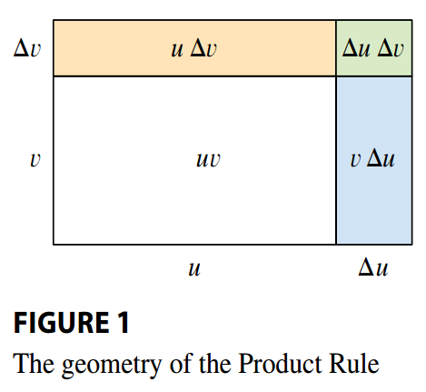
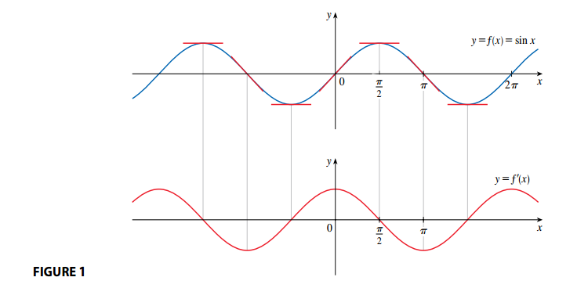
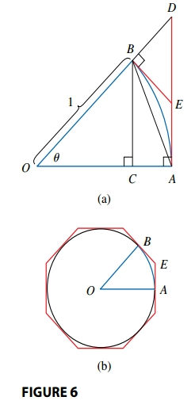
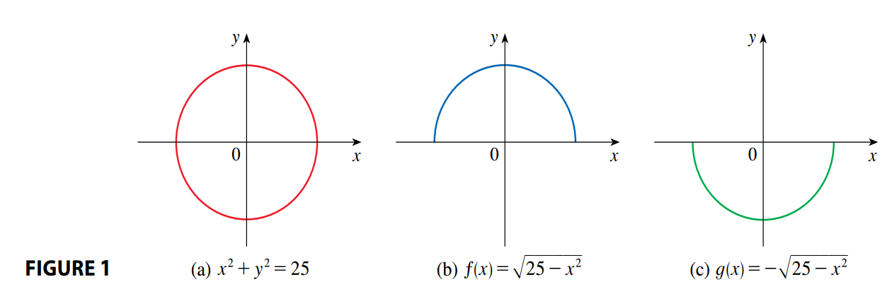

## Derivatives of Polynomials and Exponential Functions

### Constant Functions

The derivative of the constant function \(f(x) = c\) is defined as:

$$
f'(x) = \lim_{h \rightarrow 0} \frac{f(x + h) - f(x)}{h} = \lim_{h \rightarrow 0} \frac{c - c}{h} = \lim_{h \rightarrow 0} 0 = 0
$$

> [!NOTE] **Derivative of a Constant Function**
>
> $$ \frac{d}{dx} (c) = 0 $$

### Power Functions

Let \(f(x) = x^n\), where \(n\) is a positive integer. If \(n = 1\), the graph of \(f(x) = x\) is the line \(y = x\), which has slope \(1\)

> [!NOTE] **Derivative of a Linear Function**
>
> $$ \frac{d}{dx} (x) = 1 $$

For \(n = 4\), we find the derivative of \(f(x) = x^4\) as follows:

$$
f'(x) = \lim_{h \rightarrow 0} \frac{f(x + h) - f(x)}{h} = \lim_{h \rightarrow 0} \frac{(x + h)^4 - x^4}{h}
$$

$$
= \lim_{h \rightarrow 0} \frac{x^4 + 4x^3h +6x^2h^2 + 4xh^3 + h^4 - x^4}{h}
$$

$$
= \lim_{h \rightarrow 0} \frac{4x^3h +6x^2h^2 + 4xh^3 + h^4}{h}
$$

$$
= \lim_{h \rightarrow 0} 4x^3 +6x^2h + 4xh^2 + h^3 = 4x^3
$$

We see a pattern emerging.

> [!TIP] **The Power Rule**
>
> $$ \frac{d}{dx} (x^n) = nx^{n-1} $$

**First Proof** We know that:

$$
x^n - a^n = (x - a)(x^{n - 1} + x^{n - 2}a + \cdots + xa^{n - 2} + a^{n - 1})
$$

If \(f(x) = x^n\), then:

$$
f'(a) = \lim_{x \rightarrow a} \frac{f(x) - f(a)}{x - a} = \lim_{x \rightarrow a} \frac{x^n - a^n}{x - a}
$$

$$
= \lim_{x \rightarrow a} \frac{(x - a)(x^{n - 1} + x^{n - 2}a + \cdots + xa^{n - 2} + a^{n - 1})}{x - a}
$$

$$
= \lim_{x \rightarrow a} (x^{n - 1} + x^{n - 2}a + \cdots + xa^{n - 2} + a^{n - 1})
$$

$$
= a^{n - 1} + a^{n - 2}a + \cdots + a a^{n - 2} + a^{n - 1}
$$

$$
= na^{n - 1}
$$

**Second Proof**

$$
f'(x) = \lim_{h \rightarrow 0} \frac{f(x + h) - f(x)}{h} = \lim_{h \rightarrow 0} \frac{(x + h)^n - x^n}{h}
$$

We expand \((x + h)^n\) using the [Binomial Theorem](../../agaa/11_further_topics/#the-binomial-theorem):

$$
f'(x) = \lim_{h \rightarrow 0} \frac{\left[x^n + nx^{n - 1}h + \frac{n(n - 1)}{2}x^{n - 2}h^2 + \cdots + nxh^{n - 1} + h^n \right] - x^n}{h}
$$

$$
= \lim_{h \rightarrow 0} \frac{nx^{n - 1}h + \frac{n(n - 1)}{2}x^{n - 2}h^2 + \cdots + nxh^{n - 1} + h^n}{h}
$$

$$
= \lim_{h \rightarrow 0} nx^{n - 1} + \frac{n(n - 1)}{2}x^{n - 2}h^ + \cdots + nxh^{n - 2} + h^{n - 1} = nx^{n - 1}
$$

because every term except the first has \(h\) as a factor and therefore approaches \(0\).

But, what about power functions with negative integer exponents? See for example the derivative for \(\frac{1}{x}\):

$$
\frac{d}{dx} \frac{1}{x} = -\frac{1}{x^2}
$$

We can rewrite these functions as follows:

$$
\frac{d}{dx} (x^{-1}) = (- 1) x^{-2}
$$

and so the [Power Rule](#power-functions) is true when \(n = -1\).

What if the exponent is a fraction:

$$
\frac{d}{dx} \sqrt{x} = \frac{1}{2\sqrt{x}}
$$

which can be rewritten as

$$
\frac{d}{dx} (x^{\frac{1}{2}}) = \frac{1}{2}x^{-\frac{1}{2}}
$$

> [!TIP] **The Power Rule (General Version)**
>
> If \(n\) is any real nmber, then
>
> $$ \frac{d}{dx} x^n = nx^{n - 1} $$

In general, a function increases when its derivative is positive and decreases when it derivative is negative.

The Power Rule enables us to find _normal lines_. The **normal line** to a curve \(C\) at a point \(P\) is the line through \(P\) that is perpendicular to the tangent line at \(P\).

### New Derivatives from Old

> [!TIP] **The Constant Multiple Rule**
>
> If \(c\) is a constant and \(f\) is a differentiable function, then
>
> $$ \frac{d}{dx} [c(fx)] = c \frac{d}{dx} f(x) $$

**PROOF** Let \(g(x) = cf(x)\). Then

$$
g'(x) = \lim_{h \rightarrow 0} \frac{g(x + h) - g(x)}{h} = \lim_{h \rightarrow 0} \frac{cf(x + h) - cf(x)}{h}
$$

$$
= \lim_{h \rightarrow 0} c\left[\frac{f(x + h) - f(x)}{h}\right]
$$

By the [Limit Laws](../02_limits/#properties-of-limits):

$$
= c \lim_{h \rightarrow 0}\left[\frac{f(x + h) - f(x)}{h}\right] = cf'(x)
$$

> [!TIP] **Sum and Difference Rules**
>
> If \(f\) and \(g\) are both differentiable, then
>
> $$ \frac{d}{dx} [f(x) + g(x)] = \frac{d}{dx} f(x) + \frac{d}{dx} g(x) $$
>
> $$ \frac{d}{dx} [f(x) - g(x)] = \frac{d}{dx} f(x) - \frac{d}{dx} g(x) $$

**Proof** To prove the **Sum Rule**, we let \(F(x) = f(x) + g(x)\). Then:

$$
F'(x) = \lim_{h \rightarrow 0} \frac{F(x + h) - F(x)}{h}
$$

$$
= \lim_{h \rightarrow 0} \frac{[f(x + h) + g(x + h)] - [f(x) + g(x)]}{h}
$$

$$
= \lim_{h \rightarrow 0} \left[\frac{f(x + h) - f(x)}{h} + \frac{g(x + h) - g(x)]}{h} \right]
$$

By the [Limit Laws](../02_limits/#properties-of-limits):

$$
= \left[\lim_{h \rightarrow 0} \frac{f(x + h) - f(x)}{h}\right] + \left[\lim_{h \rightarrow 0}\frac{g(x + h) - g(x)]}{h} \right]
$$

$$
= f'(x) + g'(x)
$$

To prove the Difference Rule, we write \(f - g\) as \(f + (-1)g\) and apply the Sum Rule and the Constant Multiple Rule.

The Sum Rule can be extended to the sum of any number of functions. For instance, using this theorem twice, we get

$$
(f + g + h)' = [(f + g) + h]' = (f + g)' + h' = f' + g' + h'
$$

The Constant Multiple Rule, the Sum Rule, and the Difference Rule can be combined with the Power Rule to differentiate any polynomial.

Let \(p(x) = a*n x^n + a*{n - 1}x^{n-1} + \cdots + a_1 x + a_0\), then:

$$
p'(x) = \frac{d}{dx}(a_n x^n + a_{n - 1}x^{n-1} + \cdots + a_1 x + a_0)
$$

By the Sum Rule and the Constant Multiple Rule:

$$
= \sum_{i=0}^n \frac{d}{dx} a_i x^i = \sum_{i=0}^n a_i \frac{d}{dx} x^i
$$

By the definition for the derivative of a power function:

$$
= \sum_{i=0}^n (a_i)(i)x^{i-1}
$$

**Example**

$$
\frac{d}{dx} (x^8 + 12x^5 - 4x^4 + 10x^3 - 6x + 5)
$$

$$
= \frac{d}{dx} (x^8) + \frac{d}{dx} (12x^5) + \frac{d}{dx} (-4x^4) + \frac{d}{dx} (10x^3) + \frac{d}{dx} (-6x) + \frac{d}{dx} (5)
$$

$$
= 8x^7 + (12)(5)x^4 + (-4)(4)x^3 + (10)(3)x^2 + -6 + 0
$$

### Exponential Functions

Let’s try to compute the derivative of the exponential function \(f(x) = b^x\) using the definition of a derivative:

$$
f'(x) = \lim_{h \rightarrow 0} \frac{f(x + h) - f(x)}{h} = \lim_{h \rightarrow 0} \frac{b^{x + h} - b^x}{h}
$$

$$
= \lim_{h \rightarrow 0} \frac{b^xb^h - b^x}{h} = \lim_{h \rightarrow 0} \frac{b^x(b^h - 1)}{1}
$$

The factor \(b^x\) does not depend on \(h\), so we can take it in front of the limit:

$$
= b^x \lim_{h \rightarrow 0} \frac{b^h - 1}{h}
$$

Notice that the limit is the value of the derivative of \(f\) at \(0\), that is:

$$
\lim_{h \rightarrow 0} \frac{b^h - 1}{h} = f'(0)
$$

Therefore we have shown that if the exponential function \(f(x) = b^x\) is differentiable at \(0\), then it is differentiable everywhere and:

$$
f'(x) = f'(0)b^x
$$

This equation says that _the rate of change of any exponential function is proportional to the function itself_.

> [!TIP] **Number \(e\)**
>
> \(e\) is the number such that:
>
> $$ \lim{h \to 0} \frac{e^h - 1}{h} = 1 $$

> [!TIP] **Derivative of the Natural Exponential Function**
>
> $$ \frac{d}{dx} (e^x) = e^x $$

Thus the exponential function \(f(x) = e^x\) has the property that it is its own derivative.
The geometrical significance of this fact is that the slope of a tangent line to the curve \(y = e^x\) at a point \((x, e^x)\) is equal to the \(y\)-coordinate of the point.

## The Product and Quotient Rules

### The Product Rule

> [!TIP] **The Product Rule**
>
> If \(f\) and \(g\) are both differentiable, then
>
> $$\frac{d}{dx}[f(x)g(x)] = f(x)\frac{d}{dx}[g(x)] + g(x) \frac{d}{dx}[f(x)]$$

#### The Product Rule's Proof 1

By [the definition of a derivative](../02_limits#derivatives) the derivative of any function $f$ is given by:

$$
\frac{\delta}{\delta x} f(x) = \lim_{\Delta x \to 0} \frac{f(x + \Delta x) - f(x)}{\Delta x}
$$

Given two functions $f$ and $g$, we use the definition of the derivative for the product function $F = (f \cdot g)$:

$$
\frac{\delta}{\delta x} F(x) = \lim_{\Delta x \to 0} \frac{F(x + \Delta x) - F(x)}{\Delta x}
$$

$$
= \lim_{\Delta x \to 0} \frac{f(x + \Delta x)g(x + \Delta x) - f(x)g(x)}{\Delta x}
$$

We sum and substract $f(x + \Delta x)g(x)$

$$
= \lim_{\Delta x \to 0} [\frac{f(x + \Delta x)g(x + \Delta x) - f(x + \Delta x)g(x)] + [f(x + \Delta x)g(x) - f(x)g(x)]}{\Delta x}
$$

$$
= \lim_{\Delta x \to 0} \left[\frac{f(x + \Delta x)g(x + \Delta x) - f(x + \Delta x)g(x)}{\Delta x}\right] + \left[\frac{f(x + \Delta x)g(x) - f(x)g(x)}{\Delta x}\right]
$$

$$
= \lim_{\Delta x \to 0} \left[f(x + \Delta x)\frac{g(x + \Delta x) - g(x)}{\Delta x}\right] + \lim_{\Delta x \to 0}\left[g(x)\frac{f(x + \Delta x) - f(x)}{\Delta x}\right]
$$

$$
= \left[\lim_{\Delta x \to 0}f(x + \Delta x) \lim_{\Delta x \to 0} \frac{g(x + \Delta x) - g(x)}{\Delta x}\right] + \left[\lim_{\Delta x \to 0} g(x) \lim_{\Delta x \to 0} \frac{f(x + \Delta x) - f(x)}{\Delta x}\right]
$$

Given $\lim_{\Delta x \to 0} f(x + \Delta x) = f(x)$, then

$$
= f(x) \frac{\delta g(x)}{\delta x} + g(x) \frac{\delta f(x)}{\delta x}
$$

#### The Product Rule's Proof 2

We start by assuming that \(u = f(x)\) and \(v = g(x)\) are both positive differentiable functions. Then we can interpret the product \(uv\) as an area of a rectangle (see Figure 1).

If \(x\) changes by and amount \(\Delta x\), then de corresponding changes in \(u\) and \(v\) are

$$
\Delta u = f(x + \Delta x) - f(x)
$$

$$
\Delta v = g(x + \Delta x) - g(x)
$$

The change in the area of the rectangle is

$$
\Delta(uv) = (u + \Delta u)(v + \Delta v) - uv = u\Delta v + v \Delta u + \Delta u \Delta v
$$

where \((u + \Delta u)(v + \Delta v)\) can be interpreted as the area of the large rectangle in Figure 1. Whilst \(\Delta(uv)\) would be the sum of the tree shaded areas.

If we divide by \(\Delta x\), we get:

$$
\frac{\Delta(uv)}{\Delta x} = u \frac{\Delta v}{\Delta x} + v \frac{\Delta u}{\Delta x} + \frac{\Delta u \Delta v}{\Delta x}
$$

If we now let \(\Delta x \rightarrow 0\) we get the derivative of \(uv\):

$$
\frac{\delta}{\delta x}(uv) = \lim_{\Delta x \to 0} \frac{\Delta (uv)}{\Delta x}
$$

$$
= \lim_{\Delta x \to 0} \left(u \frac{\Delta v}{\Delta x} + v \frac{\Delta u}{\Delta x} + \frac{\Delta u \Delta v}{\Delta x}\right)
$$

$$
= u \lim_{\Delta x \to 0} \frac{\Delta v}{\Delta x} + v \lim_{\Delta x \to 0} \frac{\Delta u}{\Delta x} + \left(\lim_{\Delta x \to 0} \Delta u \right)\left(\lim_{\Delta x \to 0} \frac{ \Delta v}{\Delta x}\right)
$$

Substituting by \(\Delta v = g(x + \Delta x) - g(x)\) and \(\Delta u = f(x + \Delta x) - f(x)\)

$$
= u \lim_{\Delta x \to 0} \frac{g(x + \Delta x) - g(x)}{\Delta x} + v \lim_{\Delta x \to 0} \frac{f(x + \Delta x) - f(x)}{\Delta x} + \left(\lim_{\Delta x \to 0} \Delta u \right)\left(\lim_{\Delta x \to 0} \frac{ \Delta v}{\Delta x}\right)
$$

Because $\lim_{\Delta x \to 0} \Delta u = 0$

$$
= u \lim_{\Delta x \to 0} \frac{g(x + \Delta x) - g(x)}{\Delta x} + v \lim_{\Delta x \to 0} \frac{f(x + \Delta x) - f(x)}{\Delta x} + 0 \cdot \left(\lim_{\Delta x \to 0} \frac{ \Delta v}{\Delta x}\right)
$$

$$
= u \lim_{\Delta x \to 0} \frac{g(x + \Delta x) - g(x)}{\Delta x} + v \lim_{\Delta x \to 0} \frac{f(x + \Delta x) - f(x)}{\Delta x}
$$

Although we started by assuming (for the geometric interpretation) that all the quantities are positive, we notice that The Power Rule is always true. (The algebra is valid whether $u$, $v$, $\Delta u$, and $\Delta v$ are positive or negative).

### The Quotient Rule

> [!TIP] **The Quotient Rule**
>
> If \(f\) and \(g\) are both differentiable, then
>
> $$\frac{d}{dx}\left[\frac{f(x)}{g(x)}\right] = \frac{g(x)\frac{d}{dx}[f(x)] - f(x) \frac{d}{dx}[g(x)]}{[g(x)]^2}$$

#### The Quotient Rule's Proof 1

Given the quotient function $F = \frac{f}{g}$, then by [the definition of a derivative](../02_limits#derivatives)

$$
\frac{\delta F(x)}{\delta x} = \lim_{\Delta x \to 0} \frac{F(x + \Delta x) - F(x)}{\Delta x}
$$

$$
= \lim_{\Delta x \to 0} \frac{\frac{f(x + \Delta x)}{g(x + \Delta x)} - \frac{f(x)}{g(x)}}{\Delta x}
$$

$$
= \lim_{\Delta x \to 0} \frac{\frac{g(x)f(x + \Delta x) - f(x)g(x + \Delta x)}{g(x) \cdot g(x + \Delta x)}}{\Delta x}
$$

$$
= \lim_{\Delta x \to 0} \frac{g(x)f(x + \Delta x) - f(x)g(x + \Delta x)}{\Delta x \cdot g(x) \cdot g(x + \Delta x)}
$$

We sum and substract $f(x)g(x)$ on the numerator

$$
= \lim_{\Delta x \to 0} \frac{[g(x)f(x + \Delta x) - f(x)g(x)] + [f(x)g(x) - f(x)g(x + \Delta x)]}{\Delta x \cdot g(x) \cdot g(x + \Delta x)}
$$

$$
= \lim_{\Delta x \to 0} \frac{g(x)[f(x + \Delta x) - f(x)] + f(x)[g(x) - g(x + \Delta x)]}{\Delta x \cdot g(x) \cdot g(x + \Delta x)}
$$

$$
= \lim_{\Delta x \to 0} \frac{g(x)[f(x + \Delta x) - f(x)] - f(x)[g(x + \Delta x) - g(x)]}{\Delta x \cdot g(x) \cdot g(x + \Delta x)}
$$

$$
= \frac{\lim_{\Delta x \to 0} \frac{g(x)[f(x + \Delta x) - f(x)]}{\Delta x} - \lim_{\Delta x \to 0}\frac{f(x)[g(x + \Delta x) - g(x)]}{\Delta x}}{\lim_{\Delta x \to 0} g(x) \cdot g(x + \Delta x)}
$$

$$
= \frac{g(x)\lim_{\Delta x \to 0} \frac{f(x + \Delta x) - f(x)}{\Delta x} - f(x)\lim_{\Delta x \to 0}\frac{g(x + \Delta x) - g(x)}{\Delta x}}{\lim_{\Delta x \to 0} g(x) \cdot g(x + \Delta x)}
$$

Given $\lim_{\Delta x \to 0} g(x + \Delta x) = 0$

$$
= \frac{g(x) \frac{\delta f(x)}{\delta x} - f(x)\frac{\delta g(x)}{\delta x}}{(g(x))^2}
$$

#### The Quotient Rule's Proof 2

If $x$, $u$, and $v$ change by amounts $\Delta x$, $\Delta u$ and $\Delta v$, the corresponding change in the quotient $\frac{u}{v}$ is

$$
\Delta \left(\frac{u + \Delta u}{v + \Delta v}\right) - \frac{u}{v} =
$$

$$
= \frac{(u + \Delta u)v - u(v + \Delta v)}{v(v + \Delta v)}
$$

$$
= \frac{uv + v \Delta u - uv - u\Delta v}{v(v + \Delta v)}
$$

$$
= \frac{v \Delta u - u\Delta v}{v(v + \Delta v)}
$$

Therefore

$$
\frac{d}{dx} \left(\frac{u}{v}\right) = \lim_{\Delta x \to 0} \frac{\Delta \frac{u}{v}}{\Delta x} = \lim_{\Delta x \to 0} \frac{\frac{v \Delta u - u\Delta v}{v(v + \Delta v)}}{\Delta x}
$$

$$
= \lim_{\Delta x \to 0} \frac{\frac{v \Delta u - u\Delta v}{\Delta x}}{v(v + \Delta v)}
$$

$$
=\lim_{\Delta x \to 0} \frac{v\frac{\Delta u}{\Delta x} - u\frac{\Delta v}{\Delta x}}{v(v + \Delta v)}
$$

$$
= \frac{v \lim_{\Delta x \to 0}\frac{\Delta u}{\Delta x} - u \lim_{\Delta x \to 0} \frac{\Delta v}{\Delta x}}{v \lim_{\Delta x \to 0} (v + \Delta v)}
$$

Substituting by \(\Delta v = g(x + \Delta x) - g(x)\) and \(\Delta u = f(x + \Delta x) - f(x)\)

$$
= \frac{v \lim_{\Delta x \to 0}\frac{f(x + \Delta x) - f(x)}{\Delta x} - u \lim_{\Delta x \to 0} \frac{g(x + \Delta x) - g(x)}{\Delta x}}{v \lim_{\Delta x \to 0} (v + \Delta v)}
$$

$$
= \frac{v \frac{d}{dx} f(x) - u \frac{d}{dx} g(x)}{v \lim_{\Delta x \to 0} (v + \Delta v)}
$$

We know that as $\Delta x \rightarrow 0$ then $\Delta v \rightarrow 0$, therefore $\lim_{\Delta x \to 0} (v + \Delta v) = v + 0 = v$ and

$$
= \frac{v \frac{d}{dx} f(x) - u \frac{d}{dx} g(x)}{v^2}
$$

Given $u = f(x)$ and $v = g(x)$, then

$$
\frac{d}{dx} \left(\frac{f(x)}{g(x)}\right)= \frac{g(x) \frac{d}{dx} f(x) - f(x) \frac{d}{dx} g(x)}{[g(x)]^2}
$$

## Derivative of Trigonometric Funcions

If we sketch the graph of the function $f(x) = \sin(x)$ and use the interpretation of $f'(x)$ as the slope of the tangent to the sine curve in order to sketch the graph of $f'$ then it looks as if the graph of $f'$ may be the same as the cosine curve (see Figure 1).

From the definition of a derivative, we have

$$
f'(x) = \lim_{h \to 0} \frac{f(x + h) - f(x)}{h}
$$

$$
= \lim_{h \to 0} \frac{\sin(x + h) - \sin x}{h}
$$

By the [Sine Sum and Difference Identities](../../agaa/09_trig_identities#sine-and-tangent-sum-and-difference-identities)

$$
= \lim_{h \to 0} \left[\frac{\sin(x)\cos(h) + \sin(h)\cos(x) - \sin x}{h}\right]
$$

$$
= \lim_{h \to 0} \left[\frac{\sin(x)\cos(h) - \sin(x)}{h} + \frac{\sin(h)\cos(x)}{h}\right]
$$

$$
= \lim_{h \to 0} \left[\sin x \frac{\cos(h) - 1}{h} + \cos x \frac{\sin(h)}{h}\right]
$$

$$
= \lim_{h \to 0} \sin x \lim_{h \to 0}\frac{\cos(h) - 1}{h} + \lim_{h \to 0}\cos x \lim_{h \to 0}\frac{\sin(h)}{h}
$$

Because we regard $x$ as a constant when computing a limit as $h \to 0$, we have

$$
\lim_{h \to 0} \sin x = \sin x
$$

and

$$
\lim_{h \to 0} \cos x = \cos x
$$

Later we will prove that

$$
\lim_{h \to 0} \frac{\sin h}{h} = 1
$$

and

$$
\lim_{h \to 0} \frac{\cos h - 1}{h} = 0
$$

If we substitute these limits on our main equation we get

$$
= \sin x \cdot 0 + \cos x 1 = \cos x
$$

So we have proved the formula for the derivative of the sine function:

$$
\frac{\delta}{\delta x} \sin(x)= \cos x
$$

Using the same methods as in the previous proof, we can prove

$$
\frac{\delta}{\delta x} \cos(x)= -\sin x
$$

The tangent function can also be differentiated by using the definition of a derivative, but it is easier to use the [Quotient Rule](#the-quotient-rule)

$$
\frac{\delta}{\delta x} \tan x = \frac{\delta}{\delta x} \left(\frac{\sin x}{\cos x}\right)
$$

$$
= \frac{\cos x \frac{\delta}{\delta x}\sin x - \sin x \frac{\delta}{\delta x} \cos x}{\cos^2 x}
$$

$$
= \frac{\cos x \cos x - \sin x \sin x}{\cos^2 x}
$$

$$
= \frac{\cos^2 x - \sin^2 x}{\cos^2 x}
$$

Given $\cos^2 x + \sin^2 x = 1$

$$
= \frac{1}{\cos^2 x} = \sec^2 x
$$

Therefore

$$
\frac{\delta}{\delta x} \tan x = \sec^2 x
$$

The derivatives of the remaining trigonometric functions, $\csc$, $\sec$, and $\cot$, can also be found easily using the [Quotient Rule](#the-quotient-rule). We collect all the differentiation formulas for trigonometric functions in the following table. **Remember that they are valid only when $x$ is measured in radians**.

> [!NOTE] **Derivatives of Trigonometric Functions**
>
> $$\frac{\delta}{\delta x} \sin x = \cos x$$
>
> $$\frac{\delta}{\delta x} \cos x = -\sin x$$
>
> $$\frac{\delta}{\delta x} \tan x = \sec^2 x$$
>
> $$\frac{\delta}{\delta x} \csc x = -\csc x \cot x$$
>
> $$\frac{\delta}{\delta x} \sec x = \sec x \tan x$$
>
> $$\frac{\delta}{\delta x} \cot x = -\csc^2 x$$

### Two Special Trigonometric Limits

In proving the formula for the derivative of sine we used two special limits, which we now prove.

$$
\lim_{\theta \to 0} \frac{\sin \theta}{\theta} = 1
$$

#### Proof for the first fundamental limit

Given a unit circle, asumme first that $\theta$ lies between $0$ and $\frac{\pi}{2}$ (See Figure 6). By the definition of a [radian measure](../../agaa/08_trigonometry/#radian-measure)

$$
s = arc AB = \theta
$$

Also

$$
|BC| = |OB| \sin \theta = \sin \theta
$$

From the diagram we see that:

$$
|BC| < |AB| < arc AB
$$

[By definition](../../agaa/08_trigonometry#trigonometric-functions) we know that $\sin \theta = \frac{|BC|}{1} = |BC|$, therefore:

$$
\sin \theta = |BC| < arc AB = \theta
$$

so

$$
\frac{\sin \theta}{\theta} < 1
$$

Let the tangent lines at $A$ and $B$ interset at $E$. You can see from Figure 6(b) that the circumference of a circle is smaller than the length of a circumscribed polygon, and so

$$
arc AB < |AE| + |EB|
$$

Thus

$$
\theta = arc AB < |AE| + |EB|
$$

From the diagram $|EB| < |ED|$, as $ED$ is the hypothenuse of $BDE$.

$$
< |AE| + |ED| = |AD|
$$

Also, from the definition of [the tangent function](../../agaa/08_trigonometry/#trigonometric-functions)

$$
|AD| = |OA| \tan \theta = 1 \tan \theta = \tan \theta
$$

Therefore we have

$$
\theta < |AD| = \tan \theta = \frac{\sin \theta}{\cos \theta}
$$

Which we can rewrite as

$$
\cos \theta < \frac{\sin \theta}{\theta}
$$

so because we also know that $\frac{\sin \theta}{\theta} < 1$, then

$$
\cos \theta < \frac{\sin \theta}{\theta} < 1
$$

We know that

$$
\lim_{\theta \to 0} 1 = 1
$$

and

$$
\lim_{\theta \to 0} \cos \theta = 1
$$

so by [the Squeeze Theorem](../02_limits/#the-squeeze-theorem)

$$
\lim_{\theta \to 0^+} \frac{\sin \theta}{\theta} = 1, 0 < \theta < \frac{\pi}{2}
$$

But the function $\frac{\sin \theta}{\theta}$ is an even function, so its right and left limits must be equal. Hence we have

$$
\lim_{\theta \to 0} \frac{\sin \theta}{\theta} = 1
$$

#### Proof for the second fundamental limit

The following special limit involves cosine.

$$
\lim_{\theta \to 0} \frac{\cos \theta - 1}{\theta} = 0
$$

We multiply numerator and denominator by $\cos \theta + 1$

$$
\lim_{\theta \to 0} \frac{\cos \theta - 1}{\theta} = \lim \left(\frac{\cos \theta - 1}{\theta} \cdot \frac{\cos \theta + 1}{\cos \theta + 1}\right)
$$

$$
= \lim_{\theta \to 0} \frac{\cos^2 \theta - 1}{\theta (\cos \theta + 1)}
$$

Given $\sin^2 \theta + \cos^2 \theta = 1$

$$
= \lim_{\theta \to 0} \frac{-\sin^2 \theta}{\theta (\cos \theta + 1)}
$$

$$
= -\lim_{\theta \to 0} \frac{\sin \theta}{\theta} \cdot \frac{\sin \theta}{\cos \theta + 1}
$$

$$
= -\lim_{\theta \to 0} \frac{\sin \theta}{\theta} \cdot \lim_{\theta \to 0} \frac{\sin \theta}{\cos \theta + 1}
$$

$$
= -1 \cdot \left(\frac{0}{1 + 1}\right) = 0
$$

## The Chain Rule

It turns out that the derivative of the composite function $f \circ g$ is the product of the derivatives of $f$ and $g$. This fact is one of the most important of the differentiation rules and is called the **Chain Rule**.

If we let $y = f(u)$ and $u = g(x)$, then if $u$ changes twice as fast as $x$ and $y$ changes three times as fast as $u$, then it seems reasonable that $y$ changes six times as fast as $x$, and so we expect that $\frac{\delta y}{\delta x}$ is the product of $\frac{\delta y}{\delta u}$ and $\frac{\delta u}{\delta x}$.

> [!TIP] **The Chain Rule**
>
> If $g$ is differentiable at $x$ and $f$ is differentiable at $g(x)$, then the composite function $F= f \circ g$ defined by $F(x) = f(g(x))$ is differentiable at $x$ and $F'$ is given by the product
>
> $$F'(x) = f'(g(x)) \cdot g'(x)$$
>
> In Leibniz notation if $y = f(u)$ and $u = g(x)$ are both differentiable functions, then
>
> $$\frac{\delta y}{\delta x} = \frac{\delta y}{\delta u} \frac{\delta u}{\delta x}$$

Note that in using the Chain Rule we work from the outside to the inside. We differentiate the outer function $f$ [at the inner function $g(x)$] and then we multiply by the derivative of the inner function.

> [!NOTE] **The Power Rule Combined with the Chain Rule**
>
> If $n$ is any real number and $u = g(x)$ is differentiable, then
>
> $$\frac{\delta}{\delta x} (u^n) = nu^{n - 1} \frac{\delta u}{\delta x}$$
>
> Alternatively,
>
> $$\frac{\delta}{\delta x} [g(x)]^n = n[g(x)]^{n - 1}g'(x)$$

The reason for the name _Chain Rule_ becomes clear when we make a longer chain by adding another link. Suppose that $y = f(u)$, $u = g(x)$, and $x = h(t)$ where $f$, $g$, and $h$ are differentiable functions. Then, to compute the derivative of $y$ with respect to $t$, we use the Chain Rule twice:

$$
\frac{\delta x}{\delta t} = \frac{\delta y}{\delta x} \frac{\delta x}{\delta t} = \frac{\delta y}{\delta u}\frac{\delta u}{\delta x}\frac{\delta x}{\delta t}
$$

### Derivatives of General Exponential Functions

We can use the Chain Rule to differentiate an exponential function with any base $b > 0$. We can write

$$
b^x = \left(e^{\ln b}\right)^x = e^{(\ln b)x}
$$

and then the Chain Rule gives

$$
\frac{\delta}{\delta x} (b^x) = \frac{\delta }{\delta x} (e^{(\ln b)x})
$$

$$
= \frac{\delta e^{(\ln b)x}}{\delta (\ln b)x} \frac{\delta (\ln b)x}{\delta x}
$$

$$
e^{(\ln b)x} \ln b = b^x \ln b
$$

So we have the formula

$$
\frac{\delta}{\delta} (b^x) = b^x \ln b
$$

### How to Prove the Chain Rule

Recall that if $y = f(x)$ and $x$ change from $a$ to $a + \Delta x$, we define the increment of $y$ as

$$
\Delta y = f(a + \Delta x) - f(a)
$$

According to the definition of a derivative we have

$$
\lim_{\Delta x \to 0} \frac{\Delta y}{\Delta x} = f'(a)
$$

So if we denote the difference between $\frac{\Delta y}{\Delta x}$ and $f'(a)$ by $\epsilon$, we obtain

$$
\lim_{\Delta x \to 0} \epsilon = \lim_{\Delta x \to 0} \left(\frac{\Delta y}{\Delta x} - f'(a)\right)
$$

$$
= \left(\lim_{\Delta x \to 0} \frac{\Delta y}{\Delta x}\right) - \left(\lim_{\Delta x \to 0} f'(a)\right)= f'(a) - f'(a)
$$

But

$$
\epsilon = \frac{\Delta y}{\Delta x} - f'(a) \Rightarrow \Delta y = f'(a)\Delta x + \epsilon \Delta x
$$

If we define $\epsilon$ to be $0$, when $\Delta x = 0$, then $\epsilon$ becomes a continuous funcion of $\Delta x$ because, as we have seen before

$$
\lim_{\Delta x \to 0} \epsilon = 0 = \epsilon
$$

Therefore, by [the definition of a continuous function](../02_limits#continuity-of-a-function) we can say that $\epsilon$ is continuous. Thus for a differentiable function $f$, we can write

$$
\Delta y = f'(a)\Delta x + \epsilon \Delta x
$$

where $\epsilon \to 0$ as $\Delta x \to 0$. And $\epsilon$ is a continuous function of $\Delta x$. This property of differentiable functions is what enables us to prove the Chain Rule.

#### Chain Rule's Proof 1

Given the composite function

$$
y = f(g(x))
$$

By [the definition of a derivative](../02_limits#derivatives)

$$
\frac{\delta y}{\delta x} = \lim_{\Delta x \to 0} \frac{f(g(x + \Delta x)) - f(g(x))}{\Delta x}
$$

Let's define the increment on $u$ as

$$
\Delta u = g(x + \Delta x) - g(x)
$$

Given $g$ is differentiable, when $\Delta x \to 0$, then $\Delta u \to 0$. We rewrite the derivative as

$$
= \lim_{\Delta x \to 0} \frac{f(g(x + \Delta x)) - f(g(x))}{\Delta u} \frac{\Delta u}{\Delta x}
$$

$$
= \left(\lim_{\Delta x \to 0} \frac{f(g(x + \Delta x)) - f(g(x))}{\Delta u}\right) \left(\lim_{\Delta x \to 0} \frac{\Delta u}{\Delta x} \right)
$$

The first term is the derivative of $f$ with respecto to $u$ and the second term is the derivative of $u$ with respect to $x$. Given

$$
u = g(x)
$$

and

$$
\Delta u = g(x + \Delta x) - g(x) \Leftrightarrow  g(x + \Delta x) = g(x) + \Delta u = u + \Delta u
$$

Then

$$
= \left(\lim_{\Delta x \to 0} \frac{f(u + \Delta u) - f(u)}{\Delta u}\right) \left(\lim_{\Delta x \to 0} \frac{g(x + \Delta x) - g(x)}{\Delta x} \right)
$$

$$
= \frac{\delta f(u)}{\delta u} \frac{\delta g(x)}{\delta x}
$$

$$
= \frac{\delta f(g(x))}{\delta g(x)} \frac{\delta g(x)}{\delta x}
$$

#### Chain Rule's Proof 2

Suppose $u = g(x)$ is differentiable at $a$ and $y = f(u)$ is differentiable at $b = g(a)$. If $\Delta x$ is an increment in $x$ and $\Delta u$ and $\Delta y$ are the corresponding increments in $u$ and $y$, we previously defined a generic $\Delta y$ as

$$
\Delta y = f'(a)\Delta x + \epsilon \Delta x
$$

So we can write

$$
\Delta u = g'(a) \Delta x + \epsilon_1 \Delta x = [g'(a) + \epsilon_1] \Delta x
$$

where $\epsilon_1 \to 0$ as $\Delta x \to 0$. Similarly

$$
\Delta y = f'(b) \Delta u + \epsilon_2 \Delta u = [f'(b) + \epsilon_2] \Delta u
$$

where $\epsilon_2 \to 0$ as $\Delta u \to 0$.

If we substitute the expression for $\Delta u$ on this last equation

$$
\Delta y = [f'(b) + \epsilon_2] \Delta u = [f'(b) + \epsilon_2] [g'(a) + \epsilon_1] \Delta x
$$

$$
\frac{\Delta y}{\Delta x} = [f'(b) + \epsilon_2] [g'(a) + \epsilon_1]
$$

We also know that $\Delta u \to 0$ as $\Delta x \to 0$ because of its defnition:

$$
\Delta u = [g'(a) + \epsilon_1] \Delta x
$$

So taking the limit as $\Delta x \to 0$, we get

$$
\frac{\delta y}{\delta x} = \lim_{\Delta x \to 0} \frac{\Delta y}{\Delta x} = \lim_{\Delta x \to 0} [f'(b)+\epsilon_2][g'(a) + \epsilon_1]
$$

$$
= \left(\lim_{\Delta x \to 0} [f'(b)+\epsilon_2]\right) \cdot \left(\lim_{\Delta x \to 0} [g'(a) + \epsilon_1]\right)
$$

By definition $\epsilon_1 \to 0$ and $\epsilon_2 \to 0$ as $\Delta x \to 0$, therefore

$$
= f'(b)g'(a) = f'(g(a))g'(a)
$$

This proves the Chain Rule.

## Implicit Differentiation

Some functions are defined implicitly by a relation between $x$ and $y$, where it is not easy to define the function as dependent only on $x$. For example:

$$
x^2 + y^2 = 25
$$

In some cases it is possible to solve such an equation for $y$ as an explicit function (or several functions) of $x$ (See Figure 1.)

$$
y = \pm \sqrt{25 - x^2}
$$

Fortunately, we don't need to solve an equation for $y$ in terms of $x$ in order to find the derivative of $y$. Instead we can use the method of **implicit differentiation**. This consists of

1. Differentiating both sides of the equation with respect to $x$
2. Solving the resulting equation for $\frac{\delta y}{\delta x}$.

### Preservation of Equality

When we define a function implicitly we are stating that both sides of the equation are always equal. But how do we know that when we differentiate both sides this equality is maintained?.

Geometrically, you can imagine the two sides of the equation as two functions that always overlap. Therefore we could argue that the derivatives of functions that are equivalent must be equal.

We could also prove it using limits, let's say we have an implicit function as follows:

$$
F(x, y) = G(x, y)
$$

where both $F$ and $G$ are functions dependent on $x$ and $y$. We must show that:

$$
\frac{\delta}{\delta x} F(x) = \frac{\delta}{\delta x} G(x)
$$

The derivatives for both functions are defined as:

$$
\frac{\delta}{\delta x} F(x, y) = \lim_{\Delta x \to 0} \frac{F(x + \Delta x, y + \Delta y) - F(x, y)}{\Delta x}
$$

$$
\frac{\delta}{\delta x} G(x, y) = \lim_{\Delta x \to 0} \frac{G(x + \Delta x, y + \Delta y) - G(x, y)}{\Delta x}
$$

Note that for a change on $x$ given by $\Delta x$ we assume an implicit change on $y$ given by $\Delta y$. That is $\Delta y$ is the change on $y$ that happens because $y$ depends on $x$.

Given $F(x, y) = G(x, y)$ for all $x$, then for any change $\Delta x$ it follows:

$$
F(x + \Delta x, y + \Delta y) = G(x + \Delta x, y + \Delta y)
$$

If we substract $F(x, y) = G(x, y)$ on both sides

$$
F(x + \Delta x, y + \Delta y) - F(x, y)= G(x + \Delta x, y + \Delta y) - G(x, y)
$$

And now we divide both sides by $\Delta x$

$$
\frac{F(x + \Delta x, y + \Delta y) - F(x, y)}{\Delta x}= \frac{G(x + \Delta x, y + \Delta y) - G(x, y)}{\Delta x}
$$

Therefore, if we take the limit

$$
\lim_{\Delta x \to 0} \frac{F(x + \Delta x, y + \Delta y) - F(x, y)}{\Delta x} = \lim_{\Delta x \to 0}\frac{G(x + \Delta x, y + \Delta y) - G(x, y)}{\Delta x}
$$

Which therefore proves:

$$
\frac{\delta}{\delta x} F(x, y) = \frac{\delta}{\delta x} G(x, y)
$$

### Example of Implicit Derivation

> **EXAMPLE**
>
> Find $\frac{\delta y}{\delta x}$ for $x^2 + y^2 = 25$
>
> We start by differentiating both sides of the equation
>
> $$\frac{\delta}{\delta x} (x^2 + y^2) = \frac{\delta}{\delta x} 25$$
>
> $$\frac{\delta}{\delta x} (x^2) + \frac{\delta}{\delta x}(y^2) = 0$$
>
> Remembering that $y$ is a function of $x$, using the chain rule, we have
>
> $$\frac{\delta}{\delta x} (y^2) = \frac{\delta}{\delta y} (y^2) \frac{\delta y}{\delta x} = 2y \frac{\delta y}{\delta x}$$
>
> Thus
>
> $$2x + 2y \frac{\delta y}{\delta x} = 0$$
>
> Now we solve for $\frac{\delta y}{\delta x}$
>
> $$\frac{\delta y}{\delta x} = - \frac{x}{y}$$

## Derivatives of Logarithmic and Inverse Trigonometric Functions

### Derivatives of Logarithmic Functions

If $f$ is a one-to-one differentiable function, then its inverse function $f^{-1}$ is also differentiable. Note that if $f$ has a horizontal tangent at a point, then $f^{-1}$ has a vertical tangent at the corresponding reflected point and so $f^{-1}$ is not differentiable there.

We now state and prove the formula for the derivative of a logarithmic function.

$$
\frac{\delta}{\delta x} (\log_b x) = \frac{1}{x \ln b}
$$

### Proof for the Derivative of a Logarithmic Function

Let $y = \log_b x$, then:

$$
b^y = x
$$

Differentiating this equation implicitly with respecto to $x$ we get

$$
\frac{\delta}{\delta y} b^y \frac{\delta y}{\delta x} = 1
$$

$$
b^y \ln b \frac{\delta y}{\delta x} = 1
$$

$$
\frac{\delta y}{\delta x} = \frac{1}{b^y \ln b} = \frac{1}{x \ln b}
$$

Now, if we let $b = e$, then $\ln e = 1$ and so:

$$
\frac{\delta}{\delta x} \ln (x) = \frac{1}{x}
$$

The simplicity of the previous derivative is one of the main reasons that natural logarithms (logarithms with base $e$) are used in calculus.

In general, if we combine the derivative of $e^x$ with the [Chain Rule](#the-chain-rule), then:

$$
\frac{\delta}{\delta x} [\ln g(x)] = \frac{1}{g(x)} \frac{\delta g(x)}{\delta x}
$$

### Logarithmic Differentiation

The calculation of derivatives of complicated functions involving products, quotients, or powers can often be simplified by taking logarithms. This mehod is denoted **logarithmic differentiation**.

1. Take natural logarithms of both sides of an equation $y = f(x)$ and use the Laws of Logarithms to expand the expression.
2. Differentiate implicitly with respect to $x$
3. Solve the resulting equation for $y'$ and replace $y$ by $f(x)$.

### The Number $e$ as a limit

We have shown that if $f(x) = \ln x$, then $\frac{\delta f(x)}{\delta x} = \frac{1}{x}$ and $\frac{f(1)}{\delta x} = 1$. From the definition of a derivative as a limit, we have:

$$
\frac{\delta f(1)}{\delta x} = \lim_{h \to 0} \frac{f(1 + h) - f(1)}{h}
$$

$$
= \lim_{x \to 0} \frac{f(1 + x) - f(1)}{x}
$$

$$
= \lim_{x \to 0} \frac{\ln (1 + x) - ln(1)}{x}
$$

Given $\ln(1) = 0$

$$
= \lim_{x \to 0} \frac{1}{x} \ln (1 + x)
$$

$$
= \lim_{x \to 0} \ln (1 + x)^{\frac{1}{x}}
$$

Because $\frac{\delta f(1)}{\delta x} = 1$, then

$$
= \lim_{x \to 0} \ln (1 + x)^{\frac{1}{x}} = 1
$$

Then

$$
e = e^1 = e^{\lim_{x \to 0} \ln(1 + x)^{\frac{1}{1}}}
$$

$$
= \lim_{x \to 0} e^{\ln(1 + x)^{\frac{1}{x}}}
$$

$$
= \lim_{x \to 0} (1 + x)^{\frac{1}{x}}
$$
