## Maximum and Minimum Values

Some of the most important applications of differential calculus are **optimization problems**, in which we are required to find the optimal (best) way of doing something.

### Absolute and Local Extreme Values

> [!TIP] **Absolute Values**
>
> Let $c$ bea a number in the domain $D$ of a function $f$. Then $f(c)$ is the
>
> - **absolute maximum** value of $f$ on $D$ if $f(c) \geq f(x)$ for all $x$ in $D$
> - **absolute minimum** value of $f$ on $D$ if $f(c) \leq f(x)$ for all $x$ in $D$

An absolute maximum or minimum is sometimes called a **global maximum or minimum**. The maximum and minimum values of $f$ are called **extreme values** of $f$.

> [!TIP] **The Extreme Value Theorem**
>
> If $f$ is continuous on a closed interval $[a, b]$, then $f$ attains an absolute maximum value $f(c)$ and an absolute minimum value $f(d)$ at some numbers $c$ and $d$ in $[a, b]$.

The Extreme Value Theorem is illustrated in Figure 8.

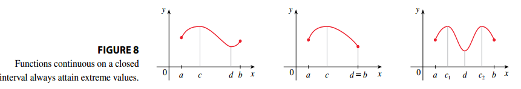

### Critical Numbers and the Closed Interval Method

> [!TIP] **Fermat's Theorem**
>
> If $f$ has a local maximum or minimum at $c$, and if $f'(c)$ exists, then $f'(c) = 0$.

**PROOF**: Suppose that $f$ has a local maximum at $c$. Then accoding to the definition of a local maximum $f(c) \geq f(x)$ if $x$ is sufficiently close to $c$. This implies that if $h$ is sufficiently close to $0$, with $h$ being positive or negative, then:

$$
f(c) \geq f(c + h)
$$

and therefore

$$
f(c + h) - f(c) \leq 0
$$

We can divide both sides of an inequality by a positive number $h$, then

$$
\frac{f(c + h) - f(c)}{h} \leq 0
$$

Taking the right-hand limit of both sides we get

$$
\lim_{h \rightarrow 0^+} \frac{f(c + h) - f(c)}{h} \leq \lim_{h \rightarrow 0^+} = 0
$$

Since $f'(0)$ exists, we have

$$
 \lim_{h \rightarrow 0} \frac{f(c + h) - f(c)}{h} = \lim_{h \rightarrow 0^+} \frac{f(c + h) - f(c)}{h}
$$

and so we have shown that $f'(c) \leq 0$. If $h < 0$, then

$$
\frac{f(c + h) - f(c)}{h} \geq 0
$$

So taking the left-hand limit, we have

$$
 \lim_{h \rightarrow 0} \frac{f(c + h) - f(c)}{h} = \lim_{h \rightarrow 0^-} \frac{f(c + h) - f(c)}{h} \geq 0
$$

We have shown that $f'(c) \geq 0$ and $f'(c) \leq 0$ so the only possibility is that $f'(c) = 0$.

**We can't expect to locate extreme values simply by setting $f'(x) = 0$ and solving for $x$.** The fact that $f'(x) = 0$ simply means that the curve $f$ has a horizontal tangent at $(x, f(x))$. In other words, the converse of Fermat's Theorem is false in general. However, Fermat's Theorem does suggest that we should at least start looking for extreme values of $f$ at the number $c$ where $f'(c) = 0$ or where $f'(c)$ does not exist.

> [!TIP] **Critical Number**
>
> A **critical number** of a function $f$ is a number $c$ in the domain of $f$ such that either $f'(c) = 0$ or $f'(c)$ does not exist.

In terms of critical numbers, Fermat's Theorem can be rephared as follows:

> [!TIP] **Fermat's Theorem**
>
> If $f$ has a local maximum of minimum at $c$, then $c$ is a critical number of $f$.

> [!NOTE] **The Closed Interval Method**
>
> To find the absolute maximum and minimum values of a continuous function $f$ on a closed interval $[a, b]$:
>
> 1. Find the values of $f$ at the critical numbers of $f$ in $(a, b)$
> 2. Find the values of $f$ at the endpoints of the interval.
> 3. The largest of the values from Steps 1 and 2 is the absolute maximum value; the samllest of these values is the absolute minimum value.

## The Mean Value Theorem

### Rolle's Theorem

> [!TIP] **Rolle's Theorem**
>
> Let $f$ be a function that satisfies the following three hypotheses:
>
> 1. $f$ is continuous on the closed interval $[a, b]$
> 2. $f$ is differentiable on the open interval $(a, b)$
> 3. $f(a) = f(b)$
>
> The there is a number $c$ in $(a, b)$ such that $f'(c) = 0$

**PROOF**: There are three cases:

**Case 1** $f(x) = k$, a constant. Then $f'(x) = 0$, so the number $c$ can be taken to be any numer in $(a, b)$.

**Case 2** $f(x) > f(a)$ for some $x \in (a, b)$. Then, by the Extreme Value Theorem (which we can apply by hypothesis 1), $f$ has a maximum value somewhere in $[a, b]$. Since $f(a) = f(b)$ it must attain this maximum value at a number $c$ in the open interval $(a, b)$. Then $f$ has a local maximum at $c$, and by hypothesis 2, $f$ is differentiable at $c$. Therefore $f'(c) = 0$ by Fermat's Theorem.

**Case 3** $f(x) < f(a)$ for some $x \in (a, b)$. Then, by the Extreme Value Theorem (which we can apply by hypothesis 1), $f$ has a minimum value somewhere in $[a, b]$. Since $f(a) = f(b)$ it must attain this minimum value at a number $c$ in the open interval $(a, b)$. Then $f$ has a local minimum at $c$, and by hypothesis 2, $f$ is differentiable at $c$. Therefore $f'(c) = 0$ by Fermat's Theorem.

Figure 1 shows the graphs of four such functions.

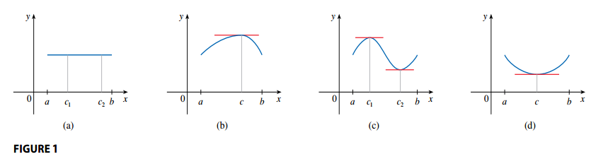

### The Mean Value Theorem

> [!TIP] **The Mean Value Theorem**
>
> Let $f$ be a function that satisfies:
>
> 1. $f$ is continuous on the closed interval $[a, b]$
> 2. $f$ is differentiable on the open interval $(a, b)$
>
> The there is a number $c$ in $(a, b)$ such that
>
> $$f'(c) = \frac{f(b) - f(a)}{b - a}$$
>
> or equivalently
>
> $$f(b) - f(a) = f'(c)(b - a)$$

The Mean Value Theorem says that there is at least one point $P(c, f(c))$ on the graph where the slope of the tangent line is the same as the slope of the secant line $A, B$ (see Figures 3 and 4).

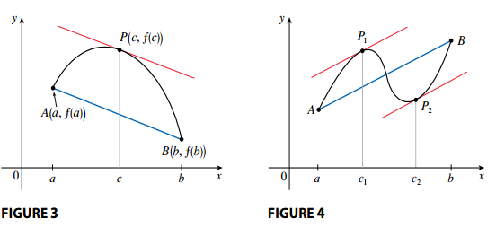

**PROOF** We see the the equation of the line $AB$ can be written as:

$$
y - f(a) = m_{AB} (x - a)
$$

where $m_{AB} = \frac{f(b) - f(a)}{b - a}$, thus

$$
y = f(a) + \frac{f(b) - f(a)}{b - a}(x - a)
$$

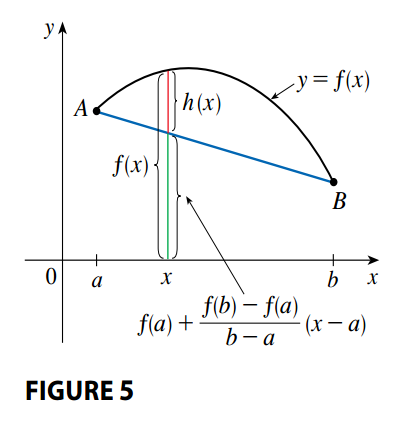

So, as we can see on Figure 5:

$$
h(x) = f(x) - y
$$

$$
h(x) = f(x) - f(a) - \frac{f(b) - f(a)}{b - a}(x - a)
$$

First, we must verify that $h$ satisfies the three hypotheses of [Rolle's Theorem](#rolles-theorem):

1. The function $h$ is continuous on $[a, b]$ because it is the sum of $f$ and a first-degree polynomial both of which are continuous.
2. The function $h$ is differentiable because both $f$ and the first degree polynomial are differentiable. Thus

$$
h'(x) = f'(x) - \frac{f(b) - f(a)}{b - a}
$$

3. We must show that $h(a) = h(b)$

$$
h(a) = f(a) - f(a) - \frac{f(b) - f(a)}{b - a}(a - a) = 0
$$

$$
h(b) = f(b) - f(a) - \frac{f(b) - f(a)}{b - a}(b - a)
$$

$$
= f(b) - f(a) - f(b) + f(a) = 0
$$

Which means $h(a) = h(b) = 0$.

Since $h$ satisfies all the hypotheses of [Rolle's Theorem](#rolles-theorem), there exists a number $c$ in $(a, b)$ such that $h'(c) = 0$. Therefore

$$
h'(c) = f'(c) - \frac{f(b) - f(a)}{b - a} = 0
$$

So

$$
f'(c) = \frac{f(b) - f(a)}{b - a}
$$

In general, the Mean Value Theorem can be interpreted as saying that there is a number at which the instantaneous rate of change is equal to the average rate of change over an interval.

The Mean Value Theorem can be used to establish some of the basic facts of differential calculus.

> [!TIP] **Theorem**
>
> If $f'(x) = 0$ for all $x$ in an interval $(a, b)$, then $f$ is constant on $(a, b)$

**PROOF**: Let $x_1$ and $x_2$ be any two numbers in $(a, b)$ with $x_1 < x_2$. Since $f$ is differentiable on $(a, b)$ it must be differentiable on $(x_1, x_2)$ and continuous on $[x_1, x_2]$. By applying the [Mean Value Theorem](#the-mean-value-theorem-1) to $f$ on the interval $[x_1, x_2]$, we get a number $c$ such that $x_1 < c < x_2$ and

$$
f(x_2) - f(x_1) = f'(c) (x_2 - x_1)
$$

Since $f'(x) = 0$ for all $x$, then $f'(c) = 0$ and therefore

$$
f(x_2) - f(x_1) = 0 \leftrightarrow f(x_2) = f(x_1)
$$

Thus $f$ has the same value at any two numbers $x_1$ and $x_2$ in $(a, b)$. This means that $f$ is constant on $(a, b)$.

> [!TIP] **Corollary**
>
> If $f'(x) = g'(x)$ for all $x$ in an interval $(a, b)$, then $f - g$ is constant on $(a, b)$; that is, $f(x) = g(x) + c$ where $c$ is a constant.

**PROOF**: Let $F(x) = f(x) - g(x)$. Then

$$
F'(x) = f'(x) - g'(x) = 0
$$

for all $x \in (a, b)$. Thus by the previous theorem $F$ is constant, that is $f - g$ is constant.

This corollary says that if two functions have the same derivatives on an interval, then their graphs must be vertical trasnlation of each other.

## What Derivatives Tell Us about the Shape of a Graph

### What Does $f'$ say about $f$?

> [!NOTE] **Increasing/Decreasing Test**
>
> If $f'(x) > 0$ on an interval, then $f$ is increasing on that interval
>
> If $f'(x) < 0$ on an interval, then $f$ is decreasin on that interval

See Figure 1 for a graphical representation.

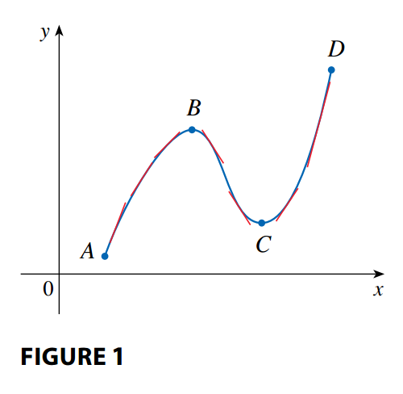

**PROOF**: Without loss of generality we let $x_1$ and $x_2$ be any two numbers on the interval with $x_1 < x_2$. According to the [definition of an increasing function](../../agaa/02_graph_analysis#increasing-decreasing-and-constant-functions) we have to show that $f(x_1) < f(x_2)$.

Because we are given that $f'(x) > 0$, we know that $f$ is differentiable on $[x_1, x_2]$. So, by the [Mean Value Theorem](#the-mean-value-theorem-1), there is a number $c$ between $x_1$ and $x_2$ such that

$$
f(x_2) - f(x_1) = f'(c)(x_2 - x_1)
$$

We know that $f'(c) > 0$ by our initial assumption and $x_2 - x_1$ because $x_1 < x_2$, thus the right side of the previous equation must be positive:

$$
f(x_2) - f(x_1) > 0
$$

Which is equivalent to

$$
f(x_2) > f(x_1)
$$

This shows that $f$ is increasing.

### The First Derivative Test

> [!NOTE] **The First Derivative Test**
>
> Suppose $c$ is a critical number of a continuous function $f$.
>
> 1. If $f'$ changes from positive to negative at $c$, then $f$ has a local maximum at $c$
> 2. If $f'$ changes from negative to positive at $c$, then $f$ has a local minimum at $c$
> 3. If $f'$ is positive to the left and right of $c$, or negative to the left and right of $c$ then $f$ has no local maximum or minimum at $c$

The First Derivative Test is illustrated in Figure 4.

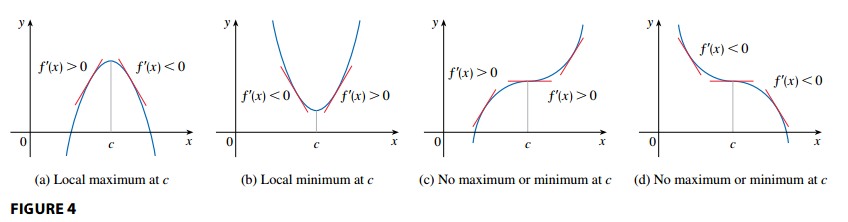

### What does $f''$ say about $f'$?

> [!TIP] **Concavity of a Function**
>
> If the graph of $f$ lies above all of its tangents on an interval $I$, then $f$ is called **concave upward** on $I$.
>
> If the graph of $f$ lies below all of its tangents on an interval $I$, then $f$ is called **concave downward** on $I$.

See Figure 7 for an illustration on the concavity of a function.

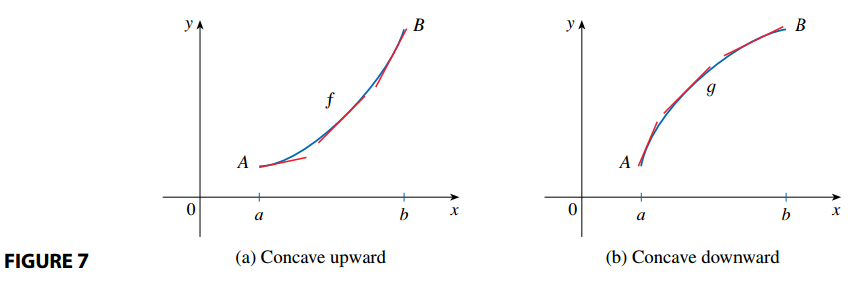

In Figure 7(a) we see that the slope of the tangent increases. This means that the derivative $f'$ is an increasing function and therefore its derivative $f''$ is positive. Likewise, in Figure 7(b) the slope of the tangent decreases, so $f'$ decreases and therefore $f''$ is negative.

> [!NOTE] **Concavity Test**
>
> 1. If $f''(x) > 0$ on an interval $I$, then the graph of $f$ is concave upward on $I$.
> 2. If $f''(x) < 0$ on an interval $I$, then the graph of $f$ is concave downward on $I$.

> [!TIP] **Inflection Point**
>
> A point $P$ on a curve $y = f(x)$ is called an **inflection point** if $f$ is continuous there and the curve changes from concave upward to concave downward or viceversa.

### The Second Derivative Test

> [!NOTE] **The Second Derivative Test**
>
> Suppose $f''$ is continuous near $c$
>
> 1. If $f'(c) = 0$ and $f''(c) > 0$, then $f$ has a local minimum at $c$
> 2. If $f'(c) = 0$ and $f''(c) < 0$, then $f$ has a local maximum at $c$

Note that The Second Derivative Test is inconclusive when $f''(c) = 0$ as there might be a maximum, a minimum or neither in that point. This test also fails when $f''(c)$ does not exist.

## Indeterminate Forms and l'Hospital's Rule

### Indeterminate Forms (Types $\frac{\infty}{\infty}$, $\frac{0}{0}$)

In general, if we have a limit of the form:

$$
\lim_{x \to a} \frac{f(x)}{g(x)}
$$

where both $f(x) \to 0$ and $g(x) \to 0$ as $x \to a$, then this limit may or may not exist, and is called an **indeterminate form of type** $\frac{0}{0}$.

In general, if we have a limit of the form:

$$
\lim_{x \to a} \frac{f(a)}{g(a)}
$$

where both $f(x) \to \infty$ (or $-\infty$) and $g(x) \to \infty$ (or $-\infty$) as $x \to a$, then this limit may or may not exist, and is called an **indeterminate form of type** $\frac{\infty}{\infty}$.

### L'Hospital's Rule

We introduce a systematic method for the evaluation of indeterminate forms of type $\frac{0}{0}$ or type $\frac{\infty}{\infty}$.

> [!NOTE] **L'Hospital's Rule**
>
> Suppose $f$ and $g$ are differentiable and $g'(x) \neq 0$ on an open interval $I$ that contains $a$ (except possibly at $a$). Suppose that:
>
> $$\lim_{x \to a} f(x) = 0 \text{ and } \lim_{x \to a} g(x) = 0$$
>
> or that
>
> $$\lim_{x \to a} f(x) = \pm \infty \text{ and } \lim_{x \to a} g(x) = \pm \infty$$
>
> So we have an indeterminate form of type $\frac{0}{0}$ or $\frac{\infty}{\infty}$. Then:
>
> $$\lim_{x \to a} \frac{f(x)}{g(x)} = \lim_{x \to a} \frac{f'(x)}{g'(x)}$$
>
> if the limit on the right side exists (or is $\infty$ or $-\infty$)

Note:

1. L'Hospital's Rule says that the limit of a quotient of function is equal to the limit of the quotient of their derivatives, provided that the conditions are satisfied.
2. L'Hospital's Rule is also valid for one-sided limit, and for limits at infinity or negative infinity.
3. For the special case in which $f(a) = g(a) = 0$, $f'$ and $g'$ are continuous and $g'(a) \neq 0$, it is easy to show why l'Hospital's Rule is true:

Given [$f'$ and $g'$ are continuous](../02_limits#continuity-of-a-function):

$$
\lim_{x \to a} \frac{f'(x)}{g'(x)} = \frac{f'(a)}{g'(a)}
$$

[By the definition of a derivative](../02_limits#derivatives):

$$
\frac{f'(a)}{g'(a)} = \frac{\lim_{x \to a} \frac{f(x) - f(a)}{x - a}}{\lim_{x \to a} \frac{g(x) - g(a)}{x - a}}
$$

[By the properties of limits](../02_limits#properties-of-limits):

$$
\frac{\lim_{x \to a} \frac{f(x) - f(a)}{x - a}}{\lim_{x \to a} \frac{g(x) - g(a)}{x - a}} = \lim_{x \to a} \frac{\frac{f(x) - f(a)}{x - a}}{ \frac{g(x) - g(a)}{x - a}}
$$

$$
\lim_{x \to a} \frac{\frac{f(x) - f(a)}{x - a}}{ \frac{g(x) - g(a)}{x - a}} = \lim_{x \to a} \frac{f(x) - f(a)}{g(x) - g(a)}
$$

Because $f(a) = g(a) = 0$

$$
\lim_{x \to a} \frac{f(x) - f(a)}{g(x) - g(a)} = \lim_{x \to a} \frac{f(x)}{g(x)}
$$

It is more difficult to prove the general version of l’Hospital’s Rule.

### Indeterminate Products (Type $0 \cdot \infty$)

If $\lim_{x \to a} f(x) = 0$ and $\lim_{x \to a} g(x) = \infty$ or ($- \infty$), then it isn't clear what the value of $\lim_{x \to a} [f(x)g(x)]$ will be.

This kind of limit is called an **indeterminate form of type** $0 \cdot \infty$. We can deal with it by writing the product $fg$ as a quotient:

$$
fg = \frac{f}{\frac{1}{g}} \text{ or } fg = \frac{g}{\frac{1}{f}}
$$

This converts the given limit into an indeterminate form of type $\frac{0}{0}$ or $\frac{\infty}{\infty}$ so that we can use l'Hospital's Rule.

### Indeterminate Differences (Type $\infty - \infty$)

If $\lim_{x \to a} f(x) = \infty$ and $\lim_{x \to a} g(x) = \infty$, then the limit:

$$
\lim_{x \to a} [f(x) - g(x)]
$$

is called an **indeterminate form of type** $\infty - \infty$. There is a contest between $f$ and $g$. Will the answer be $\infty$ ($f$ wins), $-\infty$ ($g$ wins) or will they compromise on a finite number? To find out, we try to convert the difference into a quotient so that we can have an indeterminate form of type $\frac{0}{0}$ or $\frac{\infty}{\infty}$.

### Indeterminate Powers (Types $0^0, \infty^0, 1^{\infty}$)

Several indeterminate forms arise from the limit:

$$
\lim_{x \to a} [f(x)]^{g(x)}
$$

1. $\lim_{x \to a} f(x) = 0$ and $\lim_{x \to a} g(x) = 0$, type $0^0$
2. $\lim_{x \to a} f(x) = \infty$ and $\lim_{x \to a} g(x) = 0$, type $\infty^0$
3. $\lim_{x \to a} f(x) = 1$ and $\lim_{x \to a} g(x) = \pm \infty$, type $1^{\infty}$

Each of these three cases can be treated by taking the natural logarithm as follows:

$$
\text{let } y = [f(x)]^{g(x)} \text{, then } \ln y = g(x) \ln f(x)
$$

Now we calculate:

$$
\lim_{x \to a} g(x) \ln f(x)
$$

This limit is always an indeterminate product (indeterminate form of type $0 \cdot \infty$), and can be solved as one, which will require the application of L'Hospital's Rule.

Once we get the value of the limit for $\ln y$, we can obtain the limit of $y$ by writing the logarithm of $y$ as an exponential:

$$
\lim_{x \to a} y = \lim_{x \to a} [f(x)]^{g(x)} = \lim_{x \to a} e^{\ln y} = \lim_{x \to a} e^{g(x) \ln f(x)} = e^{\lim_{x \to a} g(x) \ln f(x)}
$$

## Summary of Curve Sketching

### Guidelines for Sketching a Curve

The following checklist is intended as a guide to sketching a curve $y = f(x)$.

1. **Domain**: Start by determining the domain $D$ of $f$.
2. **Intercepts**:
   - Find where the curve intersects the $y$-axis by evaluating $f(0)$.
   - Find where the curve intersects the $x$-axis by solving $f(x) = 0$ for $x$.
3. **Symmetry**:
   - If $f(x) = f(-x)$ for all $x \in D$, then $f$ is an even function and the curve is symmetric about the $y$-axis.
   - If $-f(x) = f(-x)$ for all $x \in D$, then $f$ is an odd function and the curve is symmetric about the origin.
   - If $f(x) = f(x + p)$ for all $x \in D$, where $p$ is a positive constant then $f$ is a **periodic function** and the smallest such number $p$ is called the **period**.
4. **Asymptotes**:
   - Horizontal asymptotes: If either $\lim_{x \to \infty} f(x) = L$ or $\lim_{x \to -\infty} f(x) = L$, then the line $y = L$ is a horizontal asymptote of the curve $y = f(x)$.
   - Vertical asymptotes: The line $x = a$ is a vertical asymptote if either $\lim_{x \to a^+} f(x) = \infty$ and $\lim_{x \to a^-} f(x) = \infty$ or $\lim_{x \to a^+} f(x) = -\infty$ and $\lim_{x \to a^-} f(x) = -\infty$.
   - Slant asymptotes: these will be discussed later on.
5. **Intervals of Increase or Decrease**: Use the [Increasing/Decreasing Test](#what-does-f-say-about-f) to find the intervals in which $f$ increases or decreases.
6. **Local Maximum or Minimum Values**: Find the critical number of $f$, then use the [First Derivative Test](#the-first-derivative-test) to determine whether the critical numbers are maximum or minimum values for $f$.
7. **Concavity and Points of Inflection**: Compute $f''(x)$ and use the [Concavity Test](#what-does-f-say-about-f-1) to determine where $f$ is concave upward and where $f$ is concave downward.
8. **Sketch the Curve**: Using the information from the previous points, draw the graph of $f$.

### Slant Asymptotes

Some curve have asymptotes that are **oblique**. If:

$$
\lim_{x \to \infty} [f(x) - (mx + b)] = 0
$$

where $m \neq 0$, then the line $y = mx + b$ is called a **slant asymptote** because the vertical distance between the curve $y = f(x)$ and the line $y = mx + b$ approaches $0$ (see Figure 12). A similar situation exists is we let $x \to - \infty$.

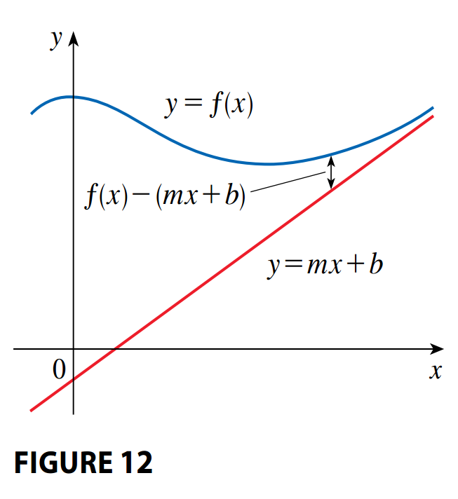

In the case of rational functions, slant asymptotes occur when the degree of the numerator is one more than the degree of the denominator. In such a case the equation of the slant asymptote can be found by long division.

**Example**

Given a function $f(x) = xe^{-\frac{1}{x}}$, we obtain its slant asymptote, denoted by $y = mx + b$ by first finding the slope $m$ as:

$$
m = \lim_{x \to \pm \infty} \frac{f(x)}{x} = \frac{xe^{-\frac{1}{x}}}{x} = e^{-\frac{1}{x}} = e^{0} = 1
$$

Thus $m = 1$. Now we compute the value for the intercept $b$ as:

$$
b = \lim_{x \to \pm \infty} (f(x) - mx) = xe^{-\frac{1}{x}} - x = x \left(e^{-\frac{1}{x}} - 1\right) = \infty \cdot (1 - 1) = \infty \cdot 0
$$

We apply L'Hopital's Rule:

$$
= \lim_{x \to \pm \infty} \frac{e^{- \frac{1}{x}} - 1}{\frac{1}{x}} = -\frac{e^{- \frac{1}{x}}x^{-2}}{x^{-2}} = -e^{- \frac{1}{x}} = e^{0} = -1
$$

Such that the slant asymptote is given by $y = mx + b = x - 1$.

### Practical questions

#### How to prove that a function is not periodic

A function $f(x)$ is periodic if it exists $T > 0$ such that:

$$
f(x + T) = f(x) \forall x
$$

There are a few ways in which we could prove $f$ is not periodic:

1. For simple functions you can **directly check whether a period $T > 0$ can exist** by solving:

$$
f(x + T) = f(x)
$$

2. Find a **contradiction with specific values**.
   - Pick a generic $x_1$ and try to find a generic $T$ that satisfies $f(x + T) = f(x)$, if there is not such $T$, then $f$ is not periodic.
   - If there is such a $T$, repeat the previous step with another generic $x_2$, repeat until you can disprove the periodicity (try with a sensible number of points).
3. If the **function increases or decreases without bound** (i.e. it tends to $\pm \infty$), then we can assume there is no periodicity because the values of $f$ keep getting larger and larger and do not follow a pattern.
4. If it is a composite function, where **one of the components is a non-periodic function**, then the composite function is also non-periodic.

#### How to prove that a function does not have asymptotes

To show **there exist no vertical asymptotes** for a function $f(x)$ we need to check limits near critical points:

- For a rational function, find $x$ such that the denominator is $0$.
- For logarithms, the argument of the function must be postive. So boundary points like $x = 0, \text{for} \ln(x)$ are candidates.
- For square roots or even roots, its argument must be non-negative. So boundary points like $x < 0 \text{for} \sqrt{x}$ are candidates.
- Any other undefined points.

This is to say that if

1. If $f$ is defined everywhere, then there is no vertical asymptote.
2. If the limits on critical points where $f$ would be undefined are finite, than there is no vertical asymptote.

To show **there exist no horizontal asymptotes** for a function $f(x)$ we have to study how the function behaves when $x$ increases or decreases without bound. If $f$ is infinite or does not exist when $x$ increases or decreases without bound, then there are no horizontal asymptotes.

To show **there exist no oblique asymptotes** for a function $f(x)$ we must show that the limit:

$$
\lim_{x \to \infty} \frac{f(x)}{x} = m
$$

or

$$
\lim_{x \to \infty} (f(x) - mx) = b
$$

either do not exist, or one of them is infinite.

## Graphing with Calculus and Techonology

> [!TIP] **Faimily of Functions**
>
> A **family of functions** are a set of functions that are related to each other by a formula that contains one or more arbitrary constants. Each value of the constant gives rise to a member of the family. For example
>
> $$f(x) = \frac{1}{x^2 + 2x + c}$$
>
> where $c$ is the constant that spans different family members.

## Optimization Problems

> [!TIP] **Steps to Solve Optimization Problems**
>
> 1. **Understand the problem**: indentify the main unknown variable, as well as other unknown quantities. Define which are the given conditions and restrictions of the problem.
> 2. **Draw a diagram**: to identify and relate visually the main unknown variable with the other unknown quantities.
> 3. **Introduce notation**: for the main unknown variable, which we'll denote by $Q$, as well as for other uknonw quantities (e.g. $a, b, c$, etc).
> 4. **Express $Q$ in terms of other symbols**: define $Q$ as a function of the other variables presented on the problem (e.g. $Q(x, y) = x + y$).
> 5. **Define relationships**: use the relationships between the other unknown quantities, which should be given by the restrictions and conditions laid out on the problem, to re-write $Q$ as a function of only one variable (e.g. $Q(x)$). Define the domain of $Q(x)$, this will be useful to both better understand the problem and to determine which method to apply.
> 6. **Find critical points**:
>    - If $Q(x)$ is constrained to an interval, use [The Closed Interval Method](#critical-numbers-and-the-closed-interval-method) to find the absolute minimum or maximum value of $Q(x)$,
>    - else use [The First Derivative Test](#the-first-derivative-test) to find the critical points.

> [!NOTE] **The First Derivate Test for Absolute Extreme Values**
>
> [The First Derivative Test](#the-first-derivative-test) can be used to find absolute extreme values if some conditions are met. Suppose $c$ is a critical point for a function $f$ defined on an interval $I$:
>
> - If $\forall x \in I, x < c, f'(x) < 0$ and $\forall x \in I, x > c, f'(x) > 0$, then $f$ has an absolute minimum at $x = C$.
> - If $\forall x \in I, x < c, f'(x) > 0$ and $\forall x \in I, x > c, f'(x) < 0$, then $f$ has an absolute maximum at $x = C$.

**Proof (Absolute Minimum)**

Suppose $f$ is a continuous differentiable function on an interval $I$, and let $c \in I$ be a critical point of $f$. Let us assume:

$$
\forall x \in I, \text{ where } x < c, f'(x) < 0 \text{ and } \forall x \in I, \text{ where } x > c, f'(x) > 0
$$

**(1)** Given any $x \in I$ with $x < c$, by [The Mean Value Theorem](#the-mean-value-theorem) there exists some $\xi \in (x, c)$ such that

$$
f'(\xi) = \frac{f(c) - f(x)}{c - x}
$$

Because $\xi < c$ we know that $f'(\xi) < 0$ by assumption. Also $c > x \leftrightarrow c - x > 0$. Hence

$$
f(c) - f(x) < 0 \leftrightarrow f(c) < f(x)
$$

That is, for every point $x$ to the left of $c$, $f(x)$ is bigger than $f(c)$.

**(2)** Given any $x \in I$ with $x > c$, by [The Mean Value Theorem](#the-mean-value-theorem) there exists some $\nu \in (c, x)$ such that

$$
f'(\nu) = \frac{f(x) - f(c)}{x - c}
$$

Because $\nu > c$ we know that $f'(\nu) > 0$ by assumption. Also $x > c \leftrightarrow x - c > 0$. Hence

$$
f(x) - f(c) > 0 \leftrightarrow f(x) > f(x)
$$

That is, for every point $x$ to the right of $c$, $f(x)$ is bigger than $f(c)$.

**(3)** By combining **(1)** and **(2)** we show that for all points on the interval $I$ that are not $c$, its value under $f$ is bigger than $f(c)$ thus we conclude that $f(c)$ is the abolute minimum of $f$ on the interval $I$.

## Newton's Method

Suppose we want to solve an equation $f(x)$, then we need to find the $x$-intercepts of $f$ (labelled $r$ in the following figure). Newton's Method allows us to find an approximation of $r$ by following these steps:

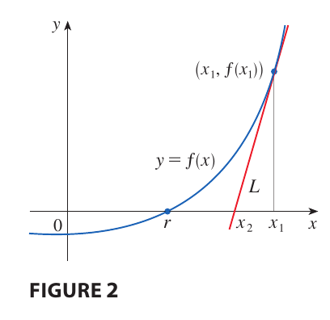

1. We start by defining a first approximation $x_1$ (by guesssing, from a sketch of the graph of $f$, etc.)
2. Then, we find the tanget line of $f$ on $(x_1, f(x_1))$, that we will denote as $L$. The idea behind Newton's Method is that as $L$ is close to the curve, then its $x$-intercept, $x_2$, should be close to the $x$-intercept of $f$. And so we use $x_2$ as the next approximation to $r$.
3. We keep repeting this process to obtain a sequence of approximations $x_1, x_2, \cdots$

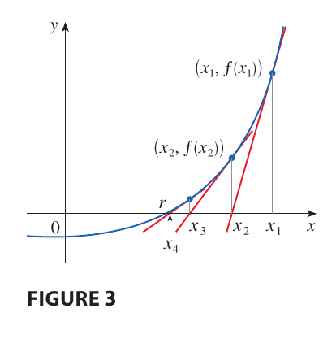

Because $L$ is a line, finding its $x$-intercept is easy. Let's find an expression that defines $x_2$ in terms of $x_1$. To do so we use [the equation of a line](/math/acs/07_linear_equations_two_vars#using-the-point-slope-form-to-write-equations-of-lines):

$$
y - f(x_1) = f'(x_1)(x - x_1)
$$

Where $f'(x_1)$ is the slope of $L$. Because we know that $(x_2, 0)$ is on $L$, then:

$$
0 - f(x_1) = f'(x_1)(x_2 - x_1) \Leftrightarrow -f(x_1) = f'(x_1)x_2 - f'(x_1) x_1
$$

$$
f'(x_1)x_2 = f'(x_1) x_1 - f(x_1)
$$

$$
x_2 = x_1 - \frac{f(x_1)}{f'(x_1)}
$$

> [!TIP] **Generalization of Newton's Method**
>
> In general, if the $n$-th approximation is $x_n$ and $f'(x_n) \neq 0$, then
>
> $$x_{n + 1} = x_n - \frac{f(x_n)}{f'(x_n)}$$

If the approximations $x_n$ become closer and closer to $r$ as $n$ becomes larger and larger, then we say the sequence converges to $r$, that is:

$$
\lim_{n \to \infty} x_n = r
$$

However, in certain circumstances, the sequence may not converge. See the following figure, where you can see that the approximation $x_2$ is worse than $x_1$. **This is likely to be the case when $f'(x_n)$ is close to zero**, as the slope becomes smaller and the $x$-intercept for the linear approximation of $f$ moves far away.

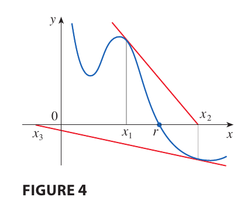

Then **Newton's Method fails and a better approximation $x_1$ should be chosen**.

Suppose we want to achieve a given accuracy of $k$ decimals, how do we know when to stop? The rule of thumb is to keep iterating over Newton's Method until $x_n$ and $x_{n + 1}$ agree up to $k$ decimal places.

### Basins of Attraction: Newton's Fractals

> Reference: [**Newton’s fractal (which Newton knew nothing about)**](https://www.youtube.com/watch?v=-RdOwhmqP5s)

> [!NOTE] **Basins of Attraction**
>
> Suppose a polynomial has several roots. Pick a starting point $z_0$ and apply Newton’s method. If this point always ends up at the same root, then all such starting points form a **basin of attraction**.

In simpler words: A basin of attraction is like a "territory" in the plane. Wherever you start inside it, you'll be "pulled" to the same root.

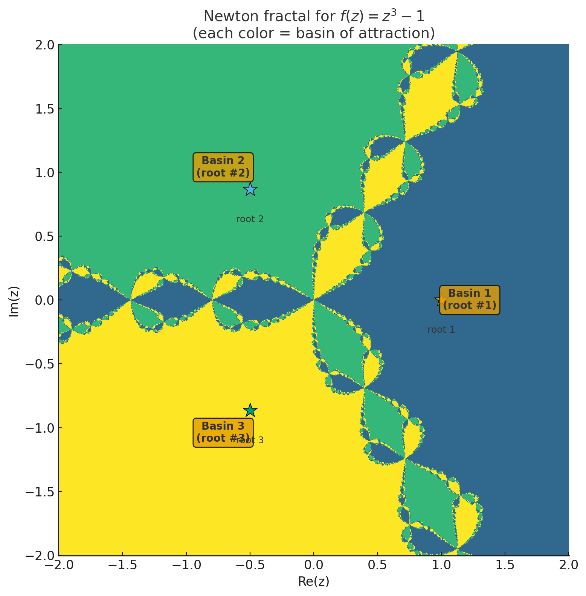

On the previous image you can see that the complexity is introduced at the boundaries of each basin. Let us define a boundary: Given any set (like a basin), a boundary point is one where, for any infinitely small circle, some points on the circle are inside the set while some other points on the circle are outside the set.

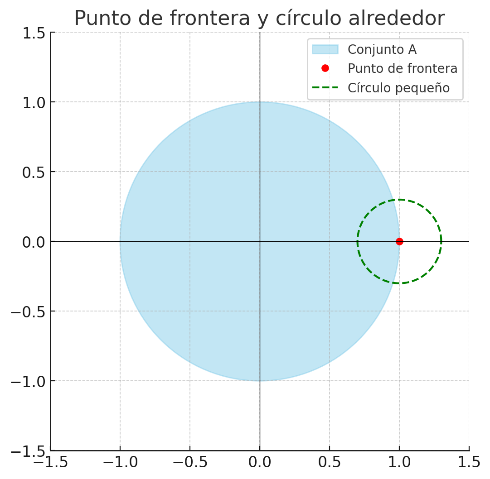

So, why do these fractal boundaries appear? One property that these boundaries must satisfy is: for any starting point that ends up at this boundary, it is not decisively attracted to one root. Instead, infinitely close neighbors can be pulled to wildly different roots. This means that even the tiniest perturbation flips its destiny. That's why the boundaries look chaotic — they are made up of points that can be "attracted" to any of the possible roots.

We can visualize this phenomenon by:

1. Picking a cluster of nearby starting points. For the phenomenon to take place the cluster of points shows be on the fractal boundaries.
2. Applying Newton’s method step by step.
3. Watching them scatter: some head to one root, others to another, depending on tiny differences in the start.

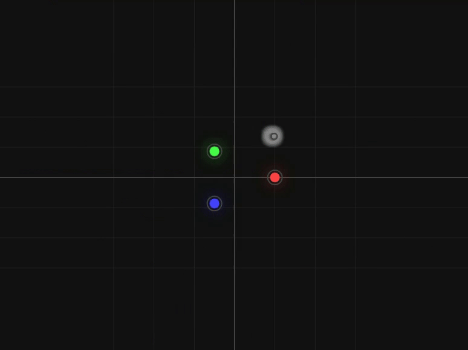

## Antiderivatives

> [!NOTE] **Antiderivative**
>
> Given a function $f$, we say $f$ is an **antiderivative** of $f$ on an interval $I$ if
>
> $$F'(x) = f(x), \forall x \in I$$

But is $F$ the only antiderivative for $f$? By the corollary of [The Mean Value Function](/math/cet/04_applications_differential_equations/#the-mean-value-theorem-1), given two functions $f$ and $g$, such that $f'(x) = g'(x)$, then

$$
f'(x) = g'(x) \leftrightarrow H(x) = f'(x) - g'(x) = 0 \leftrightarrow \\[5pt] H \text{ is a constant function, such that } H(x) = C, \text{ where } C \text{ is a constant}
$$

So, we would say that **the most general antiderivative** for a function $f$ is defined as:

$$
F(x) + C
$$

where $F$ is an antiderivative of $f$ on an interval $I$.

### Antidifferentiation formulas

On the following table we list some popular antiderivatives.

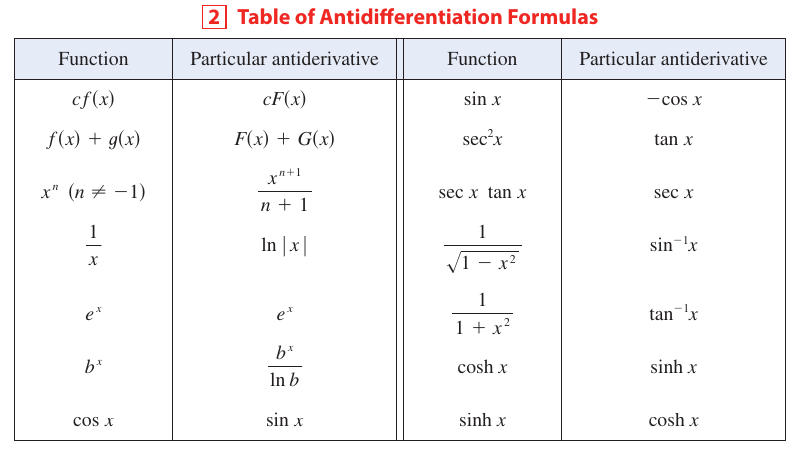

> [!TIP] **Differential equations**
>
> We define a **differential equation** as any equation that involves the derivative of a function, for example:
>
> $$\frac{\delta y}{\delta x} = 2$$
>
> Where we are relating the rate of change of $y$ with respect to $x$ to a concrete value, in this case the constant $2$.

### Graphing Antiderivatives

Given the graph of $f$ we should be able to sketch the graph for the general antiderivate $F$. To sketch $F$ we follow the shape of $f$ and what it tells us:

1. Is $f$ increasing or decreasing based on the sign of $f$
2. If $f$ has any root, then $F$ has critical points on those roots
3. If $f$ has local maximums or local minimums, then $F$ has inflections points

In the following figures we show an example on how to graph $F$ given the graph of $f$ and $F(0) = 2$.

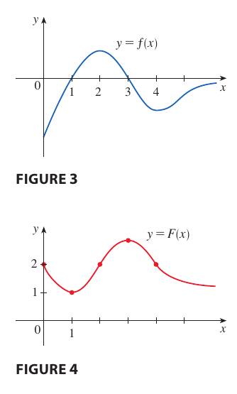

Note that the general form of the antiderivative is $F(x) + C$, that is, if we do not know any $(x, y)$ on $F$ there are infinitely possible graphs of $F$ given $f$, as $f$ only tells us the shape of $F$.

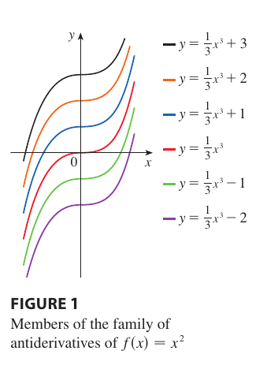

### Linear Motion

Given the position function $s(t)$, we know that the following relationships hold:

1. The velocity function is defined as $v(t) = s'(t)$
2. The acceleration function is defined as $a(t) = v'(t)$

Therefore:

1. The **velocity function is the antiderivative for the acceleration function**.
2. The **position function is the antiderivative for the velocity function**.
