## The Area and Distance Problems

### The Area Problem

We begin by attempting to solve the **area problem**: Find the area of the region $S$ that lies under the curve $y = f(x)$ from $a$ to $b$.

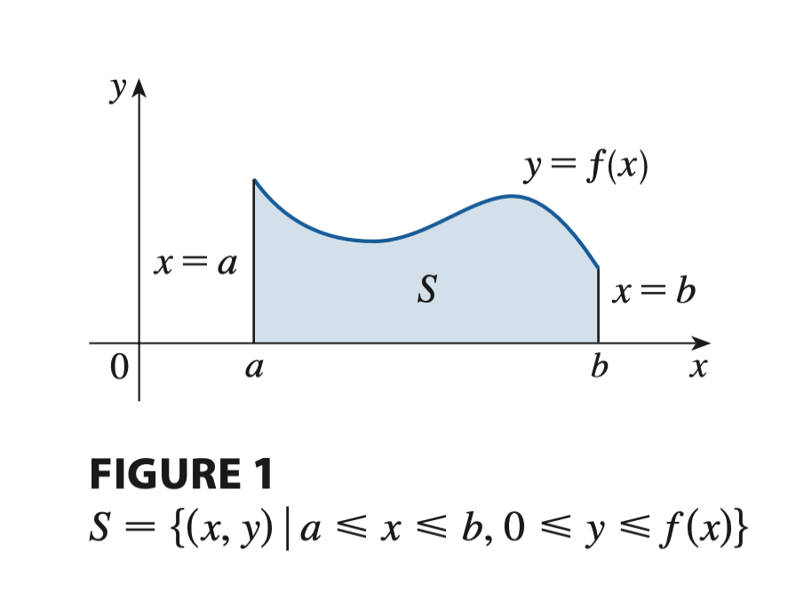

It isn’t easy, to find the area of a region with curved sides. To do so, we first approximate the region $S$ by rectangles, and then we take the limit of the sum of the areas of the approximating rectangles as we increase the number of rectangles.

We begin approximating each strip by a rectangle that has the same base as the strip and whose height is the same as the right edge of the strip [see Figure 4(b)]. In other words, the heights of these rectangles are the values of the function $f(x)$.

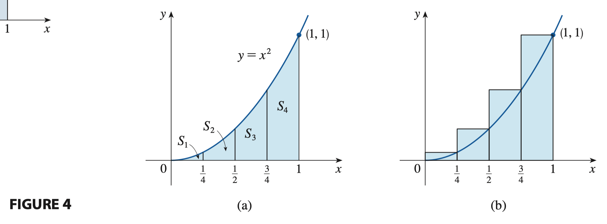

If we let $R_n$ be the sum of the areas of these approximating rectangles, we get

$$
R_n = \sum_{i = 1}^n \Delta x f(x_i)
$$

where $\Delta x$ is the constant width of the strips, and $f(x_i)$ is the height of the rectangle at the right-side point of the rectangle for the $i$-th strip. We can also compute the sum of the areas by taking $x_i$ to be the left-side point of the rectangle for the $i$-the strip:

$$
L_n = \sum_{i = 0}^{n - 1} \Delta x f(x_i)
$$

We could obtain better estimates by increasing the number of strips, that is, by increasing $n$.

From Figures 8 and 9 it appears that as $n$ increases, both $L_n$ and $R_n$ become better and better approximations to the area of $S$. Therefore, we define the area $A$ to be the limit of the sums of the areas of the approximating rectangles, that is,

$$
A = \lim_{n \to \infty} L_n = \lim_{n \to \infty} R_n
$$

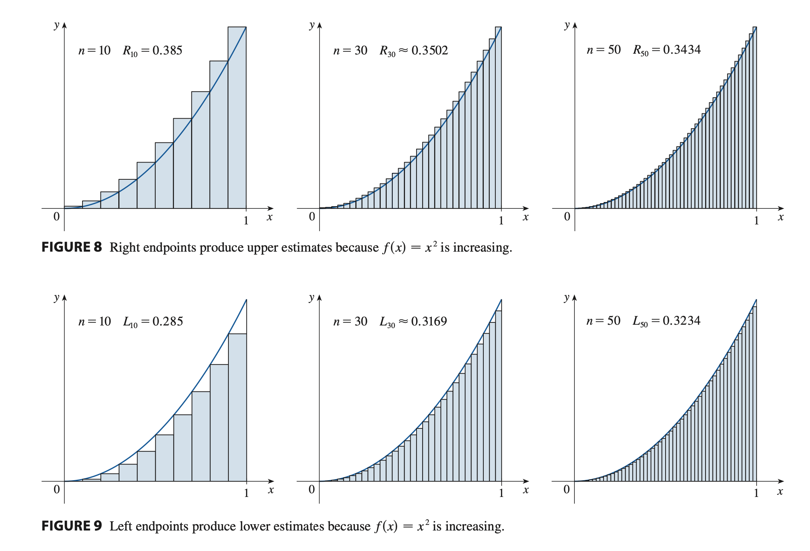

> [!NOTE] **Area under a Region $S$**
>
> The area $A$ of the region $S$ that lies under the graph of the continuous function $f$ is the limit of the sum of the areas of approximating rectangles:
>
> $$A = \lim_{n \to \infty} R_n = \lim_{n \to \infty} [\Delta x f(x_1) + \Delta x f(x_2) + \cdots + \Delta x f(x_n)]$$

It can be proved that the previous limit always exists, since we are assuming that $f$ is continuous. It can also be shown that we get the same value if we use left endpoints

$$
A = \lim_{n \to \infty} L_n = \lim_{n \to \infty} [\Delta x f(x_0) + \Delta x f(x_1) + \cdots + \Delta x f(x_{n - 1})]
$$

In fact, instead of using left endpoints or right endpoints, we could take the height of the $i$th rectangle to be the value of f at any number $x_i*$ in the $i$-th subinterval $[x_{i -1}, x_i]$. We call the numbers $[x_1*, x_2*, \cdots, x_n*]$ the sample points. Figure 13 shows approximating rectangles when"the sample points are not chosen to be endpoints. So a more general expression for the area of $S$ is

$$
A = \lim_{n \to \infty} [\Delta x f(x_1^*) + \Delta x f(x_2^*) + \cdots + \Delta x f(x_n^*)]
$$

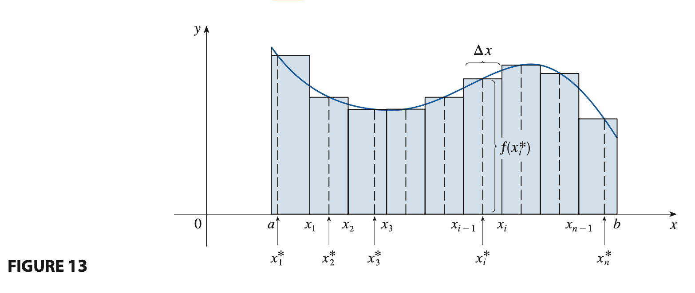

**NOTE** To approximate the area under the graph of $f$ we can form lower sums (or upper sums) by choosing the sample points $x_i*$ so that $f(x_i*)$ is the minimum (or maximum) value of $f$ on the $i$-th subinterval (see Figure 14).

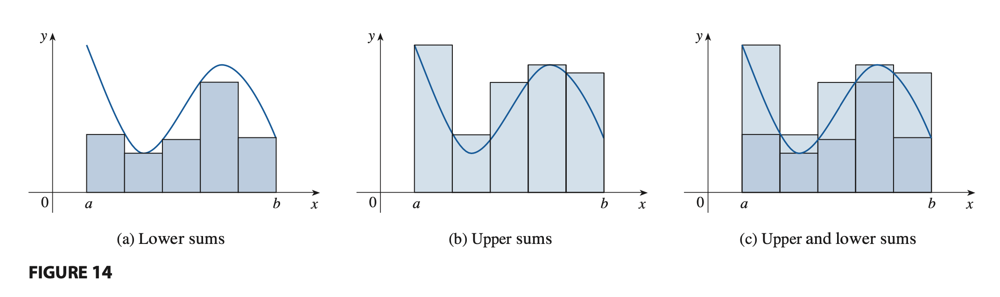

### The Distance Problem

Now let’s consider the **distance problem**: find the distance traveled by an object during a certain time period if the velocity of the object is known at all times. If the velocity remains constant, then the distance problem is easy to solve by means of the formula

$$
\text{distance} = \text{velocity} \cdot \text{time}
$$

Let's sketch an approximate graph of the velocity function along with rectangles whose heights are the initial velocities for each time interval [see Figure 17(a)]

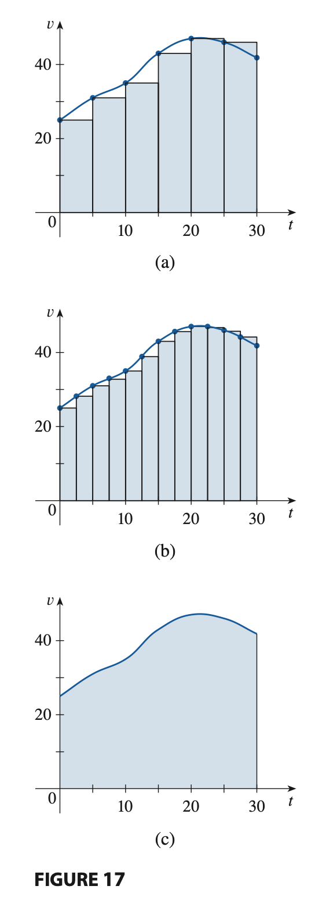

The area of each rectangle can be interpreted as a distance because the height represents velocity and the width represents time. The sum of the areas of the rectangles in Figure 17(a) is our initial estimate for the total distance traveled.

If we want a more accurate estimate, we could take velocity readings more often, as illustrated in Figure 17(b). You can see that the more velocity readings we take, the closer the sum of the areas of the rectangles gets to the exact area under the velocity curve [see Figure 17(c)]. This suggests that the total distance traveled is equal to the area under the velocity graph.

In general, suppose an object moves with velocity $v = f(t)$, where $a \leq t \leq b$ and $f(t) \geq 0$ (so the object always moves in the positive direction). We take velocity readings at times $t_0 (=a), t_1, \cdots, t_n(=b)$ so that the velocity is approximately constant on each subinterval. If these times are equally spaced, then the time between consecutive readings is $\Delta t = \frac{b - a}{n}$. The total distance traveled during the time interval $[a, b]$ is approximately:

$$
f(t_0) \Delta t + f(t_1) \Delta t + \cdots + f(t_{n - 1}) \Delta t = \sum_{i = 1}^{n} f(t_{i - 1}) \Delta t
$$

If we use the velocity at right endpoints instead of left endpoints, our estimate for the total distance becomes

$$
f(t_1) \Delta t + f(t_1) \Delta t + \cdots + f(t_n) \Delta t = \sum_{i = 1}^n f(t_i) \Delta t
$$

The more frequently we measure the velocity, the more accurate our estimates become, so it seems plausible that the exact distance d traveled is the limit of such expressions:

$$
d = \lim_{n \to \infty} \sum_{i=1}^n \Delta t f(t_{i - 1}) = \lim_{n \to \infty} \sum_{i=1}^n \Delta t f(t_i)
$$

Because the previous equation has the same form as our expressions for the area under a region $S$, it follows that the distance traveled is equal to the area under the graph of the velocity function.

## The Definite Integral

### Definite Integrals

> [!NOTE] **Definite Integral**
>
> If $f$ is a function defined for $a \leq x \leq b$, we divide the interval $[a, b]$ into $n$ subintervals of equal width $\Delta x = \frac{b - a}{n}$. We let
>
> - $x_0 (=a), x_1, x_2, \cdots, x_n(=b)$ be the endpoints of these subintervals and
> - $x_1^\*, x_2^\*, \cdots, x_n^\*$ be any **sample points** in these subintervals, so $x_i^*$ lies in the $i$th subinterval $[x_{i-1}, x_i]$.
>
> Then the **definite integral of $f$ from $a$ to $b$** is
>
> $$\int_{a}^b f(x) dx = \lim_{n \to \infty} \sum_{i=1}^n f(x_i^*) \Delta x$$
>
> provided that this limit exists and gives the same value for all possible choices of sample points. If it does exist, we say that $f$ is **integrable** on $[a, b]$.

The precise meaning of the limit for the definite integral is as follows:

> For every number $\epsilon > 0$, there is an integer $N$ such that
>
> $$|\int_{a}^b f(x) dx - \sum_{i=1}^{n} f(x_i^*) \Delta x| < \epsilon$$
>
> for every integer $n > N$ and for every choice of $x_i^*$ in $[x_{i - 1}, x_i]$.

This follows from the [definition of limits on the infinite](/math/cet/02_limits/#precise-definition-of-a-limit-at-infinity).

> [!TIP] **Integral Notation**
>
> The symbol $\int$ was introduced by [Leibniz](https://wikipedia.org/wiki/Gottfried_Leibniz) and is called an **integral sign**. It was chosen becase an integral is a limit of sums.
>
> In the notation $\int_a^b f(x) dx$, $f(x)$ is called the **integrand** and $a$ and $b$ are called the **limits of integration**, where $a$ is the **lower limit** and $b$ is the **upper limit**. While the $dx$ simply indicates that the independent variable is $x$.
>
> The procedure of calculating an integral is called **integration**.

**Note** that the definite integral $\int_a^b f(x) dx$ is a number, that is, it does not depend on $x$. In fact we could use any letter in place of $x$ without changin the value of the integral.

**Also note** that the sum

$$
\sum_{i = 1}^n f(x_i^*) \Delta x
$$

is called a **Riemann sum** after the German mathematician [Berhard Riemann](https://wikipedia.org/wiki/Bernhard_Riemann). So the Definition of a Definite Integral says that the definite integral of an integrable function ca be approximated to within any desired degree of accuracy by a Riemann sum.

We know that if $f$ happes to be positive, then the Riemann sum can be interpreted as the sum of areas of approximating rectangles (see Figure 1).

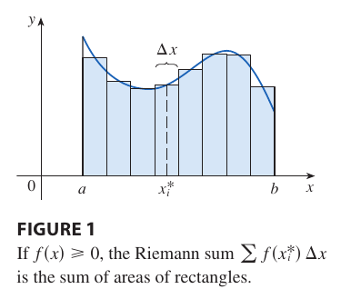

If $f$ takes on both positive and negative values, as in Figure 3, then the Riemann sum is the sum of the areas of the rectangles that lie above the $x$-axis and the negatives of the areas of the rectangles that lie below the $x$-axis.

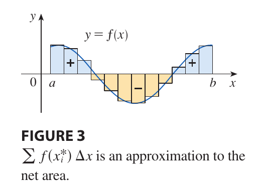

So, a definite integral can be interpreted as a **net area**, that is, a difference of areas:

$$
\int_a^b f(x) dx = A_1 - A_2
$$

where $A_1$ is the area of the region above the $x$-axis and below the graph of $f$, and $A_2$ is the area of the region below the $x$-axis and above the graph of $f$.

Although we have defined $\int_a^b f(x) dx$ by dividing $[a, b]$ into subintervals of equal width, there are situations in which it is advantageous to work with subintervals of unequal width. If the subinterval widths are $\Delta x_1, \Delta x_2, \cdots, \Delta x_n$ we have to ensure that all these widths approach $0$ in the limiting process.

This happens if the largest width, $\max \Delta x_i$, approaches $0$. **Why?** For the limit of the sums of rectangle areas to converge to the value of the integral, **we need the rectangles to be arbitrarily thin**. Imagine some subintervals stay wide, then the sum does not approximate necessarily the real area (the value of the integral). Because in this case, **a wide subinterval might enclose great variations on $f(x)$**, and so the rectangle defined by this subinterval does not "represent" $f(x)$ well enough. So the following must hold:

$$
\max_i \Delta x_i \to 0
$$

That is, the width of the widest subinterval tends to zero.

So in this case the definition of a definite integral becomes

$$
\int_{a}^b f(x) dx = \lim_{\max \Delta x_i \to 0} \sum_{i = 1}^n f(x_i^*) \Delta x_i
$$

We have defined the definite integral for an integrable function, but not all functions are integrable.

> [!TIP] **Condition for Integrability**
>
> If $f$ is continuous on $[a, b]$ or if $f$ has only a finite number of jump discontinuities, then $f$ is integrable on $[a, b]$; that is the definite integral $\int_a^b f(x) dx$ exists.

**Why is $f$ said to be integrable under such conditions?**

Let's start by with **the condition of $f$ being continuous**. If $f$ is continuous, on very small subintervals (we know the subintervals tend to width zero) then $f$ does not "change abruptly". Thus any sample point $x_i^\*$ on that subinterval will resolve to a height of $f(x_i^*)$, which will be very similar to all the other possible heights for any other sample point on the subinterval.

Thus the rectangles on the Riemann sums will be very similar for any arbitrary sample point. Therefore all the approximations for the area under $f$ tend to the same value.

This makes the limit exist, and thus $f$ is integrable.

**What if $f$ is not continuous but has a finite number of jump discontinuities?** In this case the discontinuities can create some local error on the Riemann sum. However the total error can be made arbitrarily small by making the subintervals that contain these discontinuities smaller and smaller.

To be more concrete, image an subinterval which contains a jump discontinuity (e.g. there is a jump discontinuity at $x = c$, such that $f(c^-) = 1$ and $f(c^+) = 3$). Then, no matter the sample point you choose, the area will not fully capture the behaviour of $f$ on that subinterval.

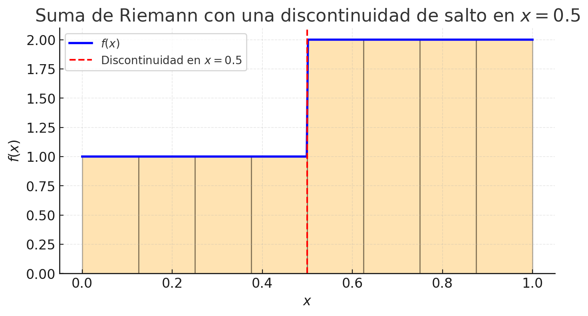

Note, however, that the error depends on the width of the subinterval:

$$
\text{error} \approx \text{height differences} \times \text{width}
$$

If the width of the subinterval can be made infinitely smaller, then the error will tend to zero. And we do not know that the width of the subintervals do tend to zero, therefore the local error introduced by the discontinuities also do tend to zero, then the limit exists and $f$ is integrable.

But you may ask, **why does this not always hold with an infinite number of jump discontinuities?** Another way to state Riemann's definition for integrability is:

> A function $f$ on $[a, b]$ is integrable if and only if the set of all its jump discontinuities has **measure zero**.

What does this mean for us? **The fact that $f$ has infinitely many jump discontinuities it is not itself a problem**. The problem arises when the measure of these jump discontinuities is not zero, then:

- The difference of the upper and lower Riemann sums do not tend to zero, no matter how small the subintervals.
- Thus the Riemann integral does not exist and $f$ is not integrable.

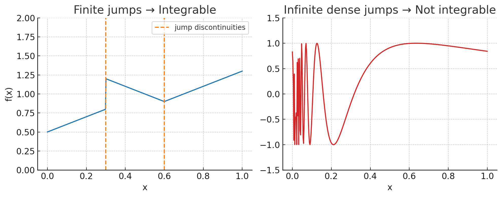

The previous image illustrates this fenomenon. On the lefthand figure we can see that the function only has two jump discontinuities, whose contribution to the area can be forced to zero by making the subintervals that contain them have width zero.

However, in the figure on the right, the function exhibits an infinite number of dense oscillations, effectively creating infinitely many discontinuities throughout the interval. As a result, the Riemann sums fail to converge, and the function is not integrable.

To simplify the calculation of the integral we often take the sample points to be right endpoints. Then $x_i^\* = x_i$ and the definition of an integral is as follows.

> [!NOTE] **Integral by Righthand Rule**
>
> If $f$ is integrable on $[a, b]$, then
>
> $$\int_a^b f(x) dx = \lim_{n \to \infty} \sum_{i = 1}^n f(x_i) \Delta x$$
>
> where $\Delta x = \frac{b - a}{n}$ and $x_i = a + i \Delta x$.

### Evaluating Definite Integrals

The following four equations give formulas for sums of powers of positive integers which we will use to help us on the evaluation of integrals.

> [!TIP] **Sums of Powers**
>
> $$\sum_{i=1}^n 1 = n$$
>
> $$\sum_{i=1}^n i = \frac{n(n + 1)}{2}$$
>
> $$\sum_{i=1}^n i^2 = \frac{n(n + 1)(2n + 1)}{6}$$
>
> $$\sum_{i=1}^n i^3 = \left[\frac{n(n + 1)}{2}\right]^2$$

The remaining formulas are simple rules for working with sigma notation:

> [!TIP] **Properties of Sums**
>
> $$\sum_{i = 1}^n ca_i = c \sum_{i=1}^n a_i$$
>
> $$\sum_{i = 1}^n a_i + b_i = \sum_{i=1}^n a_i + \sum_{i=1}^n b_i$$
>
> $$\sum_{i = 1}^n a_i - b_i = \sum_{i=1}^n a_i - \sum_{i=1}^n b_i$$

### The Midpoint Rule

We often choose the sample point $x_i^\*$ to be the right endpoint of the $i$-the subinterval. But if the purpose is to find an approximation to an integral, it is usually better to choose $x_i^\*$ to be the midpoint of the interval, which we denote by $\overline{x}_i$.

This statement is numerically true because using the midpoint does reduce the approximation error when computing Riemann's sum, whilst using either the right or left endpoint does result in a bigger approximation error.

What would happen if you were to choose the right endpoints? Then

$$
x^{*}_i = x_i
$$

Now, if $f$:

- Increases on the $i$-the subinterval, using the right endpoint overestimates the area.
- Decreases on the $i$-the subinterval, using the right endpoint underestimates the area.

As you can see we are systematically introducing bias. However when we take the midpoint we neutralize this bias.

The value of $f$ at $\overline{x}_i$ is generally closer to the mean value of $f$ on the $i$-th subinterval. This is based on the fact that **the mean value of a smooth function on a small interval approximates its value on its midpoint**. This can be shown by using Taylor's Polynomial.

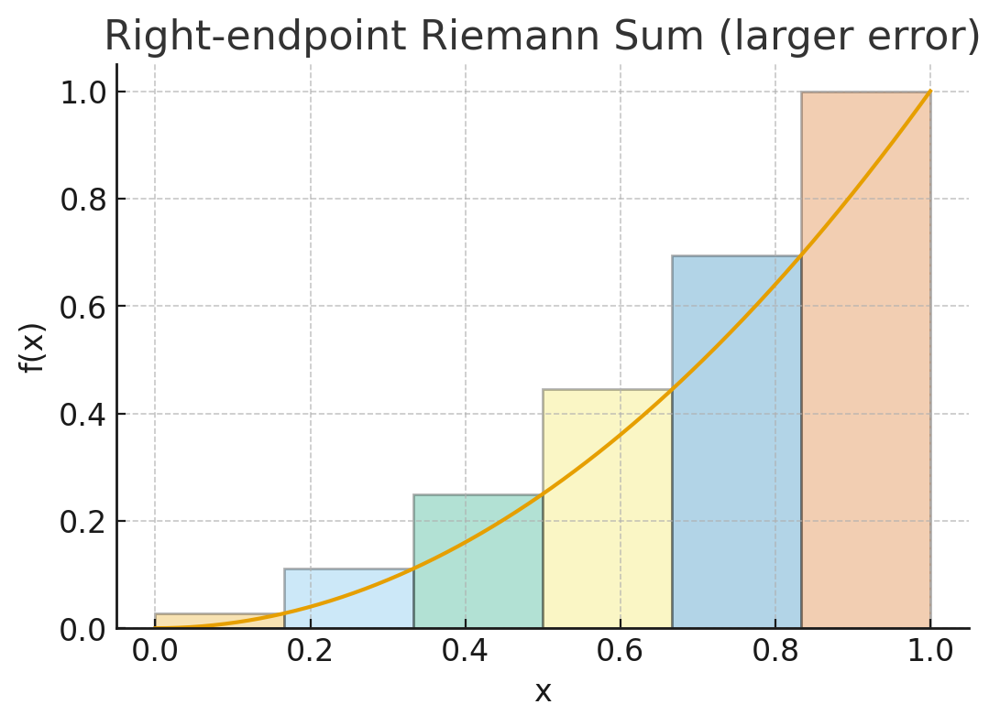

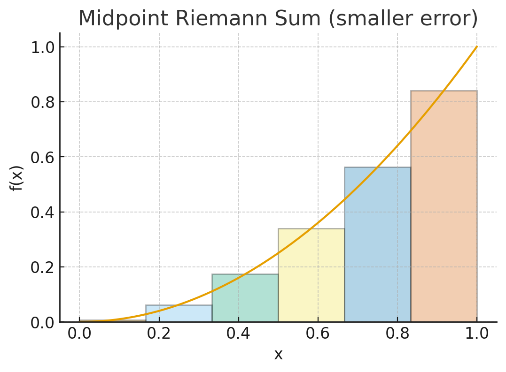

> [!NOTE] **Midpoint Rule**
>
> $$\int_a^b f(x) dx \approx \sum_{i=1}^n f(\overline{x}_i) \Delta x = \Delta x [f(\overline{x}_1) + \cdots + f(\overline{x}_n)]$$
>
> where $\Delta x = \frac{b - a}{n}$
>
> and $\overline{x}\_i = \frac{1}{2} (x_{i - 1} + x_i) = \text{midpoint of } [x_{i - 1}, x_i]$.

### Properties of the Definite Integral

When we defined the definite integral $\int_a^b f(x) dx$, we implicitly assumed that $a < b$. But the definition as a limit of Riemann sums makes sense even if $a > b$. Notice that if we interchange $a$ and $b$, then $\Delta x$ changes from $\frac{b - a}{n}$ to $\frac{a - b}{n}$. Therefore

$$
\int_b^a f(x) dx = - \int_a^b f(x) dx
$$

as $\Delta x_{ba} = - \Delta x_{ab}$. Also note that if $a = b$, then $\Delta x = 0$ and so:

$$
\int_a^a f(x) dx = 0
$$

We now develop some basic properties of integrals that will help us to evaluate integrals in a simple manner. We assume that $f$ and $g$ are continuous functions.

> [!TIP] **Properties of the Integral**
>
> 1. $\int_a^b c dx = c(b - a)$, where $c$ is any constant.
> 2. $\int_a^b [f(x) + g(x)]dx = \int_a^b f(x) dx + \int_a^b g(x)dx$
> 3. $\int_a^b cf(x) dx = c \int_a^b f(x) dx$
> 4. $\int_a^b [f(x) - g(x)]dx = \int_a^b f(x) dx - \int_a^b g(x)dx$

**Property 1** says that the integral ofo a constante function $f(x) = c$ is the constant times the length of the interval. If $c > 0$ and $a < b$, this is to be expected because $c(b - a)$ is the area of the shaded rectangle in Figure 14.

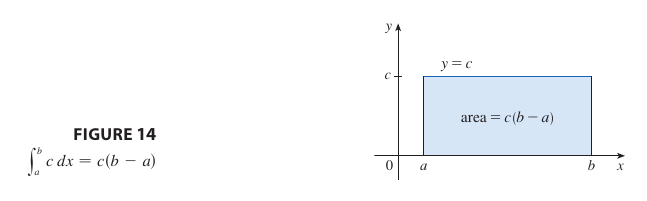

**Property 2** says that the integral of a sum is the sum of the integrals. For positive functions it says that the are under $f + g$ is the area under $f$ plus the area under $g$ (see Figure 15).

In general, Property 2 follows from [the definition of the value of a definite integral](/math/cet/05_integrals/#definite-integrals) and the fact that [the limit of a sum is the sum of the limits](/math/cet/02_limits/#properties-of-limits):

$$
\int_a^b [f(x) + g(x)] dx = \lim_{n \to \infty} \sum_{i = 1}^n [f(x_i) + g(x_i)] \Delta x
$$

$$
= \lim_{n \to \infty} \left[\sum_{i = 1}^n f(x_i) \Delta x + \sum_{i = 1}^n g(x_i) \Delta x\right]
$$

$$
= \lim_{n \to \infty} \sum_{i = 1}^n f(x_i) \Delta x + \lim_{n \to \infty} \sum_{i = 1}^n g(x_i) \Delta x
$$

$$
= \int_a^b f(x) dx + \int_a^b g(x) dx
$$

**Property 3** can be proved in a similar manner and says that the integral of a constant times a function is the constant times the integral of the function. **Property 4** is proved by writing $f - g = f + (-g)$ and using Properties 2 and 3 with $c = -1$.

The next property tells us how to combine integrals of the same function over adjacent intervals.

> [!TIP] **Transitive Property for the Integral**
>
> 5. $\int_a^c f(x) dx + \int_c^b f(x) dx = \int_a^b f(x) dx$

This is not easy to prove in general, but for the case where $f(x) \geq 0$ and $a < c < b$, this property can be seen from the geometric interpretation in Figure 16.

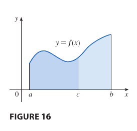

Properties 1-5 are true whether $a < b, a = b$ or $a > b$. The following properties, in which we compare sizes of functions and sizes of integrals, **are true only if $a \leq b$**.

> [!TIP] **Comparison Properties of the Integral**
>
> 6. If $f(x) \geq 0$ for $a \leq x \leq b$, then $\int_a^b f(x) dx \geq 0$
> 7. If $f(x) \geq g(x)$ for $a \leq x \leq b$, then $\int_a^b f(x) dx \geq \int_a^b g(x) dx$
> 8. If $m \leq f(x) \leq M$ for $a \leq x \leq b$, then
>
> $$m(b - a) \leq \int_a^b f(x) dx \leq M(a - b)$$

**Proof of Property 6**

Let $f$ be an integrable function such that $f(x) \geq 0, \forall x \in [a, b]$, then by the [definition of a definite integral](/math/cet/05_integrals/#the-definite-integral):

$$
\int_a^b f(x) dx = \lim_{n \to \infty} \sum_{i = 1}^n f(x^*_i) \Delta x
$$

Because $f(x) \geq 0, \forall x \in [a, b]$, then $f(x^*_i) \geq 0$. Also $a \leq b$, thus $\Delta x \geq 0$. Therefore:

$$
f(x^*_i)\Delta x \geq 0, \forall x^*_i
$$

By the properties of real numbers, we know that the sum of non-negative numbers results in a non-negative number, that is:

$$
\lim_{n \to \infty} \sum_{i = 1}^n f(x^*_i) \Delta x \geq 0
$$

Thus

$$
\int_a^b f(x) dx \geq 0
$$

**Proof of Property 7**

Let $f$ and $g$ be integrable functions such that $f(x) \geq g(x), \forall x \in [a, b]$, then

$$
f(x^*_i) \geq g(x^*_i)
$$

By [the properties of inequalities](/math/acs/02_equations_inequalities/#multiplication-property-of-inequality), given $\Delta x \geq 0$:

$$
f(x^*_i) \Delta x \geq g(x^*_i) \Delta x
$$

where $x^\*_i$ are is an arbitrary sample point on the $i$-th subinterval. Therefore, by [the properties of limits](/math/cet/02_limits/#the-squeeze-theorem)

$$
\lim_{n \to \infty} \sum_{i = 1}^n f(x^*_i) \Delta x \geq \lim_{n \to \infty} \sum_{j = 1}^n g(x^*_j) \Delta x
$$

Thus, by the [definition of the definite integral](/math/cet/05_integrals/#the-definite-integral)

$$
\int_a^b f(x) dx \geq \int_a^b g(x) dx
$$

**Property 8** is illustrated by Figure 17 for the case where $f(x) \geq 0$.

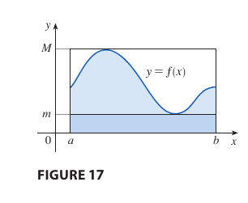

**Proof of Property 8**

Since $m \leq f(x) \leq M$, Property 7 gives

$$
\int_a^b m dx \leq \int_a^b f(x) dx \leq \int_a^b M dx
$$

Using **Property 1** to evaluate the integrals of the constant functions

$$
m(b - a) \leq \int_a^b f(x) dx \leq M(b - a)
$$

**Property 8** is useful when all we want is a rough estimate of the size of an integral.

## The Fundamental Theorem of Calculus

Calculus was born from two big questions that, for centuries, seemed to have little to do with each other. The first was **the tangent problem**: how to find the slope of a curve at a single point. This question gave rise to differential calculus. The second was the **area problem**: how to find the exact area under a curve. This gave rise to integral calculus. For a long time, these were considered separate fields of study.

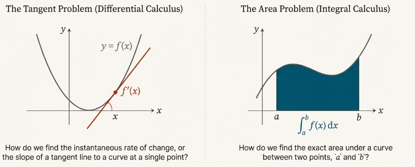

The **breakthrough came with the discovery of a profound and beautiful connection between them**. This connection is so central to the subject that it is called the Fundamental Theorem of Calculus.

**The Fundamental Theorem of Calculus** is appropriately named because it establishes a connection between the two branches of calculus: **differential calculus** and **integral calculus**.

This theorem reveals that the two problems are not separate at all. In fact, it shows that differentiation (finding slopes) and integration (finding areas) are **inverse processes**.

Understanding this deep relationship is the key to unlocking a powerful and surprisingly simple method for solving complex area problems that had once stumped the greatest minds.

To see how these two ideas are connected, we first need to look at a special kind of function—one that measures area as it accumulates.

### The Fundamental Theorem of Calculus, Part 1

#### Intuitive Basis of the Theorem

The first part of the Fundamental Theorem of Calculus (FTC1) provides the initial, foundational link between the derivative and the integral. It achieves this by defining a function in terms of an integral and then demonstrating that the derivative of this new function is the original function being integrated. Let this function be as follows:

$$
g(x) = \int_{a}^x f(t) dt
$$

The function $g(x)$ can be understood intuitively as the accumulated area under the graph of the function $f$ from a starting point a to a variable endpoint $x$ (see Figure 1). To understand why the rate of change of this area at $x$ is simply the value of the function $f$ at $x$, consider a small change in $x$, denoted by $h$.

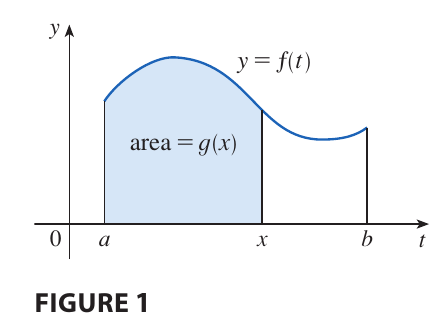

The quantity $g(x + h) - g(x)$ represents the area under the curve of $f$ over the small interval from $x$ to $x + h$. Consider the thin vertical strip of area under the curve between $x$ and $x+h$. For a sufficiently small width $h$, the height of the curve $f$ does not change significantly, and thus this sliver of area can be closely approximated by a rectangle of width $h$ and height $f(x)$. This can be visualized on the following Figure.

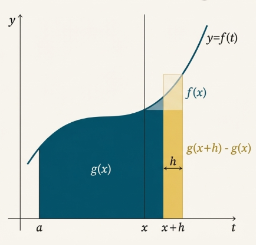

Therefore, we can state the approximation:

$$
g(x + h) - g(x) \approx h f(x)
$$

That is:

$$
\frac{g(x + h) - g(x)}{h} \approx f(x)
$$

Intuitively, as $h$ approaches zero, this approximation becomes an equality, suggesting that the instantaneous rate of change of the area function $g(x)$ (that is, its derivative) is precisely the height of the original function, $f(x)$.

#### Formal Statement of the Theorem (FTC1)

> [!NOTE] **The Fundamental Theorem of Calculus, Part 1**
>
> If $f$ is a function continuous on $[a, b]$, then the function $g$ defined by
>
> $$g(x) = \int_a^x f(t) dt$$
>
> for $a \leq x \leq b$, is continuous on [a, b] and differentiable on the open interval $(a, b)$, with its derivative given by:
>
> $$g'(x) = f(x)$$

#### Formal Proof

The formal proof of FTC1 rigorously confirms this intuition using established theorems. The logical flow proceeds as follows:

1. **Express the Difference Quotient as an Integral**: The definition of the derivative of $g(x)$ begins with the difference quotient. If $x$ and $x + h$ are in $(a, b)$, then

$$
g(x + h) - g(x) = \int_a^{x + h} f(t) dt - \int_a^{x} f(t) dt
$$

By the [Properties of the Definite Integral](/math/cet/05_integrals/#properties-of-the-definite-integral):

$$
= \left(\int_a^{x} f(t) dt + \int_x^{x + h} f(t) dt \right) - \int_a^{x} f(t) dt
$$

$$
= \int_x^{x + h} f(t) dt
$$

So, for $h \neq 0$

$$
g(x + h) - g(x) = \int_x^{x + h} f(t) dt
$$

$$
\frac{g(x + h) - g(x)}{h} = \frac{1}{h}\int_x^{x + h} f(t) dt
$$

2. **Apply the Extreme Value Theorem**: Because $f$ is continuous on the interval $[x, x + h]$, by the [Extreme Value Theorem](/math/cet/04_applications_differential_equations/#absolute-and-local-extreme-values), there exist numbers $u$ and $v$ in $[x, x + h]$ such that $f(u) = m$ and $f(v) = M$, such that:

$$
m \leq f(x) \leq M
$$

Thus, by the [Properties of the Definite Integral](/math/cet/05_integrals/#properties-of-the-definite-integral):

$$
m(x + h - x) \leq \int_x^{x + h} f(t) dt \leq M(x + h - x)
$$

$$
mh \leq \int_x^{x + h} f(t) dt \leq Mh
$$

3. **Apply the Squeeze Theorem**: Dividing the inequality by $h$ (for $h > 0$) and substituting the expression from step 1 yields an inequality for the difference quotient. Thus:

$$
m \leq \frac{1}{h}\int_x^{x + h} f(t) dt \leq M
$$

$$
f(u) \leq \frac{1}{h}\int_x^{x + h} f(t) dt \leq f(v)
$$

As $h$ approaches $0$, the interval $[x, x + h]$ shrinks, forcing both $u$ and $v$ to approach $x$. Since $f$ is continuous, $f(u)$ and $f(v)$ must both approach $f(x)$. By the Squeeze Theorem, the difference quotient trapped between them must also approach $f(x)$.

$$
\lim_{h \to 0} f(u) = \lim_{u \to x} f(u) = f(x)
$$

and

$$
\lim_{h \to 0} f(v) = \lim_{v \to x} f(v) = f(x)
$$

Thus, by the Squeeze Theorem

$$
\lim_{h \to 0} \frac{1}{h}\int_x^{x + h} f(t) dt = \lim_{h \to 0} \frac{g(x + h) - g(x)}{h} = g'(x) = f(x)
$$

This concludes the proof that $g'(x) = f(x)$.

#### Interpretation and Application

Using Leibniz notation, FTC1 can be expressed with remarkable conciseness:

$$
\frac{\delta}{\delta x} \int_a^x f(t) dt = f(x)
$$

This equation provides a powerful statement: the process of differentiation "undoes" or inverts the process of integrating a function with respect to its upper limit. If we begin with a continuous function $f$, integrate it to define a new function, and then differentiate that new function, we recover the original function $f$.

### The Fundamental Theorem of Calculus, Part 2

The second part of the Fundamental Theorem of Calculus (FTC2) is the result that revolutionized the practical application of calculus. It provides a direct and efficient method for calculating the exact value of a definite integral, obviating the arduous process of computing the limit of Riemann sums.

#### Formal Statement of the Theorem (FTC2)

> [!NOTE] **The Fundamental Theorem of Calculus, Part 2**
>
> If $f$ is continuous on the closed interval $[a, b]$, then
>
> $$\int_a^b f(x) dx = F(b) - F(a)$$
>
> where $F$ is any antiderivative of $f$ (that is, a function such that $F' = f$).

This result is remarkable. The definite integral on the left side of the equation is defined as a limit of sums that depends on all values of the function $f(x)$ across the entire interval from $a$ to $b$. Yet, FTC2 reveals that this value can be determined by simply finding an antiderivative, $F(x)$, and evaluating it at only two points: the endpoints of the interval, $a$ and $b$.

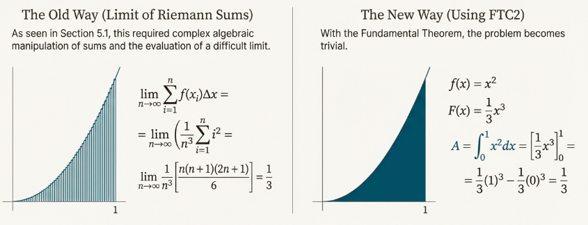

The power of FTC2 comes with a critical condition: **the function $f(x)$ must be continuous over the entire interval $[a, b]$**. If this condition is violated, the theorem cannot be applied, and doing so leads to an incorrect result.

Why is continuity a requirement? The FTC cannot be applied to functions with infinite discontinuities. If the function is not continuous and has an infinite number of jump discontinuities, then the integral does not exist.

#### Formal Proof

Let $g(x) = \int_a^x f(t) dt$. We know from [Part 1](/math/cet/05_integrals/#the-fundamental-theorem-of-calculus-part-1) that $g'(x) = f(x)$. If $F$ is any other antiderivative of $f$ on $[a, b]$, then by [the definition of the general antiderivative](/math/cet/04_applications_differential_equations/#antiderivatives) we know that:

$$
F(x) = g(x) + C
$$

for $a < x < b$. But both $F$ and $g$ are continuous on $[a, b]$ and so, by taking limits of both sides (as $x \to a^+$ and $x \to b^-$), we see that it also holds when $x = a$ and $x = b$. So

$$
F(x) = g(x) + C
$$

for all $x \in [a, b]$. If we let $x = a$ in the formula for $g(x)$, we get

$$
g(a) = \int_a^a f(t) dt = 0
$$

So using the previous expression with $x = b$ and $x = a$, we have

$$
F(b) - F(a) = \left[g(b) + C\right] - \left[g(a) + C\right]
$$

$$
g(b) - g(a) = g(b) = \int_a^b f(t) dt
$$

#### Interpretation and Application

Although the theorem may be surprising at first glance, it becomes plausible if we interpret it in physical terms. If $v(t)$ is the velocity of an object and $s(t)$ is its position at time $t$, then $v(t) = s'(t)$, so $s$ is an antiderivative of $v$. We made the observation that the area under the velocity curve is equal to the distance traveled. In symbols:

$$
\int_a^b v(t) dt = s(b) - s(a)
$$

That is exactly what FTC2 says.

We often use the notation:

$$
F(x) \Big|_a^b = F(b) - F(a)
$$

So the equation of FTC2 can be written as

$$
\int_a^b f(x) dx = F(x) \Big|_a^b
$$

### Differentiation and Integration as Inverse Processes

Taken together, the two parts of the Fundamental Theorem of Calculus provide a complete and rigorous statement on the inverse relationship between differentiation and integration. By viewing them side-by-side, we can see how they form a perfectly symmetrical argument.

1. **Part 1**: If

$$
g(x) = \int_a^x f(t) dt
$$

then

$$
g'(x) = f(x)
$$

2. **Part 2**: $\int_a^b f(x) dx = F(b) - F(a)$, where $F' = f$

These two statements describe the same fundamental connection from opposite perspectives.

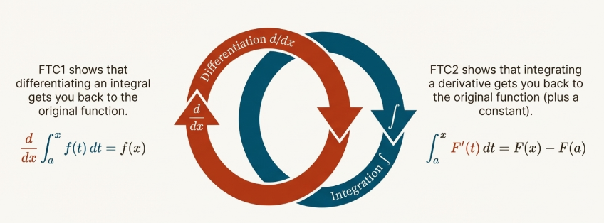

1. **Differentiation Undoes Integration**: Part 1, expressed in Leibniz notation, gives us the clear statement:

$$
\frac{\delta}{\delta x} \int_a^x f(t) dt = f(x)
$$

This equation shows that if we begin with a continuous function $f$, perform the operation of integration (with a variable upper limit), and then perform the operation of differentiation, we are returned to the original function $f$.

2. **Integration Undoes Differentiation**: Part 2 can be adapted to demonstrate the reverse process. By replacing $f(x)$ with $F'(x)$, we can write:

$$
\int_a^x F'(t) dt = F(x) - F(a)
$$

This equation shows that if we begin with a function $F$, differentiate it to get $F'$, and then integrate the result, we recover the original function $F$, but not uniquely. We recover the function $F$ adjusted by the constant $F(a)$. This result is a direct manifestation of the fact that integration recovers a family of functions, $F(x) + C$. The definite integral from $a$ to $x$ selects the specific member of that family for which the value at $x = a$ is zero, thus pinning down the constant of integration.

Taken together, these two symmetrical results provide the rigorous mathematical proof that differentiation and integration are inverse processes. This powerful relationship is what makes the theorem so central to the structure and application of calculus.

The discovery and exploitation of this theorem transformed mathematics. It converted previously formidable problems of finding areas, volumes, and lengths of curves—challenges that were once accessible only to a "genius"—into a systematic and reliable method.

## TL;DR

**The Fundamental Theorem of Calculus**


