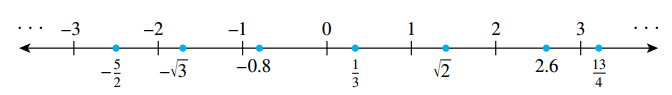

## Variables

A variable is as a placeholder when you want to talk about something but either (1) you imagine that it has one or more values but you don’t know what they are, or (2) you want whatever you say about it to be equally true for all elements in a given set, and so you don’t want to be restricted to considering only a particular, concrete value for it.

To illustrate the first use, consider asking

> Is there a number with the following property: doubling it and adding 3 gives the same result as squaring it?

In this sentence you can introduce a variable to replace the potentially ambiguous word “it”:

> Is there a number x with the property that \(2x + 3 = x^2\)?

To illustrate the second use of variables, consider the statement

> No matter what number might be chosen, if it is greater than \(2\), then its square is greater than \(4\).

In this case introducing a variable to give a temporary name to the (arbitrary) number you might choose enables you to maintain the generality of the statement.

> No matter what number \(n\) might be chosen, if \(n\) is greater than \(2\), then \(n^2\) is greater than \(4\).

### Some Important Kinds of Mathematical Statements

> [!TIP] **Universal Statement**
>
> A **universal statement** says that a certain property is true for all elements in a set.
>
> _All positive numbers are greater than zero_

> [!TIP] **Conditional Statement**
>
> A **conditional statement** says that if one thing is true then some other thing also has to be true.
> _If 378 is divisible by 18, then 378 is divisible by 6_

> [!TIP] **Existential Statement**
>
> Given a property that may or may not be true, an **existential statement** says that there is at least one thing for which the property is true.
>
> _There is a prime number that is even_

### Universal Conditional Statements

A **universal conditional statement** is a statement that is both universal and conditional

> For every animal \(a\), if \(a\) is a dog, then \(a\) is a mammal

They can be rewritten in ways that make them appear to be purely universal or purely conditional. For example, the previous statement can be rewritten in a way that makes its conditional nature explicit but its universal nature implicit:

> If \(a\) is a dog, then \(a\) is a mammal.

The statement can also be expressed so as to make its universal nature explicit and its conditional nature implicit:

> For every dog \(a\), \(a\) is a mammal.

### Universal Existential Statements

A **universal existential statement** is a statement that is universal because its first part says that a certain property is true for all objects of a given type, and it is existential because its second part asserts the existence of something

> Every real number has an additive inverse.

### Existential Universal Statements

An **existential universal statement** is a statement that is existential because its first part asserts that a certain object exists and is universal because its second part says that the object satisfies a certain property for all things of a certain kind

> There is a positive integer that is less than or equal to every positive integer.

## The Language of Sets

> [!TIP] **Set-Roster Notation**
>
> If \(S\) is a set the notation \(x \in S\) means that \(x\) is an element of \(S\). The notation \(x \notin S\) means that \(x\) is not al element of \(S\).
>
> A set may be specified using the **set-roster notation** by writing all of its elements between braces (e.g. \(\{1, 2, 3\}\)).

> [!NOTE] **Axiom of Extension**
>
> The **axiom of extension** says that a set is completely determined by what its elements are—not the order in which they might be listed or the fact that some elements might be listed more than once.

|    Symbol    | Set                             |
| :----------: | ------------------------------- |
| $\mathbb{R}$ | The set of all real numbers     |
| $\mathbb{Z}$ | The set of all integers         |
| $\mathbb{Q}$ | The set of all rational numbers |

Addition of a superscript $+$ or $-$ or the letters nonneg indicates that only the positive or negative or nonnegative elements of the set. For example $\mathbb{R}^+$ denotes the set of positive real numbers and $\mathbb{Z}$ denotes the set of nonnegative integers.

Some authors refer to the set of nonnegative integers as the set of **natural numbers** and denote it as $\mathbb{N}$.

The set of real numbers is divided into three parts: the set of positive real numbers, the set of negative real numbers, and the number $0$. Note that $0$ is neither positive nor negative.

The real number line is called continuous because it is imagined to have no holes. The set of integers corresponds to a collection of points located at fixed intervals along the real number line. Thus every integer is a real number, and because the integers are all separated from each other, the set of integers is called _discrete_.

> [!NOTE] **Set-Builder Notation**
>
> Let $S$ denote a set and let $P(x)$ be a property that elements of S may or may not satisfy. We may define a new set to be the set of all elements $x$ in S such that $P(x)$ is true. We denote this set as follows:
>
> $$\{x \in S | P(x)\}$$

Occasionally we will write $\{x | P(x)\}$ without being specific about where the element $x$ comes from.

### Subsets

> [!TIP] **Subset**
>
> If $A$ and $B$ are sets, then $A$ is called a subset of $B$, written $A \subseteq B$, if, and only if, every element of $A$ is also an element of $B$.
>
> $$A \subseteq B \leftrightarrow \forall x, x \in A \leftarrow x \in B$$

It follows from the definition of subset that for a set $A$ not to be a subset of a set $B$ means that there is at least one element of $A$ that is not an element of $B$.

$$A \nsubseteq B \leftrightarrow \exists x, x \in A \text{ and } x \notin B$$

> [!TIP] **Proper Subset**
>
> Let $A$ and $B$ be sets. $A$ is a **proper subset** of $B$ if, and only if, every element of $A$ is in $B$ but there is at least one element of $B$ that is not in $A$.

## Cartesian Products

Finally, in 1921, the Polish mathematician [Kazimierz Kuratowski](https://es.wikipedia.org/wiki/Kazimierz_Kuratowski) (1896–1980) published the following definition, which has since become standard. It says that an ordered pair is a set of the form

$$
\{\{a\}, \{a, b\}\}
$$

If $a \neq b$ then the two sets are distinct and $a$ is in both sets whereas $b$ is not. This allows us to distinguish between $a$ and $b$ and say that a is the first element of the ordered pair and $b$ is the second element of the pair.

If $a = b$ the ordered pair becomes $\{\{a\}, \{a, a\}\}$, which equals $\{\{a\}\}$

The usual notation for ordered pairs refers to $\{\{a\}, \{a, b\}\}$ more simply as $(a, b)$.

> [!TIP] **Ordered Pairs**
>
> Given elements $a$ and $b$, the symbol $(a, b)$ denotes the ordered pair consisting of $a$ and $b$ together with the specification that $a$ is the first element of the pair and $b$ is the second element.

> [!NOTE] **Equal Ordered Pairs**
>
> Two ordered pairs $(a, b)$ and $(c, d)$ are equal if, and only if, $a = c$ and $b = d$. Symbolically:
>
> $$(a, b) = (c, d) \leftrightarrow a = c \text{ and } b = d$$

The notation for an ordered $n$-tuple generalizes the notation for an ordered pair to a set with any finite number of elements. It also takes both order and multiplicity into account.

> [!TIP] **Ordered $n$-tuple**
>
> Let $n$ be a positive integer and let $x_1, x_2, \cdots, x_n$ be (not necessarily distinct) elements. The **ordered $n$-tuple**, $(x_1, x_2, \cdots, x_n)$ consists of $x_1, x_2, \cdots, x_n$ together with the ordering: first $x_1$, then $x_2$, and so forth up to $x_n$.

> [!NOTE] **Equal Ordered $n$-tuples**
>
> Two ordered $n$-tuples $(x_1, x_2, \cdots, x_n)$ and $(y_1, y_2, \cdots, y_n)$ are **equal** if and only if $x_1 = y_1, x_2 = y_2, \cdots, \text{ and } x_n = y_n$.

> [!TIP] **Cartesian Product**
>
> Given sets $A_1, A_2, \cdots, A_m$, the **Cartesian product** of $A_1, A_2, \cdots, A_n$ denoted $A_1 \times A_2 \times \cdots \times A_n$ is the set of all ordered $n$-tuples $(a_1, a_2, \cdots, a_n)$ where $a_1 \in A_1, a_2 \in A_2, \cdots, a_n \in A_n$.

> [!TIP] **String**
>
> Let $n$ be a positive integer. Given a finite set $A$, a **string of length $n$ over $A$** is an ordered $n$-tuple of elements of $A$ writter without parentheses or commas.

The elements of $A$ are called the **characters** of the string. The **null string** over $A$ is defined to be the string with no characters. It is often denoted $\lambda$ and is said to have length $0$.

## The Language of Relations and Functions
