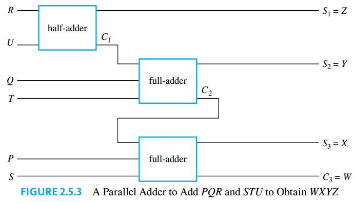

## Logic Form and Logic Equivalence

An **argument** is a sequence of **statements** aimed at demonstrating the truth of an assertion. The assertion at the end of the sequence is called the **conclusion**, and the preceding statements are called **premises**. The following shows an example of an argument:

It common form is as follows

### Statements

> [!TIP] **Statement**
>
> A **statement** (or **proposition**) is a sentence that is true or false but not both

### Compound Statements

We now introduce three symbols that are used to build more complicated logical expressions out of simpler ones.

1. The symbol $\sim$ denotes not
2. The symbol $\wedge$ denotes and
3. The symbol $\vee$ denotes or

Its order of preference is:

1. The not operation $\sim$
2. The $\wedge$ and $\vee$ operation are considered equal.

### Truth Values

> [!TIP] **Negation**
>
> If $p$ is a statement variable, the **negation** of $p$ is "not $p$" or "It is not the case that $p$" and is denoted $\sim p$. It has opposite truth value from $p$.

> [!TIP] **Conjunction**
>
> If $p$ and $q$ are statement variables, the **conjunction** of $p$ and $q$ is "$p$ and $q$", denoted $p \wedge q$. It is true when, and only when, both $p$ and $q$ are true. If either $p$ or $q$ is false, or if both are false, $p \wedge q$ is false.

> [!TIP] **Disjunction**
>
> If $p$ and $q$ are statement variables, the **disjunction** of $p$ and $q$ is "$p$ or $q$", denoted $p \vee q$. It is true when either $p$ is true, or $q$ is true, or both are true. It is false when both $p$ and $q$ are false.

### Evaluating the Truth of More General Compound Statements

> [!TIP] **Statement Form**
>
> A **statement form** (or **propositional form**) is an expression made up of statement variables (such as $p$, $q$, and $r$) and logical connectives (such as , $\sim$, $\wedge$, and $\vee$) that becomes a statement when actual statements are substituted for the component statement variables.

The **truth table** for a given statement form displays the truth values that correspond to all possible combinations of truth values for its component statement variables.

Logic does not help you determine the truth or falsity of the component statements. Rather, logic helps link these separate pieces of information together into a coherent whole.

### Logical Equivalence

> [!NOTE] **Logical Equivalence**
>
> Two statement forms are called **logically equivalent** if, and only if, they have identical truth values for each possible substitution of statements for their statement variables. The logical equivalence of statement forms $P$ and $Q$ is denoted by writing $P \equiv Q$.

> [!NOTE] **Logical Equivalence**
>
> Two statements are called **logically equivalent** if, and only if, they have logically equivalent forms when identical component statement variables are used to replace identical component statements.

To test whether two statement forms p and q are logically equivalent:

1. Construct a truth table with one column for the truth values of $P$ and another column for the truth values of $Q$.
2. Check each combination of truth values of the statement variables to see whether the truth value of $P$ is the same as the truth value of $Q$.
   - If in each row the truth value of $P$ is the same as the truth value of $Q$, then $P$ and $Q$ are logically equivalent
   - If in some row $P$ has a different truth value from $Q$, then $P$ and $Q$ are not logically equivalent

There are two ways to show that statement forms $P$ and $Q$ are not logically equivalent. As indicated previously, one is to use a truth table to find rows for which their truth values differ. The other way is to find concrete statements for each of the two forms, one of which is true and the other of which is false

> [!TIP] **De Morgan's Laws**
>
> The negation of an and statement is logically equivalent to the or statement in which each component is negated.
>
> $$\sim(p \wedge q) \equiv \sim p \vee \sim q$$
>
> The negation of an or statement is logically equivalent to the and statement in which each component is negated.
>
> $$\sim(p \vee q) \equiv \sim p \wedge \sim q$$

### Tautologies and Contradictions

> [!TIP] **Tautology**
>
> A **tautology** is a statement form that is always true regardless of the truth values of the individual statements substituted for its statement variables.

A statement whose form is a tautology is a **tautological statement**.

> [!TIP] **Contradiction**
>
> A **contradication** is a statement form that is always false regardless of the truth values of the individual statements substituted for its statement variables.

A statement whose form is a contradiction is a **contradictory statement**.

> [!NOTE] **Logical Equivalences**
>
> Given any statement variables $p$, $q$, and $r$, a tautology $t$ and a contradiction $c$, the following logical equivalences hold.
>
> - Commutative laws:
>
>   $$p \wedge q \equiv q \wedge p$$
>
>   $$p \vee q \equiv q \vee p$$
>
> - Associative laws:
>
>   $$(p \wedge q) \wedge r \equiv p \wedge (q \wedge r)$$
>
>   $$(p \vee q) \wedge r \equiv p \wedge (q \vee r)$$
>
> - Distributive laws:
>
>   $$p \wedge (q \vee r) \equiv (p \wedge q) \vee (p \wedge r)$$
>
>   $$p \vee (q \wedge r) \equiv (p \vee q) \wedge (p \vee r)$$
>
> - Identity laws:
>
>   $$p \wedge t \equiv p$$
>
>   $$p \vee c \equiv p$$
>
> - Negation laws:
>
>   $$p \wedge \sim p \equiv c$$
>
>   $$p \vee \sim p \equiv t$$
>
> - Double negative laws:
>
>   $$\sim(\sim p) \equiv p$$
>
> - Idempotent laws:
>
>   $$p \wedge p \equiv p$$
>
>   $$p \vee p \equiv p$$
>
> - Universal bound laws:
>
>   $$p \vee t \equiv t$$
>
>   $$p \wedge c \equiv c$$
>
> - De Morgan's laws:
>
>   $$\sim(p \wedge q) \equiv \sim p \vee \sim q$$
>
>   $$\sim(p \vee q) \equiv \sim p \wedge \sim q$$
>
> - Absorption laws:
>
>   $$p \vee (p \wedge q) \equiv p$$
>
>   $$p \wedge (p \vee q) \equiv p$$
>
> - Negations of t and c laws:
>
>   $$\sim t \equiv c$$
>
>   $$\sim c \equiv t$$

The first five laws are the axioms for a mathematical structure known as a Boolean algebra

Although these properties can be used to prove the logical equivalence of two statement forms, they cannot be used to prove that statement forms are not logically equivalent

## Conditional Statements

> [!TIP] **Conditional**
>
> If $p$ and $q$ are statement variables, the conditional of $q$ by $p$ is "If $p$ then $q$" or "$p$ implies $q$" and is denoted $p \rightarrow q$. It is false when $p$ is true and $q$ is false; otherwise it is true.

We call $p$ the **hypothesis** (or **antecedent**) of the conditional and $q$ the **conclusion** (or **consequent**).

A conditional statement that is true by virtue of the fact that its hypothesis is false is often called **vacuously true** or **true by default**.

### Representation of If-Then as Or

The following equivalences can be proved using a truth table:

$$
p \rightarrow q \equiv \sim p \vee q
$$

$$
\sim (p \rightarrow q) \equiv p \wedge \sim q
$$

### The Contrapositive of a Conditional Statement

> [!TIP] **Contrapositive**
>
> The contrapositive of a conditional statement of the form "If $p$ then $q$" is
>
> $$\text{If } \sim q \text{ then } \sim p$$
>
> Symbollically the contrapositive of
>
> $$p \rightarrow q$$
>
> is
>
> $$\sim q \rightarrow \sim p$$

**A conditional statement is logically equivalent to its contrapositive.**

### The Converse and Inverse of a Conditional Statement

> [!TIP] **Converse**
>
> The **converse** of
>
> $$p \rightarrow q$$
>
> is
>
> $$q \rightarrow p$$

> [!TIP] **Inverse**
>
> The **inverse** of
>
> $$p \rightarrow q$$
>
> is
>
> $$\sim p \rightarrow \sim q$$

1. A conditional statement and its converse are not logically equivalent.
2. A conditional statement and its inverse are not logically equivalent.
3. The converse and the inverse of a conditional statement are logically equivalent to each other.

### Only If and the Biconditional

If $p$ and $q$ are statements, $p$ **only if** $q$ means "if not $q$ then not $p$" or equivalently "if $p$ then $q$".

> [!TIP] **Biconditional**
>
> Given statement variables $p$ and $q$, the **biconditional** of $p$ and $q$ is "$p$ if, and only if, $q$" and is denoted $p \leftrightarrow q$. It is true if both $p$ and $q$ have the same truth values and is false if $p$ and $q$ have opposite truth values.

The words if and only if are sometimes abbreviated **iff**.

According to the separate definitions of if and only if, saying "$p$ if, and only if, "q" should mean the same as saying both "$p$ if $q$" and "$p$ only if $q$."

#### Order of Operations for Logical Operators

1. $\sim $ Evaluate negations first
2. $\wedge, \vee$ Evaluate $\wedge$ and $\vee$ second. When both are present, parentheses may be needed.
3. $\rightarrow, \leftrightarrow$ Evaluate $\rightarrow$ and $\leftrightarrow$ third. When both are present, parentheses may be needed.

### Necessary and Sufficient Conditions

If $r$ and $s$ are statements:

- $r$ is a **sufficient condition** for $s$ means "if $r$ then $s$."
- $r$ is a **necessary condition** for $s$ means "if not $r$ then not $s$."

Consequently,

$r$ is a necessary and sufficient condition for $s$ means "$r$ if, and only if, $s$."

### Remarks

In mathematics it often happens that a carefully formulated definition that successfully covers the situations for which it was primarily intended is later seen to be satisfied by some extreme cases that the formulator did not have in mind. But those are the breaks, and it is important to get into the habit of exploring definitions fully to seek out and understand all their instances, even the unusual ones.

Since we often (correctly) interpret conditional statements as biconditionals, it is not surprising that we may come to believe (mistakenly) that conditional statements are always logically equivalent to their inverses and converses. In formal settings, however, statements must have unambiguous interpretations. If-then statements can’t sometimes mean “if-then” and other times mean “if and only if.” When using language in mathematics, science, or other situations where precision is important, it is essential to interpret if-then statements according to the formal definition and not to confuse them with their converses and inverses

## Valid and Invalid Arguments

> [!TIP] **Argument Form**
>
> An argument is a sequence of statements, and an **argument form** is a sequence of statement forms.

All statements in an argument and all statement forms in an argument form, except for the final one, are called **premises** (or assumptions or **hypotheses**). The final statement or statement form is called the **conclusion**. The symbol $\therefore$, which is read "therefore," is normally placed just before the conclusion.

> [!TIP] **Valid Argument**
>
> To say that an argument form is **valid** means that no matter what particular statements are substituted for the statement variables in its premises, if the resulting premises are all true, then the conclusion is also true. To say that an argument is valid means that its form is **valid**.

> [!TIP] **Critical Row**
>
> A row of the truth table in which all the premises are true is called a **critical row**.

When an argument is valid and its premises are true, the truth of the conclusion is said to be inferred or deduced from the truth of the premises.

> [!NOTE] **Testing an Argument for Validity**
>
> 1. Identify the premises and conclusion of the argument form
> 2. Construct a truth table showing the truth values of all the premises and the conclusion.
> 3. If there is a critical row in which the conclusion is false, then it is possible for an argument of the given form to have true premises and a false conclusion, and so the argument form is invalid. If the conclusion in every critical row is true, then the argument form is valid.

### Modus Ponens and Modus Tollens

An argument form consisting of two premises and a conclusion is called a **syllogism**. The first and second premises are called the **major premise** and **minor premise**, respectively. The most famous form of syllogism in logic is called **modus ponens**. It has the following form:

$$
\text{ If } p \text{ then } q
$$

$$
p
$$

$$
\therefore q
$$

The **modus tollens** has the following form:

$$
\text{ If } p \text{ then } q
$$

$$
\sim q
$$

$$
\therefore \sim p
$$

The validity of modus tollens can be shown to follow from modus ponens together with the fact that a conditional statement is logically equivalent to its contrapositive.

### Additional Valid Argument Forms: Rules of Inference

A **rule of inference** is a form of argument that is valid.

#### Generalization

The following argument forms are valid:

$$
p
$$

$$
\therefore p \vee q
$$

$$
q
$$

$$
\therefore p \vee q
$$

#### Specialization

The following argument forms are valid:

$$
p \wedge q
$$

$$
\therefore p
$$

$$
p \wedge q
$$

$$
\therefore q
$$

#### Elimination

The following argument forms are valid:

$$
p \vee q
$$

$$
\sim q
$$

$$
\therefore p
$$

$$
p \vee q
$$

$$
\sim p
$$

$$
\therefore q
$$

These argument forms say that when you have only two possibilities and you can rule one out, the other must be the case.

#### Transitivity

The following argument form is valid:

$$
p \rightarrow q
$$

$$
q \rightarrow r
$$

$$
\therefore p \rightarrow r
$$

#### Proof by Division into Cases

The following argument form is valid:

$$
p \vee q
$$

$$
p \rightarrow r
$$

$$
q \rightarrow r
$$

$$
\therefore r
$$

### Fallacies

> [!TIP] **Fallacy**
>
> A **fallacy** is an error in reasoning that results in an invalid argument.

Three common fallacies are:

- **Using ambiguous premises**, and treating them as if they were unambiguous
- **Circular reasoning**, assuming what is to be proved without having derived it from the premises.
- **Jumping to a conclusion** without adequate grounds.

#### Converse error

The fallacy underlying this invalid argument form is called the **converse error**

$$
p \rightarrow q
$$

$$
q
$$

$$
\therefore p
$$

The conclusion of the argument would follow from the premises if the premise $p \rightarrow q$ were replaced by its converse. Such a replacement is not allowed, however, because a conditional statement is not logically equivalent to its converse.

Converse error is also known as the fallacy of affirming the consequent.

#### Inverse error

The fallacy underlying this invalid argument form is called the **inverse error**

$$
p \rightarrow q
$$

$$
\sim p
$$

$$
\therefore \sim q
$$

The conclusion of the argument would follow from the premises if the premise $p \rightarrow q$ were replaced by its inverse. Such a replacement is not allowed, however, because a conditional statement is not logically equivalent to its inverse.

Inverse error is also known as the fallacy of denying the antecedent.

> [!TIP] **Sound Argument**
>
> An argument is called **sound** if, and only if, it is valid and all its premises are true. An argument that is not sound is called **unsound**.

The bottom line is that we can only be sure that the conclusion of an argument is true when we know that the argument is sound, that is, when we know both that the argument is valid and that it has all true premises

### Contradictions and Valid Arguments

> [!NOTE] **Contradiction Rule**
>
> If you can show that the supposition that statement $p$ is false leads logically to a contradiction, then you can conclude that $p$ is true.

$$
\sim p \rightarrow c, \text{ where } c \text{ is a contradiction}
$$

$$
\therefore p
$$

The contradiction rule is the logical heart of the method of proof by contradiction. A slight variation also provides the basis for solving many logical puzzles by eliminating contradictory answers: If an assumption leads to a contradiction, then that assumption must be false.

## Application: Digital Logic Circuits

In the late 1930s, a young M.I.T. graduate student named [Claude Shannon](https://en.wikipedia.org/wiki/Claude_Shannon) noticed an analogy between the operations of switching devices, such as telephone switching circuits, and the operations of logical connectives.

Now consider the more complicated circuits of Figures 2.4.2(a) and 2.4.2(b).

In the circuit of Figure 2.4.2(a) current flows and the light bulb turns on if, and only if, both switches P and Q are closed. The switches in this circuit are said to be **in series**. In the circuit of Figure 2.4.2(b) current flows and the light bulb turns on if, and only if, at least one of the switches P or Q is closed. The switches in this circuit are said to be **in parallel**. All possible behaviors of these circuits are described by Table 2.4.1.

Observe that if the words closed and on are replaced by T and open and off are replaced by F, Table 2.4.1(a) becomes the truth table for and and Table 2.4.1(b) becomes the truth table for or. Consequently, the switching circuit of Figure 2.4.2(a) is said to correspond to the logical expression $P \wedge Q$, and that of Figure 2.4.2(b) is said to correspond to $P \vee Q$.

The basic electronic components of a digital system are called digital logic circuits. The word logic indicates the important role of logic in the design of such circuits, and the word digital indicates that the circuits process discrete, or separate, signals as opposed to continuous ones.

Electrical engineers continue to use the language of logic when they refer to values of signals produced by an electronic switch as being “true” or “false.” But they generally use the symbols $1$ and $0$ rather than $T$ and $F$ to denote these values. The symbols $0$ and $1$ are called **bits**, short for **binary digits**. This terminology was introduced in 1946 by the statistician [John Tukey](https://es.wikipedia.org/wiki/John_W._Tukey).

### Black Boxes

Combinations of signal bits (1’s and 0’s) can be transformed into other combinations of signal bits (1’s and 0’s) by means of various circuits. Because a variety of different technologies are used in circuit construction, computer engineers and digital system designers find it useful to think of certain basic circuits as black boxes. The inside of a black box contains the detailed implementation of the circuit and is often ignored while attention is focused on the relation between the input and the output signals.

The operation of a black box is completely specified by constructing an **input/output table** that lists all its possible input signals together with their corresponding output signals.

The actions of **NOT-**, **AND-**, and **OR-gates** are summarized in Figure 2.4.3, where $P$ and $Q$ represent input signals and $R$ represents the output signal. It should be clear from Figure 2.4.3 that the actions of the **NOT-**, **AND-**, and **OR-gates** on signals correspond exactly to those of the logical connectives $\sim$, $\wedge$ and $\vee$ on statements, if the symbol $1$ is identified with $T$ and the symbol $0$ is identified with $F$.

Gates can be combined into circuits in a variety of ways. If the rules following rules are obeyed, the result is a **combinational circuit**, one whose output at any time is determined entirely by its input at that time without regard to previous inputs.

1. Never combine two input wires.
2. A single input wire can be split partway and used as input for two separate gates
3. An output wire can be used as input.
4. No output of a gate can eventually feed back into that gate.

Rule $4$ is violated in more complex circuits, called **sequential circuits**, whose output at any given time depends both on the input at that time and also on previous inputs.

### The Input/Output Table for a Circuit

To construct the entire input/output table for a circuit, we need to trace through the circuit to find the corresponding output signals for each possible combination of input signals.

### The Boolean Expression Corresponding to a Circuit

In logic, variables such as $p$, $q$, and $r$ represent statements, and a statement can have one of only two truth values: $T$ (true) or $F$ (false). A statement form is an expression, such as $p \wedge(\sim q \vee r)$, composed of statement variables and logical connectives.

One of the founders of symbolic logic was the English mathematician [George Boole](https://es.wikipedia.org/wiki/George_Boole). In his honor, any variable, such as a statement variable or an input signal, that can take one of only two values is called a **Boolean variable**. An expression composed of Boolean variables and the connectives $\wedge$, $\vee$ and $\sim$ is called a **Boolean expression**.

Given a circuit consisting of combined **NOT-**, **AND-**, and **OR-gates**, a corresponding Boolean expression can be obtained by tracing the actions of the gates on the input variables.

> [!NOTE] **Recognizer**
>
> A **recognizer** is a circuit that outputs a $1$ for exactly one particular combination of input signals and outputs $0$’s for all other combinations

### The Circuit Corresponding to a Boolean Expression

To construct a circuit corresponding to a Boolean expression. The strategy is to work from the outermost part of the Boolean expression to the innermost part, adding logic gates that correspond to the operations in the expression as you move from right to left in the circuit diagram.

### Finding a Circuit That Corresponds to a Given Input/Output Table

Now we address the question of how to design a circuit (or find a Boolean expression) corresponding to a given input/output table. The way to do this is to put several recognizers together in parallel.

### Simplifying Combinational Circuits

> [!TIP] **Equivalent Logic Circuits**
>
> Two digital logic circuits are **equivalent** if, and only if, their input/output tables are identical.

Since logically equivalent statement forms have identical truth tables, you can determine that two circuits are equivalent by finding the Boolean expressions corresponding to the circuits and showing that these expressions, regarded as statement forms, are logically equivalent.

### NAND and NOR Gates

Another way to simplify a circuit is to find an equivalent circuit that uses the least number of different kinds of logic gates. Two gates not previously introduced are particularly useful for this: **NAND-gates** and **NOR-gates**. A NAND-gate is a single gate that acts like an AND-gate followed by a NOT-gate. A NOR-gate acts like an OR-gate followed by a NOTgate

The logical symbols corresponding to these gates are $|$ (for NAND) and $\downarrow$ (for NOR), where $|$ is called a **Sheffer stroke** (after [H.M. Sheffer](https://es.wikipedia.org/wiki/Henry_M._Sheffer), 1882–1964) and $\downarrow$ is called a **Peirce arrow** (after [C.S. Peirce](https://en.wikipedia.org/wiki/Charles_Sanders_Peirce), 1839–1914). Thus

$$
P | Q \equiv \sim(P \wedge Q)
$$

$$
P \downarrow Q \equiv \sim(P \vee Q)
$$

It can be shown that any Boolean expression is equivalent to one written entirely with Sheffer strokes or entirely with Peirce arrows. Thus any digital logic circuit is equivalent to one that uses only NAND-gates or only NOR-gates.

## Application: Number Systems and Circuits for Addition

Decimal notation is based on the fact that any positive integer can be written uniquely as a sum of products of the form

$$
d \cdot 10^n
$$

where each $n$ is a nonnegative integer and each $d$ is one of the decimal digits $0, 1, 2, 3, 4, 5, 6, 7, 8,$ or $9$. Decimal (or base $10$) notation expresses a number as a string of digits in which each digit’s position indicates the power of $10$ by which it is multiplied.

### Binary Representation of Numbers

**Base $2$ notation**, or **binary notation** is the notation where any integer can be represented uniquely as a sum of products of the form

$$
d \cdot 2^n
$$

where each $n$ is an integer and each $d$ is one of the binary digits (or bits) $0$ or $1$.

### Circuits for Computer Addition

Consider the question of designing a circuit to produce the sum of two binary digits $P$ and $Q$. Both $P$ and $Q$ can be either $0$ or $1$. It follows that the circuit must have two outputs—one for the left binary digit (the **carry**) and one for the right binary digit (the **sum**).

The carry output is $1$ if both $P$ and $Q$ are $1$; it is $0$ otherwise. Thus the carry can be produced using the **AND-gate** circuit. The sum output is $1$ if either $P$ or $Q$, but not both, is $1$. The sum can, therefore, be produced using a circuit that corresponds to the Boolean expression for **exclusive or**: $(P \vee Q) \wedge \sim(P \vee Q)$. This circuit is called a **half-adder**.

In order to construct a circuit that will add multidigit binary numbers, it is necessary to incorporate a circuit that will compute the sum of three binary digits. Such a circuit is called a **full-adder**. Consider a general addition of three binary digits $P$, $Q$, and $R$ that results in a carry (or left-most digit) $C$ and a sum (or right-most digit) $S$.

The operation of the full-adder is based on the fact that addition is a binary operation: Only two numbers can be added at one time. Thus $P$ is first added to $Q$ and then the result is added to $R$. The process illustrated here can be broken down into steps that use half-adder circuits.

1. Add $P$ and $Q$ using a half-adder to obtain a binary number with two digits.

2. Add $R$ to the sum $C_1$ $S_1$ of $P$ and $Q$

To do this first add $R$ to $S_1$ using a half-adder to obtain the two-digit number $C_2S$. Then $S$ is the right-most digit of the entire sum of $P$, $Q$, and $R$.

Now we determine the left-most digit, $C$, of the entire sum as follows: First note that it is impossible for both $C_1$ and $C_2$ to be $1$'s. Next obseve that $C = 1$ if, and only if, $C_1 = 1$ or $C_2 = 1$. It follows that the circuit shown in Figure 2.5.2 will compute the sum of three binary digits.

Two full-adders and one half-adder can be used together to build a circuit that will add two three-digit binary numbers $PQR$ and $STU$ to obtain the sum $WXYZ$. This is illustrated in Figure 2.5.3. Such a circuit is called a **parallel adder**.

### Two’s Complements and the Computer Representation of Signed Integers

> [!TIP] **$8$ bit two's complement**
>
> The **$8$-bit two’s complement** for an integer a between $-128$ and $127$ is the $8$-bit binary representation for
>
> $$\begin{cases}a & \text{ if } a \geq 0\\ 2^8 - |a| & \text{ if } a < 0\end{cases}$$

For negative integers, however, there is a more convenient way to compute two’s complements, which involves less arithmetic than applying the definition directly.

1. Write the 8-bit binary representation for $|a|$.
2. Switch all the $1$’s to $0$’s and all the $0$’s to $1$’s. (This is called flipping, or complementing, the bits.)
3. Add $1$ in binary notation.

The fact that the method for finding 8-bit two’s complements works in general depends on the following facts

1. The binary representation of $2^8 - 1$ is $11111111_2$.
2. Subtracting an $8$-bit binary number a from $11111111_2$ switches all the $1$’s to $0$’s and all the $0$’s to $1$’s
3. $2^8 - |a| = [(2^8 - 1) - |a|] + 1$ for any number $a$.

Because $127$ is the largest integer represented in the $8$-bit two’s complement system and because $127_10 = 01111111_2$, all the $8$-bit two’s complements for nonnegative integers have a leading bit of $0$. Moreover, because the bits are switched, the leading bit for all the negative integers is $1$.

Table 2.5.2 illustrates the $8$-bit two’s complement representations for the integers from $-128$ through $127$.

To find the decimal representation of the negative integer with a given $8$-bit two's complement:

1. Apply the two’s complement procedure to the given two’s complement.
2. Write the decimal equivalent of the result.

### Addition and Subtraction with Integers in Two's Complement Form

To add two integers in the range $-128$ through $127$ whose sum is also in the range $-128$ through $127$:

- Convert both integers to their 8-bit two’s complement representations.
- Add the resulting integers using ordinary binary addition, discarding any carry bit of $1$ that may occur in the $2^8$th position.
- Convert the result back to decimal form

When the result is outside the $8$-bit fixed-length register system imposed by the architecture of the computer, it is often labeled "overflow error." Detecting overflow error turns out to be quite simple. The $8$-bit two’s complement sum of two integers will be outside the range from $-128$ through $127$ if, and only if, the integers are both positive and the sum computed using $8$-bit two’s complements is negative, or if the integers are both negative and the sum computed using $8$-bit two’s complement is positive.

### Hexadecimal Notation

**Hexadecimal notation**, also called base **$16$ notation**, is based on the fact that any integer can be uniquely expressed as a sum of numbers of the form

$$
d \cdot 16^n
$$

where each $n$ is a nonnegative integer and each $d$ is one of the integers from $0$ to $15$. The integers $10$ through $15$ are represented by the symbols $A, B, C, D, E$, and $F$.

To convert an integer from hexadecimal to binary notation:

- Write each hexadecimal digit of the integer in $4$-bit binary notation.
- Juxtapose the results.

To convert an integer from binary to hexadecimal notation:

- Group the digits of the binary number into sets of four, starting from the right and adding leading zeros as needed.
- Convert the binary numbers in each set of four into hexadecimal digits. Juxtapose those hexadecimal digits.
