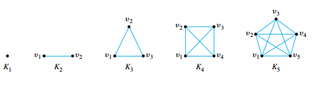

## Direct Proof and Counterexample I: Introduction

### Even, Odd, Prime, and Composite Integers

> [!TIP] **Even number**
>
> An integer $n$ is **even** if, and only if, $n$ equals twice some integer.
>
> $$n \text{ is even } \Leftrightarrow n = 2k \text{ for some integer } k$$

> [!TIP] **Odd number**
>
> An integer $n$ is **odd** if, and only if, $n$ equals twice some integer plus $1$.
>
> $$n \text{ is odd } \Leftrightarrow n = 2k + 1\text{ for some integer } k$$

> [!TIP] **Prime number**
>
> An integer $n$ is **prime** if, and only if, $n > 1$ and for all positive integers $r$ and $s$, if $n = rs$, then either $r$ or s equals $n$.
>
> $$n \text{ is prime } \Leftrightarrow \forall \text{ positive integers } r \text{ and } s, \\ \text{ if } n = rs \text{ then either } r = 1 \text{ and } s = n \text{ or } r = n \text{ and } s = 1$$

> [!TIP] **Composite number**
>
> An integer n is composite if, and only if, $n > 1$ and $n = rs$ for some integers $r$ and $s$ with $1 < r < n$ and $1 < s < n$.
>
> $$n \text{ is composite } \Leftrightarrow \exists \text{ positive integers } r \text{ and } s \text{ such that } \\ n = rs \text{ and } 1 < r < n \text{ and } 1 < s < n$$

### Proving Existential Statements

Given the statement

$$
\exists x \in D, \text{ such that } Q(x)
$$

One way to prove this is to find an $x$ in $D$ that makes $Q(x)$ true. Another way is to give a set of directions for finding such an $x$. Both of these methods are called **constructive proofs of existence**. The logical principle underlying such a proof is called **existential generalization**.

> [!TIP] **Existencial Generalization**
>
> If you know a certain property is true for a particular object, then you may conclude that “there exists an object for which the property is true.”

A **nonconstructive proof of existence** involves showing either (a) that the existence of a value of $x$ that makes $Q(x)$ true is guaranteed by an axiom or a previously proved theorem or (b) that the assumption that there is no such $x$ leads to a contradiction.

### Disproving Universal Statements by Counterexample

To disprove a statement means to show that it is false. Consider the question of disproving a statement of the form

$$
\forall x \in D, P(x) \rightarrow Q(x)
$$

Showing that this statement is false is equivalent to showing that its negation is true.

$$
\exists x \in D, \text{ such that } P(x) \wedge \sim Q(x)
$$

> [!TIP] **Disproof by Counterexample**
>
> To disprove a statement of the form $\forall x \in D, P(x) \rightarrow Q(x)$ find a value of $x$ in $D$ for which the hypothesis $P(x)$ is true and the conclusion $Q(x)$ is false. Such an $x$ is called a **counterexample**.

### Proving Universal Statements

The vast majority of mathematical statements to be proved are universal. In discussing how to prove such statements, it is helpful to imagine them in a standard form:

$$
\forall x \in D, P(x) \rightarrow Q(x)
$$

When $D$ is finite or when only a finite number of elements satisfy $P(x)$, such a statement can be proved by **the method of exhaustion**, that is by showing for each element that the property is satisfied.

Even when the domain is finite, it may be infeasible to use the method of exhaustion. The most powerful technique for proving a universal statement is one that works regardless of the size of the domain over which the statement is quantified. It is based on a logical principle sometimes called **universal generalization** or **generalizing from the generic particular**.

> [!TIP] **Generalizing from the Generic Particular**
>
> To show that every element of a set satisfies a certain property, suppose $x$ is a particular but arbitrarily chosen element of the set, and show that $x$ satisfies the property.

The point of having $x$ be arbitrarily chosen (or generic) is to make a proof that can be generalized to all elements of the domain. By choosing $x$ arbitrarily, you are making no special assumptions about $x$ that are not also true of all other elements of the domain. Thus everything you deduce about a generic element $x$ of the domain is equally true of any other element of the domain.

When the method of generalizing from the generic particular is applied to a property of the form "If $P(x)$ then $Q(x)$," the result is the method of **direct proof**.

> [!NOTE] **Method of Direct Proof**
>
> 1. Express the statement to be proved in the form "For every $x \in D$, if $P(x)$ then $Q(x)$.
> 2. Start the proof by supposing $x$ is a particular but arbitrarily chosen element of $D$ for which the hypothesis $P(x)$ is true.
> 3. Show that the conclusion $Q(x)$ is true by using definitions, previously established results, and the rules for logical inference.

> [!TIP] **Existential Instantiation**
>
> If the existence of a certain kind of object is assumed or has been deduced, then it can be given a name, as long as that name is not currently being used to refer to something else in the same discussion.

## Direct Proof and Counterexample II: writing Advice

### Directions for Writing Proofs of Universal Statements

1. Copy the statement of the theorem to be proved on your paper.
2. Clearly mark the beginning of your proof with the word Proof.
3. Make your proof self-contained: you should explain the meaning of each variable used in your proof in the body of the proof. Thus you will begin proofs by introducing the initial variables.
4. Write your proof in complete, grammatically correct sentences: Write your proof in complete, grammatically correct sentences.
5. Keep your reader informed about the status of each statement in your proof: If something is assumed, preface it with a word like _Suppose_ or _Assume_. If it is still to be shown, preface it with words like, _We must show that_ or _In other words, we must show that_.
6. Give a reason for each assertion in your proof.
7. Include the “little words and phrases” that make the logic of your arguments clear.
8. Display equations and inequalities: The convention is to display equations and inequalities on separate lines to increase readability.

### Common Mistakes

#### Arguing from examples

It is a mistake to think that a general statement can be proved by showing it to be true for some individual cases.

#### Using the same letter to mean two different things.

Consider the following “proof” fragment:

> Suppose $m$ and $n$ are any odd integers. Then by definition of odd, $m = 2k + 1$ and $n = 2k + 1$, where $k$ is an integer.

You might think of a variable in a mathematical proof as similar to a global variable in a computer program: once introduced, it has the same meaning throughout the program.

#### Jumping to a conclusion

To jump to a conclusion means to allege the truth of something without giving an adequate reason. Consider the following “proof” that the sum of any two even integers is even.

> Suppose $m$ and $n$ are any even integers. By definition of even, $m = 2r$ and $n = 2s$ for some integers $r$ and $s$. Then $m+ n = 2r + 2s$. So $m + n$ is even.

The problem with this "proof" is that to show an integer is even one needs to show that it equals twice some integer.

#### Assuming what is to be proved

To assume what is to be proved is a variation of jumping to a conclusion. For example:

> Suppose $m$ and $n$ are any odd integers. When any odd integers are multiplied, their product is odd. Hence $mn$ is odd.

#### Confusion between what is known and what is still to be shown.

A more subtle way to jump to a conclusion occurs when the conclusion is restated using a variable. For example:

> Suppose $m$ and $n$ are any odd integers. We must show that $mn$ is odd. This means that there exists an integer $s$ such that
>
> $$mn = 2s + 1$$
>
> Also by definition of odd, there exist integers $a$ and $b$ such that
>
> $$m = 2a + 1 \text{ and } n = 2b + 1$$
>
> Then
>
> $$mn = (2a + 1)(2b + 1) = 2s + 1$$
>
> So, since $s$ is an integer, $mn$ is odd by definition of odd.

In this example, when the author restated the conclusion to be shown (that $mn$ is odd), the author wrote "there exists an integer $s$ such that $mn = 2s + 1$." But we only know that the integer $s$ exists if we know that $mn$ is odd, which is what the author is trying to show.

#### Use of any when the correct word is some.

There are a few situations in which the words any and some can be used interchangeably. In
most situations, however, the words any and some are not interchangeable.

> Suppose $m$ is a particular but arbitrarily chosen odd integer. By definition of odd, $m = 2a + 1$ for any integer $a$.

In the second sentence it is incorrect to say that "$m = 2a + 1$ for any integer $a$" because a cannot be just "any" integer.

#### Misuse of the word "if"

Another common error is not serious in itself, but it reflects imprecise thinking that sometimes leads to problems later in a proof. This error involves using the word if when the word because is really meant.

> Suppose $p$ is a prime number. If $p$ is prime, then $p$ cannot be written as a product of two smaller positive integers.

## Direct Proof and Counterexample III: Rational Numbers

> [!TIP] **Rational and Irrational Number**
>
> A real number $r$ is **rational** if, and only if, it can be expressed as a quotient of two integers with a nonzero denominator. A real number that is not rational is **irrational**. More formally, if $r$ is a real number, then
>
> $$r \text{ is rational } \Leftrightarrow \exists \text{ integers } a \text{ and } b \text{ siuch that } r = \frac{a}{b} \text{ and } b \neq 0$$

**Every integer is a rational number.**

> [!NOTE] **Zero Product Property**
>
> If neither of two real numbers is zero, then their product is also not zero.

### Proving Properties of Rational Numbers

> [!NOTE] **Theorem**: The sum of any two rational numbers is rational.
>
> Suppose $r$ and $s$ are any rational numbers. Then, by definition of rational, $r = \frac{a}{b}$ and $s = \frac{c}{d}$ for some integers $a$, $b$, $c$, and $d$ with $b \neq 0$ and $d \neq 0$. Thus
>
> $$r + s = \frac{a}{b} + \frac{c}{d}$$
>
> $$= \frac{ad + bc}{bd}$$
>
> Let $p = ad + bc$ and $q = bd$. Then $p$ and $q$ are integers because products and sums of integers are integers and because $a$, $b$, $c$, and $d$ are all integers. Also $q \neq 0$ by the zero product property. Thus
>
> $$r + s = \frac{p}{q}, \text{ where } p \text{ and } q \text{ are integers and } q \neq 0$$
>
> Therefore, $r + s$ is rational by definition of a rational number.

### Deriving New Mathematics from Old

Once a collection of statements has been proved directly from the definitions, another method of proof becomes possible. The statements in the collection can be used to derive additional results

> [!TIP] **Corollary**
>
> A **corollary** is a statement whose truth can be immediately deduced from a theorem that has already been proved.

## Direct Proof and Counterexample IV: Divisibility

The notion of divisibility is the central concept of one of the most beautiful subjects in advanced mathematics: **number theory**, the study of properties of integers.

> [!TIP] **Divisility**
>
> If $n$ and $d$ are integers then $n$ is **divisible by** $d$ if, and only if, $n$ equals $d$ times some integer and $d \neq 0$
>
> The notation $d | n$ is read "$d$ divides $n$." Symbolically, if $n$ and $d$ are integers:
>
> $$d | n \Leftrightarrow \exists \text{ and integer, say } k, \text{ such that } n = dk \text{ and } d \neq 0$$
>
> The notation $d \nmid n$ is read "$d$ does not divide $n$".

> [!NOTE] **Theorem:** A Positive Divisor of a Positive Integer
>
> For all integers $a$ and $b$, if $a$ and $b$ are positive and $a$ divides $b$ then $a \leq b$.
>
> Suppose $a$ and $b$ are any positive integers such that $a$ divides $b$. By definition of divisibility, there exists an integer $k$ so that $b = ak$. $k$ must be positive because both $a$ and $b$ are positive. It follows that
>
> $$1 \leq k$$
>
> because every positive integer is greater than or equal to $1$. Multiplying both sides by $a$ gives
>
> $$a \leq ka = b$$
>
> because multiplying both sides of an inequality by a positive number preserves the inequality. Thus $a \leq b$.

> [!NOTE] **Theorem:** Divisors of 1
>
> Since $1 \cdot 1 = 1$ and $(-1)(-1) = 1$, both $1$ and $-1$ are divisors of $1$. Now suppose $m$ is any integer that divides $1$. Then there exists an integer $n$ such that $1 = mn$. Either both $m$ and $n$ are positive or both $m$ and $n$ are negative. If both $m$ and $n$ are positive, then $m$ is a positive integer divisor of $1$. $m \leq 1$, and, since the only positive integer that is less than or equal to $1$ is $1$ itself, it follows that $m = 1$. On the other hand, if both $m$ and $n$ are negative, then, $(-m)(-n) = mn = 1$. In this case $-m$ is a positive integer divisor of $1$, and so, by the same reasoning, $-m = 1$ and thus $m = -1$. Therefore there are only two possibilities: either $m = 1$ or $m = -1$. So the only divisors of $1$ are $1$ and $-1$.

Since the negation of an existential statement is universal, it follows that $d$ does not divide
n (denoted $d \nmid n$) if, and only if, $\forall \text{ integer } k, n \neq dk, \text{ or } d = 0$; in other words, the quotient $\frac{n}{d}$ is not an integer.

### Proving Properties of Divisibility

One of the most useful properties of divisibility is that it is transitive.

> [!NOTE] **Theorem:** Transitivity of Divisibility
>
> For all integers $a$, $b$, and $c$, if $a$ divides $b$ and $b$ divides $c$, then $a$ divides $c$.
>
> Suppose $a$, $b$, and $c$ are any integers such that $a$ divides $b$ and $b$ divides $c$. By definition of divisibility,
>
> $$b = ar \text{ and } c = bs \text{ for some integers } r \text{ and } s$$
>
> By substitution
>
> $$c = bs$$
>
> $$= (ar)s$$
>
> $$= a(rs)$$
>
> Let $k = rs$. Then $k$ is an integer since it is a product of integers, and therefore
>
> $$c = ak \text{ where } k \text{ is an integer }$$
>
> Thus $a$ divides $c$ by definition of divisibility.

It would appear from the definition of prime that to show that an integer is prime you would need to show that it is not divisible by any integer greater than 1 and less than itself. In fact, you need only check whether it is divisible by a prime number less than or equal to itself.

> [!NOTE] **Theorem:** Divisibility
>
> Any integer $n > 1$ is divisible by a prime number

### Counterexamples and Divisibility

To show that a proposed divisibility property is not universally true, you need only find one pair of integers for which it is false.

> [!NOTE] **Theorem:** Unique Factorization of Integers Theorem (Fundamental Theorem of Arithmetic)
>
> Given any integer $n > 1$, there exist a positive integer $k$, distinct prime numbers $p_1, p_2, \cdots, p_k$, and positive integers $e_1, e_2, \cdots, e_k$ such that
>
> $$n = p_1^{e_1}p_2^{e_2} \cdots p_k^{e_k}$$
>
> and any other expression for $n$ as a product of prime numbers is identical to this except, perhaps, for the order in which the factors are written.

> [!TIP] **Standard Factored Form**
>
> Given any integer $n > 1$, the standard factored form of $n$ is an expression of the form
>
> $$n = p_1^{e_1}p_2^{e_2} \cdots p_k^{e_k}$$
>
> where $k$ is a positive integer, $p_1, p_2, \cdots, p_k$ are prime numbers, $e_1, e_2, \cdots, e_k$ are positive integers, and $p_1 < p_2 < \cdots < p_k$.

## Direct Proof and Counterexample V: Division into Cases and the Quotient-Remainder Theorem

> [!NOTE] **Theorem:** The Quotient-Remainder Theorem
>
> Given any integer $n$ and positive integer $d$, there exist unique integers $q$ and $r$ such that
>
> $$n = dq + r, \text{ and } 0 \leq r < d$$

### div and mod

> [!TIP] **div and mod**
>
> Given an integer $n$ and a positive integer $d$
>
> $n \text{ div } d = $ the integer quotient obtained when $n$ is divided $d$ and
>
> $n \text{ mod } d = $ the nonnegative integer remainder obtained when $n$ is divided $d$
>
> Symbolically, if $n$ and $d$ are integers and $d > 0$, then
>
> $n \text{ div } d = q$ text $n \text{ mod } d = r \Leftrightarrow n = dq + r$
>
> where $q$ and $r$ are integers and $0 \leq r < d$

Also a necessary and sufficient condition for an integer $n$ to be divisible by an integer $d$ is that $n \text{ mod } d = 0$.

### Representation of Integers

The quotient-remainder theorem brings these two ways of describing odd integers together by guaranteeing that any integer is either even or odd. To see why, let $n$ be any integer, and consider what happens when $n$ is divided by $2$. By the quotient remainder theorem (with $d = 2$), there exist unique integers $q$ and $r$ such that

$$
n = 2q + r \text{ and } 0 \leq r < 2
$$

But the only integers that satisfy $0 \leq r < 2$ are $r = 0$ and $r = 1$. It follows that given any integer $n$, there exists an integer $q$ with

$$
n = 2q + 0 \text{ or } n = 2q + 1
$$

Hence $n$ is either even or odd, and, because of the uniqueness of $q$ and $r$, $n$ cannot be both even and odd.

> [!TIP] **The Parity Property**
>
> The fact that any integer is either even or odd is called the **parity property**.

### Method of Proof by Division into Cases

To prove a statement of the form "If $A_1$ or $A_2$ or $\cdots$ or $A_n$, then $C$," prove all of the following:

$$
\text{If } A_1 \text{, then } C,
$$

$$
\text{If } A_2 \text{, then } C,
$$

$$
\cdots
$$

$$
\text{If } A_n \text{, then } C,
$$

This process shows that C is true regardless of which of $A_1, A_2, \cdots, A_n$ happens to be the case.

### Absolute Value and the Triangle Inequality

> [!TIP] **Absolute Value**
>
> For any real number $x$, the absolute value of $x$, denoted $|x|$, is defined as follows:
>
> $$|x| = \begin{cases}x & \text{ if } x \geq 0 \\ -x & \text{ if } x < 0\end{cases}$$

A **lemma** is a statement that does not have much intrinsic interest but is helpful in deriving other results

> [!NOTE] **Lemma: For every real number $r$, $-|r| \leq r \leq |r|$**
>
> Suppose $r$ is any real number. We divide into cases according to whether $r = 0$, $r < 0$, or $r > 0$.
>
> **Case 1 ($r = 0$)** In this case, by definition of absolute value, $|r| = r = 0$. since $0 = -0$, we have that $-0 = - |r| = 0 = r = |r|$, and so it is true that
>
> $$-|r|\leq r \leq |r|$$
>
> **Case 2 ($r > 0$)** In this case, by definition of absolute value, $|r| = r$. Also, since $r$ is positive and $-|r|$ is negative, $-|r| < |r|$. Thus it is true that
>
> $$-|r| \leq r \leq |r|$$
>
> **Case 3 ($r < 0$)**: In this case, by definition of absolute value, $|r| = -r$. Multiplying both sides by $-1$ gives that $-|r| = r$. Also, since $r$ is negative and $|r|$ is positive, $r < |r|$. Thus it is also true in this case that
>
> $$-|r| \leq r \leq |r|$$
>
> Hence, in every case
>
> $$-|r| \leq r \leq |r|$$

> [!NOTE] **Lemma: For every real number $r$, $|-r| = |r|$.**
>
> Suppose $r$ is any real number. We know that if $r > 0$, then $-r < 0$, and if $r < $, then $-r > 0$. Thus
>
> $$|-r| = \begin{cases}-r & \text{ if } -r > 0 \\ 0 & \text{ if } -r = 0 \\ -(-r) & \text{ if } -r < 0\end{cases}$$
>
> $$= \begin{cases}-r & \text{ if } -r > 0 \\ 0 & \text{ if } r = 0 \\ r & \text{ if } -r < 0\end{cases}$$
>
> $$= \begin{cases}-r & \text{ if } r < 0 \\ 0 & \text{ if } r = 0 \\ r & \text{ if } r > 0\end{cases}$$
>
> $$= \begin{cases}r & \text{ if } r \geq 0 \\ -r & \text{ if } r < 0\end{cases}$$
>
> $$= |r|$$

> [!NOTE] **Theorem: The Triangle Inequality**
>
> For all real numbers $x$ and $y$, $|x + y| \leq |x| + |y|$.
>
> Suppose $x$ and $y$ are any real numbers.
>
> **Case 1 ($x+ y \geq 0$)**: In this case, $|x + y| = x + y$. We know that
>
> $$x \leq |x| \text{ and } y \leq |y|$$
>
> Hence
>
> $$|x + y| = x + y \leq |x| + |y|$$
>
> **Case 2 ($x + y < 0$)**: In this case, $|x + y| = - (x + y) = (-x) + (-y)$, and so
>
> $$-x \leq |-x| = |x| \text{ and } -y \leq |-y| = |y|$$
>
> Therefore, it follows
>
> $$|x + y| = (-x) + (-y) \leq |x| + |y|$$
>
> Hence in both cases $|x + y| \leq |x| + |y|$.

## Direct Proof and Counterexample VI: Floor and Ceiling

> [!TIP] **Floor Function**
>
> Given any real number $x$, the **floor** of $x$, denoted $\lfloor x \rfloor$, is defined as follows:
>
> $$\lfloor x \rfloor = \text{ that unique integer } n \text{ such taht } n \leq x < n + 1$$
>
> Symbolically, if $x$ is a real number and $n$ is an integer, then
>
> $$\lfloor x \rfloor = n \Leftrightarrow n \leq x < n + 1$$

> [!TIP] **Ceiling Function**
>
> Given any real number $x$, the **ceiling** of $x$, denoted $\lceil x \rceil$, is defined as follows:
>
> $$\lceil x \rceil = \text{ that unique integer } n \text{ such taht } n - 1 < x \leq n + 1$$
>
> Symbolically, if $x$ is a real number and $n$ is an integer, then
>
> $$\lceil x \rceil = n \Leftrightarrow n -1 < x \leq n + 1$$

If $x$ and $y$ are positive and the sum of their fractional parts is less than $1$, then $\lfloor x + y \rfloor = \lfloor x \rfloor + \lfloor y \rfloor$. In particular, if $x$ is positive and $m$ is a positive integer, then $\lfloor x + m \rfloor = \lfloor x \rfloor + \lfloor m \rfloor = \lfloor x \rfloor + m$. (The fractional part of $m$ is $0$; hence the sum of the fractional parts of $x$ and $m$ equals the fractional part of $x$, which is less than $1$.)

> [!NOTE] **Theorem: For every real number $x$ and every integer $m$, $\lfloor x + m \rfloor = \lfloor x \rfloor + m$.**
>
> Suppose any real number $x$ and any integer $m$ are given. Let $n = \lfloor x \rfloor$. By definition of floor, $n$ is an integer and
>
> $$n \leq x < n + 1$$
>
> Add $m$ to all three parts to obtain
>
> $$n + m \leq x + m < n + m + 1$$
>
> Now $n + m$ is an integer [_since $n$ and $m$ are integers and a sum of integers is an integer_], and so, by definition of floor, the left-hand side of the equation to be shown is
>
> $$\lfloor x + m \rfloor = n + m$$
>
> But $n = \lfloor x \rfloor$. Hence, by substitution,
>
> $$n + m = \lfloor x \rfloor + m$$
>
> which is the right-hand side of the equation to be shown. Thus $\lfloor x + m \rfloor = \lfloor x \rfloor + m$.

> [!NOTE] **Theorem: The Floor of $\frac{n}{2}$**
>
> For any integer $n$
>
> $$\lfloor \frac{n}{2} \rfloor = \begin{cases}\frac{n}{2} & \text{ if } n \text{ is even} \\ \frac{n - 1}{2} & \text{ if } n \text{ is odd }\end{cases}$$
>
> Suppose $n$ is a [_particular but arbitrarily chosen_] integer. By the quotient remainder theorem, either $n$ is odd or $n$ is even.
>
> **Case 1 ($n$ is odd)**: In this case, $n = 2k + 1$ for some integer $k$. But the left-hand side of the equation to be shown is
>
> $$\lfloor \frac{n}{2} \rfloor = \lfloor \frac{2k + 1}{2} \rfloor = \lfloor \frac{2k}{2} + \frac{1}{2} \rfloor = \lfloor k + \frac{1}{2} \rfloor = k$$
>
> because $k$ is an integer and $k \leq k + \frac{1}{2} < k + 1$. And the right-hand side of the equation to be shown is
>
> $$\frac{n - 1}{2} = \frac{(2k + 1) - 1}{2} = \frac{2k}{2} = k$$
>
> also. So since both the left-hand and right-hand sides equal $k$, they are equal to each other. That is, $\lfloor \frac{n}{2} \rfloor = \frac{n - 1}{2}$

Given any integer $n$ and any positive integer $d$, the quotient-remainder theorem guarantees the existence of unique integers $q$ and $r$ such that

$$
n = dq + r \text{ and } 0 \leq r < d
$$

The following theorem states that the floor notation can be used to describe $q$ and $r$ as follows:

$$
q = \lfloor \frac{n}{d} \rfloor \text{ and } r = n - d \lfloor \frac{n}{d} \rfloor
$$

Thus, for a nonnegative integer $n$ and a positive integer $d$,

$$
n \text{ div } d = \lfloor \frac{n}{d} \rfloor \text{ and } n \text{ mod } d = n - d \lfloor \frac{n}{d} \rfloor
$$

This means that $d$ divides $n$ if, and only if, $n = d \lfloor \frac{n}{d} \rfloor$.

## Indirect argument: Contradiction and Contraposition

One kind of indirect proof, **argument by contradiction**, is based on the fact that either a statement is true or it is false but not both. So if you can show that the assumption that a given statement is not true leads logically to a contradiction, impossibility, or absurdity, then that assumption must be false: and, hence, the given statement must be true. This method of proof is also known as **reductio ad impossible** or **reductio ad absurdum** because it relies on reducing a given assumption to an impossibility or absurdity.

### Method of Proof by Contradiction

1. Suppose the statement to be proved is false. That is, suppose that the negation of the statement is true.
2. Show that this supposition leads logically to a contradiction
3. Conclude that the statement to be proved is true

Proof by contradiction is indicated if you want to show that there is no object with a certain property, or if you want to show that a certain object does not have a certain property.

> [!NOTE] **Theorem: There is no greatest integer**
>
> Suppose not. That is, suppose there is a greatest integer $N$. Then $N \geq n$ for every integer $n$. Let $M = N + 1$. Now $M$ is an integer since it is a sum of integers. Also $M > N$ since $M = N + 1$. Thus $M$ is an integer that is greater than $N$. So $N$ is the greatest integer and $N$ is not the greatest integer, which is a contradiction.

> [!NOTE] **Theorem: The sum of any rational number and any irrational number is irrational**
>
> Suppose not. That is, suppose there is a rational number $r$ and an irrational number $s$ such that $r + s$ is rational. By definition of rational, $r = \frac{a}{b}$ and $r + s = \frac{c}{d}$ for some integers $a, b, c$, and $d$ with $b \neq 0$ and $d \neq 0$. By substitution,
>
> $$\frac{a}{b} + s = \frac{c}{d}$$
>
> and so
>
> $$s = \frac{c}{d} - \frac{a}{b}$$
>
> $$= \frac{bc - ad}{bd}$$
>
> Now $bc - ad$ and $bd$ are both integers, and $bd \neq 0$ [_by the zero product property_]. Hence $s$ is a quotient of the two integers $bc - ad$ and $bd$ with $bd \neq 0$. Thus, by definition of rational, $s$ is rational, which contradicts the supposition that $s$ is irrational.

### Method of Proof by Contraposition

A second form of indirect argument, argument by contraposition, is based on the logical equivalence between a statement and its contrapositive. The underlying reasoning is that since a conditional statement is logically equivalent to its contrapositive, if the contrapositive is true then the statement must also be true.

1. Express the statement to be proved in the form

$$
\forall x \in D, P(x) \rightarrow Q(x)
$$

2. Rewrite this statement in the contrapositive form

$$
\forall x \in D, \sim Q(x) \rightarrow \sim P(x)
$$

3. Prove the contrapositive by a direct proof
   - Suppose $x$ is a (particular but arbitrarily chosen) element of $D$ such that $Q(x)$ is false.
   - Show that $P(x)$ is false.

We use the word proposition rather than theorem because although the word theorem can refer to any statement that has been proved, mathematicians often restrict it to especially important statements that have many and varied consequences. Then we use the word **proposition** to refer to a statement that is somewhat less consequential but nonetheless worth writing down.

### Relation between Proof by Contradiction and Proof by Contraposition

Observe that any proof by contraposition can be recast in the language of proof by contradiction. In a proof by contraposition, the statement

$$
\forall x \in D, P(x) \rightarrow Q(x)
$$

is proved by giving a direct proof of the equivalent statement

$$
\forall x \in D, \sim Q(x) \rightarrow \sim P(x)
$$

To rewrite the proof as a proof by contradiction, you suppose there is an $x$ in $D$ such that $P(x)$ and $\sim Q(x)$. You then follow the steps of the proof by contraposition to deduce the statement $\sim P(x)$.

This shows that any statement that can be proved by contraposition can be proved by contradiction. But the converse is not true.

## Indirect Argument: Two Famous Theorems

> [!NOTE] **Theorem Irrationality of $\sqrt{2}$**
>
> Suppose not. That is, suppose $\sqrt{2}$ is rational. Then there are integers $m$ and $n$ with no common factors such that
>
> $$\sqrt{2} = \frac{m}{n}$$
>
> Squaring both sides of equation
>
> $$2 = \frac{m^2}{n^2}$$
>
> Or, equivalently
>
> $$m^2 = 2n^2$$
>
> This equation implies that $m^2$ is even (by definition of even). It follows that $m$ is even. We file this fact away for future reference and also deduce (by definition of even) that
>
> $$m = 2k \text{ for some integer } k$$
>
> Subtituting
>
> $$m^2 = (2k)^2 = 4k^2 = 2n^2$$
>
> Dividing both side of the right-most equation by $2$ gives
>
> $$n^2 = 2k^2$$
>
> Consequently, $n^2$ is even, and so $n$ is even. But we also know that $m$ is even. Hence both $m$ and $n$ have a common factor of $2$. But this contradicts the supposition that $m$ and $n$ have no common factors.

### Are There Infinitely Many Prime Numbers?

You know that a prime number is a positive integer that cannot be factored as a product of two smaller positive integers. Is the set of all such numbers infinite, or is there a largest prime number?

> [!NOTE] For any integer $a$ and any prime number $p$, if $p | a$ then $p \mid (a + 1)$
>
> Suppose not. That is, suppose there exist an integer a and $a$ prime number $p$ such that $p | a$ and $p | (a + 1)$. Then, by definition of divisibility, there exist integers $r$ and $s$ such that $a = pr$ and $a + 1= ps$. It follows that
>
> $$1 = (a + 1) - a = ps - pr = p(s - r)$$
>
> and so (since $s - r$ is an integer) $p | 1$. But the only integer divisors of $1$ are $1$ and $-1$, and $p > 1$ because $p$ is prime. Thus $p \leq 1$ and $p > 1$, which is a contradiction.

> [!NOTE] **Theorem: Infinitude of the Primes**
>
> Suppose not. That is, suppose the set of prime numbers is finite. Then some prime number $p$ is the largest of all the prime numbers, and hence we can list the prime numbers in ascending order:
>
> $$2, 3, 5, 7, \cdots, p$$
>
> Let $N$ be tthe product of all the prime number plus $1$:
>
> $$N = (2 \cdot 3 \cdot 5 \cdot 7 \cdots p) + 1$$
>
> Then $N > 1$, and so $N$ is divisible by some prime number $q$. Because $q$ is prime, $q$ must equal one of the prime numbers $2, 3, 5, 7, \cdots , p$. Thus, by definition of divisibility, $q$ divides $2 \cdot 3 \cdot 5 \cdot 7 \cdots p$, and so $q$ does not divide $(2 \cdot 3 \cdot 5 \cdot 7 \cdots p)$, which equals $N$. Hence $N$ is divisible by $q$ and $N$ is not divisible by $q$, and we have reached a contradiction.

### When to Use Indirect Proof

We have not provided a definitive answer to the question of when to prove a statement directly and when to prove it indirectly. Usually, however, when both types of proof are possible, indirect proof is clumsier than direct proof. In the absence of obvious clues suggesting indirect argument, try first to prove a statement directly.

## Application: Then Handshake Theorem

> [!TIP] **Degree of a Graph**
>
> The total degree of a graph is the sum of the degrees of all the vertices of the graph.

The handshake analogy is such an attractive way to understand the graph theory result that the theorem describing it is known as the handshake theorem.

> [!NOTE] **The Handshake Theorem**
>
> If $G$ is any graph, then the sum of the degrees of all the vertices of $G$ equals twice the number of edges of $G$. Specifically, if the vertices of $G$ are $v_1, v_2, \cdots, n_n$, where $n$ is a nonnegative integer, then
>
> the total degree of $G = \text{deg}(v_1) + \text{deg}(v_2) + \cdots + \text{deg}(v_n)$
>
> $$= 2 \cdot (\text{ the number of edges of } G)$$

**PROOF**

Let $G$ be a particular but arbitrarily chosen graph, and suppose that $G$ has $n$ vertices $v_1, v_2, \cdots, v_n$ and $m$ edges, where $n$ is a positive integer and $m$ is a nonnegative integer. We claim that each edge of $G$ contributes $2$ to the total degree of $G$.

For suppose $e$ is an arbitrarily chosen edge with endpoints $v_i$ and $v_j$. This edge contributes $1$ to the degree of $v_i$ and $1$ to the degree of $v_j$. As shown below, this is true even if $i = j$, because an edge that is a loop is counted twice in computing the degree of the vertex on which it is incident.


Therefore, $e$ contributes $2$ to the total degree of $G$. Since $e$ was arbitrarily chosen, this shows that each edge of $G$ contributes $2$ to the total degree of $G$. Thus

$$
\text{ the total degree of } G = 2 \cdot (\text{ the number of edges of } G)
$$

The following corollary follows immediately from the handshake theorem.

> [!NOTE] **Total Degree of a Graph**
>
> The total degree of a graph is even.

**PROOF**

By the Handshake Theorem the total degree of $G$ equals $2$ times the number of edges of $G$, which is an integer, and so the total degree of $G$ is even.

> [!NOTE] **Number of Vertices of Odd Dregree**
>
> In any graph there is an even number of vertices of odd degree.

**PROOF**

Suppose $G$ is any graph, and suppose $G$ has $n$ vertices of odd degree and $m$ vertices of even degree, where $n$ is a positive integer and $m$ is a nonnegative integer. Let $E$ be the sum of the degrees of all the vertices of even degree, $O$ the sum of the degrees of all the vertices of odd degree, and $T$ the total degree of $G$. If $u_1, u_2, \cdots, u_m$ are the vertices of even degree and $v_1, v_2, \cdots, v_n$ are the vertices of odd degree, then

$$
E = \text{deg}(u_1) + \text{deg}(u_2) + \cdots + \text{deg}(u_m)
$$

$$
O = \text{deg}(v_1) + \text{deg}(v_2) + \cdots + \text{deg}(v_n)
$$

$$
T = \text{deg}(u_1) + \text{deg}(u_2) + \cdots + \text{deg}(u_m) + \text{deg}(v_1) + \text{deg}(v_2) + \cdots + \text{deg}(v_n) = E + O
$$

Now $T$, the total degree of $G$, is an even integer. Also $E$ is even since either $E$ is zero, which is even, or $E$ is a sum of even numbers. Now since

$$
T = E + O
$$

then

$$
O = T - E
$$

Hence $O$ is a difference of two even integers, and so $O$ is even.

By assumption, $\text{deg}(v_i)$ is odd for every integer $i = 1, 2, \cdots, n$. Thus $O$, an even integer, is a sum of the $n$ odd integers $\text{deg}(v_1), \text{deg}(v_2), \cdots, \text{deg}(v_n)$. But if a sum of $n$ odd integers is even, then $n$ is even. Therefore, $n$ is even.

### Special Graphs

One important class of graphs consists of those that do not have any loops or parallel edges.

> [!TIP] **Simple Graph**
>
> A **simple graph** is a graph that does not have any loops or parallel edges. In a simple graph, an edge with endpoints $v$ and $w$ is denoted $\{v, w\}$.

Another important class of graphs consists of those that are "complete" in the sense that each vertex in the graph is connected by exactly one edge to each other vertex in the graph.

> [!TIP] **Complete Graph**
>
> Let $n$ be a positive integer. A **complete graph on $n$ vertices**, denoted $K_n$, is a simple graph with $n$ vertices and exactly one edge connecting each pair of distinct vertices.



In another class of graphs, called complete bipartite graphs, the vertex set can be separated into two subsets so that each vertex in one of the subsets is connected by exactly one edge to each vertex in the other subset but no vertex is connected by an edge to any other vertex in its own subset.

> [!TIP] **Complete Bipartite Graph**
>
> Let $m$ and $n$ be positive integers. A complete bipartite graph on $(m, n)$ vertices, denoted $K_{m, n}$ is a simple graph whose vertices are divided into two distinct subsets, $V$ with $m$ vertices and $W$ with $n$ vertices, in such a way that
>
> 1. every vertex of $K_{m, n}$ belongs to one of $V$ or $W$, but no vertex belongs to both $V$ and $W$;
> 2. there is exactly one edge from each vertex of $V$ to each vertex of $W$;
> 3. there is no edge from any one vertex of $V$ to any other vertex of $V$;
> 4. there is no edge from any one vertex of $W$ to any other vertex of $W$.


## Application: Algorithms

### The Division Algorithm

For an integer $a$ and a positive integer $d$, the quotient-remainder theorem guarantees the existence of integers $q$ and $r$ such that

$$
a = dq + r, 0 \leq r < d
$$

> [!NOTE] **Division Algorithm**
>
> [Given a nonnegative integer $a$ and a positive integer $d$, the aim of the algorithm is to find integers $q$ and $r$ that satisfy the conditions $a = dq + r$ and $0 \leq r < d$. This is done by subtracting $d$ repeatedly from a until the result is less than $d$ but is still nonnegative.
>
> $$0 \leq a - d - d - \cdots - d = a - dq < d$$
>
> The total number of $d$ that are subtracted is the quotient $q$. The quantity $a - dq$ equals the remainder $r$.]
>
> **Input**: $a$ [nonnegative integer], $d$ [positive integer]
>
> **Algorithm Body**:
>
> ```
> r := a
> q := 0
> while r ≥ d
>     r := r - d
>     q := q + 1
> end while
> ```
>
> **Output**: $q, r$ [nonnegative integers]

### The Euclidean Algorithm

The greatest common divisor of two integers $a$ and $b$ is the largest integer that divides both $a$ and $b$.

> [!TIP] **The Euclidean Theorem**
>
> Let $a$ and $b$ be integers that are not both zero. The **greatest common divisor** of $a$ and $b$, denoted $\text{gcd}(a,b)$ is that integer $d$ with the following properties:
>
> 1. $d$ is a common divisor of both $a$ and $b$
> 2. For every integer $c$, if $c$ is a common divisor of both $a$ and $b$, then $c$ is less than or equal to $d$.

> [!NOTE] **Lemma 4.10.1**
>
> If $r$ is a positive integer, then $\text{gcd}(r, 0) = r$

**PROOF**

Suppose $r$ is a positive integer. We know that $r$ is a common divisor of both $r$ and $0$ because it divides itself and $0$. Also, no integer larger than $r$ can be a common divisor of $r$ and $0$, since no integer larger than $r$ can divide $r$. Hence $r$ is the greatest common divisor of $r$ and $0$.

> [!NOTE] **Lemma 4.10.2**
>
> If $a$ and $b$ are any integers not both zero, and if $q$ and $r$ are any integers such that
>
> $$a = bq + r$$
>
> then
>
> $$\text{gcd}(a, b) = gdc(b,r)$$

**PROOF**

First we will show that $\text{gcd}(a, b) \leq \text{gcd}(b, r)$. Let $a$ and $b$ be integers, not both zero, and let $c$ be a common divisor of $a$ and $b$. Then $c | a$ and $c | b$ and so by definition of divisility:

$$
a = nc
$$

and

$$
b = mc
$$

for some integers $n$ and $m$. If we substitute on

$$
a = bq + r
$$

we get

$$
nc = mcq + r
$$

and then we solve for $r$

$$
r = nc - mcq = c(n - mq)
$$

Where $n - mq$ is an integer and so by definition of [divisibility](#direct-proof-and-counterexample-iv-divisibility) $c | r$. Given $c | b$, we conclude that $c$ is a common divisor of $b$ and $r$.

We know that the greatest common divisor of $a$ and $b$ is defined because $a$ and $b$ are not both zero. Also, as we showed previously, every common divisor of $a$ and $b$ is a common divisor of $b$ and $r$ and so the greatest common divisor of $a$ and $b$ is a common divisor of $b$ and $r$.

But then $\text{gdc}(a, b)$, which is a common divisor of $b$ and $r$ is, by definition, necessarily less than or equal to the greatest common divisor of $b$ and $r$:

$$
\text{gcd}(a, b) \leq \text{gcd}(b, r)
$$

Secondly we show that $\text{gcd}(b, r) \leq \text{gcd}(a, b)$. By the first part of this proof we know that every common divisor of $b$ and $r$ is a common divisor of $a$ and $b$. Therefore it follows that $\text{gcd}(b, r)$ is a common divisor of $a$ and $b$ and, by definition, it is necessarily less or equal to the greatest common divisor of $a$ and $b$, that is

$$
\text{gcd}(b, r) \leq \text{gcd}(a, b)
$$

### Euclidean Algorithm

1. Let $A$ and $B$ be integers with $A > B \geq 0$
2. To find the greatest common divisor of $A$ and $B$, first check whether $B = 0$. If it is, then $\text{gcd}(A, B) = A$ by **Lemma 4.10.1**. If it isn't, then $B > 0$ and the quotient remainder theorem can be used to divide $A$ by $b$:

$$
A = Bq + r, \text{ where } 0 \leq r < B
$$

By **Lemma 4.10.2** $\text{gcd}(A, B) = \text{gcd}(B, r)$.

3. Now, just repeat the process starting again at $(2)$ but use $B$ instead of $A$ and $r$ instead of $B$. The repetitions are guaranteed to terminate eventually with $r = 0$ because each new remainder is less than the preceding one.
