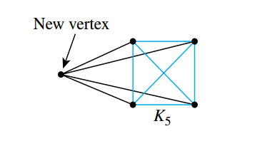

## Sequences

> [!TIP] **Sequence**
>
> A **sequence** is a function whose domain is either all the integers between two given integers or all the integers greater than or equal to a given integer.

We represent a sequence as follows:

$$
a_m, a_{m + 1}, a_{m + 2}, \cdots, a_n
$$

where each element $a_k$ is a **term**. The $k$ in $a_k$ is called a **subscript** or **index**, $m$, is the subscript of the **initial term** and $n$ is the subscript of the **final term**.

The notation

$$
a_m, a_{m + 1}, a_{m + 2}, \cdots
$$

denotes an **infinite sequence**. An **explicit formula** or **general formula** for a sequence is a rule that shows how the values of $a_k$ depend on $k$.

### Summation Notation

In 1772 the French mathematician Joseph Louis Lagrange introduced the capital Greek letter sigma, $\Sigma$, to denote the word sum.

> [!TIP] **Summation Notation**
>
> If $m$ and $n$ are integers and $m \leq n$ the symbol $\sum_{k=m}^n a_k$, read the **summation from** $k$ **equals** $m$ **to** $n$ **of** $a$ **sub** $k$ is the sum of all the terms $a_m, a_{m + 1}, a_{m + 2}, \cdots, a_n$.
>
> We say $a_{m} + a_{m + 1} + a_{m + 2} + \cdots + a_n$ is the **expanded form** of the sum. We write
>
> $$\sum_{k = m}^n a_k = a_m + a_{m + 1} + a_{m + 2} + \cdots + a_n$$
>
> We call $k$ the **index** of the summarion, $m$ the **lower limit** of the summation and $n$ the **upper limit** of the summation.

A more mathematically precise definition of summarion, called **recursive definition** is the following. If $m$ is any integer, then:

$$
\sum_{k = m}^m a_k = a_m \text{ and } \sum_{k = m}^n a_k = \left(\sum_{k = m}^{n - 1} a_k\right) + a_n \text{ for every integer } n > m
$$

### Product Notation

> [!TIP] **Product Notation**
>
> If $m$ and $n$ are integers and $m \leq n$, the symbol $\prod_{k=m}^n a_k$, read the **product from $k$ equals $m$ to $n$ of $a$-sub-$k$**, is the product of all the terms $a_m, a_{m + 1}, a_{m + 2}, \cdots, a_n$. We write:
>
> $$\prod_{k=m}^n a_k = a_m \cdot a_{m + 1} \cdot a_{m + 2} \cdots a_n$$

A recursive **definition for the product notation** is the following: If $m$ is any integer

$$
\prod_{k = m}^m a_k = a_m \text{ and } \prod_{k = m}^n a_k = \left(\prod_{k=m}^{n - 1} a_k\right) a_n \text{ for every integer } n > m
$$

### Properties of Summations and Products

If $a_m, a_{m + 1}, \cdots$ and $b_m, b_{m + 1}, \cdots$ are sequences of real numbers and $c$ is a real number, then the following equations hold for any integer $n \geq m$:

$$
\sum_{k = m}^n a_k + \sum_{k = m}^n b_k = \sum_{k = m}^n (a_k + b_k)
$$

$$
c \sum_{k = m}^n a_k = \sum_{k = m}^n c \cdot a_k
$$

$$
\left(\prod_{k=m}^n a_k\right) \cdot \left(\prod_{k=m}^n b_k\right) = \prod_{k=m}^n (a_k \cdot b_k)
$$

The symbol used to represent an index of a summation is called a **dummy variable** and it can be replaced by any other symbol. A general procedure to change the variable on the index of a summation is as follows

Consider the following example

> Summation $\sum_{k = 0}^6 \frac{1}{k + 1}$, change of variable $j = k + 1$

1. Calculate the lower and upper limits

> When $k = 0$, $j = k + 1 = 1$
> When $k = 6$, $j = k + 1 = 7$

2. Calculate the general term of the new summation

> Since $j = k + 1$, then $k = j - 1$, hence
>
> $$\frac{1}{k + 1} = \frac{1}{(j - 1) + 1} = \frac{1}{j}$$

3. Rewrite the summation using the new upper limits and the new general term

> So all put together gives
>
> $$\sum_{k = 0}^6 \frac{1}{k + 1} = \sum_{j = 1}^7 \frac{1}{j}$$

### Factorial and $n$ Choose $r$ Notation

> [!TIP] **Factorial**
>
> For each positive integer $n$, the quantity $n$ **factorial**, denoted $n!$, is defined to be the product of all the integers from $1$ to $n$.
>
> $$n! = n \cdot (n - 1) \cdots 3 \cdot 2 \cdot 1$$

**Zero factorial**, denoted $0!$, is defined to be $1$ just because it is convenient.

A **recursive definition for factorial** is: Given any nonnegative integer $n$,

$$
n! = \begin{cases}
1 & \text{ if } n = 0 \\
n \cdot (n - 1) & \text{ if } n \geq 1
\end{cases}
$$

> [!TIP] **$n$ Choose $r$**
>
> Let $n$ and $r$ be integers with $0 \leq r \leq n$, the symbol
>
> $$\binom{n}{r}$$
>
> is read **$n$ choose $r$** and represents the number of subsets of size $r$ that can be chosed from a set of $n$ elements. It is computed as follows
>
> $$\binom{n}{r} = \frac{n!}{r!(n - r)!}$$

### Binary Division

In general, if a nonnegative integer $a$ is repeatedly divided by $2$ until a quotient of zero is obtained and the remainders are found to be $r[0], r[1], \cdots, r[k]$, then by the quotient remainder theorem each $r[i]$ equals $0$ or $1$ and by repeated substitution from the theorem

$$
a = 2^k r[k] + 2^{k - 1}r[k - 1] + \cdots + 2^2 r[2] + 2^1 r[1] + 2^{0} r[0]
$$

Thus the binary representation for $a$ is

$$
a_{10} = (r[k]r[k - 1]\cdots r[2]r[1]r[0])
$$

## Mathematical Induction I: Proving Formulas

In natural science courses, **deduction** and **induction** are presented as alternative modes of thought. **Deduction** being to infer a conclusion from general principles using the laws of logical reasoning. **Induction** being to enunciate a general principle after observing it to hold in a large number of specific instances.

**Mathematical induction as a proof technique is not inductive but deductive**.

> [!TIP] **Principle of Mathematical Induction**
>
> Let $P(n)$ be a property that is defined for integers $n$, and let $a$ be a fixed integer. Suppose the following two statements are true:
>
> 1. $P(a)$ is true
> 2. For every integer $k \geq a$, if $P(k)$ is true then $P(k + 1)$ is true.
>
> Then the statement
>
> $$\text{ for every integer } n \geq a, P(n)$$
>
> is true.

The validity of proof by mathematical induction is generally taken as an axiom. That is why it is referred to as the principle of mathematical induction rather than as a theorem.

### Method of Proof by Mathematical Induction

Consider a statement of the form "For every integer $n \geq a$, property $P(n)$ is true". To prove it we perform the following steps:

1. **Basis step**: Show that $P(a)$ is true
2. **Inductive step**: Show that for every integer $k \geq a$, if $P(k)$ is true then $P(k + 1)$ is true. To perform this step suppose that $P(k)$ is true, where $k$ is any integer with $k \geq a$, then hsow that $P(k + 1)$ is true.

> [!NOTE] **Sum of the first $n$ integers**
>
> For every integer $n \geq 1$,
>
> $$1+ 2+ \cdots + n = \frac{n(n+ 1)}{2}$$

**PROOF**

**Show that $P(1)$ is true**

We must show that

$$
1 = \frac{1(1 + 1)}{2} = \frac{2}{2} = 1
$$

Hence $P(1)$ is true

**Show that for every integer $k \geq 1$, if $P(k)$ is true then $P(k + 1)$ is also true**

Suppose that $k$ is any integer with $k \geq 1$, such that

$$
1 + 2 + 3 + \cdots + k = \frac{k(k+1)}{2}
$$

Then

$$
1 + 2 + 3 + \cdots + k + (k + 1) = \frac{k(k+1)}{2} + (k + 1)
$$

$$
= \frac{k(k+1)}{2} + \frac{2(k + 1)}{2}
$$

$$
= \frac{k (k + 1) +2k + 2}{2}
$$

$$
= \frac{k^2 + k +2k + 2}{2}
$$

$$
= \frac{k^2 + 3k + 2}{2}
$$

$$
= \frac{(k + 1)(k + 2)}{2}
$$

thus $P(k + 1)$ is true

> [!TIP] **Closed Form for the Sum**
>
> If a sum with a variable number of terms is shown to equal an expression that does not contain either an ellipsis or a summation symbol, we say that the sum is written in **closed form**.

> [!NOTE] **Sum of a Geometric Sequence**
>
> For any real number $r$ except $1$, and any integer $n \geq 0$,
>
> $$\sum_{i = 0}^n r^i = \frac{r^{n + 1} - 1}{r - 1}$$

**PROOF**

**Show that $P(0)$ is true**

We must show that

$$
\sum_{i = 0}^0 r^i = \frac{r^{0 + 1} - 1}{r - 1}
$$

$$
1 = \frac{r - 1}{r - 1} = 1
$$

**Show that for every integer $k \geq 0$, if $P(k)$ is true then $P(k + 1)$ is also true**

Let $k$ be any integer with $k \geq 0$, and suppose that $P(k)$ follows, that is

$$
\sum_{i = 0}^k r^i = \frac{r^{k + 1} - 1}{r - 1}
$$

Then

$$
\sum_{i = 0}^k r^i + r^{k + 1} = \frac{r^{k + 1} - 1}{r - 1} + r^{k + 1}
$$

$$
\sum_{i = 0}^{k + 1} r^i = \frac{r^{k + 1} - 1}{r - 1} + \frac{r^{k + 1}(r - 1)}{r - 1}
$$

$$
= \frac{r^{k + 1} - 1}{r - 1} + \frac{r^{k + 2} - r^{k + 1}}{r - 1}
$$

$$
= \frac{r^{k + 1} - 1 + r^{k + 2} - r^{k + 1}}{r - 1}
$$

$$
= \frac{r^{k + 2} - 1}{r - 1}
$$

Thus $P(k + 1)$ holds.

### Proving an Equality

We illustrate two different ways to show that an equation is true

1. Transforming the left-hand side and the right-hand side independently until they are seen to be equal.
2. Transforming one side of the equation until it is seen to be the same as the other side of the equation.

Note that starting from a starting from a statement and deducing a true conclusion does not prove that the state is true. A true conclusion can also be deduced from a false statement.

When using mathematical induction to prove formulas, be sure to use a method that avoids invalid reasoning, both for the basis step and for the inductive step.

### Deducing Additional Formulas

There is another way to derive the formula for the sum of a geometric sequence. Let

$$
S_n = 1 + r + r^2 + \cdots + r^n
$$

$$
rS_n = r + r^2 + r^3 + \cdots + r^{n+ 1}
$$

$$
rS_n - S_n=  (r^{n + 1} + \cdots + r^3 + r^2 + r) - (r^{n} + \cdots + r^2 + r + 1)
$$

$$
rS_n - S_n=  r^{n + 1} - 1
$$

$$
S_n (r - 1)=  r^{n + 1} - 1
$$

$$
S_n = \frac{r^{n + 1} - 1}{r - 1}
$$

This derivation of the formula is quite convincing. However, it is not as logically airtight as the proof by mathematical induction.

## Strong Mathematical Induction and the Well-Ordering Principle for the Integers

> [!TIP] **Principle of Strong Mathematical Induction**
>
> Let $P(n)$ be a property that is defined for integers $n$, and let $a$ and $b$ be fixed integers with $a \leq b$. Suppose the following two statements are true
>
> 1. **Basis step**: $P(a), P(a + 1), \cdots, P(b)$ are all true.
> 2. **Inductive step**: For every integer $k \geq b$, if $P(i)$ is true for each integer $i$ from $a$ through $k$, then $P(k + 1)$ is true.
>
> Then the statement
>
> $$\text{ for every integer } n \geq a, P(n)$$
>
> is true.

Any statement that can be proved with ordinary mathematical induction can be proved with strong mathematical induction. The reason is that given any integer $k \geq b$, if the true of $P(k)$ alone implies the truth of $P(k + 1)$, the certainly the truth of $P(a), P(a + 1), \cdots$ and $P(k)$ implies the truth of $P(k + 1)$. It is also the case that any statement that can be proved with strong mathematical induction can be proved with ordinary mathematical induction.

The principle of strong mathematical induction can be written without a basis step, if the inductive step is caned to

$$
\text{For every integer } k \geq a - 1, \text{ if } P(i) \text{ is true for each integer } i \text{ from } a \text{ through } k, \text{ then } P(k + 1) is true
$$

The reason for this is that the statement "$P(i)$ is true for each integer $i$ from $a$ through $k$" is vacuosly true for $k = a - 1$. Hence, if the implication in the inductive step is true, then the conclusion $P(a)$ must also be true, with proves the basis step.

### Well-Ordering Principle for the Integers

Let $S$ be a set of integers containing one of more integers all of which are greater that some fixed integer. Then $S$ has lest element.

A consecuence of the well-ordering principle is the fact that any strictly decreasing sequence of nonnegative integers is finite. That is, if

$$
r_1, r_2, r_3, \cdots
$$

is a sequence of nonnegative integers satisfies

$$
r_i > r_{i + 1}
$$

for every $i \geq 1$, then $r_1, r_2, r_3, \cdots$ is a finite sequence.

## Application: Correctness of Algorithms

### Assertions

Consider an algorithm that is designed to produce a certain final state from a certain initial state. Both the initial and final states can be expressed as predicates involving the input and output variables.

Often the predicate describing the initial state is called the **pre-condition for the algorithm**, and the predicate describing the final state is called the **post-condition for the algorithm**.

A proof of algorithm correctness consists of showing that if the pre-condition for the algorithm is true for a collection of values for the input variables and if the statements of the algorithms are executed, then the post-condition is also true.

The steps of an algorithm are divided into sections with assertions about the current state of algorithm. Successive pairs of assertions are then treated as pre- and post-conditions for the algorithm statements between them.

For each $i = 1, 2, \cdots, k - 1$, one proves that if Assertion $i$ is true and all the algorithm statements between Assertion $i$ and Assertion $(i + 1)$ are executed, then Assertion $(i + 1)$ is true.

Once all these individual proofs have been completed, one knows that Assertion $k$ is true. And since Assertion $1$ is the same as the pre-condition for the algorithm and Assertion $k$ is the same as the post-condition for the algorithm, one concludes that the entire algorithm is correct with respect to its pre- and post-conditions.

### Loop Invariants

The method of loop invariants is used to prove correctness of a loop with respect to certain pre- and post-conditions.

It is based on the principle of mathematical induction. Suppose that an algorithm contains a while loop and that entry to this loop is restricted by a condition $G$, called the **guard**. Suppose also that assertions describing the current states of algorithm variables have been placed immediately preceding and immediately following the loop. The assertion just preceding the loop is called the **pre-condition for the loop** and the one just following is called the **post-condition for the loop**.

> [!TIP] **Correct Loop**
>
> A loop is defined as **correct with respect to its pre- and post-conditions** if, and only if, whenever the algorithm variables satisfy the pre-condition for the loop and the loop terminates after a finite number of steps, the algorithm variables satisfy the post-condition for the loop.

A **loop invariant** is a predicate with domain a set of integers, which satisfies the following condition: For each iteration of the loop, if the predicate is true before the iteration, then it is true after the iteration.

Furthermore, if the predicate satisfies the following two additional condition, the loop with be correct with respect to its pre- and post-conditions:

1. The predicate is true before the first iteration of the loop
2. If the loop terminates after a finite number of iterations, the truth of the loop invariant ensures the truth of the post-condition for the loop.

> [!NOTE] **Loop Invariant Theorem**
>
> Let a **while** loop with guard $G$ be given, together with pre- and post-conditions that are predicates in the algorithm variables. Also let a predicate $I(n)$, called the loop invariant, be given. If the following four properties are true, then the loop is correct with respect to its pre- and post-conditions.
>
> **I. Basis Property**: The pre-condition for the loop implies that $I(0)$ is true before the first iteration of the loop.
>
> **II. Inductive Property**: For every integer $k \geq 0$, if the guard $G$ and the loop invariant $I(k)$ are both true before an iteration of the loop, then $I(k + 1)$ is true after an iteration of the loop.
>
> **III. Eventual Falsity of Guard**: After a finite number of iteration of the loop, the guard $G$ becomes false.
>
> **IV. Correctness of the Post-Condition**: If $N$ is the lest number of iteration after which $G$ is false and $I(N)$ is true, then the values of the algorithm variables will be specified in the post-condition of the loop.

**PROOF**

The loop invariant theorem follows easily from the principle of mathematical induction. Assume that $I(n)$ is a predicate that satisfies properties $I–IV$ of the loop invariant theorem.

Properties $I$ and $II$ are the basis and inductive steps needed to prove the truth of the following statement:

$$
\text{ For every integer } n \geq 0, \text{ if the while loop iterates } n \text{ times, then } I(n) \text{ is true}
$$

Thus, by the principle of mathematical induction, sinde both $I$ and $II$ are true, the previous statement is also true.

Property III says that the guard G eventually becomes false. At that point the loop will have been iterated some number, say $N$, of times. Since $I(n)$ is true after the nth iteration for every $n \geq 0$, then $I(n)$ is true after the $N$th iteration. That is, after the $N$th iteration the guard is false and $I(N)$ is true.

But this is the hypothesis of property $IV$, which is an if-then statement. Since statement $IV$ is true (by assumption) and its hypothesis is true (by the argument just given), it follows (by modus ponens) that its conclusion is also true. That is, the values of all algorithm variables after execution of the loop are as specified in the postcondition for the loop.

## Defining Sequences Recursively

> [!TIP] **Recurrence Relation**
>
> A **recurrence relation** for a sequence $a_0, a_1, a_2, \cdots$ is a formula that relates each term $a_k$ to a certain of its predecessors $a_{k - 1}, a_{k - 2}, \cdots, a_{k - i}$, where $i$ is an integer with $k - i \geq 0$.
>
> If $i$ is a fixed integer, the **initial conditions** for such a recurrentce relation specify the values of $a_0, \cdots, a_{i - 1}$. If $i$ depends on $k$, the initial conditions specify the values of $a_0, a_1, \cdots, a_m$, where $m$ is an integer with $m \geq 0$.

### Catalan Numbers

The sequence of **Catalan numbers**, nambed after the Belgian mathematician [Eugène Catalan](https://en.wikipedia.org/wiki/Eug%C3%A8ne_Charles_Catalan). It can be defined as follows: For each integer $n \geq 1$

$$
C_n = \frac{1}{n + 1} \binom{2n}{n}
$$

### The Tower of Hanoi

In 1883 a French mathematician, Édouard Lucas, invented a puzzle that he called the Tower of Hanoi. Those who played the game were supposed to move all the disks one by one from one pole to another, never placing a larger disk on top of a smaller one.

An elegant and efficient way to solve this problem is to think recursively.

1. Transfer the top $k - 1$ disks from pole $A$ to pole $B$. When $k > 2$ the execution of this step will require more than one move.
2. Move the bottom disk from pole $A$ to pole $C$
3. Transfer the top $k - 1$ disks from $B$ to pole $C$.

If $m_n$ is the minimum number of moves needed to transfer a tower of $n$ disks from one pole to another. Then

- Going from position $(a)$ to position $(b)$ requires $m_{k-1}$ moves
- Going from position $(b)$ to position $(c)$ requires just one move
- Going from position $(c)$ to position $(d)$ requires $m_{k-1}$

Therefore

$$
m_k = m_{k-1} + 1 + m_{k-1} = 2m_{k-1} \text{ for every integer } k \geq 2
$$

The complete recursive specification is as follows:

$$
m_k = 2m_{k-1} + 1 \\
m_1 = 1
$$

### The Fibonacci Numbers

One of the earliest examples of a recursively defined sequence occurs in the writings of [Leonardo of Pisa, commonly known as Fibonacci](https://en.wikipedia.org/wiki/Fibonacci). In $1202$ Fibonacci posed the following problem:

A single pair of rabbits (male and female) is born at the beginning of a year. Assume the following conditions:

1. A single pair of rabbits (male and female) is born at the beginning of a year. Assume the following conditions:
2. No rabbits die.

The crucial observation is that the number of rabbit pairs born at the end of month $k$ is the same as the number of pairs alive at the end of month $k - 2$. Why? Because it is exactly the rabbit pairs that were alive at the end of month $k-2$ that were fertile during month $k$. The rabbits born at the end of month $k - 1$ were not.

Then:

$$
\text{number of rabbit pairs alive at the end of month } k = \\ \text{the number of rabbit pairs alive and the end of month } k - 1 \\ + \text{ the number of rabbit pairs born at the end of month } k
$$

$$
= \text{ the number of rabbit pairs alive at the end of month } k - 1 + \\ \text{ the number of rabbit pairs alive at the end of month } k - 2
$$

For ech integer $n \geq 1$, let $F_n$ be the number of rabbit pairs alive at the end of month $n$ and let $F_0 = 1$ be the initial number of rabbit pairs. Therefor by substitution

$$
F_k = F_{k - 1} + F_{k - 2}
$$

### Recursive Definitions of Sum and Product

> [!NOTE] **Binary Operations**
>
> Addition and multiplication are called **binary operations** because only two numbers can be added or multiplied at a time.

Given numbers $a_1, a_2, \cdots, a_n$ where $n$ is a positive integer, the **summation from $i = 1$ to $n$ of the $a_i$** denoted $\sum_{i=1}^n a_i$ is defined as follows:

$$
\sum_{i=1}^1 a_i = a_1 \text{ and } \sum_{i=1}^n a_i \left(\sum_{i=1}^{n - 1} = a_i\right) + a_n \text{ if } n > 1
$$

The **product from $i = 1$ to $n$ of the $a_i$** denoted $\prod_{i=1}^n a_i$ is defined as follows:

$$
\prod_{i=1}^1 a_i = a_1 \text{ and } \prod_{i=1}^n a_i \left(\prod_{i=1}^{n - 1} = a_i\right) + a_n \text{ if } n > 1
$$

## Solving Recurrence Relations by Iteration

Suppose you have a sequence that satisfies a certain recurrence relation and initial conditions. It is often helpful to know an explicit formula for the sequence. Such an explicit formula is called a **solution** to the recurrence relation.

### The Method of Iteration

The most basic method for finding an explicit formula for a recursively defined sequence is **iteration**. Iteration works as follows: Given a sequence $a_0, a_1, a_2, \cdots$ defined by a recurrence relation and initial conditions. You start from the initial conditions and calculate successive terms of the sequence until you see a pattern developing. At that point you guess an explicit formula.

### Arithmetic Sequence

> [!TIP] **Arithmetic Sequence**
>
> A sequence $a_0, a_1, \cdots$ is called an **arithmetic sequence** if, and only if, there is a constant $d$ such that
>
> $$a_k = a_{k - 1} + d \text{ for each integer } k \geq 1$$
>
> If follows that
>
> $$a_n = a_0 + dn \text{ for every integer } n \geq 0$$

### Geometric Sequence

> [!TIP] **Geometric Sequence**
>
> A sequence $a_0, a_1, \cdots$ is called an **geometric sequence** if, and only if, there is a constant $r$ such that
>
> $$a_k = ra_{k - 1} \text{ for each integer } k \geq 1$$
>
> If follows that
>
> $$a_n = a_0 + r^n \text{ for every integer } n \geq 0$$

### Checking the Correctness of a Formula by Mathematical Induction

It is all too easy to make a mistake and come up with the wrong formula. That is why it is important to confirm your calculations by checking the correctness of your formula. The most common way to do this is to use [mathematical induction](#mathematical-induction-i-proving-formulas).

#### An Explicit Formula for the Tower of Hanoi Sequence

Recall that the Tower of Hanoi sequence satisfies the recurrence relation:

$$
m_k = 2m_{k - 1} + 1
$$

and has the initial condition

$$
m_1 = 1
$$

#### Using recursion to Compute the Number of edges of

Te firs few value of $K_n$ can be pictured as follows:

And you can obtain $K_5$ from $K_4$ by adding one new vertex and drawing four new edges, one between the new vertex and exh vertex of $K_4$.

Therefore, if for each integer $n \geq 1$, $s_n$ is the number of edges $K_n$, then

$$
s_k = s_{k - 1} + (k - 1) \text{ for each integer } k \geq 2
$$

$$
s_1 = \text{ the number of edges in } K_1 = 0
$$

For $s_n$ we obtain:

$$
\begin{matrix}
s_1 = 0 \\
s_2 = s_1 + 1 = 0 + 1 \\
s_3 = s_2 + 2 = 0 + 1 + 2 \\
\cdots \\
s_n = s_{n - 1} + (n - 1) = 0 + 1 + 2 + \cdots + (n - 1) \\
\end{matrix}
$$

Therefore:

$$
s_n = \frac{n(n - 1)}{2} \text{ for every integer } n \geq 1
$$

## Second-Order Linear Homogeneous Recurrence Relations with Constant Coefficients

> [!TIP] **Second-order linear homogeneous recurrence relation with constant coefficients**
>
> A **second-order linear homogeneous recurrence relation with constant coefficients** is a recurrence relation of the form
>
> $$a_k = Aa_{k-1} + Ba_{k - 1} \text{ for every integer } k \geq \text{ some fixed integer}$$
>
> where $A$ and $B$ are fixed real numbers with $B \neq 0$

Second order refers to the fact that the expression contains the two previous terms ($a_{k - 1}$ and $a_{k - 2}$). Linear refers to the fact that $a_{k - 1}$ and $a_{k - 2}$ appear in separate terms and to the first power. Homogeneous refers to the fact that the total degree of each term is the same, and constant coefficients to the fact that $A$ and $B$ are fixed real numbers thtat do not depend on $k$.

> [!NOTE] **Lemma 5.8.1**
>
> Let $A$ and $B$ be real numbers. A recurrence relation of the form
>
> $$a_K = Aa_{k - 1} + Ba_{k - 2} \text{ for every integer } k \geq 2$$
>
> is satisfied by the sequence
>
> $$1, t, t^2, t^3, \cdots, t^n, \cdots$$
>
> where $t$ is a nonzero real number, if and only if $t$ satisfies the equation
>
> $$t^2 - At - B = 0$$

> [!TIP] **Characteristic Equation**
>
> Given a second order linear homogeneous recurrence relation with constant coefficients
>
> $$a_K = Aa_{k - 1} + Ba_{k - 2} \text{ for every integer } k \geq 2$$
>
> the **characteristic equation of the relation** is
>
> $$t^2 - At - B = 0$$

> [!NOTE] **Lemma 5.8.2**
>
> If $r_0, r_1, r_2, \cdots$ and $s_0, s_1, s_2, \cdots$ are sequences that satisfy the same second order linear homogeneous recurrence relation with constant coefficients. If $C$ and $D$ are any numbers, then the sequence $a_0, a_1, \cdots$ defined by the formula
>
> $$a_n = Cr_n + Ds_n \text{ for every integer } n \geq 0$$
>
> also satisifies the same recurrence relation.

**Proof**

Suppose $r_0, r_1, \cdots$ and $s_0, s_1, \cdots$ are sequences that satisfy the same second-order linear homogeneous recurrence relation wiht constant coefficients. Then

$$
r_k = Ar_{k - 1} + Br_{k - 2} \text{ and } s_k = As_{k - 1} + Bs_{k - 2}
$$

for every integer $k \geq 2$. Suppose also that $C$ and $D$ are any numbers. Let $a_0, a_1, a_2, \cdots$ be the sequence defined by

$$
a_n = Cr_n + Ds_n \text{ for every integer } n \geq 0
$$

For every integer $k \geq 2$

$$
Aa_{k - 1} + Ba_{k - 2} = A(Cr_{k - 1} + Ds_{k - 1}) + B(Cr_{k - 2} + Ds_{k - 2})
$$

$$
= C(Ar_{k - 1} + Br_{k - 2}) + D(As_{k - 1} + Bs_{k - 2})
$$

$$
= C(r_k) + D(s_k)
$$

$$
= a_k
$$

Hence $a_0, a_1, a_2, \cdots$ satisfies the same recurrence relation as $r_0, r_1, r_2, \cdots$ and $s_0, s_1, s_2, \cdots$.

> [!TIP] **Distinct-Roots Theorem**
>
> Suppose a sequence $a_0, a_1, a_2, \cdots$ satisfies a recurrence relation
>
> $$a_k = Aa_{k - 1} + Ba_{k - 2}$$
>
> for some real numbers $A$ and $B$, with $B \neq 0$ and every integer $k \geq 2$. If the characteristic equation
>
> $$t^2 - At - B = 0$$
>
> has two distinct roots $r$ and $s$, then $a_0, a_1, a_2, \cdots$ is given by the explicit formula
>
> $$a_n = Cr^n + Ds^n$$
>
> where $C$ and $D$ are the number whose values are determined by the values $a_0$ and $a_1$.

**Proof**

Suppose that for some real numbers $A$ and $B$, a sequence $a_0, a_1, a_2, \cdots$ satisfies the recurrence relation

$$
a_k = Aa_{k - 1} + Ba_{k - 2} \text{ for every integer } k \geq 2
$$

and suppose the characteristic equation $t^2 - At - B = 0$ has two distinct roots $r$ and $s$. Also let

$$
a_0 = Cr^0 + Ds^0 \text{ and } a_1 = Cr^1 + Ds^1
$$

Let $P(n)$ be the equation

$$
a_n = Cr^n + Ds^n
$$

We use strong mathematical induction to prove that $P(n)$ is tru for each integer $n \geq 0$. First we show that $P(0)$ and $P(1)$ are true:

$$
a_0 = Cr^0 + Ds^0
$$

$$
a_1 = Cr^1 + Ds^1
$$

Both are true by our previous suppositions.

We now show that

$$
\forall k \in \mathbb{Z}, k \geq 1, (\forall i \in \mathbb{Z}, 0 \leq i \leq k, P(i)) \rightarrow P(k + 1)
$$

Suppose that $k$ is any integer with $k \geq 1$ and for each integer $i$ from $0$ to $k$

$$
a_i = Cr^i + Ds^i
$$

By the inductive hypothesis

$$
a_k = Cr^k + Ds^k \text{ and } a_{k - 1} = Cr^{k - 1} + Ds^{k - 1}
$$

so

$$
a_{k + 1} = Aa_k + Ba_{k - 1}
$$

$$
= A(Cr^k + Ds^k) + B(Cr^{k - 1} + Ds^{k - 1})
$$

$$
= C(Ar^k + Br^{k - 1}) + D(As^k + Bs^{k - 1})
$$

$$
= Cr^{k + 1} + Ds^{k + 1}
$$

> [!NOTE] **Lemma 5.8.4**
>
> Let $A$ and $B$ be real and suppose the characteristic equation
>
> $$t^2 - At - B = 0$$
>
> has a single root $r$. Then the sequences $1, r, r^2, \cdots, r^n, \cdots$ and $0, r, 2r^2, 3r^3, \cdots, nr^n, \cdots$ both satify the recurrence relation
>
> $$a_k = Aa_{k - 1} + Ba_{k - 2}$$
>
> for each integer $k \geq 2$.

> [!TIP] **Single Root Theorem**
>
> Suppose a sequence $a_0, a_1, a_2, \cdots$ satisifies a recurrence relation
>
> $$a_k = Aa_{k - 1} + Ba_{k - 2}$$
>
> for some real numbers $A$ and $B$ with $B \neq 0$ and for every integer $k \geq 2$. If the characteristic equation $t^2 - At - B = 0$ has a single (real) root $r$, then $a_0, a_1, a_2, \cdots$ is given by the explicit formula
>
> $$a_n = Cr^n + Dnr^n$$
>
> where $C$ and $D$ are the real numbers whose values are determined by the values of $a_0$ and any other known value of the sequence.

## General Recursive Definitions and Structural Induction

### Recursive Defined Sets

A recursive definition for a set consists of the following three components

1. **Base**: a statement that certain objects belong to the set.
2. **Recursion**: a collection of rules indicating how to form new set objects from those already known to be in the set.
3. **Restriction**: a statement that no objects belong to the set other than those coming from the base and the recursion.

> [!TIP] **Recursive Definition for the Set of All Strings over a Finite Set**
>
> Let $A$ be any finite set. Call the elements of $A$ **characters**, and define **the set $S$ of all strings over $A$** as follows:
>
> 1. **Base**: $\lambda$ is a string in $S$, where $\lambda$ denotes the **null string**, the string with not characters.
> 2. **Recursion**: New strings are formed according the following rules
>
> - If $u$ is any string in $S$ and if $c$ is any character in $A$ then $uc$ is a string in $S$.
> - If $u$ is any string in $S$, then both the concatenation of $\lambda$ and $u$, denoted $\lambda u$ and the concatenation of $u$ and $\lambda$, denoted $u\lambda$ are defined to equal $u$.
> - If $u$ and $v$ are strings in $S$ and if $c$ is any character in $A$ , then the concatenation of $u$ and $vc$ is defiend to equal the concatenation of $uv$ and $c$, that is $u(vc) = (uv)c$
>
> 3. **Restriction**: Nothing is a string in $S$ other than objects obtained from the base and teh recursion.

> [!NOTE] **Characters are Strings**
>
> If $A$ is a finite set and $S$ is the set of all strings over $A$, then every character in $A$ is a string in $S$

**Proof**

1. Suppose that $c$ is any character in $A$
2. By (1) of the definition of a string $\lambda$ is a string in $S$
3. By (2a) of the definition of string, $\lambda c$ is a string in $S$
4. By (1) of the definition of a string $\lambda c = c$
5. Thus $c$ is a string in $S$

### Proving Properties about Recursively Defined Sets

When a set has been defined recursively, a version fo matehmatical induction, **structural indcution**, can be used to prove that every object in the set satisfies a given property.

> [!TIP] **Structural Induction for a Recursively Defined Set**
>
> Let $S$ bet a set that has been defined recursively, and let $P(x)$ be a property that objects in $S$ may or may not satisfy. To prove that every object in $S$ satifies $P(x)$:
>
> 1. **Basis step**: show that $P(a)$ is true for each object $a$ in the base for $S$.
> 2. **Indcutive step**: show that for each $x \in S$ if $P(x)$ is true and $y$ is obtained from $x$ by applying a rule from the recursion, then $P(y)$ is also true.
>
> For the second step we suppose that $x$ is an arbitrarily chose element on $S$ for which $P(x)$ is true, then we must show that if $y$ is obtained from $x$ by applying a rule from the recursion for $S$, then $P(y)$ is true.
>
> **Conclusion**: because no objects other than those obtained from the base and recursion are contained in $S$, steps 1 and 2 prove that $P(x)$ is true for every object $x \in S$.

> [!NOTE] **Length of a String**
>
> Given the set of all strings $S$ over a finite set $A$, the **length $L$ of a string in $S$** is defined as follows:
>
> 1. $L(\lambda) = 0$
> 2. For every string $u$ in $S$ and for every character $a$ in $A$, the length of $ua$ is one more than the length of $u$. Symbolically:
>
> $$L(ua) = L(u) + 1 \text{ where } u \in S \text{ and } a \in A$$

### Recursive Functions

> [!NOTE] **Recursive Function**
>
> A function is said to be **recursive** if its rule of definition referst to itself.
