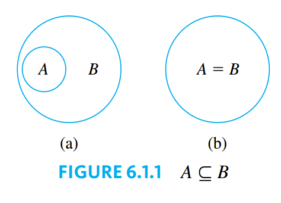

## Set Theory: Definitions and the Element Method of Proof

> [!TIP] **Element Argument: The Basic Method for Proving That Onse Set is a Subset of Another**
>
> Let sets $X$ and $Y$ be given. To prove that $X \subseteq Y$,
>
> 1. suppose that $x$ is a particular but arbitrarily chosen element of $X$,
> 2. show that $x$ is an element of $Y$.

### Set Equality

> [!NOTE] **Set Equality**
>
> Given sets $A$ and $B$, $A$ equals $B$, written $A = B$, if, and only if, every element of $A$ is in $B$ and every element in $B$ is in $A$.
>
> Symbolically:
>
> $$A = B \leftrightarrow A \subseteq B \text{ and } B \subseteq A$$

### Venn Diagrams

If sets $A$ and $B$ are represented as regions in theh plane, relationships between $A$ and $B$ can be represented using **Venn Diagrams**, which where introduced by the British mathematician John Venn in 1881.

### Operations on Sets

> [!NOTE] **Set Operations**
>
> Let $A$ and $B$ be subsets of a universal set $U$.
>
> 1. The **union** of $A$ and $B$, denoted $A \cup B$, is the set of all elements that are in at least one of $A$ or $B$. Symbolically:
>
> $$A \cup B = \{x \in U | x \in A \text{ or } x \in B\}$$
>
> 2. The **intersection** of $A$ and $B$, denoted $A \cap B$, is the set of all elements that are common to both $A$ and $B$. Symbolically:
>
> $$A \cup B = \{x \in U | x \in A \text{ and } x \in B\}$$
>
> 3. The **difference** of $B$ minus $A$ (or **relative complement** of $A$ in $B$), denoted $B - A$, is the set of all elements that are in $B$ and not in $A$. Symbolically:
>
> $$A \cup B = \{x \in U | x \in B \text{ and } x \notin A\}$$
>
> 4. The **complement** of $A$, denoted $A^C$, is the set of all elements in $U$ that are not in $A$. Symbolically:
>
> $$A \cup B = \{x \in U | x \notin A\}$$

> [!TIP] **Interval Notation**
>
> Given real numbers $a$ and $b$, with $a \leq b$:
>
> $$(a, b) = \{x \in \mathbb{R} | a < x < b\}$$
>
> $$[a, b] = \{x \in \mathbb{R} | a \leq x \leq b\}$$
>
> $$(a, b] = \{x \in \mathbb{R} | a < x \leq b\}$$
>
> $$[a, b) = \{x \in \mathbb{R} | a \leq x < b\}$$

### The Empty Set

> [!NOTE] **Empty Set**
>
> The **empty set** (or **null set**), denoted by $\empty$, is a unique set whith no elements.

### Partitions of Sets

> [!NOTE] **Disjoint Sets**
>
> Two sets are called **disjoint** if, and only if, they have no elements in common. Symbolically:
>
> $$A \text{ and } B \text{ are disjoint } \leftrightarrow A \cap B = \empty$$

> [!NOTE] **Mutually Disjoint Sets**
>
> Sets $A_1, A_2, A_3, \cdots$ are **mutually disjoint** (or **pairwise disjoint** or **nonoverlapping**) if, and only if, not two sets $A_i$ and $A_j$ with distinct subscripts have any elements in common. More precisely, for all integers $i$ and $j$:
>
> $$A_i \cap A_j = \empty \text{ whenever } i \neq j$$

> [!NOTE] **Partition of a Set**
>
> A finite or infinite collection of nonempty sets $\{A_1, A_2, A_3, \cdots\}$ is a **partition** of a set $A$ if, and only if:
>
> 1. $A$ is the union of all the $A_i$;
> 2. the sets $A_1, A_2, A_3, \cdots$ are mutually disjoint.

### Power Sets

> [!NOTE] **Power Sets**
>
> Given a set $A$, the **power set** of $A$, denoted by $\mathcal{P}(A)$ is the set of all subsets of $A$.
