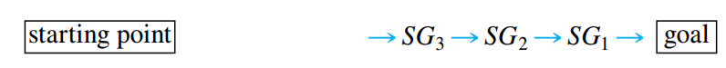
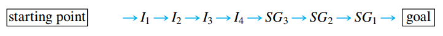

## Set Theory: Definitions and the Element Method of Proof

> [!TIP] **Element Argument: The Basic Method for Proving That Onse Set is a Subset of Another**
>
> Let sets $X$ and $Y$ be given. To prove that $X \subseteq Y$,
>
> 1. suppose that $x$ is a particular but arbitrarily chosen element of $X$,
> 2. show that $x$ is an element of $Y$.

### Set Equality

> [!NOTE] **Set Equality**
>
> Given sets $A$ and $B$, $A$ equals $B$, written $A = B$, if, and only if, every element of $A$ is in $B$ and every element in $B$ is in $A$.
>
> Symbolically:
>
> $$A = B \leftrightarrow A \subseteq B \text{ and } B \subseteq A$$

### Venn Diagrams

If sets $A$ and $B$ are represented as regions in theh plane, relationships between $A$ and $B$ can be represented using **Venn Diagrams**, which where introduced by the British mathematician John Venn in 1881.

### Operations on Sets

> [!NOTE] **Set Operations**
>
> Let $A$ and $B$ be subsets of a universal set $U$.
>
> 1. The **union** of $A$ and $B$, denoted $A \cup B$, is the set of all elements that are in at least one of $A$ or $B$. Symbolically:
>
> $$A \cup B = \{x \in U | x \in A \text{ or } x \in B\}$$
>
> 2. The **intersection** of $A$ and $B$, denoted $A \cap B$, is the set of all elements that are common to both $A$ and $B$. Symbolically:
>
> $$A \cup B = \{x \in U | x \in A \text{ and } x \in B\}$$
>
> 3. The **difference** of $B$ minus $A$ (or **relative complement** of $A$ in $B$), denoted $B - A$, is the set of all elements that are in $B$ and not in $A$. Symbolically:
>
> $$A \cup B = \{x \in U | x \in B \text{ and } x \notin A\}$$
>
> 4. The **complement** of $A$, denoted $A^C$, is the set of all elements in $U$ that are not in $A$. Symbolically:
>
> $$A \cup B = \{x \in U | x \notin A\}$$

> [!TIP] **Interval Notation**
>
> Given real numbers $a$ and $b$, with $a \leq b$:
>
> $$(a, b) = \{x \in \mathbb{R} | a < x < b\}$$
>
> $$[a, b] = \{x \in \mathbb{R} | a \leq x \leq b\}$$
>
> $$(a, b] = \{x \in \mathbb{R} | a < x \leq b\}$$
>
> $$[a, b) = \{x \in \mathbb{R} | a \leq x < b\}$$

### The Empty Set

> [!NOTE] **Empty Set**
>
> The **empty set** (or **null set**), denoted by $\empty$, is a unique set whith no elements.

### Partitions of Sets

> [!NOTE] **Disjoint Sets**
>
> Two sets are called **disjoint** if, and only if, they have no elements in common. Symbolically:
>
> $$A \text{ and } B \text{ are disjoint } \leftrightarrow A \cap B = \empty$$

> [!NOTE] **Mutually Disjoint Sets**
>
> Sets $A_1, A_2, A_3, \cdots$ are **mutually disjoint** (or **pairwise disjoint** or **nonoverlapping**) if, and only if, not two sets $A_i$ and $A_j$ with distinct subscripts have any elements in common. More precisely, for all integers $i$ and $j$:
>
> $$A_i \cap A_j = \empty \text{ whenever } i \neq j$$

> [!NOTE] **Partition of a Set**
>
> A finite or infinite collection of nonempty sets $\{A_1, A_2, A_3, \cdots\}$ is a **partition** of a set $A$ if, and only if:
>
> 1. $A$ is the union of all the $A_i$;
> 2. the sets $A_1, A_2, A_3, \cdots$ are mutually disjoint.

### Power Sets

> [!NOTE] **Power Sets**
>
> Given a set $A$, the **power set** of $A$, denoted by $\mathcal{P}(A)$ is the set of all subsets of $A$.

## Properties of Sets

> [!TIP] **Some Subset Relations**
>
> 1. _Inclusion of Intersection_: For all sets $A$ and $B$,
>
> $$A \cap B \subseteq A \text{ and } A \cap B \subseteq B$$
>
> 2. _Inclusion in Union_: For all sets $A$ and $B$,
>
> $$A \subseteq A \cup B \text{ and } B \subseteq A \cup B$$
>
> 3. _Transitive Property of Subsets_: For all sets $A$, $B$ and $C$,
>
> $$\text{if } A \subseteq B \text{ and } B \subseteq C, \text{ then } A \subseteq C$$

In most proofs of set properties, the secret of getting from the assumption that $x$ is in $X$ to the conclusion that $x$ is in $Y$ is to think of the definitions of basic set operations in terms of how they act on elements.

> [!TIP] **Procedural Versions of Set Definitions**
>
> Let $X$ nad $Y$ be subsets of a universal set $U$, and suppose $x$ and $y$ are elements of $U$.
>
> 1. $x \in X \cup Y \leftrightarrow x \in X \text{ or } x \in Y$
>
> 2. $x \in X \cap Y \leftrightarrow x \in X \text{ and } x \in Y$
>
> 3. $x \in X - Y \leftrightarrow x \in X \text{ and } x \notin Y$
>
> 4. $x \in X^{C} \leftrightarrow x \notin X$
>
> 5. $(x, y) \in X \times Y \leftrightarrow x \in X \text{ and } y \in Y$

### Proving a Subset Relation

Consider trying to prove: "For all sets $A$ and $B$, $A \cap B \subseteq A$".

_Starting Point_: Suppose $A$ and $B$ are any (particular but arbitrarily chosen) sets.

_To Show_: $A \cap B \subseteq A$. That is, you must show:

$$
\forall x, x \in A \cap B \rightarrow x \in A
$$

### Set Identitites

> [!NOTE] **Set Identitity**
>
> An **identitity** is and equation that is universally true for all elements in some set.

> [!NOTE] **Set Identitites**
>
> Let all sets referred to below be subsets of a universal set $U$:
>
> 1. _Commutative Laws_: For all sets $A$ and $B$:
>
> $A \cup B = B \cup A$ and $A \cap B = B \cap B$
>
> 2. _Associative Laws_: For all sets $A$, $B$ and $C$:
>
> $$(A \cup B) \cup C = A \cup (B \cup C)$$
>
> $$(A \cap B) \cap C = A \cap (B \cap C)$$
>
> 3. _Distributive Laws_: For all sets $A$, $B$ and $C$:
>
> $$A \cup (B \cap C) = (A \cup B) \cap (A \cup C)$$
>
> $$A \cap (B \cup C) = (A \cap B) \cup (A \cap C)$$
>
> 4. _Identity Laws_: For every set $A$:
>
> $A \cup \emptyset = A$ and $A \cap U = A$
>
> 5. _Complement Laws_: For every set $A$:
>
> $A \cup A^{C} = U$ and $A \cap A^{C} = \emptyset$
>
> 6. _Double Complement Laws_: For every set $A$:
>
> $$(A^{C})^{C} = A$$
>
> 7. _Idemptotent Laws_: For every set $A$:
>
> $A \cup A = A$ and $A \cap A = A$
>
> 8. _Universal Bound Laws_: For every set $A$:
>
> $A \cup U = U$ and $A \cap \emptyset = \emptyset$
>
> 9. _De Morgan's Laws_: For all sets $A$ and $B$:
>
> $$(A \cap B)^{C} = A^{C} \cup B^{C}$$
>
> $$(A \cup B)^{C} = A^{C} \cap B^{C}$$
>
> 10. _Absortion Laws_: For all sets $A$ and $B$:
>
> $$A \cup (A \cap B) = A$$
>
> $$A \cap (A \cup B) = A$$
>
> 11. _Complements of $U$ and $\emptyset$_:
>
> $$U^{C} = \emptyset$$
>
> $$\emptyset^{C} = U$$
>
> 12. _Set Difference Laws_: For all sets $A$ and $B$:
>
> $$A - B = A \cap B^{C}$$

> [!TIP] **Basic Method for Proving that Sets are Equal**
>
> Let sets $X$ and $Y$ be given. To prove that $X = Y$:
>
> 1. Prove that $X \subseteq Y$
> 2. Prove that $Y \subseteq X$

### Backward Chaining

**Backward chaining** is a type of reasoning that can be used to derive proofs. What is to be shown is viewed as a goal to be reached starting from a certain initial position, _starting point_.

The analysis of this goal leads to the realization that if a certain job is accomplished, denoted by $SG_1$, then the goal will be reached. Then, further analysis of $SG_1$ shows that when yet another job, denoted by $SG_2$, is completed, then $SG_1$ will be reached. Continuining this way, a chain of argument leading backward from the goal is constructed.

At a certain point, backward chaining might become difficult, but analysis of the current subgoal $SG_i$ suggests that it might be reachable by a direct line of argument, that is by applying **forward chaining** from the starting point.

### Theorems on the Properties of Sets

> [!NOTE] **A Set with No Elements Is a Subset of Every Set**
>
> If $E$ is a set with not elements and $A$ is any set, then $E \subseteq A$
>
> **Proof** (by contradiction): Suppose not, suppose there exists a set $E$ with not elements and a set $A$, such that $E \subseteq A$.
>
> Then, by definition of subset, there would be an element of $E$ that is not an element of $A$. But there can be no such element since $E$ has no elements. Thus this line of reasoning resuls in a contradiction and the supposition must be false.

> [!NOTE] **Uniqueness of the Empty Set**
>
> There is only one set with no elements
>
> **Proof**: Suppose $E_1$ and $E_2$ are both sets with no elements. By the previous Theorem $E_1 \subseteq E_2$ since $E_1$ has no elements. Also $E_2 \subseteq E_1$, since $E_2$ has no elements. Thus $E_1 = E_2$ by definition of set equality.

> [!TIP] **Element Method for Proving a Set Equals the Empty Set**
>
> To prove that a set $X$ is equal to the empty set $\emptyset$, prove that $X$ has no elements. To do this, suppose $X$ has an element and derive a contradiction.
