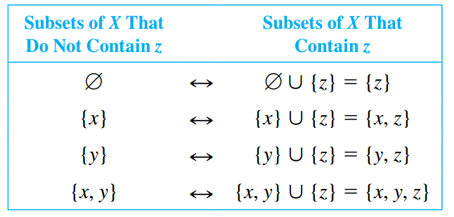

## Set Theory: Definitions and the Element Method of Proof

> [!TIP] **Element Argument: The Basic Method for Proving That Onse Set is a Subset of Another**
>
> Let sets $X$ and $Y$ be given. To prove that $X \subseteq Y$,
>
> 1. suppose that $x$ is a particular but arbitrarily chosen element of $X$,
> 2. show that $x$ is an element of $Y$.

### Set Equality

> [!NOTE] **Set Equality**
>
> Given sets $A$ and $B$, $A$ equals $B$, written $A = B$, if, and only if, every element of $A$ is in $B$ and every element in $B$ is in $A$.
>
> Symbolically:
>
> $$A = B \leftrightarrow A \subseteq B \text{ and } B \subseteq A$$

### Venn Diagrams

If sets $A$ and $B$ are represented as regions in theh plane, relationships between $A$ and $B$ can be represented using **Venn Diagrams**, which where introduced by the British mathematician John Venn in 1881.

### Operations on Sets

> [!NOTE] **Set Operations**
>
> Let $A$ and $B$ be subsets of a universal set $U$.
>
> 1. The **union** of $A$ and $B$, denoted $A \cup B$, is the set of all elements that are in at least one of $A$ or $B$. Symbolically:
>
> $$A \cup B = \{x \in U | x \in A \text{ or } x \in B\}$$
>
> 2. The **intersection** of $A$ and $B$, denoted $A \cap B$, is the set of all elements that are common to both $A$ and $B$. Symbolically:
>
> $$A \cup B = \{x \in U | x \in A \text{ and } x \in B\}$$
>
> 3. The **difference** of $B$ minus $A$ (or **relative complement** of $A$ in $B$), denoted $B - A$, is the set of all elements that are in $B$ and not in $A$. Symbolically:
>
> $$A \cup B = \{x \in U | x \in B \text{ and } x \notin A\}$$
>
> 4. The **complement** of $A$, denoted $A^C$, is the set of all elements in $U$ that are not in $A$. Symbolically:
>
> $$A \cup B = \{x \in U | x \notin A\}$$

> [!TIP] **Interval Notation**
>
> Given real numbers $a$ and $b$, with $a \leq b$:
>
> $$(a, b) = \{x \in \mathbb{R} | a < x < b\}$$
>
> $$[a, b] = \{x \in \mathbb{R} | a \leq x \leq b\}$$
>
> $$(a, b] = \{x \in \mathbb{R} | a < x \leq b\}$$
>
> $$[a, b) = \{x \in \mathbb{R} | a \leq x < b\}$$

### The Empty Set

> [!NOTE] **Empty Set**
>
> The **empty set** (or **null set**), denoted by $\empty$, is a unique set whith no elements.

### Partitions of Sets

> [!NOTE] **Disjoint Sets**
>
> Two sets are called **disjoint** if, and only if, they have no elements in common. Symbolically:
>
> $$A \text{ and } B \text{ are disjoint } \leftrightarrow A \cap B = \empty$$

> [!NOTE] **Mutually Disjoint Sets**
>
> Sets $A_1, A_2, A_3, \cdots$ are **mutually disjoint** (or **pairwise disjoint** or **nonoverlapping**) if, and only if, not two sets $A_i$ and $A_j$ with distinct subscripts have any elements in common. More precisely, for all integers $i$ and $j$:
>
> $$A_i \cap A_j = \empty \text{ whenever } i \neq j$$

> [!NOTE] **Partition of a Set**
>
> A finite or infinite collection of nonempty sets $\{A_1, A_2, A_3, \cdots\}$ is a **partition** of a set $A$ if, and only if:
>
> 1. $A$ is the union of all the $A_i$;
> 2. the sets $A_1, A_2, A_3, \cdots$ are mutually disjoint.

### Power Sets

> [!NOTE] **Power Sets**
>
> Given a set $A$, the **power set** of $A$, denoted by $\mathcal{P}(A)$ is the set of all subsets of $A$.

## Properties of Sets

> [!TIP] **Some Subset Relations**
>
> 1. _Inclusion of Intersection_: For all sets $A$ and $B$,
>
> $$A \cap B \subseteq A \text{ and } A \cap B \subseteq B$$
>
> 2. _Inclusion in Union_: For all sets $A$ and $B$,
>
> $$A \subseteq A \cup B \text{ and } B \subseteq A \cup B$$
>
> 3. _Transitive Property of Subsets_: For all sets $A$, $B$ and $C$,
>
> $$\text{if } A \subseteq B \text{ and } B \subseteq C, \text{ then } A \subseteq C$$

In most proofs of set properties, the secret of getting from the assumption that $x$ is in $X$ to the conclusion that $x$ is in $Y$ is to think of the definitions of basic set operations in terms of how they act on elements.

> [!TIP] **Procedural Versions of Set Definitions**
>
> Let $X$ nad $Y$ be subsets of a universal set $U$, and suppose $x$ and $y$ are elements of $U$.
>
> 1. $x \in X \cup Y \leftrightarrow x \in X \text{ or } x \in Y$
>
> 2. $x \in X \cap Y \leftrightarrow x \in X \text{ and } x \in Y$
>
> 3. $x \in X - Y \leftrightarrow x \in X \text{ and } x \notin Y$
>
> 4. $x \in X^{C} \leftrightarrow x \notin X$
>
> 5. $(x, y) \in X \times Y \leftrightarrow x \in X \text{ and } y \in Y$

### Proving a Subset Relation

Consider trying to prove: "For all sets $A$ and $B$, $A \cap B \subseteq A$".

_Starting Point_: Suppose $A$ and $B$ are any (particular but arbitrarily chosen) sets.

_To Show_: $A \cap B \subseteq A$. That is, you must show:

$$
\forall x, x \in A \cap B \rightarrow x \in A
$$

### Set Identitites

> [!NOTE] **Set Identitity**
>
> An **identitity** is and equation that is universally true for all elements in some set.

> [!NOTE] **Set Identitites**
>
> Let all sets referred to below be subsets of a universal set $U$:
>
> 1. _Commutative Laws_: For all sets $A$ and $B$:
>
> $A \cup B = B \cup A$ and $A \cap B = B \cap B$
>
> 2. _Associative Laws_: For all sets $A$, $B$ and $C$:
>
> $$(A \cup B) \cup C = A \cup (B \cup C)$$
>
> $$(A \cap B) \cap C = A \cap (B \cap C)$$
>
> 3. _Distributive Laws_: For all sets $A$, $B$ and $C$:
>
> $$A \cup (B \cap C) = (A \cup B) \cap (A \cup C)$$
>
> $$A \cap (B \cup C) = (A \cap B) \cup (A \cap C)$$
>
> 4. _Identity Laws_: For every set $A$:
>
> $A \cup \emptyset = A$ and $A \cap U = A$
>
> 5. _Complement Laws_: For every set $A$:
>
> $A \cup A^{C} = U$ and $A \cap A^{C} = \emptyset$
>
> 6. _Double Complement Laws_: For every set $A$:
>
> $$(A^{C})^{C} = A$$
>
> 7. _Idempotent Laws_: For every set $A$:
>
> $A \cup A = A$ and $A \cap A = A$
>
> 8. _Universal Bound Laws_: For every set $A$:
>
> $A \cup U = U$ and $A \cap \emptyset = \emptyset$
>
> 9. _De Morgan's Laws_: For all sets $A$ and $B$:
>
> $$(A \cap B)^{C} = A^{C} \cup B^{C}$$
>
> $$(A \cup B)^{C} = A^{C} \cap B^{C}$$
>
> 10. _Absorption Laws_: For all sets $A$ and $B$:
>
> $$A \cup (A \cap B) = A$$
>
> $$A \cap (A \cup B) = A$$
>
> 11. _Complements of $U$ and $\emptyset$_:
>
> $$U^{C} = \emptyset$$
>
> $$\emptyset^{C} = U$$
>
> 12. _Set Difference Laws_: For all sets $A$ and $B$:
>
> $$A - B = A \cap B^{C}$$

> [!TIP] **Basic Method for Proving that Sets are Equal**
>
> Let sets $X$ and $Y$ be given. To prove that $X = Y$:
>
> 1. Prove that $X \subseteq Y$
> 2. Prove that $Y \subseteq X$

### Backward Chaining

**Backward chaining** is a type of reasoning that can be used to derive proofs. What is to be shown is viewed as a goal to be reached starting from a certain initial position, _starting point_.

The analysis of this goal leads to the realization that if a certain job is accomplished, denoted by $SG_1$, then the goal will be reached. Then, further analysis of $SG_1$ shows that when yet another job, denoted by $SG_2$, is completed, then $SG_1$ will be reached. Continuining this way, a chain of argument leading backward from the goal is constructed.

At a certain point, backward chaining might become difficult, but analysis of the current subgoal $SG_i$ suggests that it might be reachable by a direct line of argument, that is by applying **forward chaining** from the starting point.

### Theorems on the Properties of Sets

> [!NOTE] **A Set with No Elements Is a Subset of Every Set**
>
> If $E$ is a set with not elements and $A$ is any set, then $E \subseteq A$
>
> **Proof** (by contradiction): Suppose not, suppose there exists a set $E$ with not elements and a set $A$, such that $E \subseteq A$.
>
> Then, by definition of subset, there would be an element of $E$ that is not an element of $A$. But there can be no such element since $E$ has no elements. Thus this line of reasoning resuls in a contradiction and the supposition must be false.

> [!NOTE] **Uniqueness of the Empty Set**
>
> There is only one set with no elements
>
> **Proof**: Suppose $E_1$ and $E_2$ are both sets with no elements. By the previous Theorem $E_1 \subseteq E_2$ since $E_1$ has no elements. Also $E_2 \subseteq E_1$, since $E_2$ has no elements. Thus $E_1 = E_2$ by definition of set equality.

> [!TIP] **Element Method for Proving a Set Equals the Empty Set**
>
> To prove that a set $X$ is equal to the empty set $\emptyset$, prove that $X$ has no elements. To do this, suppose $X$ has an element and derive a contradiction.

## Disproofs and Algebraic Proofs

To show that a universal statement is false, it suffices to find one example, called a **counterexample** for which it is false.

### Problem-Solving Strategy

How can you discover whether a given universal statement about sets is true or false? There are two basic approaches:

1. Start trying to prove the statement.
2. Try to find a set of conditions that must be fulfilled to construct a counterexample.

With either approach the trick is to be ready to switch to the other if what you are working on does not look promisin.

> [!TIP] **Intuition for The Number of Subsets of a Set**
>
> Suppose $X$ is a set and $z$ is an element of $X$
>
> 1. The subsets of $X$ can be split into two groups: those that do not contain $z$ and those that do contain $z$
> 2. The subsets of $X$ that do not contain $z$ are the same as the subsets of $X - \{z\}$.
> 3. The subsets of $X$ that do not contain $z$ can be matched up one for one with the subsets of $X$ by matching each subset $A$ that does not contain $z$ to the subset $A \cup \{z\}$ that contains $z$. Thus there are as many subsets of $X$ that contain $z$ as there are subsets of $X$ that do not contain $z$.
>
> 

> [!NOTE] **The Number of Subsets of a Set**
>
> For every integer $n \geq 0$, if a set $X$ has $n$ elements, then $\mathcal{P}(X)$ has $2^n$ elements.
>
> **Proof** (by mathematical indcution): Let the property $P(n)$ be:
>
> Any set with $n$ elements has $2^n$ subsets.
>
> **Show that $P(0)$ is true**. We must show that:
>
> Any set with $0$ eleemnts ahs $2^0$ subsets.
>
> The only set with zero elements is the empty set, and the only subset of the empty set is itself. Thus a set with zero elements has one subset.
>
> **Show that for every integer $k \geq 0$, if $P(k)$ is strue then $P(k + 1)$ is also true**. Suppose that $k$ is any integer with $k \geq 0$, such that:
>
> Any set with $k$ elements has $2^k$ subsets.
>
> We must show that:
>
> Any set with $k + 1$ elements has $2^{k + 1}$ subsets.
>
> Let $X$ be a set with $k + 1$ elements. Since $k + 1 \geq 1$, we may pick an element $z$ in X. Observe that any subset of $X$ either contains $z$ or does not.
>
> 1. Any subset of $X$ that does not contain $z$ is a subset of $X - \{z\}$.
> 2. Any subset $A$ of $X - \{z\}$ can be matched up with a subset $B$ equal to $A \cup \{z\}$ of $X$ that contains $z$.
>
> Consequently, there are as many subset of $X$ that contain $z$ as do not, and thus there are twice as many subsets of $X$ as there are subsets of $X - \{z\}$. If follows that since $X - \{z\}$ has $k$ elements, then, by inductive hypothesis, the number of subsets of $X - \{z\}$ is $2^k$.
>
> Therefore the number of subsets of $X$ is $2 \cdot 2^k = 2^{k + 1}$.

### Algebraic Proofs of Set Identitites

New properties can be derived from them algebraically without having to use element method arguments using known properties.

## Boolean Algebras, Russell's Paradox, and the Halting Problem

The essential idea of a Boolean algebra was introduced by the English mathematician/logician George Boole in 1847 in a book entitled [_The Mathematical Analysis of Logic_](https://www.cambridge.org/core/books/mathematical-analysis-of-logic/BF7CDDC37F3F4FC698CEEE5F2FA0270C). In this section we show how to derive the various properties associated with a Boolean algebra from a set of five axioms.

> [!NOTE] **Axioms for a Boolean Algebra**
>
> A **Boolean algebra** is a set $B$ together with two operations, generally denoted $+$ and $\cdot$, such that for all $a$ and $b$ in $B$ both $a + b$ and $a \cdot b$ are in $B$ and the following axioms are assumed to hold:
>
> 1. _Commutative Laws_: For all $a$ and $b$ in $B$,
>
> $$a + b = b + a \text{ and } a \cdot b = b \cdot a$$
>
> 2. _Associative Laws_: For all $a$, $b$ and $c$ in $B$,
>
> $$(a + b) + c = a + (b + c) \text{ and } (a \cdot b) \cdot c = a \cdot (b \cdot c)$$
>
> 3. _Distributive Laws_: For all $a$, $b$ and $c$ in $B$,
>
> $$a \cdot (b + c) = (a \cdot b) + (a \cdot c) \text{ and } a + (b \cdot c) = (a + b) \cdot (a + c)$$
>
> 4. _Identity Laws_: There exist distint elements $0$ and $1$ in $B$ such that for each $a$ in $B$,
>
> $$a + 0 = a \text{ and } a \cdot 1 = a$$
>
> 5. _Complement Laws_: For each $a$ in $B$, there exists an element in $B$, denoted $\bar{a}$ and called the **complement** or **negation** of f$a$, such taht:
>
> $$a + \bar{a} = 1 \text{ and } a \cdot \bar{a} = 0$$

> [!NOTE] **Properties of a Boolean Algebra**
>
> Let $B$ be any Boolean algebra:
>
> 1. _Uniqueness of the Complement Laws_: For all $a$ and $x$ in $B$, if $a + x = 1$ and $a \cdot x = 0$, then $x = \bar{a}$.
>
> 2. _Uniqueness of $0$ and $1$_:
>
> - If there exists $x$ in $B$ such that $a + x = a$ for every $a$ in $B$, then $x = 0$
> - If there exists $y$ in $B$ such that $a \cdot y = a$ for every $a$ in $B$, then $y = 1$
>
> 3. _Double Complement Law_: For every $a \in B, \bar{(\bar{a})} = a$
>
> 4. _Idempotent Laws_: For every $a \in B$,
>
> $$a + a = a \text{ and } a \cdot a = a$$
>
> 5. _Universal Bound Laws_: For every $a \in B$,
>
> $$a + 1 = 1 \text{ and } a \cdot 0 = 0$$
>
> 6. _De Morgan's Laws_: For all $a, b \in B$,
>
> $$\bar{a + b} = \bar{a} \cdot \bar{b} \text{ and } \bar{a \cdot b} = \bar{a} + \bar{b}$$
>
> 7. _Absorption Laws_: For all $a, b \in B$,
>
> $$(a + b) \cdot a = a \text{ and } (a \cdot b) + a = a$$
>
> 8. _Complements of $0$ and $1$_:
>
> $$\bar{0} = 1 \text{ and } \bar{1} = 0$$

You might have noticed that all parts of the definition of a Boolean algebra and most of its stated properties contain paired statements. Each of the paired statements can be obtained from the other by interchanging all the $+$ and $\cdot$ signs, and interchanging $0$ and $1$. Such interchanges transform any Boolean identity into its **dual identity**. It can be proved that the dual of any Boolean identity is also an identity. This fact is often called the **duality principle** for a Boolean algebra.

### Russell's Paradox

By the beginning of the twentieth century, abstract set theory had gained such wide acceptance that a number of mathematicians were working hard to show that all of mathematics could be built upon a foundation of set theory. In the midst of this activity, the English mathematician and philosopher Bertrand Russell discovered a "paradox".

**Russell's Paradox**: Let's imagine there exists a set that can be an element of itself (e.g. the set of all abstract ideas could be an abstract idea), we can let $S$ be the set of all sets that are not eleemnts of themselves:

$$
S = \{A | A \text{ is a set and } A \notin A\}
$$

Then, is $S$ an element of itself? The answer is both yes and no.

1. Suppose $S \in S$, then $S$ must satisfy the defining property of $S$, that is $S \notin S$, which is a contradiction, therefore the assumption is false and $S \notin S$.
2. Suppose $S \notin S$, then $S$ satisfies the definition of $S$, that is $S \in S$. Therefore the assumption is false and $S \in S$.

Thus both $S \in S$ and $S \notin S$, which cannot happen because a statement is either true or false. Because of this we are forced to conlude that the situation decribed cannot exist in the world as we know it (see the [Barber Puzzle](https://en.wikipedia.org/wiki/Barber_paradox)).

### The Halting Problem

[Alan M. Turing](https://es.wikipedia.org/wiki/Alan_Turing) deduced a profound theorem about how computers would have to work. The argument he used is similar to that in Russell’s paradox. This theorem deals with the **Halting Problem**, which aims to clarify if there could exist an algorithm be written that will accept any algorithm $X$ an any data set $D$ as input and will then print "halts" or "loops forever" to indicate whether $X$ terminates in a finite number of steps. Turing proved that the answer to this question is **no**.

> [!NOTE] **The Halting Problem**
>
> There is no computer algorithm that will accept any algorithm $X$ and data set $D$ as input and then will output "halts" or "loops forever" to indicate whether or not $X$ terminates in a finite number of steps when $X$ is run with data set $D$.
>
> **Proof** (by contradiction): Suppose there is an algorithm, CheckHalt, such that if an algorithm $X$ and a data set $D$ are input, then
>
> $\text{CheckHalt}(X, D)$ prints
>
> - "halts" if $X$ terminates in a finite number of steps when run with dataset $D$.
> - "loops forever" if $X$ does not terminate in a finite number of steps when run with dataset $D$.
>
> Observe that the sequence of characters making up an algorithm $X$ can be regarded as a data set itself. Thus it is possible to consider running CheckHalt with input $(X, X)$. Define a new algorithm, Test, as follows: For any input algorithm $X$,
>
> - $\text{Test}(X)$ loops forever if $\text{CheckHalt}(X, X)$ prints "halts" or
> - $\text{Test}(X)$ steps if $\text{CheckHalt}(X, X)$ prints "loops forever"
>
> Now run algorithm Test with input Test.
>
> - If $\text{Test}(\text{Test})$ terminates after a finite number of steps, then the value of $\text{CheckHalt}(\text{Test}, \text{Test})$ is "halts" and so $\text{Test}(\text{Test})$ loops forever.
> - If $\text{Test}(\text{Test})$ does not terminate after a finite number of steps, then the value of $\text{CheckHalt}(\text{Test}, \text{Test})$ is "loops forever" and so $\text{Test}(\text{Test})$ terminates.
>
> This shows a contradiction, therefore the supposition must be false and there is no such algorithm like CheckHalt.

The axioms introduced into set theory to avoid Russell’s paradox are not entirely adequate to deal with the full range of recursively defined objects in computer algorithms. One response has been to develop an extension of set theory that includes new objects called [hypersets](https://en.wikipedia.org/wiki/Non-well-founded_set_theory).
