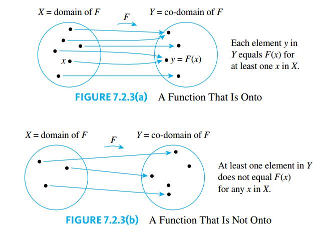
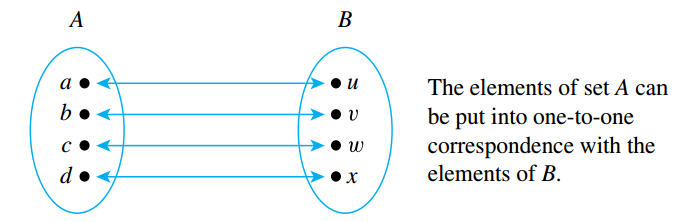

## Functions Defined on General Sets

> [!NOTE] **Function**
>
> A **function $f$ from a set $X$ to a set $Y$**, denoted by $f: X \rightarrow Y$, is a relation from $X$, the **domain** of $f$, to $Y$, the **co-domain** of $f$, that satisfies two properties:
>
> 1. Every element in $X$ is related to some element in $Y$
> 2. No element in $X$ is related to more than one element in $Y$.

The set of all values of a function $f$ taken together is called the **range** of $f$ or the **image** of $X$ under $f$. Symbolically:

$$
\text{range of } f = \text{image of } X \text{ under } f = \{y \in Y | y = f(x), \text{ for some } x \text{ in } X\}
$$

When $x$ is an element such that $f(x) = y$, then $x$ is called a **preimage of $y$** or **an inverse image of $y$**. The set of all inverse images of $y$ is called the **inverse image of $y$**. Symbolically:

$$
\text{the inverse image of } y = \{x \in X| f(x) = y\}
$$

### Arrow Diagrams

Inf $X$ and $Y$ are finite sets, you can define a function $f$ from $X$ to $Y$ by drawing an **arrow diagram**.

> [!NOTE] **Test for Function Equality**
>
> If $F: X \rightarrow Y$ and $G: X \rightarrow Y$ are functions, then $F = G$ if, and only if, $F(x) = G(x)$ for every $x \in X$.
>
> **Proof**: Suppose $F: X \rightarrow Y$ and $G: X \rightarrow Y$ are functions. Then $F$ and $G$ are subsets of $X \times Y$ by the definition of a function, and for $(x, y)$ to be in $F$ means that $y$ is the unique element related to $x$ by F. Similarly, for $(x, y)$ to be in $G$ means that $y$ is the unique element related to $x$ by $G$.
>
> Now, suppose that $F(x) = G(x)$ for every $x \in X$. Then if $x$ is any element of $X$
>
> $$(x, y) \in F \leftrightarrow y = F(x) \leftrightarrow y = G(x) \leftrightarrow (x, y) \in G$$
>
> So $F$ and $G$ consist of exactly the same elements and hence $F = G$.
>
> Conversely, if $F = G$, then for every $x \in X$,
>
> $$y = F(x) \leftrightarrow (x, y) \in F \leftrightarrow (x, y) \in G \leftrightarrow y = G(x)$$
>
> Thus, since both $F(x)$ and $G(x)$ equal $y$, we have that
>
> $$F(x) = G(x)$$

### Examples of Functions

> [!NOTE] **Identitity Function**
>
> Given a set $X$, define a function $I_X$ from $X$ to $X$ by
>
> $$I_X(x) = x, \forall x \in X$$
>
> The function $I_X$ is called the **identity function on $X$**.

> [!NOTE] **Logarithmic Functions**
>
> Let $b$ be a positive real number with $b \neq 1$. For each positive real number $x$, the **logarithm with base $b$ of $x$**, written $\log_b x$, is the exponent to which $b$ must be raised to obtain $x$. Symbolically:
>
> $$\log_b x = y \leftrightarrow b^y = x$$
>
> The **logarithmic function with base $b$** is the function from $\mathbb{R}^+$ to $\mathbb{R}$ that takes each positive real number $x$ to $\log_b x$.

> [!TIP] **The Hamming Distance Function**
>
> The **Hamming Distance Function** gives a measure of the "difference" between two strings of $0$'s and $1$'s that have the same length and is defined as:
>
> $$H(s, t) = \text{ the number of positions in which } s \text{ and } t \text{ have different values.}$$

### Boolean Functions

Given an input/output table for a digital logic circuit, we can define it as a function as follows: the elements in the input column can be regarded as ordered tuples of $0$'s and $1$'s and the elements in the output column is taken to be the co-domain of the function.

More generally, the input/output table corresponding to a circuit with $n$ input wires has $n$ input columns. Such table defines a function from the set of all $n$-tuples of $0$'s and $1$'s to the set $\{0, 1\}$.

> [!NOTE] **$n$-place Boolean Functions**
>
> An **($n$-place) Boolean Function** $f$ is a function whose domain is the set of all ordered $n$-tuples of $0$'s and $1$'s and whose co-domain is the set $\{0, 1\}$. More formally, the domain of a Boolean function ca be described as the Cartesian product of $n$ copies of the set $\{0, 1\}$, which is deoned $\{0, 1\}^n$. Thus $f: \{0, 1\}^n \rightarrow \{0, 1\}$.

### Checking whether a Function is Well Defined

In general, we say that a "function" is **not well defined** if it fails to satisfy at least one of the requirements for being a function.

### Functions Acting on Sets

> [!NOTE] **Image and Inverse Image of a Function**
>
> If $f: X \rightarrow Y$ is a function and $A \subseteq X$ and $C \subseteq Y$, then
>
> $$f(A) = \{y \in Y | y = f(x) \text{ for some } x \in A\}$$
>
> and
>
> $$f^{-1}(C) = \{x \in X | f(x) \in C\}$$
>
> $f(A)$ is called the **image of $A$**, and $f^{-1}(C)$ is called the **inverse image of $C$**.

## One-to-One, Onto, and Inverse Functions

### One-to-One Functions

> [!NOTE] **One-to-One Functions**
>
> Let $F$ be a function from a set $X$ to a set $Y$. $F$ is **one-to-one** (or **injective**) if, and only if, for all elements in $x_1$ and $x_2$ in $X$,
>
> $$F(x_1) = F(x_2) \rightarrow x_1 = x_2$$
>
> or equivalently
>
> $$x_1 \neq x_2 \rightarrow F(x_1) \neq F(x_2)$$

Similarly, a function is not one-to-one if:

$$
\exists x_1, x_2 \in X, \text{ such that } F(x_1) = F(x_2) \text{ and } x_1 \neq x_2
$$

That is, if elements $x_1$ and $x_2$ can be found that have the same function value but are not equal, then $F$ is not one-to-one.

### One-to-One Functions on Infinite Sets

Now suppose $f$ is a function defined on an infinite set $X$. By definition, $f$ is one-to-one if, and only if, the following universal statement is true:

$$
\forall x_1, x_2 \in X, f(x_1) = f(x_2) \rightarrow x_1 = x_2
$$

Thus, to prove $f$ is one-to-one, you will generally use the method of direct proof:

Suppose $x_1$ and $x_2$ are elements of $X$ such that $f(x_1) = f(x_2)$ and show that $x_1 = x_2$.

To show that $f$ is not one-to-one, you will find elements $x_1$ and $x_2$ in $X$ so that $f(x_1) = f(x_2)$ but $x_1 \neq x_2$.

### Application: Hash Function

> [!NOTE] **Hash Function**
>
> A **hash function** is a function defined from a larger, possible infinite, set of data to a smaller fixed-size set of integers.

To make a hash function more efficient it should satisfy:

1. Is one-to-one
2. Has a co-domain that is very much smaller than one billion.

Most hash functions are modifications of $mod$ functions using prime numbers to increase the change that their values will be scattered. Nonetheless, two input values may **collide** (i.e. have the same output value), and various method can be used to avoid such **collision** (**collision resolution method**).

A special class of hash function are **cryptographic hash functions**. These are designed to satisfy the following conditions:

1. It is a function from bit strings to bit string of a fixed length.
2. It is close to being a one-to-one: the probability of collisions is very small.
3. It is close to being a one-way function: given any bit string in its range, finding the inverse image of the string is computationally very difficult.
4. Its values can be quickly computed.
5. A very sligth change in an input string results in an extensive change in the output string.

### Onto Functions

> [!NOTE] **Onto Function**
>
> Let $F$ be a function from a set $X$ to a set $Y$. $F$ is **onto** (or **surjective**) if, and only if, given any element $y$ in $Y$, it is possible to find an element $x$ in $X$ with the property that $y = F(x)$. Symbolically:
>
> $$F: X \rightarrow Y \text{ is onto} \leftrightarrow \forall y \in Y, \exists x \in X \text{ such that } F(x) = y$$

Similarly, to show that a function is **not onto**, then we must show that:

$$
\exists y \in Y, \text{ such that } \forall x \in X, F(x) \neq y
$$

That is, there is some element in $Y$ that is not the image of any element in $X$.

### Onto Functions on Infinite Sets

To prove that $F: X \rightarrow Y$, where $X$ is an infinite set, you will use the method of **generalizing from the generic particular**:

Suppose that $y$ is an element of $Y$, show that there is an element $x$ in $X$ with $F(x) = y$.

And, to prove $F$ is **not onto**, you will usually find an element $y$ of $Y$ such that $y \neq F(x)$ for any $x$ in $X$.

### Relations between Exponential and Logarithmic Functions

> [!TIP] **Laws of Exponents**
>
> If $b$ and $c$ are any positive real numbers and $u$ and $v$ are any real number numbers, the following laws of exponents hold true:
>
> $$b^ub^v = b^{u + v}$$
>
> $$(b^u)^v = b^{u \cdot v}$$
>
> $$\frac{b^u}{b^v} = b^{u - v}$$
>
> $$(bc)^u = b^uc^u$$

> [!TIP] **Properties of Logarithms**
>
> For any positive real numbers $b, c, x$ and $y$ with $b \neq 1$ and $c \neq 1$ and for every real number $a$:
>
> $$\log_b (xy) = \log_b x + \log_b y$$
>
> $$\log_b(\frac{x}{y}) = \log_b x - \log_b y$$
>
> $$\log_b(x^a) = a \log_b x$$
>
> $$\log_c x = \frac{\log_b x}{\log_b c}$$

### One-to-One Correspondences

> [!NOTE] **One-to-One Correspondence**
>
> A **one-to-one correspondence** (or **bijection**) from a set $X$ to a set $Y$ is a function $F: X \rightarrow Y$ that is both one-to-one and onto.

### Inverse Functions

> [!NOTE] **Inverse Functions**
>
> Suppose $F: X \rightarrow Y$ is a one-to-one correspondence. Then there is a function $F^{-1}: Y \rightarrow X$ that is defined as follows: Given any element $y \in Y$,
>
> $$F^{-1}(y) = \text{ that unique element } x \in X \text{ such that } F(x) = y$$
>
> Or equivalently,
>
> $$F^{-1}(y) = x \leftrightarrow y = F(x)$$
>
> where $F^{-1}$ is called the **inverse function** for $F$.

## Composition of Functions

> [!NOTE] **Composition of Functions**
>
> Let $f: X \to Y$ and $g: Y' \to Z$ be functions with the property that the range of $f$ is a subset of the domain of $g$. Define a new function $g \circ g: X \to Z$ as follows:
>
> $$(g \circ f)(x) = g(f(x)), \text{ for each } x \in X$$
>
> The function $g \circ f$ is called the **composition of $f$ and $g$**.

Note that **the composition of functions is not a commutative operation**.

$$
g \circ f \neq f \circ g
$$

> [!NOTE] **Composition with an Identitity Function**
>
> If $f$ is a function from a set $X$ to a set $Y$, and $I_X$ is the identity function on $X$, and $I_Y$ is the identity on $Y$, then:
>
> $$(1) f \circ I_X = f$$
>
> and
>
> $$(2) I_Y \circ g = g$$

**Proof (1)**: Suppose $f$ is a function from a set $X$ to a set $Y$, and $I_X$ is the identity function on $X$. Then, for each $x$ in $X$,

$$(f \circ I_X)(x) = f(I_X(x)) = f(x)$$

Hence, by definition of equality of functions, $f \circ I_X = f$.

**Proof (2)**: Suppose $g$ is a function from a set $Y$ to a set $X$, and $I_Y$ is the identity function on $Y$. Then, for each $y$ in $Y$,

$$(I_Y \circ g)(x) = I_Y(g(x)) = g(x)$$

Hence, by definition of equality of functions, $I_Y \circ g = g$.

> [!NOTE] **Composition of a Function with Its Inverse**
>
> If $f: X \to Y$ is a one-to-one and onto function with inverse function $f^{-1}: Y \to X$, Then
>
> $$(1) f^{-1} \circ f: I_X$$
>
> $$(2) f \circ f^{-1}: I_Y$$

**Proof (1)**: Suppose $f: X \to Y$ is a one-to-one and onto function with inverse function $f^{-1}: Y \to X$. Let $x$ be any element in $X$. Then, by definition of composition of functions

$$(f^{-1} \circ f)(x) = f^{-1}(f(x))$$

Let

$$z = f^{-1}(f(x))$$

By definition of inverse function,

$$f(z) = f(x)$$

and, because $f$ is one-to-one, this implies that

$$z = x$$

Now $z = f^{-1}(f(x))$, so, by substitution

$$f^{-1}(f(x)) = x$$

Or, equivalently

$$(f^{-1} \circ f)(x) = x$$

Since $x$ is any element of $X$ and since $I_X(x) = x$, this proves that $f^{-1} \circ f = I_X$.

### Composition of One-to-One Functions

> [!NOTE] **Composition of One-to-One Functions**
>
> If $f: X \to Y$ and $g: Y \to Z$ are both one-to-one functions, then $g \circ f$ is one-to-one.

**Proof**: Suppose $f: X \to Y$ and $g: Y \to Z$ are both one-to-one functions. Suppose $x_1$ and $x_2$ are elements of $X$ such that

$$(g \circ f)(x_1) = (g \circ f)(x_2)$$

By definition of composition of functions

$$g(f(x_1)) = g(f(x_2))$$

Since $g$ is one-to-one

$$f(x_1) = f(x_2)$$

Since $f$ is one-to-one

$$x_1 = x_2$$

Hence $g \circ f$ is one-to-one.

### Composition of Onto Functions

> [!NOTE] **Composition of Onto Functions**
>
> If $f: X \to Y$ and $g: Y \to Z$ are both onto functions, then $g \circ f$ is onto.

**Proof**: Suppose $f: X \to Y$ and $g: Y \to Z$ are both onto functions. Let $z$ be any element of $Z$.

- Since $g$ is onto, there is an elemente, say $y$ in $Y$ such that $g(y) = z$.
- And, since $f$ is onto, there is an element, say $x$ in $X$ such that $f(x) = y$.

Hence, there is an element $x$ in $X$ such that

$$(g \circ f)(x) = g(f(x)) = g(y) = z$$

### Cardinality with Applications to Computability

The term _cardinal number_ refers to the size of a set ("This set has eight elements"), whereas the term _ordinal number_ refers to the order of an element in a sequence ("This is theeighth element in the row"). We say that two finite sets whose elements can be pairedby a one-to-one correspondence have the same size. This is illustrated by the following diagram.

Now a **finite set** is one that has no elements at all or that can be put into one-to-one correspondence with a set of the form $\{1, 2, \cdots, n\}$ for some positive integer $n$. By contrast,an **infinite set** is a nonempty set that cannot be put into one-to-one correspondence with $\{1, 2, \cdots, n\}$ for any positive integer $n$.

> [!NOTE] **Cardinality Equality**
>
> Let $A$ and $B$ be any sets. $A$ \*\*has the same cardinality as $B$ if, and only if, there is a one-to-one correspondence from $A$ to $B$.

> [!TIP] **Properties of Cardinality**
>
> For al sets $A, B$ and $C$:
>
> 1. **Reflexive property of cardinality**: $A$ has the same cardinality as $A$.
> 2. **Symmetric property of cardinality**: If $A$ has the same cardinality as $B$, then $B$ has the same cardinality as $A$.
> 3. **Transitive property of cardinality**: If $A$ has the same cardinality as $B$, and $B$ has the same cardinality as $C$, then $A$ has the same cardinality as $C$.

**Proof (1), Reflexivity**. Suppose $A$ is any set. Consider the identity function $I_A$ from $A$ to $A$. Thsi function is one-to-one because if $x_1$ nd $x_2$ are any elements in $A$ With $I_A(x_1) = I_A(x_2)$, then by definition of $I_A$, $x_1 = x_2$. The identity function is also onto because if $y$ is any element in $A$, then $y = I_A(y)$ by definition of $I_A$. Hence $I_A$ is a one-to-one correspondence from $A$ to $A$ and thus $A$ has the same cardinality as $A$.

**Proof (2), Symmetry**. Suppose $A$ and $B$ are any sets and $A$ has the same cardinality as $B$. Since $A$ has the same cardinality as $B$, there is a function $f$ from $A$ to $B$ that is one-to-one and onto. But then, because $f$ is a one-to-one correspondence there exists a function $f^{-1}$ from $B$ to $A$ that is also one-to-one and onto. Hence $B$ has the same cardinality as $A$.

**Proof (3), Transitivity**. Suppose $A, B$ and $C$ are any sets and $A$ has the same cardinality as $B$ and $B$ has the same cardinality as $C$. Since $A$ has the same cardinality as $B$, there is a function $f$ from $A$ to $B$ that is one-to-one and onto, and since $B$ has the same cardinality as $C$ there is a function $g$ from $B$ to $C$ that is one-to-one and onto. But then, by [Theorem on the Composition of One-to-One Functions](#composition-of-one-to-one-functions) $g \circ f$ if a function from $A$ to $C$ that is one-to-one and onto. Hence $A$ has the same cardinality as $C$.

> [!NOTE] **Cardinality Equality**
>
> $A$ and $B$ **have the same cardinality** if, and only if, $A$ has the same cardinality as $B$ or $B$ has the same cardinality as $A$.

### Countable Sets

> [!NOTE] **Finite Set**
>
> A set is **finite** if, and only if, it is the empty set or can be put into one-to-one correspondence with a set of the form $\{1, 2, \cdots, n\}$ for some positive integer $n$.

> [!NOTE] **Countably Infinite Set**
>
> A set is **countably infinite** if, and only if, it has the same cardinality as the set of positive integers $\mathbb{Z}^+$.

> [!NOTE] **Countable Set**
>
> A set is **countable** if, and only if, it is finite or countably infinite. A set that is not countable is called **uncountable**.

In 1874 the German mathematician [Georg Cantor](https://en.wikipedia.org/wiki/Georg_Cantor) achieved success in the search for a larger infinity by showing that the set of all real numbers is uncountable. We give a proof of the uncountability of the set of all real numbers between $0$ and $1$ using a simpler technique introduced by Cantor in 1891 and now called the Cantor diagonalization process.

> [!TIP] **The Set of All Real Numbers is Uncountable**
>
> The set of all real number between $0$ and $1$ is uncountable.

**Proof (by contradiction)**. Suppose the set of all real numbers between $0$ and $1$ is countable. Then the decimal representations of these numbers can be written in a list as follows:

$$
0.a_{11}a_{12}a_{13} \cdots a_{1n} \cdots
$$

$$
0.a_{21}a_{22}a_{23} \cdots a_{2n} \cdots
$$

$$
\vdots
$$

$$
0.a_{n1}a_{n2}a_{n3} \cdots a_{nn} \cdots
$$

$$
\vdots
$$

For each pair of positive integers $i$ and $j$, the $j$th decimal digit of the $i$th number on the list is $a_{ij}$. The diagonal elements are circled:

Construct a new decimal number $d = 0.d_1 d_2 d_3 \cdots d_n \cdots$ as follows:

$$
d_n = \begin{cases}
1 & \text{ if } a_{nn} \neq 1 \\
2 & \text{ if } a_{nn} = 1 \\
\end{cases}
$$

The crucial observation is that for each integer $n$, $d$ differs in the $n$th decimal position from the $n$th number on the list. But this implies that $d$ is not on the list. In other words, $d$ is a real number between $0$ and $1$ that is not on the list of all real numbers between $0$ and $1$. This contradiction shows the falseness of the supposition that the set of all numbers between $0$ and $1$ is countable. Hence the set of all real numbers between $0$ and $1$ is uncountable.

> [!TIP] **Countable subsets**
>
> Any subset of any countable set is countable.

**Proof**. Let $A$ be a partiular but arbitrarily chosen countable set and let $B$ be any subset of $A$. Either $B$ is finite or it is inifinite.

If $B$ is finite, then $B$ is countable by definition of countable, and we are done.

Suppose $B$ is infinite. Since $A$ is countable, the distinct element of $A$ can be represented as a sequence

$$
a_1, a_2, a_3, \cdots
$$

Define a function $g: \mathbb{Z}^+ \to B$ inductively as follows:

1. Search sequentially through elements $a_1, a_2, a_3, \cdots$ until an element of $B$ is found. This must happen eventually since $B \subseteq A$ and $B \neq \emptyset$. Call that element $g(1)$.
2. For each integer $k \geq 2$, suppose $g(k - 1)$ has been defined.
   - Then $g(k - 1) = a_i$ for some $a_i \in \\{a_1, a_2, a_3, \cdots\\}$.
   - Starting with $a_i + 1$, search sequentially through $a_i + 1, a_i + 2, a_i + 3, \cdots$ trying to find an element of $B$.
   - One must be found eventually because $B$ is infinite and $\\{g(1), g(2), \cdots, g(k - 1)\\}$ is a finite set. When an element of $B$ is found, define it to be $g(k)$.

By (1) and (2) above, the function $g$ is defined for each positive integer.

Since the elements of $a_1, a_2, a_3, \cdots$ are all distinct, $g$ is **one-to-one**. Furthermore, the searches for elements of $B$ are sequential: Each pick up where the previous left off. Thus every element of $A$ is reached during some search.

Moreover, all the elements of $B$ are located somewhere in the sequence $a_1, a_2, a_3, \cdots$, and so every element of $B$ is eventually found and made the image of some integer. Hence $g$ is **onto**. These remarks show that $g$ is a one-to-one correspondence from $\mathbb{Z}^+$ to $B$. So $B$ is countably infinite and thus countable.

> [!TIP] **Uncountable subsets**
>
> Any set with an uncountable subset is uncountable.

**Proof**. For every set $S$ and for every subset $A$ of $A$, if $S$ is countable then $A$ is countable. The contrapositive of this statement is logically equivalent to it and states: For every set $S$ and for every subset $A$ of $S$ if $A$ is uncountable then $S$ is uncountable.

> [!TIP] **Cardinality of Power Sets**
>
> Any set and its power set have different cardinalities.
>
> There exists a one-to-one function from any set to its power set (the function that takes each element $a$ to the singleton set $\{a\}$). This implies that the cardinality of any set is "less than" the cardinality of its power set. As a result **you can create an infinite sequence of larger an larger infinities**.

### Application: Cardinality and Computability

> [!TIP] **Countability of the Set of Computer Programs**
>
> The set of all computer programs in a given computer language is countable.

**Proof**. Given any computer language, let $P$ be the set of all computer programs in the language. Either $P$ is finite or $P$ is infinite.

If $P$ is finite, then $P$ is countable and we are done.

If $P$ is infinite, set up abinary code to translate the symbols of the alphabet of the language into strings of $0$'s and $1$'s. Order these strings by length, putting shorter before longer, and order all strings of a given length by regarding each string as a binary number and writing the numbers in ascending order.

Define a function $F: \mathbb{Z}^+ \to P$ by specifying that

$$
F(n) = \text{ the } n \text{th program on in the list for each } n \in \mathbb{Z}^+
$$

By construction, $F$ is one-to-one and onto, and so $P$ is countably infinite and hence countable.

> [!TIP] **Uncountable Sets and Noncomputable Functions**
>
> If a certain set is uncountable, then there must exist a noncomputable function.
>
> 1. Let $T$ bet the set of all functions from $\mathbb{Z}^+$ to the set $\\{0, 1, 2, 3, 4, 5, 6, 7, 8, 9\\}$. Show that $T$ is uncountable.
> 2. Derive the consequence that there are noncomputable funcitons.

**Proof (1)**. Let $S$ be the set of all real numbers between $0$ and $1$. Any number in $S$ can be represented in the form:

$$
0, a_1a_2a_3\cdots a_n \cdots,
$$

where each $a_i$ is an integer from $0$ to $9$. This representation is unique if decimals that end in all $9$'s are omitted.

Define a function $F$ from $S$ to a subset of $T$ as follows:

$$
F(0.a_1a_2a_3 \cdots a_n \cdots) = \text{ the function that sends each positive integer } n \text{ to } a_n
$$

For example, take $x = 0.37245 \in S$. The function $F(x)$ is:

$$
F(x)(1) = 3, F(x)(2) = 7, F(x)(3) = 2, F(x)(4) = 4, F(x)(5) = 5
$$

So $F(x)$ is the function

$$
\{(1, 3), (2, 7), (3, 2), (4, 4), (5, 5)\}
$$

Choose the co-domain of $F$ to be exactly the subset of $T$ that makes $F$ onto. In other words, defien the co-domain of $F$ to equal the image of $F$.

Now $F$ is one-to-one because in order for the functions $F(x_1)$ and $F(x_2)$ to be equal, they must have the same value for each positive integer, and so each decimal digit of $x_1$ must equal the corresponding decimal digit of $x_2$, which implies that $x_1 = x_2$.

Thus $F$ is a one-to-one correspondence from $S$ to a subset of $T$, but $S$ is uncountable. Hence $T$ has an uncountable subset, and so $T$ is uncountable.

**Proof (2)**. Part (1) shows that the set $T$ of all functions from $\mathbb{Z}^+$ to $\\{0, 1, 2, 3, 4, 5, 6, 7, 8, 9\\}$ is uncountable. But, given any computer language we have shown that the set of programs in that language is countable. Consequently, in any computer language there are not enough programs to compute values of every function in $T$. **That is, there must exist functions that are not computable**.
