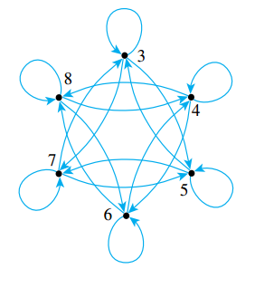
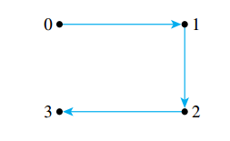
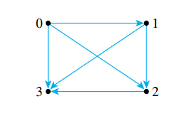
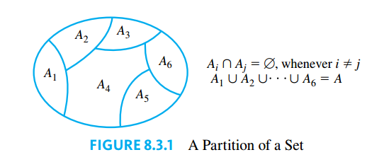

## Relations on Sets

### The Inverse of a Relation

> [!NOTE] **Inverse of a Relation**
>
> Let $R$ be a relation from $A$ to $B$. Define the inverse relation $R^{-1}$ from $B$ to $A$ as follows:
>
> $$R^{-1} = \\{(y, x) \in B \times A | (x, y) \in R\\}$$

### Directed Graph of a Relation

> [!TIP] **Relation on a Set**
>
> A **relation on a set $A$** is a relation from $A$ to $A$.

When a relation $R$ is defined on a set $A$, the arrow diagram of the relation can be defined so it becomes a **directed graph**. Instead of representing $A$ as two separate sets of points, represent $A$ only once, and draw an arrow from each point of $A$ to each related point.



### $N$-ary Relations and Relational Databases

A special group of relations, called $n$-ary relations, form the mathematical foundation for relational database theory. Just as a binary relation is a subset of a Cartesian product of two sets, an $n$-ary relation is a subset of a Cartesian product of $n$ sets.

> [!NOTE] **$N$-ary Relation**
>
> Given sets $A_1, A_2, \cdots, A_n$ an **$n$-ary relation** $R$ on $A_1 \times A_2 \times \cdots \times A_n$ is a subset of $A_1 \times A_2 \times \cdots \times A_n$.
>
> The special cases of $2$-ary, $3$-ary and $4$-ary relations are called **binary**, **ternary** and **quartenary relations**, repectively.

The following is a radically simplified version of a database that might be used in a hospital.

Let $A_1$ bet a set of positive integers, $A_2$ a set of alphabetic character strings, $A_3$ a set of numeric character strings, and $A_4$ a set of alphabetic character strings.

Define a quartenary relation $R$ on $A_1 \times A_2 \times A_3 \times A_4$ as follows:

$$
(a_1, a_2, a_3, a_4) \Leftrightarrow \text{ a patient with patient ID } a_1, \text{ named } a_2, \\ \text{ was admitted on date } a_3, \text{ with primary diagnosis } a_4.
$$

At a particular hospital, this relation might contain the following 4-tuples:

- (011985, John Schmidt, 020719, asthma)
- (574329, Tak Kurosawa, 011419, pneumonia)
- (466581, Mary Lazars, 010319, appendicitis

In discussions of relational databases, the $n$-tuples are normally thought of as being written in tables. Each row of the table corresponds to one $n$-tuple, and the header for each column gives the descriptive attribute for the elements in the column.

For example, in the database language SQL, if the above database is denoted $S$, the result of the query:

```sql
SELECT Patient_ID#, Name
FROM S
WHERE Admission_Date = 010319
```

Is obtained by taking the intersection of the set $A_1 \times A_2 \times \\{010319\\} \times A_4$ with the database and then projecting onto the first two coordinates.

## Reflexivity, Symmetry and Transitivity

> [!TIP] **Properties of a Relation**
>
> Let $R$ be a relation on a set $A$
>
> 1. $R$ is **reflexive** if, and only if, for every $x \in A, x R x$.
> 2. $R$ is **symmetric** if, and only if, for every $x, y \in A, x R y \rightarrow y R x$.
> 3. $R$ is **transitive** if, and only if, for every $x, y, z \in A, x R y \text{ and } y R z \rightarrow x R z$.

Now consider what it means for a relation not to have one of the properties defined previously.

1. $R$ is **not reflexive**: there is an element $x$ in $A$, such that $x \not R x$
2. $R$ is **not symmetric**: there are elements $x$ and $y$ in $A$, such that $x R y$ but $y \not x$.
3. $R$ is **not transitive**: there are elements $x$, $y$ and $z$ in $A$, such that $x R y$ and $y R z$ but $x \not z$.

So you can show that a relation does not have one of the properties by finding a counterexample.

### Properties of Relations on Infinite Sets

Suppose a relation $R$ is defined on an infinite set $A$. To prove the relation is reflexive, symmetric, or transitive use the definitions of $A$ and $R$. For instance, for the symmetry on the equality relation on the set of real numbers:

$$
\forall x, y \in \mathbb{R}, x = y \rightarrow y = x
$$

Sometimes a property is "universally false" in the sense that it is false for every element of its domain. It follows immediately, of course, that the property is false for each particular element of the domain and hence counterexamples abound. In such a case, it may seem more natural to prove the universal falseness of the property rather than to give a single counterexample.

### The Transitive Closure of a Relation

Generally speaking, a relation fails to be transitive because it fails to contain certain ordered pairs. For example, if $(1, 3)$ and $(3, 4)$ are in a relation $R$, then the pair $(1, 4)$ must be in $R$ if $R$ is to be transitive.

Roughly speaking, the relation obtained by adding the least number of ordered pairs to ensure transitivity is called the transitive closure of the relation. More precisely, the transitive closure of a relation is the smallest transitive relation that contains the relation.

> [!NOTE] **Transitive Closure**
>
> Let $A$ be a set and $R$ a relation on $A$. The **transitive closure** of $R$ is the relation $R^t$ on $A$ that satisfies the following three properties:
>
> 1. $R^t$ is transitive
> 2. $R \subseteq R^{t}$
> 3. If $S$ is any other transitive relation that contains $R$, then $R^{t} \subseteq S$.

Given a relation $R$ on a set $A$ whose directed graph is:



Then the directed graph for the transitive closure $R^{t}$ would be:



## Equivalence Relations

The idea of grouping together things that "look different but are really the same" is the central idea of equivalence relations.

### The Relation Induced by a Partition

> [!NOTE] **Partition of a Set**
>
> A **partition** of a set $A$ is a finite or infinit collection of nonempty, mutually disjoint subsets whose union is $A$.



> [!NOTE] **Relation Induced By a Partition**
>
> Given a partition of a set $A$, the **relation induced by the partition**, denoted by $R$, is defined on $A$ as follows. For every $x, y \in A$:
>
> $$x R y \Leftrightarrow \text{ there is a subset } A_i \text{ of the partition such that both } \\ x \text{ and } y \text{ are in } A_i$$

> [!TIP] **Properties of the Relation Induced By a Partition**
>
> Let $A$ be a set with a partition and let $R$ be the relation induced by the partition. Then $R$ is reflextive, symmetric and transitive.

**Proof that $R$ is reflextive**: Suppose $x \in A$. Since $A_1, A_2, \cdots, A_n$ is a partition of $A$, it follows that $x \in A_i$ for some $i$, and so the statement:

> There is a set $A_i$ of the partition such that $x \in A_i$ and $x \in A_i$

is true. Thus, by definition of $R$, $x R x$.

**Proof that $R$ is symmetric**: Suppose that $x$ and $y$ are elements of $A$ such that $x R y$. Then

> There is a subset $A_i$ of the partition such that $x \in A_i$ and $y \in A_i$

by definition of $R$. It follows that the statement

> There is a subset $A_i$ of the partition such taht $y \in A_i$ and $x \in A_i$

is also true. Hence, by definition of $R$, $y R x$.

**Proof that $R$ is transitive**: Suppose $x$, $y$ and $z$ are in $A$ and $x R y$ and $y R z$. By definition of $R$, there are subsets $A_i$ and $A_j$ of the partition such that:

$$
x \text{ and } y \text{ are in } A_i \text{ and } y \text{ and } z \text{ are in } A_j
$$

Suppose $A_i \neq A_j$. Then $A_i \cap A_j = \emptyset$ since $\\{A_1, A_2 \cdots, A_n\\}$ is a partition of $A$. But $y$ is in $A_i$ and $y$ is in $A_j$ also. Hence $A_i \cap A_j \neq \emptyset$. Thus $A_i = A_j$. It follows that $x, y$ and $z$ are all in $A_i$, and so, in particular

$$
x \text{ and } z \text{ are in } A_i
$$

Thus $x R z$ by definition of $R$.

### Equivalence Relations

> [!NOTE] **Equivalence Relation**
>
> Let $A$ bet a set and $R$ a relation on $A$. $R$ is an **equivalence relation** if, and only if $R$ is reflexive, symmetric and transitive.

> [!NOTE] **Equivalence Class**
>
> Suppose $A$ is a set and $R$ is an equivalence relation on $A$. For each element $a$ in $A$, the **equivalence class of** $a$, denote $[a]$ and called **class of $a$** for short, is the set of all elements $x$ in $A$ such that $x$ is related to $a$ by $R$
>
> $$[a] = \{x \in A | x R A\}$$

When several equivalence relations on a set are under discussion, the notation $[a]_R$ may be used to denote the equivalence class of $a$ for the relation $R$.

> [!TIP]
>
> Suppose $A$ is a set, $R$ is an equivalence relation on $A$, and $a$ and $b$ are elements of $A$. If $a R b$, then $[a] = [b]$.

**Proof that $[a] \subseteq [b]$**. Let $x \in [a]$. Then

$$
x R a
$$

by definition of class. But

$$
a R b
$$

by hypothesis. Thus, by transitivity of $R$

$$
x R b
$$

Hence

$$
x \in [b]
$$

by definition of class

**Proof that $[b] \subseteq [a]$**. Let $x \in [b]$. Then

$$
x R b
$$

by definition of class. But

$$
a R b
$$

by hypothesis. Since $R$ is symmetric

$$
b R a
$$

Thus, by transitivity of $R$, given $x R b$ and $b R a$

$$
x R a
$$

Hence

$$
x \in [a]
$$

by definition of class

Since $[a] \subseteq [b]$ and $[a] \subseteq [b]$, it follows that $[a] = [b]$.

> [!TIP]
>
> If $A$ is a set, $R$ is an equivalence relation on $A$, and $a$ and $b$ are elements of $A$, theneither
>
> $$[a] \cup [b] = \emptyset$$
>
> or
>
> $$[a] = [b]$$

The previous statement has the form:

$$
\text{if } p \text{ then } (q \text{ or } r)
$$

We will prove the logically equivalent statement:

$$
\text{if } (p \text{ and not } q) \text{ then } r
$$

That is, we will prove:

> If $A$ is a set, $R$ is an equivalence relation on $A$, $a$ and $b$ are elements of $A$ and $[a] \cap [b] = \emptyset$, then $[a] = [b]$.

**Proof**. Suppose $A$ is a set, $R$ is an equivalence relation on $A$, $a$ and $b$ are elements of $A$, and

$$
[a] \cap [b] \neq \emptyset
$$

Since $[a] \cap [b] \neq \emptyset$, there exists an element $x$ in $A$ such that $x \in [a] \cap [b]$. By definition of intersection

$$
x \in [a] \text{ and } x \in [b]
$$

and so

$$
x R a \text{ and } x R b
$$

by definition of class. Since $R$ is symmetric and $x R a$, then $a R x$. But $R$ is also transitive, and so, since $a R x$ and $x R b$,

$$
a R b
$$

Now $a$ and $b$ satisfy the hypothesis of the previous lemma, hence:

$$
[a] = [b]
$$

> [!NOTE] **The Partition Induced by an Equivalence Relation**
>
> If $A$ is a set and $R$ is an equivalence relation on $A$, then the distinct equivalence classes of $R$ form a partition of $A$.

**Proof** Suppose $A$ is a set and $R$ is an equivalence relation on $A$. For notational simplicity, we assume that $R$ has only a finite number of distinct equivalence classes, which we denote

$$
A_1, A_2, \cdots, A_n,
$$

where $n$ is a positive integer (when the number of classes is infinite, the proof is identical except for notation).

_Proof that $A = A_1 \cup A_2 \cup \cdots \cup A_n$_

To show that $A \subset A_1 \cup A_2 \cup \cdots \cup A_n$ suppose $x$ is any element of $A$.

- By reflexivity of $R$, $x R x$. This implies that $x \in [x]$ by defintion of class.
- Since $x$ is in some equivalence class, it must be in one of the distinct equivalence classes $A_1, A_2, \cdots, A_n$.
- Thus $x \in A_i$ for some index $i$, and hence $x \in A_1 \cup A_2 \cup \cdots \cup A_n$ by definition of union.

To show that $A_1 \cup A_2 \cup \cdots \cup A_n \subseteq A$ suppose $x \in A_1 \cup A_2 \cup \cdots \cup A_n$.

- Then $x \in A_i$ for some $i = 1, 2, \cdots, n$ by definition of union.
- Now each $A_i$ is an equivalence class of $R$, and equivalence classes are subsets of $A$. Hence $A_i \subseteq A$ and so $x \in A$.

Since $A \subseteq A_1 \cup A_2 \cup \cdots \cup A_n$ and $A_1 \cup A_2 \cup \cdots \cup A_n \subseteq A$, then by definition of set equality $A = A_1 \cup A_2 \cup \cdots \cup A_n$.

_Proof that the distinct classes of $R$ are mutually disjoint_. Suppose that $A_i$ and $A_j$ are any two distinct equivalence classes of $R$. Since $A_i$ and $A_j$ are distinct, then $A_i \neq A_j$. And since $A_i$ and $A_j$ are equivalence classes of $R$, there must exist elements $a$ and $b$ in $A$ such that $A_i = [a]$ and $A_j = [b]$. By the previous lemma

$$
\text{either } [a] \cap [b] = \emptyset \text{ or } [a] = [b]
$$

Now $[a] \neq [b]$ because $A_i \neq A_j$ and hence $[a] \cap [b] = \emptyset$. Thus $A_i \cap A_j = \emptyset$, and so $A_i$ and $A_j$ are disjoint.

> [!NOTE] **Representative of a Class Equivalence**
>
> Suppose $R$ is an equivalence relation on a set $A$ and $S$ is an equivalence class of $R$. A **representative** of the class $S$ is any element $a$ such that $[a] = S$.

Note that if $a$ is any element of an equivalence class $S$, then $S = [a]$. Hence any element of an equivalence class is a representative of that class.

### Congruence Modulo $n$

> [!NOTE] **Congruent Modulo $n$**
>
> Let $m$ and $n$ be integers and let $d$ be a positive integer. We say that **$m$ is congruent to $n$ modulo $d$** and write
>
> $$ m \equiv n (\text{mod } d)$$
>
> if, and only if,
>
> $$ d | (m - n)$$

## Modular Arithmetic with Applications to Cryptography

Cryptography is the study of methods for sending secret messages. It involves **encryption**, in which a message, called **plaintext**, is converted into a form, called **ciphertext**, that is sent over a channel possibly open to view by outside parties. The receiver of the ciphertext uses **decryption** to convert the ciphertext back into plaintext.

With public-key cryptography, a potential recipient of encrypted messages openly distributes a public key containing the encryption information. However, knowledge of the public key provides virtually no clue about how messages are decrypted.

The first public-key cryptography system was developed in 1976–1977 by three mathematician/computer scientists working at M.I.T.: [Ronald Rivest](https://es.wikipedia.org/wiki/Ronald_Rivest), [Adi Shamir](https://en.wikipedia.org/wiki/Adi_Shamir), and [Leonard Adleman](https://es.wikipedia.org/wiki/Leonard_Adleman). In their honor it is called the **RSA cipher**.

### Properties of Congruence Modulo $n$

> [!NOTE] **Modular Equivalences**
>
> Let $a, b$ and $n$ be any integers and suppose $n > 1$. The following statements are all equivalent:
>
> 1. $n | (a - b)$
> 2. $a \equiv b (\text{mod } n)$
> 3. $a = bk + n$, for some integer $k$
> 4. $a$ and $b$ have the same (nonnegative) remainder when divided by $n$
> 5. $a \text{mod } n = b \text{mod } n$

**Proof** We will show that $(1) \Rightarrow (2) \Rightarrow (3) \Rightarrow (4) \Rightarrow (5) \Rightarrow (1)$. It will follow by the transitivity of if-then that all five statements are equivalent.

Let $a, b$ and $n$ be any integers with $n > 1$.

**Proof that $(1) \Rightarrow (2)$**: Suppose $n | (a - b)$. By definition of congruence modulo $n$, we can immediately conclude that $a \equiv b (\text{mod } n)$.

**Proof that $(2) \Rightarrow (3)$**: Suppose $ a \equiv b (\text{mod } n)$. By definition of congruence modulo $n$, $n | (a - b)$. Thus, by definition of divisibility $a - b = kn$ for some integer $k$ and thus $a = kn + b$.

**Proof that $(3) \Rightarrow (4)$**: Suppose that $a = b + kn$ for some integer $k$. Use the quotient remainder theorem to divide $a$ by $n$ to obtain

$$
a = qn + r
$$

where $q$ and $r$ are integers and $0 \neq r < n$. Substituting $b + kn$ for $a$

$$
b + kn = qn + r
$$

$$
b = n(q - k) + r
$$

Now since $0 \leq r < n$, the uniqueness property of the quotient-remainder theorem guarantees that $r$ is also the remainder obtained when $b$ is divided by $n$. Thus $a$ and $b$ have the same remainder when divided by $n$.

**Proof that $(4) \Rightarrow (5)$**: Suppose that $a$ and $b$ have the same remainder when divided by $n$. It follows immediately from the definition of the $\text{mod}$ function that $a \text{ mod } n = b \text{mod } n$.

**Proof that $(5) \Rightarrow (1)$**: Suppose that $a \text{mod } n = b \text{mod } n$. By definition of the $\text{mod}$ function, $a$ and $b$ have the same remainder when divided by $n$. Thus, by the quotient remainder theorem, we can write

$$
a = q_1 n + r, b = q_2 + r
$$

where $q_1, q_2$ and $r$ are integers and $0 \neq r < n$.

It follows that

$$
a - b = (q_1n + r) - (q_2n + r) = (q_1 - q_2)n
$$

Therefore, since $q_1 - q_2$ is an integer, $n | (a - b)$.

> [!NOTE] **Residue of a Modulo $n$**
>
> Given integers $a$ and $n$ with $n > 1$, **the residue of $a$ modulo $n$** is $a \text{mod } n$, the nonnegative remainder obtained when $a$ is divided by $n$.

> [!NOTE] **Complete Set of Residues Modulo $n$**
>
> Given a nonnegative integer $n$, the numbers $0, 1, 2, \cdots, n - 1$ are called a **complete set of residues modulo $n$**.

> [!NOTE] **Reduce a Number Modulo $n$**
>
> Given a nonnegative integer $n$, to **reduce a number modulo $n$** means to set it equal to its residue modulo $n$.

> [!NOTE] **Congruence Modulo $n$ Is an Equivalence Relation**
>
> If $n$ is any integer with $n > 1$, congruence modulo $n$ is an equivalence relation on the set of all integers. The distint equivalence classes of the relation are the sets $[0], [1], \cdots, [n - 1]$, where for each $a = 0, 1, 2, \cdots, n - 1$
>
> $$[a] = \{m \in Z | m \equiv a (\text{mod } n)\}$$

**Proof**. Suppose $n$ is an integer with $n > 1$. We must show that the congruence modulo $n$ is reflexive, symmetric and transitive.

_Proof of reflexivity_: Suppose that $a$ is any integer, we must show that $a \equiv a \text{mod n}$. By definition of congruence modulo $n$ this means $n | (a - a)$, that is $(a - a) = nq \Leftrightarrow 0 = n 0$. Thus $a \equiv a \text{mod } n$.

_Proof of symmetry_: Suppose $a$ and $b$ are any two integers such that $a \equiv b \text{mod } n$, we must show $b \equiv a \text{mod }n$. By definition of congrunce modulo $n$

$$
(a - b) = nk, k \in \mathbb{Z}
$$

If we multiply on both sides by $-1$

$$
-(a - b) = -nk \Leftrightarrow (b - a) = n(-k)
$$

And, by definition of congrunce modulo $n$ $b \equiv a \text{mod } n$.

_Proof of transitivity_: Let $a, b, c \in \mathbb{R}$ such that $a \equiv b \text{mod } n$ and $b \equiv c \text{mod } n$. We must show that $a \equiv c \text{mod } n$. By definition of congruence modulo $n$

$$
(a - b) = nk, k \in \mathbb{Z}
$$

and

$$
(b - c) = nq, q \in \mathbb{Z}
$$

If we solve the first expression for $b$

$$
b = n(-k) + a
$$

And substitute $b$ on the second expression

$$
n(-k)  + a- c = nq
$$

$$
a - c = nq + nk = n(q + k)
$$

Thus $n | (a - c)$ and $a \equiv c \text{mod } n$ by definition.

### Modular Arithmetic

> [!NOTE] **Modular Arithmetic**
>
> Let $a, b, c, d$ and $n$ be integers with $n > 1$, and suppose
>
> $$a \equiv c (\text{mod }n )$$
>
> Then
>
> 1. $(a + b) \equiv (c + d) (\text{mod } n)$
> 2. $(a - b) \equiv (c - d) (\text{mod } n)$
> 3. $ab \equiv cd (\text{mod } n)$
> 4. $a^m \equiv a^m (\text{mod } n)$ for every positive integer $m$

The most practical use of modular arithmetic is to reduce computations involving large integers to computations involving smaller ones.

> [!TIP] **Modular Equivalences**
>
> Let $a, b$ and $n$ be integers with $n > 1$. Then
>
> $$ab \equiv [(a \text{mod } n)(a \text{mod } n)](\text{mod } n)$$
>
> or, equivalently
>
> $$ab \text{mod } n = [(a \text{mod } n)(a \text{mod } n)](\text{mod } n)$$
>
> In particular, if $m$ is a positive integer, then
>
> $$a^m \equiv [(a \text{mod } n)^m](\text{mod } n)$$

### Extending the Euclidean Algorithm

> [!NOTE] **Linear Combination**
>
> An integer $d$ is said to be a **linear combination of integers** $a$ and $b$ if, and only if, there exist integers $s$ and $t$ such that $as + bt = d$.

> [!TIP] **Writing a Greatest Common Divisor as a Linear Combination**
>
> For all integers $a$ and $b$, not both zero, if $d = \text{gcd}(a, b)$, then there exist integers $s$ and $t$ such that $as + bt = d$.

**Proof** Given integers $a$ and $b$, not both zero, and given $d = \text{gcd}(a, b)$, let

$$
S = \{x | x \text{ is a positive integer and } x = as + bt \text{ for some integers } s \text{ and } t\}
$$

Note that $S$ is a nonempty set because:

1. If $a > 0$, then $1 \cdot a + 0 \cdot b \in S$,
2. if $a < 0$, then $(- 1) \cdot a + 0 \cdot b \in S$ and
3. if $a = 0$ then , by assumption, $b \neq 0$ and hence $0 \cdot a + 1 \cdot b \in S$ or $0 \cdot a + (-1) \cdot b \in S$.

Because $S$ is a nonempty subset of positive integers, by the [Well-Ordering Principle for the Integers](../05_sequences_induction_recursion/#well-ordering-principle-for-the-integers) there is a least element $c$ in $S$, By definiton of $S$

$$
c = as + bt, \text{ for some integers } s \text{ and } t
$$

We will show that $c \geq d$ and $c \leq d$, therefore $c = d$.

_Proof that $c \geq d$_:

Because $d = \text{gcd}(a, b)$, by defintion of greatest common divisor, $d | a$ and $d | b$. Hence $a = dx$ and $b = dy$ for some integers $x$ and $y$. Then

$$
c = as + bt
$$

$$
c = dxs + dyt
$$

$$
c = d(xs + yt)
$$

Thus, by definition $d | c$ and $c \geq d$.

_Proof that $c \leq d$_:

Apply the quotient-remainder theorem to the divition of $a$ by $c$ to obtain

$$
a = cq + t \text{ for some integers } q \text{ and } r \text{ with } 0 \leq r < c
$$

Thus for some integers $q$ and $r$ with $0 \leq r < c$

$$
r = a - cq
$$

Now $c = as + bt$. Therefore, by substitution

$$
r = a -(as + bt)q
$$

$$
r = a(1 - sq) - btq
$$

Thus $r$ is a linear combination of $a$ and $b$. If $r > 0$, then $r$ would be in $S$ and so $r$ would be a smaller element of $S$ than $c$, which would contradict the fact that $c$ is the least element of $S$. Hnece $r = =$. Thus

$$
0 = a - cq \Leftrightarrow a = cq
$$

and therefor $c | a$.

An almost identical argument establishes that $c | b$.

Because $c | a$ and $c | b$, $c$ is a common divisor of $a$ and $b$. Hence $c \leq \text{gcd}(a, b) = d$.

We conclude that $c = d$. It follows that $d$, the greatest common divisor of $a$ and $b$, is equal to $as + bt$.

### Finding an Inverse Modulo $n$

> [!NOTE] **Inverse Modulo $n$**
>
> Given any integer $a$ and any positive integer $n$, if there exists an integer $s$ such that $as \equiv 1 (\text{mod } n)$ then $s$ is called **an inverse for $a$ modulo $n$**.

> [!NOTE] **Relative Primes**
>
> Integers $a$ and $b$ are **relatively prime** if, and only if, $\text{gcd}(a, b) = 1$.

> [!NOTE] **Pairwise Relative Primes**
>
> Integers $a_1, a_2, \cdots, a_n$ are **pairwise relatively prime** if, and only if, $\text{gcd}(a_i, a_j) = 1$ for all the integers $i$ and $j$ with $1 \leq i, j \leq n$ and $i \neq j$.

> [!TIP] **Corollary**
>
> If $a$ and $b$ are relatively prime integers, then there exist integers $s$ and $t$, such that $as + bt = 1$.

> [!TIP] **Existence of Inverses Modulo $n$**
>
> For all integers $a$ and $n$, if $\text{gcd}(a, n) = 1$, then there exists an integer $s$ such that $as \equiv 1 (\text{mod } n)$ and so $s$ is an inverse of $a$ modulo $n$.

**Proof**. Suppose $a$ and $n$ are integers and $\text{gcd}(a, n) = 1$. Then by the previous corollary, there exist integers $s$ and $t$ such that

$$
as + nt = 1
$$

$$
as = 1 - nt = 1 + (-t)n \Leftrightarrow as - 1 = (-t)n
$$

Thus, by defintion of congrunce modulo $n$

$$
as \equiv 1 (\text{mod } n)
$$

### RSA Cryptography

At this point we have developed enough number theory to explain how to encrypt and decrypt messages using the RSA cipher. The effectiveness of the system is based on the fact that although modern computer algorithms make it quite easy to find two distinct large integers $p$ and $q$ that are virtually certain to be prime.

Suppose Alice decides to set up an RSA cipher. She chooses two prime numbers—say, $p = 5$ and $q = 11$—and computes $pq = 55$. She then chooses a positive integer e that is relatively prime to $(p - 1)(q - 1)$. In this case, $(p - 1)(q - 1) = 40$, so she may take $e = 3$ because $3$ is relatively prime to $40$. (In practice, taking $e$ to be small could compromise the secrecy of the cipher, so she would take a larger number than $3$).

The number pair $(pq, e)$ is Alice’s **public key**, which she may distribute widely. Let us suppose that she encodes letters of the alphabet in a similar way as was done for the Caesar cipher:

$$
A = 01, B = 02, C = 03, \cdots Z = 26
$$

Someone who wants to send Alice a message breaks the message into blocks, each consisting of a single letter, and finds the numeric equivalent for each block. The plaintext, $M$, in a block is converted into ciphertext, $C$, according to the following formula:

$$
C = M^e \text{mod } pq
$$

Note that because $(pq, e)$ is the public key, anyone who has it and knows modular arithmetic can encrypt a message to send to Alice.

To decrypt the message, the **decryption key** must be computed. It is a number $d$ that is a positive inverse to e modulo $(p - 1)(q - 1)$. The plaintext $M$ is obtained from the ciphertext $C$ by the formula

$$
M = C^d \text{mod } pq \text{, where the number pair } (pq, d) \text{ is Alice's } \textbf{private key}
$$

Note that because $M + kpq \equiv M (\text{mod } pq)$, $M$ must be taken to be less than $pq$, as in the above example, in order for the decryption to be guaranteed to produce the original message. But because $p$ and $q$ are normally taken to be so large, this requirement does not cause problems.

> [!TIP] **Euclid's Lemma**
>
> For all integers $a, b$ and $c$, if $\text{gcd}(a, c) = 1$ and $a | bc$, then $a | b$.

**Proof**. Suppose $a, b$ and $c$ are integers $\text{gcd}(a, c) = 1$ and $a | bc$. Then, there exist integers $s$ and $t$ such that

$$
as + ct = 1
$$

Multiply both sides of this equation by $b$ to obtain

$$
bas + bct = b
$$

Since $a | bc$, by defition of divisibility there exists an integer $k$ such that

$$
bc = ak
$$

Substituting

$$
bas + (ak)t = b \Leftrightarrow b = a(bs + kt)
$$

Thus $a | b$ by defintion of divisibility.

> [!TIP] **Cancellation Theorem for Modular Congruence**
>
> For all integers $a, b, c$ and $n$ with $n > 1$, if $\text{gcd}(c, n) = 1$ and $ac \equiv bc (\text{mod } n)$, then $a \equiv b (\text{mod } n)$.

**Proof**. Suppose $a, b, c$ and $n$ are any integers $\text{gcd}(c, n) = 1$, and $ac \equiv bc (\text{mod } n)$. By definition of congruence modulo $n$

$$
n | (ac - bc)
$$

And since

$$
ac - bc = (a - b)c
$$

Then

$$
n | (a - b)c
$$

Because $\text{gcd}(c, 1) = 1$, we may apply Euclid's lemma to obtain

$$
n | (a - b)
$$

and so, by defintion of congruence modulo $n$

$$
a \equiv b (\text{mod } n)
$$

### Fermat's Little Theorem

> [!NOTE] **Fermat's Little Theorem**
>
> If $p$ is any prime number and $a$ is any integer such that $p \not | a$, then $a^{p - 1} \equiv 1 (\text{mod } p)$.

**Proof**. Suppose $p$ is any prime number and $a$ is any integer such that $p \not | a$. Note that $a \neq 0$ because otherwise $p$ would divide $a$. Consider the set of integers

$$
S = \{a, 2a, 3a, \cdots, (p - 1)a\}
$$

We claim that no two elements of $S$ are congruent modulo $p$. For suppose $sa \equiv ra (\text{mod } p)$ for some integers $s$ and $r$ with $1 \neq r < s \leq p - 1$. The by definiton of congruence modulo $p$

$$
p | (sa - ra) \Leftrightarrow p | (s - r)a
$$

But, by our hypothesis $p \not | a$, and because $p$ is prime $\text{gcd}(a, p) = 1$. Thus by Euclid's lemma $p | (s - r)$, but this is impossible because $0 < s - r < p$.

Consider the function $F$ from $S$ to the set $T = \\{1, 2, 3, \cdots, (p - 1)\\}$ that sends each element of $S$ to its residue modulo $p$. Then $F$ is one-to-one because not two elements of $S$ re congruent modulo $p$. We state that $F$ is also onto because if a function from one finite set to another is one-to-one, then it is also onto.

Hence $F$ is onto, and so the $p - 1$ residues of the $p - 1$ elements of $S$ are exactly the numbers $1, 2, 3, \cdots, (p - 1)$. It follows that

$$
a \cdot 2a \cdot 3d \cdots (p - 1)a \equiv [1 \cdot 2 \cdot 3 \cdots (p - 1)](\text{mod } p)
$$

or equivalently

$$
a^{p - 1}(p - 1)! \equiv (p - 1)! (\text{mod } p)
$$

Now because $p$ is prime, $p$ and $(p - 1)!$ are relatively prime. Thus, by the cancellation theorem for modular congruence

$$
a^{p - 1} \equiv 1 (\text{mod } p)
$$
