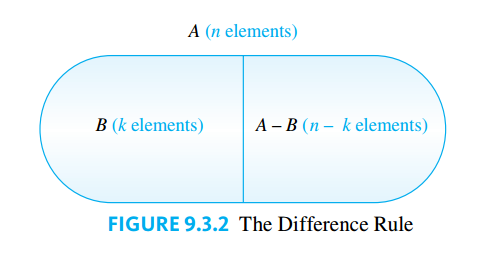
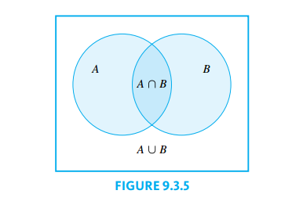
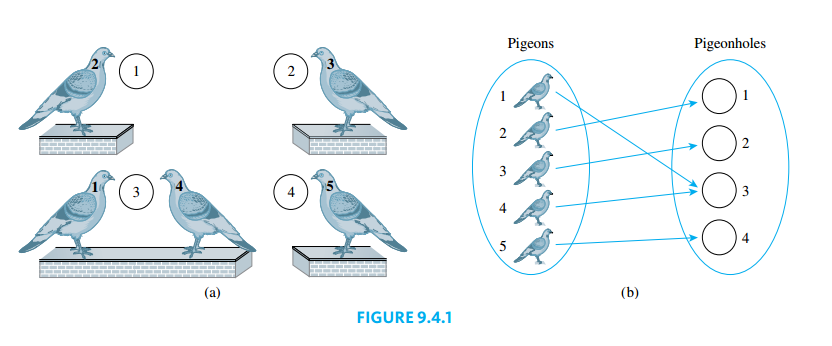
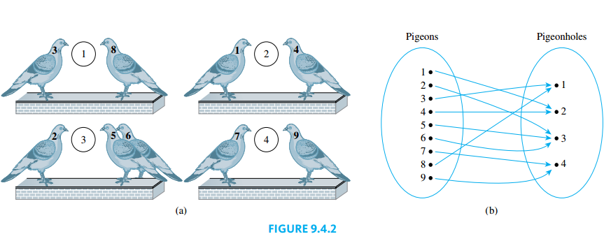
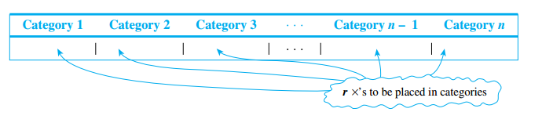
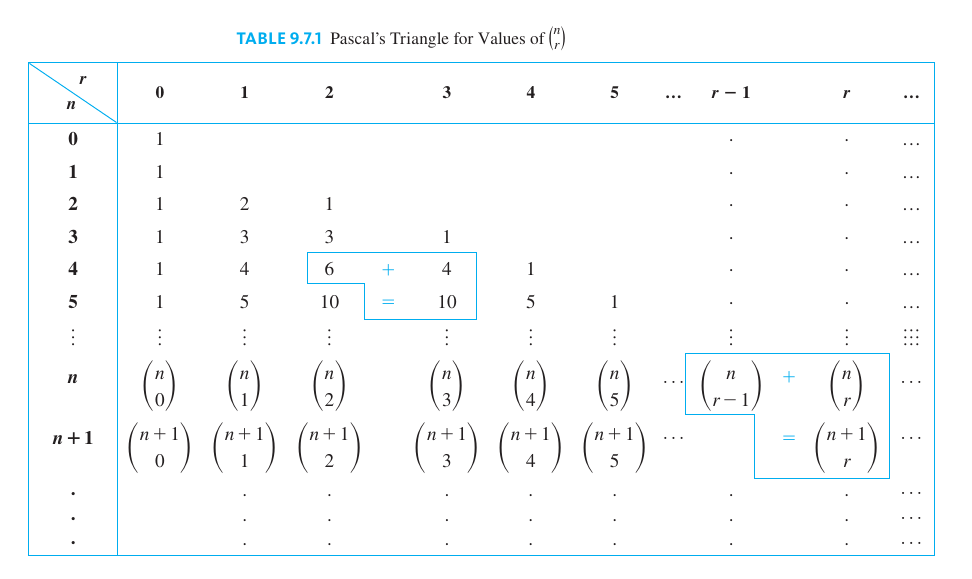
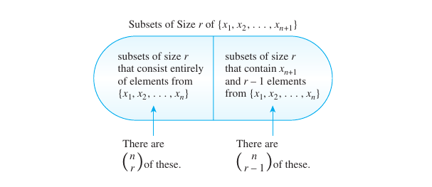

## Introduction to Probability

> [!TIP] **Random Process**
>
> To say that a process is **random** means that when it takes place, one outcome from some set of outcomes is sure to occur, but it is impossible to predict with certainty which outcome that will be.

> [!NOTE] **Sample Space**
>
> A **sample space** is the set of all possible outcomes of a random process or experiment. An **event** is a subset of a sample space.

In the case where an experiment has finitely many outcomes and all outcomes are equally likely to occur, the probability of an event (set of outcomes) is just the ratio of the number of outcomes in the event to the total number of outcomes.

> [!TIP] **Equally Likely Probability Formula**
>
> If $S$ is a finite sample space in which all outcomes are equally likely and $E$ is an event in $S$, then the **probability of $E$**, denoted $P(E)$, is
>
> $$P(E) = \frac{\text{ the number of outcomes in } E}{\text{the total number of outcomes in } S}$$

### Counting the Elements of a List

> [!NOTE] **The Number of Elements in a List**
>
> If $m$ and $n$ are integers and $m \leq n$, then there are $n - m + 1$ integers from $m$ to $n$ inclusive.

## Possibility Trees and the Multiplication Rule

### Multiplication Rule

> [!NOTE] **Multiplication Rule**
>
> If an operation consists of $k$ steps and
>
> - The first step can be performed in $n_1$ ways.
> - The second step can be performed in $n_2$ ways, regardless of how the first step was performed.
>
>   $\vdots$
>
> - The $k$th step can be performed in $n_k$ ways, regardless of how the previous steps was performed.
>
> Then the entire operation can be performed in $n_1 \cdot n_2 \cdots n_k$ ways.

### When the Multiplication Rule Is Difficult or Impossible to Apply

Consider the following problem:

> Three officers—a president, a treasurer, and a secretary—are to be chosen from among four people: Ann, Bob, Cyd, and Dan. Suppose that, for various reasons, Ann cannot be president and either Cyd or Dan must be secretary. How many ways can the officers be chosen?

It is natural to try to solve this problem using the multiplication rule. A person might answer as follows:

> There are three choices for president (all except Ann), three choices for treasurer (all except the one chosen as president), and two choices for secretary (Cyd or Dan). Therefore, by the multiplication rule, there are $3 \cdot 3 \cdot 2 = 18$ choices in all.

Unfortunately, this analysis is incorrect. The number of ways to choose the secretary varies depending on who is chosen for president and treasurer.

From the tree it is easy to see that there are only eight ways to choose a president, treasurer, and secretary so as to satisfy the given conditions

### Permutations

A **permutation** of a set of objects is an ordering of the objects in a row.

> [!NOTE] **Number of Permutations of a Set**
>
> For any integer $n$, with $n \geq 1$, the number of permutations of a set with $n$ elements is $n!$.

> [!NOTE] **$r$-permutation**
>
> An **$r$-permutation** of a set of $n$ elements is an ordered selection of $r$ elements taken from the set of $n$ elements.

The number of $r$-permutations of a set of $n$ elements is denoted $P(n, r)$.

> [!NOTE] **Number of $r$-permutations**
>
> If $n$ and $r$ are integers $1 \leq r \leq n$, then the number of $r$-permutations of a set of $n$ elements is given by the formula
>
> $$P(n, r) = n(n -1)(n- 2) \cdots (n - r+ 1)$$
>
> or, equivalently
>
> $$P(n, r) = \frac{n!}{(n - r)!}$$

Alternative notations for the number of $r$-permutations are $P(n, r), P_{n ,r}$.

The idea of the proof is the following. Suppose a set of $n$ elements is given. Formulation of an $r$-permutation can be thought of as an $r$-step process:

1. Choose the element to be first. Since the set has $n$ elements, there are $n$ ways to perform step 1.
2. Choose the element to be second. Since the element selected on step 1 is no longer available, there are $n - 1$ ways to perform step 2.

This process is repeated $r$ times, as shown below.

Step $r$ is to choose the element to be $r$th. At the point just before step $r$ is performed, $r - 1$ elements have already been chosen, and so there are

$$
n - (r - 1) n - r + 1
$$

left to choose from, hence there are $n - r + 1$ ways to perform step $r$. It follows by the multiplication rule that the number of ways to form an $r$-permutation is

$$
P(n, r) = n (n - 1)(n - 2) \cdots (n - r + 1)
$$

Note that

$$
\frac{n!}{(n - r)!} = \frac{n (n - 1)(n - 2) \cdots (n - r + 1) (n - r) (n - r - 1)\cdots 3 \cdot 2 \cdot 1}{(n - r)(n - r - 1) \cdots 3 \cdot 2 \cdot 1} \\ = n (n - 1)(n - 2) \cdots (n - r + 1)
$$

Thus

$$
P(n, r) = \frac{n!}{(n - r)!}
$$

## Counting Elements of Disjoint Sets: The Addition Rule

In this section we look at counting problems that can be solved by counting the number of elements in the union of two sets, the difference of two sets, or the intersection of two sets. The basic rule underlying the calculation of the number of elements in a union or difference or intersection is the addition rule.

> [!NOTE] **The Addition Rule**
>
> Suppose a finite set $A$ equals the union of $k$ distinct mutually disjoint subsets $A_1, A_2, \cdots, A_k$. Then
>
> $$N(A) = N(A_1) + N(A_2) + \cdots + N(A_k)$$

> [!NOTE] **The Difference Rule**
>
> If $A$ is a finite set and $B$ is a subset of $A$, then
>
> $$N(A - B) = N(A) - N(B)$$

> [!TIP] **Probability of the Complement of an Event**
>
> If $S$ is a finite sample space and $A$ is an event in $S$, thenA
>
> $$P(A^C) = 1 - P(A)$$
>
> where $A^C = S - A$, the complement of $A$ in $S$.

### The Inclusion/Exclusion Rule

Now consider the question of how to determine the number of elements in a union of sets when some of the sets overlap.

The simplest way to derive a formula for $N(A \cup B)$ is to reason as follows: The number $N(A)$ counts the elements that are in $A$ And not in $B$ as well as the elements that are in both $A$ and $B$. Similarly, the number $N(B)$ countes the elements that are in $B$ and not in $A$, as well as the elements that are both in $A$ and $B$. Hnece the elements that are in both $A$ And $B$ are counted twice.

> [!NOTE] **The Inclusion/Exclusion Rule for Two or Three Sets**
>
> If $A$, $B$ and $C$ are finite sets, then
>
> $$N(A \cup B) = N(A) + N(B) - N(A \cap B)$$
>
> and
>
> $$N(A \cup B \cup C) = N(A) + N(B) + N(C) - N(A \cap B) - N(A \cap C) - N(B \cap C) + N(A \cap B \cap C)$$

## The Pigeonhole Principle

The pigeonhole principle is sometimes called the **Dirichlet box principle** because it was first state formally by [J. P. G. L. Dirichlet](https://es.wikipedia.org/wiki/Peter_Gustav_Lejeune_Dirichlet).

> [!NOTE] **Pigeonhole Principle**
>
> A function from one finite set to a smaller finite set cannot be one-to-one: There must be at least two elements in the domain that have the same image in the co-domain.

The following illustration suggests the visual way to preent the principle.

Thus an arrow diagram for a function from a finite set to a smaller finite set must have at least two arrows from the domain that point to the same element of the co-domain.

**Proof**. Suppose $f$ is any function from a finite set $X$ with $n$ elements to a finite set $Y$ with $m$ elements where $n > m$. Denote the elements of $Y$ by $y_1, y_2, \cdots, y_m$. Recall that for each $y_i$ in $Y$, the inverse image set $f^{-1}(y_i) = \{x \in X | f(x) = y_i\}$ . Now consider the collection of all the inverse image sets for all the elements of $Y$:

$$
f^{-1}(y_1), f^{-1}(y_2), \cdots, f^{-1}(y_m)
$$

By definition of function, each element of $X$ is sent by $f$ to some element of $Y$. Hence each element of $X$ is in one of the inverse image sets, and so the union of all theset equals $X$. But also, by definition of function, no element of $X$ is sent by $f$ to more than one element of $Y$. Thus each element of $X$ is in only one of the inverse image sets, and so the inverse image sets are mutually disjoint. By the addition rule, therefore

$$
N(X) = N(f^{-1}(y_1)) + N(f^{-1}(y_2)) + \cdots + N(f^{-1}(y_m))
$$

Now suppose that $f$ is one-to-one. Then each set $f^{-1}(y_i)$ ahs at most one element, and so:

$$
N(f^{-1}(y_1)) + N(f^{-1}(y_2)) + \cdots + N(f^{-1}(y_m)) = 1 + 1 + \cdots + 1 = m
$$

Puttins the last two equations together gives that

$$
n = N(X) \leq m = N(Y)
$$

This contradicts the fact that $n > m$, and so the supposition that $f$ is one-to-one must be false. Hence $f$ is not one-to-one.

> [!NOTE] **Generizalized Pigeonhole Principle**
>
> For any function $f$, from a finite set $X$ with $n$ elements to a finite set $Y$ with $m$ elements and for any positive integer $k$, if $km < n$, then there is some $y \in Y$ such that $y$ is the image of at least $k + 1$ distinct elements of $X$.

> [!TIP] **Generizalized Pigeonhole Principle (Contrapositive Form)**
>
> For any function $f$ from a finite set $X$ with $n$ elements to a finite set $Y$ with $m$ elements and for any positive integer $k$, if for each $y \in Y$, $f^{-1}(y)$ has at most $k$ elements, then $X$ has at most $km$ elements; in other words, $n \leq km$.

> [!NOTE] **One-to-One and Onto for Finite Sets**
>
> Let $X$ and $Y$ be finite sets with the same number of elements and suppose $f$ is a function from $X$ to $Y$. Then $f$ is one-to-one if, and only if, $f$ is onto.

**Proof**. Suppose $f$ is a function from $X$ to $Y$, where $X$ and $Y$ are finite sets each with $m$ elements. Let $X = \\{x_1, x_2, \cdots, x_m\\}$ and $Y = \\{y_1, y_2, \cdots, y_m\\}$.

Let us prove that **if $f$ is one-to-one, then $f$ is onto**. Suppose $f$ is one-to-one. Then $f(x_1), f(x_2) \cdots, f(x_m)$ are all distinct. Consider the set $S$ of all elements of $Y$ that are not the image of any element of $X$. Then the sets

$$
\{f(x_1)\}, \{f(x_2)\}, \cdots, \{f(x_m)\} \text{ and } S
$$

are mutually disjoint. By the addition rule,

$$
N(Y) =N(\{f(x_1)\}) + N(\{f(x_2)\}) + \cdots, N(\{f(x_m)\}) + N(S)
$$

$$
= 1 + 1 + \cdots + 1 + N(S)
$$

$$
= m + N(S)
$$

Thus, given $N(Y) = m$

$$
N(Y) = m = m + N(S)
$$

and so

$$
N(S) = 0
$$

Hence $S$ is empty, and so there is no element of $Y$ that is not the image of some element of $X$. Consequently, $f$ is onto.

Let us prove that **if $f$ is onto, then $f$ is one-to-one**. Suppose $f$ is onto. Then, for each $i = 1, 2, \cdots, m$ $f^{-1}(y_i) \neq \emptyset$ and so $N(f^{-1}(y_i)) \geq 1$. As in the proof of the pigeonhole principle, $X$ is the union of the mutually disjoint sets $f^{-1}(y_1), f^{-1}(y_2), \cdots, f^{-1}(y_m)$. These sets are mutually disjoint by the definition of a function, no element on the domain of $f$ has two different images, thus it cannot be the pre-image of two different $y_i$, $y_j$.

By the addition principle, because each $N(f^{-1})(y_i) \geq 1$,

$$
N(X) = N(f^{-1}(y_1)) + N(f^{-1}(y_2)) + \cdots + N(f^{-1}(y_m)) =\geq m
$$

Now, if any of the sets $f^{-1}(y_i)$ has more than one element, then the sum of the $m$ terms is greater than $m$. But we know this is not the case because $N(X) = m$. Hence each set $f^{-1}(y_i)$ has exactly one element, and thus $f$ is one-to-one.

Thus a one-to-one function from a finite set to itself is onto, and an onto function from a finite set to itself is one-to-one.

## Counting Subsets of a Set: Combinations

> [!NOTE] **$r$-combination**
>
> Let $n$ and $r$ be nonnegative integers with $r \leq n$. An **$r$-combination** of a set of $n$ elements is a subset of $r$ of the $n$ elements.

> [!TIP] **$\binom{n}{r}$ Notation**
>
> The symbol $\binom{n}{r}$, read "$n$ choose $r$", denotes the number of subsets of size $r$ (or $r$-combinations) taht can be formed from a set of $n$ elements.

There are two distinct methods that can be used to select $r$ objects from a set of $n$ elements. In an **ordered selection**, it is not only what elements are chosen but also the order in which they are chosen that matters. An ordered selection of $r$ elements from a set of $n$ elements is an **$r$-permutation** of the set.

In an **unordered selection**, on the other hand, it is only the identity of the chosen elements that matters. This is called an **$r$-combination**.

The following reasoning can be used to **define the expresion for the computation of the number of $r$-combinations** on a set of $n$ elements.

1. Choose a subset of $r$ of the $n$ elements. There are $\binom{n}{r}$ ways to perform this step.
2. Choose and ordering of the $r$ elements. There are $r!$ ways to perform this step.

Thus the number of $r$-permutations is

$$
P(n, r) = \binom{n}{r} \cdot r!
$$

We solve for $\binom{n}{r}$

$$
\binom{n}{r} = \frac{P(n, r)}{r!}
$$

Given that $P(n, r) = \frac{n!}{(n - r)!}$

$$
\binom{n}{r} = \frac{n!}{(n - r)! \cdot r!}
$$

> [!TIP] **Permutations with Sets of Indistinguishable Objects**
>
> Suppose a collection consists of $n$ objects of which:
>
> - $n_1$ are of type $1$ and are indistinguishable from each other
> - $n_2$ are of type $2$ and are indistinguishable from each other
>
> $$\vdots$$
>
> - $n_k$ are of type $k$ and are indistinguishable from ech other
>
> and suppose that $n_1 + n_2 + \cdots + n_k = n$. Then the number of distinguishable permutations of the $n$ objects is
>
> $$\binom{n}{n_1} \binom{n - n_1}{n_2} \binom{n - n_1 - n_2}{n_3} \cdots \binom{n - n_1 - n_2 - \cdots n_{k - 1}}{n_k}$$
>
> $$ = \frac{n!}{n_1!n_2!n_3! \cdots n_k!}$$

## $r$-Combinations with Repetitions Allowed

In this section we ask: How many ways are there to choose $r$ elements without regard to order from a set of $n$ elements if repetition is allowed?

> [!TIP] **Notation for an $r$-combination with repetition allowed**
>
> An $r$-combination with repetition allowed, or multiset of size $r$, chosen from a set $X$ of $n$ elements is an unordered selection of elements taken from $X$ with repetition allowed.
>
> If $X = \\{x_1, x_2, \cdots, x_n\\}$, we write an $r$-combination with repetition allowed, or multiset of size $r$, as $[x_{i_1}, x_{i_2}, \cdots, x_{i_r}]$ where each $x_{i_j}$ is in $X$ and some of the $x_{i_j}$ my equal each other.

To count the number of rcombinations with repetition allowed, or multisets of size $r$, that can be selected from a set of $n$ elements, think of the elements of the set as categories. Then each $r$-combination with repetition allowed can be represented as a string of $n - 1$ vertical bars (to separate the $n$ categories) and $r$ crosses (to represent the $r$ elements to be chosen). The number of X's in each category represents the number of times the element represented by that category is repeated.

The number of strings of $n - 1$ vertical bars and $r$ crosses is the number of ways to choose $r$ positions, into which to place the $r$ crosses, out of a total of $r + (n - 1)$ positions, leaving the remaining positions for the vertical bars. Thus the number of $r$-combinations with repetition allowed on a set of $n$ elements is given by

$$
\binom{r + n - 1}{r}
$$

## Pascal's Formula and the Binomial Theorem

### Pascal's Formula

Pascal's formula, named after the seventeenth centry French mathematician and philosopher [Blaise Pascal](https://en.wikipedia.org/wiki/Blaise_Pascal) is one of the most famouse and useful in combinatorics. It relates the values of $\binom{r + 1}{r}$ to the values of $\binom{n}{r - 1}$ and $\binom{n}{r}$. Specifically, it says that:

$$
\binom{n + 1}{r} = \binom{n}{r - 1} + \binom{n}{r}
$$

Pascal's triangle is a geometric version of Pascal's formula (illustrated on the following image). Sometimes it is simply called the arithmetic triangle because it was used centuries before Pascal by Chinese and Persian mathematicians.

Pascal's formula translates into the fact that the entry in row $n + 1$, column $r$ equals the sum of th entry in row $n$, column $r - 1$ plus the entry in row $n$, column $r$.

> [!NOTE] **Pascal's Formula**
>
> Let $n$ and $r$ be positive integers with $r \leq n$. Then
>
> $$\binom{n + 1}{r} = \binom{n}{r - 1} + \binom{n}{r}$$

**Proof (algebraic version)**. Let $n$ and $r$ be positive integers with $r \leq n$. By the definition of a [$r$-combination](#counting-subsets-of-a-set-combinations):

$$
\binom{n}{r - 1} + \binom{n}{r} = \frac{n!}{(r - 1)!(n - (r - 1))!} + \frac{n!}{r!(n - r)!}
$$

$$
= \frac{n!}{(r - 1)!(n - r + 1)!} + \frac{n!}{r!(n - r)!}
$$

To add these fractions, acommon denominator is needed, so we multiply by $\frac{r}{r}$ and $\frac{n - r + 1}{n - r + 1}$

$$
= \frac{n!}{(r - 1)!(n - r + 1)!} \frac{r}{r} + \frac{n!}{r!(n - r)!} \frac{n - r + 1}{n - r + 1}
$$

By the recursive defintion of factorial $r! = r (r - 1)!$. This also applies for $(n - r + 1)!  = (n - r + 1) (n - r)!$:

$$
= \frac{n!r}{r!(n - r + 1)!} + \frac{n! (n - r + 1)}{r!(n - r + 1)!}
$$

We now add both expressions:

$$
= \frac{n!r + n!(n - r + 1)}{r!(n - r + 1)!}
$$

Let's extract the common factor $n!$ on the numerator:

$$
= \frac{n! (r + n - r + 1)}{r!(n - r + 1)!}
$$

$$
= \frac{n! (n + 1)}{r!(n - r + 1)!}
$$

By the definition of $n + 1$ factorial:

$$
= \frac{(n + 1)!}{r!(n - r + 1)!} = \binom{n + 1}{r}
$$

**Proof (combinatorial version)**. Let $n$ and $r$ be positive integers with $r \leq n$. Suppose $S$ is a set with $n + 1$ elements. The number of subsets of $S$ of size $r$ can be calculated by thinking of $S$ as consisting of two pieces: one with $n$ elements $\\{x_1, x_2, \cdots, x_n\\}$ and the other with one element $x_{n + 1}$.

Any subset of $S$ with $r$ elements either contains $x_{n + 1}$ or it does not. If it contains $x_{r + 1}$ the it contains $r - 1$ elements from the set $\\{x_1, x_2, \cdots, x_n\\}$. If it does not contain $x_{n + 1}$, the it contains $r$ elements from the set $\\{x_1, x_2, \cdots, x_n\\}$.

By the addition rule

$$
\begin{bmatrix}
\text{the number of subsets of } \\
\{x_1, x_2, \cdots, x_n, x_{n + 1}\} \\
\text{of size } r
\end{bmatrix} = \\[12pt]
\begin{bmatrix}
\text{the number of subsets of } \\
\{x_1, x_2, \cdots, x_n\} \\
\text{of size } r - 1
\end{bmatrix} +
\begin{bmatrix}
\text{the number of subsets of } \\
\{x_1, x_2, \cdots, x_n\} \\
\text{of size } r
\end{bmatrix}
$$

By the definition of a [$r$-combination](#counting-subsets-of-a-set-combinations), the set $\\{x_1, x_2, \cdots, x_n, x_{n + 1}\\}$ has $\binom{n + 1}{r}$ subsets of size $r$, the set $\\{x_1, x_2, \cdots, x_n\\}$ has $\binom{n}{r - 1}$ subsets of size $r - 1$, and the set $\\{x_1, x_2, \cdots, x_n\\}$ has $\binom{n}{r}$ subsets of size $r$. Thus

$$
\binom{n + 1}{r} = \binom{n}{r - 1} + \binom{n}{r}
$$

### The Binomial Theorem

In algebra a sum of two terms, such as $a + b$, is called a **binomial**. The **binomial theorem** gives an expression for the powers of a binomial $(a + b)^n$ for each nonnegative integer $n$ and all real numbers $a$ and $b$.

> [!NOTE] **The Binomial Theorem**
>
> Given any real numbers $a$ and $b$ and any nonengative integers $r$
>
> $$(a + b)^n = \sum_{k = 0}^n \binom{n}{k} a^{n - k} b^k$$
>
> $$ = a^n + \binom{n}{1} a^{n - 1} b + \binom{n}{2} a^{n - 2} b^2 + \cdots + \binom{n}{n - 1} a^{1} b^{n - 1} + b^n$$

> [!TIP] **Binomial Coefficient**
>
> If $n$ and $r$ are nonnegative integers and $r \leq n$, then $\binom{n}{r}$ is called a **binomial coefficient** because it is one of the coefficients in the expansion of the binomial expression $(a + b)^n$.

The proof for the binomial theorem requires a precise definition of integer power.

> [!TIP] **Integer Power**
>
> For any real number $a$ and any nonnegative integer $n$, the **nonnegative integer powers of $a$** are defined as follows
>
> $$a^{n} = \begin{cases}1 & \text{ if } n = 0 \\ a \cdot a^{n - 1} \text{ if } n > 0\end{cases}$$

**Proof of the Binomial Theorem (algebraic version)**. Suppose $a$ and $b$ are real numbers . We use mathematical induction and let the property $P(n)$ be the equation

$$
(a + b)^n = \sum_{k = 0}^n \binom{n}{k} a^{n - k}b^{k}
$$

We first show that $P(0)$ is true. When $n = 0$, the binomial theorem states that

$$
(a + b)^0 = \binom{0}{0} a^{0}b^{0} = \frac{0!}{0! (0 - 0)!} \cdot 1 \cdot 1 = \frac{1}{1 \cdot 1} = 1
$$

Hence $P(0)$ is true.

Now we'll show that for each integer $m \geq 0$, if $P(m)$ is true then $P(m + 1)$ is true. Let $m$ be any integer with $m \geq 0$, and suppose $P(m)$ is true. That is, suppose

$$
(a + b)^m = \sum_{k = 0}^m \binom{m}{k} a^{m - k}b^k
$$

We need to show that $P(m + 1)$ is true:

$$
(a + b)^{m + 1} = \sum_{k = 0}^{m + 1} \binom{m + 1}{k} a^{m + 1 - k}b^k
$$

By definition of the $(m + 1)$st power:

$$
(a + b)^{m + 1} = (a + b)(a + b)^{m}
$$

So by substitution:

$$
(a + b)^{m + 1} = (a + b) \sum_{k = 0}^m \binom{m}{k} a^{m - k}b^k
$$

$$
= a \sum_{k = 0}^m \binom{m}{k} a^{m - k}b^k + b \sum_{k = 0}^m \binom{m}{k} a^{m - k}b^k
$$

$$
= \sum_{k = 0}^m \binom{m}{k} a^{m - k + 1}b^k + \sum_{k = 0}^m \binom{m}{k} a^{m - k}b^{k + 1}
$$

We transform the second summation on the right-hand side, by making the change of variable $j = k + 1$. When $k = 0$, then $j = 1$. When $k = m$, then $j = m + 1$. And sice $k = j -1$ the general term is:

$$
= \binom{m}{k} a^{m - k}b^{k + 1} = \binom{m}{j - 1} a^{m - (j - 1)} b^j = \binom{m}{j - 1} a^{m + 1 - j}b^j
$$

Hence the second summation on the right-hand side above is

$$
\sum_{j = 1}^{m + 1}  \binom{m}{j - 1} a^{m + 1 - j}b^j
$$

Substituting back we get

$$
= \sum_{k = 0}^m \binom{m}{k} a^{m - k + 1}b^k + \sum_{k = 1}^{m + 1}  \binom{m}{k - 1} a^{m - k + 1}b^k
$$

Thus

$$
(a + b)^{m + 1} = \binom{m}{0} a^{m + 1- 0}b^{0} + \\[10pt]
\left[\sum_{k = 1}^m \binom{m}{k} a^{m - k + 1}b^k + \sum_{k = 1}^{m}  \binom{m}{k - 1} a^{m - k + 1}b^k\right] + \\[10pt]
\binom{m}{(m + 1) - 1}a^{m + 1 -(m + 1)}b^{m + 1}
$$

We simplify some of the expressions:

$$
(a + b)^{m + 1} = a^{m + 1} + \\[10pt]
\left[\sum_{k = 1}^m \binom{m}{k} a^{m - k + 1}b^k + \sum_{k = 1}^{m}  \binom{m}{k - 1} a^{m - k + 1}b^k\right] + \\[10pt]
\binom{m}{m}b^{m + 1}
$$

Taking $a^{m - k + 1}b^k$ as a common factor on the sum:

$$
(a + b)^{m + 1} = a^{m + 1} + \\[10pt]
\left[\sum_{k = 1}^m \left[\binom{m}{k} + \binom{m}{k - 1}\right] a^{m - k + 1}b^k\right] + \\[10pt]
b^{m + 1}
$$

By Pascal's formula:

$$
\binom{m + 1}{k} = \binom{m}{k} + \binom{m}{k - 1}
$$

Hence

$$
(a + b)^{m + 1} = a^{m + 1} + \\[10pt]
\left[\sum_{k = 1}^m \binom{m + 1}{k} a^{m - k + 1}b^k\right] + b^{m + 1}
$$

$$
= \sum_{k = 0}^{m + 1} \binom{m + 1}{k} a^{(m + 1) - k}b^{k}
$$

This is what as to be shown.

**Proof of The Binomial Theorem (combinatorial version)**. Let $a$ and $b$ be real numbers and $n$ an integer that is at least $1$. The expression $(a + b)^n$ can be expanded into products of $n$ letters, where each letter is either $a$ or $b$. For each $k = 0, 1, \cdots, n$, the product:

$$
a^{n - k}b^{k} = a \cdot a \cdot a \cdots b \cdot b \cdot b \cdots b
$$

occcurs as a term in the sum the number of times as there are ordering of $(n - k)$ $a$'s and $k$ $b$'s. But this number equals $\binom{n}{k}$, the number of ways to choose $k$ positions in which to place the $b$'s (the other $n - k$ positions will be filled by $a$'s). Hnece, when like terms are combined, the coefficient of $a^{n - k}b^{k}$ in the sum is $\binom{n}{k}$. Thus

$$
(a + b)^{n} = \sum_{k = 0}^n \binom{n}{k} a^{n - k}b^{k}
$$

as was to be shown.
