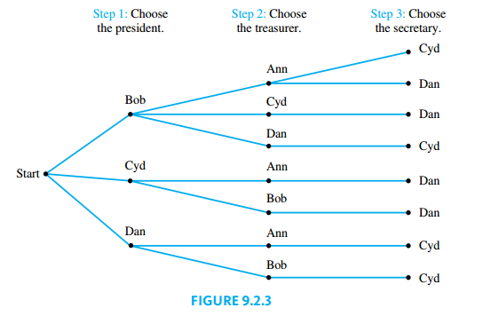
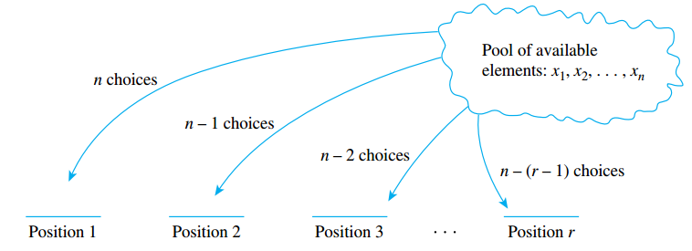

## Introduction to Probability

> [!TIP] **Random Process**
>
> To say that a process is **random** means that when it takes place, one outcome from some set of outcomes is sure to occur, but it is impossible to predict with certainty which outcome that will be.

> [!NOTE] **Sample Space**
>
> A **sample space** is the set of all possible outcomes of a random process or experiment. An **event** is a subset of a sample space.

In the case where an experiment has finitely many outcomes and all outcomes are equally likely to occur, the probability of an event (set of outcomes) is just the ratio of the number of outcomes in the event to the total number of outcomes.

> [!TIP] **Equally Likely Probability Formula**
>
> If $S$ is a finite sample space in which all outcomes are equally likely and $E$ is an event in $S$, then the **probability of $E$**, denoted $P(E)$, is
>
> $$P(E) = \frac{\text{ the number of outcomes in } E}{\text{the total number of outcomes in } S}$$

### Counting the Elements of a List

> [!NOTE] **The Number of Elements in a List**
>
> If $m$ and $n$ are integers and $m \leq n$, then there are $n - m + 1$ integers from $m$ to $n$ inclusive.

## Possibility Trees and the Multiplication Rule

### Multiplication Rule

> [!NOTE] **Multiplication Rule**
>
> If an operation consists of $k$ steps and
>
> - The first step can be performed in $n_1$ ways.
> - The second step can be performed in $n_2$ ways, regardless of how the first step was performed.
>
>   $\vdots$
>
> - The $k$th step can be performed in $n_k$ ways, regardless of how the previous steps was performed.
>
> Then the entire operation can be performed in $n_1 \cdot n_2 \cdots n_k$ ways.

### When the Multiplication Rule Is Difficult or Impossible to Apply

Consider the following problem:

> Three officers—a president, a treasurer, and a secretary—are to be chosen from among four people: Ann, Bob, Cyd, and Dan. Suppose that, for various reasons, Ann cannot be president and either Cyd or Dan must be secretary. How many ways can the officers be chosen?

It is natural to try to solve this problem using the multiplication rule. A person might answer as follows:

> There are three choices for president (all except Ann), three choices for treasurer (all except the one chosen as president), and two choices for secretary (Cyd or Dan). Therefore, by the multiplication rule, there are $3 \cdot 3 \cdot 2 = 18$ choices in all.

Unfortunately, this analysis is incorrect. The number of ways to choose the secretary varies depending on who is chosen for president and treasurer.

From the tree it is easy to see that there are only eight ways to choose a president, treasurer, and secretary so as to satisfy the given conditions

### Permutations

A **permutation** of a set of objects is an ordering of the objects in a row.

> [!NOTE] **Number of Permutations of a Set**
>
> For any integer $n$, with $n \geq 1$, the number of permutations of a set with $n$ elements is $n!$.

> [!NOTE] **$r$-permutation**
>
> An **$r$-permutation** of a set of $n$ elements is an ordered selection of $r$ elements taken from the set of $n$ elements.

The number of $r$-permutations of a set of $n$ elements is denoted $P(n, r)$.

> [!NOTE] **Number of $r$-permutations**
>
> If $n$ and $r$ are integers $1 \leq r \leq n$, then the number of $r$-permutations of a set of $n$ elements is given by the formula
>
> $$P(n, r) = n(n -1)(n- 2) \cdots (n - r+ 1)$$
>
> or, equivalently
>
> $$P(n, r) = \frac{n!}{(n - r)!}$$

Alternative notations for the number of $r$-permutations are $P(n, r), P_{n ,r}$.

The idea of the proof is the following. Suppose a set of $n$ elements is given. Formulation of an $r$-permutation can be thought of as an $r$-step process:

1. Choose the element to be first. Since the set has $n$ elements, there are $n$ ways to perform step 1.
2. Choose the element to be second. Since the element selected on step 1 is no longer available, there are $n - 1$ ways to perform step 2.

This process is repeated $r$ times, as shown below.

Step $r$ is to choose the element to be $r$th. At the point just before step $r$ is performed, $r - 1$ elements have already been chosen, and so there are

$$
n - (r - 1) n - r + 1
$$

left to choose from, hence there are $n - r + 1$ ways to perform step $r$. It follows by the multiplication rule that the number of ways to form an $r$-permutation is

$$
P(n, r) = n (n - 1)(n - 2) \cdots (n - r + 1)
$$

Note that

$$
\frac{n!}{(n - r)!} = \frac{n (n - 1)(n - 2) \cdots (n - r + 1) (n - r) (n - r - 1)\cdots 3 \cdot 2 \cdot 1}{(n - r)(n - r - 1) \cdots 3 \cdot 2 \cdot 1} \\ = n (n - 1)(n - 2) \cdots (n - r + 1)
$$

Thus

$$
P(n, r) = \frac{n!}{(n - r)!}
$$
