## Trails, Paths and Circuits

The subject of graph theory began in the year 1736 when the great mathematician [Leonhard Euler](https://wikipedia.org/wiki/Leonhard_Euler) published a paper giving the solution to the following puzzle:

> The town of Königsberg in Prussia was built at a point where two branches of the Pregel River came together. It consisted of an island and some land along the river banks. These were connected by seven bridges as shown in the following Figure.
>
> 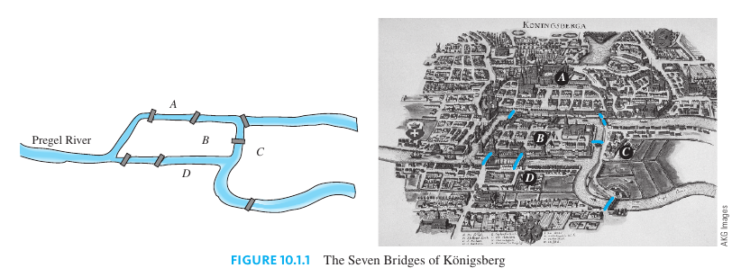
>
> The question is this: Is it possible for a person to take a walk around town, starting and ending at the same location and crossing each of the seven bridges exactly once?

To solve this puzzle, Euler translated it into a graph theory problem. He noticed that all points of a given land mass can be identified with each other since a person can travel from any one point to any other point of the same land mass without crossing a bridge. Thus for the purpose of solving the puzzle, the map of Königsberg can be identified with the graph shown in the next Figure, in which the vertices $A$, $B$, $C$, and $D$ represent land masses and the seven edges represent the seven bridges.

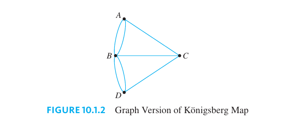

In terms of this graph, the question becomes the following:

> Is it possible to find a route through the graph that starts and ends at some vertex, one of $A$, $B$, $C$, or $D$, and traverses each edge exactly once?

Equivalently:

> Is it possible to trace this entire graph, starting and ending at the same point, without either ever lifting your pencil from the paper or crossing an edge more than once?

If it is possible to find a route that uses all the edges of the graph and starts and ends at $A$, then the total number of arrivals and departures from each vertex $B$, $C$, and $D$ must be a multiple of $2$. Or, in other words, the degrees of the vertices $B$, $C$, and $D$ must be even. But they are not: $\text{deg}(B) = 5$, $\text{deg}(C) = 3$, and $\text{deg}(D) = 3$. Hence there is no route that solves the puzzle by starting and ending at $A$.

> [!NOTE] **A Walk on a Graph**
>
> Let $G$ be a graph, and let $v$ and $w$ be vertices in $G$
>
> A **walk from $v$ to $w$** is a finite sequence of adjacent vertices and edges of $G$.
>
> The **trivial walk from $v$ to $v$** consists of the single vertex $v$.

> [!TIP] **Special Walks on a Graph**
>
> Let $G$ be a graph, and let $v$ and $w$ be vertices in $G$
>
> - A **trail from $v$ to $w$** is a walk from $v$ to $w$ that does not contain a repeated edge.
> - A **path from $v$ to $w$** is a trail that does not contain a repeated vertex.
> - A **closed walk** is a walk that starts and ends at the same vertex.
> - A **circuit** is a closed walk that contains at least one edge and does not contain a repeated edge.
> - A **simple circuit** is a circuit that does not have any other repeated vertex except the first and last.

### Subgraphs

> [!NOTE] **Subgraph**
>
> A graph $H$ is said to be a **subgraph** of a graph $G$ if, and only if, every vertex in $H$ is also a vertex in $G$, and every edge in $H$ is also an edge in $G$, and every edge in $H$ has the same endpoints as it has in $G$.

### Connectedness

Roughly speaking, a graph is connected if it is possible to travel from any vertex to any other vertex along a sequence of adjacent edges of the graph.

> [!NOTE] **Connectedness**
>
> Let $G$ be a grpah. Two **vertices $v$ and $w$ of $G$ are connected** if, and only if, there is a walk from $v$ to $w$.
>
> The **graph $G$ is connected** if, and only if, given any two vertices $v$ and $w$ in $G$, there is a walk from $v$ to $w$.

From the previous definitions, a graph $G$ is **not connected** if, and only if, there exist two vertices of $G$ that are not connected by any walk.

> [!TIP] **Facts on Connectedness and Circuits**
>
> Let $G$ be a graph.
>
> 1. If $G$ is connected, then any two distinct vertices of $G$ can be connected by a path.
> 2. If vertices $v$ and $w$ are part of a circuit in $G$, and one edge is removed from the circuit, then there still exists a trail from $v$ to $w$ in $G$.
> 3. If $G$ is connected and $G$ contains a circuit, then an edge of the circuit ca be removed without disconnecting $G$.

A **connected component** of a graph is a connected subgraph of largest possible size.

> [!NOTE] **Connected Component**
>
> A graph $H$ is a **connected component** of a graph $G$ if, and only if,
>
> 1. $H$ is a subgraph of $G$;
> 2. $H$ is connected, and
> 3. no connected subgraph of $G$ has $H$ as a subgraph and contains vertices or edges that are not in $H$.

### Euler Circuits

Now we return to consider general problems similar to the puzzle of the Königsberg bridges.

> [!NOTE] **Euler Circuit**
>
> Let $G$ be a graph. An **Euler circuit** for $G$ is a circuit that contains every vertex and every edge of $G$.
>
> It is a sequence of adjacent vertices and edges in $G$ that has at least one ede, starts and ends at the same vertex, uses every vertex of $G$ at least once, and uses every edge of $G$ exactly once.

The analysis used earlier to solve the puzzle of the Königsberg bridges generalizes to prove the following theorem:

> [!NOTE] **Existence of an Euler Circuit on a Graph**
>
> If a graph has an Euler circuit, then every vertex of the graph has positive even degree.

**Proof**. Suppose $G$ is a graph that has an Euler circuit. Let $v$ be any particular but arbitrarily chosen vertex of $G$. Since the Euler circuit contains every edge of $G$, it contains all edges incident on $v$.

Now imagine taking a journey that begins in the middle of one of the edges adjacent to the start of the Euler circuit and continues around the Euler circuit to end in the middle of the starting edge (see the following Figure).

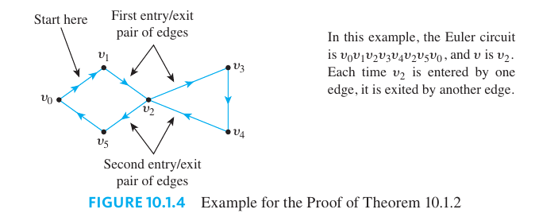

Each time $v$ is entered by traveling along one edge, it is inmmediately exited by traveling along another edge (since the journey ends in the middle of an edge).

Because the Euler circuit uses every edge of G exactly once, every edge incident on $v$ is traversed exactly once in this process. Hence the edges incident on $v$ occur in entry/exit pairs, and consequently the degree of $v$ must be a positive multiple of $2$. That means that $v$ has positive even degree as was to be shown.

The contrapositive states the following:

> [!NOTE] **Non-existence of an Euler Circuit on a Graph**
>
> If some vertex of a graph has odd degree, then the graph does not have an Euler circuit.

Now consider the converse:

> If every vertex of a graph has even degree, then the graph has an Euler circuit. Is this true? **The answer is no**.

The illustration below shows one example:

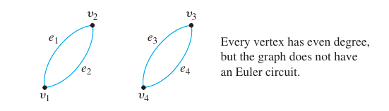

Note that the graph in the preceding drawing is not connected. It turns out that although the converse is false, a modified converse is true.

> [!NOTE] **Existence of an Euler Circuit on a Graph**
>
> If a graph $G$ is connected and the degree of every vertex of $G$ is a positive even integer, then $G$ has an Euler circuit.

**Proof**. Suppose that $G$ is any connected graph and suppose that every vertex of $G$ is a positive even integer. Construct a circuit $C$ by the following algorithm:

1. Pick any vertex $v$ of $G$ at which to start.
2. Pick any sequence of adjacent vertices and edges, starting and ending at $v$ and never repeating and edge. Call the resulting circuit $C$. This step can be performed for the following reasons: Since the degree of each vertex of $G$ is a positive even integer, as each vertex of $G$ is entered by traveling on one edge, either the vertex is $v$ itself and there is no other unused edge adjacent to $v$, or the vertex can be exited by traveling on another previously unused edge. Since the number of edges of the graph is finite (by definition of graph), the sequence of distinct edges cannot go on forever. The sequence eventually returns to $v$ because the degree of $v$ is a positive even integer, and so each time an edge leads out from $v$ to another vertex, there must be a different edge that connects back in to $v$.
3. Check whether $C$ contains every edge and vertex of $G$. If so, $C$ is an Euler circuit, and we are finished. If not, permform the following steps:
   - Remove all edges of $C$ from $G$ and also any vertices that become isolated when the edges of $C$ are removed. Call the resulting subgraph $G'$ (Note that $G'$ may not be connected, but every vertex of $G'$ has positive event degree, since removing the edges of $C$ removes an even number of edges from each vertex, the difference of two even integers is even, and isolated vertices with degree $0$ were removed).
   - Pick any vertex $w$ common to both $C$ and $G'$

     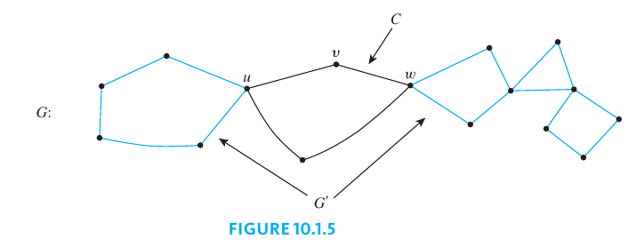

   - Pick any sequence of adjacent vertices and edges of $G'$, starting and ending at $w$ and never repeating an edge. Call the resulting circuit $C'$.
   - Patch $C$ and $C'$ together to create a new circuit $C''$ as follows
     - Start at $v$ and following $C$ all the way to $w$.
     - Then follow $C'$ all the way back to $w$.
     - Contninue along the untraveled portion of $C$ to return to $v$.

   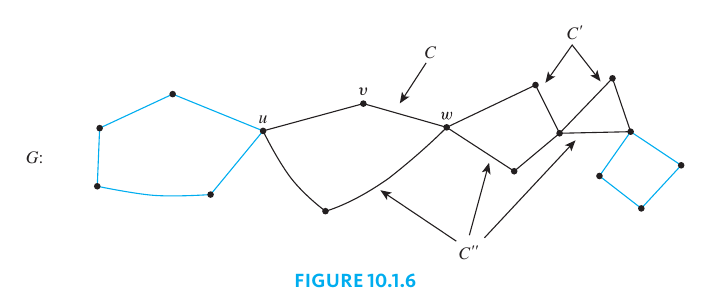
   - Let $C = C''$ and go back to step $3$

Since the graph $G$ is finite, execution of the steps outlined in this algorithm must eventually terminate. At that point an Euler circuit for $G$ will have been constructed.

> [!NOTE] **Characterization of Graphs that have Euler Circuits**
>
> A graph $G$ has an Euler circuit if, and only if, $G$ is connected and every vertex of $G$ has positive even degree.

A corollary to the previous theorem gives a criterion for determining when it is possible to find a walk from one vertex of a graph to another.

> [!NOTE] **Euler Trail**
>
> Let $G$ be a graph and let $v$ and $w$ be two distinct vertices of $G$. An **Euler trail from $v$ to $w$** is a sequence of adjacent edges and vertices that starts at $v$, ends at $w$, passes through every vertex of $G$ at least once and traverses every edge of $G$ exactly once.

> [!TIP] **Existence of an Euler Trail**
>
> Let $G$ be a graph, and let $v$ and $w$ be two distinct vertices of $G$. There is an Euler trail from $v$ to $w$ if, and only if, $G$ is connected, $v$ and $w$ have odd degree, and all other vertices of $G$ have positive even degree.

### Hamiltonian Circuits

We have answered this question: Given a graph $G$, is it possible to find a circuit for $G$ in which all the edges of $G$ appear exactly once? A related question is this: Given a graph $G$, is it possible to find a circuit for $G$ in which all the vertices of $G$ (except the first and the last) appear exactly once?

In 1859 the Irish mathematician [Sir William Rowan Hamilton](https://wikipedia.org/wiki/William_Rowan_Hamilton) introduced a puzzle in the shape of a dodecahedron. Each vertex was labeled with the name of a city—London, Paris, Hong Kong, New York, and so on. The problem Hamilton posed was to start at one city and tour the world by visiting each other city exactly once and returning to the starting city. One way to solve the puzzle is to imagine the surface of the dodecahedron stretched out and laid flat in the plane, as follows:

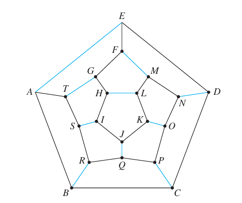

> [!NOTE] **Hamiltonian Circuit**
>
> Given a graph $G$, a **Hamiltonian circuit** for $G$ is a simple circuit that includes every vertex of $G$.
>
> That is, a Hamiltonian circuit for $G$ is a sequence of adjacent vertices and distinct edges in which every vertex of $G$ appears exactly once, except for the first and the last, which are the same.

> [!TIP] **Hamiltonian Circuit as a Subgraph**
>
> If a graph $G$ has a Hamiltonian circuit, then $G$ has a subgraph $H$ with the following properties
>
> - $H$ contains every vertex of $G$
> - $H$ is connected
> - $H$ has the same number of edges as vertices
> - Every vertex of $H$ has degree $2$

The contrapositive of the previous statement says: if a graph $G$ does not have a subgraph $H$ with properties $(1)-(4)$, then $G$ does not have a Hamiltonian circuit.

### A Traveling Salesman Problem

Imagine that the drawing below is a map showing four cities and the distances in kilometers between them. Suppose that a salesman must travel to each city exactly once, starting and ending in city $A$. Which route from city to city will minimize the total distance that must be traveled?

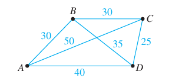

The general traveling salesman problem involves finding a Hamiltonian circuit to minimize the total distance traveled for an arbitrary graph with $n$ vertices in which each edge is marked with a distance.

One way to solve the general problem is to Write down all Hamiltonian circuits starting and ending at a particular vertex, compute the total distance for each, and pick one for which this total is minimal. However, even for medium-sized values of $n$ this method is impractical as it would take many and many years to complete.

At present, there is no known algorithm for solving the general traveling salesman problem that is more efficient. However, there are efficient algorithms that find “pretty good” solutions—that is, circuits that, while not necessarily having the least possible total distances, have smaller total distances than most other Hamiltonian circuits.

## Matrix Representation of Graphs

How can graphs be represented inside a computer? It happens that all the information needed to specify a graph can be conveyed by a structure called a matrix.

### Matrices

> [!NOTE] **Matrix**
>
> An $m \times n$ **matrix $A$ over a set $S$** is a rectangular array of elements of $S$ arranges into $m$ rows and $n$ columns:
>
> $$A = \begin{bmatrix} a_{11} & a_{12} & \cdots & a_{1n} \\ a_{21} & a_{22} & \cdots & a_{2n} \\ \vdots \\ a_{n1} & a_{n2} & \cdots & a_{nn} \end{bmatrix}$$
>
> We write $A = (a_{ij})$

If $A$ and $B$ are matrices, then $A = B$ if, and only if, $A$ and $B$ have the same size and the corresponding entries of $A$ and $B$ are all equal, that is

$$
a_{ij} = b_{ij} \text{ for every } i = 1, 2, \cdots m \text{ and } j = 1, 2, \cdots n
$$

A matrix for whitch the numbers of rows and columns are equal is called a **square matrix**.

If $A$ is a square matrix of size $n \times n$, then the **main diagonal of $A$** consists of all the entries $a_{11}, a_{22}, \cdots, a_{nn}$.

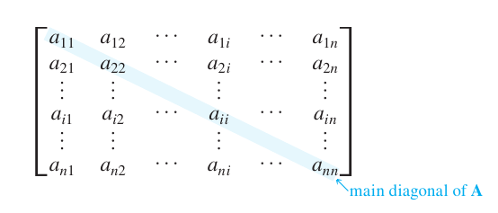

### Matrices and Directed Graphs

> [!NOTE] **Adjacent Matrix over a Directed Graph**
>
> Let $G$ be a directed graph with ordered vertices $v_1, v_2, \cdots, v_n$. The **Adjacency matrix of $G$** is the $n \times n$ matrix $A = (a_{ij})$ over the set of nonnegative integers such that
>
> $$a_{ij} = \text{ the numbero of arrows from } v_i \text{ to } v_j \forall i,j = 1, 2, \cdots n$$

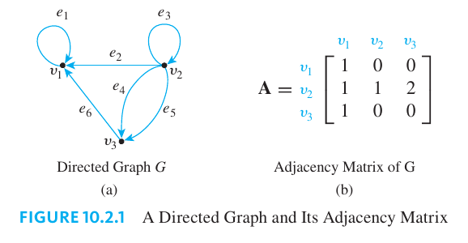

Note that nonzero entries along the main diagonal of an adjacency matrix indicate the presence of loops, and off-diagonal entries larger than 1 correspond to parallel edges.

### Matrices and Undirected Graphs

> [!NOTE] **Adjacent Matrix over an Undirected Graph**
>
> Let $G$ be an undirected graph with ordered vertices $v_1, v_2, \cdots, v_n$. The **adjacency matrix of $G$** is the $n \times n$ matrix $A = (a_{ij})$ over the set of nonnegative integers such that
>
> $$a_{ij} = \text{ the number of edges connecting } v_i \text{ and } v_j$$
>
> for every $i, j = 1, 2, \cdots n$.

> [!NOTE] **Matrix Symmetry**
>
> An $n \times n$ square matrix $A = (a_{ij})$ is called **symmetric** if, and only if, for every $i, j = 1, 2, \cdots, n$
>
> $$a_{ij} = a_{ji}$$

It is easy to see that the matrix of any undirected graph is symmetric.

### Matrices and Connected Components

Consider a graph $G$, as shown below, that consists of several connected components.

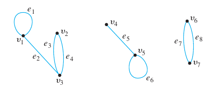

The adjacency matrix of $G$ is

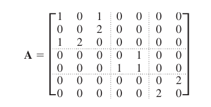

Which could also be written as:

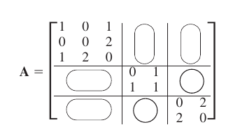

> [!NOTE] **Connected Components**
>
> Let $G$ be a graph with connected components $G_1, G_2, \cdots, G_k$. If there are $n_i$ vertices in each connected component $G_i$, and these vertices are numbered consecutively, then the adjacency matrix of $G$ has the form
>
> $$\begin{bmatrix} A_1 & O & O & \cdots & O & O \\ O & A_2 & O & \cdots & O & O \\ O & O & A_3 & \cdots & O & O \\ \vdots & \vdots & \vdots & & \vdots & \vdots \\ O & O & O & \cdots & O & A_k \end{bmatrix}$$
>
> where each $A_i$ is the $n_i \times n_i$ adjacency matrix of $G_k$ for every $i = 1, 2, cdots, k$ and the $O$'s represent matrices whose entries are all $0$.

### Matrix Multiplication

Matrix multiplication is an enormously useful operation that arises in many contexts, including the investigation of walks in graphs. Although matrix multiplication can be defined in quite abstract settings, the definition for matrices whose entries are real numbers will be sufficient for our applications.

> [!NOTE] **Scalar or Dot Product**
>
> Suppose that all entries in matrices $A$ and $B$ are real numbers. If the number of elements, $n$ in the $i$th row of $A$ equals the number of elements in the $j$th column of $B$, then the **scalar product** or **dot product** of the $i$th row of $A$ and the $j$th column of $B$ is the real number obtained as follows
>
> $$\begin{bmatrix} a_{i1} & a_{i2} & \cdots & a_{in} \end{bmatrix} \begin{bmatrix} b_{1j} \\ b_{2j} \\ \vdots \\ b_{nj}\end{bmatrix} = a_{i1}b_{1j} + a_{i2}b_{2j} + \cdots + a_{in}b_{nj}$$

More generally, if $A$ and $B$ are matrices, whose entries are real numbers and if $A$ and $B$ have **compatible sizes**, in the sense that the number of columns of $A$ equals the number of rows of $B$, then the product $AB$ is defined.

> [!NOTE] **Matrix Multiplication**
>
> Let $A = (a_{ij})$ be an $m \times k$ matrix and $B = (b_{ij})$ a $k \times n$ matrix, with real entries. The (matrix) product of $A$ times $B$, denoted $AB$, is that matrix $(c_{ij})$ defined as follows:
>
> $$\begin{bmatrix} a_{11} & a_{12} & \cdots & a_{1k} \\ \vdots \\ a_{m1} & a_{m2} & \cdots & a_{mk}\end{bmatrix} \begin{bmatrix} b_{11} & b_{12} & \cdots & b_{1n} \\ \vdots \\ b_{k1} & b_{k2} & \cdots & b_{kn}\end{bmatrix} = \\[5pt] \begin{bmatrix} c_{11} & c_{12} & \cdots & c_{1n} \\ \vdots \\ c_{m1} & c_{m2} & \cdots & c_{mn}\end{bmatrix}$$
>
> where
>
> $$c_{ij} = a_{i1}b_{1j} + \cdots + a_{ik}b_{kj} = \sum_{r = 1}^k a_{ir}b_{rj}$$
>
> for each $i = 1, 2, \cdots, m$ and $j = 1, 2, \cdots, n$.

Note that:

- Matrix multiplication is not commutative
- Matrix multiplication is associative

> [!NOTE] **Identity Matrix**
>
> For each positive integer $n$, the **$n \times n$ identity matrix**, denoted $I_n = (\delta_{ij})$, is the $n \times n$ matrix in which all the entries in the main diagonal are $1$'s and all other entires are $0$'s. In other words:
>
> $$\delta_{ij} = \begin{cases} 0 & \text{ if } i = j \\ 0 & \text{ if } i \neq j\end{cases}$$
>
> for every $i, j = 1, 2, \cdots, n$.

The German mathematician [Leopold Kronecker](https://wikipedia.org/wiki/Leopold_Kronecker) introduced the symbol $\delta_{ij}$ to make matrix computations more convenient. In his honor, this symbol is called the **Kronecker delta**.

> [!NOTE] **Power of a Matrix**
>
> For any $n \times n$ matrix $A$, the powers of $A$ are defined as follows:
>
> $$A^0 = I \text{, where } I \text{ is the } n \times n \text{ identity matrix }$$
>
> $$A^n = AA^{n - 1} \text{ for every integer } n \geq 1$$

### Counting Walks of Length $N$

A walk in a graph consists of an alternating sequence of vertices and edges. If repeated edges are counted each time they occur, then the number of edges in the sequence is called the **length of the walk**.

So, if $A$ is the adjacency matrix of a graph $G$, the $ij$-th entry of $A^2$ equals the number of walks of length $2$ connecting the $i$-th vertex to the $j$-th vertex of $G$. More generally, if $n$ is any positive integer, the $ij$-th entry of $A^n$ equals the number of walks of length $n$ connecting the $i$-th and the $j$-th vertices of $G$.

> [!NOTE] **Walks of Length $N$**
>
> If $G$ is a graph with vertices $v_1, v_2, \cdots, v_m$ and $A$ is the adjacency matrix of $G$, then for each positive integer $n$ and for all integers $i, j = 1, 2, \cdots, m$
>
> $$\text{ the } ij \text{th entry of } A^n = \text{ the number of walks of length } n \text{ from } v_i \text { to } v_j$$

**Proof** (by Mathematical Induction). Suppose $G$ is a graph with vertices $v_1, v_2, \cdots, v_m$ and $A$ is the adjacency matrix of $G$. Let $P(n)$ be the sentence:

> For all integers $i,j = 1, 2, \cdots, m$ the $ij$th entry of $A^n$ equals the number of walks of length $n$ from $v_i$ to $v_j$.

We will show that $P(n)$ is true for every integer $n \geq 1$.

**Show that $P(1)$ is true**:

The $ij$-th entry of $A^1$ is the $ij$-th entry of $A$. This equals the number of edges connecting from $v_i$ to $v_j$, which is the same as the number of walks of length $1$ from $v_i$ to $v_j$.

**Show that for every integer $k$ with $k \geq 1$, if $P(k)$ is true then $P(k + 1)$ is true**:

Let $k$ be any integer with $k \geq 1$, and suppose that

> For all integers $i,j = 1, 2, \cdots, m$ the $ij$th entry of $A^k$ equals the number of walks of length $k$ from $v_i$ to $v_j$.

We must show that

> For all integers $i,j = 1, 2, \cdots, m$ the $ij$th entry of $A^{k + 1}$ equals the number of walks of length $k + 1$ from $v_i$ to $v_j$.

Let $A = (a_{ij})$, and $A^k = (b_{ij})$. Since $A^{k + 1} = AA^k$, the $ij$th entry of $A^{k + 1}$, $c_{ij}$, is obtained by multiplying the $i$th row of $A$ by the $j$th column of $A^{k}$:

$$
c_{ij} = a_{i1}b_{1j} + \cdots + a_{im}b_{mj}
$$

for every $i, j = 1, 2, \cdots, m$. Now consider the individual terms of this sum: $a_i1$ is the number of edges from $v_i$ to $v_1$, and by the inductive hypothesis $b_{1j}$ is the number of walks of length $k$ from $v_1$ to $v_j$.

Any edge from $v_i$ to $v_1$ can be joined with any walk of length $k$ to create a walk of length $k + 1$ from $v_i$ to $v_j$, with $v_1$ as its second vertex. Thus, by the multiplication rule:

$$
a_{i1}b_{1j} = \begin{bmatrix} \text{ the number of walks of length } k + 1 \text{ from } \\ v_i \text{ to } v_j \text{ that have } v_1 \text{ as their second vertex} \end{bmatrix}
$$

More generally, for each integer $r = 1, 2, \cdots, m$

$$
a_{ir}b_{1r} = \begin{bmatrix} \text{ the number of walks of length } k + 1 \text{ from } \\ v_i \text{ to } v_j \text{ that have } v_r \text{ as their second vertex} \end{bmatrix}
$$

Because every walk of length $k + 1$ from $v_i$ to $v_j$ must have one of the vertices $v_1, v_2, \cdots, v_m$ as its second vertex, the total number of walks of length $k + 1$ from $v_i$ to $v_j$ equals the sum:

$$
a_{i1}b_{1j} + \cdots + a_{im}b_{mj}
$$

which equals the $ij$-th entry of $A^{k + 1}$. Hence

$$
\text{ the } ij \text{th entry of } A^{k + 1} = \text{ the number of walks of length } k + 1 \text{ from } v_i \text{ to } v_j
$$

## Isomorphisms of Graphs

Two graphs that are the same except for the labeling of their vertices and edges are called **isomorphic**. The word isomorphism comes from the Greek, meaning "same form." Isomorphic graphs are those that **have essentially the same form**.

> [!NOTE] **Isomorphic Graphs**
>
> Let $G$ and $G'$ be graphs with vertex sets $V(G)$ and $V(G')$ and edge sets $E(G)$ and $E(G')$, repectively. **$G$ is isomorphic to $G'$** if, and only if, there exist one-to-one correspondences $g: V(G) \to V(G')$ and $h: E(G) \to E(G')$ that preserve the edge-endpoint functions of $G$ and $G'$ in the sense that for each $v \in V(G)$ and $e \in E(G)$
>
> $$v \text{ is an endpoint of } e \Leftrightarrow g(v) \text{ is an endpoint of } h(e)$$

In words, $G$ is isomorphic to $G'$ if, and only if, the vertices and edges of $G$ and $G'$ can be matched up by one-to-one, onto functions in such a way that the edges between corresponding vertices correspond to each other.

It is not hard to show that **graph isomorphism is an equivalence relation on a set of graphs**; in other words, it is reflexive, symmetric, and transitive.

> [!TIP] **Graph Isomorphism Is an Equivalence Relation**
>
> Let $S$ be a set of graphs and let $R$ be the relation of graph isomorphism on $S$. Then $R$ is an equivalence relation on $S$

**Proof**.

**$R$ is reflexive**: Given any graph $G$ is $S$, define a graph isomorphism from $G$ to $G$ by using the identify functions on the set of vertices and on the set of edges of $G$.

**$R$ is symmetric**: Given any graphs $G$ and $G'$ in $S$ such that $G$ is isomorphic to $G'$, we must show that $G'$ is isomorphic to $G$.

> This is true because if $g$ and $h$ are vertex and edge correspondences from $G$ to $G'$ that presere the edge-endpoint functions, then $g^{-1}$ and $h^{-1}$ are vertex and edge correspondences from $G'$ to $G$ that preserve the edge-endpoint functions.

**$R$ is transitive**: Given any graphs $G$, $G'$ and $G''$ in $S$ such that $G$ is isomorphic to $G'$ and $G'$ is isomorphic to $G''$, we must show that $G$ is isomorphic to $G''$.

> This follows from the fract that if $g_1$ and $h_1$ are vertex and edge correspondences from $G$ to $G'$ that preserve the edge-endpoint functions of $G$ And $G'$ and if $g_2$ and $h_2$ are vertex and edge correspondences from $G'$ to $G''$ that preserve the edge-endpoint functions of $G'$ and $G''$, then $g_2 \circ g_1$ and $h_2 \circ h_1$ are vertex and edge correspondences from $G$ to $G''$ that preserve the edge-endpiont function of $G$ and $G''$.

Now consider the question, "Is there a general method to determine whether graphs $G$ and $G'$ are isomorphic?" In other words, is there some algorithm that will accept graphs $G$ and $G'$ as input and produce a statement as to whether they are isomorphic? In fact, there is such an algorithm. It consists of generating all one-to-one, onto functions from the set of vertices of $G$ to the set of vertices of $G'$ and from the set of edges of $G$ to the set of edges of $G'$ and checking each pair to determine whether it preserves the edge-endpoint functions of $G$ and $G'$. The problem with this algorithm is that it takes an unreasonably long time to perform.

If $G$ and $G'$ each have $n$ vertices and $m$ edges, the number of one-to-one correspondences from vertices to vertices is $n!$ and the number of one-to-one correspondences from edges to edges is $m!$, so the total number of pairs of functions to check is $n! \cdot m!$.

However, there are some simple tests that can be used to show that certain pairs of graphs are not isomorphic. For instance, if two graphs are isomorphic, then they have the same number of vertices (because there is a one-to-one correspondence from the vertex set of one graph to the vertex set of the other). More generally, a property that is preserved by graph isomorphism is called **an isomorphic invariant**.

> [!NOTE] **Isomorphic Invariant Property**
>
> A property $P$ is called an **invariant for graph isomorphism** if, and only if, given any graphs $G$ and $G'$, if $G$ has property $P$ and $G'$ is isomorphic to $G$, then $G'$ has property $P$.

> [!TIP] **Examples of Isomorphic Invariant Properties**
>
> Each of the following properties is an invariant for graph isomorphism, where $n, m$ and $k$ are all nonnegative integers:
>
> 1. has $n$ vertices
> 2. has $m$ edges
> 3. has a vertex of degree $k$
> 4. has $m$ vertices of degree $k$
> 5. has a circuit of length $k$
> 6. has a simple circuit of length $k$
> 7. has $m$ simple circuits of length $k$
> 8. is connected
> 9. has an [Euler circuit](#euler-circuits)
> 10. has a [Hamiltonian circuit](#hamiltonian-circuits)

### Graph Isomorphism for Simple Graphs

When graphs $G$ and $G'$ are both simple, the definition of $G$ being isomorphic to $G'$ can be written without referring to the correspondence between the edges of $G$ and the edges of $G'$.

> [!NOTE] **Graph Isomorphism for Simple Graphs**
>
> If $G$ and $G'$ are simple graphs, then **$G$ is isomorphic to $G'$** if, and only if, there exists a one-to-one correspondence $g$ from the vertex set $V(G)$ of $G$ to the vertex set $V(G')$ of $G'$ that preserves the edge-endpoint functions of $G$ and $G'$ in the ses that for all vertices $u$ and $v$ of $G$
>
> $$\{u, v\} \text{ is an edge in } G \Leftrightarrow \{g(u), g(v)\} \text{ is an edge in } G'$$

## Trees: Examples and Basic Properties

In mathematics, a tree is a connected graph that does not contain any circuits.

> [!NOTE] **Tree**
>
> A graph is said to be **circuit-free** if, and only if, it has no circuits. A graph is called a **tree** if, and only if, it is circuit-free and connected.

A **trivial tree** is a graph that consists of a single vertex.

> [!NOTE] **Forest**
>
> A graph is called a **forest** if, and only if, it is circuit-free and not connected.

On the following image we illustrate an example where mathematical trees are used. To be more concrete we show a **decision tree**:

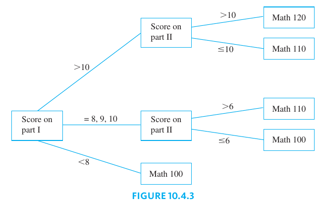

### A Parse Tree

In the last 30 years, [Noam Chomsky](https://wikipedia.org/wiki/Noam_Chomsky) and others have developed new ways to describe the syntax (or grammatical structure) of natural languages such as English. This work has proved useful in constructing compilers for high-level computer languages. In the study of grammars, trees are often used to show the derivation of grammatically correct sentences from certain basic rules. Such trees are called syntactic **derivation trees or parse trees**.

The rules of a grammar are called **productions**. It is customary to express them using the shorthand notation illustrated below. This notation, introduced by [John Backus](https://wikipedia.org/wiki/John_Backus) in 1959 and modified by [Peter Naur](https://wikipedia.org/wiki/Peter_Naur) in 1960, was used to describe the computer language Algol and is called **the Backus–Naur notation**. In the notation, the symbol $|$ represents the word or, and angle brackets $\langle \rangle$ are used to enclose terms to be defined.

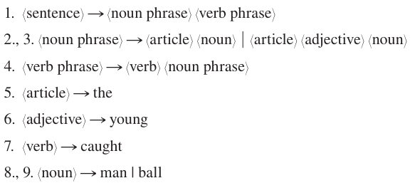

The derivation of the sentence “The young man caught the ball” from the above rules is described by the tree shown below.

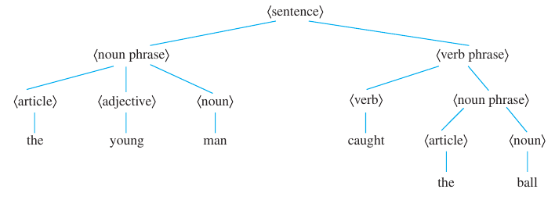

### Characterizing Trees

There is a somewhat surprising relation between the number of vertices and the number of edges of a tree. It turns out that if $n$ is a positive integer, then any tree with $n$ vertices (no matter what its shape) has $n - 1$ edges.

Perhaps even more surprisingly, a partial converse to this fact is also true. Any connected graph with $n$ vertices and $n - 1$ edges is a tree. It follows from these facts that if even one new edge (but no new vertex) is added to a tree, the resulting graph must contain a circuit.

Also, from the fact that removing an edge from a circuit does not disconnect a graph, it can be shown that every connected graph has a subgraph that is a tree. It follows that if $n$ is a positive integer, any graph with $n$ vertices and fewer than $n - 1$ edges is not connected.

> [!NOTE] **Terminal or Leaf Vertex**
>
> Let $T$ be a tree. If $T$ has at least two vertices, then a vertex of degree $1$ in $T$ is called a **leaf** (or a **terminal vertex**). The unique vertex in a trivial tree is also called a **leaf** or **terminal vertex**.

> [!NOTE] **Internal or Branch Vertex**
>
> Let $T$ be a tree. If $T$ has at least two vertices, then a vertex of degree greater than $1$ in $T$ is called an **internal vertex** (or a **branch vertex**).

> [!TIP] **Number of Vertices and Edges on a Tree**
>
> For any positive integer $n$, any tree with $n$ vertices has $n - 1$ edges.

**Proof** (by mathematical induction).

Let the property $P(n)$ be the sentence

> Any tree with $n$ vertices has $n - 1$ edges.

We use mathematical induction to show that this property is true for every integer with $n \geq 1$.

**Show that $P(1)$ is true**: Let $T$ be any tree with one vertex. Then $T$ has zero edges. Since $0 = 1 - 1$ then $P(1)$ is true.

**Show that for every integer $k \geq 1$, if $P(k)$ is true then $P(k + 1)$ is true**. Suppose $k$ is any positive integer for which $P(k)$ is true. In other words, suppose that

> Any tree with $k$ vertices has $k - 1$ edges.

We mush show that $P(k + 1)$ is true. In other words, we must show that

> Any tree with $k + 1$ vertices has $(k + 1) - 1 = k$ edges.

Let $T$ be a particular but arbitrarily chosen tree with $k + 1$ vertices. Since $k$ is a positive integer, $(k + 1) \geq 2$, and so $T$ has more than one vertex.

Since any tree that has more than one vertex has at least one vertex of degree $1$, $T$ must have a vertex $v$ of degree $1$. Also, since $T$ has more than one vertex, there is at least one other vertex in $T$ besides $v$. Thus there is an edge $e$ connecting $v$ to the rest of $T$.

Define a subgraph $T'$ of $T$ so that

$$
V(T') = V(T) - \{v\} \text{ and } E(T') = E(T) - \{e\}
$$

Then

1. The number of vertices of $T'$ is $(k + 1) - 1 = k$
2. $T'$ is circuit free, since $T$ is circuit free and removing an edge and a vertex cannot create a circuit
3. $T'$ is connected

Hence, by the definition of tree, $T'$ is a tree. Since $T'$ has $k$ vertices, by inductive hypothesis the number of edges of $T'$ is $k - 1$.

It follows that the number of edges of $T$ is the number of edges of $T'$ plus the edge we removed:

$$
\text{ the number of edges of } T' + 1 = k - 1 + 1 = k
$$

This is what was to be shown.

> [!TIP] **Connectivity and Circuits**
>
> If $G$ is any connected graph, $C$ is any circuit in $G$, and any one of the edges of $C$ is removed from $G$, then the graph that remains is connected.

**Proof**. Suppose $G$ is a connected graph, $C$ is a circuit in $G$ and $e$ is an edge of $C$. Form a subgraph $G'$ of $G$ by removing $e$ from $G$. Thus

$$
V(G') = V(G) \\[5pt]
E(G') = E(G) - \{e\}
$$

We must show that $G'$ is connected. Suppose $u$ and $w$ are any two vertices of $G'$. Since the vertex sets of $G$ and $G'$ are the same, because $u$ and $w$ are both vertices of $G$ and since $G$ is connected, there is a walk $W$ in $G$ from $u$ to $w$.

**Case 1 ($e$ is not an edge of $W$)**: The only edge in $G$ that is not in $G'$ is $e$, so in this case $W$ is also a walk in $G'$. Hence $u$ is connected to $w$ by a walk in $G'$.

**Case 2 ($e$ is an edge of $W$)**: In this case the walk $W$ from $u$ to $w$ includes a section of the circuit $C$ that contains $e$. Let $C$ be denoted as follows

$$
C: v_0e_1v_1e_2v_2\cdots e_nv_n(=v_0)
$$

Now $e$ is one of the edges of $C$, so, to be specific, let $e = e_k$. Then the walk $W$ contains either the sequence

$$
v_{k - 1}e_kv_k \text{ or } v_ke_kv_{k - 1}
$$

If $W$ contains $v_{k - 1}e_kv_k$, connect $v_k{k - 1}$ to $v_k$ by taking the counterclockwise walk $W'$ defined as follows

$$
W': v_{k - 1}e_{k - 1} v_{k - 2} \cdots v_0e_nv_{n - 1} \cdots e_{k + 1} v_{k}, \text{ where } v_n = v_0
$$

See the following figure for an example

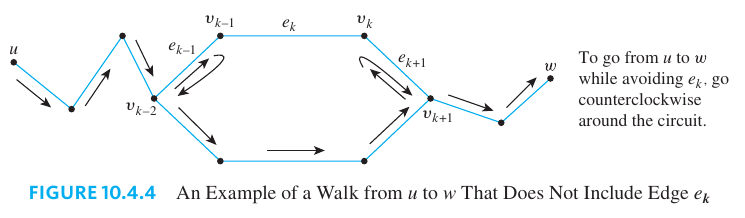

If $W$ contains $v_ke_kv_{k - 1}$, connect $v_k$ to $v_{k - 1}$ by takin the clockwise walk $W''$ defined as follows:

$$
W'': v_ke_{k + 1}v_{k + 1} \cdots v_ne_1v_1e_2 \cdots e_{k - 1}v_{k - 1}, \text{ where } v_n = v_0
$$

Now patch either $W'$ or $W''$ into $W$ to form a new walk from $u$ to $w$. For instance, to path $W'$ into $W$, start with the section of $W$ From $u$ to $v_{k - 1}$ then take $W'$ from $v_{k - 1}$ to $v_k$, and finally take the section of $W$ From $v_k$ to $w$. If this new walk still contains an ocurrence of $e$, just repeat the process describes previously untils all ocurrences are eliminted (This must happen eventually since the ocurrences of $e$ in $C$ are finite.). The result is a walk from $u$ to $w$ that does not contain $e$ and hence is a walk in $G'$.

> [!NOTE] **The Tree Test**
>
> For any positive integer $n$, if $G$ is a connected graph with $n$ vertices and $n - 1$ edges, then $G$ is a tree.

**Proof**. Let $n$ be a positive integer and suppose $G$ is a particular but artitrarily chosen graph that is connected and has $n$ vertices and $n - 1$ edges. Suppose $G$ is not circuit free. That is, suppose $G$ has a circuit $C$.

We know that an edge of $C$ can be removed from $G$ to obtain a graph $G'$ that is connected. If $G'$ has a circuit, then repeat this process. Continue repeating the process of removing edges from circuits untils eventually a graph $G''$ is obtained that is connected and circuit-free.

By definition $G''$ is a tree. Since no vertices were removed from $G$ To from $G''$, then $G''$ has $n$ vertices. Thus by the properties of a tree $G''$ has $n - 1$ edges. But the suppositiong that $G$ has a circuit implies that at least once edge of $G$ is removed to form $G''$. Hence $G''$ has no more than $(n - 1) - 1 = n - 2$ edges, which contradicts its having $n - 1$ edges. So the supposition is false and $G$ is circuit-free, and therefore $G$ is a tree.

> [!NOTE] **The Circuit Test**
>
> If $G$ is any graph with $n$ vertices and $m$ edges, where $m$ and $n$ are positive integers and $m \geq n$, then $G$ has a circuit.

**Proof** (by mathematical indcution). Suppose not. Suppose there is a graph $G$ with $n$ vertices and $m$ edges, where $m$ and $n$ are positive integers and $m \geq n$, and suppose $G$ does not have a circuit. Let $G_1, G_2, \cdots, G_k$ be the connected components of $G$, and let $n_1, n_2, \cdots, n_k$ be the number of vertices of $G_1, G_2, \cdots, G_k$ respectively. Because $G_1, G_2, \cdots, G_k$ are the connected components of $G$,

$$
\sum_{i = 1}^k n_i = n
$$

Since $G$ does not have a circuit, none of $G_1, G_2, \cdots, G_k$ have circuits either. So, since each is connected, each is a tree, therefore the number of edges of each $G_i$ is $n_i - 1$. Now because $G$ is compose of its connected components,

$$
\text{ the number of edges of } G = \sum_{i = 1}^k \text{ the number of edges of } G_i \\[10pt]
= (n_1 - 1) + (n_2 - 1) + \cdots + (n_k - 1) \\[10pt]
= (n_1 + n_2 + \cdots + n_k) - (1 + 1 + \cdots + 1) \\[10pt]
= n - k < n
$$

Thus the number of edges of $G$ is less than $n$, which contradicts the hypothesis that the number of edges of $G$, namely $m$, is greater than or equal to $n$. Hence the supposition is false and $G$ has a circuit.

## Rooted Trees

> [!NOTE] **Rooted Tree**
>
> A **rooted tree** is a tree in which there is one vertex that is distinguished from the others and is called the root.

> [!NOTE] **Level of a Vertex**
>
> The **level of a vertex** is the number of edges along the unique path between it and the root.

> [!NOTE] **Height of a Rooted Tree**
>
> The **height of a rooted tree** is the maximum level of any vertex of the tree.

> [!NOTE] **Children of a Vertex on a Rooted Tree**
>
> Given the root or any internal vertex $v$ of a rooted tree, the children of $v$ are all those vertices that are adjacent to $v$ and are one level farther away from the root than $v$.

> [!NOTE] **Parent and Siblings on a Rooted Tree**
>
> If $w$ is a child of $v$, then $v$ is called the **parent of $w$**, and two distinct vertices that are both children of the same parent are called **siblings**.

> [!NOTE] **Ancestor and Descendant on a Rooted Tree**
>
> Given two distinct vertices $v$ and $w$, if $v$ lies on the unique path between $w$ and the root, then $v$ is an **ancestor of $w$** and $w$ is a **descendant of $v$**.

These terms are illustrated in the following figure:

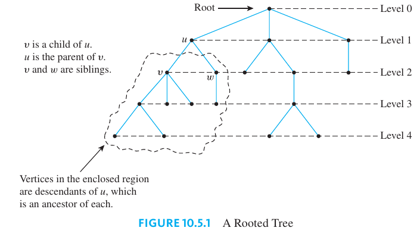

> [!NOTE] **Binary Tree**
>
> A **binary tree** is a rooted tree in which every parent has at most two children. Each child in a binary tree is designated either a left child or a right child (but not both), and every parent has at most one left child and one right child.

> [!NOTE] **Full Binary Tree**
>
> A **full binary tree** is a binary tree in which each parent has exactly two children.

> [!NOTE] **Left and Right Subtrees**
>
> Given any parent $v$ in a binary tree $T$, if $v$ has a left child, then the **left subtree** of $v$ is the binary tree whose root is the left child of $v$, whose vertices consist of the left child of $v$ and all its descendants, and whose edges consist of all those edges of $T$ that
> connect the vertices of the left subtree. The **right subtree** of $v$ is defined analogously.

These terms are illustrated on the following figure:

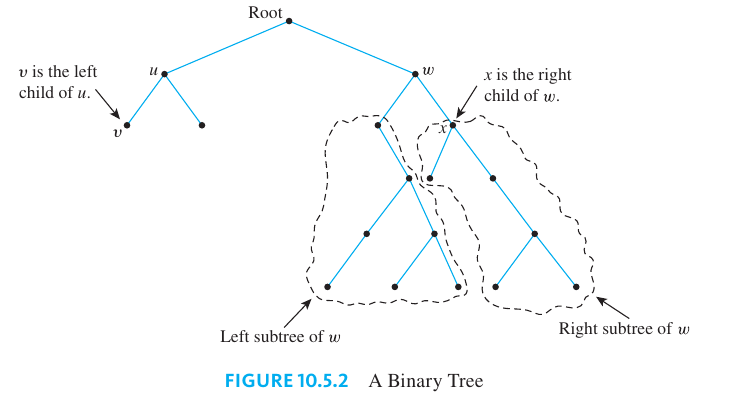

### Representation of Algrebraic Expressions

Binary trees are used in many ways in computer science. One use is to represent algebraic expressions with arbitrary nesting of balanced parentheses. For instance, the following (labeled) binary tree represents the expression $\frac{a}{b}$:

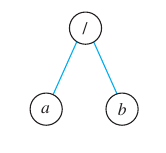

More generally, the binary tree shown below represents the expression $\frac{a}{c + d}$. In such a representation, the internal vertices are arithmetic operators, the leaves are variables, and the operator at each vertex acts on its left and right subtrees in left-to-right order.

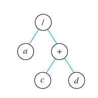

An interesting theorem about binary trees says that if you know the number of internal vertices of a full binary tree, then you can calculate both the total number of vertices and the number of leaves, and conversely.

> [!TIP] **Number of Vertices and Leaves on a Full Binary Tree**
>
> If $k$ is a positive integer and $T$ is a full binary tree with $k$ internal vertices, then
>
> 1. $T$ has a total of $2k + 1$ vertices and
> 2. $T$ has $k + 1$ leaves

**Proof**. Suppose $k$ is a positive integer and $T$ is a full binary tree with $k$ internal vertices.

1. Observe that the set of all vertices of $T$ can be partitioned into two disjoint subsets: the set of all vertices that have a parent and the set of all vertices that do not have a parent.

Now there is just one vertex that does not have a parent, namely the root. Also, since every internal vertex of a full binary tree has exactly two children, the number of vertices that have a parent is twice the number of parents, or $2k$, since each parent is an internal vertex. Hence

$$
\begin{bmatrix} \text{ the total number } \\[2pt] \text{ of vertices of } T \end{bmatrix} =
\begin{bmatrix} \text{ the number of } \\[2pt] \text{ vertices that } \\[2pt] \text{have a parent} \end{bmatrix}
\begin{bmatrix} \text{ the number of } \\[2pt] \text{ vertices that do } \\[2pt] \text{not have a parent} \end{bmatrix}  \\[10pt] = 2k + 1
$$

2. Because it is also true that the total number of vertices of $T$ equals the number of internal vertices plus the number of leaves,

$$
\begin{bmatrix} \text{ the total number } \\[2pt] \text{ of vertices of } T \end{bmatrix} =
\begin{bmatrix} \text{ the number of } \\[2pt] \text{ internal vertices } \end{bmatrix}
\begin{bmatrix} \text{ the number of } \\[2pt] \text{ leaves } \end{bmatrix}  \\[10pt] = k + 1
$$

Now equate the two expressions for the total number of vertices of $T$:

$$
2k + 1 = k + \begin{bmatrix}\text{the number of} \\[2pt] \text{leaves}\end{bmatrix}
$$

Solving this equation gives

$$
\begin{bmatrix}\text{the number of} \\[2pt] \text{leaves}\end{bmatrix} = 2k + 1 - k = k + 1
$$

Thus the total number of vertices is $2k + 1$ and the number of leaves is $k + 1$.

### Determining Whether a Certain Full Binary Tree Exists

Another interesting theorem about binary trees specifies the maximum number of leaves of a binary tree of a given height.

> [!TIP] **Maximum Height of a Binary Tree**
>
> For every integer $h \geq 0$, if $T$ is any binary tree with height $h$ and $t$ leaves, then
>
> $$t \geq 2^h$$
>
> Equivalently:
>
> $$\log_2 t \leq h$$

**Proof**.

Let $P(h)$ be the sentence:

> If $T$ is any binary tree of height $h$, then $T$ has at most $2^h$ leaves.

**Show that $P(0)$ is true**: We must show that if $T$ is any binary tree of height $0$, then $T$ has at most $2^0$ leaves. Suppose $T$ is a tree of height $0$. Then $T$ consists of a single vertex, the root. By definition this is also a leaf, and so the number of leaves is $t = 1 = 2^0 = 2^h$. Hence $t \leq 2^h$.

**Show that for every integer $k \geq 0$, if $P(i)$ is true for each integer $i$ from $0$ through $k$, then it is true for $k + 1$**:

Let $k$ be any integer with $k \geq 0$, and suppose that

> For each integer $i$ from $0$ through $k$, if $T$ is any binary tree of height $i$, then $T$ has at most $2^i$ leaves.

We must show that

> If $T$ is any binary tree of height $k + 1$, then $T$ has at most $2^{k + 1}$ leaves.

Let $T$ be a binary tree of height $k + 1$, root $v$, and $t$ leaves. Because $k \geq 0$, we have that $k + 1 \geq 1$ and so $v$ has at least one child.

**Case 1 ($v$ has only one child)**:

In this case, we may assume without loss of generality that $v$'s child is a left child $v_L$, and that $v_l$ is the root of the subtree $T_L$ of $v$. (see the following figure) Let $t_L$ be the number of leaves in $T_L$ . By inductive hypothesis, $t_L \geq 2^k$ because the height of $T_L$ is one less than the height of $T$, which is $k + 1$.

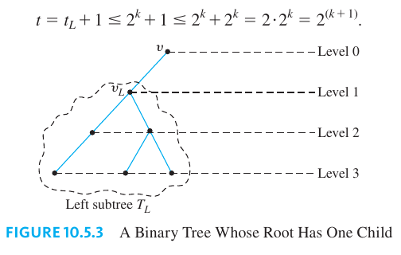

Also since the root $v$ has only one child, $v$ is also a leaf, and hence the total number of leaves in $T$ is one more than the number of leaves in $T_L$. Finally, $2^k \geq 2^0 = 1$ because $k \geq 0$. Therefore

$$
t = t_L + 1 \leq 2^k + 1 \geq 2^k + 2^k = 2 2^k = 2^{k + 1}
$$

**Case 2 ($v$ has two children)**:

In this case, $v$ has both a left child, $v_L$, and a right child, $v_R$, and $v_L$ and $v_R$ are roots of a left subtree $T_L$ and a right subtree $T_R$. Note that $T_L$ and $T_R$ are binary trees because $T$ is a binary tree. (see the following figure)

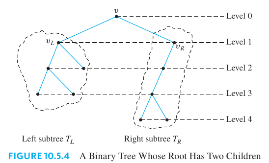

Let $t_L$ and $t_R$ be the numbers of leaves in $T_L$ and $T_R$, respectively, and let $h_L$ and $h_R$ be the heights of $T_L$ and $T_R$, respectively. Because $T$ has height $k + 1$, then $h_L \leq k$ and $h_R \leq k$, and so, by inductive hypothesis,

$$
t_K \leq 2^{h_L} \text{ and } t_R \leq 2^{h_R}
$$

Now the leaves of $T$ consist exactly of the leaves of $T_L$ together with the leaves of $T_R$. Therefore,

$$
t = t_L + t_R \leq 2^{h_L} + 2^{h_R}
$$

Hence

$$
t \leq 2^{k} + 2^{k} = 2 \cdot 2^{k} = 2^{k + 1}
$$

Thus the number of leaves is at most $2^{k + 1}$.

Since both the basis step and the inductive step have been proved, we conclude that for every integer $h \geq 0$, if $T$ is any binary tree with height $h$ and $t$ leaves, then $t \geq 2^h$.

The equivalent inequality $\log_2 t \leq h$ follows from the fact that the logarithmic function with base $2$ is increasing. In other words, for all positive real numbers $x$ and $y$,

$$
x < y \Leftarrow \log_2 x < \log_2 y
$$

If we apply the logarithmic function with base $2$ to both sides of

$$
t \leq 2^{h}
$$

we obtain

$$
\log_2 t \leq \log_2 2^h
$$

$$
\log_2 t \leq h
$$

### Determining Whether a Certain Binary Tree Exists

> [!TIP] **Number of Leaves on a Full Binary Tree**
>
> A full binary tree of height $h$ has $2^h$ leaves.

### Binary Search Trees

A binary search tree is a kind of binary tree. It has the following property: for every internal vertex $v$, all the keys in the left subtree of $v$ are less than the key in $v$, and all the keys in the right subtree of $v$ are greater than the key in $v$.

To build a binary search tree, start by making a root and insert a key into it. To add a new key, compare it to the key at the root. If the new key is less than the key at the root, give the root a left child and insert the new key into it. If the key is greater than the key at the root, give the root a right child and insert the new key into it.

So to add a key at a subsequent stage, work down the tree to find a place to put the new key, starting at the root and either moving left or right depending on whether the new key is less or greater than the key at the vertex to which it is currently being compared.

## Spanning Trees and Shortest Path Algorithm

An airline company wants to expand service to the midwestern part of the United States and has received permission from the U.S. Federal Aviation Authority to fly any of the routes shown in the following figure.

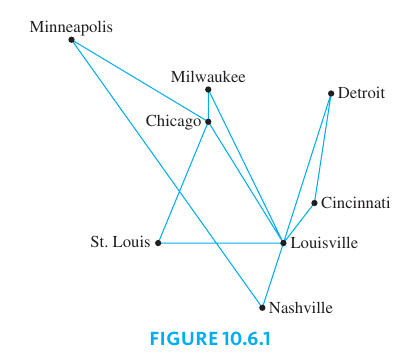

The company wishes to legitimately advertise service to all the cities shown but, for reasons of economy, wants to use the least possible number of individual routes to connect them. One possible route system is given in the figure below.

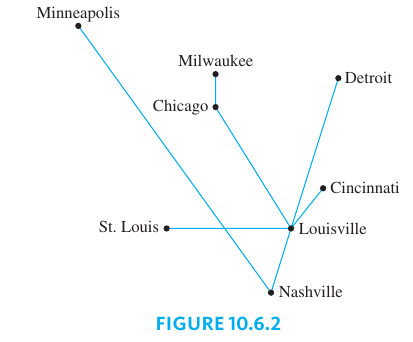

Clearly this system joins all the cities. Is the number of individual routes minimal? The fact is that the graph of any system of routes that satisfies the company’s wishes is a tree, because if the graph were to contain a circuit, then one of the routes in the circuit could be removed without disconnecting the graph, and that would give a smaller total number of routes.

> [!NOTE] **Spanning Tree**
>
> A spanning tree for a graph $G$ is a subgraph of $G$ that contains every vertex of $G$ and is a tree.

> [!TIP] **Propositions on Spanning Trees**
>
> 1. Every connected graph has a spanning tree.
> 2. Any two spanning trees for a graph have the same number of edges.

### Minimum Spanning Trees

The graph of the routes allowed by the U.S. Federal Aviation Authority shown before can be annotated by adding the distances (in miles) between each pair of cities.

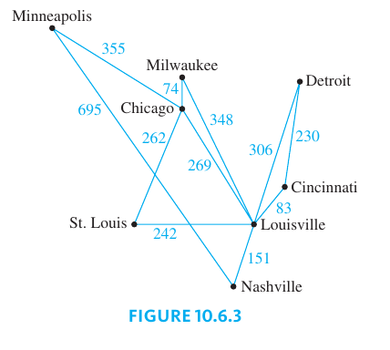

Now suppose the airline company wants to serve all the cities shown, but with a route system that minimizes the total mileage of the system as a whole.

More generally, a graph whose edges are labeled with numbers (known as weights) is called a weighted graph. A minimum-weight spanning tree, or simply a minimum spanning tree, is a spanning tree for which the sum of the weights of all the edges is as small as possible.

> [!NOTE] **Weighted Graph**
>
> A **weighted graph** is a graph for which each edge has an associated positive real number weight. The sum of the weights of all the edges is the **total weight** of the graph.
>
> If $G$ is a weighed graph and $e$ is an edge of $G$, then $w(e)$ denotes the weight of $e$ and $w(G)$ denotes the total weight of $G$.

> [!NOTE] **Minimum Spanning Tree**
>
> A **minimum spanning tree** for a connected, weighted graph is a spanning tree that has the least possible total weight compared to all other spanning trees for the graph.

The problem of finding a minimum spanning tree for a graph is certainly solvable. One solution is to list all spanning trees for the graph, compute the total weight of each, and choose one for which this total is a minimum. (The well-ordering principle for the integers guarantees the existence of such a minimum total.) This solution, however, is inefficient.

In 1956 and 1957 [Joseph B. Kruskal](https://wikipedia.org/wiki/Joseph_Kruskal) and [Robert C. Prim](https://wikipedia.org/wiki/Robert_C._Prim) each described much more efficient algorithms to construct minimum spanning trees.

### Krukal's Algorithm

In Kruskal’s algorithm, the edges of a connected, weighted graph are examined one by one in order of increasing weight. At each stage the edge being examined is added to what will become the minimum spanning tree, provided that this addition does not create a circuit.

After $n - 1$ edges have been added (where $n$ is the number of vertices of the graph), these edges, together with the vertices of the graph, form a minimum spanning tree for the graph.

> [!TIP] **Kruskal's Algorithm**
>
> **Input**: $G$ [a connected, weighted graph with $n$ vertices, where $n$ is a positive integer]
>
> **Algorithm body**:
>
> 1. Initialize $T$ to have all the vertices of $G$ and no edges
> 2. Let $E$ be the set of all the edges of $G$, and let $m := 0$.
> 3. While $(m < n - 1)$
>    - Find an edge $e$ in $E$ of lest weight
>    - Delete $e$ from $E$
>    - If the addition of $e$ to the edge set of $T$ does not produce a circuit then add $e$ to the edge set of $T$ and set $m := m +1$
>
> **Output**: $T$ [$T$ is a minimum spanning tree for $G$]

It is not obvious from the description of Kruskal’s algorithm that it does what it is supposed to do. To be specific, what guarantees that it is possible at each stage to find an edge of least weight whose addition does not produce a circuit? And if such edges can be found, what guarantees that they will all eventually connect? And if they do connect, what guarantees that the resulting tree has minimum weight?

> [!TIP] **Correctedness of Kruskal's Algorithm**
>
> When a connected, weighted graph is input to Kruskal’s algorithm, the output is a minimum spanning tree.

**Proof**. Suppose that $G$ is a connected, weighted graph with $n$ vertices and that $T$ is a subgraph of $G$ produced when $G$ is input to Kruskal’s algorithm.

Clearly $T$ is circuit-free (since no edge that completes a circuit is ever added to $T$).

Also, $T$ is connected. For as long as $T$ has more than one connected component, the set of edges of $G$ that can be added to T without creating a circuit is nonempty. The reason is that since $G$ is connected, given any vertex $v_1$ in one connected component $C_1$ of $T$ and any vertex
$v_2$ in another connected component $C_2$, there is a path in $G$ from $v_1$ to $v_2$. Since $C_1$ and $C_2$ are distinct, there is an edge $e$ of this path that is not in $T$. Adding $e$ to $T$ does not create a circuit in $T$, because deletion of an edge from a circuit does not disconnect a graph and deletion of e would.

Next we show that $T$ has minimum weight. Let $T_1$ be any minimum spanning tree for $G$ such that the number of edges $T_1$ and $T$ have in common is a maximum. Suppose that $T \neq T_1$. Then there is an edge $e$ in $T$ that is not an edge of $T_1$. (Since trees $T$ and $T_1$ both have the same vertex set, if they differ at all, they must have different, but same-size, edge sets.)

Now adding $e$ to $T_1$ produces a graph with a unique circuit. Let $e'$ be an edge of this circuit such that $e'$ is not in $T$. (Such an edge must exist because $T$ is a tree and hence circuit-free.) Let $T_2$ be the graph obtained from $T_2$ by removing $e'$ and adding $e$. This situation is illustrated below.

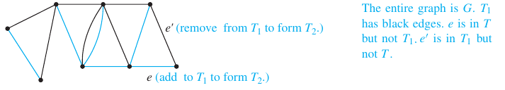

Note that $T_2$ has $n - 1$ edges and $n$ vertices and that $T_2$ is connected. Consequently, $T_2$ is a spanning tree for $G$. In addition,

$$
w(T_2) = w(T_1) - w(e') + w(e)
$$

Now $w(e) \leq w(e')$ because at the stage in Kruskal’s algorithm when $e$ was added to $T$, $e'$ was available to be added (since it was not already in $T$, and at that stage its addition could not produce a circuit since $e$ was not in $T$), and $e'$ would have been added had its weight been less than that of $e$. Thus

$$
w(e') - w(e) \geq 0 \Rightarrow w(T_2) \leq w(T_1)
$$

But $T_1$ is a minimum spanning tree. So since $T_2$ is a spanning tree with weight less than or equal to the weight of $T_1$, $T_2$ is also a minimum spanning tree for $G$.

Finally, note that by construction, $T_2$ has one more edge in common with $T$ than $T_1$ does, which contradicts the choice of $T_1$ as a minimum spanning tree for $G$ with a maximum number of edges in common with $T$. Thus the supposition that $T \neq T1$ is false, and hence $T$ itself is a minimum spanning tree for $G$.

### Prim's Algorithm

Prim’s algorithm works differently from Kruskal’s. It builds a minimum spanning tree $T$ by expanding outward in connected links from some vertex. One edge and one vertex are added at each stage. The edge added is the one of least weight that connects the vertices already in $T$ with those not in $T$, and the vertex is the endpoint of this edge that is not already in $T$.

> [!TIP] **Prim's Algorithm**
>
> **Input**: $G$ [a connected, weighted graph with $n$ vertices where $n$ is a positive integer]
>
> **Algorithm body**:
>
> 1. Pick a vertex $v$ of $G$ and let $T$ be the graph with one vertex, $v$, and no edges.
> 2. Let $V$ be the set of all vertices of $G$ except $v$.
> 3. For $i := 1$ to $n - 1$
>    - Find an edge $e$ of $G$ such that (1) $e$ connects $T$ to one of the vertices in $V$, and (2) $e$ has the least weight of all edges connecting $T$ to a vertex in $V$. Let $w$ be the endpoint of $e$ that is in $V$.
>    - Add $e$ and $w$ to the edge and vertex sets of $T$, and delete $w$ from $V$.
>
> **Output**: $T$ [$T$ is a minimum spanning tree for $G$.]

It is not hard to see that when a connected graph is input to Prim’s algorithm, the result is a spanning tree. What is not so clear is that this spanning tree is a minimum.

> [!TIP] **Correctedness of Prim's Algorithm**
>
> When a connected, weighted graph $G$ is input to Prim’s algorithm, the output is a minimum spanning tree for $G$.

**Proof**. Let $G$ be a connected, weighted graph, and suppose $G$ is input to Prim’s algorithm. At each stage of execution of the algorithm, an edge must be found that connects a vertex in a subgraph to a vertex outside the subgraph. As long as there are vertices outside the subgraph, the connectedness of $G$ ensures that such an edge can always be found. (For if one vertex in the subgraph and one vertex outside it are chosen, then by the connectedness of $G$ there is a walk in $G$ linking the two. As one travels along this walk, at some point one moves along an edge from a vertex inside the subgraph to a vertex outside the subgraph.)

Now it is clear that **the output $T$ of Prim's algorithm is a tree** because the edge and vertex added to $T$ at each stage are connected to other edges and vertices of $T$ and because at no stage is a circuit created since each edge added connects vertices in two disconnected sets. Also, $T$ includes every vertex of $G$ because $T$, being a tree with $n - 1$ edges, has $n$ vertices. Thus $T$ is a spanning tree for $G$.

**Next we show that $T$ has minimum weight**. Suppose there is a minimum spanning tree for $G$, $T_1$, such that the number of edges $T_1$ and $T$ have in common is a maximum, but $T \neq T1$. Then there is an edge $e$ in $T$ that is not an edge of $T_1$.

Of all such edges, let $e$ be the last that was added when $T$ was constructed using Prim’s algorithm. Let $S$ be the set of vertices of $T$ just before the addition of $e$. Then one endpoint, say $v$ of $e$, is in $S$ and the other, say $w$, is not. Since $T_1$ is a spanning tree, there is a path in $T_1$ joining $v$ to $w$. And since $v \in S$ and $w \notin S$, as one travels along this path, one must encounter an edge $e'$ that joins a vertex in $S$ to one that is not in $S$ and that therefore is not in $T$ because $e$ was the last edge added to $T$. Now at the stage when $e$ was added to $T$, $e'$ could have been added and it would have been added instead of $e$ had its weight been less than that of $e$. Since $e'$ was not added at that stage, we conclude that

$$
w(e') \geq w(e)
$$

Let $T_2$ be the graph obtained from $T_1$ by removing $e'$ and adding $e$. (Thus $T_2$ has one more edge in common with $T$ than $T_1$ does.) Note that $T_2$ is a tree. The reason is that since $e'$ is part of a path in $T_1$ from $v$ to $w$, and $e$ connects $v$ and $w$, adding $e$ to $T_1$ creates a circuit. When $e'$ is removed from this circuit, the resulting subgraph remains connected and has the same number of edges as $T$. In fact, $T_2$ is a spanning tree for $G$ since no vertices were removed in forming $T_2$ from $T_1$. We can then show that $w(T_2) \leq w(T_1)$. It follows that $T_2$ is a minimum spanning tree for $G$.

By construction, $T_2$ has one more edge in common with $T$ than $T_1$ does, which contradicts the choice of $T_1$ as a minimum spanning tree for $G$, not equal to $T$, with a maximum number of edges in common with $T$. It follows that $T = T_1$, and hence $T$ itself is a minimum spanning tree for $G$.

### Dijkstra’s Shortest Path Algorithm

In 1959 the computing pioneer, [Edsger Dijkstra](https://wikipedia.org/wiki/Edsger_Dijkstra), developed an algorithm to find the shortest path between a starting vertex and an ending vertex in a weighted graph in which all the weights are positive.

At the start of execution of the algorithm, each vertex $u$ of $G$ is given a label $L(u)$, which indicates the current best estimate of the length of the shortest path from $a$ to $u$. $L(a)$ is initially set equal to $0$ because the shortest path from $a$ to $a$ has length $0$, but, because there is no previous information about the lengths of the shortest paths from a to any other vertices of $G$, the label $L(u)$ of each vertex $u$ other than a is initially set equal to a number, denoted $\infty$, that is greater than the sum of the weights of all the edges of $G$. As execution of the algorithm progresses, the values of $L(u)$ are changed, eventually becoming the actual lengths of the shortest paths from $a$ to $u$ in $G$.

Because $T$ is built up outward from $a$, at each stage of execution of the algorithm the only vertices that are candidates to join $T$ are those that are adjacent to at least one vertex of $T$. Thus at each stage of Dijkstra's algorithm, the graph $G$ can be thought of as divided into three parts:

1. the tree $T$ that is being built up,
2. the set of "fringe" vertices that are adjacent to at least one vertex of the tree, and
3. the rest of the vertices of $G$.

Each fringe vertex is a candidate to be the next vertex added to $T$. The one that is chosen is the one for which the length of the shortest path to it from $a$ through $T$ is a minimum among all the vertices in the fringe.

> [!TIP] **Dijkstra's Algorithm**
>
> **Input**: $G$ [a connected simple graph with a positive weight for every edge], $\infty$ [a number greater than the sum of the weights of all the edges in the graph], $w(u, v)$ [the weight of edge $\\{u, v\\}$], $a$ [the starting vertex], $z$ [the ending vertex]
>
> **Algorithm Body**:
>
> 1. Initialize $T$ to be the graph with vertex $a$ and no edges. Let $V(T)$ be the set of vertices of $T$, and let $E(T)$ be the set of edges of $T$.
> 2. Let $L(a) = 0$, and for all vertices in $G$ except $a$, let $L(u) = \infty$.
> 3. Initialize $u$ to equal $a$ and $F$ to be $\\{a\\}$.
> 4. While $(z \notin V(T))$
>    - $F := (F - \\{v\\}) \cup \\{\text{vertices that are adjacent to } v \text{ and are not in } V(T)\\}$
>    - For each vertex $u$ that is adjacent to $v$ and is not in $V(T)$, if $L(v) + w(v, u) < L(u)$, then:
>      - $L(u) := L(v) + w(v, u)$
>      - $D(u) := v$
>    - Find a vertex $x$ in $F$ with the smallest label.
>      - Add vertex $x$ to $V(T)$, and add edge $\\{D(x), x\\}$ to $E(T)$
>      - $v: = x$
>
> **Output**: $L(z)$ [$L(z)$, a nonnegative integer, is the length of the shortest path from $a$to $z$]

It is clear that Dijkstra's algorithm keeps adding vertices to $T$ until it has added $z$. The proof of the following theorem shows that when the algorithm terminates, the label for $z$, $L(z)$, is the length of the shortest path to $z$ from $a$.

> [!TIP] **Correctedness of Dijkstra's Algorithm**
>
> When a connected, simple graph with a positive weight for every edge is input to Dijkstra's algorithm with starting vertex $a$ and ending vertex $z$, the output is the length of a shortest path from $a$ to $z$.

**Proof** (by mathematical induction). Let $G$ be a connected, weighted graph with no loops or parallel edges and with a positive weight for every edge. Let $T$ be the graph built up by Dijkstra’s algorithm, and for each vertex $u$ in $G$, let $L(u)$ be the label given by the algorithm to vertex $u$. For each integer $n \geq 0$, let the property $P(n)$ be the sentence

> After the $n$th iteration of the while loop in Dijkstra's algorithm, (1) $T$ is a tree, and (2) for every vertex $v$ in $T$, $L(v)$ is the length of a shortest path in $G$ from $a$ to $v$.

**Show that $P(0)$ is true**: When $n = 0$, the graph $T$ is a tree because it is defined to consist only of the vertex $a$ and no edges. In addition, $L(a)$ is the length of the shortest path from $a$ to $a$ because the initial value of $L(a)$ is $0$.

**Show that for every integer $k \geq 0$, if $P(k)$ is true then $P(k + 1)$ is also true**: Let $k$ be any integer with $k \geq 0$ and suppose that

> After the $k$th iteration of the while loop in Dijkstra's algorithm, (1) $T$ is a tree, and (2) for every vertex $v$ in $T$, $L(v)$ is the length of a shortest path in $G$ from $a$ to $v$.

We must show that

> After the $(k + 1)$th iteration of the while loop in Dijkstra's algorithm, (1) $T$ is a tree, and (2) for every vertex $v$ in $T$, $L(v)$ is the length of a shortest path in $G$ from $a$ to $v$.

Suppose that after the $(k + 1)$st iteration of the while loop in Dikjstra's algorithm, the vertex $v$ and edge $\\{x, v\\}$ have been added to $T$, where $x$ is in $V(T)$. Clearly the new value of $T$ is a tree because adding a new vertex to a tree along with the edge leading to it neither creates a circuit nor disconnects the tree.

By inductive hypothesis, for each vertex $y$ that is in the tree before the addition of $v$, $L(y)$ is the length of a shortest path from $a$ to $y$. So it remains only to show that $L(v)$ is the length of a shortest path from $a$ to $v$.

Now, according to the algorithm, the final value of $L(v) = L(x) + w(x, v)$. Consider any shortest path from $a$ to $v$, and let $\\{s, t\\}$ be the first edge in this path to leave $T$, where $s \in V(T)$ and $t \notin V(T)$. This situation is illustrated below.

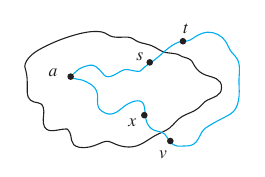

Let $LSP(a, v)$ be the length of a shortest path from $a$ to $v$, and let $LSP(a, s)$ be the length of a shortest path from $a$ to $s$. Let's break the path from $a$ to $v$ into two (1) The path from $a$ to $s$, and then the path from $s$ to $t$. Observe that because the path from $t$ to $v$ has length greater than zero the following holds:

$$
LSP(a, v) \geq LSP(a, s) + w(s, t)
$$

By inductive hypothesis as $s$ is a vertex in $T$

$$
\geq L(s) + w(s, t)
$$

$$
\geq L(x) + w(x, v)
$$

Because $t$ is in the fringe of the tree, and so if $L(s) + w(s, t)$ were less than $L(x) + w(x, v)$ then $t$ would have been added to $T$ instead of $v$.

On the other hand, as $L(x) + w(x, v)$ is the length of a path from $a$ to $v$, it is greater than or equal to the length of the shortest path from $a$ to $v$.

$$
L(x) + w(x, v) \geq LSP(a, v)
$$

Because both $LSP(a, v) \geq L(x) + w(x, v)$ and $L(x) + w(x, v) \geq LSP(a, v)$, we have that

$$
LSP(a, v) = L(x) + w(x, v)
$$

And since it is also the case that

$$
L(v) = L(x) + w(x, v)
$$

we conclude that

$$
L(v) = LSP(a, v)
$$

Therefore, $L(v)$ is the length of a shortest path from $a$ to $v$, which completes the proof by mathematical induction.

The algorithm terminates as soon as $z$ is in $T$, and, since we have proved that the label of every vertex in the tree gives the length of the shortest path to it from $a$, then, in particular, $L(z)$ is the length of a shortest path from $a$ to $z$.
