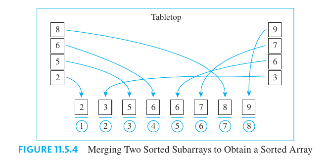
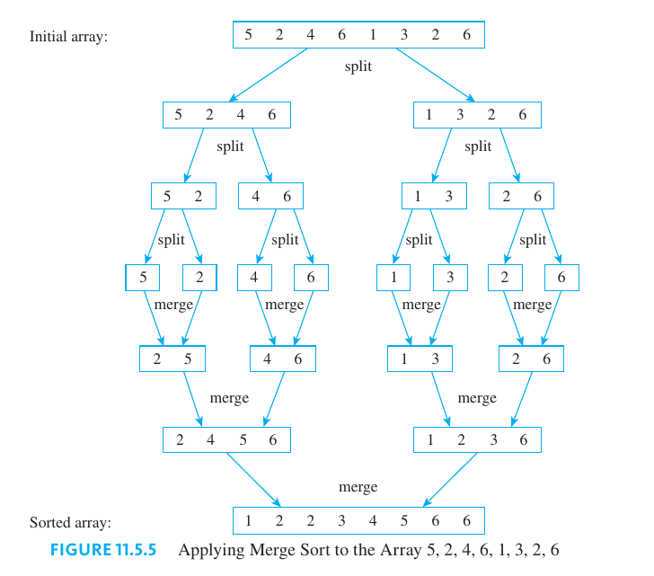

## Real-Valued Functions of a Real Variable and Their Graphs

A **Cartesian plane** or **two-dimensional Cartesian coordinate system** is a pictorial representation of $\mathbb{R} \times \mathbb{R}$, obtained by setting up a one-to-one correspondence between ordered pairs of real numbers and points in a Euclidean plane. To obtain it, two perpendicular lines, called the **horizontal and vertical axes**, are drawn in the plane. Their point of intersection is called the origin, and a unit of distance is chosen for each axis.

An ordered pair $(x, y)$ of real numbers corresponds to the point $P$ that lies $|x|$ units to the right or left of the vertical axis and $|y|$ units above or below the horizontal axis.

> [!NOTE] **Real-Valued Function of a Real Variable**
>
> A real-valued function of a real variable is a function from one set of real numbers to another. If $f$ is a real-valued function of a real variable, then for each real number $x$ in the domain of $f$ there is a unique corresponding real number $f(x)$.

> [!NOTE] **Graph of a Real Function**
>
> The graph of $f$ is the set of all points $(x, y)$ in the Cartesian coordinate plane with the property that $x$ is in the domain of $f$ and $y = f(x)$.

The example of the graph of a function $f$ is shown in the following figure:

### Power Functions

A function that sends a real number $x$ to a particular power, $x^a$, is called a power function.

> [!NOTE] **Power Function**
>
> Let $a$ be any nonnegative real number. Define $p_a$, the **power function** with exponent $a$, as follows:
>
> $$p_a(x) = x^a, \text{ for each nonnegative real number } x$$

### Increasing and Decreasing Function

> [!NOTE] **Increasing Function**
>
> Let $f$ be a real-valued function defined on a set of real numbers, and suppose the domain of $f$ contains a set $S$. We say that $f$ is **increasing on the set $S$** if, and only if,
>
> $$\text{for all real numbers } x_1 \text{ and } x_2 \text{ in } S, \text{ if } x_1 < x_2 \text{ then } f(x_1) < f(x_2)$$

> [!NOTE] **Decreasing Function**
>
> Let $f$ be a real-valued function defined on a set of real numbers, and suppose the domain of $f$ contains a set $S$. We say that $f$ is **decreasing on the set $S$** if, and only if,
>
> $$\text{for all real numbers } x_1 \text{ and } x_2 \text{ in } S, \text{ if } x_1 < x_2 \text{ then } f(x_1) > f(x_2)$$

We say that $f$ is an increasing (or decreasing) function if, and only if, $f$ is increasing (or decreasing) on its entire domain.

The following image shows examples of increasing (left) and decreasing (right) functions:

## Big-O, Big-Omega, and Big-Theta Notations

Understanding the relative efficiencies of computer algorithms is of much more than academic interest. In industrial and scientific settings, the choice of an efficient over an inefficient algorithm can save a great deal of money or even make the difference between being able or not being able to do a project at all.

**The cost and feasibility of implementing a computer algorithm are most affected by the length of computer time and the amount of computer memory the algorithm requires**. While both are important, this chapter concentrates on basic techniques for calculating time efficiency, which is usually the more significant of the two. Occasionally, however, one algorithm may make more efficient use of time but less efficient use of memory than another, forcing a trade-off based on the resources available to the user.

The main objects of analysis in this chapter will be algorithms that take a data array and either search it to find a particular element or sort it into ascending or descending order.

As a simple example, imagine running an algorithm to search an array of data for a particular element. In the best case the algorithm might happen to find the element in its very first step; in the worst case it might have to check every element before ending.

The best and worst cases cannot be predicted in advance because they depend on the nature of the data being processed, so, when comparing two algorithms, **it is reasonable to want control over worst-case situations**.

For example, the graph in the following figure gives a range of worst-case execution times for two algorithms used to sort sets of data: insertion sort and merge sort. As the length of the data set becomes larger and larger, the difference between the ranges becomes dramatically greater.

When they were originally defined, the order notations referred to functions defined on continuous intervals of real numbers rather than to functions defined on sets of integers. However, the important variable in the analysis of algorithm efficiency is the size of the problem the algorithm is designed to solve, which is an integer.

> [!NOTE] **The Order of a Function**
>
> Let $f$ and $g$ be real-valued functions defined on the same set of nonnegative integers, with $g(n) \geq 0$ for every integer $n \geq r$, where $r$ is a positive real number. Then
>
> - $f$ is of order at least $g$, written $f(n)$ is $\Omega(g(n))$, if, and only if, there exist positive real numbers $A$ and $a \geq r$ such that
>
> $$Ag(n) \leq f(n) \text{ for every integer } n \geq a$$
>
> - $f$ is of order at most $g$, written $f(n)$ is $O(g(n))$, if, and only if, there exist positive real numbers $B$ and $b \geq r$ such that
>
> $$0 \leq f(n) \leq Bg(n) \text{ for every integer } n \geq b$$
>
> - $f$ is of order $g$, written $f(n)$ is $\Theta(g(n))$, if, and only if, there exist positive real numbers $A$, $B$, and $k \geq r$ such that
>
> $$Ag(n) \leq f(n) \leq Bg(n) \text{ for every integer } n \geq k$$

The concept of the order of a function is illustrated on the following graphs:

> [!TIP] **Relationship among $O-$, $\Omega-$ and $\Theta-$ Notations**
>
> If $f$ and $g$ are real-valued functions defined on the same set of nonnegative integers, and if $f(n) \geq 0$ and $g(n) \geq 0$ for every integer $n \geq r$, where $r$ is a positive real number, then
>
> $$f(n) \text{ is } \Theta(g(n)) \text{ if, and only if, } f(n) \text{ is } \Omega(g(n)) \text{ and } f(n) \text{ is } O(g(n))$$

### Order of Power Functions

The functions that are most commonly used for comparing algorithm efficiencies are power functions, such as $n^{\frac{1}{2}}$, $n$, $n^2$, and $n^3$.

> [!TIP] **Order of Power Functions**
>
> For any positive rational numbers $r$ and $s$ and any integer $n \geq 1$,
>
> $$\text{ if } r \leq s, \text{ then } n^r \leq n^s$$

### Order of Polynomial Functions

> [!TIP] **A Limit on What can be inferred from Big-O**
>
> For any function f and positive real numbers $r$ and s with $r < s$,
>
> $$\text{ if } f(n) \text{ is } O(n^r) \text{ then } f(n) \text{ is } O(n^s)$$

**Proof**. Suppose $r$ and $s$ are real numbers with $r < s$ and $f$ is a function such that $f(n)$ is $O(n^r)$. By definition of O-notation, there exist positive real numbers $B$ and $b$ such that

$$
0 \leq f(n) \leq Bn^r \text{ for every integer } n \geq b
$$

Now as $r < s$, we know that

$$
n^r \leq n^s, \text{ for every integer } n \geq 1
$$

thus

$$
Bn^r \leq Bn^s \text{ for every integer } n \geq 1
$$

Let $b_1$ be the larger of $b$ and $1$. Then

$$
0 \leq f(n) \leq Bn^s \text{ for every integer } n \geq b_1
$$

and thus $f(n)$ is $O(n^s)$

> [!NOTE] **Showing that a Big-O Relationship does not hold**
>
> If $f$ is a real-valued function defined on a set of nonnegative integers and $f(n)$ is $\Omega(n^m)$, where $m$ is a positive integer, then $f(n)$ is not $O(n^p)$ for any positive real number $p < m$.

> [!TIP] **Order of a Polynomial**
>
> If $m$ is any integer with $m \geq 0$ and $a_0, a_1, \cdots, a_m$ are real numbers with $a_m > 0$, then $a_mn^m + a_{m - 1}n^{m - 1} + \cdots + a_1 n + a_0$ is $\Theta(n^m)$.

**Proof**. Suppose $m$ is an integer with $m > 0$ and suppose $a_0, a_1, cdots, a_m$ are real numbers with $a_m > 0$. Because $\lim_{n \to \infty} \frac{1}{n^1} = 0$ for every integer $i \geq 1$

$$
\lim_{n \to \infty} \left(\frac{a_mn^m + \cdots + a_1n + a_0}{n^m}\right)
$$

$$
= \lim_{n \to \infty} \left(a_m + \frac{a_{m-1}}{n} + \cdots + \frac{a_1}{n^{m - 1}} + \frac{a_0}{n^m}\right)
$$

As all rational expressions tend to $0$ when $n$ becomes larger and larger, then:

$$
= a^m
$$

By definition of limit, this implies that for any real number $\epsilon > 0$, there exists an integer $K$ such that

$$
a_m - \epsilon < a_m + \frac{a_{m-1}}{n} + \cdots + \frac{a_1}{n^{m - 1}} + \frac{a_0}{n^m} < a_m + \epsilon \text{ for every integer } n > K
$$

In particular, when $\epsilon = \frac{a_m}{2}$, there is an integer $k$ such that

$$
a_m - \frac{a_m}{2} < a_m + \frac{a_{m-1}}{n} + \cdots + \frac{a_1}{n^{m - 1}} + \frac{a_0}{n^m} < a_m + \frac{a_m}{2} \text{ for every integer } n > k
$$

Combining like terms and multiplying all parts of the inequality by $n^m$ gives that

$$
\frac{a_m}{2}n^m < a_mn^m + a_{m-1}n^{m - 1} + \cdots + a_1n + a_0 < \frac{3a_m}{2}n^m \text{ for every integer } n > k
$$

Therefore, by definition of $\Omega$-notation:

$$
a_mn^m + a_{m-1}n^{m - 1} + \cdots + a_1n + a_0 \text{ is } \Theta(n^m)
$$

We end this section by stating some theorems that give useful properties of order notations.

> [!NOTE] **Reciprocal Relationship between $\Omega$ and O-notations**
>
> Let $f$ and $g$ be real-valued functions defined on the same set of nonnegative integers, and suppose there is a positive real number $r$ such that $f(n) \geq 0$ and $g(n) \geq 0$ for every integer $n \geq r$. Then:
>
> - If $f(n)$ is $\Omega(g(n))$, then $g(n)$ is $O(f(n))$.
> - If $g(n)$ is $O(f(n))$, then $f(n) is \Omega(g(n))$.

> [!NOTE] **Reflexive, Symmetric, and Transitive Properties of $\Theta$-notation**
>
> Let $f$, $g$, and $h$ be real-valued functions defined on the same set of nonnegative integers, and suppose there is a positive real number $r$ such that $f(n) \geq 0$, $g(n) \geq 0$ and $h(n) \geq 0$, for every integer $n \geq r$. Then:
>
> - **Reflexivity**: $f(n)$ is $\Theta(f(n))$
> - **Symmetry**: If $f(n)$ is $\Theta(g(n))$, then $g(n)$ is $\Theta(f(n))$.
> - **Transitivity**: If $f(n)$ is $\Theta(g(n))$ and $g(n)$ is $\Theta(h(n))$, then $f(n)$ is $\Theta(h(n))$.

> [!NOTE] **Effect of Constants on Order Notations**
>
> Let $f$ and $g$ be real-valued functions defined on the same set of nonnegative integers, and suppose there is a positive real number $r$ such that $f(n) \geq 0$ and $g(n) \geq 0$ for every integer $n \geq r$. Then for every positive real number $c$:
>
> - If $f(n)$ is $\Omega(g(n))$, then $cf(n)$ is $\Omega(g(n))$;
> - If $f(n)$ is $O(g(n))$, then $cf(n)$ is $O(g(n))$;
> - If $f(n)$ is $\Theta(g(n))$, then $cf(n)$ is $\Theta(g(n))$.

> [!NOTE] **Orders of Sums and Products of Functions**
>
> Let $f_1$, $f_2$, $g_1$, and $g_2$ be real-valued functions defined on the same set of nonnegative integers, and suppose there is a positive real number $r$ such that $f_1(n) \geq 0$, $f_2(n) \geq 0$, $g_1(n) \geq 0$, and $g_2(n) \geq 0$ for every integer $n \geq r$. Then:
>
> - If $f_1(n)$ is $\Theta(g(n))$ and $f_2(n)$ is $\Theta(g(n))$, then $(f_1(n) + f_2(n))$ is $\Theta(g(n))$.
> - If $f_1(n)$ is $\Theta(g_1(n))$ and $f_2(n)$ is $\Theta(g_2(n))$, then $(f_1(n)f_2(n))$ is $\Theta(g_1(n)g_2(n))$.
> - If $f_1(n)$ is $\Theta(g_1(n))$ and $f_2(n)$ is $\Theta(g_2(n))$ and if there is a real number $s$ so that $g_1(n) \leq g_2(n)$ for every integer $n \geq s$, then $(f_1(n) + f_2(n))$ is $\Theta(g_2(n))$.

## Application: Analysis of Algorithm Efficiency I

Starting in the late 1940s a number of mathematicians and computer scientists contributed to developing formal techniques for analyzing computer algorithms. [Alan Turing](https://en.wikipedia.org/wiki/Alan_Turing) may have been the first to suggest a concrete way for doing this. In the early 1960s, [Donald Knuth](https://en.wikipedia.org/wiki/Donald_Knuth) began the process of expanding upon his own work and the work of others into a series of volumes titled [The Art of Computer Programming](https://en.wikipedia.org/wiki/The_Art_of_Computer_Programming).

### The Sequential Search Algorithm

The object of a search algorithm is to hunt through an array of data in an attempt to find a particular item $x$. In a sequential search, $x$ is compared to the first item in the array, then to the second, then to the third, and so on. The search is stopped if a match is found at any stage. On the other hand, if the entire array is processed without finding a match, then $x$ is not in the array.

Thus in the best case, the sequential search algorithm is $\Omega(1)$. (Note that $\Omega(1) = \Omega(n^0)$.) In the worst case, however, the algorithm requires n comparisons. This occurs when $x = a[n]$ or when $x$ does not appear in the array at all. Thus in the worst case, the sequential search algorithm is $\Theta(n)$. Finally, because $x$ is as likely to be in the first half of the array as in the second half, then algorithm requires an average of $\frac{n}{2}$ comparisons. Since $\frac{n}{2}$ is $\Theta(n)$, the algorithm's average-case performance is also $\Omega(n)$.

### Measuring the Efficiency of an Algorithm

Two aspects of algorithm efficiency are important: the amount of time required to execute the algorithm and the amount of memory space needed when it is run. In this chapter we introduce basic techniques for calculating time efficiency. Similar techniques exist for calculating space efficiency.

How can the time efficiency of an algorithm be calculated? The answer depends on several factors. One is the size of the set of data that is input to the algorithm; for example, it takes longer for a sort algorithm to process 1,000,000 items than 100 items. Consequently, the execution time of an algorithm is generally expressed as a function of its input size.

Roughly speaking, the analysis of an algorithm for time efficiency begins by trying to count the number of elementary operations that must be performed when the algorithm is executed with an input of size $n$ (in the best case, worst case, or average case). What is classified as an “elementary operation” may vary depending on the nature of the problem the algorithms being compared are designed to solve. For instance, to compare two algorithms for evaluating a polynomial, the crucial issue is the number of additions and multiplications that are needed, whereas to compare two algorithms for searching a list to find a particular element, the important distinction is the number of comparisons that are required. As is common, we will classify the following as elementary operations: addition, subtraction, multiplication, division, and comparisons that are indicated explicitly in an if-then statement.

When algorithms are implemented in a particular programming language and run on a particular computer, some operations are executed faster than others, and, of course, there are differences in execution times from one machine to another. In certain practical situations these factors are taken into account when deciding which algorithm or which machine to use to solve a particular problem.

Consider the example of two algorithms, $A$ and $B$, designed to do a certain job. Suppose that for an input of size $n$, the number of elementary operations needed to perform algorithm $A$ is between $10n$ and $20n$ (at least for large $n$), and the number of elementary operations needed to perform algorithm $B$ is between $2n^2$ and $4n^2$. Table 11.3.1 shows the differences between algorithms $A$ and $B$ for larger and larger values of $n$.

> [!NOTE] **Worst- and Best-case Order**
>
> Let $A$ be an algorithm.
>
> 1. Suppose the number of elementary operations performed when $A$ is executed for an input of size $n$ depends on $n$ alone and not on the nature of the input data; say it equals $f(n)$. If $f(n)$ is $\Theta(g(n))$, we say that $A$ is $\Theta(g(n))$ or **$A$ is of order $g(n)$**.
> 2. Suppose the number of elementary operations performed when $A$ is executed for an input of size $n$ depends on the nature of the input data as well as on $n$.
>    - Let $b(n)$ be the minimum number of elementary operations required to execute $A$ for all possible input sets of size $n$. If $b(n)$ is $\Theta(g(n))$, we say that **in the best case, $A$ is $\Theta(g(n))$** or **$A$ has a best-case order of $g(n)$**.
>    - Let $w(n)$ be the maximum number of elementary operations required to execute $A$ for all possible input sets of size $n$. If $w(n)$ is $\Theta(g(n))$, we say that **in the worst case, $A$ is $\Theta(g(n))$** or **$A$ has a worst-case order of $g(n)$**.

Some of the orders most commonly used to describe algorithm efficiencies are shown in Table 11.3.2.

### The Insertion Sort Algorithm

Insertion sort is an algorithm for arranging the items in an array into ascending order. Initially, the second item is compared to the first. If the second item is less than the first, their values are interchanged, and as a result the first two array items are in ascending order. The idea of the algorithm is gradually to lengthen the section of the array that is known to be in ascending order by inserting each subsequent array item into its correct position relative to the preceding ones.

> [!TIP] **Insertion Sort**
>
> **Input**: $n$ [_a positive integer_], $a[1], a[2], a[3], \cdots, a[n]$ [_an array of data items capable of being ordered_]
>
> **Algorithm Body**:
>
> 1. for $k := 2$ to $n$
>    1. $x := a[k]$
>    2. $j := k - 1$
>    3. while $(j \neq 0)$
>       - if $x < a[j]$ then
>         - $a[j + 1] := a[j]$
>         - $a[j] := x$
>         - $j := j - 1$
>       - else $j := 0$
>
> **Otuput**: $a[1], a[2], a[3], cdots, a[n]$ [_in ascending order_]

So, what would be the worst-case order for the Insertion Sort algorithm?

In each iteration of the while loop, one explicit comparison is made to test whether $a[j] < x$. During the time that $a[k]$ is put into position relative to $a[1], a[2], \cdots, a[k - 1]$, the maximum number of attempted iterations of the while loop is $k$. This happens when $a[k]$ is less than every $a[1], a[2], \cdots, a[k - 1]$ and results in $k - 1$ comparisons. Then when the $k$th iteration is attempted, a comparison results in setting $j = 0$ and so the condition of the while loop is not satisfied.

Thus the maximum number of comparisons for a given value of $k$ is $k - 1$. Now because $k$ goes from $2$ to $n$, the maximum total number of comparisons occurs when the items in the array are in reverse order, and it equals

$$
2 + 3 + \cdots + n = (1 + 2 + 3 + \cdots + n) - 1
$$

$$
\frac{n(n + 1)}{2} - 1
$$

$$
\frac{1}{2}n^2 + \frac{1}{2}n - 1
$$

Therefore, by the [theorem on polynomial orders](#order-of-polynomial-functions), $\frac{1}{2}n^2 + \frac{1}{2}n - 1$ the insertion sort algorithm has worst-case order $\Theta(n^2)$.

## Exponential and Logarithmic Functions: Graphs and Orders

Exponential and logarithmic functions are of great importance in mathematics in general and in computer science in particular. Several important computer algorithms have execution times that involve logarithmic functions of the size of the input data (which means they are relatively efficient for large data sets), and some have execution times that are exponential functions of the size of the input data (which means they are extremely inefficient for large data sets).

We'll lay out some useful properties of logarithms and exponentials.

> [!TIP] **Base $2$ Logarithms of Numbers between Two Consecutive Powers of $2$**
>
> If $k$ is an integer and $x$ is a real number with
>
> $$2^k \leq x < 2^{k + 1}$$
>
> then
>
> $$\lfloor \log_2 x \rfloor = k$$

**Proof**. Suppose that $k$ is an integer and $x$ is a real number with

$$
2^k \leq x < 2^{k + 1}
$$

Because the logarithmic function with base $2$ is increasing, this implies that

$$
\log_2(2^k) \leq \log_2 x < \log_2(2^{k + 1})
$$

$$
k \leq \log_2 x < k + 1
$$

By definition of [floor function](/math/dma/04_elementary_number_theory/#direct-proof-and-counterexample-vi-floor-and-ceiling), then

$$
\lfloor \log_2 x \rfloor = k
$$

### Application: Number of Bits Needed to Represent an Integer in Binary Notation

Given a positive integer $n$, how many binary digits are needed to represent $n$? Note that any positive integer $n$ can be written in a unique way as

$$
n = 2^k + c_{k - 1} 2^{k - 1} + \cdots + c_2 2^2 + c_1 2 + c_0
$$

where $k$ is a nonnegative integer and each $c_0, c_1 , c_2, \cdots, c_{k - 1}$ is either $0$ or $1$. Then the binary representation of $n$ is

$$
1c_{k-1}c_{k - 1}\cdots c_2 c_1 c_0
$$

and so the number of binary digits needed to represent $n$ is $k + 1$. What is $k + 1$ as a function of $n$? Observe that since each $c_i \leq 1$,

$$
n = 2^k + c_{k - 1} 2^{k - 1} + \cdots + c_2 2^2 + c_1 2 + c_0 \leq 2^k + 2^{k - 1} + \cdots + 2^2 + 2 + 1
$$

Now, by the formula for the [sum of a geometric sequence](/math/agaa/11_further_topics/#geometric-series)

$$
2^k + 2^{k - 1} + \cdots + 2^2 + 2 + 1 = \frac{2^{k + 1} - 1}{2 - 1} = 2^{k + 1} -1
$$

Hence, by transivity of order

$$
n \leq 2^{k + 1} -1
$$

In addition, because each $c_i \geq 0$

$$
2^k \leq 2^k + c_{k - 1} 2^{k - 1} + \cdots + c_2 2^2 + c_1 2 + c_0  = n
$$

Putting these two inequalities together

$$
2^k \leq n < 2^{k + 1}
$$

Then

$$
k = \lfloor \log_2 n \rfloor
$$

and so the number of binary digits needed to represent $n$ is $\lfloor \log_2 n\rfloor + 1$.

### Exponential and Logarithmic Orders

Now consider the question “How do graphs of logarithmic and exponential functions compare with graphs of power functions?” It turns out that for large enough values of $x$, the graph of the logarithmic function with any base $b > 1$ lies below the graph of every power function with a positive exponent, and the graph of the exponential function with any base $b < 1$ lies above the graph of each of these power functions. In analytic terms, this says the following:

> [!TIP] **Exponential and Logarithmic Orders**
>
> For all real numbers $b$ and $r$ with $b > 1$ and $r > 0$, there is a positive real number $s$ such that
>
> $$\log_b x \leq x^r \text{ for every real number } x \geq s$$
>
> and
>
> $$x^r \leq b^x \text{ for every real number } x \geq s$$

These statements have the following implications for O-notation.

For all real numbers $b$ and $r$ with $b > 1$ and $r > 0$,

$$
\log_b n \text{ is } O(n^r)
$$

and

$$
n^r \text{ is } O(b^n)
$$

## Application: Analysis of Algorithm Efficiency II

> [!TIP] **Divide and Conquer**
>
> **Divide and Conquer** is a general strategy for problem-solving, which works as follows: To solve a problem, reduce it to a fixed number of smaller problems of the same kind, which can themselves be reduced to the same fixed number of smaller problems of the same kind, and so forth until easily resolved problems are obtained.

It turns out that algorithms using a divide-and-conquer strategy are generally quite efficient and nearly always have orders involving logarithmic functions.

### Binary Search

Whereas a sequential search can be performed on an array whose elements are in any order, a binary search can be performed only on an array whose elements are arranged in ascending (or descending) order.

To use binary search, first compare x to the “middle element” of the array. If the two are equal, the search is successful. If the two are not equal, then because the array elements are in ascending order, comparing the values of x and the middle array element narrows the search either to the lower subarray (consisting of all the array elements below the middle element) or to the upper subarray (consisting of all array elements above the middle element).

The search continues by repeating this basic process over and over on successively smaller subarrays. It terminates either when a match occurs or when the subarray to which the search has been narrowed contains no elements. This process is illustrated in Figure 11.5.1.

> [!TIP] **Algorithm: Binary Search**
>
> **Input**: $n$ [a positive integer], $a[1], a[2], \cdots, a[n]$ [an array of data items given in ascending order], $x$ [a data item of the same data type as the elements of the array]
>
> **Algorithm Body**
>
> 1. while $top \geq bot \text{and} index = 0$
>    - $mid := \lfloor \frac{bot + top}{2} \rfloor$
>    - if $a[mid] = x$ then $index := mid$
>    - if $a[mid] > x$
>      - then $top := mid - 1$
>      - else $bot := mid + 1$
>
> **Output**: $index$ [a non-negative integer]

### The Efficiency of the Binary Search Algorithm

At each stage of the binary search process, the length of the new subarray to be searched is approximately half that of the previous one, and in the worst case, every subarray down to a subarray with a single element must be searched. Consequently, in the worst case, **the maximum number of iterations of the algorithm’s while loop is $1$ more than the number of times the original input array can be cut approximately in half**.

Now if the length $n$ of this array is a power of $2$, then $n$ can be halved exactly $k = \log_2 n = \lfloor \log_2 n \rfloor$ times before an array of length $1$ is reached. If $n$ is not a power of $2$, then $n = 2^k + m$ for some integer $k$, where $m < 2^k$, and thus $n$ can be split approximately in half $k$ times also, and so in this case, $k = \lfloor \log_2 n \rfloor$ also.

Thus, in the worst case, the maximum number of iteration of the while loop in the binary search algorithm is $\lfloor \log_2 n \rfloor + 1$. The derivation is concluded by noting that $\lfloor \log_2 n \rfloor + 1$ is $O(\log_2 n)$.

### Merge Sort

Can a divide-and-conquer approach be used to find an efficient sorting method? It turns out that the answer is an emphatic “yes.” One of these methods, **merge sort**, is obtained by thinking recursively. Imagine that an efficient way for sorting arrays of length less than $k$ is already known. How can such knowledge be used to sort an array of length $k$? One way is to suppose the array of length $k$ is split into two roughly equal parts and each part is sorted using the known method. Is there an efficient way to combine the parts into a sorted array? Sure. Just “merge” them.

Figure 11.5.4 illustrates how a merge works. Imagine that the elements of two ordered subarrays—$2, 5, 6, 8$ and $3, 6, 7, 9$—are written on slips of paper. Place the slips for each subarray in two columns on a tabletop, one at the left and one at the right. Along the bottom of the tabletop, set up eight positions into which the slips will be moved. Then, one-by-one, bring down the slips from the bottoms of the columns. At each stage compare the numbers on the slips currently at the column bottoms, and move the slip containing the smaller number down into the next position in the array as a whole. If at any stage the two numbers are equal, take, say, the slip on the left to move into the next position. And if one of the columns is empty at any stage, just move all the slips from the other column into the correct positions one-by-one in order.

Specifically, merge sort works as follows.

Given an array of elements that can be put into order, if the array consists of a single element, leave it as it is. It is already sorted. Otherwise:

- Divide the array into two subarrays of as nearly equal length as possible.
- Use merge sort to sort each subarray.
- Merge the two subarrays together.

Figure 11.5.5 illustrates a merge sort in a particular case.

> [!TIP] **Algorithm: Merge Sort**
>
> **Input**: $r$ and $s$ [positive integers with $r \leq s$], $a[r], a[r 1 1], \cdots, a[s]$ [an array of data items that can be ordered]
>
> **Algorithm Body**
>
> $bot := r, top := s$
>
> - while $(bot < top)$
>   - $mid := \lfloor \frac{bot + top}{2} \rfloor$
>   - call **merge sort** with input $bot$, $mid$ and $$a[bot], a[bot + 1], \cdots, a[mid]$$
>   - call **merge sort** with input $mid + 1$, $top$ and $$a[mid + 1] a[mid + 2], \cdots, a[top]$$
>   - merge $a[bot], a[bot + 1], \cdots, a[mid]$ and $a[mid + 1] a[mid + 2], \cdots, a[top]$
>
> **Output**: $a[r], a[r + 1], \cdots, a[s]$ [an array with the same elements as the input array but in ascending order]

To derive the efficiency of merge sort, let

$$
m_n = \text{ the maximum number of comparisons used} \\[5pt]
\text{ when merge sort is applied to an array of length } n
$$

Then $m_1 = 0$ because no comparisons are used when merge sort is applied to an array of length $$1.

Also for any integer $k > 1$, consider an array $a[bot], a[bot + 1], \cdots, a[top]$ of length $k$ that is split into two subarrays, $a[bot], a[bot + 1], \cdots, a[mid]$ and $a[mid + 1], a[mid + 2], \cdots, a[top]$, where $mid = \lfloor(bot + top) / 2 \rfloor$. We know that the right subarray has length $\lfloor frac{k}{2} \rfloor$ and the left subarray has length $\lfloor \frac{k}{2} \rfloor$. It is also known that to merge two subarrays into an array of length $k$, at most $k - 1$ comparison are needed. Consequently,

$$
\begin{bmatrix}
\text{the number of comparisons} \\
\text{when merge sort is applied} \\
\text{to an array of length} k \\
\end{bmatrix} =
\begin{bmatrix}
\text{the number of comparisons} \\
\text{when merge sort is applied} \\
\text{to an array of length} \lfloor k / 2 \rfloor \\
\end{bmatrix} + \\[5pt]
\begin{bmatrix}
\text{the number of comparisons} \\
\text{when merge sort is applied} \\
\text{to an array of length} \lfloor k / 2 \rfloor \\
\end{bmatrix} +
\begin{bmatrix}
\text{the number of comparisons} \\
\text{used to merge two subarrays} \\
\text{into an array of length } k \\
\end{bmatrix}
$$

In other words:

$$
m_k = m_{\lfloor k/2 \rfloor} + m_{\lfloor k/2 \rfloor} + (k - 1), \text{ for every integer } k > 1
$$

### Tractable and Intractable Problems

At an opposite extreme from an algorithm such as binary search, which has logarithmic order, is an algorithm with exponential order.

> [!NOTE] **Class P Problems**
>
> Problems whose solutions can be found with algorithms whose worst-case order with respect to time is a polynomial are said to belong to **class P**. They are called polynomial-time algorithms and are said to be **tractable**.

Problems that cannot be solved in polynomial time are called **intractable**. For certain problems, it is possible to check the correctness of a proposed solution with a polynomial-time algorithm, but it may not be possible to find a solution in polynomial time. Such problems are said to belong to **class NP**.

The biggest open question in theoretical computer science is whether every problem in class NP belongs to class P. This is known as the P vs. NP problem.

In recent years, computer scientists have identified a fairly large set of problems, called **NP-complete**, that all belong to class NP but are widely believed not to belong to class P. One of the NP-complete problems, commonly known as the traveling salesman problem.
