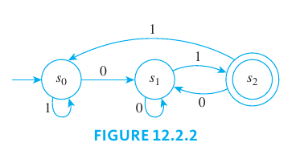
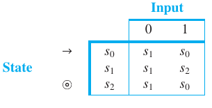

The theoretical foundations of computer science are derived from several disciplines: logic (the foundations of mathematics), electrical engineering (the design of switching circuits), brain research (models of neurons), and linguistics (the formal specification of languages).

Although the first digital computers were not built until the early 1940s, ten years earlier Alan Turing developed a simple abstract model of a machine, now called a Turing machine, by means of which he defined what it would mean for a function to be computable.

As a result, Church formulated a conjecture, now known as the Church-Turing thesis, asserting that the Turing machine is universal in the sense that anything that can ever be computed on a machine can be computed with a Turing machine.

Another development of the 1950s was the introduction of high-level computer languages. During the same years, linguist Noam Chomsky’s attempts to understand the underlying principles by means of which human beings generate speech led him to develop a theory of formal languages, which he defined using sets of abstract rules, called grammars, of varying levels of complexity. It soon became apparent that Chomsky’s theory was of great utility in the analysis and construction of computer languages. For computer science, the most useful of Chomsky’s language classifications are also the two simplest: the regular languages and the context-free languages.

Regular languages, which are defined by regular expressions, are used extensively for matching patterns within text (as in word processing or Internet searches) and for lexical analysis in computer language compilers.

Using the [Backus-Naur notation](/math/dma/10_graph_theory#a-parse-tree), context-free languages can describe many of the more complex aspects of modern high-level computer languages, and they form the basis for a key part of compilers, which translate programs written in a high-level language into machine code suitable for execution.

A remarkable fact is that all the subjects referred to previously are related. Each context-free grammar turns out to be equivalent to a type of automaton called a pushdown automaton, and each regular expression turns out to be equivalent to a type of automaton called a finite-state automaton.

## Formal Languages and Regular Expressions

Computer languages are similar to English in that certain strings of characters are legitimate words of the language and certain strings of words can be put together according to certain rules to form syntactically correct programs. A compiler for a computer language analyzes the stream of characters in a program—first to recognize individual word and sentence units (this part of the compiler is called a **lexical scanner**), then to analyze the syntax, or grammar, of the sentences (this part is called a **syntactic analyzer**), and finally to translate the sentences into machine code (this part is called a **code generator**).

> [!TIP] **Basic Concepts**
>
> - **Alphabet $\Sigma$**: a finite set of characters
> - **String over $\Sigma$**: a finite juxtaposition of elements (called **characters**) of $\Sigma$ or the null string $\lambda$.
> - **Length of a string over $\Sigma$**: the number of characters that made up the string, with the null string having length $0$
> - **Formal language over $\Sigma$** a set of strings over the alphabet

> [!TIP] **Notation**
>
> Let $\Sigma$ be an alphabet. For each non-negative integer $n$, let
>
> - $\Sigma^n$ be the set of all strings over $\Sigma$ that have length $n$
> - $\Sigma^+$ be the set of all strings over $\Sigma$ that have length at least $1$
> - $\Sigma^*$ be the set of all strings over $\Sigma$

Note that $\Sigma^n$ is essentially the Cartesian product of $n$ copies of $\Sigma$. The language $\Sigma^*$ is called the **Kleene closure of $\Sigma$**, and $\Sigma^+$ is called the **positive closure of $\Sigma$**.

### Infix, Prefix and Postfix notations

An expression such as $a + b$, in which a binary operator such as $+$ sits between the two quantities on which it acts, is said to be written in **infix notation**. Alternative notations are called **prefix notation** (in which the binary operator precedes the quantities on which it acts) and **postfix notation** (in which the binary operator follows the quantities on which it acts).

Prefix and postfix notations were introduced in 1920 by the Polish mathematician [Jan Łukasiewicz](https://wikipedia.org/wiki/Jan_%C5%81ukasiewicz), they are often referred to as **Polish notation** and **reverse Polish notation**, respectively.

The following definition describes ways in which languages can be combined to form new languages.

> [!NOTE] **Construction of Languages**
>
> Let $\Sigma$ be an alphabet. Given any strings $x$ and $y$ over $\Sigma$, the concatenation of $x$ and $y$ is the string obtained by writing all the characters of $x$ followed by all the characters of $y$. For any languages $L$ and $L'$ over $\Sigma$, three new languages can be defined as follows:
>
> - The **concatenation of $L$ and $L'$**, denoted $LL'$ is $$LL' = \{xy | x \in L \text{ and } y \in L'\}$$
> - The **union of $L$ and $L'$**, denoted $L\cup L'$ is $$L \cup L' = \{xy | x \in L \text{ or } y \in L'\}$$
> - The **Kleene closure of $L$**, denoted $L^*$ is $$L^* = \{x | x \text{ is a concatenation of any finite number of strings in } L\}$$

### The Language Defined by a Regular Expression

One of the most useful ways to define a language is by means of a regular expression, a concept first introduced by [Stephen Kleene](https://wikipedia.org/wiki/Stephen_Kleene).

> [!NOTE] **Regular Expression over an Alphabet**
>
> Given an alphabet $\Sigma$, the following are regular expressions over $\Sigma$:
>
> 1.  Base: $\emptyset, \lambda$, and each individual symbol in $\Sigma$ are regular expressions over $\Sigma$.
> 2.  Recursion: If $r$ and $s$ are regular expressions over $\Sigma$, then the following are also regular expressions over $\Sigma$:
>     - the concatenation of $r$ and $s$, denoted by $(rs)$,
>     - the union of $r$ and $s$, denoted by $(r|s)$ and
>     - the concatenation of $r$ with itself any finite number of times, denoted by $r^*$, also called **Kleene closure of $r$**.
> 3.  Restriction: Nothing is a regular expression over $\Sigma$ except for objects defined in (I) and (II) above.

Given a finite alphabet, every regular expression over the alphabet defines a formal language.

> [!NOTE] **Formal Language for a Regular Expression**
>
> For any finite alphabet $\Sigma$, the function $L$ that associates a language to each regular expression over $\Sigma$ is defined by (I)–(III) below. For each such regular expression $r$, $L(r)$ is called the language defined by $r$.
>
> 1. Base: $L(\emptyset) = \emptyset$, $L(\lambda) = \\{\lambda\\}$, $L(a) = \\{a\\}$ for every $a$ in $\Sigma$.
> 2. Recursion: If $L(r)$ and $L(r')$ are the languages defined by the regular expressions $r$ and $r'$ over $\Sigma$, then
>
> $$L(rr') = L(r)L(r')$$
>
> $$L(r|r') = L(r)\cup L(r')$$
>
> $$L(r^*) = L(r)^*$$
>
> 3. Restriction: The function $L$ is completely determined by I and II above.

## Finite-State Automata

> [!NOTE] **Combinational Circuit**
>
> A **combinational circuit** is characterized by the fact that its output is completely determined by its input/output table.

> [!NOTE] **Sequential Circuit**
>
> The behavior of a **sequential circuit** is a function not only of the input to the circuit but also of the state the circuit is in when the input is received.

A **finite-state automaton** is an idealized machine that embodies the essential idea of a sequential circuit. The basic theory of automata was developed to answer very theoretical questions about the foundations of mathematics posed by the great German mathematician [David Hillbert](https://wikipedia.org/wiki/David_Hilbert) in 1900. The ground-breaking work on automata was done in the mid-1930s by the English mathematician and logician [Alan Turing](https://wikipedia.org/wiki/Alan_Turing).

### Definition of a Finite-State Automaton

> [!NOTE] **Finite-State Automaton**
>
> A **finite-state automaton $A$** consists of five objects:
>
> 1. A finite set $I$, called the **input alphabet**, of input symbols.
> 2. A finite set $S$ of **states** the automaton can assume.
> 3. A designated state $s_0$ called the **initial state**.
> 4. A designated set of states called the set of **accepting states**.
> 5. A next-state function $N: S \times I \rightarrow S$ that associates a “next-state” to each ordered pair consisting of a “current state” and a “current input.” For each state $s$ in $S$ and input symbol $m$ in $I$, $N(s, m)$ is the state to which $A$ goes if $m$ is input to $A$ when $A$ is in state $s$.

The operation of a finite-state automaton is commonly described by a diagram called a **(state-) transition diagram**.

The **next-state table** for an automaton shows the values of the next-state function $N$ for all possible states $s$ and input symbols $i$. In the annotated next-state table, the initial state is indicated by an arrow and the accepting states are marked by double circles.

### The Language Accepted by an Automaton

Now suppose a string of input symbols is fed into a finite-state automaton in sequence. At the end of the process, after each successive input symbol has changed the state of the automaton, the automaton ends up in a certain state, which may be either an accepting state or a non-accepting state.

In this way, the action of a finite-state automaton separates the set of all strings of input symbols into two subsets: those that send the automaton to an accepting state and those that do not. Those strings that send the automaton to an accepting state are said to be accepted by the automaton.

> [!NOTE] **The Language Accepted by an Automaton**
>
> Let $A$ be a finite-state automaton with set of input symbols $I$. Let $I*$ be the set of all strings over $I$, and let $w$ be a string in $I^*$. Then $w$ is accepted by $A$ if, and only if, $A$ goes to an accepting state when the symbols of $w$ are input to $A$ in sequence from left to right, starting when $A$ is in its initial state. The language accepted by $A$, denoted $L(A)$, is the set of all strings that are accepted by $A$.

### The Eventual-State Function

> [!NOTE] **The Eventual-State Function**
>
> Let $A$ be a finite-state automaton with set of input symbols $I$, set of states $S$, and next-state function $N: S \times I \leftarrow S$. Let $I*$ be the set of all strings over $I$, and define the **eventual-state function** $N*: S \times I* \rightarrow S$ as follows:
>
> For any state $s$ and for any input string $w$
>
> $$N^*(s, w) = \begin{bmatrix}\text{the state to which } A \text{ goes if the} \\ \text{symbols of } w \text{ are input to } A \text{ in sequence} \\ \text{ starting when } A \text{ is in state } s\end{bmatrix}$$

The definitions of string and language accepted by an automaton can be restated symbolically using the eventual-state function. Suppose $A$ is a finite-state automaton with set of input symbols $I$ and next-state function $N$, and suppose that $I*$ is the set of all strings over $I$ and that $w$ is a string in $I*$.

$$
w \text{ is accepted by } A \Leftrightarrow N^*(s_0, w) \text{ is an accepting state of } A
$$

$$
L(A) = \{w \in I^* | N^*(s_0, w) \text{ is an accepting state of } A\}
$$

### Finite-State Automata and Regular Expressions

In the previous sections, each time we considered a language accepted by a finite-state automaton, we found a regular expression that defined the same language. [Stephen Kleene](https://wikipedia.org/wiki/Stephen_Kleene) showed that our ability to do this is not sheer coincidence.

> [!TIP] **Kleene's Theorem, Part 1**
>
> Given any language that is accepted by a finite-state automaton, there is a regular expression that defines the same language.

> [!TIP] **Kleene's Theorem, Part 2**
>
> Given any language defined by a regular expression, there is a finite-state automaton that accepts the same language.

> [!NOTE] **Regular Language**
>
> A **regular language** is the language defined by a regular expression.
