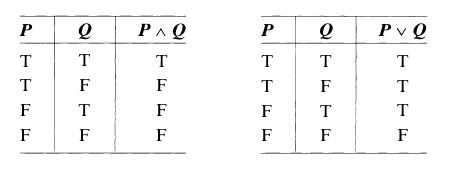
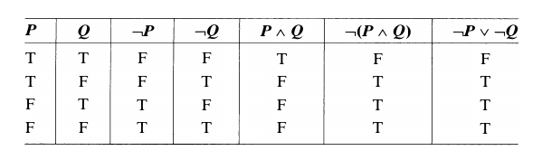
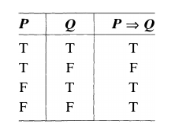

## Statements

Contrary to popular opinion, mathematics is not just computations and equations. It might be better described as an attempt to determine which statements are true and which are not. The process of discovery in mathematics is twofold.

1. First comes the formulation of a mathematical statement or conjecture.
2. The second part of the process is the verification or proof that the statement that we have formulated is true or false.

> [!NOTE] **Statement**
>
> An **statement** is any declarative sentence that is either true or false.

A statement then will have a truth value. It is either true or false. It cannot be neither true nor false and it cannot be both true and false.

For convenience, we often use letters, most often $P$ or $Q$, to denote statements.

> [!NOTE] **Axiom**
>
> We say an **axiom** is a statement that we accept as a given.

> [!NOTE] **Porposition**
>
> A **proposition** is a statement derived from axioms.

> [!NOTE] **Open Sentence**
>
> An open sentence is any declarative sentence containing one or more variables that is not a statement but becomes a statement when the variables are assigned values.

The values that can be assigned to the variables of an open sentence will depend on the context. They may come from the real numbers or from the complex numbers or even just the positive integers. An open sentence is usually written $P(x)$, $P(x, y)$, $P(x, y, z)$, and so on, depending on the number of variables used.

### Quantifiers

An open sentence like $x + 1 = 2$ can be made into a statement by substituting a value for the variable or, in the case of an open sentence with more than one variable, by substituting a value for each of the variables.

Another way an open sentence can be made into a statement is by introducing **quantifiers**. For example, for the open sentence $x + 1 = 2$, we could say: For every real number $x$, $x + 1 = 2$. This sentence is now a mathematical statement that happens to be false.

The quantifier introduced here is the phrase "for every real number $x$" and is called a **universal** quantifier. Another way to modify $P(x)$ is to write: there is a real number $x$ such that $x + 1 = 2$. Note that this statement is true. The quantifier in this example, "there is a real number $x$," is called **existential**.

Once a quantifier is applied to a variable, then the variable is called a **bound variable**. A variable that is not bound is called a **free variable**.

If $P(x)$ is an open sentence, then the statement: "For all $x$, $P(x)$" means that for every assigned value a of the variable $x$, the statement $P(a)$ is true. The statement "For some $x$, $P(x)$" means that for some assigned value of the variable $x$, say $x = a$, the statement $P(a)$ is true. This statement may also be worded: "There exists a value of $x$ such that $P(x)$".

### Negations

The two following statements "All triangles are isosceles" and "There is a real number whose square is negative," are false. To prove that they are false it is necessary to prove that the negations of these statements are true.

> [!NOTE] **Negation**
>
> If $P$ is a statement, the **negation** of $P$, written $\lnot P$, is the statement "$P$ is false".

We can also talk about the negation of open sentences $P(x)$, $P(x, y)$, $P(x, y, z), \cdots$ in one or more variables. To use the one-variable case as an example, we will write $\lnot P(x)$, read "not $P(x)$," to mean the open sentence in the variable $x$ that becomes the statement $\lnot P(a)$ when $x$ is assigned the value $a$.

Every statement can be negated by simply putting the phrase "it is not true that" in front of it. Usually, though, expressing the negation this way does not convey what the negated statement actually means, which generally happens with universal or existential statements. For example:

> - $P$: Every polynomial function is continuous everywhere.
> - $\lnot P$: There exists a polynomial function that is not continuous somewhere.

There are really two universal quantifiers in statement $P$. It says that _all_ polynomial functions are continuous at _all_ real numbers. So the negation should say that _some_ polynomial functions are not continuous at _some_ real numbers.

If we negate a statement with an existential quantifier, then a universal quantifier is required.

> - $P$: Some real-valued functions are not integrable.
> - $\lnot P$: Every real-valued function is integrable.

> [!TIP] **Negation of Statements with Quantifiers**
>
> 1. **Rule 1**: The negation of the statement "For all $x$, $P(x)$" is the statement "For some $x$, $\lnot P(x)$."
> 2. **Rule 2**: The negation of the statement "For some $x$, $P(x)$" is the statement "For all $x$, $\lnot P(x)$."

Of course, if a statement contains both universal and existential quantifiers, then in order to negate the statement, it is necessary to apply both of these rules.

> - $P$: For every real number $x$, there is an integer $n$ such that $n > x$.
> - $\lnot P$: There is a real number $x$ such that for every integer $n$, $n \leq x$.

## Compound Statements

Statements, especially in mathematics, are often complicated but can be seen as built up from simpler statements. Such compound statements can be constructed in several different ways, at least two of which are very easy.

> [!NOTE] **Conjunction**
>
> Let $P$ and $Q$ be statements
>
> The **conjunction** of $P$ and $Q$, written $P \land Q$ is the statement "Both $P$ and $Q$ are true".

Obviously, $P \land Q$ is true if $P$ is true and $Q$ is true. Notice, though, that there are three ways for $P \land Q$ to be false: if $P$ is true but $Q$ is false, if $P$ is false but $Q$ is true, and if both $P$ and $Q$ are false.

> [!NOTE] **Disjuction**
>
> Let $P$ and $Q$ be statements
>
> The **disjunction** of $P$ and $Q$, written $P \lor Q$ is the statement "Both $P$ and $Q$ are true".

The disjunction is sometimes referred to as "the inclusive or": it's all right for both statements to be true. There is only one way for $P \lor Q$ to be false: both $P$ and $Q$ must be false. That there are three ways for $P \lor Q$ to be true is inherent in the definition.

### Truth Tables

Note that the preceding comments about the truth or falsity of $P \land Q$ and $P \lor Q$ apply to any statements substituted for $P$ and $Q$. For this reason, it makes sense to consider expressions of the form $P \land Q$, $P \lor Q$, or $\lnot P$ where $P$ and $Q$ are variables representing unspecified statements. Such expressions are called **statement forms**. They are not really statements themselves but become statements when the variables $P$ and $Q$ are replaced by statements.

We can summarize the comments made previously about the truth values of $P \land Q$ and $P \lor Q$ by means of truth tables for their statement forms.

Note that the first two columns of each table list all of the different combinations of truth values for the variables $P$ and $Q$. Each combination then determines a corresponding truth value of the statement form.

### Logically Equivalent Statements

> [!NOTE] **Logically Equivalent Statements**
>
> We say that two statements are **logically equivalent** or just **equivalent** if they are both true or both false.
>
> We say that two statement forms are **logically equivalent** if the substitution of statements for the variables in the forms always yields logically equivalent statements.

Note that if two statement forms have the same truth tables then they are logically equivalent.

The preceding truth table shows that the statement forms $\lnot(P \land Q)$ and $(\lnot P) \lor (\lnot Q)$ are logically equivalent. In other words, given any two statements $P$ and $Q$, $P \land Q$ is false exactly when $P$ or $Q$ is false.

### Tautologies and Contradictions

Sometimes a statement form will always be true no matter what statements are substituted for the variables. Such a statement form is called a **tautology**. A simple example is the statement form $P \lor \lnot P$.

A statement form that is always false is called a **contradiction**. The statement form $P \land \lnot P$ is an example. A statement form is a contradiction if each of its truth table values is false.

## Implications

In the previous two sections, many of the statements we looked at took the form: "If ..., then ..." or "For all ..., if ..., then ...." The "if-then" part of such a statement is called an **implication**. The "if" part of the statement gives the premise or assumption that is made. The "then" part is the **conclusion** that is asserted to follow from the premise.

> [!NOTE] **Implication**
>
> Let $P$ and $Q$ be statements. The **implication** $P \Rightarrow Q$ is the statement "If $P$ is true, then $Q$ is true".

### Truth Table for an Implication

The statement $P \Rightarrow Q$ simply means that in all circumstances under which $P$ is true, $Q$ is also true. Very loosely, whenever $P$ "happens," $Q$ also "happens". With this in mind, when would $P \Rightarrow Q$ be false? We would need $P$ to "happen" ($P$ true) and $Q$ not to "happen" ($Q$ false) . **This is the only case**.

Seen another way, $P \Rightarrow Q$ can't be false (so must be true) if $P$ is false. Even if $P$ and $Q$ are both false the implication $P \Rightarrow Q$ is true. If $P$ is true, though, $Q$ must also be true for $P \Rightarrow Q$ to be true. The following table gives the truth values of the statement form $P \Rightarrow Q$.

### Proving Statements Containing Implications

Most often we will be interested in establishing the truth of (proving ) statements of the form $\forall x, P(x) \Rightarrow Q(x)$ where $P(x)$ and $Q(x)$ are open sentences. Since $P(x)$ and $Q(x)$ are not statements, the expression $P(x) \Rightarrow Q(x)$ is not a statement either. $P(x) \Rightarrow Q(x)$ is the open sentence in the variable $x$ that becomes the statement $P(a) \Rightarrow Q(a)$ when $x$ is assigned the value $a$. But recall that the expression $\forall x, P(x) \Rightarrow Q(x)$ is a statement because the variable $x$ has been quantified.

Since, for an assigned value a of $x$, the statement $P(a) \Rightarrow Q(a)$ will always be true if $P(a)$ is false, we ne'ed not consider this case. Rather, we can assume that, if the variable $x$ is assigned a value $a$, then $P(a)$ is true and proceed from there to prove $Q(a)$. $P(a)$ is called the **hypothesis**, and $Q(a)$ the **conclusion**. We use a letter, in this case $a$, to denote the assigned value of the variable $x$ rather than give a specific value to $x$ like $0$ or $2$, since we must prove that $P(a) \Rightarrow Q(a)$ for every possible assigned value of $x$.

### Negating an Implication: Counterexamples

If $P$ and $Q$ are statement forms, then $\lnot (P \Rightarrow Q)$ is logically equivalent to $P \land \lor Q$. It follows then that if $P(x)$ and $Q(x)$ are open sentences, the negation of the statement "For all $x$, $P(x) \Rightarrow Q(x)$" is the statement "There exists $x$ such that $P(x) \land \lor Q(x)$".

The value assigned to the variable $x$ that makes $P(x)$ true and $Q(x)$ false is called a **counterexample** to the statement "For all $x$, $P(x) \Rightarrow Q(x)$."

### Necessary and Sufficient Conditions

> [!TIP] **Sufficient Condition**
>
> Given statements $P$ and $Q$, the implication $P \Rightarrow Q$ means, as we have seen, that if $P$ is true, then $Q$ is true. We say then that $P$ is a sufficient condition for $Q$.

> [!TIP] **Necessary Condition**
>
> Also, if $P \Rightarrow Q$ is a true statement, we say that $Q$ is a necessary condition for $P$, meaning that $Q$ must be true in order for $P$ to be true.
