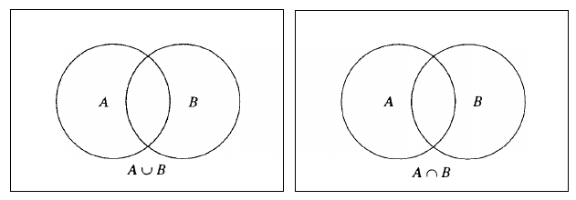

## Sets and Subsets

The objects in a set are called **elements**. We use the notation $a \in A$ to express that the object $a$ is an element of the set $A$, and often simply say "$a$ is in $A$."

Special notation is sometimes used for very common sets. We use $\mathbb{R}$ for the set of **real numbers**, and $\mathbb{Z}$ (from the German "Zahlen," meaning "numbers") for **the set of all integers**. The set consisting of just the **positive integers** is denoted $\mathbb{Z}^+$ The **set of rational numbers**, those of the form $\frac{m}{n}$, where $m$ and $n$ are integers with $n \neq 0$, is denoted $\mathbb{Q}$ (for "quotient").

In many discussions, we will be dealing only with elements of a certain, fixed set, say $U$. Such a set $U$ provides a context, or a "universal set" for the discussion.

In general, if $S$ is a given set, $A = \\{x \in S | P(x)\\}$ denotes the set of all elements $x$ in $S$ such that the open sentence $P(x)$ is a true statement. We say that $A$ is the **truth set** of the open sentence $P(x)$.

One particular class of such sets are **intervals**.

> [!NOTE] **Interval**
>
> A subset $I$ of the set of real numbers $\mathbb{R}$ is called an interval if $I \neq \emptyset$, $I$ contains more than one element, and for every $x$ and $y$ in $I$ such that $x < y$, $[x, y] \subseteq I$.

$$
[a, b] = \{x \in \mathbb{R} | a \leq x \leq b\}, \text{ called the closed interval from a to b}
$$

$$
(a, b) = \{x \in \mathbb{R} | a < x < b\}, \text{ called the open interval from a to b}
$$

$$
(a, b] = \{x \in \mathbb{R} | a < x \leq b\}
$$

$$
[a, b) = \{x \in \mathbb{R} | a \leq x < b\}
$$

$$
[a, \infty) = \{x \in \mathbb{R} | x \geq a\}
$$

$$
(a, \infty) = \{x \in \mathbb{R} | x > a\}
$$

$$
(-\infty, a] = \{x \in \mathbb{R} | x \leq a\}
$$

$$
(-\infty, a) = \{x \in \mathbb{R} | x < a\}
$$

$$
(-\infty, \infty) = \mathbb{R}
$$

The first four types of intervals are called **bounded intervals** and the last five are called **unbounded intervals**. Types 3 and 4 are called **half-open**, **half-closed** intervals. Note that the symbol $\infty$ is not a real number but is only used as a convenient notation for unbounded intervals.

Some of the sets we've seen are **infinite**, that is, contain infinitely many elements. The others are said to be **finite**, and we denote the number of elements in such a set, called **the cardinality of $A$**, by $|A|$.

### Subsets

Usually the elements of a set belong to another, bigger set. For instance, all of the elements of the set of integers $\mathbb{Z}$ belong to the set $\mathbb{R}$ of real numbers.

> [!NOTE] **Subset**
>
> Let $A$ and $B$ be sets. We say that $A$ is a **subset** of $B$, and write $A \subseteq B$, if every element of $A$ is also an element of $B$.

> [!NOTE] **Proper Subset**
>
> If $A$ is a subset of $B$ and $A \neq B$, we write $A \subset $ and say that $A$ is a **proper subset** of $B$.

Note: If $A$ is a subset of a set $B$, we will usually write $A \subseteq B$ even if $A \neq B$ unless we wish to make particular note of the fact that $A$ is a proper subset of $B$.

To prove the statement $A \subseteq B$, it is usually necessary to take an arbitrary element of $A$ and show that it is an element of $B$. This means letting the variable $x$ be assigned a value, say $x = a$, and then proving the implication "$a \in A$" $\rightarrow$ "$a \in B$." So we start the proof by saying: let $a \in A$, and then we prove that $a \in B$.

> [!NOTE] **Set Equality**
>
> We say two sets $A$ and $B$ are **equal**, written $A = B$, if they have the same elements.

Two sets $A$ and $B$ are equal if and only if every element of $A$ is an element of $B$ and every element of $B$ is an element of $A$. In other words, $A = B \Leftrightarrow (A \subseteq B \land B \subseteq A)$. So proving that two sets are equal often requires two proofs.

### Complements

We often want to determine if a given element is not in some set. We introduce the following definition.

> [!NOTE] **Complement**
>
> Let $A$, $B$ be sets. The **complement of $A$ in $B$**, denoted $B - A$, is $\\{b \in B | b \notin A\\}$.

For convenience, if $U$ is a universal set, we will write $U - A = \overline{A}$, called simply the **complement of $A$**.

We call a set with no elements **the empty set**, and we denote it $\emptyset$. Note that if $U$ is a universal set, then $\overline{U} = \emptyset$ and $\emptyset = \overline{U}$.

## Combining Sets

### Unions and Intersections

It is possible to create new sets out of two or more given sets. The two most common ways of doing this are given in the following definition.

> [!NOTE] **Union of Sets**
>
> Let $A$ and $B$ be sets. The **union of $A$ and $B$**, denoted $A \cup B$, is ${x | x \in A \lor x \in B}$.

> [!NOTE] **Intersection of Sets**
>
> Let $A$ and $B$ be sets. The **intersection of $A$ and $B$**, denoted $A \cap B$, is ${x | x \in A \land x \in B}$.

In order to visualize the union and intersection of sets, we often use the interiors of circles to represent a set. This type of representation is called a **Venn diagram**. Next we see the Venn diagrams for the union and intersection of two sets.

It is clear from this picture that the order in which we write the union and intersection does not matter. In other words, for any sets $A$ and $B$, $A \cup B = B  \cup A$ and $A \cap B = B \cap A$.

We list these properties of sets as well as some additional ones in the following proposition.

> [!TIP] **Set Properties**
>
> The following statements are true for all sets $A$, $B$, and $C$.
>
> 1. $A \cup B = B \cup A$
> 2. $A \cap B = B \cap A$
> 3. $(A \cup B) \cup C = A \cup (B \cup C)$
> 4. $(A \cap B) \cap C = A \cap (B \cap C)$
> 5. $A \subseteq A \cup B$
> 6. $A \cap B \subseteq A$
> 7. $\emptyset \subseteq A$
> 8. $A \cup \emptyset = A$
> 9. $A \cap \emptyset = \emptyset$

**Proof**: Properties $1$ through $4$ are clear from the appropriate Venn diagrams above. Similarly, Venn diagrams can be drawn to illustrate Properties $5$ and $6$.

For $7$, a diagram is no help because we cannot draw the empty set. To prove that $\emptyset \subseteq A$, it is necessary to prove the statement $\forall x \in U P(x) \Rightarrow Q(x)$, where $P(x)$ is the open sentence "$x \in \emptyset$" and $Q(x)$ is the open sentence "$x \in A$." But for any choice of the variable $x$, the hypothesis $P(x)$ is false since $\emptyset$ contains no elements. Therefore, the implication $P(x) \Rightarrow Q(x)$ is always true. Hence $\emptyset \subseteq A$ for every set $A$.

> [!TIP] **Intersection and Unions Properties**
>
> Let $A$, $B$, and $C$ be sets. Then
>
> $$A \cap (B \cup C) = (A \cap B) \cup (A \cap C)$$
>
> $$A \cup (B \cap C) = (A \cup B) \cap (A \cup C)$$

**Proof**: Let $x \in A \cap (B \cup C)$. Then $x \in A$ and $x \in B \cup C$, so $x \in B$ or $x \in C$.

If $x \in B$, then since we know that $x \in A$, we have $x \in A \cap B$. Also we know that $A \cap B \subseteq (A \cap B) \caup (A \cap C)$ by Property 5, so $x \in (A \cap B) \cup (A \cap C)$.

Similarly, if $x \in C$, we have that $x \in A \cap C$. And thus $x \in (A \cap B) \cup (A \cap C)$.

We have therefore shown that $A \cap (B \cup C) \subseteq (A \cap B) \cup (A \cap C)$.

To establish the reverse, let $x \in (A \cap B) \cup (A \cap C)$. Then $x \in A \cap B$ or $x \in A \cap C$.

In the former case, we have $x \in A$ and $x \in B$, but since $B \subseteq B \cup C$, $x \in B \cup C$, so $x \in A \cap (B \cup C)$.

A similar argument works in the latter case, so in either case we have $x \in A \cap (B \cup C)$.

Therefore $(A \cap B) \cup (A \cup C) \subseteq A \cap (B \cup C)$.

We have now proven that $A \cap (B \cup C) = (A \cap B) \cup (A \cap C)$.

### DeMorgan's Laws

> [!NOTE] **DeMorgan's Laws**
>
> Let $A$ and $B$ be sets contained in some universal set $U$. Then
>
> $$\overline{A \cup B} = \overline{A} \cap \overline{B}$$
>
> $$\overline{A \cap B} = \overline{A} \cup \overline{B}$$

**Proof**. We need to show:

1. $\overline{A \cup B} \subseteq \overline{A} \cap \overline{B}$
2. $\overline{A} \cap \overline{B} \subseteq \overline{A \cup B}$

To show that $\overline{A \cup B} \subseteq \overline{A} \cap \ovelrine {B}$ we start by letting $x \in \overline{A \cup B}$. This means that $x$ is not in $A \cup B$, so $x$ cannot be in either $A$ or $B$. Thus $x$ is not in $A$ and $x$ is not in $B$. Hence $x \in \overline{A}$ and $x \in \overline{B}$, or equivalently $x \in \overline{A} \cap \overline{B}$. This proves that $\overline{A \cup B} \subseteq \overline{A} \cup \overline{B}$.

Conversely, let $x \in \overline{A} \cap \overline{B}$. Then $x \in \overline{A}$ and $x \in \overline{B}$, or equivalently $x \notin A$ and $x \notin B$. So $x$ is not in either $A$ or $B$, or in other words $x \notin A \cup B$. Hence $x \in \overline{A \cup B}$. Thus $\overline{A} \cap \overline{B} \subseteq \overline{A \cup B}$.

It follows that $\overline{A \cup B} = \overline{A} \cap \overline{B}$.

### Cartesian Products

We now define a set that is the "product" of two sets in a very satisfactory way.

> [!NOTE] **Cartesian Product**
>
> Let $A$ and $B$ be sets. The **Cartesian product** of $A$ and $B$, written $A \times B$ is
>
> $$\{(a, b) | a \in A \text{ and } b \in B\}$$

Informally, $A \times B$ is a set of pairs of objects. The first object is chosen from $A$ and the second from $B$. Notice that we distinguish the order (these are commonly called **ordered pairs**).

## Collection of Sets

In this section we consider sets whose elements are themselves sets. For example, we could consider the collection of all sets of integers that contain the integer $1$. Such a collection, let's call it $S$, could be expressed in the following way: $S = \\{A \subseteq Z | 1 \in A\\}$. $S$ is a set whose elements are sets, specifically, sets of integers.

### Power Set

An important example of a set of sets is the power set of a setas follows:

> [!NOTE] **Power Set**
>
> Let $A$ be a set. The **power set** of $A$, written $\mathcal{P}(A)$, is
>
> $$\{X | X \subseteq A\}$$

The power set of $A$, then, is the set of all subsets of $A$. The elements of $\mathcal{P}(A)$ are themselves sets of elements of $A$.

### Indexing Sets

Suppose that we have a finite number of sets, $A_1, A_2, \cdots, A_n$, all contained in some universal set $U$. The collection of such sets would be written $\\{A_1, A_2, \cdots, A_n\\}$. The subscripts that are used to distinguish the sets in this collection form what is called the **indexing set** for the collection. If we denote this indexing set by $I$, then $I = \\{1, 2, \cdots, n\\}$ and this collection can be written $\\{A_i | i \in I\\}$.

Suppose that we wanted to talk about the union of the sets in this collection. This would be the set $A_1 \cup A_2 \cup \cdots A_n = \\{x \in U | x \in A_i \text{ for some } i = 1, 2, \cdots n\\}$. A shorthand notation for this union is $\cup_{i=1}^n A_i$.

> [!TIP] **Union of a Collection**
>
> Let $I$ be a set, and $\\{A_i | i \in I\\}$ a collection of sets. The **union** of the collection, denoted $\cup_{i \in I} A_i$ is
>
> $$\{a | a \in A_i, \text{ for some } i \in I\}$$

> [!TIP] **Intersection of a Collection**
>
> Let $I$ be a set, and $\\{A_i | i \in I\\}$ a collection of sets. The **intersection** of the collection, denoted $\cap_{i \in I} A_i$ is
>
> $$\{a | a \in A_i, \text{ for all } i \in I\}$$

Sometimes we may wish to discuss a collection of sets without actually specifying a particular indexing set. We may simply say: let $S$ be a collection of sets, and to denote the union and intersection we write $\cup_{A \in S} A$ and $\cap_{A \in S} A$.

An example of this notation appears next in the definition of **partition**.

### Partitions

> [!NOTE] **Partition**
>
> Let $A$ be a set. A **partition** of $A$ is a subset $P$ of $\mathcal{P}(A)$ such that:
>
> 1. if $X \in P$ then $X \neq \emptyset$
> 2. $\cup_{X \in P} X = A$
> 3. if $X, Y \in P$ and $X \neq Y$, then $X \cap Y = \emptyset$

That is, a partition of a set divides the set into different nonempty subsets so that every element of the set is in one of the subsets and no element is in more than one.

### The Pigeonhole Principle

Recall that if $A$ is a finite set, then $|A|$, the cardinality of $A$, is the number of elements in $A$. The following result, that the cardinality of the union of two finite disjoint sets is the sum of the cardinalities of the two sets, may seem obvious , as it should, but a rigorous proof requires a more formal definition of what it means for a set to be finite than we have presented here, so we simply state the result.

> [!TIP] **Cardinality of the Union of two Disjoint Sets**
>
> Let $A$ and $B$ be finite disjoint sets. Then
>
> $$|A \cup B| = |A| + |B|$$

The following corollary is an extension of the previous theorem.

> [!TIP] **Cardinality of the Union of $n$ Disjoint Sets**
>
> Let $A_1, A_2, \cdots, A_n$ be a collection of finite mutually disjoint sets. Then
>
> $$|\cup_{i = 1}^n A_i| = \sum_{i=1}^n |A_i|$$

> [!TIP] **Cardinality of the Union of two Sets**
>
> Let $A$ and $B$ be finite sets. Then
>
> $$|A \cup B| = |A| + |B| - |A \cap B|$$

We can now discuss the **Pigeonhole Principle**. In its simplest form, the Pigeonhole Principle says that if $n$ objects are placed in $k$ containers and $n > k$, then at least one container will have more than one object in it.

Let $A_1, A_2, \cdots, A_n$ be a collection of finite mutually disjoint sets. Let $A = \cup_{i = 1}^n A_i$. If $|A| = k$ and $k > n$, then, for some $i$, $|A_i| \geq 2$.

A generalization of the Pigeonhole Principle is the following theorem.

> [!TIP] **Generation of the Pigeonhole Principle**
>
> Let $A_1, A_2, \cdots, A_n$ be a collection of finite mutually disjoint sets. Let $A = \cup_{i=1}^n A_i$. Suppose that $|A| > nr$ for some positive integer $r$. Then, for some $i$, $|A_i| \geq r + 1$.
