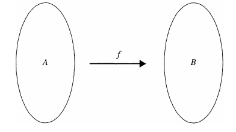
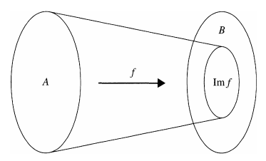
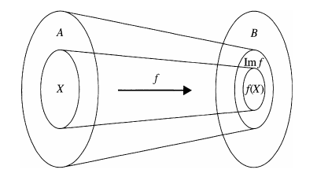

## Definition and Basic Properties

> [!NOTE] **Function**
>
> Let $A$ and $B$ be nonempty sets. A **function** $f$ from $A$ to $B$ is a rule that assigns to each element in the set $A$ one and only one element $b$ in the set $B$.
>
> We call $A$ the **domain** of $f$ and $B$ the **codomain**; we write $f: A \rightarrow B$, and for each $a \in A$, we write $f(a) =  b$ if $b$ is assigned to $a$.

The idea of a function can be suggested by the following simple diagram:

## Image of a Function

> [!NOTE] **Image of a Function**
>
> Let $f: A \rightarrow B$ be a function. The **image** of the function $f$ is
>
> $$\text{Im } f = \{y \in B | y = f(x) \text{ for some } x \in A\}$$
>
> More generally, if $X \subseteq A$, we define
>
> $$f(X) = \{y \in B | y = f(x) \text{ for some } x \in X\}$$
>
> $f(X)$ is called the **image of $X$** under $f$. The **graph of $f$** is the set $\\{(a, b) \in A \times B | b = f(a)\\}$

As above, we can suggest the definition of $\text{Im } f$ with a simple diagram:

Similarly, for subsets $X \subseteq A$, the definition of $f(X)$ leads us to this diagram:

The image of a function $f$, then, is always a subset of the codomain. In fact, if we have a function $f: A \rightarrow B$, it is always possible to consider a very much related function $g: A \rightarrow \text{Im } f$, which we would define by $g(x) = f(x), \forall x \in A$. A subtle point here is that if $\text{Im } f \neq B$, then, despite how much they look alike, $f$ and $g$ really are different functions because they have different codomains.

> [!NOTE] **Function Equality**
>
> Two functions $f$ and $g$ are **equal** if they have the same domain and the same codomain and if $f(a) = g(a)$ for all $a$ in the domain.

For some functions, computing their images can be difficult. Sometimes the methods of calculus can be used to great advantage.

> [!NOTE] **Intermediate Value Theorem**
>
> Let $f$ be a function whose domain and codomain are subsets of $\mathbb{R}$. Assume that $f$ is continuous on the closed interval $[a, b]$. If $y$ is any number between $f(a)$ and $f(b)$, then there is a real number $x$ in $[a, b]$ such that $f(x) = y$.

> [!TIP] **Proposition 3.1.5**
>
> Let $A$ and $B$ be sets and let $f: A \rightarrow B$ be a function. Let $X$ and $Y$ be subsets of $A$. If $X \subseteq Y$, then $f(X) \subseteq f(Y)$.

**Proof**

To prove that $f(X) \subseteq f(Y)$, we must take an arbitrary element in $f(X)$ and prove that it is in $f(Y)$. So we let $y \in f(X)$. Then $y = f(x)$ for some $x \in X$. Since $X \subseteq Y$, it follows that $x \in Y$ and therefore $y \in f(Y)$. This proves that $f(X) \subseteq f(Y)$.

The converse of Proposition 3.1.5 is false. The reason that it is false boils down to the fact that if $f(a) \in f(X)$ for some $a \in A$, it does not necessarily follow that $a \in X$.

The following result tells us how the union and intersection of sets are affected when we take their image under a mapping.

> [!TIP] **Proposition 3.1.6**
>
> Let $A$ and $B$ be sets and $X$ and $Y$ subsets of $A$. Let $f: A \rightarrow B$ be a function. Then
>
> 1. $f(X \cup Y) = f(X) \cup f(Y)$
> 2. $f(X \cap Y) = f(X) \cap f(Y)$

**Proof of (1)**

Recall that if we wish to prove two sets equal, it is usually necessary to prove that each one is a subset of the other.

Let $b \in f(X \cup Y)$. Then $b = f(a)$ where $a \in X \cup Y$. So $a$ is in $X$ or $Y$. If $a \in X$, then $b \in f(X)$ and if $a \in Y$, then $b \in f(Y)$.

Thus $b \in f(X)$ or $b \in f(Y)$, which means that $b \in f(X) \cup f(Y)$. We have now proved that $f(X \cup Y) \subseteq f(X) \cup f(Y)$.

On the other hand, suppose that $b \in f(X) \cup f(Y)$. Then $b \in f(X)$ or $b \in f(Y)$.

If $b \in f(X)$, then $b = f(x)$ for some $x \in X$. Since $x \in X$, $x \in X \cup Y$ and so $b \in f(X \cup Y)$. Similarly, if $b \in f(Y)$, then $b \in f(X \cup Y)$.

In either case, we get $b \in f(X \cup Y)$ and therefore $f(X) \cup f(y) \subseteq f(X \cup Y)$.

It now follows that $f(X \cup Y) = f(X) \cup f(Y)$.

### Inverse Image

Besides computing the image of a subset of the domain of a function, we can also talk about what is known as the inverse image of a subset of the codomain.

> [!NOTE] **Inverse Image**
>
> Let $f: A \rightarrow B$ be a function and let $W$ be a subset of $B$. Then the **inverse image of $W$ with respect to $f$** is the set $\\{a \in A | f(a) \in W\\}$. We denote this set by $f^{-1}(W)$

So $f^{-1}(W)$ is the set of elements of the domain of $f$ that gets mapped to an element of $W$.

It is important to realize that in this context the symbol $f^{-1}$ does not refer to the inverse of the function $f$.

> [!TIP] **Proposition 3.1.8**
>
> Let $f: A \rightarrow B$ be a function. Let $W$ and $Z$ be subsets of $B$. Then
>
> 1. $f^{-1}(W \cup Z) = f^{-1}(W) \cup f^{-1}(Z)$
> 2. $f^{-1}(W \cap Z) = f^{-1}(W) \cap f^{-1}(Z)$

**Proof of 1**

Let $y \in f^{-1}(W \cup Z)$. Then $f(y) \in W \cup Z$, which means that $f(y) \in W$ or $f(y) \in Z$. If $f(y) \in W$, then $y \in f^{-1}(W)$ or if $f(y) \in Z$, then $y \in f^{-1}(Z)$. Thus $y \in f^{-1}(W) \cup f^{-1}(Z)$ and we have $f^{-1}(W \cup Z) \subseteq f^{-1}(W) \cup f^{-1}(Z)$.

Conversely, suppose that $y \in f^{-1}(W) \cup f^{-1}(Z)$. Then $y \in f^{-1}(W)$ or $y \in f^{-1}(Z)$. If $y \in f^{-1}(W)$, then $f(y) \in W$ or if $y \in f^{-1}(Z)$, then $f(y) \in Z$. In either case, $f(y) \in W \cup Z$, which implies that $y \in f^{-1}(W \cup Z)$. We have now proved that $f ^{-1}(W) \cup f^{-1}(Z) \subseteq f^{-1}(W \cup Z)$.

We can now conclude that $f^{-1}(W \cup Z) = f^{-1}(W) \cup f^{-1}(Z)$.

> [!TIP] **Proposition 3.1.9**
>
> Let $A$ and $B$ be sets and let $f: A \rightarrow B$ be a function. Assume that $A$ is a finite set. Then $\text{Im } f$ is a finite set and $|\text{Im } f| \leq |A|$.

**Proof**

Let $A = {a_1, a_2, \cdots, a_n}$. Then the image of $f$ consists of the distinct elements from among $f(a_1), f(a_2), \cdots, f(a_n)$. Hence $\text{Im } f$ is a finite set with at most $n$ elements.
