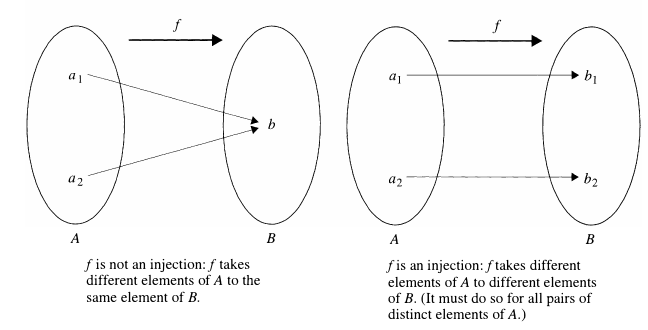
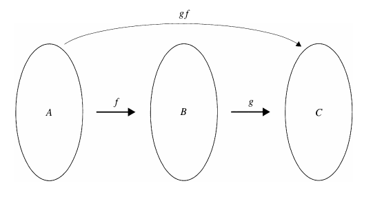
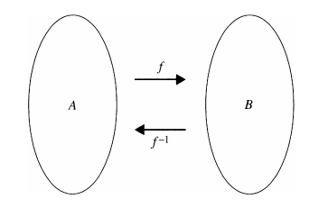
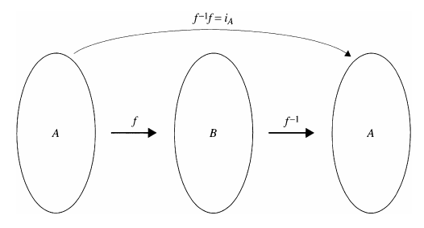

## Definition and Basic Properties

> [!NOTE] **Function**
>
> Let $A$ and $B$ be nonempty sets. A **function** $f$ from $A$ to $B$ is a rule that assigns to each element in the set $A$ one and only one element $b$ in the set $B$.
>
> We call $A$ the **domain** of $f$ and $B$ the **codomain**; we write $f: A \rightarrow B$, and for each $a \in A$, we write $f(a) =  b$ if $b$ is assigned to $a$.

The idea of a function can be suggested by the following simple diagram:

## Image of a Function

> [!NOTE] **Image of a Function**
>
> Let $f: A \rightarrow B$ be a function. The **image** of the function $f$ is
>
> $$\text{Im } f = \{y \in B | y = f(x) \text{ for some } x \in A\}$$
>
> More generally, if $X \subseteq A$, we define
>
> $$f(X) = \{y \in B | y = f(x) \text{ for some } x \in X\}$$
>
> $f(X)$ is called the **image of $X$** under $f$. The **graph of $f$** is the set $\\{(a, b) \in A \times B | b = f(a)\\}$

As above, we can suggest the definition of $\text{Im } f$ with a simple diagram:

Similarly, for subsets $X \subseteq A$, the definition of $f(X)$ leads us to this diagram:

The image of a function $f$, then, is always a subset of the codomain. In fact, if we have a function $f: A \rightarrow B$, it is always possible to consider a very much related function $g: A \rightarrow \text{Im } f$, which we would define by $g(x) = f(x), \forall x \in A$. A subtle point here is that if $\text{Im } f \neq B$, then, despite how much they look alike, $f$ and $g$ really are different functions because they have different codomains.

> [!NOTE] **Function Equality**
>
> Two functions $f$ and $g$ are **equal** if they have the same domain and the same codomain and if $f(a) = g(a)$ for all $a$ in the domain.

For some functions, computing their images can be difficult. Sometimes the methods of calculus can be used to great advantage.

> [!NOTE] **Intermediate Value Theorem**
>
> Let $f$ be a function whose domain and codomain are subsets of $\mathbb{R}$. Assume that $f$ is continuous on the closed interval $[a, b]$. If $y$ is any number between $f(a)$ and $f(b)$, then there is a real number $x$ in $[a, b]$ such that $f(x) = y$.

> [!TIP] **Proposition 3.1.5**
>
> Let $A$ and $B$ be sets and let $f: A \rightarrow B$ be a function. Let $X$ and $Y$ be subsets of $A$. If $X \subseteq Y$, then $f(X) \subseteq f(Y)$.

**Proof**

To prove that $f(X) \subseteq f(Y)$, we must take an arbitrary element in $f(X)$ and prove that it is in $f(Y)$. So we let $y \in f(X)$. Then $y = f(x)$ for some $x \in X$. Since $X \subseteq Y$, it follows that $x \in Y$ and therefore $y \in f(Y)$. This proves that $f(X) \subseteq f(Y)$.

The converse of Proposition 3.1.5 is false. The reason that it is false boils down to the fact that if $f(a) \in f(X)$ for some $a \in A$, it does not necessarily follow that $a \in X$.

The following result tells us how the union and intersection of sets are affected when we take their image under a mapping.

> [!TIP] **Proposition 3.1.6**
>
> Let $A$ and $B$ be sets and $X$ and $Y$ subsets of $A$. Let $f: A \rightarrow B$ be a function. Then
>
> 1. $f(X \cup Y) = f(X) \cup f(Y)$
> 2. $f(X \cap Y) = f(X) \cap f(Y)$

**Proof of (1)**

Recall that if we wish to prove two sets equal, it is usually necessary to prove that each one is a subset of the other.

Let $b \in f(X \cup Y)$. Then $b = f(a)$ where $a \in X \cup Y$. So $a$ is in $X$ or $Y$. If $a \in X$, then $b \in f(X)$ and if $a \in Y$, then $b \in f(Y)$.

Thus $b \in f(X)$ or $b \in f(Y)$, which means that $b \in f(X) \cup f(Y)$. We have now proved that $f(X \cup Y) \subseteq f(X) \cup f(Y)$.

On the other hand, suppose that $b \in f(X) \cup f(Y)$. Then $b \in f(X)$ or $b \in f(Y)$.

If $b \in f(X)$, then $b = f(x)$ for some $x \in X$. Since $x \in X$, $x \in X \cup Y$ and so $b \in f(X \cup Y)$. Similarly, if $b \in f(Y)$, then $b \in f(X \cup Y)$.

In either case, we get $b \in f(X \cup Y)$ and therefore $f(X) \cup f(y) \subseteq f(X \cup Y)$.

It now follows that $f(X \cup Y) = f(X) \cup f(Y)$.

### Inverse Image

Besides computing the image of a subset of the domain of a function, we can also talk about what is known as the inverse image of a subset of the codomain.

> [!NOTE] **Inverse Image**
>
> Let $f: A \rightarrow B$ be a function and let $W$ be a subset of $B$. Then the **inverse image of $W$ with respect to $f$** is the set $\\{a \in A | f(a) \in W\\}$. We denote this set by $f^{-1}(W)$

So $f^{-1}(W)$ is the set of elements of the domain of $f$ that gets mapped to an element of $W$.

It is important to realize that in this context the symbol $f^{-1}$ does not refer to the inverse of the function $f$.

> [!TIP] **Proposition 3.1.8**
>
> Let $f: A \rightarrow B$ be a function. Let $W$ and $Z$ be subsets of $B$. Then
>
> 1. $f^{-1}(W \cup Z) = f^{-1}(W) \cup f^{-1}(Z)$
> 2. $f^{-1}(W \cap Z) = f^{-1}(W) \cap f^{-1}(Z)$

**Proof of 1**

Let $y \in f^{-1}(W \cup Z)$. Then $f(y) \in W \cup Z$, which means that $f(y) \in W$ or $f(y) \in Z$. If $f(y) \in W$, then $y \in f^{-1}(W)$ or if $f(y) \in Z$, then $y \in f^{-1}(Z)$. Thus $y \in f^{-1}(W) \cup f^{-1}(Z)$ and we have $f^{-1}(W \cup Z) \subseteq f^{-1}(W) \cup f^{-1}(Z)$.

Conversely, suppose that $y \in f^{-1}(W) \cup f^{-1}(Z)$. Then $y \in f^{-1}(W)$ or $y \in f^{-1}(Z)$. If $y \in f^{-1}(W)$, then $f(y) \in W$ or if $y \in f^{-1}(Z)$, then $f(y) \in Z$. In either case, $f(y) \in W \cup Z$, which implies that $y \in f^{-1}(W \cup Z)$. We have now proved that $f ^{-1}(W) \cup f^{-1}(Z) \subseteq f^{-1}(W \cup Z)$.

We can now conclude that $f^{-1}(W \cup Z) = f^{-1}(W) \cup f^{-1}(Z)$.

> [!TIP] **Proposition 3.1.9**
>
> Let $A$ and $B$ be sets and let $f: A \rightarrow B$ be a function. Assume that $A$ is a finite set. Then $\text{Im } f$ is a finite set and $|\text{Im } f| \leq |A|$.

**Proof**

Let $A = {a_1, a_2, \cdots, a_n}$. Then the image of $f$ consists of the distinct elements from among $f(a_1), f(a_2), \cdots, f(a_n)$. Hence $\text{Im } f$ is a finite set with at most $n$ elements.

## Surjective and Injective Functions

### Surjective Functions

> [!NOTE] **Surjective Function**
>
> Let $f: A \rightarrow B$ be a function. Then $f$ is **surjective** (or a **surjection**) if, the image of $[$ equals the codomain of $f$.

In the diagram following the definition of a function, if $f: A \rightarrow B$ is surjective, the two ovals representing 1m [ and B would coincide. This leads many text authors (and many mathematicians) to use the word **onto** instead of surjective.

Proving that a function $[$ is surjective, then, entails proving that two sets are equal.

### Injective Functions

> [!NOTE] **Injective Function**
>
> Let $f: A \rightarrow B$ be a function. Then $f$ is **injective** (or an **injection**) if whenever $a_1, a_2 \in A$ and $a_1 \neq a_2$, we have $f(a_1) \neq f(a_2)$.

The accompanying diagram suggests the phrase **one-to-one**. As "onto" is used for surjective, this terminology is often used for injective.

A proof that a function $f$ is injective usually should be done as follows. Let $a_1, a_2 \in A$, where $A$ is the domain of the function, and assume $f(a_1) = f(a_2)$. Starting with this assumption, then prove that $a_1 = a_2$.

To prove that a function is not injective, we must resort to the negation of the definition. It follows that a function $f$ is not injective if $\exists a_1, a_2 \in A \text{ such that } a_1 \neq a_2 and f(a_1) = f(a_2)$. Note that this formulation fits our understanding of what it means for a function to be "not injective"; namely, $f$ maps two distinct elements of $A$ to the same element of $B$.

### Bijective Functions

> [!NOTE] **Bijective Function**
>
> A function that is both injective and surjectie is called **bijective** or a **bijection**.

> [!NOTE] **Permutation**
>
> Let $A$ be any set. A bijection $f: A \rightarrow A$ is called a **permutation** of $A$.

## Composition and Invertible Functions

We often step back from viewing functions as "rules" relating objects from different sets and study functions as objects themselves. In this way, we enrich other concepts; we can, for example, consider sets of functions, and devise ways to combine functions and create others.

> [!NOTE] **Set of Functions**
>
> Let $A$ and $B$ be nonempty sets. We define $F(A, B) = \\{f | f: A \rightarrow B\\}$, the set of all functions from $A$ to $B$. If $A = B$, we simply write $F(A)$.

### Composition of Functions

One of the most important ways of creating new functions in calculus is by taking the composition of two functions.

> [!NOTE] **Composition of Functions**
>
> Let $A, B$ and $C$ be nonempty sets, and let $f \in F(A, B), g \in F(B, C)$. We define a function $gf \in F(A, C)$ called the **composition** of $f$ and $g$ by $gf(a) = g(f(a)), \forall a \in A$.

_Note_ We will use the simple juxtaposition $gf$ to denote composition of functions instead of the more standard $g \circ f$.

Notice that if $f, g \in F(A)$, then both $gf$ and $fg$ are defined, as both have the same domain and co-domain.

> [!TIP] **Proposition 3.3.3**
>
> Let $f: A \rightarrow B$ be a function. Then $fi_A = f$ and $i_Bf = f$

A question one might ask is

> "Which properties of $f$ and $g$ carry over to the composition $gf$?"

> [!TIP] **Proposition 3.3.4**
>
> Let $f \in F(A, B)$ and $g \in F(B, C)$
>
> 1. If $f$ and $g$ are surjections, then $gf$ is also a surjection.
> 2. If $f$ and $g$ are injections, then $gf$ is also a injection.
> 3. If $f$ and $g$ are bijections, then $gf$ is also a bijection.

**Proof of 1**.

Suppose that $f$ and $g$ are surjective functions. Since $gf$ is a function from $A$ to $C$, to show that $gf$ is surjective, it is necessary to take an arbitrary element $c$ in $C$ and show that it is in the image of $gf$; that is, given $c$ in $C$, we must show that there is an element $a$ in $A$ such that $gf(a) = c$.

So let $c \in C$. Then since $g$ is surjective, there exists $b \in B$ such that $g(b) = c$. By the same token, since $f$ is surjective and $b \in B$, there exists $a \in A$ such that $f(a) = b$. But then $gf(a) = g(b) = c$, proving that $c \in \text{Im} gf$. Therefore, $gf$ is surjective.

**Proof of 2**.

Suppose that $f$ and $g$ are injective functions. To prove that $gf$ is injective, we must take arbitrary elements $a_1, a_2 \in A$, and assuming that $gf(a_1) = gf(a_2)$, we must then show that $a_1 = a_2$.

So let $a_1, a_2 \in A$ and suppose that $gf(a_1) = gf(a_2)$. Now $gf(a_1) = gf(a_2)$ means that $g(f(a_1)) = g(f(a_2))$ and since $g$ is injective it follows that $f(a_1) = f(a_2)$. But then we can conclude that $a_1 = a_2$, since $f$ is also injective. Hence $gf$ is injective.

You may wonder whether the converses of the statements in Proposition 3.3.4 are also true. It seems reasonable, for example, that if $gf$ is bijective, then $f$ and $g$ must be as well; however, it's false.

> [!TIP] **Corollary 3.3.5**
>
> Let $A$ be a nonempty set. Let $f$ and $g$ be two permutations of $A$. Then $gf$ is a permutation of $A$.

Composition of functions shares a property with the operations of addition and multiplication of real numbers: associativity.

> [!TIP] **Proposition 3.3.6**
>
> Let $A, B, C$ and $D$ be nonempty sets. Let $f \in F(A, B), g \in F(B, C), h \in F(C, D)$. Then $(hg)f = f(gf)$.

**Proof**

Recall that two functions are equal if they have the same domain and codomain and if they assign each element of the domain to the same element of the codomain. In this case, both $(hg)f$ and $h (gf)$ have domain $A$ and codomain $D$.

Now, let $a \in A$. Then

$$
[(hg)f](a) = (hg)(f(a)) = h(g(f(a)))
$$

and

$$
[h(gf)](a) = h(gf(a)) = h(g(f(a)))
$$

Thus

$$
[(hg)f](a) = [h(gf)](a), \forall a \in A
$$

It now follows that $(hg)f = h(gf)$.

Because of the previous proposition, we can delete the parentheses and simply write $hgf$ for the composition of three functions without ambiguity.

The above proposition can be extended to four or more functions so that if we have n functions $f_1, f_2, \cdots, f_n$ for any positive integer $n$ we can write $f_1f_2\cdots f_n$ for their composition without need of parentheses, provided of course that these compositions are all defined.

### Inverse Functions

What the inverse of a function $f$ does, if it can be defined, is map an element $f(a)$ of the image of $f$ back to $a$. Therefore, the inverse of a function $f$, when composed with $f$, should be the same as the identity function, which maps every element to itself.

So let's try to define the inverse of a function $f: A \rightarrow B$ where $A$ and $B$ are any sets. Since $f$ sends an element of $A$ to an element of $B$, the inverse function must map elements of $B$ to $A$.

Thus the composition of $f$ and its inverse must be the identity mapping of the appropriate set.

This leads to the following definition.

> [!NOTE] **Inverse Function**
>
> Let $A$ and $B$ be sets, and let $f \in F(A, B)$. Then $f$ is **invertible** if there is a function $f^{-1} \in F(B, A)$ such that $ff^{-1} = i_B$ and $f^{-1}f = i_a$. If $f^{-1}$ exists, it is called the **inverse** of $f$.

Note that the symmetry of this definition implies that if $f$ is invertible, then its inverse function $f^{-1}$ is also invertible and that the inverse of $f^{-1}$ is $f$.

> [!TIP] **Uniqueness of the Inverse**
>
> We have to justify calling $f^{-1}$ the inverse of $f$. To see that there is only one function that can be the inverse of a function $f$, suppose there exists another function $g : B \rightarrow A$ such that $gf = i_A$ and $fg = i_B$. Then, using Propositions 3.3.3 and 3.3.6 as well as the definition of invertible function, we get $g = gi_B = g(ff^{-1}) (gf)f^{-1} = i_Af^{-1} = f^{-1}$.
>
> Thus $f^{-1}$ is unique.

We should expect that an invertible function must be injective and surjective. The converse is also true. We prove this in the following theorem.

> [!NOTE] **Theorem 3.3.8**
>
> Let $A$ and $B$ be sets, and let $f \in F(A, B)$. Then $f$ is invertible if and only if $f$ is bijective.

**Proof**

Suppose that $f$ is invertible, so that $f^{-1}$ exists. We need to show that $f$ is both injective and surjective.

To show that $f$ is injective, suppose that $a_1, a_2 \in A$ and $f(a_1) = f(a_2)$. Applying $f^{-1}$ to both sides of this equation gives $f^{-1}f(a_1) = f^{-1}f(a_2)$. Since $f^{1}f = i_A$, we get $i_A(a_1) = i_A(a_2)$ and this implies that $a_1 = a_2$. Hence $f$ is injective.

To see that $f$ is also surjective, we need to show that $B$, the codomain of $f$, equals the image of $f$. Since the image is by definition a subset of the codomain, we only have to show that every element of $B$ is in the image of $f$.

Let $b \in B$. If we let $a = f^{-1}(b)$, we get $f(a) = f(f^{-1}(b)) = ff^{-1}(b) = i_B(b) = b$. This proves that $b$ is in the image of $f$ and therefore $f$ is surjective.

Conversely, suppose that $f$ is bijective. To prove that $f$ is invertible, we must define a function $f^{-1}$ such that $ff^{-1} = i_B$ and $f^{-1}f = i_A$. We start by letting $b \in B$. Since $f$ is surjective, we can find $a \in A$ such that $f(a) = b$; since $f$ is injective, only one such a exists. Define $f^{-1}(b) = a$.

Then $ff^{-1}(b) = f(a) = b$, so $ff^{-1} = i_B$.

Now let $a \in A$ and let $b = f(a)$. Then by the definition of $f^{-1}$, $f^{-1}(b) = a$. Consequently, $f^{-1}f(a) = f^{-1}(b) = a$. Therefore, $f^{-1}f = i_A$. Thus $f$ is invertible.
