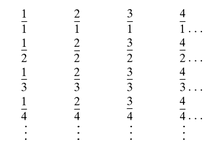
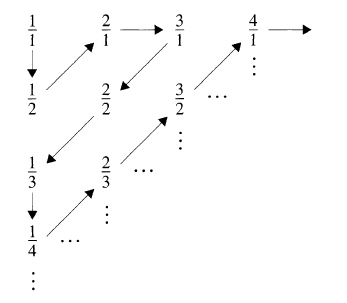
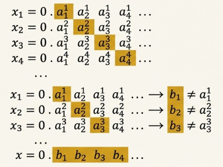
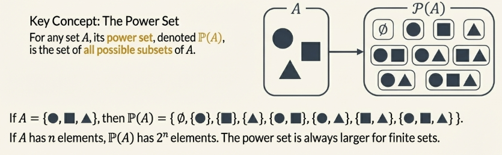
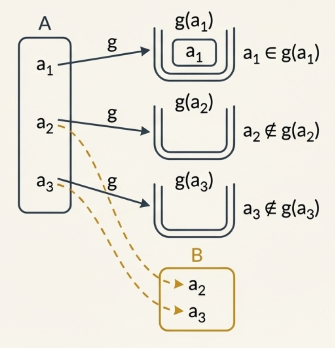
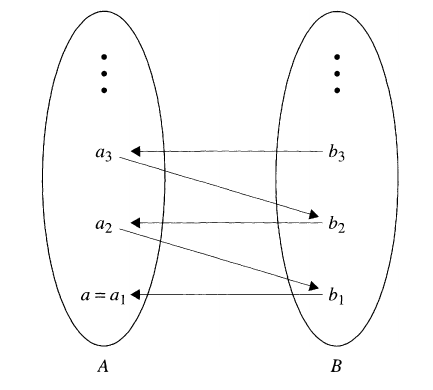
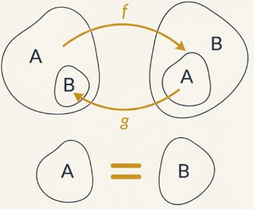
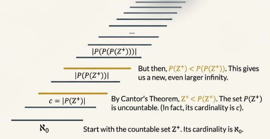

## Introduction

Most of the interesting sets we have looked at have an infinite number of elements, the sets $\mathbb{Z}$, $\mathbb{Q}$, and $\mathbb{R}$ being the most important examples.

In the 19th century, mathematicians attempted to introduce rigor into calculus. In doing so, they undertook a comprehensive study of the properties of the real numbers. As the theory advanced, it soon became clear that infinite sets in general had to be studied.But the very idea of a set with an infinite number of elements was resisted for a long time, mainly because it seemed to lead to contradictions.

There is a way to show that two finite sets $A$ and $B$ have the same number of elements: find a bijective function with domain $A$ and codomain $B$.

Consider the set $\mathbb{Z}$ of integers and the set $\mathbb{E}$ of even integers. The function $f: \mathbb{Z} \to \mathbb{E}$ defined by $f(n) = 2n$ is a bijection between $\mathbb{Z}$ and $\mathbb{E}$.

Where we have the seeming contradiction of a set having the same size as one of its proper subsets.

Gradually, as the 19th century came to a close, these examples came to be seen as **paradoxes** rather than actual mathematical contradictions. **Paradoxes**, in this context, are seemingly contradictory statements that are actually true. In the last example, if we accept the fact that two sets having the same size means that there is a bijection between them, then it is a true statement to say that $\mathbb{Z}$ and $\mathbb{E}$ have the same size.

## Countable Sets

### Numerically Equivalent Sets

Cantor distinguished infinite sets by their "size" in the same way we discussed.

> [!NOTE] **Numerically Equivalent Sets**
>
> Let $A$ and $B$ be sets contained in some universal set $U$. We say that $A$ and $B$ are **numerically equivalent** if there exists a bijection $f: A \to B$. We say that $A$ and $B$ have the same **cardinality**.

If $A$ and $B$ are numerically equivalent, we write $A \approx B$.

The definition of numerical equivalence actually defines an equivalence relation on the power set of $U$. Specifically, we have the following:

1. **Reflectivity**: For every set $A, A \approx A$
2. **Symmetry**: For all sets $A$ and $B$, if $A \approx B$, then $B \approx A$.
3. **Transitivity**: For all sets, $A, B$ and $C$, if $A \approx B$ and $B \approx C$ then $A \approx C$.

> [!NOTE] **Finite Set**
>
> Let, $A$ be a set contained in a universal set $U$. We say that $A$ is a finite set if $A = \emptyset$ or if $A = \\{1, 2, \cdots, n\\}$ for some positive integer $n$. The integer $n$ is the number of elements of $A$ and is denoted by $|A|$.

A set that is not finite is called an **infinite set**. The cardinality of a set is a measure of the size of a set. The cardinality or **cardinal number** of a finite set is the number of elements in the set. Every nonnegative integer then is a cardinal number.

### Countable Sets

The most natural example of an infinite set, the one we first encounter in arithmetic, is the set $\mathbb{Z}^+$ of positive integers.

> [!NOTE] **Countably Inifinite Sets**
>
> Any set $A$ that is numerically equivalent to $\mathbb{Z}^+$ is called a **countably infinite** set.

> [!NOTE] **Countable Sets**
>
> Any set $A$ that is either finite or countably finite is called **countable**.

A set that is not countable is called **uncountable**.

Any two countably infinite sets then have the same cardinality. We denote this cardinality by $\aleph_0$ (read "aleph zero" or "aleph naught"). $\mathcal{N}_0$ is our first example of an infinite cardinal number.

> [!TIP] **Theorem 6.1.4**
>
> Let $A$ be a countably infinite set and let $B$ be an infinite subset of $A$. Then $B$ is countably infinite.

**Proof**

Since $A$ is countably infinite, there exists a bijection $f: \mathbb{Z}^+ \to A$. To prove that $B$ is countably infinite, we will define a bijective function $g: \mathbb{Z}^+ \to B$. To do this, we first inductively define a collection of nonempty subsets of $\mathbb{Z}^+$.

Let $S_1 = \\{i \in \mathbb{Z}^+|f(i) \in B\\}$. $S_1$ is the set of positive integers that get mapped to $B$ by the function $f$. Since $f$ is surjective, $S_1$ is an infinite subset of $\mathbb{Z}^+$. Next we define $S_2$ as follows: by the Well-Ordering Principle, $S_1$ has a smallest element that we will call $k_1$. So we let $S_2 = S_1 - {k_1}$.

Now suppose that we have defined $n - 1$ nonempty subsets of $\mathbb{Z}^+$, $S_1, S_2, \cdots, S_{n - 1}$. By the Well-Ordering Principle, each $S_i$ has a smallest element. Call it $k_i$ We define $S_n = S_1 - \\{k_1, k_2, \cdots, k_{n - 1}\\}$. Then $S_n$ is nonempty since $B$ is an infinite set. Let $k_n$ be the smallest element of $S_n$. Now we define $g: \mathbb{Z}^+ \to B$ by $g(n) = f( k_n)$.

Note that the sequence of integers $k_1, k_2, \cdots$ has the property that if $n < m$, then $k_n < k_m$. We now show that $g$ is a bijective function. To see that $g$ is injective, let $n, m \in \mathbb{Z}^+$ and suppose that $g(n) = g(m)$. Then $f(k_n) = f(k_m)$. Since $f$ is injective, we have $k_n = k_m$. It now follows from the above remark that $n = m$. Therefore, $g$ is injective.

To prove that $g$ is surjective, let $b \in B$. We must find $n \in \mathbb{Z}^+$ such that $g(n) = b$. Since $f$ is surjective, there exists $t \in \mathbb{Z}^+$ such that $f(t) = b$. Note that $t \in S_1$ since $f(t) \in B$. Let $m$ be the number of integers in $S_1$ that are less than $t$. If there are no such integers, that is, if $m = 0$, then $t = k_1$. Otherwise the integers that are less than $t$ are $k_1, k_2, \cdots, k_m$. Since $S_{m+1} =S_1 - \\{k_1, k_2, \cdots, k_m\\}$, $t$ must be the smallest element of $S_{m + 1}$ and hence $t =k_{m+1}$. Thus if $m = 0$ or not, $g(m + 1) = f(t) = b$. This proves that $g$ is surjective.

Since $g$ is a bijection, it follows that $B$ is countably infinite.

> [!TIP] **Corollary 6.1.5**
>
> Every subset of $\mathbb{Z}$ is countable.

We have seen that a set $A$ is countably infinite if there is a bijection from $\mathbb{Z}^+$ to $A$. Sometimes it may be difficult or cumbersome to define such a function.

In our next result, we prove that we only have to find a surjective function from $\mathbb{Z}^+$ to $A$.

> [!TIP] **Theorem 6.1.6.**
>
> Let $A$ be an infinite set. Suppose there exists a surjection $f: \mathbb{Z}^+ \to A$. Then $A$ is countably infinite.

**Proof**

We will inductively define a bijective function $g: \mathbb{Z}^+ \to A$.

Let $g(1) = f(1)$. Let $n_2$ be the smallest positive integer such that $f(n_2) \neq g(1)$. Let $g(2) = f(n_2)$. Now suppose that $k \in \mathbb{Z}^+$ and $g(1), g(2), \cdots, g(k - 1)$ have been defined. Let $n_k$ be the smallest positive integer such that $f(n_k) \in A - \\{g(1), g(2), \cdots, g(k - 1)\\}$. We define $g(k) = f(n_k)$. This definition gives a function from $\mathbb{Z}^+$ to $A$. From the definition of $g$, $g(k) \neq g(i)$ for any $i = 1, 2, \cdots, k - 1$. Thus $g$ is injective.

We now prove that $g$ is surjective. Let $a \in A$. Since $f$ is surjective, $a$ is in the image of $f$. Let $t$ be the smallest positive integer such that $f(t) = a$. Then $f(t) \neq f(i)$ for any $i = 1, 2, \cdots, t - 1$. Let $r$ be the number of distinct elements from among $f(1), f(2), \cdots, f(t - 1)$. Then $g(1), g(2), \cdots, g(r)$ are equal to $f(1), f(2), \cdots, f(t - 1)$ in some order.

Hence $t$ is the smallest positive integer such that $f(t) \in A - \\{g(1), g(2), \cdots, g(r)\\}$. It follows from the definition of $g$ that $g(r + 1) = f(t) = a$, proving that $g$ is surjective.

We have thus constructed a bijection from $\mathbb{Z}^+$ to $A$ and so $A$ is countably infinite.

> [!NOTE] **Sequence of Elements**
>
> Let $U$ be some universal set. A sequence of elements of $U$ is a function $f: \mathbb{Z}^+ \to U$.

If $f: \mathbb{Z}^+ \to U$ is a sequence and we write $a_n = f(n)$ for each $n \in \mathbb{Z}^+$, then the sequence can be expressed in the form $\\{a_1, a_2, a_3, \cdots\\}$ or more simply $\\{a_n\\}^{\infty}_{n=1}$. Note that the elements of the sequence are not necessarily distinct. In fact, they would all assume the same value if $f$ is a constant function.

### Unions of Countable Sets

We now consider the question of whether there are "bigger" sets than $\mathbb{Z}$ that are countable.

> [!TIP] **Theorem 6.1.8**
>
> Let $A_1, A_2, \cdots, A_k$ be a finite collection of countably infinite sets, all contained in some universal set $U$. Then $A_1 \cup A_2 \cup \cdots \cup A_k$ is a countably infinite set.

**Proof**

Since each $A_i$ is countably infinite, there is a bijection $f_i: \mathbb{Z}^+ \to A_i$ for each $i = 1, 2, \cdots k$. Let $A = A_1 \cup A_2 \cup \cdots \cup A_k$. We will define a surjective function $f: \mathbb{Z}^+ \to A$. Such that $A$ is countably finite. We let

$$
f(1) = f_1(1) \\
f(2) = f_2(1) \\
\vdots \\
f(k) = f_k(1) \\
f(k + 1) = f_{k + 1}(1) \\
\vdots \\
f(2k) = f_{k}(2) \\
\vdots
$$

An explicit formula for $f$ can be given as follows. Let $n \in \mathbb{Z}^+$. Using a modification of the Division Algorithm, we can write $n = mk + r$ where $m$ is a nonnegative integer and $r$ is an integer such that $1 \leq r \leq k$. Moreover, $r$ and $m$ are unique. Then $f(n) = f(mk + r) = f_r(m + 1)$.

Now $f$ is not necessarily injective but it is surjective. To see this, let $a \in A$. Then $a \in A_i$ for some $i$. Since $f_i$ is surjective, there exists $n \in \mathbb{Z}^+$ such that $f_i(n) = a$. Then $f((n - 1)k + i) = f_i(n) = a$. Therefore $f$ is surjective and our proof is complete.

### The Rationals Are Countable

We now consider the set $\mathbb{Q}$ of rational numbers. At first glance it seems to be a "much bigger" set than $\mathbb{Z}$. This means that any interval on the real line, no matter how small, will contain infinitely many rational numbers. Despite this fact, the rational numbers do form a countable set.

> [!TIP] **Theorem 6.1.9**
>
> The set of $\mathbb{Q}$ of rational numbers is countably infinite.

**Proof**

We will show that the set $\mathbb{Q}^+$ of positive rationals is countably infinite. Since it is easy to define a bijection from $\mathbb{Q}^+ to \mathbb{Q}^-$, it will follow that the set $\mathbb{Q}^-$ of negative rationals is also countably infinite. Since $\mathbb{Q} = \mathbb{Q}^+ \cup \mathbb{Q}^- \cup \\{0\\}$, Theorem 6.1.8 implies that $\mathbb{Q}$ is countably infinite.

Any element of $\mathbb{Q}^+$ can be written as $a/b$ where $a, b \in \mathbb{Z}^+$. So we can write the elements of $\mathbb{Q}^+$ in a rectangular array where the elements in a given row all have the same denominator; that is, the numbers in row $1$ have denominator $1$, the numbers in row $2$ have denominator $2$, the numbers in row $3$ have denominator $3$, and so on. It will look like this:

Note that elements of $\mathbb{Q}^+$ appear more than once in this listing. In fact each element appears an infinite number of times. We define $f: \mathbb{Z}^+ \to \mathbb{Q}^+$ by going through this array diagonally:

That is, we can define:

$$
\begin{matrix}
f(1) = \frac{1}{1} & f(2) = \frac{1}{2} & f(3) = \frac{2}{1} & f(4) = \frac{3}{1} & f(5) = \frac{2}{2} \\[12pt]
f(6) = \frac{1}{3} & f(7) = \frac{1}{4} & f(8) = \frac{2}{3} & \cdots
\end{matrix}
$$

We will forego giving an explicit formula for $f$ since it is complicated. But it is clear from the construction of $f$ that every positive rational is in the image of $f$. It is now a consequence of Theorem 6.1.6 that $\mathbb{Q}^+$ is countably infinite. We can now conclude that $\mathbb{Q}$ is a countably infinite set.

### Cartesian Products of Countable Sets

Another set that is "bigger" than $\mathbb{Z}$ is the Cartesian product $\mathbb{Z} \times \mathbb{Z}$, the set of all ordered pairs of integers.

> [!TIP] **Theorem 6.1.11**
>
> Let $A$ and $B$ be countably infinite sets contained in some universal set $U$. Then $A \times B$ is countably infinite.

> [!TIP] **Theorem 6.1.12**
>
> Let $A_1, A_2, \cdots, A_k$ be a finite collection of countably infinite sets, all contained in some universal set $U$. Then the Cartesian product $A_1 \times A_2 \times \cdots \times A_k$ is a countably infinite set.

So far we have only looked at in finite sets that are countable. There are indeed in finite sets that are not countable: the set $\mathbb{R}$ of real numbers is the outstanding example.

## Uncontable Sets, Cantor's Theorem and the Schroeder-Bernstein Theorem

The study of infinite sets reveals a landscape that is far more complex and structured than finite arithmetic might suggest. While the set of integers represents a foundational, "countable" infinity, [Georg Cantor's](https://en.wikipedia.org/wiki/Georg_Cantor) pioneering work in the late 19th century demonstrated that not all infinities are the same size.

This section explores the foundational theorems that formally differentiate between sizes of infinite sets, moving beyond the countably infinite to the vast realm of the uncountable. The purpose of this analysis is to construct a coherent narrative from the foundational theorems of Cantor and the Schroeder-Bernstein Theorem, demonstrating how they collectively dismantle the intuitive notion of a single infinity and erect in its place a structured, infinite hierarchy of cardinal numbers.

To properly analyze the proofs that follow, it is essential to establish a clear and consistent convention for representing real numbers. This groundwork ensures that the arguments, which rely on the unique representation of numbers, are rigorous and unambiguous.

A non-negative real number $x$ can be expressed through its decimal expansion, represented by the formula:

$$
x = a_0.a_1a_2a_3 \cdots = a_0 + \frac{a_1}{10} + \frac{a_2}{10^2} + \frac{a_3}{1000}
$$

, where $a_0, a_1, a_2, a_3, \cdots$ are nonnegative integers and $a_1, a_2, a_3, \cdots$ are between $0$ and $9$.

A critical issue with this representation is its potential for non-uniqueness. For instance, the value one-half can be written as both $0.5000...$ and $0.4999...$. This ambiguity arises whenever a decimal expansion could terminate, as it can also be expressed with an expansion ending in an infinite string of $9$s.

To ensure a unique representation for every real number, this analysis adopts the standard convention used in the underlying proofs: **decimal expansions that end in an infinite string of $9$s will not be used**.

With these conventions established, we can proceed to the first major result: a formal demonstration that certain infinite sets, most notably the set of all real numbers, are fundamentally and provably larger than the set of integers.

### The Uncountability of the Continuum

The proof that the set of real numbers is "uncountable" is a cornerstone of modern set theory. This concept demonstrates that not all infinite sets are numerically equivalent—a counter-intuitive but critical idea that shatters the monolithic view of infinity and introduces a rich structure of different infinite magnitudes. The proof, known as [Cantor's diagonalization argument](/math/dma/07_function_properties/#countable-sets), is a model of mathematical elegance and power.

> [!TIP] **Theorem 6.2.1**
>
> The interval $[0, 1)$ is uncountable.

**Proof**

The proof proceeds by contradiction.

1. **Initial Assumption**: We begin by assuming that the interval $[0, 1)$ is countable. If this were true, it would mean that all the numbers in this interval could be put into a one-to-one correspondence with the set of positive integers, $\mathbb{Z}^+$. This implies the existence of a bijection $f: \mathbb{Z}^+ \to [0, 1)$.

2. **Enumeration**: If such a function $f$ exists, we can list every number in the interval $[0, 1)$, that is assign a unique integer to a unique value in $[0, 1)$ for all values on said interval. Let $x_i = f(i)$ for each positive integer $i$. Using our convention for unique decimal expansions, we can represent each $x_i$ as:

$$
x_1 = 0.a_1^1a_2^1 \cdots
$$

$$
x_2 = 0.a_1^2a_2^2 \cdots
$$

$$
x_3 = 0.a_1^3a_2^3 \cdots
$$

and so on, creating a comprehensive list of all numbers in $[0, 1)$.

3. **Construction of a New Number**: The next step is to construct a new real number, $x$, that is also in the interval $[0, 1)$ but is demonstrably not on our list. We define the digits of $x$ by referencing the "diagonal" of our list of numbers (the digits $a_1^1$, $a_2^2$, $a_3^3$, etc.). Let

$$
x = 0.b_1b_2b_3 \cdots
$$

where $b_i = 0$ if $a_i^i = 1$ and $b_i = 1$ if $a_i^i \neq 1$.

4. **Deriving the Contradiction**: By this construction, the new number $x$ is guaranteed to be different from every number $x_i$ on our list. Specifically, $x$ differs from $x_1$ in the first decimal place, from $x_2$ in the second decimal place, and so on. For any given $i$, $x \neq x_i$ because $b_i \neq a_i^i$. We have constructed a number $x$ that is clearly within the interval $[0, 1)$ but is not in the image of the function $f$.

5. **Conclusion**: The existence of this number $x$ contradicts our initial assumption that $f$ is a surjective function mapping $\mathbb{Z}^+$ onto $[0, 1)$. Since no such surjective function can exist, there can be no bijection between $\mathbb{Z}^+$ and $[0, 1)$. Therefore, the interval $[0, 1)$ must be uncountable.

This foundational theorem has several immediate and significant corollaries.

> [!TIP] **Corollary 6.2.2**
>
> The closed interval $[0, 1]$ and the set of all real numbers, $\mathbb{R}$, are also uncountable.

The reasoning is direct: if either of these sets were countable, then their subset $[0, 1)$ would also have to be countable. Since we have just proven $[0, 1)$ to be uncountable, this is a contradiction.

Any two sets that are numerically equivalent to $\mathbb{R}$ have the same cardinality. We denote this cardinality by $c$, called the **power of the continuum**. $c$ is our second example of an infinite cardinal number. It follows from the previous remarks that every open or closed interval of real numbers has cardinality $c$.

Having established a specific example of an uncountable set, we now turn to Cantor's Theorem, a more general result that provides a universal mechanism for generating an infinite hierarchy of ever-larger cardinalities.

### Cantor's Theorem

The discovery of uncountable sets naturally leads to the question of how to compare the sizes of different infinite sets. Cantor's Theorem provides a powerful and universal method for doing so. It is a mechanism for proving that for any given set, no matter how large, another set whose cardinality is strictly greater can always be constructed. This theorem reveals that there is not just one or two types of infinity, but an endless, ascending hierarchy of them.

To formalize this concept, we must first define the ordering of cardinalities.

> [!NOTE] **Cardinality Inequality**
>
> Let $A$ and $B$ be sets.
>
> - We say that $A \prec B$ if there exists an injection from $A$ to $B$, but no bijection exists between them.
> - We say that $A \preceq B$ if either $A \prec B$ or $A$ is numerically equivalent to $B$.

Now if we have two cardinal numbers, say $\textbf{x}$ and $\textbf{y}$, we will say that $\textbf{x} \prec \textbf{y}$ if $\textbf{x}$ is the cardinality of set $X$, $\textbf{y}$ is the cardinality of a set $Y$, and $X \prec Y$.

Similarly, we will say that $\textbf{x} \preceq \textbf{y}$ if $\textbf{x}$ is the cardinality of set $X$, $\textbf{y}$ is the cardinality of a set $Y$, and $X \preceq Y$.

Using this framework, we can formally state the relationship between the cardinality of the positive integers ($\aleph_0$) and the cardinality of the continuum ($c$). Since there exists an injection from the integers to the reals (e.g., the identity map on the subset of integers) but no bijection, it follows that the cardinality of the integers is strictly less than the cardinality of the continuum, written as $\aleph_0 \prec c$.

> [!NOTE] **Cantor's Theorem**
>
> Let $A$ be a set contained in a universal set $U$. Let $\mathcal{P}(A)$ denote the power set of $A$. Then $A \prec \mathcal{P}(A)$.

This theorem states that the cardinality of any set $A$ is strictly less than the cardinality of its power set, $\mathcal{P}(A)$.

> **Proof**. The proof is in two parts.
>
> **Part 1**: Proving $A \preceq \mathcal{P}(A)$
>
> To show that $A \preceq \mathcal{P}(A)$, we must demonstrate the existence of an injection from $A$ to $\mathcal{P}(A)$. We can define a natural function $f: A \to \mathcal{P}(A)$ as:
>
> $$f(a) = \{a\}$$
>
> This function maps each element $a$ in $A$ to the singleton set containing only that element. This function is injective because if $f(a) = f(b)$, then $\\{a\\} = \\{b\\}$, which by definition of set equality means $a = b$. The existence of this injection establishes that $A \preceq \mathcal{P}(A)$.
>
> **Part 2**: Proving No Surjection Exists from $A$ to $\mathcal{P}(A)$
>
> The second part of the proof is to show that no bijection can exist between $A$ and $\mathcal{P}(A)$ by proving that no function from $A$ to $\mathcal{P}(A)$ can be surjective.
>
> Assume, for the sake of contradiction, that a surjective function $g: A \to \mathcal{P}(A)$ does exist. This means that every subset of $A$ is the image of at least one element of $A$ under $g$.
>
> We construct a specific subset of $A$, which we will call $B$, defined as follows:
>
> $$B = \{a \in A | a \notin g(a)\}$$
>
> In words, $B$ is the set of all elements in $A$ that are not contained in the subset they map to under the function $g$.
>
> 
>
> Deriving the Contradiction: Since we assumed $g$ is surjective and $B$ is a subset of $A$, $B$ must be in the image of $g$. This means there must be some element $a_0 \in A$ such that $g(a_0) = B$. Now, we ask a simple question: is the element $a_0$ in the set $B$?
>
> - Case 1: Assume $a_0 \in B$. By the definition of $B$, if $a_0$ is an element of $B$, then it must satisfy the condition $a_0 \notin g(a_0)$. But since we know $g(a_0) = B$, this implies $a_0 \notin B$. This is a direct contradiction.
> - Case 2: Assume $a_0 \notin B$. If $a_0$ is not in $B$, it must fail the condition for membership in $B$. This means $a_0 \in g(a_0)$. Again, since $g(a_0) = B$, this implies $a_0 \in B$. This is also a contradiction.
>
> Both possibilities lead to an inescapable contradiction. Therefore, our initial assumption must be false, and no such surjective function $g$ can exist.
>
> Since there is an injection from $A$ to $\mathcal{P}(A)$ but no surjection, there can be no bijection. This establishes that $A \prec \mathcal{P}(A)$, meaning the cardinality of any set is strictly less than the cardinality of its power set.

### The Continuum Hypothesis

Question: Is there an infinite cardinal $\textbf{x}$ such that $\aleph_0 \prec \textbf{x} \prec c$? This problem has a long and interesting history. [Cantor](https://en.wikipedia.org/wiki/Georg_Cantor) conjectured that no such infinite cardinal $\textbf{x}$ exists. His conjecture has come to be known as **the Continuum Hypothesis**.

The first real progress on the Continuum Hypothesis was made by [Kurt Godel](https://en.wikipedia.org/wiki/Kurt_G%c3%b6del) (1906-1978) in the 1930s when he proved that the Continuum Hypoth­esis was consistent with the axioms of set theory. In other words, using the commonly accepted
axioms on which the theory of sets is based, it is impossible to disprove the
Continuum Hypothesis.

However, in 1963, [Paul Cohen](https://wikipedia.org/wiki/Paul_Cohen) (1934-2007) proved that the negation of the Continuum Hypothesis is also consistent with the axioms of set theory. Thus the Continuum Hypothesis is independent of the axioms of set theory and can be neither proved nor disproved from those axioms!

### The Schroeder-Bernstein Theorem

While Cantor's Theorem provides a way to create sets of strictly larger cardinality, the Schroeder-Bernstein Theorem offers a powerful method for proving that two sets are of the same size. Its utility lies in providing a non-constructive way to establish numerical equivalence. If a set $A$ can be injectively mapped into $B$ and $B$ can be injectively mapped into $A$, the theorem allows the conclusion that they have the same cardinality, even if the injections are not inverses.

> [!NOTE] **Schroeder-Bernstein Theorem**
>
> Let $A$ and $B$ bet sets, and suppose that $A \preceq B$ and $B \preceq A$. Then $A \approx B$.

The formal proof constructs the required bijection $h$ by partitioning the set $A$ based on the "ancestry" of its elements. The core idea is to trace an element $a \in A$ backward by alternately applying the injections. An element $a$ comes from $g(b_1)$ for some $b_1 ∈ B$, which in turn may come from $f(a_2)$ for some $a_2 ∈ A$, and so on. This chain of ancestors can either terminate or continue infinitely.

This process sorts the elements of $A$ into three disjoint categories:

- $A_A$: The set of elements in $A$ whose chain of ancestors terminates with an "oldest ancestor" in $A$.
- $A_B$: The set of elements in $A$ whose chain of ancestors terminates with an "oldest ancestor" in $B$.
- $A_{\infty}$: The set of elements in $A$ whose chain of ancestors continues infinitely without a starting point.

These three sets form a partition of $A$. The bijection $h: A \in B$ is then constructed piecewise.

$$
h(a) = \begin{cases}
f(a) & \text{ if } a \in A_A \cup A_{\infty} \\
b & \text{ where } a = g(b), \text{ if } a \in A_B \\
\end{cases}
$$

This construction guarantees a one-to-one correspondence between A and B.

One consequence of the Schroeder-Bernstein Theorem and Cantor's Theorem is that there must be an infinite number of infinite cardinals. For if $A \prec \mathcal{P}(A)$ for any set $A$, then $\mathcal{P}(A) \prec \mathcal{P}(\mathcal{P}(A)) \prec \mathcal{P}(\mathcal{P}(\mathcal{P}(A)))$. Each one of these sets has a different cardinality, giving us an infinite collection of cardinal numbers.

The Schroeder-Bernstein theorem provides elegant proofs for equivalences that are otherwise cumbersome to establish.

> [!TIP] **Corollary 6.2.7**
>
> The open interval $(0, 1)$ and the closed interval $[0, 1]$ are numerically equivalent.

> The proof follows directly.
>
> An injection from $(0, 1)$ to $[0, 1]$ exists because $(0, 1)$ is a subset of $[0, 1]$, so $(0, 1) \preceq [0, 1]$.
>
> For the reverse, the interval $[0, 1]$ is numerically equivalent to its subset $[1/4, 3/4]$, which is contained within $(0, 1)$. This establishes an injection from $[0, 1]$ into $(0, 1)$, so $[0, 1] \preceq (0, 1)$.
>
> Since injections exist in both directions, the theorem confirms the intervals are numerically equivalent.

### Conclusion: The Counter-Intuitive Nature of Infinity

The theorems explored in this report fundamentally reshaped the mathematical understanding of infinity, revealing it to be a concept of unexpected depth and complexity. The core findings demonstrate a structured, hierarchical universe of infinite magnitudes, governed by precise and provable rules that often defy conventional intuition.

These results were so revolutionary that they were initially met with resistance from parts of the mathematical community. This tension between formal proof and human intuition is a recurring theme in mathematics.

### TLDR


