## Fields

### Introduction

In mathematics, a field is a fundamental concept that defines a kind of playground for numbers. It is defined as an algebraic structure defined as a non-empty set equipped with two binary operations, addition and multiplication, that satisfy nine specific axioms governing properties like associativity, commutativity, identity elements, and inverses. The set of real numbers ($\mathbb{R}$) and the set of rational numbers ($\mathbb{Q}$) are examples of fields. The set of integers ($\mathbb{Z}$), however, fails to be a field.

This section has two primary goals: first, to clearly **explain the nine axioms that define a field**, using the familiar real numbers as our guide; and second, to **explore how mathematicians use these very same rules to construct new mathematical worlds**.

### Definition of a Field

A field is a fundamental algebraic structure that generalizes the arithmetic properties of real and rational numbers.

> [!NOTE] **Field**
>
> A field $F$ is a non-empty set endowed with two binary operations, addition ($+$) and multiplication ($·$), which satisfy the following nine axioms for all elements $a, b, c$ in F:
>
> 1. Axiom 1. **Associativity of Addition**: The grouping of elements does not affect the sum.
>
> $$(a + b) + c = a + (b + c)$$
>
> 2. Axiom 2. **Commutativity of Addition**: The order of elements does not affect the sum..
>
> $$a + b = b + a$$
>
> 3. Axiom 3. **Additive Identity**: There exists a unique "zero" element, $0$, that leaves any element unchanged by addition.
>
> $$\exists 0 \in F, a + 0 = a$$
>
> 4. Axiom 4. **Additive Inverse**: for every element $a$, there exists an inverse element, $-a$, such that their sum is the additive identity.
>
> $$\forall a \in F \exists -a \in F, a + (-a) = 0$$
>
> 5. Axiom 5. **Associativity of Multiplication**: The grouping of elements does not affect the product.
>
> $$\forall a, b, c \in F (a \cdot b) \cdot c = a \cdot (b \cdot c)$$
>
> 6. Axiom 6. **Commutativity of Multiplication**: The order of elements does not affect the product.
>
> $$\forall a, b \in F a \cdot b = b \cdot a$$
>
> 7. Axiom 7. **Multiplicative Identity**: There exists a unique "one" element, $1$, distinct from $0$, that leaves any element unchanged by multiplication.
>
> $$\exists 1 \in F, 1 \neq 0, a \cdot 1 = 1 \cdot a = a$$
>
> 8. Axiom 8. **Multiplicative Inverse**: For every non-zero element $a$, there exists an inverse element, $a^{-1}$, such that their product is the multiplicative identity.
>
> $$\forall a \in F, a \neq 0, \exists a^{-1} \in F, a \cdot a^{-1} = 1$$
>
> 9. Axiom 9. **Distributive Law**: Multiplication distributes over addition.
>
> $$a \cdot (b + c) = (a \cdot b) + (a \cdot c)$$

#### Examples and Non-Examples

- Field: The set of real numbers ($\mathbb{R}$) and the set of rational numbers ($\mathbb{Q}$) are fields under their standard operations.
- Not a Field: The set of integers ($\mathbb{Z}$) is not a field because it fails to satisfy Axiom 8. Only the integers $1$ and $-1$ have multiplicative inverses within $\mathbb{Z}$.

With this foundational blueprint established, we can now see how mathematicians use it not just to describe known worlds like the real numbers, but to build entirely new ones.

### Elementary Properties and Notation

Several fundamental properties can be derived directly from the field axioms. These properties mirror the familiar rules of arithmetic.

> [!TIP] **Basic Arithmetic Properties**
>
> For any elements $a, b, c$ in a field $F$:
>
> $$a · 0 = 0 · a = 0$$
>
> $$(-a)b = a(-b) = -(ab)$$
>
> $$(-a) = a$$
>
> $$(-a)(-b) = ab$$
>
> $$a(b - c) = ab - ac$$
>
> $$(-1)a = -a$$
>
> $$(-1)(-1) = 1$$

> [!TIP] **Cancellation and Inverse Properties**
>
> For any elements $a, b, c$ in a field $F$:
>
> 1. **Additive Cancellation**: If $a + b = a + c$, then $b = c$.
> 2. **Multiplicative Cancellation**: If $ab = ac$ and $a \neq 0$, then $b = c$.
> 3. **Inverse of an Inverse**: If $a \neq 0$, then $(a^{-1})^{-1} = a$.

### Ordered Fields and Inequalities

An ordered field is a field with an additional structure that allows for the concept of order or inequality.

> [!NOTE] **Ordered Field**
>
> A field $F$ is an **ordered field** if there exists a subset $P \subset F$, called the **set of positive elements**, satisfying two properties:
>
> 1. **Closure**: $P$ is closed under addition and multiplication. If $x, y \in P$, then $x + y \in P$ and $xy \in P$.
> 2. **Trichotomy**: For every element $x \in F$, exactly one of the following is true:
>    - $x \in P$ ($x$ is positive)
>    - $-x \in P$ ($x$ is negative)
>    - $x = 0$ ($x$ is zero)

For example, the real numbers are an ordered field, with $P = \mathbb{R}^+$ (the set of positive real numbers), as well as the rational numbers, with $P = \mathbb{Q}^+$ (the set of positive rational numbers).

> [!NOTE] **Inequality on a Field**
>
> In an ordered field $F$ with a set of positive elements $P$, inequality is defined as:
>
> $$x < y \text{ (or } y > x \text{)} \text{ if and only if } y - x \in P$$

#### Key Properties of Ordered Fields

> [!TIP] **No Smallest Positive Element**
>
> Unlike the set of positive integers ($\mathbb{Z}^+$), the set of positive elements $P$ in any ordered field has no smallest element. For any $x \in P$, the element $\frac{x}{2}$ is also in $P$ and is smaller than $x$.

> [!TIP] **Fundamental Properties of the Set of Positive Elements $P$**
>
> 1. The multiplicative identity $1$ is always in $P$.
> 2. If $x \in P$, then its multiplicative inverse $x^{-1}$ is also in $P$.
> 3. The set $P$ is always infinite. This is proven by showing that the elements $1, 1+1, 1+1+1$, etc., are all distinct and belong to $P$.

As a direct consequence of $P$ being infinite, every ordered field is infinite.

### Finite Fields: Galois Fields

While fields like $\mathbb{R}$ and $\mathbb{Q}$ are infinite, it is also possible to construct fields with a finite number of elements, often called **Galois Fields**.

The most straightforward examples are the sets of integers modulo $n$, denoted $\mathbb{Z}_n$.

> [!TIP] **Theorem 7.1.9**
>
> The set $\mathbb{Z}_n$ is a field if and only if $n$ is a prime number.

> **Proof**
>
> If $n = ab$, where $a, b \in \mathbb{Z}$ and $a > 1, b > 1$, then in the system of $\mathbb{Z}_n$, we have
>
> $$[a][b] = [ab] = [n] = [0]$$
>
> This means two nonzero elements can multiply to zero, which prevents them from having multiplicative inverses, and thus the set that contains them, namely $\mathbb{Z}_n$ cannot constitute a field.
>
> To see why, suppose $[a]$ did have a multiplicative inverse, call it $[x]$. We could then multiply both sides of the equation $[a][b] = [0]$ by $[x]$, giving us $[x]\left([a][b]\right) = [x][0]$.
>
> By associativity, this becomes $([x][a])[b] = [0]$, which simplifies to $[1][b] = [0]$, or $[b] = [0]$. This contradicts our initial fact that $[b]$ was a nonzero element, proving that $[a]$ cannot have an inverse.

### Building New Fields

The definition of a field presents a toolkit for mathematical exploration. Mathematicians use this blueprint to ask powerful "what if" questions.

What if we need a number system that includes $\sqrt{2}$, which is missing from the rational numbers? We can build one.

#### Algebraic Number Fields

New fields can be constructed by starting with a known field, like the set of rational number and "adjoining" a new element. For example $\mathbb{Q}(\sqrt{2})$, is defined as the smallest field containing both $\mathbb{Q}$ and $\sqrt{2}$. Its elements take the form:

$$
\{r + s \sqrt{2} | r, s \in \mathbb{Q}\}
$$

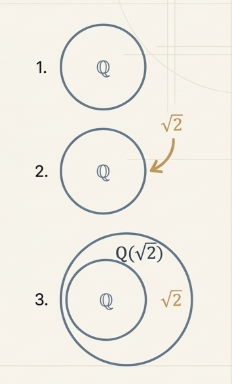

This is an algebraic number field because $\sqrt{2}$ is a root of a polynomial with rational coefficients, specifically $x^2 - 2 = 0$.

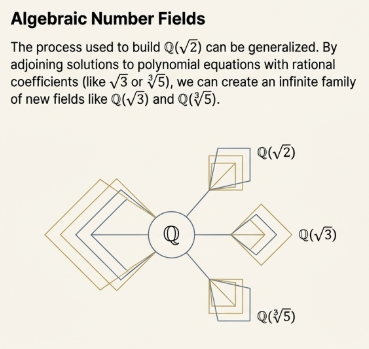

#### Transcendental Numbers

In contrast, transcendental numbers like $\pi$ are not the root to any polynomial with rational coefficients. As a result, the field $\mathbb{Q}(\pi)$, which is the smallest field containing all rational numbers and $\pi$, exists but lacks the simple representation of an algebraic number field.

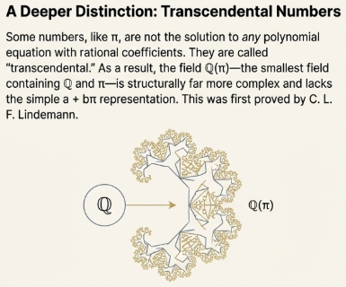

### Construction of Finite Fields

The work of [Evariste Galois](https://wikipedia.org/wiki/%C3%89variste_Galois) and [E. H. Moore](https://wikipedia.org/wiki/E._H._Moore) showed that all finite fields can be constructed by starting with a prime field $\mathbb{Z}_p$ and adjoining roots of irreducible polynomials with coefficients in $\mathbb{Z}_p$.

### The Frontier of Field Theory

The study of fields reveals a fascinating contrast between the finite and the infinite. Our current mathematical understanding of these structures can be summarized as follows:

- **Finite Fields**: Thanks to the work of [Galois](https://wikipedia.org/wiki/%C3%89variste_Galois) and others like [E. H. Moore](https://wikipedia.org/wiki/E._H._Moore), the structure of all possible finite fields is very well understood. Mathematicians have a clear picture of how they are constructed and how they relate to one another.
- **Infinite Fields**: The nature of infinite fields, especially algebraic number fields like $\mathbb{Q}(\sqrt{2})$, remains a vast and complex landscape. This area continues to be an active and rich domain of modern mathematical research, with many open questions still driving discovery.

### Fields: TL;DR



## The Real Numbers

### Introduction

The fundamental property that distinguishes the set of real numbers from the set of rational numbers is its completeness, formally captured by the **Least Upper Bound Axiom**. This axiom posits that any non-empty subset of real numbers that is bounded above must have a least upper bound within the real numbers. This property underpins the continuous nature of the real number line and is not shared by the rational numbers.

The profound consequences of this axiom include the **Archimedean Principle**, which establishes that for any two positive real numbers, multiples of one can exceed the other, precluding the existence of infinitely large or small quantities. A direct result of this principle is the density of the rational numbers within the reals, proving that a rational number can be found between any two distinct real numbers.

### Bounded Sets and Bounds

The analysis of the real number system begins with the concepts of boundedness, which provide the necessary framework for understanding its completeness property.

> [!NOTE] **Boundedness**
>
> - **Bounded Above**: A non-empty set of real numbers $S$ is considered **bounded above** if there exists a real number $x$ such that $a \leq x$ for all $a \in S$. The number $x$ is called an **upper bound** for $S$.
> - **Bounded Below**: A non-empty set of real numbers $S$ is considered bounded below if there exists a real number $y$ such that $a \geq y$ for all $a \in S$. The number $y$ is called a **lower bound** for $S$.

> [!NOTE] **Bounded Set**
>
> A set $S$ is referred to as **bounded** if it is both bounded above and bounded below.

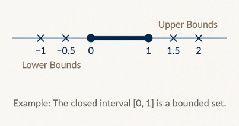

> [!TIP] **Least Upper Bound**
>
> A **Least Upper Bound** (lub $S$), also known as **the supremum**, it is an upper bound $x$ for a set $S$ with the property that $x \leq z$ for any other upper bound $z$ of $S$.

> [!TIP] **Greatest Lower Bound**
>
> A **Greatest Lower Bound** (glb $S$), also known as **the infimum**, it is a lower bound $y$ for a set $S$ with the property that $y \geq z$ for any other lower bound $z$ of $S$.

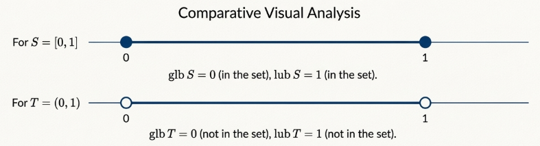

If they exist, the least upper bound and greatest lower bound of a set are unique.

The distinction between bounds and the specific concepts of supremum and infimum is clarified by the following examples. Notably, the supremum or infimum of a set may or may not be an element of the set itself.

| Set (S)        | Description       | Bounded Above/Below | Upper/Lower Bounds                                     | Least Upper Bound (lub $S$) | Greatest Lower Bound (glb $S$) |
| -------------- | ----------------- | ------------------- | ------------------------------------------------------ | --------------------------- | ------------------------------ |
| $[0, 1]$       | Closed Interval   | Bounded             | Upper: Any number $\geq 1$, Lower: Any number $\leq 0$ | $1$                         | $0$                            |
| $(0, 1)$       | Open Interval     | Bounded             | Upper: Any number $\geq 1$, Lower: Any number $\leq 0$ | $1$                         | $0$                            |
| $\mathbb{Z}^+$ | Positive Integers | Bounded Below       | Lower: Any number $\leq 1$                             | Does not exist              | $1$                            |
| $(-\infty, 0]$ | Interval          | Bounded Above       | Upper: Any number $\geq 0$                             | $0$                         | Does not exist                 |

### The Completeness Axiom

The structure of the real numbers as a complete ordered field is established by a final axiom that is not satisfied by the rational numbers.

> [!NOTE] **Least Upper Bound Axiom**
>
> Any nonempty subset of $\mathbb{R}$ that is bounded above has a least upper bound.

This axiom guarantees that there are no "gaps" in the real number line. A direct consequence, which can be proven from the axiom, is that any nonempty subset of $\mathbb{R}$ that is bounded below has a greatest lower bound.

A critical consequence of the **Least Upper Bound Axiom** is the **Archimedean Principle**, which formalizes the notion that the real numbers cannot contain infinitesimal or infinitely large elements relative to one another.

> [!NOTE] **Archimedean Principle**
>
> Let $a$ and $b$ be positive real numbers. Then there exists a positive integer $n$ such that $na > b$.

This theorem states that no real number is infinitely large relative to another. Given enough "steps" of size $a$, one can always surpass any distance $b$.

> **Proof**
>
> The proof proceeds by contradiction, assuming that $na \leq b$ for all $n \in \mathbb{Z}^+$.
>
> The set
>
> $$S = \{na | n \in \mathbb{Z}^+\}$$
>
> would then be bounded above by $b$ and thus by the Least Upper Bound Axiom, $S$ has a least upper bound $z$.
>
> Since $a > 0$, then $z - a < z$. So $z - a$ is not an upper bound for $S$. Therefore $\exists ma \in S$, such that $ma > z - a$. That is
>
> $$ma > z - a$$
>
> $$ma + a > z$$
>
> $$(m + 1)a > z$$
>
> Since $(ma + 1)a \in S$, this contradicts that $$z$$ is an upper bound.
>
> Thus the initial assumption must be false and $\exists n \in \mathbb{Z}^+$, such that $na > b$.

A corollary to this principle further clarifies its implications:

> [!TIP] **Corollary 7.2.4**
>
> If $b$ is any positive real number, then there exists a positive integer $n$ such that $\frac{1}{n} < b$.

This goes to say that for every positive real number $b$, there exists an smaller rational number, namely $\frac{1}{n}$.

Building upon the Archimedean Principle, it can be proven that the rational numbers are dense in the real numbers, meaning a rational number can always be found between any two distinct real numbers.

> [!NOTE] **Theorem 7.2.6**
>
> Between any two real numbers there is a rational number.

This means that the rational numbers are interwoven throughout the real number line. No matter how closely you magnify and interval, you will always find a rational number.

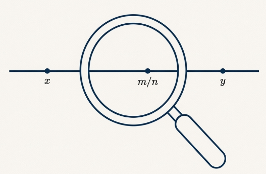

The proof leverages the Archimedean Principle to demonstrate that for any real numbers $x < y$, there exists an integer $n$ such that $ny - nx > 1$. This ensures that an integer $m$ can be found such that $nx < m < ny$, which implies that the rational number $\frac{m}{n}$ lies between $x$ and $y$.

### The Incompleteness of the Rational Number System

The Least Upper Bound Axiom is the precise property that $\mathbb{R}$ possesses and $\mathbb{Q}$ lacks. This "incompleteness" of the rational numbers can be formally demonstrated.

To prove that $\mathbb{Q}$ does not satisfy the axiom, it is sufficient to find a nonempty subset of $\mathbb{Q}$ that is bounded above but does not have a least upper bound in $\mathbb{Q}$. The canonical set for this demonstration is:

$$
S = \{x \in \mathbb{Q} | x > 0 \text{ and } x^2 < 2\}
$$

This set is clearly non-empty (e.g., $1 \in S$) and is bounded above by the rational number $2$. According to the axiom, if $\mathbb{Q}$ were complete, $S$ must have a least upper bound in $\mathbb{Q}$.

> **Proof**
>
> If a rational least upper bound $z$ for $S$ were to exist, it must satisfy one of three conditions: $z^2 < 2$, $z^2 > 2$, or $z^2 = 2$.
>
> 1. If $z^2 < 2$, one can always find another rational number $r$ such that $z < r$ and $r^2 < 2$. This means $r$ is in $S$, contradicting that $z$ is an upper bound.
> 2. If $z^2 > 2$, one can find a smaller rational number $r$ such that $r > \sqrt{2}$. This $r$ would also be an upper bound for $S$ but is smaller than $z$, contradicting that $z$ is the least upper bound.
> 3. If $z^2 = 2$. We know that $\sqrt{2}$ is an irrational number. Therefore, no such rational number $z$ can exist.
>
> This contradiction demonstrates that the set $S$ does not have a least upper bound in $\mathbb{Q}$, proving that the rational number system is incomplete.

### Consequential Properties of the Set of Real Numbers

The completeness of the real number system enables fundamental results in mathematics, particularly in calculus and analysis.

> [!TIP] **Theorem 7.2.7**
>
> If $x \in \mathbb{R}, x > 0$, then there exists $y \in \mathbb{R}, y > 0$, such that $y^2 = x$.

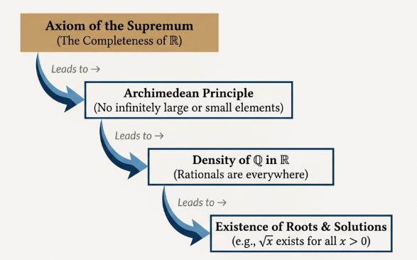

The rigorous formalization of the real number system was a major focus of 19th-century mathematics, driven by the need to provide a solid logical basis for theorems in calculus, such as [the Intermediate Value Theorem](/math/cet/02_limits/#the-intermediate-value-theorem). Mathematicians realized that intuitive geometric arguments about a continuous line were insufficient.

- [J. W. R. Dedekind](https://wikipedia.org/wiki/Richard_Dedekind) (1831-1916) developed the concept of "Dedekind cuts," defining real numbers as ordered pairs of sets of rational numbers, effectively partitioning the rational number line at a specific point.
- [Georg Cantor](https://wikipedia.org/wiki/Georg_Cantor) (1845-1918) defined an irrational number as an infinite sequence of rational numbers that cluster together (a Cauchy sequence).

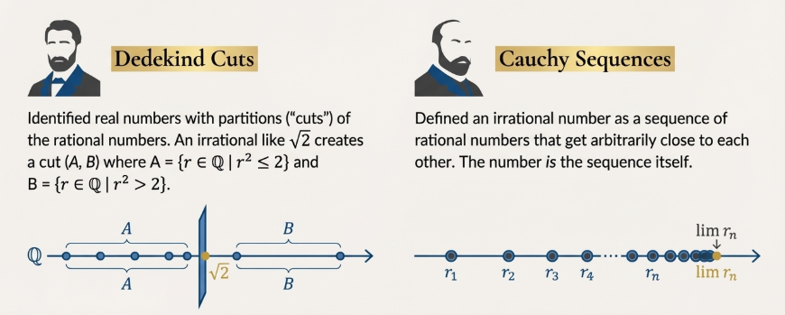

These sophisticated constructions aimed to define irrational numbers based on the more accepted foundation of rational numbers, thereby capturing the property of continuity essential to the real number line.

### The Real Numbers: TL;DR



## The Complex Numbers

In mathematics, we often encounter problems that challenge the limits of our current number system. Consider a seemingly simple polynomial equation:

$$
x^2 + 1 = 0
$$

If we try to solve this for $x$, we get $x^2 = -1$. Within the familiar world of real numbers, this equation has no solution. The square of any real number—whether positive, negative, or zero—is always non-negative. To overcome this limitation, mathematicians needed to create a richer set of numbers that contains a solution to this problem and, remarkably, to all other polynomial equations.

To do this, we must dare to define a new type of number. These are the complex numbers. This chapter provides a formal analysis of the complex number system. We will begin by establishing its axiomatic foundation, defining complex numbers as ordered pairs of real numbers and verifying their properties as a field. From there, we will explore their powerful geometric interpretation in the complex plane, which provides profound intuition for their behavior. Finally, we will demonstrate how this algebraic and geometric machinery is applied to the foundational problem of finding the roots of polynomials.

### Axiomatic Construction of the Complex Field

We adopt a formal construction, developed by the mathematician [W. R. Hamilton](https://wikipedia.org/wiki/William_Rowan_Hamilton), based on ordered pairs of real numbers. This axiomatic approach provides a solid logical foundation for the entire system.

> [!NOTE] **Set of Complex Numbers**
>
> The set of complex numbers, denoted by $\mathcal{C]$, is the set of all ordered pairs of real numbers, $(a, b)$.

For two complex numbers $(a, b)$ and $(c, d)$ to be equal, their corresponding components must be equal; that is, $a = c$ and $b = d$.

The algebraic structure of C is established by defining two binary operations: addition and multiplication.

- **Addition**: The sum of two complex numbers is defined component-wise:

$$
(a, b) + (c, d) = (a + c, b + d)
$$

- **Multiplication**: The product of two complex numbers is defined by the following rule:

$$
(a, b) * (c, d) = (ac - bd, ad + bc)
$$

While the definition of addition is intuitive, the definition of multiplication is non-obvious. However, it is precisely this formulation that is essential for generating the unique and powerful algebraic properties of the complex field.

#### Field Properties

With these two operations, the set of complex numbers forms a [field](/math/iam/07_real_and_complex_numbers/#fields), this assertion means that C satisfies all the field axioms. The key elements that establish $\mathbb{C}$ as a field are:

- **Additive Identity**: The identity element for addition is the ordered pair $(0, 0)$.
- **Additive Inverse**: For any complex number $(a, b)$, its additive inverse is $(-a, -b)$.
- **Multiplicative Identity**: The identity element for multiplication is the ordered pair $(1, 0)$.
- **Multiplicative Inverse**: For any non-zero complex number $(a, b)$, its multiplicative inverse exists and is given by the formula: $(\frac{a}{a^2 + b^2}, -\frac{b}{a^2 + b^2})$

The ordered-pair notation is cumbersome for algebraic manipulation, next we must now connect this formalism to the more intuitive $a + bi$ representation.

### Standard Form and Fundamental Algebraic Concepts

The ordered-pair formalism provides a solid logical foundation, but for practical computation, the standard form $a + bi$ is far more convenient. This notation not only simplifies algebraic manipulation but also makes the relationship between the real numbers and their complex extension more explicit.

The bridge between the two notations is the special complex number known as the imaginary unit, which we denote by $i$.

> [!NOTE] **Imaginary Unit**
>
> The imaginary unit $i$ is defined as the ordered pair $(0, 1)$.

Using the rule for multiplication, we can compute the square of $i$:

$$
i^2 = (0, 1) * (0, 1) = ((0\cdot 0) - (0 \cdot 1), (0 \cdot 1) + (1 \cdot 0)) = (-1, 0)
$$

A critical step in this construction is the identification of complex numbers of the form $(a, 0)$ with the real number $a$. This allows us to consider the real numbers as a subfield of $\mathbb{C}$. Under this convention, the complex number $(-1, 0)$ is identified with the real number $-1$, establishing the fundamental property that distinguishes the complex numbers: $i^2 = -1$.

With the definition of $i$, any complex number $(a, b)$ can be expressed in standard form. We can write $(a, b)$ as the sum of two other complex numbers:

$$
(a, b) = (a, 0) + (0, b)
$$

This can be further factored using the definition of multiplication:

$$
(a, b) = (a, 0) + (b, 0) * (0, 1)
$$

By identifying $(a, 0)$ with $a$, $(b, 0)$ with $b$, and $(0, 1)$ with $i$, we arrive at the standard notation:

$$
(a, b) = a + bi
$$

In this form, $a$ is called the real part of the complex number $z = a + bi$ (denoted $\text{Re} z$), and $b$ is called the imaginary part (denoted $\text{Im} z$). Consequently, two complex numbers are equal if and only if their real and imaginary parts are equal.

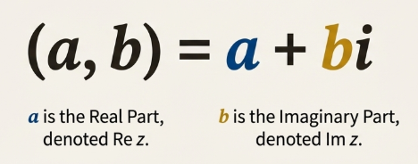

#### Complex Conjugation and Absolute Value

Two fundamental concepts associated with any complex number are its conjugate and its absolute value.

- **Complex Conjugate**: The conjugate of a complex number $z = a + bi$ is denoted by $\overline{z}$ and is defined as $\overline{z} = a - bi$.
- **Absolute Value (Modulus)**: The absolute value, or modulus, of $z = a + bi$ is denoted by $|z|$ and is defined as the non-negative real number $|z| = \sqrt{(a^2 + b^2)}$.

### The Geometric Interpretation: The Complex Plane

The strategic value of visualizing complex numbers cannot be overstated. By representing a complex number a + bi as a point in a two-dimensional plane, we can interpret algebraic operations geometrically.

#### Cartesian Representation

We represent complex numbers on the complex plane, a two-dimensional Cartesian grid where the horizontal axis represents the real part and the vertical axis represents the imaginary part. A complex number $z = a + bi$ corresponds directly to the point with coordinates $(a, b)$.

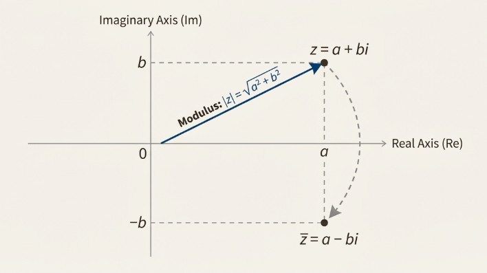

In this geometric context, the absolute value $|z| = \sqrt{(a^2 + b^2)}$ has a clear interpretation: it is the Euclidean distance of the point $(a, b)$ from the origin $(0, 0)$.

#### Polar Form

In addition to Cartesian coordinates $(a, b)$, any non-zero point in the plane can be described by its polar coordinates $(r, \theta)$, where $r$ is the distance from the origin and $\theta$ is the angle made with the positive real axis. This leads to the **polar form** of a complex number.

A non-zero complex number $z = a + bi$ can be written as: $z = r(\cos \theta + i \sin \theta)$

- The modulus $r$ is equal to the absolute value $|z|$.
- The angle $\theta$ is called the argument of $z$, denoted $\text{arg} z$.

It is important to note that the argument $\theta$ is not unique; adding any integer multiple of $2 \pi$ to $\theta$ will result in the same point in the complex plane.

#### Geometric Effect of Multiplication

The true power of the polar form becomes evident when multiplying complex numbers.

> [!NOTE] **Theorem 7.3.6.**
>
> Let $z = r(\cos \theta + i \sin \theta)$ and $w = s(\cos \phi + i \sin \phi)$.
>
> Then their product is: $zw = rs(\cos(\theta + \phi) + i \sin(\theta + \phi))$.

This theorem carries a profound geometric implication: to multiply two complex numbers, you multiply their moduli and add their arguments. The act of multiplication in the complex plane is thus equivalent to a combination of scaling and rotation.

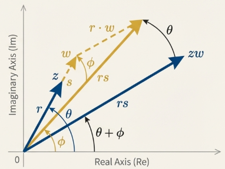

Multiplying by a complex number $w$ scales the length of $z$ by a factor of $|w|$ and rotates it counter-clockwise by an angle of $\text{arg} w$.

### Powers and Roots of Complex Numbers

The polar representation of complex numbers is exceptionally powerful for simplifying the otherwise algebraically intensive operations of exponentiation and root extraction. The geometric interpretation of multiplication as scaling and rotation provides an intuitive framework for these calculations.

> [!NOTE] **DeMoivre's Theorem**
>
> For any positive integer $n$ and complex number $z = r(\cos \theta + i \sin \theta)$:
>
> $$z^n = r^n(\cos n\theta + i \sin n\theta)$$

That is, to raise a complex number to the nth power, one simply raises its modulus to the $n$th power and multiplies its argument by $n$.

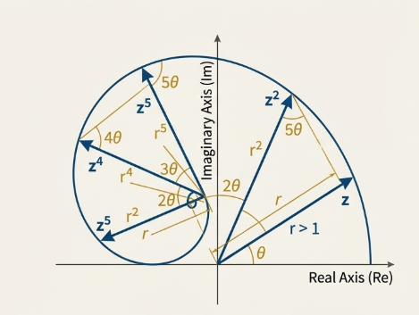

> [!NOTE] **Finding $n$th Roots**
>
> A non-zero complex number $z = r(\cos \theta + i \sin \theta)$ has exactly $n$ distinct $n$th roots, given by the formula:
>
> $$w_k = r^{\frac{1}{n}}(\cos(\frac{\theta + 2\pi k}{n}) + i \sin(\frac{\theta + 2 \pi k}{n})) \text{ for } k = 0, 1, 2, ..., n-1$$

This formula generates the $n$ roots, where each root has the same modulus, $r^{\frac{1}{n}}$, meaning they all lie on a circle of this radius. Their arguments are found by taking the principal argument $\frac{\theta}{n}$ and adding successive increments of $\frac{2 \pi}{n}$, effectively partitioning the circle into $n$ equal arcs.

### Application to Solving Polynomial Equations

The theory of complex numbers brings our discussion full circle, providing the complete framework for solving polynomial equations—the very problem that the real numbers alone could not handle.

> [!TIP] **The Conjugate Root Theorem**
>
> Let $p(x)$ be a polynomial with real coefficients. If a complex number $z$ is a root of $p(x) = 0$, then its complex conjugate $\overline{z}$ must also be a root.

The previous theorem state that for any polynomial with real coefficients, its non-real roots must always occur in conjugate pairs.

### Conclusion and Historical Perspective

The modern, rigorous understanding of complex numbers is largely credited to the Irish mathematician [W. R. Hamilton](https://wikipedia.org/wiki/William_Rowan_Hamilton). His ordered-pair definition in the 19th century stripped away the lingering mystery of "imaginary" numbers by grounding them in the familiar logic of real number pairs. In the true spirit of mathematical inquiry, Hamilton then wondered if this system could be extended further. He spent 15 years trying to define a consistent multiplication for three-dimensional "triples".

The solution came to him in a flash of insight while walking across the Brougham Bridge in Dublin: the extension required not three, but four dimensions. He famously carved the fundamental formula for his new system—the quaternions—into the stone of the bridge:

$$
i^2 = j^2 = k^2 = ijk = -1
$$

To achieve this, Hamilton had to make a radical sacrifice: he abandoned the commutative property of multiplication (for example, $ij = -ji$). In doing so, he opened the door to the study of abstract algebraic structures where familiar axioms might not hold.

The profound nature of Hamilton's work was confirmed later by [F. G. Frobenius](https://wikipedia.org/wiki/Ferdinand_Georg_Frobenius), who proved that the only associative division algebras over the real numbers are the reals themselves, the complex numbers ($\mathbb{C}$), and the quaternions ($\mathbb{H}$).

### The Complex Numbers: TL;DR


