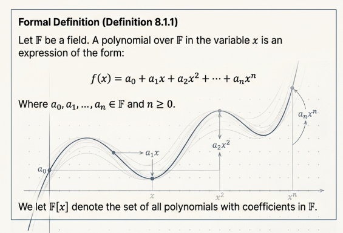
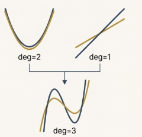
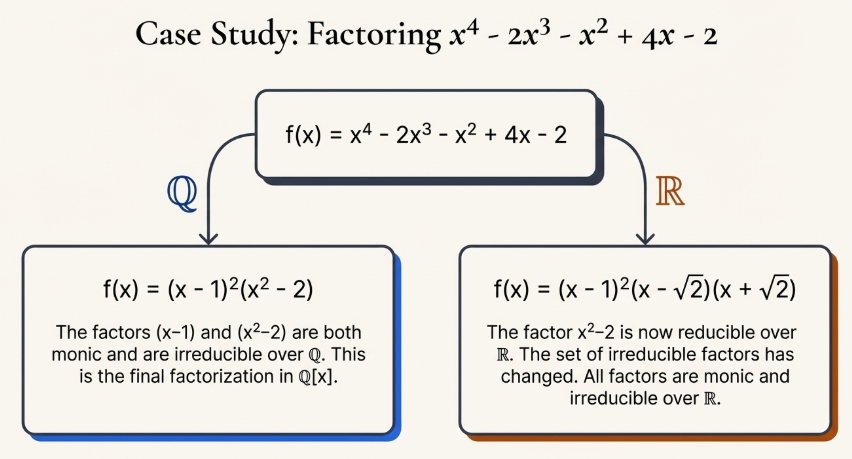
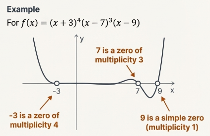

## Polynomials

This section conducts a systematic study of the set of polynomials whose coefficients are drawn from a general field, $F$. This set, denoted as $F[x]$, forms a fundamental object of study in abstract algebra.

By formalizing the definitions and operations within $F[x]$, we can rigorously investigate its properties, which in turn provides a powerful framework for solving polynomial equations.

This document will proceed by first establishing a formal definition for the set $F[x]$, then detailing the algebraic operations that give it structure, and culminating in an exploration of the Division Algorithm and its consequences for understanding polynomial roots and factors.

### The Polynomial Ring $F[x]$

> [!NOTE] **Polynomial Ring**
>
> A polynomial $f(x)$ over a field $F$ is an expression of the form:
>
> $$f(x) = a_0 + a_1x + a_2x^2 + \cdots + a_nx^n$$
>
> where $n$ is a non-negative integer and the coefficients are elements of the field $F$.

The following terms are essential for describing the components and characteristics of a polynomial:

- **Coefficients**: The elements $a_0, a_1, a_1, \cdots, a_n$ from the field $F$.
- **Leading Coefficient**: The coefficient $a_n$ associated with the highest power of $x$, provided that $a_n \neq 0$.
- **Constant Term**: The coefficient $a_0$.
- **Degree**: The highest power of $x$ that has a non-zero coefficient. The degree of $f(x)$ is denoted $\text{deg} f(x)$. A nonzero constant polynomial $f(x) = a_0$ where $a_0 \neq 0$ has a degree of $0$.
- **Zero Polynomial**: The polynomial $f(x) = 0$. By convention, the zero polynomial is not assigned a degree.

The set encompassing all polynomials with coefficients in the field $F$ is formally denoted as $F[x]$.

### Binary Operations in $F[x]$

The set F[x] is an algebraic structure defined by two fundamental binary operations: addition and multiplication.

To formalize these definitions, if two polynomials have different degrees, we can consider the polynomial of lesser degree to have zero coefficients for all powers of $x$ up to the higher degree. This allows for a direct, term-by-term operation.

Let $f(x) = a_0 + a_1x + \cdots + a_nx^n$ and $g(x) = b_0 + b_1x + \cdots + b_mx^m$ be two polynomials in $F[x]$.

The **addition** of these two polynomials is defined as:

$$
f(x) + g(x) = (a_0 + b_0) + (a_1 + b_1)x + (a_2 + b_2)x^2 + \cdots
$$

The **multiplication** of $f(x)$ and $g(x)$ is defined as:

$$
f(x)g(x) = a_0b_0 + (a_0b_1 + a_1b_0)x + (a_0b_2 + a_1b_1 + a_2b_0)x^ + \cdots + a_nb_mx^{n + m}
$$

More generally, the coefficient $c_i$ of the term $x^i$ in the product $f(x)g(x)$ is given by the formula:

$$
c_i = a_0b_i + a_1b_{i - 1} + a_2b_{i - 2} + \cdots + a_ib_0
$$

For this formula, it is understood that $a_j = 0$ for $j > n$ and $b_k = 0$ for $k > m$.

### Algebraic Properties of $F[x]$

The verification of fundamental properties such as associativity, commutativity, and the existence of identity and inverse elements is crucial for classifying this structure. These properties collectively establish that $F[x]$ is a **commutative ring**, one of the most important structures in abstract algebra.

Both addition and multiplication in $F[x]$ are associative and commutative. Furthermore, $F[x]$ contains the necessary identity and inverse elements for a ring structure:

- **Additive Identity**: The zero polynomial, $f(x) = 0$, serves as the additive identity, as $f(x) + 0 = f(x)$ for any polynomial $f(x)$.
- **Additive Inverse**: For any polynomial $f(x) = a_0 + a_1x + \cdots + a_nx^n$, its additive inverse is $-f(x) = (-a_0) + (-a_1)x + \cdots + (-a_n)x^n$.
- **Multiplicative Identity**: The constant polynomial $f(x) = 1$ is the multiplicative identity. This exists because $F$ is a field and therefore contains a multiplicative identity $1$.

The behavior of the degree under these operations provides crucial insights:

> [!TIP] **Degree of a Sum**
>
> The following inequality
>
> $$\text{deg}(f(x) + g(x)) \leq max{\text{deg} f(x), \text{deg} g(x)}$$
>
> holds if $\text{deg} f(x) \neq \text{deg} g(x)$. If the degrees are equal, the leading terms might cancel, resulting in a sum with a strictly smaller degree.

> [!TIP] **Degree of a Product**
>
> $$deg(f(x)g(x)) = deg f(x) + deg g(x)$$

A crucial consequence arises from the degree of products. For a polynomial $f(x)$ to have a multiplicative inverse $g(x)$, their product $f(x)g(x)$ must be the multiplicative identity, $1$, which has a degree of $0$. This implies $\text{deg} f(x) + \text{deg} g(x) = 0$.

Since degrees are non-negative, this is only possible if both $\text{deg} f(x)$ and $\text{deg} g(x)$ are $0$. Therefore, the only elements in $F[x]$ with multiplicative inverses are the nonzero constant polynomials. This proves that **$F[x]$ is not a field**.

### The Division Algorithm for Polynomials

A parallel exists between the algebraic structure of the polynomial ring $F[x]$ and the set of integers, $\mathbb{Z}$. The Division Algorithm for Polynomials is a direct analogue to the Division Algorithm for Integers.

> [!NOTE] **Division Algorithm for Polynomials**
>
> Let $f(x), g(x) \in F[x], g(x) \neq 0$. Then there exist unique polynomials $q(x)$ and $r(x)$ in $F[x]$ such that $f(x) = g(x)q(x) + r(x)$, where $r(x) = 0$ or $0 \leq \text{deg} r(x) < \text{deg} g(x)$.

The logic of the existence proof for this theorem begins by defining a set $S$ that contains all polynomials of the form $f(x) - g(x)q(x)$ for some $q(x)$ in $F[x]$.

If the zero polynomial is in $S$, the theorem holds with $r(x) = 0$.

Otherwise, by the Well-Ordering Principle, there must be a polynomial $r(x)$ in $S$ with the smallest possible non-negative degree. The proof then uses contradiction to show that this minimal degree must be less than the degree of $g(x)$. As, if $\text{deg} r(x) \geq \text{deg} g(x)$, one could construct another polynomial in $S$ with an even smaller degree, contradicting the minimality of $r(x)$. Thus, the condition $\text{deg} r(x) < \text{deg} g(x)$ must hold.

> [!TIP] **The Remainder Theorem**
>
> When a polynomial $f(x) \in F[x]$ is divided by $(x - c)$ for some $c \in F$, the remainder is the constant polynomial $f(c)$.

This follows directly from the Division Algorithm by setting $g(x) = x - c$. The algorithm guarantees that $f(x) = (x - c)q(x) + r(x)$, where the remainder $r(x)$ must either be zero or have a degree less than $\text{deg}(x - c) = 1$.

In either case, $r(x)$ is a constant. Evaluating both sides at $x = c$ yields $f(c) = (c - c)q(c) + r(c)$, which simplifies to $f(c) = r(c)$.

> [!NOTE] **Root of a Polynomial**
>
> An element $c \in F$ is called a **zero** (or **root**) of a polynomial $f(x) \in F[x]$ if $f(c) = 0$.

This leads to the second major consequence, the Factor Theorem, which establishes a definitive relationship between the roots of a polynomial and its linear factors.

> [!TIP] **The Factor Theorem**
>
> An element $c \in F$ is a zero of $f(x)$ if and only if $(x - c)$ is a factor of $f(x)$.

This is an immediate result of the Remainder Theorem: $c$ is a zero means $f(c) = 0$. Since the remainder upon division by $(x - c)$ is $f(c)$, a remainder of $0$ means that $(x - c)$ divides $f(x)$ , making it a factor.

### Conclusion

In summary, the set of polynomials over a field, $F[x]$, forms a commutative ring. This section has shown the analogy between the polynomial ring $F[x]$ and the integers $\mathbb{Z}$, a relationship anchored by the Division Algorithm.

## Unique Factorization

In the study of arithmetic, the Fundamental Theorem of Arithmetic stands as a pillar, guaranteeing that every integer greater than one can be expressed as a unique product of prime numbers. A similar principle governs the world of polynomials, providing a way to decompose any polynomial into its fundamental, indivisible components.

### Irreducible Polynomials

In the realm of polynomials, the role analogous to that of prime numbers is played by a class of polynomials known as "irreducible." These are the basic elements from which all other polynomials are constructed through multiplication.

> [!NOTE] **Irreducible Polynomial**
>
> Let $F$ be a field and let $f(x) \in F[x]$ such that $\text{deg} f(x) \geq 1$. Then $f(x)$ is said to be **irreducible** over $F$ if $f(x)$ cannot be written as a product of two polynomials in $F[x]$ having smaller degree than $f(x)$.

Determining irreducibility can be a difficult problem in general, but for polynomials of low degree, a straightforward diagnostic tool exists.

> [!TIP] **Lemma 8.2.2**
>
> Let $f(x) \in F[x]$ with $\text{deg} f(x) = 2$ or $3$. Then $f(x)$ is irreducible over $F$ if and only if $f(x)$ has no zeros in $F$.

This lemma provides a simple test: if a quadratic or cubic polynomial has no roots within the specified field, it must be irreducible. However, this tool has a critical limitation. For polynomials of degree $4$ or higher, the absence of zeros does not guarantee irreducibility. For instance, the polynomial $f(x) = x^4 + 2x^2 + 1$ has no real zeros, yet it is reducible over $\mathbb{R}$ because it factors into $(x^2+ 1)^2$.

To standardize factorizations and ensure uniqueness, two additional concepts are required:

> [TIP] **Monic Polynomial**
>
> A polynomial is monic if its leading coefficient is $1$. By factoring out the leading coefficient, any polynomial can be associated with a unique monic polynomial, creating a standard form essential for unique factorization.

> [!TIP] **Associate Polynomials**
>
> Two polynomials, $f(x)$ and $g(x)$, are associates if they are non-zero constant multiples of each other (i.e., $f(x) = cg(x)$ for some $c \neq 0$ in $F$). Uniqueness in factorization is defined "up to associates," meaning that $(x-1)$ and $2(x-1)$ are considered equivalent factors in this framework.

Within any set of associate polynomials, there is exactly one monic polynomial, which we can select as the canonical representative for that entire class of factors. This is the mechanism that makes a truly unique factorization possible.

### Divisibility and the Greatest Common Divisor (GCD)

To prove that the factorization of a polynomial is unique, we must first formalize the concepts of divisibility and common divisors.

> [!NOTE] **Greatest Common Divisor (gcd)**
>
> Let $f(x)$ and $g(x)$ be nonzero polynomials in $F[x]$. A greatest common divisor of $f(x)$ and $g(x)$ is a monic polynomial $d(x)$ such that:
>
> 1. $d(x)$ divides both $f(x)$ and $g(x)$.
> 2. if $h(x) \in F[x]$ divides both $f(x)$ and $g(x)$, then $h(x)$ divides $d(x)$.

The GCD for polynomials possesses several crucial properties, analogous to those for integers, which are summarized in the following theorem.

> [!NOTE] **Existence, Uniqueness, and Linear Combination**
>
> **Existence and Uniqueness:** For any two non-zero polynomials in $F[x]$, a unique greatest common divisor exists.
>
> **Linear Combination:** The g.c.d., $d(x)$, can always be expressed as a linear combination of the original polynomials: $d(x) = f(x)s(x) + g(x)t(x)$ for some polynomials $s(x)$ and $t(x)$ in $F[x]$.

From this, we define two polynomials as relatively prime if their g.c.d. is $1$.

> [!TIP] **Euclid's Lemma for Polynomials**
>
> If a polynomial $f(x)$ divides the product $g(x)h(x)$ and is relatively prime to $g(x)$, then $f(x)$ must divide $h(x)$.

> [!TIP] **Property of Irreducibles**
>
> If an irreducible polynomial $p(x)$ divides a product of polynomials $f(x)g(x)$, then $p(x)$ must divide $f(x)$ or $p(x)$ must divide $g(x)$. This property is the direct analogue of a prime number dividing a product of integers.

### The Unique Factorization Theorem for Polynomials

> [!NOTE] **Unique Factorization Theorem for Polynomials**
>
> Let $f(x) \in F[x]$, $\text{deg} f(x) \geq 1$. Then $f(x)$ is irreducible or is a product of irreducible polynomials in $F[x]$. Moreover this product is unique in the following sense: if
>
> $$f(x) = p_1(x)p_2(x) \cdots p_m(x) = q_1(x)q_2(x) \cdots q_n(x)$$
>
> where each $p_i(x)$ and $q_j(x)$ is irreducible in $F[x]$, then $m = n$, and after renumbering, if necessary, $p_i(x)$ is associate to $q_j(x)$ for each $i = 1, 2, ..., m$.

> The proof of this theorem proceeds in two logical steps:
>
> 1. **Proof of Existence**: The existence of a factorization into irreducibles is established using the Second Principle of Induction on the degree of the polynomial, $n$. If a polynomial $f(x)$ is already irreducible, the claim holds. If not, it can be factored as $f(x) = g(x)h(x)$, where both $g(x)$ and $h(x)$ have degrees less than $n$. By the induction hypothesis, both $g(x)$ and $h(x)$ can themselves be factored into irreducible polynomials. Combining these factors yields the desired factorization for $f(x)$.
> 2. **Proof of Uniqueness**: Given two factorizations $p_1(x) \cdots p_m(x)$ and $q_1(x)\cdots q_n(x)$, we see that $p_1(x)$ must divide the entire product of the $q$ polynomials. This implies $p_1(x)$ must divide at least one of the factors, say $q_1(x)$. Since both $p_1(x)$ and $q_1(x)$ are irreducible, they must be associates, meaning $q_1(x) = c_1p_1(x)$ for some non-zero constant $c_1$. Substituting this into the equation allows us to divide out $p_1(x)$ from both sides (via the cancellation property in $F[x]$). This process is repeated until all factors are matched, proving that the number of factors must be the same ($m=n$) and that they are pairwise associates.

This theorem can be refined into a more standardized form by grouping associate factors and using monic polynomials.

> [!TIP] **Corollary 8.2.15**
>
> Let $f(x) \in F[x]$, $\text{deg} f(x) \geq 1$. Then there exist a unique element $c$ in $F$, unique monic irreducible polynomials $P_1(x), P_2(x), \cdots, P_r(x)$ in $F[x]$, and unique integers $m_1, m_2, \cdots, m_r$ such that
>
> $$f(x) = c P_1(x)^{m_1} \cdot P_2(x)^{m_2} \cdots P_r(x)^{m_r}$$

### Zeros, Multiplicity, and Factorization

The abstract idea of irreducible factors is connected to the more concrete task of finding a polynomial's roots, or zeros. The Unique Factorization Theorem provides a framework for understanding not just if a polynomial has zeros, but also how many times each zero contributes to the polynomial's overall structure.

> [!NOTE] **Multiplicity of a Zero**
>
> Let $f(x) \in F[x]$ and let $c$ be a zero of $f(x)$. We say $c$ is a zero of $f(x)$ of multiplicity $m$ if $(x - c)^m$ is a factor of $f(x)$ but $(x - c)^{m + 1}$ is not.

A zero with multiplicity $1$ is called a **simple zero**, while a zero with multiplicity greater than $1$ is a **multiple zero**.

> [!TIP] **Theorem 8.2.17**
>
> Let $f(x) \in F[x]$ and let $c_1, c_2, \cdots, c_t$ be the distinct zeros of $f(x)$ with multiplicities $m_1, m_2, \cdots, m_t$ respectively. Then
>
> $$f(x) = (x - c_1)^{m_1}(x - c_2)^{m_2} \cdots (x - c_t)^{m_t}g(x)$$
>
> where $g(x) \in F[x]$ and $g(x)$ has no zeros in $F$.

This theorem is highly significant because it effectively partitions any polynomial into two distinct parts.

- The first part, $(x - c_1)^{m_1} \cdots (x - c_t)^{m_t}$, is composed entirely of linear factors corresponding to every root of the polynomial in the field $F$.
- The second part, $g(x)$, is a polynomial that contains all the remaining irreducible factors of degree $2$ or higher, and as a consequence, it has no roots in $F$.

This theorem can be seen as a practical re-indexing of the canonical factorization. It sorts all the unique monic irreducible factors into two groups: those of degree $1$ (the linear factors corresponding to zeros) and those of degree $2$ or higher (which constitute $g(x)$).

## Polynomials over $\mathbb{R}$, $\mathbb{C}$ and $\mathbb{Q}$

The ability to factor a polynomial is not an absolute property; it depends entirely on the set of numbers we are allowed to use for the factors. A polynomial that is irreducible (cannot be factored further) in one number system may be perfectly factorable in another.

This section explores how and why the rules of polynomial factorization change across three fundamental number systems: the complex numbers ($\mathbb{C}$), the real numbers ($\mathbb{R}$), and the rational numbers ($\mathbb{Q}$). We will denote the set of polynomials with coefficients from these fields as $C[x]$, $R[x]$, and $Q[x]$, respectively, and examine the key theorems that govern factorization within each.

### The World of Complex Polynomials ($C[x]$): Complete Factorization

Factoring polynomials over the complex numbers is the most straightforward case.

> [!NOTE] **Fundamental Theorem of Algebra**
>
> Let $f(x) \in C[x]$, $\text{deg} f(x) \geq 1$. Then $f(x)$ has at least one zero in $\mathbb{C}$.

That is, every non-constant polynomial with complex coefficients has at least one complex root. If we can always find at least one root $c$, we can always factor out a linear term $(x - c)$. This process can be repeated until only linear factors remain.

> [!TIP] **Complete Factorization**
>
> Every polynomial $f(x)$ in $C[x]$ of degree $n \geq 1$ can be written as a product of its leading coefficient and $n$ linear factors of the form $(x - c_i)$, where the roots $c_i$ are counted with multiplicity.

> [!TIP] **Irreducible Factors**
>
> The only irreducible polynomials in $C[x]$ are those of degree $1$ (linear factors). Consequently, any polynomial of degree $2$ or higher is never irreducible in $C[x]$.

The elegant simplicity of $C[x]$, where every polynomial can be fully deconstructed, provides a stark contrast to the slightly more complex landscape of real polynomials.

### The World of Real Polynomials ($R[x]$): Linear Factors and Irreducible Quadratics

Since real numbers are a subset of complex numbers ($\mathbb{R} \subset \mathbb{C}$), the Fundamental Theorem of Algebra still applies to polynomials in $R[x]$. However, our goal now is to factor these polynomials using only factors that have _real_ coefficients.

The key to understanding factorization in $R[x]$ is recognizing what happens to non-real complex roots. For any polynomial with real coefficients, these roots always occur in complex conjugate pairs. If $z$ is a root, then its conjugate $\overline{z}$ must also be a root.

The crucial insight is that when we multiply the linear factors corresponding to a conjugate pair, the result is a polynomial with real coefficients:

$$
(x - z)(x - \overline{z}) = x^2 - (z + \overline{z})x + z\overline{z}
$$

Since $z + \overline{z}$ and $z\overline{z}$ are always real numbers, this product is an irreducible quadratic polynomial over $\mathbb{R}$.

> [!NOTE] **Discriminant**
>
> For a polynomial $f(x) = ax^2 + bx + c \in R[x]$, the real number $b^2 - 4ac$ is called the discriminant of $f(x)$.

The discriminant's sign tells us:

- If $b^2 - 4ac < 0$, the quadratic has no real roots and is irreducible over $\mathbb{R}$.
- If $b^2 - 4ac \geq 0$, the quadratic has real roots and can be factored into linear terms over $\mathbb{R}$.

> [!TIP] **Theorem 8.3.7**
> Any polynomial $f(x) \in R[x]$ can be factored into a product of two types of irreducible factors:
>
> 1. **Linear polynomials** of the form $(x - r)$, corresponding to the real roots of $f(x)$.
> 2. **Irreducible quadratic polynomials** ($ax^2 + bx + c$) with a negative discriminant, corresponding to the complex conjugate root pairs of $f(x)$.

While factorization in $R[x]$ has a predictable structure, the world of rational polynomials, $Q[x]$, is far more varied and challenging.

### The World of Rational Polynomials ($Q[x]$)

Factoring over the rational numbers is a fundamentally different and often more difficult problem. The most significant difference is that, unlike $C[x]$ and $R[x]$, there are irreducible polynomials in $Q[x]$ of every degree. This diversity arises because, unlike the algebraically closed field $\mathbb{C}$ or the ordered field $\mathbb{R}$, the field of rational numbers $\mathbb{Q}$ has a much more complex algebraic structure.

Because of this complexity, there is no single, overarching theorem. Instead, we use a diverse set of tools to hunt for roots and test for irreducibility.

#### Step 1: Searching Rational Roots

The first line of attack is to search for any rational roots using the Rational Root Theorem.

> [!NOTE] **Rational Root Theorem**
>
> Let $f(x) = a_nx^n + \cdots + a_1x + a_0$ be a polynomial with integer coefficients. If $\frac{r}{s}$ is a rational root (in lowest terms), then:
>
> - The numerator $r$ must be an integer divisor of the constant term, $a_0$.
> - The denominator $s$ must be an integer divisor of the leading coefficient, $a_n$.

#### Step 2: Testing for Irreducibility

If no rational roots are found, or if we are left with a factor of degree $2$ or higher after factoring out the linear terms, we must test for irreducibility using more advanced criteria.

##### Method 1: Eisenstein's Prime Divisibility Test

> [!NOTE] **Eisenstein's Criterion**
>
> Let $f(x) = a_nx^n + \cdots + a_0$ be a polynomial with integer coefficients. If there exists a prime number $p$ that satisfies all three of the following conditions, then $f(x)$ is irreducible over $Q$.
>
> 1. $p$ divides every coefficient except the leading one ($a_0, a_1, \cdots, a_{n - 1}$).
> 2. $p$ does not divide the leading coefficient $a_n$.
> 3. $p^2$ does not divide the constant term $a_0$.

##### Method 2: Testing in a Simpler Number System (Reduction Mod $p$)

This method involves simplifying the polynomial by looking at its coefficients in a finite field $\mathbb{Z}_p$.

> [!NOTE] **Reduction Mod $p$**
>
> Let $f(x)$ be a polynomial with integer coefficients. Reduce its coefficients modulo a prime $p$ to create a new polynomial $f_p(x)$ in $\mathbb{Z}_p[x]$. If:
>
> 1. The degree of $f_p(x)$ is the same as the degree of $f(x)$.
> 2. The new polynomial $f_p(x)$ is irreducible over $\mathbb{Z}_p$. Then the original polynomial $f(x)$ is irreducible over $\mathbb{Q}$.

The journey of factoring a polynomial reveals the profound influence of the underlying number system. In the world of complex numbers, $C[x]$, the Fundamental Theorem of Algebra guarantees a simple, elegant, and complete factorization into linear terms for every polynomial. Moving to the real numbers, $R[x]$, introduces a slight complexity: factors are either linear or irreducible quadratics, but the structure remains predictable. Finally, in the realm of rational numbers, $Q[x]$, predictability vanishes. Here, irreducibility can occur at any degree, and determining whether a polynomial can be factored requires a versatile toolkit of specific and sometimes sophisticated tests. Understanding these distinctions is fundamental to mastering the behavior of polynomials.

## TL;DR

**Polynomials**



**Unique Factorization**



**Polynomials over $\mathbb{C}$, $\mathbb{R}$ and $\mathbb{Q}$**


