## Describing a Set

At its core, the concept of a set is one of the most foundational ideas in mathematics, from which nearly all other mathematical structures are built. A **set** is simply a collection of objects. The objects that make up a set are called its **elements** or **members**.

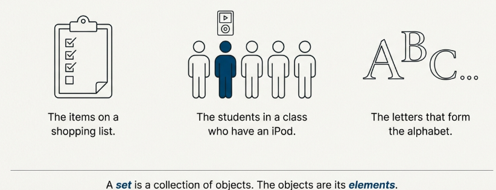

### Standard Notation

To discuss sets with precision, mathematicians use a standard symbolic language. The most essential notations are summarized below.

| Concept                             | Symbolic Representation                               |
| ----------------------------------- | ----------------------------------------------------- |
| Designating a set                   | Capital letters (e.g., $A, B, C$)                     |
| Representing an element             | Lower-case letters (e.g., $a, b, c$)                  |
| An element belongs to a set         | $a \in A$ (read as "$a$ is an element of $A$")        |
| An element does not belong to a set | $a \notin A$ (read as "$a$ is not an element of $A$") |

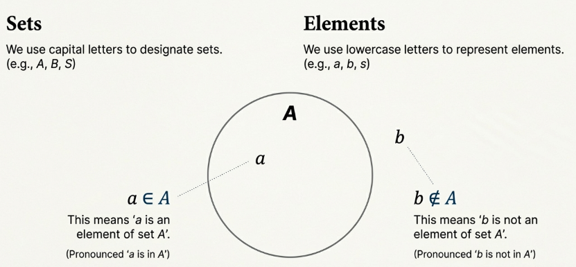

A critical requirement when describing a set is that the description must make it perfectly clear which elements belong to it. There are several standard methods for achieving this clarity.

### Roster Method

For sets with a small number of elements, the most straightforward method is to list them explicitly between braces $\\{\\}$.

For example, the set $S$ containing the first three positive integers is written as:

$$
S = \{1, 2, 3\}
$$

A key insight is that **the order in which elements are listed does not change the set**.

### Ellipsis Notation

When a set contains too many elements to list conveniently, the ellipsis ($\dots$) notation is used. It has two primary applications:

1. **"And so on up to"**: For a finite set with a clear pattern, the ellipsis indicates continuation up to a final element.

$$
X = \{1, 3, 5, \dots, 49\}
$$

represents the set of positive odd integers less than $50$.

2. **"And so on" indefinitely**: For an infinite set, the ellipsis indicates that the pattern continues without end.

$$
Y = \{2, 4, 6, \dots\}
$$

represents the set of all positive even integers.

### Set-Builder Notation

A powerful method for defining a set is to describe the property that all its elements must satisfy. This is known as **set-builder notation**. The general format is:

$$
S = \{x : p(x)\}
$$

This is read as "$S$ is the set of all elements $x$ such that the property $p(x)$ is true."

### The Special Case of the Empty Set

A set is not required to contain any elements. The unique set that contains no elements is called **the empty set**. It is denoted by one of two symbols:

$$
\emptyset
$$

or

$$
\{\}
$$

### Commonly Used Number Sets

Several sets of numbers are so frequently used in mathematics that they are given their own special symbols.

| Symbol       | Set Name         | Description/Example                                                                                    |
| ------------ | ---------------- | ------------------------------------------------------------------------------------------------------ |
| $\mathbb{N}$ | Natural Numbers  | The set of positive integers                                                                           |
| $\mathbb{Z}$ | Integers         | The set of positive, negative, and zero integers                                                       |
| $\mathbb{Q}$ | Rational Numbers | Numbers that can be expressed as a fraction $\frac{m}{n}$, where $m, n \in \mathbb{Z}$ and $n \neq 0$. |
| $\mathbb{R}$ | Real Numbers     | The set of all rational and irrational numbers.                                                        |
| $\mathbb{C}$ | Complex Numbers  | Numbers of the form $a + bi$, where $a, b \in \mathbb{R}$ and $i = \sqrt{-1}$.                         |

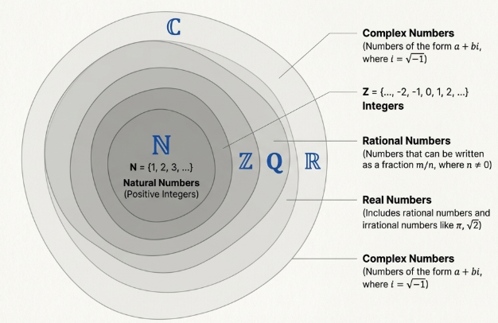

## Subsets

> [!NOTE] **Subset**
>
> A set $A$ is a subset of a set $B$ if every element of $A$ is also an element of $B$. This relationship is written as $A \subseteq B$.

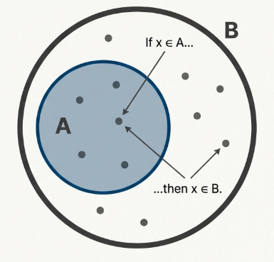

> [!TIP] **Proper Subset**
>
> A proper subset, written $A \subset B$, is a subset that is not equal to the other set. This means that $A \subseteq B$ but $A \neq B$. For this to be true, set $B$ must contain at least one element that is not in $A$.

> [!NOTE] **Set Equality**
>
> Two sets $A$ and $B$ are equal if and only if they have exactly the same elements. The formal way to prove that $A = B$ is to demonstrate a two-way subset relationship:
>
> 1. Show that $A$ is a subset of $B$ ($A \subseteq B$).
> 2. Show that $B$ is a subset of $A$ ($B \subseteq A$).
>
> If both of these conditions are met, the sets are equal.

> [!NOTE] **Power Set**
>
> For any given set $A$, the power set of $A$, denoted $\mathcal{P}(A)$, is the set containing all possible subsets of $A$.

For example, if $A = \\{1, 2, 3\\}$, its power set is: $\mathcal{P}(A) = \\{\emptyset, \\{1\\}, \\{2\\}, \\{3\\}, \\{1, 2\\}, \\{1, 3\\}, \\{2, 3\\}, \\{1, 2, 3\\}\\}$

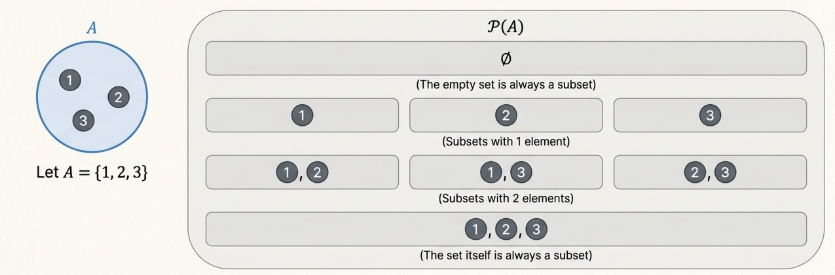

A crucial property of power sets is related to their size, or cardinality. For any finite set $A$, the number of elements in its power set is given by the formula:

$$
|\mathcal{P}(A)| = 2^{|A|}
$$

In the example above, $|A| = 3$, so $|\mathcal{P}(A)| = 2^3 = 8$.

## Set Operations

Just as numbers can be combined with operations like addition and multiplication, sets can be combined using operations to create new sets. The two most fundamental operations are **union** and **intersection**.

> [!NOTE] **Union of Sets**
>
> The union of two sets $A$ and $B$, denoted $A \cup B$, is the set of all elements belonging to $A$ or $B$ (or both). The "or" is inclusive. That is:
>
> $$A \cup B = \{x : x \in A \text{ or } x \in B\}$$

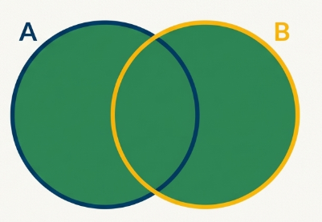

- The union of the set of Natural Numbers ($\mathbb{N}$) and the set of Integers ($\mathbb{Z}$) is $\mathbb{Z}$, since every natural number is also an integer. Thus, $\mathbb{N} \cup \mathbb{Z} = \mathbb{Z}$.
- The union of the set of Rational Numbers ($\mathbb{Q}$) and the set of Irrational Numbers ($\mathbb{Q}$) forms the set of all Real Numbers ($\mathbb{R}$). Thus, $\mathbb{Q} \cup \mathbb{I} = \\mathbb{R}$.

> [!NOTE] **Intersection of Sets**
>
> The intersection of two sets $A$ and $B$, denoted $A \cap B$, is the set of all elements belonging to $A$ and $B$. That is:
>
> $$A \cap B = \{x : x \in A \text{ and } x \in B\}$$

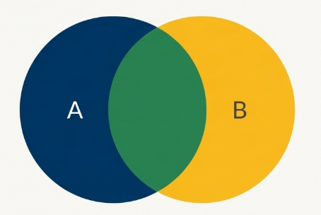

- The intersection of $\mathbb{N}$ and $\mathbb{Z}$ is $\mathbb{N}$, as the natural numbers are the elements common to both sets. Thus, $\mathbb{N} \cap \mathbb{Z} = \mathbb{N}$.
- The intersection of $\mathbb{Q}$ and $\mathbb{R}$ is $\mathbb{Q}$, since every rational number is also a real number. Thus, $\mathbb{Q} \cap \mathbb{R} = \mathbb{Q}$.

When two sets have no elements in common, their intersection is the empty set ($\emptyset$). Such sets are defined as being **disjoint**.

> [!NOTE] **Difference of Sets**
>
> The Difference between two sets, $A$ and $B$, denoted $A − B$, is the set of elements that belong to $A$ but do not belong to $B$. This operation is also written as $A \ B$.
>
> $$A − B = \{x : x \in A \text{ and } x \notin B\}$$

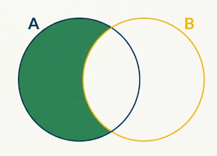

The difference $\mathbb{R} − \mathbb{Q}$ results in the set of Irrational Numbers ($\mathbb{I}$), as it includes all real numbers that are not rational.

> [!NOTE] **Complement of Sets**
>
> The Complement of a set $A$, denoted $\overline{A}$, consists of all elements in a given universal set $U$ that are not in $A$. The concept of a complement is always relative to a defined universal set.
>
> $$\overline{A} = U − A = \{x : x \in U \text{ and } x \notin A\}$$

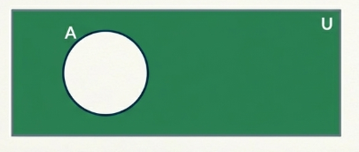

If the universal set is the set of all Integers ($U = \mathbb{Z}$), then the complement of the Natural Numbers ($\mathbb{N}$) is $\overline{\mathbb{N}} = \\{0, −1, −2, \dots\\}$.

If the universal set is the set of all Real Numbers ($U = \mathbb{R}$), then the complement of the Rational Numbers ($\mathbb{Q}$) is the set of Irrational Numbers ($\mathbb{I}$). Thus, $\overline{\mathbb{Q}} = \mathbb{I}$.

## Indexed Collections of Sets

While we can manually write $A \cup B \cup C$, this approach is untenable for dozens or an infinite number of sets. To manage such scenarios we require a more scalable and rigorous notation. This is accomplished through the use of indexed collections, which provide a formal mechanism for addressing any number of sets simultaneously.

> [!NOTE] **Indexed Collection of Sets**
>
> An **indexed collection of sets**, denoted
>
> $$\{S_{\alpha}\}_{\alpha \in I}$$
>
> is a collection where each set $S_{\alpha}$ is associated with a unique identifier $\alpha$ from an index set $I$.

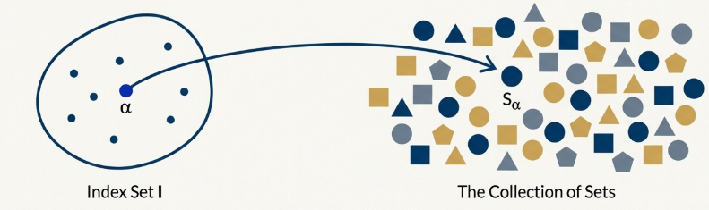

The symbol $\alpha$ serves as a dummy variable, allowing us to reference any specific set within the collection.

> [!TIP] **Union of an Indexed Collection**
>
> The union of an indexed collection is the set of all elements that appear in at least one of the sets in the collection:
>
> $$\bigcup_{\alpha \in I} S_{\alpha} = \{x : x \in S_{\alpha} \text{ for some } \alpha \in I\}$$

For example, for each natural number $n \in \mathbb{N}$, define the set $A_n$ as the closed interval $[-\frac{1}{n}, \frac{1}{n}]$.

The union results in $[−1, 1]$ because the collection of sets is nested ($\dots \subset A_3 \subset A_2 \subset A_1$). In such a nested sequence, the union is simply the largest set in the collection, which is $A_1 = [−1, 1]$.

Therefore:

$$
\bigcup_{n \in \mathbb{N}} A_n = [−1, 1]
$$

> [!TIP] **Intersection of an Indexed Collection**
>
> The intersection of an indexed collection is the set of all elements that are common to every set in the collection.
>
> $$\bigcap_{\alpha \in I} S_{\alpha} = \{x : x \in S_{\alpha} \text{ for all } \alpha \in I\}$$

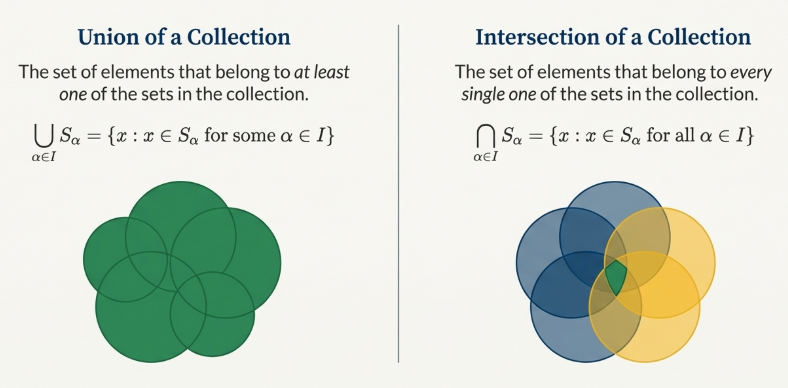

For example, re-examining the collection $A_n = [−\frac{1}{n}, \frac{1}{n}]$, the result

$$
\bigcap_{n \in \mathbb{N}} A_n = \{0\}
$$

is significant. To understand it, consider any non-zero real number, $x$. No matter how small $x$ is, we can always find a natural number $n$ large enough such that $\frac{1}{n} < |x|$.

For this $n$, $x$ is not in the interval $A_n$, and thus it cannot be in the intersection. The only number that remains in every interval as $n$ approaches infinity is $0$.

## Partitions of Sets

Partitioning is a formal method for dividing a whole into a collection of non-overlapping, exhaustive parts. This concept is fundamental to classification problems, data clustering, and parallel processing.

> [!NOTE] **Pairwise Disjoint Collections**
>
> A collection of subsets is **pairwise disjoint** if every two distinct subsets within the collection have an empty intersection.

Let $A = \\{1, 2, 3, 4, 5, 6, 7\\}$. The collection $S = \\{\\{1, 6\\}, \\{2, 5\\}, \\{4, 7\\}\\}$ is pairwise disjoint because the intersection of any two distinct sets from $S$ is $\emptyset$ (e.g., $\\{1, 6\\} \cap \\{2, 5\\} = \emptyset$).

> [!NOTE] **Partition of a Set**
>
> For a nonempty set $A$, a collection of subsets $S$ is a partition of $A$ if it satisfies three specific properties:
>
> 1. **Non-Empty Subsets**: $X \neq \emptyset$ for every set $X \in S$.
> 2. **Pairwise Disjoint**: For every two sets $X, Y \in S$, either $X = Y$ or $X \cap Y = \emptyset$.
> 3. **Complete Union**: $\bigcup_{X \inS} X = A$.

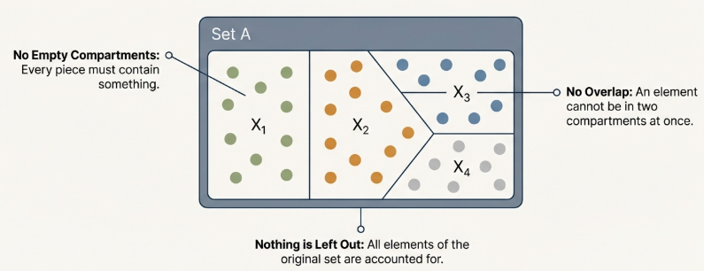

The 'non-empty' and 'complete union' properties together ensure that every element of $A$ belongs to at least one subset. The 'pairwise disjoint' property ensures that no element can belong to more than one. Combined, these three rigorous checks guarantee that every element of $A$ belongs to exactly one subset.

## TL;DR

**Describing Sets and Subsets**



**Set Operations, Indexed Collections of Sets and Partitions**


