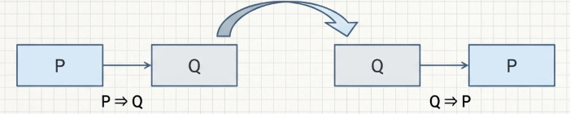
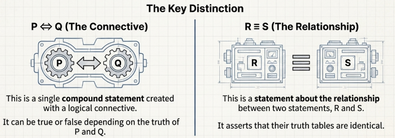

## The Statement

The central purpose of any mathematical endeavor is the pursuit of truth. We seek to understand the connections between concepts, the conditions under which an object possesses a certain property, and the answers to a host of other complex questions. However, discovering an answer is only half the task; we must also demonstrate its correctness with a certainty that is convincing to others. The framework that allows for this rigorous demonstration is logical reasoning. It provides the essential structure for building valid arguments, ensuring that the journey from known premises to new conclusions is sound, coherent, and can be communicated with clarity and conviction.

At the heart of mathematical logic lies its primary element, the statement, which serves as the atomic unit of truth. A statement is a declarative sentence that possesses a definitive truth value.

> [!NOTE] **The Statement**
>
> A **statement** is formally defined as a declarative sentence or assertion that is either true or false, but not both.

It is crucial to distinguish a statement's possession of a definitive truth value from our ability to determine that value. For a sentence to be a statement, it is not a requirement that we know whether it is true or false. Consider the sentence:

> "The $100$th digit in the decimal expansion of $\pi$ is $7$."

This is unambiguously a statement, as that digit is definitively one specific integer from $0$ to $9$, and thus the assertion is either true or false.

Not all sentences, however, qualify as statements. Sentences that lack a truth value, such as the following, fall outside the domain of logical analysis:

- Imperative (Commands): "Substitute the number $2$ for $x$."
- Interrogative (Questions): "Are these sets disjoint?"
- Exclamatory: "What an interesting question!"

> [!NOTE] **Open Sentence**
>
> An **open sentence** is a declarative sentence containing variables, which becomes a statement once values from a prescribed set, known as the domain, are substituted for these variables.

For example, consider the open sentence

$$
P(x): (x − 3)^2 \leq 1
$$

where the domain of the variable $x$ is the set of all integers, $\mathbb{Z}$. For any given integer substituted for $x$, $P(x)$ becomes a statement with a clear truth value. It is a true statement for any $x$ in the set $\\{2, 3, 4\\}$ and a false statement for all other integers.

> [!NOTE] **Truth Table**
>
> A **truth table** is an analytical tool used to systematically list all possible combinations of truth values for a set of statements.

The structure of a truth table is determined combinatorially. For $n$ distinct statements, the table must contain $2^n$ rows to account for every possible combination of their truth values. The table below illustrates this for two statements.

| P   | Q   | Statement |
| --- | --- | --------- |
| T   | T   | X         |
| T   | F   | X         |
| F   | T   | X         |
| F   | F   | X         |

## Logical Operators

The primary interest in mathematical logic arises not from analyzing individual statements in isolation, but from creating new, more complex statements from existing ones.

> [!NOTE] **Negation**
>
> The negation of a statement $P$, denoted by $\neg P$, is the statement "not $P$". It is the simplest logical operation, acting on a single statement to reverse its truth value.

The core rule of negation is straightforward: the negation of a true statement is false, and the negation of a false statement is true. This is summarized in its truth table.

| $P$ | $\neg P$ |
| --- | -------- |
| T   | F        |
| F   | T        |

For example, consider the statements:

- $P1$: "The integer $3$ is odd." (True)
- $P2$: "The integer $57$ is prime." (False)

Their negations are:

- $\neg P1$: "The integer $3$ is even." (False)
- $\neg P2$: "The integer $57$ is not prime." (True)

> [!NOTE] **Disjection: The Inclusive "Or"**
>
> The disjunction of two statements $P$ and $Q$, denoted by $P \lor Q$, corresponds to the statement "$P$ or $Q$". The truth condition is that $P \lor Q$ is true if at least one of $P$ or $Q$ is true. It is only false when both $P$ and $Q$ are false.

Mathematical logic defaults to this inclusive "or" because it is more fundamental and flexible. It must be distinguished from the **exclusive or**, which implies that exactly one of the conditions can be true.

The disjection truth table is as follows:

| $P$ | $Q$ | $P \lor Q$ |
| --- | --- | ---------- |
| T   | T   | T          |
| T   | F   | T          |
| F   | T   | T          |
| F   | F   | F          |

> [!NOTE] **Conjunction: The Strict "And"**
>
> The conjunction of two statements $P$ and $Q$, denoted by $P \land Q$, is the statement "$P$ and $Q$". Its truth condition is strict: $P \land Q$ is true only when both $P$ and $Q$ are true. If either statement is false, the entire conjunction is false.

The injection truth table is as follows:

| $P$ | $Q$ | $P \land Q$ |
| --- | --- | ----------- |
| T   | T   | T           |
| T   | F   | F           |
| F   | T   | F           |
| F   | F   | F           |

> [!NOTE] **Implication: The Condition Statement**
>
> The **implication**, or **conditional** statement, denoted by $P \rightarrow Q$, it is read as "If $P$, then $Q$." Where $P$ is identified as the **hypothesis** (or **premise**) and $Q$ is the **conclusion**. Its truth condition is that $P \rightarrow Q$ is false only in the specific case where $P$ is true and $Q$ is false. It is true in all other scenarios.

The implication truth table is as follows:

| $P$ | $Q$ | $P \rightarrow Q$ |
| --- | --- | ----------------- |
| T   | T   | T                 |
| T   | F   | F                 |
| F   | T   | T                 |
| F   | F   | T                 |

This definition is formally captured by the fact that the statement $\neg (P \rightarrow Q)$ has the exact same truth table as the statement $P \land (\neg Q)$. This confirms that the only scenario that invalidates the implication is one where $P$ is true while $Q$ is simultaneously false.

Of all the logical operators, the implication's truth table is often the most perplexing for newcomers. To demystify its logic, particularly the cases where the premise ($P$) is false, let us analyze a familiar, practical scenario. Imagine an instructor tells a student:

> "If you earn an A on the final exam, then you will receive an A for your final grade."

Let $P$ be "You earn an A on the final exam" and $Q$ be "You receive an A for your final grade." We analyze the instructor's statement in four cases:

- **Case 1**: $P$ is true, $Q$ is true. The student gets an A on the exam and an A in the course. The instructor's promise was fulfilled. The implication $P \rightarrow Q$ is true.
- **Case 2**: $P$ is true, $Q$ is false. The student gets an A on the exam but does not receive an A in the course. The instructor broke their promise. The implication $P \rightarrow Q$ is false.
- **Case 3**: $P$ is false, $Q$ is true. The student does not get an A on the exam but still receives an A in the course. The instructor did not lie. Their statement only specified what would happen if the student earned an A; it made no promises about other scenarios. The implication $P \rightarrow Q$ is true.
- **Case 4**: $P$ is false, $Q$ is false. The student does not get an A on the exam and does not get an A in the course. Again, the instructor's statement holds. No promise was broken. The implication $P \rightarrow Q$ is true.

### The Language of Implication

The conditional statement $P \rightarrow Q$ can be expressed in several equivalent ways, and familiarity with these is essential for interpreting mathematical arguments.

- If $P$, then $Q$.
- $Q$ if $P$.
- $P$ implies $Q$.
- $P$ only if $Q$.
- $P$ is sufficient for $Q$.
- $Q$ is necessary for $P$.

The phrase "$P$ only if $Q$" can be challenging, but it asserts that $P$ can be true only under the condition that $Q$ is also true—in other words, it is impossible for $P$ to be true while $Q$ is false.

Similarly, "$Q$ is necessary for $P$" means that for $P$ to be true, $Q$ must be true, which again mirrors the logic of the implication.

While the statement “$P$ is sufficient for $Q$” means that the truth of $P$ is sufficient to establish the truth of $Q$; in other words, the truth of $P$ implies the truth of $Q$.

### Extending Logical Operations to Open Sentences

The true power of logical operators is fully realized when they are applied not just to static statements but to open sentences containing variables. Consider the following open sentences, where the domain of x is the set of real numbers, $\mathbb{R}$:

$$P_1(x) : x = −3$$

$$P_2(x) : |x| = 3$$

We can construct new open sentences using the logical operators:

- **Negation**: $\neg P_1(x) : x \neq −3$
- **Disjunction**: $P_1(x) \lor P_2(x) : x = -3 \text{ or } |x| = 3$
- **Conjunction**: $P_1(x) \land P_2(x) : x = -3 \text{ and } |x| = 3$
- **Implication**: $P_1(x) \rightarrow P_2(x) : \text{If } x = −3, \text{ then } |x| = 3$

## The Converse and the Biconditional Statement

After analyzing a one-way implication, the logical next step is to investigate its reverse, known as the converse.

> [!NOTE] **The Converse of an Implication**
>
> The **converse** of a given implication $P \rightarrow Q$ is the statement formed by reversing the hypothesis and conclusion, resulting in the new implication $Q \rightarrow P$.

For example, consider the statements:

- $P_1$: $3$ is an odd integer.
- $P_2$: $57$ is prime.

The implication $P1 \rightarrow P2$ is:

> “If $3$ is an odd integer, then $57$ is prime.”

Its corresponding converse, $P2 \rightarrow P1$, is:

> “If $57$ is prime, then $3$ is an odd integer.”

> [!NOTE] **The Biconditional**
>
> The **biconditional** of two statements $P$ and $Q$, denoted $P \leftrightarrow Q$, is defined as the conjunction of the original implication and its converse: $(P \rightarrow Q) \land (Q \rightarrow P)$

An analysis of its truth table shows that the column for $(P \rightarrow Q) \land (Q \rightarrow P)$ is true only in the first row (where $P$ and $Q$ are both true) and the last row (where $P$ and $Q$ are both false). Thus, $P \leftrightarrow Q$ is true if and only if $P$ and $Q$ have the same truth value. If they have different truth values, the biconditional is false.

This two-way relationship gives rise to its most common linguistic expressions:

- $P$ if and only if $Q$.
- $P$ is a necessary and sufficient condition for $Q$.

These phrases are justified by their components. The phrase "$P$ if $Q$" corresponds to the converse ($Q \rightarrow P$), while the phrase "$P$ only if $Q$" corresponds to the original implication ($P \rightarrow Q$).

## Logical Equivalence

> [!NOTE] **Logical Equivalence**
>
> Two compound statements, $R$ and $S$, are logically equivalent (denoted $R \equiv S$) if they have the same truth values for all possible combinations of truth values of their component statements.

It is important to distinguish the biconditional statement from the concept of logical equivalence. A biconditional ($R \leftrightarrow S$) is a compound statement whose truth depends on the specific truth values of its components, $R$ and $S$. In contrast, logical equivalence ($R \equiv S$) describes a relationship where two compound statements are identical in truth value under all possible circumstances.

This concept is fundamentally connected to **tautologies**.

> [!NOTE] **Tautology**
>
> A **tautology** is a compound statement that is true for all possible truth values of its components.

> [!TIP] **Logical Equivalence and Tautologies**
>
> Two statements $R$ and $S$ are logically equivalent if and only if the biconditional statement $R \leftrightarrow S$ is a tautology.

If two statements are logically equivalent, one can be substituted for the other within a logical argument without altering the argument's validity. This allows for the transformation of a statement into an equivalent form that may be simpler to analyze or prove.

> [!TIP] **Theorem 2.17**
>
> Let $P$ and $Q$ be compount statements, then
>
> $$P \rightarrow Q \equiv (\neq P) \lor Q$$

## Fundamental Properties and Laws of Logical Equivalence

> [!TIP] **Foundational Laws**
>
> Given compound statement $P, Q$ and $R$
>
> - **Double Negation**:
>
> $$P \equiv \neg P$$
>
> - **Commutative Laws**:
>
> $$P \lor Q \equiv Q \lor P$$
> $$P \land Q \equiv Q \land P$$
>
> - **Associative Laws**:
>
> $$P \lor (Q \lor R) \equiv (P \lor Q) \lor R$$
> $$P \land (Q \land R) \equiv (P \land Q) \land R$$
>
> - **Distributive Laws**:
>
> $$P \lor (Q \land R) \equiv P \lor Q \land P \lor R$$
> $$P \land (Q \lor R) \equiv P \land Q \lor P \land R$$
>
> - **De Morgan's Laws**:
>
> $$\neg (P \lor Q) \equiv \neg P \land \neg Q$$
> $$\neg (P \land Q) \equiv \neg P \lor \neg Q$$

Each of these laws can be formally verified by constructing a truth table. For instance, the distributive law $P \lor (Q \land R) \equiv (P \lor Q) \land (P \lor R)$ is proven by demonstrating that the truth columns for both statements are identical for all possible truth values of $P$, $Q$, and $R$.

| $P$ | $Q$ | $R$ | $Q \land R$ | $P \lor (Q \land R)$ | $P \lor Q$ | $P \lor R$ | $(P\lor Q) \land (P\lor R)$ |
| --- | --- | --- | ----------- | -------------------- | ---------- | ---------- | --------------------------- |
| T   | T   | T   | T           | **T**                | T          | T          | **T**                       |
| T   | T   | F   | F           | **T**                | T          | T          | **T**                       |
| T   | F   | T   | F           | **T**                | T          | T          | **T**                       |
| T   | F   | F   | F           | **T**                | T          | F          | **T**                       |
| F   | T   | T   | T           | **T**                | T          | T          | **T**                       |
| F   | T   | F   | F           | **F**                | T          | F          | **F**                       |
| F   | F   | T   | F           | **F**                | F          | T          | **F**                       |
| F   | F   | F   | F           | **F**                | F          | F          | **F**                       |

## Quantified Statements

Quantification is a method used in logic to transform an open sentence, which contains variables, into a formal statement with a definitive truth value. An open sentence $P(x)$ over a domain $S$ becomes a statement for each $x \in S$. Quantification provides another way to convert $P(x)$ into a single statement.

> [!NOTE] **The Universal Quantifier**
>
> The phrase "for every," "for each," or "for all" is the **universal quantifier**, denoted by the symbol $\forall$.

The quantified statement $\forall x \in S, P(x)$ is true if and only if $P(x)$ is true for every element $x$ in the domain $S$. It is false if there is at least one element $x$ in $S$ for which $P(x)$ is false.

> [!NOTE] **The Existential Quantifier**
>
> The phrase "there exists," "there is," "for some," or "for at least one" is the **existential quantifier**, denoted by the symbol $\exists$.

The quantified statement $\exists x \in S, P(x)$ is true if and only if $P(x)$ is true for at least one element $x$ in the domain $S$. It is false if $P(x)$ is false for all elements $x$ in $S$.

### Negation of Quantified Statements

The negation of quantified statements follows specific rules that invert the quantifier and negate the open sentence.

**Negation of a Universal Statement:**

$$
\neg (\forall x \in S, P(x)) \equiv \exists x \in S, \neg P(x)
$$

Says that the statement "It is not the case that for all $x$, $P(x)$" is equivalent to "There exists an $x$ such that not $P(x)$."

Negation of an Existential Statement:

$$
\neg (\exists x \in S, Q(x)) \equiv \forall x \in S, \neg Q(x)
$$

Says that the statement "It is not the case that there exists an $x$ such that $Q(x)$" is equivalent to "For all $x$, not $Q(x)$."

### Statements with Multiple Quantifiers

Statements can involve multiple variables and quantifiers. The order and type of quantifiers are critical to the meaning of the statement.

**Negating Two Universal Quantifiers:**

$$
\neg (\forall x \in S, \forall y \in T, P(x, y)) \equiv \exists x \in S, \exists y \in T, \neg P(x, y)
$$

**Negating Two Existential Quantifiers:**

$$
\neg (\exists x \in S, \exists y \in T, P(x, y)) \equiv \forall x \in S, \forall y \in T, \neg P(x, y)
$$

**Negating Mixed Quantifiers:**

$$
\neg (\forall a \in S, \exists b \in T, P(a, b)) \equiv \exists a \in S, \forall b \in T, \neg P(a, b)
$$

$$
\neg (\exists a \in S, \forall b \in T, Q(a, b)) \equiv \forall a \in S, \exists b \in T, \neg Q(a, b)
$$

## Characterizations of Statements

A characterization provides an alternative, logically equivalent way of defining or describing a mathematical concept.

> [!NOTE] **Characterization**
>
> Let $P(x)$ be an open sentence over a domain $S$ that defines a concept, and let $Q(x)$ be another open sentence over the same domain. $Q(x)$ is said to be a **characterization** of the concept if the quantified statement
>
> $$\forall x \in S, P(x) \leftrightarrow Q(x)$$
>
> is true.

Examples of Characterizations:

> Irrational Numbers: A real number $r$ is irrational if and only if $r$ has a nonrepeating decimal expansion.

> Equilateral Triangles: A triangle $T$ is equilateral if and only if $T$ has three equal angles.

It is important to distinguish a characterization from a definition. A definition establishes the primary meaning of a concept. For example, "A triangle $T$ is equilateral if and only if $T$ has three equal sides" is the definition, not a characterization. A characterization provides a valuable, equivalent alternative perspective that can be useful in proofs and further study.
