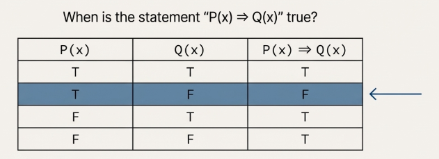
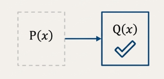
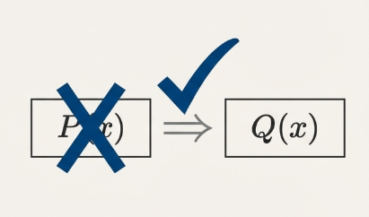
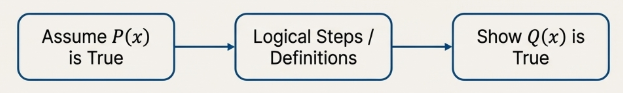
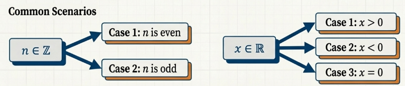

## Trivial and Vacuous Proofs

In the discipline of mathematics, precision in language is the foundation upon which all logical reasoning is built. Before one can construct or analyze a mathematical proof, it is critical to understand the formal classification of mathematical statements: from foundational axioms to consequential corollaries. Understanding this structure is the first step toward appreciating the logical architecture of proof.

> [!NOTE] **Axiom**
>
> An **axiom** is a true mathematical statement that is accepted without proof. These are the foundational assumptions from which other truths are derived.

For example, Euclid's axiom states that for every line $l$ and a point $P$ not on $l$, there exists a unique line containing $P$ that is parallel to $l$.

> [!NOTE] **Theorem**
>
> A **theorem** is a true mathematical statement whose truth can be verified. The term is often reserved for statements that are particularly significant or interesting within their field.

> [!NOTE] **Result**
>
> A **result** is general term for a true and verifiable mathematical statement. This term is used to illustrate proof techniques without necessarily implying the major significance associated with a theorem.

> [!NOTE] **Corollary**
>
> A **corollary** is a mathematical result that can be deduced from, and is thereby a consequence of, some previously established result.

> [!NOTE] **Lemma**
>
> A **lemma** is a mathematical result that serves primarily as a tool for proving another, more significant result. It is often considered a "helping theorem," valued for its utility in a larger proof rather than for its own intrinsic importance.

### Trivial and Vacuous Proofs

The most direct, albeit less common, proof techniques are those that rely on the fundamental truth table of a logical implication. These methods, known as **trivial and vacuous proofs**, arise from special cases where the truth value of the entire implication $P \rightarrow Q$ can be determined by analyzing the conclusion ($Q$) or the hypothesis ($P$) in isolation.

The validity of trivial and vacuous proofs stems directly from the definition of a logical implication. An implication is only false when a true hypothesis, $P$, leads to a false conclusion, $Q$; in all other cases, it is true.

> [!NOTE] **Trivial Proof**
>
> A **trivial proof** is a method used to prove an implication $\forall x \in S, P(x) \rightarrow Q(x)$ by demonstrating that the conclusion, $Q(x)$, is true for all elements $x$ in the domain $S$.

The trivial proof holds because if $Q(x)$ is always true, the implication $P(x) \rightarrow Q(x)$ is true regardless of the truth value of the hypothesis $P(x)$. For example:

> Let $x \in \mathbb{R}$. If $x < 0$, then $x^2 + 1 > 0$.
>
> The proof begins by observing that for any real number $x$, the expression $x^2$ is always greater than or equal to zero. From this known property, it directly follows that $x^2 + 1$ must be strictly greater than zero.
>
> This constitutes a trivial proof because the conclusion, $x^2 + 1 > 0$, is true for all real numbers.

> [!NOTE] **Vacuous Proof**
>
> A **vacuous proof** is a technique used to prove an implication $\forall x \in S, P(x) \leftarrow Q(x)$ by demonstrating that the hypothesis, $P(x)$, is false for all elements $x$ in the domain $S$.

According to the [truth table of the implication](/math/mptam/02_logic/#logical-operators), if $P(x)$ is always false, the implication $P(x) \leftarrow Q(x)$ is automatically true, irrespective of the truth value of the conclusion $Q(x)$. For example:

> Let $x \in \mathbb{R}$. If $x^2 − 2x + 2 \leq 0$, then $x^3 \geq 8$
>
> The expression $x^2 − 2x + 2$ is rewritten as $(x − 1)^2 + 1$. Since $(x − 1)^2$ is the square of a real number, it must be greater than or equal to zero. Therefore, $(x − 1)^2 + 1 \geq 1$.
>
> This manipulation demonstrates that the hypothesis, $x^2 − 2x + 2 ≤ 0$, can never be true for any real number $x$. Because the hypothesis is universally false for the entire domain, the implication is true by definition.

## Direct Proof

The direct proof is the most common and intuitive technique in mathematics. Its strategy is straightforward and constructive: to demonstrate that an implication $P \rightarrow Q$ is true by assuming the hypothesis $P$ is true and building a direct, logical bridge of justified steps that inevitably leads to the conclusion $Q$.

> [!NOTE] **Methodology of a Direct Proof**
>
> The formal procedure for a **direct proof** of the statement $\forall x \in S, P(x) \rightarrow Q(x)$ is as follows:
>
> 1. Assume that $P(x)$ is a true statement for an arbitrary element $x$ from the domain $S$.
> 2. Using this assumption, along with established definitions, axioms, and previously proven results, construct a sequence of logical deductions.
> 3. Show that this sequence of deductions necessarily leads to the conclusion that $Q(x)$ is also a true statement.

For example:

> If $n$ is an odd integer, then $3n + 7$ is an even integer.
>
> Assume that $n$ is an odd integer. Since $n$ is odd, by definition, we can write $n = 2k + 1$ for some integer $k$. Now
>
> $$3n + 7 = 3(2k + 1) + 7 = 6k + 3 + 7 = 6k + 10 = 2(3k + 5)$$
>
> Since $3k + 5$ is an integer, $3n + 7$ is even by definition.

> [!NOTE] **Proof by Exhaustion**
>
> When the domain of a variable is a small, finite set, a direct proof can be conducted by individually testing every element that satisfies the hypothesis. This is known as **proof by exhaustion**.

For example:

> Let $S = \\{1, 2, 3\\}$ and let $n \in S$. If $\frac{n(n + 3)}{2}$ is even, then $\frac{(n + 2)(n − 5)}{2}$ is even.
>
> Let's proceeds by first identifying which elements in the domain $S = \\{1, 2, 3\\}$ satisfy the hypothesis, $P(n): \frac{n(n + 3)}{2}$ is even.
>
> - For $n = 1, \frac{n(n + 3)}{2} = 2$, which is even.
> - For $n = 2, \frac{n(n + 3)}{2} = 5$, which is odd.
> - For $n = 3, \frac{n(n + 3)}{2} = 9$, which is odd.
>
> We only need to consider the cases where the hypothesis is true. In this domain, only $n = 1$ satisfies the condition.
>
> We then verify the conclusion, $Q(n): \frac{(n + 2)(n − 5)}{2}$ is even, for $n = 1$. When $n = 1$, the conclusion is
>
> $$\frac{(1 + 2)(1 − 5)}{2} = -6$$
>
> which is an even integer. Since the conclusion holds for the only element that satisfies the hypothesis, the implication is proven to be true for the entire domain $S$.

## Proof by Contrapositive

> [!TIP] **Logical Equivalence: Implication and Contrapositive**
>
> For every two statements $P$ and $Q$, the implication $P \rightarrow Q$ and its contrapositive are logically equivalent; that is,
>
> $$P \rightarrow Q \equiv (\neg Q) \rightarrow (\neg P)$$

This equivalence can be verified using a truth table, which compares the truth values of both statements for all possible truth values of $P$ and $Q$.

| $P$ | $Q$ | $P \rightarrow Q$ | $\neg Q$ | $\neg P$ | $(\neg Q) \rightarrow (\neg P)$ |
| --- | --- | ----------------- | -------- | -------- | ------------------------------- |
| T   | T   | **T**             | F        | F        | **T**                           |
| T   | F   | **F**             | T        | F        | **F**                           |
| F   | T   | **T**             | F        | T        | **T**                           |
| F   | F   | **T**             | T        | T        | **T**                           |

Since the truth-value columns for $P \rightarrow Q$ and $(\neg Q) \rightarrow (\neg P)$ are identical, the statements are logically equivalent. This equivalence gives rise to the **proof by contrapositive**.

> [!NOTE] **Proof by Contrapositive**

> To prove a statement $P(x) \rightarrow Q(x)$, one can instead construct a direct proof of its contrapositive, $(\neg Q(x)) \rightarrow (\neg P(x))$.
>
> The procedure is to assume that $\neg Q(x)$ is true for an arbitrary element $x$ and, through a series of logical steps, demonstrate that $\neg P(x)$ must also be true.

This method is particularly useful when the negation of the conclusion provides a more convenient starting point than the original hypothesis. For example:

> Let $x \in \mathbb{Z}$. If $5x − 7$ is even, then $x$ is odd.
>
> Here, the implication is $P(x) \rightarrow Q(x)$, where:
>
> - $P(x)$: $5x − 7$ is even.
> - $Q(x)$: $x$ is odd.
>
> We prove the contrapositive statement, $(\neg Q(x)) \leftarrow (\neg P(x))$:
>
> If $x$ is even, then $5x − 7$ is odd.
>
> Assume that $x$ is even. By definition,
>
> $$x = 2a$$
>
> for some integer $a$. Substituting this into the expression $5x - 7$ gives:
>
> $$5x − 7 = 5(2a) − 7 = 10a − 7$$
>
> To show this is odd, we express it in the form $2k + 1$:
>
> $$10a − 7 = 10a − 8 + 1 = 2(5a − 4) + 1$$
>
> Since $5a − 4$ is an integer, $5x − 7$ is an odd integer.

### Proving Biconditional Statements

Proving a biconditional statement, $P \leftrightarrow Q$, requires establishing the truth of two distinct implications:

1. The implication: $P \rightarrow Q$
2. The converse: $Q \rightarrow P$

The proof of a biconditional thus unfolds in two parts, often employing different proof techniques for each part as needed. For example:

> Let $x \in \mathbb{Z}$. Then $11x − 7$ is even if and only if $x$ is od
>
> **Part 1** (If $x$ is odd, then $11x − 7$ is even): This part is proven using a direct proof.
>
> - Assume $x$ is odd. Then $x = 2r + 1$ for some integer $r$.
> - Substituting gives: $11x − 7 = 11(2r + 1) − 7 = 22r + 11 − 7 = 22r + 4 = 2(11r + 2)$.
> - Since $11r + 2$ is an integer, $11x − 7$ is even.
>
> **Part 2** (If $11x − 7$ is even, then $x$ is odd): This part, the converse of Part 1, is proven by contrapositive. The contrapositive statement is "If $x$ is even, then $11x - 7$ is odd."
>
> - Assume $x$ is even. Then $x = 2s$ for some integer $s$.
> - Substituting gives: $11x − 7 = 11(2s) − 7 = 22s − 7 = 22s − 8 + 1 = 2(11s − 4) + 1$.
> - Since $11s − 4$ is an integer, $11x − 7$ is odd.
>
> By proving both implications, the biconditional statement is established.

## Advanced Proof Structures and Strategies

Beyond the foundational methods of direct and contrapositive proofs, mathematicians employ various structural strategies to deconstruct complex problems into more manageable components. Among the most fundamental of these are the use of lemmas to streamline arguments and the method of proof by cases to handle statements with multiple conditions.

### The Utility of Lemmas

A direct or contrapositive proof might be complicated. However, the proof becomes straightforward with the help of a preliminary lemma. For example:

> **Lemma 3.13**: Let $x \in \mathbb{Z}$. If $5x − 7$ is odd, then $x$ is even.
>
> Assume $x$ is odd. Then $x = 2y + 1$ for some integer $y$. Then
>
> $$5x − 7 = 5(2y + 1) − 7 = 10y + 5 − 7 = 10y − 2 = 2(5y − 1)$$
>
> Since $5y − 1$ is an integer, $5x − 7$ is even.
>
> **Result 3.14**: Let $x \in \mathbb{Z}$. If $5x − 7$ is odd, then $9x + 2$ is even.
>
> Let's assume $5x − 7$ is an odd integer. By Lemma 3.13, we know that $x$ must be even. Since $x$ is even, we can write $x = 2z$ for some integer $z$. Therefore
>
> $$9x + 2 = 9(2z) + 2 = 18z + 2 = 2(9z + 1)$$
>
> Because $9z + 1$ is an integer, $9x + 2$ is even.

### Proof by Cases

> [!NOTE] **Proof by Cases**
>
> A **proof by cases** is a method used when the hypothesis can be divided into a set of distinct scenarios that, taken together, cover all possibilities. If the conclusion can be proven to hold true in each case, then the statement is proven true in general.

For example:

> If $n \in \mathbb{Z}$, then $n^2 + 3n + 5$ is an odd integer.
>
> We can prove this result by considering two cases that exhaust all possibilities for an integer $n$.
>
> **Case 1: $n$ is even**. If $n$ is even, then $n = 2x$ for some integer $x$. Then
>
> $$n^2 + 3n + 5 = (2x)^2 + 3(2x) + 5 = 4x^2 + 6x + 5 = 2(2x^2 + 3x + 2) + 1$$
>
> Since $2x^2 + 3x + 2$ is an integer, $n^2 + 3n + 5$ is odd.
>
> **Case 2: $n$ is odd**. If $n$ is even, then $n = 2y + 1$ for some integer $y$. Then
>
> $$n^2 + 3n + 5 = (2y + 1)^2 + 3(2y + 1) + 5 = (4y^2 + 4y + 1) + (6y + 3) + 5 = 4y^2 + 10y + 9 = 2(2y^2 + 5y + 4) + 1$$
>
> Since $2y^2 + 5y + 4$ is an integer, $n^2 + 3n + 5$ is odd.

## Common Pitfalls in Proof Construction

Learning to construct valid mathematical arguments is only half the battle; learning to identify flaws in faulty arguments is an equally crucial skill. The critical evaluation of proofs reinforces a rigorous understanding of logical principles and helps cultivate the precision required for mathematical certainty.

> [!TIP] **Flaw 1: Generalizing from Specific Examples**
>
> A proof must establish the truth of a statement for all applicable cases, not just for a few carefully selected ones. An argument based on specific examples is a demonstration, not a proof.

For example:

> If $x$ and $y$ are integers of the same parity, then $x − y$ is even.
>
> **Proposed proof**: Let $x$ and $y$ be two integers of the same parity. We consider two cases.
>
> - Case 1. $x$ and $y$ are both even. Let $x = 6$ and $y = 2$, which are both even. Then $x − y = 4$, which is even.
> - Case 2. $x$ and $y$ are both odd. Let $x = 7$ and $y = 1$, which are both odd. Then $x − y = 6$, which is even.
>
> **This argument is invalid. While the result itself is true, the reasoning fails because it does not hold for arbitrary integers.**

> [!TIP] **Flaw 2: Incorrect Variable Assignment**
>
> In a proof, each variable represents a specific quantity. Using the same variable to represent two different, independent quantities can impose a false constraint on the argument, leading to an invalid conclusion.

For example:

> If $m$ is an even integer and $n$ is an odd integer, then $3m + 5n$ is odd.
>
> **Proposed proof**: Let $m$ be an even integer and $n$ an odd integer. Then $m = 2k$ and $n = 2k + 1$, where $k \in \mathbb{Z}$. Therefore,
>
> $$3m + 5n = 3(2k) + 5(2k + 1) = 6k + 10k + 5 = 16k + 5 = 2(8k + 2) + 1$$
>
> Since $8k + 2$ is an integer, $3m + 5n$ is odd.
>
> This proof contains a subtle but critical error in the second sentence. By defining $m = 2k$ and $n = 2k + 1$ with the same integer variable $k$, **the proof inadvertently adds the assumption that $n = m + 1$**. The hypothesis, however, only states that $m$ is even and $n$ is odd, without any requirement that they be consecutive.
