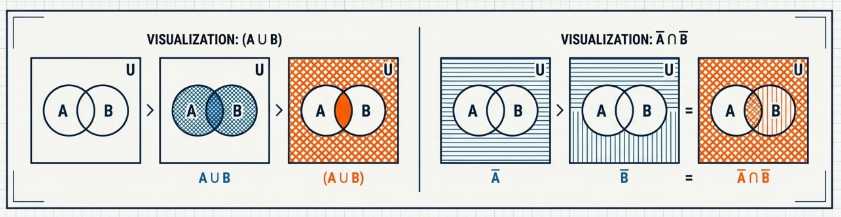

## Proofs Involving Divisibility of Integers

> [!NOTE] **Divisibility**
>
> For integers $a$ and $b$ where $a \neq 0$, we say that $a$ **divides** $b$ if there exists an integer $c$ such that $b = ac$. The standard notation for this relationship is $a | b$. If a does not divide $b$, we write $a \not | b$.

Associated with this definition are two key terms. If $a | b$, we say that $b$ is a **multiple** of $a$, and that $a$ is a **divisor** of $b$.

The abstract properties of divisibility are not merely asserted; they are formally established through logical proof. This section demonstrates the application of the direct proof method to establish three foundational theorems of divisibility.

> [!TIP] **The Transitive Property**
>
> Let $a, b$ and $c$ be integers with $a \neq 0$ and $b \neq 0$. If $a | b$ and $b | c$, then $a | c$.

> **Proof**
>
> Assume that $a | b$ and $b | c$. By the definition of divisibility, there exist integers $x$ and $y$ such that $b = ax$ and $c = by$.
>
> By substituting the expression for $b$ into the equation for $c$, we obtain:
>
> $$c = by = (ax)y = a(xy)$$
>
> Since $x$ and $y$ are integers, their product $xy$ is also an integer. Therefore, $c$ can be expressed as the product of $a$ and an integer, which satisfies the definition of $a | c$.

> [!TIP] **Divisibility of Products**
>
> Let $a, b, c$ and $d$ be integers with $a \neq 0$ and $b \neq 0$. If $a | c$ and $b | d$, then $ab | cd$.

> **Proof**
>
> Assume that $a | c$ and $b | d$. By definition, this means $c = ax$ and $d = by$ for some integers $x$ and $y$.
>
> We then consider the product $cd$:
>
> $$cd = (ax)(by) = (ab)(xy)$$
>
> Since $x$ and $y$ are integers, $xy$ is also an integer. Thus, the product $cd$ is a multiple of $ab$, which means $ab | cd$.

> [!TIP] **The Property of Linear Combinations**
>
> Let $a, b, c, x, y \in \mathbb{Z}$, where $a \neq 0$. If $a | b$ and $a | c$, then $a | (bx + cy)$.

> **Proof**
>
> Assume that $a | b$ and $a | c$. This implies that $b = ar$ and $c = as$ for some integers $r$ and $s$.
>
> We examine the linear combination $bx + cy$:
>
> $$bx + cy = (ar)x + (as)y = a(rx + sy)$$
>
> Since $r, s, x$, and $y$ are all integers, the expression $rx + sy$ is also an integer. Therefore, $a$ divides the linear combination $bx + cy$.

## Proofs Involving Congruence of Integers

The concept of congruence formalizes the idea that different integers can be equivalent with respect to a divisor.

> [!NOTE] **Congruence modulo $n$**
>
> For integers $a, b$, and $n$ where $n \geq 2$, we say $a$ is congruent to $b$ modulo $n$, written $a \equiv b (\text{mod } n)$, if $n | (a − b)$.

Congruence is fundamentally linked to remainders. For any integer $x$ and any modulus $n \geq 2$, $x$ must be congruent to its remainder upon division by $n$. Consequently, for any integer $x$, exactly one of the following statements holds true:

$$
x \equiv 0 (\text{mod } n) \\[10pt]
x \equiv 1 (\text{mod } n) \\[10pt]
\vdots \\[10pt]
x \equiv n -1 (\text{mod } n) \\
$$

This structure partitions the set of all integers into $n$ distinct equivalence classes.

A primary reason for the utility of congruence is that it behaves in many ways like ordinary equality, particularly with respect to arithmetic operations such as addition and multiplication.

> [!TIP] **Conguence Multiplication by a Constant**
>
> Let $a, b, k$ and $n$ be integers where $n \geq 2$. If $a \equiv b (\text{mod } n)$, then $ka \equiv kb (\text{mod } n)$.

> **Proof**
>
> Assume that $a \equiv b (\text{mod } n)$. By definition, $n | (a − b)$, which means $a − b = nx$ for some integer $x$.
>
> Multiplying both sides by $k$, we get:
>
> $$k(a − b) = k(nx)$$
>
> $$ka − kb = n(kx)$$
>
> Since $k$ and $x$ are integers, their product $kx$ is also an integer. Therefore, $n | (ka − kb)$, which means $ka \equiv kb (\text{mod } n)$.

> [!TIP] **Addition of Congruences**
>
> Let $a, b, c, d, n \in \mathbb{Z}$ where $n \geq 2$. If $a \equiv b (\text{mod } n)$ and $c \equiv d (\text{mod } n)$, then $a + c \equiv b + d (\text{mod } n)$.

> **Proof**
>
> Assume that $a \equiv b (\text{mod } n)$ and $c \equiv d (\text{mod } n)$. This implies that $a − b = nx$ and $c − d = ny$ for some integers $x$ and $y$. Adding these two equations gives:
>
> $$(a − b) + (c − d) = nx + ny$$
>
> $$(a + c) − (b + d) = n(x + y)$$
>
> Since $x + y$ is an integer, $n$ divides $(a + c) − (b + d)$. Therefore, $a + c \equiv b + d (\text{mod } n)$.

> [!TIP] **Multiplication of Congruences**
>
> Let $a, b, c, d, n \in \mathbb{Z}$ where $n \geq 2$. If $a \equiv b (\text{mod } n)$ and $c \equiv d (\text{mod } n)$, then $ac \equiv bd (\text{mod } n)$.

> **Proof**
>
> Assume that $a \equiv b (\text{mod } n)$ and $c \equiv d (\text{mod } n)$. This gives us $a − b = nx$ and $c − d = ny$, where $x, y \in \mathbb{Z}$. We can rewrite these as $a = b + nx$ and $c = d + ny$.
>
> Multiplying these two equations, we obtain:
>
> $$ac = (b + nx)(d + ny) = bd + bny + dnx + n^2xy$$
>
> Rearranging the terms to isolate $ac − bd$:
>
> $$ac − bd = n(by + dx + nxy)$$
>
> Since $b, d, n, x$, and $y$ are all integers, the expression $by + dx + nxy$ is also an integer. Thus, $n | (ac − bd)$, and it follows that $ac \equiv bd (\text{mod } n)$.

## Proofs Involving Real Numbers

Proofs in real analysis, the branch of mathematics concerning real numbers, often rely on foundational axioms and well-established properties, such as the behavior of inequalities and the zero-product property.

> [!TIP] **The Zero-Product Property**
>
> Let $x, y \in \mathbb{R}$. If $xy = 0$, then $x = 0$ or $y = 0$.

> **Proof**
>
> Assume that $xy = 0$. We consider two cases.
>
> Case 1: $x = 0$. In this case, the conclusion ($x = 0$ or $y = 0$) is true.
>
> Case 2: $x \neq 0$. Since $x$ is a non-zero real number, its reciprocal $\frac{1}{x}$ exists. Multiplying the equation $xy = 0$ by $\frac{1}{x}$, we obtain:
>
> $$\frac{1}{x} xy = \frac{1}{x} 0$$
>
> $$\frac{x}{x} y = 0$$
>
> $$y = 0$$
>
> In this case, we have shown that $y = 0$, and the conclusion holds.

> [!NOTE] **Absolute Value**
>
> The absolute value $|x|$ for a real number $x$ is defined as:
>
> $$|x| = \begin{cases}x & \text{if } x \geq 0 \\ -x & \text{if } x < 0\end{cases}$$

> [!TIP] **The Triangle Inequality**
>
> For every two real numbers $x$ and $y$,
>
> $$|x + y| \leq |x| + |y|$$

> **Proof**
>
> Since $|x + y| = |x| + |y|$ if either $x$ or $y$ is $0$, we can assume that $x$ and $y$ are nonzero.
>
> **Case 1**: $x > 0$ and $y > 0$. In this case, $x + y > 0$. By definition, $|x + y| = x + y$. Also, $|x| = x$ and $|y| = y$. Thus, $|x + y| = |x| + |y|$.
>
> **Case 2**: $x < 0$ and $y < 0$. Here, $x + y < 0$. By definition, $|x + y| = −(x + y) = (−x) + (−y)$. Since $x$ and $y$ are negative, $|x| = −x$ and $|y| = −y$. Thus, $|x + y| = |x| + |y|$.
>
> **Case 3**: One of $x$ and $y$ is positive and the other is negative. Without loss of generality, assume $x > 0$ and $y < 0$. We consider two subcases.
>
> **Subcase 3.1**: $x + y \geq 0$. Then $|x + y| = x + y$. The right side of the inequality is $|x| + |y| = x + (−y) = x − y$. Since $y$ is negative, $−y$ is positive, so $x − y > x + y$. Therefore, $|x + y| < |x| + |y|$.
>
> **Subcase 3.2.**: $x + y < 0$. Then $|x + y| = −(x + y) = −x − y$. The right side is again $|x| + |y| = x − y$. Since $x > 0$, it follows that $x > -x$, and so $x − y > −x − y$. This gives us the inequality $|x| + |y| = x − y > −x − y = −(x + y)$. Therefore, $|x| + |y| > |x + y|$.
>
> In all cases, $|x + y| \leq |x| + |y|$.

## Proofs Involving Sets

Proofs in set theory adhere to their own established conventions, which are built upon the foundational rules of logic.

> [!NOTE] **Proving Set Equality**
>
> To prove that two sets, $C$ and $D$, are equal ($C = D$), one must complete two independent proofs:
>
> 1. Prove $C \subseteq D$: Show that every element of $C$ is also an element of $D$. This is typically done by taking an arbitrary element $x \in C$ and showing through a series of logical steps that $x$ must also be in $D$.
> 2. Prove $D \subseteq C$: Show that every element of $D$ is also an element of $C$.

> [!TIP] **Relation between the Set Difference and the Intersection**
>
> For every two sets $A$ and $B$, $A − B = A \cap \overline{B}$.

> **Proof**
>
> **Part 1 (Proving $A − B \subseteq A \cap \overline{B}$)**: Let $x$ be an arbitrary element of $A − B$. By the definition of set difference, this means $x \in A$ and $x \notin B$. Since $x \notin B$, it follows by the definition of a complement that $x \in \overline{B}$. We now have that $x \in A$ and $x \notin \overline{B}$. By the definition of set intersection, this implies $x \in A ∩ \overline{B}$. Therefore, $A − B \subseteq A \cap \overline{B}$.
>
> **Part 2 (Proving $A \cap \overline{B} \subseteq A − B$)**: Let $y$ be an arbitrary element of $A \cap \overline{B}$. By the definition of intersection, $y \in A$ and $y \notin \overline{B}$. Since $y \in \overline{B}$, it follows that $y \notin B$. We now have that $y \in A$ and $y \notin B$. By the definition of set difference, this implies $y \in A − B$. Therefore, $A \cap \overline{B} \subseteq A − B$.
>
> Since we have shown inclusion in both directions, we conclude that the two sets are equal.

> [!TIP] **Result 4.21**
>
> Let $A$ and $B$ be sets. Then $A \cup B = A$ if and only if $B \subseteq A$.

> **Proof**
>
> **Part 1**: If $A \cup B = A$, then $B \subseteq A$.
>
> We assume that $B$ is not a subset of $A$. This means there exists an element $x \in B$ such that $x \notin A$. Because $x \in B$, it must be that $x \in A \cup B$. However, since $x \notin A$, this shows that the sets $A \cup B$ and $A$ are not identical. This completes the proof by contrapositive.
>
> **Part 2**: If $B \subseteq A$, then $A \cup B = A$.
>
> We assume $B \subseteq A$. To show $A \cup B = A$, we must show mutual inclusion.
>
> The inclusion $A \subseteq A \cup B$ is true by definition.
>
> To show $A \cup B \subseteq A$, let $y \in A \cup B$. This means $y \in A$ or $y \in B$. If $y \in A$, the condition is met. If $y \in B$, then since we assumed $B \subseteq A$, it follows that $y \in A$. In either case, $y \in A$. Thus, $A \cup B \subseteq A$.
>
> Since both implications have been proven, the biconditional statement is true.

## Fundamental Properties of Set Operations

The operations of union, intersection, and complementation are governed by fundamental properties such as the commutative, associative, and distributive laws. Their validity is deeply rooted in logic, as each property corresponds directly to a logical equivalence from symbolic logic. For example, the commutative law of union ($A \cup B = B \cup A$) is the set-theoretic analogue of the logical equivalence of $P \lor Q$ and $Q \lor P$.

> [!NOTE] **Fundamental Set Properties**
>
> 1. **Commutative Laws**:
>    - $A \cup B = B \cup A$
>    - $A \cap B = B \cap A$
> 2. **Associative Laws**:
>    - $A \cup (B \cup C) = (A \cup B) \cup C$
>    - $A \cap (B \cap C) = (A \cap B) \cap C$
> 3. **Distributive Laws**:
>    - $A \cup (B \cap C) = (A \cup B) \cap (A \cup C)$
>    - $A \cap (B \cup C) = (A \cap B) \cup (A \cap C)$
> 4. **De Morgan’s Laws**:
>    - $\overline{(A \cup B)} = \overline{A} \cap \overline{B}$
>    - $\overline{(A \cap B)} = \overline{A} \cup \overline{B}$

> [!TIP] **The Commutative Law of Union**
>
> $$A \cup B = B \cup A$$

> **Proof**
>
> Assume $x$ is an arbitrary element of $A \cup B$. By the definition of union, this means $x \in A$ or $x \in B$.
>
> The logical statement "$x \in A$ or $x \in B$" is logically equivalent to "$x \in B$ or $x \in A$" due to the [commutative law for logical disjunction](/math/mptam/02_logic/#fundamental-properties-and-laws-of-logical-equivalence). This second statement is the definition of $x$ being an element of $B \cup A$. Therefore, $A \cup B \subseteq B \cup A$.
>
> The proof for the reverse inclusion, $B \cup A \subseteq A \cup B$, follows an identical line of reasoning and is therefore omitted.

> [!TIP] **The Distributive Law of Union over Intersection**
>
> $$A \cup (B \cap C) = (A \cup B) \cap (A \cup C)$$

> **Proof**
>
> **Part 1: $A \cup (B \cap C) \subseteq (A \cup B) \cap (A \cup C)$**
> Let $x$ be an element of $A \cup (B \cap C)$. This means $x \in A$ or $x \in B \cap C$.
>
> - Case 1: $x \in A$. If $x$ is in $A$, then by definition it is in $A \cup B$ and also in $A \cup C$. Therefore, $x$ must be in the intersection $(A \cup B) \cap (A \cup C)$.
> - Case 2: $x \in B \cap C$. If $x$ is in $B \cap C$, then by definition $x \in B$ and $x \in C$.
>   - Since $x \in B$, it is also in $A \cup B$.
>   - Since $x \in C$, it is also in $A \cup C$.
>   - Because $x$ is in both sets, it must be in their intersection $(A \cup B) \cap (A \cup C)$.
>
> In both cases, any element of $A \cup (B \cap C)$ is also an element of $(A \cup B) \cap (A \cup C)$.
>
> **Part 2: $(A \cup B) \cap (A \cup C) \subseteq A \cup (B \cap C)$**
> Let $x$ be an element of $(A \cup B) \cap (A \cup C)$. This means $x \in A \cup B$ and $x \in A \cup C$.
>
> - Case 1: $x \in A$. If $x$ is in $A$, then it is automatically in $A \cup (B \cap C)$, and the condition is satisfied.
> - Case 2: $x \notin A$. If $x$ is not in $A$:
>   - Since $x \in A \cup B$, it must be that $x \in B$.
>   - Since $x \in A \cup C$, it must be that $x \in C$.
>   - Because $x \in B$ and $x \in C$, it follows that $x \in B \cap C$.
>   - Therefore, $x$ is an element of $A \cup (B \cap C)$.
>
> In both cases, the inclusion holds. This completes the proof of equality.

> [!TIP] **De Morgan’s Laws: Complement of the Union**
>
> $$\overline{(A \cup B)} = \overline{A} \cap \overline{B}$$

> **Proof**
>
> **Part 1: $\overline{(A \cup B)} \subseteq \overline{A} \cap \overline{B}$**
>
> Let $x \in \overline{(A \cup B)}$. By the definition of a complement, this means $x \notin A \cup B$.
>
> For $x$ not to be in the union of $A$ and $B$, it must be the case that $x \notin A$ and $x \notin B$.From $x \notin A$, we conclude $x \in \overline{A}$. From $x \notin B$, we conclude $x \in \overline{B}$.
>
> Since $x \in \overline{A}$ and $x \in \overline{B}$, it must be that $x \in \overline{A} \cap \overline{B}$.
>
> **Part 2: $\overline{A} \cap \overline{B} \subseteq \overline{(A \cup B)}$**
>
> Let $x \in \overline{A} \cap \overline{B}$. This means $x \in \overline{A}$ and $x \in \overline{B}$.
>
> From $x \in \overline{A}$, we know that $x \notin A$. From $x \in \overline{B}$, we know that $x \notin B$. Since $x$ is in neither $A$ nor $B$, it cannot be in their union. Thus, $x \notin A \cup B$.
>
> By definition, this means $x \in \overline{(A \cup B)}$.

## Proofs Involving Cartesian Products of Sets

> [!TIP] **Cartesian Products and Subset Inclusion**
>
> Let $A, B, C$ and $D$ be sets. If $A \subseteq C$ and $B \subseteq D$, then
>
> $$A \times B \subseteq C \times D$$

> **Proof**
>
> Let $(x, y)$ be an arbitrary element of $A \times B$.By the definition of the [Cartesian product](/math/mptam/01_sets/#cartesian-products-of-sets), this means $x \in A$ and $y \in B$.
>
> We are given the premise that $A \subseteq C$ and $B \subseteq D$. Since $x \in A$ and $A \subseteq C$, it follows that $x \in C$. Similarly, since $y \in B$ and $B \subseteq D$, it follows that $y \in D$.
>
> Now we know that $x \in C$ and $y \in D$. By the definition of the [Cartesian product](/math/mptam/01_sets/#cartesian-products-of-sets), this means the ordered pair $(x, y)$ is an element of $C \times D$. Thus, any element of $A \times B$ is also an element of $C \times D$, proving that $A \times B \subseteq C \times D$.

> [!TIP] **Distributivity over Union**
>
> For sets $A, B$ and $C$
>
> $$A \times (B \cup C) = (A \times B) \cup (A \times C)$$

> **Proof**
>
> **Part 1: $A \times (B \cup C) \subseteq (A \times B) \cup (A \times C)$**
>
> Let $(x, y)$ be an element of $A \times (B \cup C)$. This means $x \in A$ and $y \in B \cup C$.
>
> The condition $y \in B \cup C$ implies that $y \in B$ or $y \in C$. If $y \in B$, then with $x \in A$, we have $(x, y) \in A \times B$. If $y \in C$, then with $x \in A$, we have $(x, y) \in A \times C$.
>
> In either case, $(x, y)$ belongs to $A \times B$ or $A \times C$, which means $(x, y) \in (A \times B) \cup (A \times C)$.
>
> **Part 2: $(A \times B) \cup (A \times C) \subseteq A \times (B \cup C)$**
>
> Let $(x, y)$ be an element of $(A \times B) \cup (A \times C)$. This means $(x, y) \in A \times B$ or $(x, y) \in A \times C$.
>
> If $(x, y) \in A \times B$, then $x \in A$ and $y \in B$. If $(x, y) \in A \times C$, then $x \in A$ and $y \in C$.
>
> In both cases, we know $x \in A$. In the first case, $y \in B$, which implies $y \in B \cup C$. In the second case, $y \in C$, which also implies $y \in B \cup C$.
>
> Therefore, we can conclude that $x \in A$ and $y \in B \cup C$, which means $(x, y) \in A \times (B \cup C)$.

> [!TIP] **Distributivity over Set Difference**
>
> For sets $A, B$ and $C$,
>
> $$A \times (B − C) = (A \times B) − (A \times C)$$

> **Proof**
>
> **Part 1: $A \times (B − C) \subseteq (A \times B) − (A \times C)$**
>
> Let $(x, y) \in A \times (B − C)$. This means $x \in A$ and $y \in B − C$.
>
> The condition $y \in B − C$ means $y \in B$ and $y \notin C$. Since $x \in A$ and $y \in B$, we know $(x, y) \in A \times B$.
>
> Since $y \notin C$, we know that the ordered pair $(x, y)$ cannot be an element of $A \times C$.
>
> Combining these facts, we have $(x, y) \in A \times B$ and $(x, y) \notin A \times C$. This is the definition of the set difference $(A \times B) − (A \times C)$.
>
> **Part 2: $(A \times B) − (A \times C) \subseteq A \times (B − C)$**
>
> Let $(x, y) \in (A \times B) − (A \times C)$. This means $(x, y) \in A \times B$ and $(x, y) \notin A \times C$.
>
> From $(x, y) \in A \times B$, we conclude that $x \in A$ and $y \in B$.
>
> From $(x, y) \notin A \times C$, we use our established fact that $x \in A$ to deduce the reason for non-inclusion. The only possibility is that $y \notin C$. Now we know $y \in B$ and $y \notin C$, which means $y \in B − C$.
>
> Since $x \in A$ and $y \in B − C$, it follows that $(x, y) \in A \times (B − C)$.
