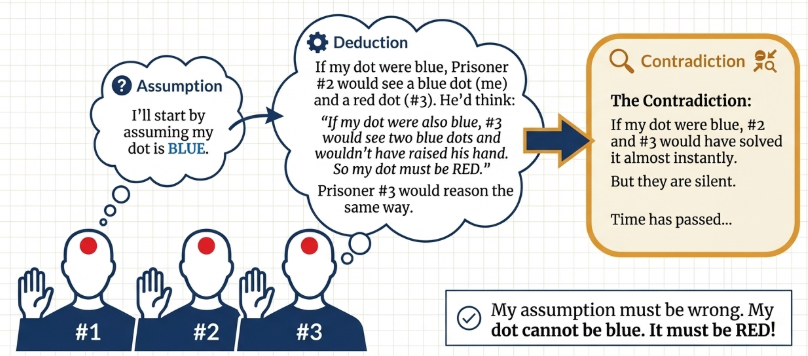

## Counterexamples

> [!NOTE] **Counterexample**
>
> A **counterexample** to a universal statement $\forall x \in S, R(x)$ is an element $x$ in the domain $S$ for which the proposition $R(x)$ is false.

The method of disproof by counterexample, therefore, is the process of finding and presenting such a counterexample.

For example

> Given the statement "If $x \in \mathbb{R}$, then $(x^2 − 1)^2 > 0$".
>
> This statement claims that for any real number $x$, the expression $(x^2 − 1)^2$ is strictly positive.
>
> To disprove this, we need only find a single real number for which this is not true. If we choose $x = 1$, the expression becomes $(1^2 − 1)^2 = 0^2 = 0$. Since $0$ is not greater than $0$, the statement is false.
>
> Therefore, $x = 1$ is a counterexample.

A particularly important application of counterexamples is in disproving statements of the form $\forall x \in S, P(x) \leftarrow Q(x)$. The negation of this statement is

$$
\exists x \in S, (P(x) \land \neg Q(x))
$$

This means that to find a counterexample, one must find an element $x$ in the domain for which the premise $P(x)$ is true and the conclusion $Q(x)$ is false.

For example

> Let $n \in \mathbb{Z}$. If $n^2 + 3n$ is even, then $n$ is odd.
>
> To find a counterexample, we need an integer $n$ such that $n^2 + 3n$ is evenbut $n$ is even.
>
> Let us test $n = 2$. The premise becomes $2^2 + 3(2) = 4 + 6 = 10$, which is even.
>
> The conclusion is that $2$ is odd, which is false. Since we have found an $n$ for which the premise is true and the conclusion is false, $n = 2$ is a counterexample.

Sometimes, a counterexample is not immediately obvious and can be revealed through algebraic manipulation. Consider the following statement:

> Let $a$ and $b$ be nonzero real numbers. If $x, y \in \mathbb{R}^+$, then
>
> $$\frac{a^2}{2b^2x^2} + \frac{b^2}{2a^2y^2} > xy$$
>
> A direct search for a counterexample may prove difficult. However, algebraic manipulation of the statement reveals that it is equivalent to the inequality $(a^2x − b^2y)^2 > 0$. This transformation clarifies the statement's underlying structure. The expression $(a^2x − b^2y)^2$ is a perfect square and thus is always greater than or equal to zero.
>
> A counterexample will exist for any positive $x$ and $y$ that make this expression exactly equal to zero, thereby violating the strict inequality. Setting $a^2x − b^2y = 0$ provides such a condition. One simple choice is $x = b^2$ and $y = a^2$. This choice makes the left side of the transformed inequality equal to $0$, not strictly greater, thus serving as a counterexample.

The existence of a single, verifiable counterexample provides a definitive disproof of a universal statement. Having established this method for demonstrating falsity, we now turn to an indirect method for proving statements that are true: the method of **proof by contradiction**.

## Proof by Contradiction

Proof by contradiction relies on a simple principle: to prove a statement $R$ is true, one begins by assuming that R is false. If this initial assumption, through a series of valid logical steps, leads to a contradiction, then the initial assumption must have been incorrect. The conclusion is that the original statement, $R$, must be true. The method essentially demonstrates the truth of a proposition by showing that its negation is logically untenable.

To prove a statement of the form $\forall x \in S, P(x) \leftarrow Q(x)$ by contradiction, one assumes its negation:

$$
\exists x \in S, \neg (P(x) \leftarrow Q(x))
$$

which is logically equivalent to

$$
\exists x \in S, (P(x) \land \neg Q(x))
$$

In practical terms, the proof begins by assuming the existence of a counterexample, that is, an element $x$ for which the premise $P(x)$ is true but the conclusion $Q(x)$ is false. The goal is then to show that the existence of this supposed counterexample leads to a logical contradiction.

For example:

> Give the statement: **"There is no smallest positive real number."**
>
> **Proof**
>
> We assume, to the contrary, that there is a smallest positive real number. Let us call this number $r$.
>
> By definition, $r > 0$. Consider the number $\frac{r}{2}$. Since $r$ is positive, $\frac{r}{2}$ is also positive. Furthermore, since $r > 0$, it follows that $\frac{r}{2} < r$.
>
> We have found a positive real number, $\frac{r}{2}$, that is smaller than $r$. This directly contradicts our initial assumption that $r$ is the smallest positive real number.
>
> Because our assumption leads to a contradiction, the assumption must be false. Therefore, there is no smallest positive real number.

Let's consider another example.

> Given the statement: **"The real number $\sqrt{2}$ is irrational."**
>
> **Proof**
>
> Assume, to the contrary, that $\sqrt{2}$ is a rational number. This means $\sqrt{2}$ can be written as a fraction $\frac{a}{b}$, where $a$ and $b$ are integers, $b \neq 0$, and the fraction is in its lowest terms (meaning $a$ and $b$ share no common divisor greater than 1).
>
> From $\sqrt{2} = \frac{a}{b}$, we square both sides to get $2 = \frac{a^2}{b^2}$, which implies $a^2 = 2b^2$. This shows that $a^2$ is an even integer. By the theorem that an integer is even if and only if its square is even, $a$ must also be an even integer.
>
> Since $a$ is even, it can be written as $a = 2c$ for some integer $c$. Substituting this into the equation $a^2 = 2b^2$ gives
>
> $$(2c)^2 = 2b^2$$
>
> $$4c^2 = 2b^2$$
>
> $$2c^2 = b^2$$
>
> This shows that $b^2$ is an even integer. Since $b^2$ is even, by the same theorem, the integer $b$ must also be even.
>
> We have concluded that both $a$ and $b$ are even integers. This means they share a common divisor of $2$. This directly contradicts our initial assumption that the fraction $\frac{a}{b}$ was in its lowest terms.
>
> The assumption that $\sqrt{2}$ is rational leads to an inescapable contradiction. Therefore, the assumption is false, and $\sqrt{2}$ must be irrational.

### The Three Prisoners Problem

Reasoning by contradiction is not merely a formal mathematical tool but a powerful logical structure applicable to problem-solving in general.

> Three prisoners are informed that one of them will be released. A warden presents a challenge to determine who it will be. He blindfolds them and paints a dot—either red or blue—on each of their foreheads. He informs them of the rules:
>
> 1. After the blindfolds are removed, any prisoner who sees a red dot on at least one of the other two prisoners must raise their hand.
> 2. The first prisoner to correctly identify the color of their own dot will be released.
>
> As it happens, the warden paints a red dot on all three prisoners. When the blindfolds are removed, all three prisoners see two red dots and, following the rules, all three raise their hands. After a period of silence, one prisoner correctly exclaims, "I know what color my dot is! It’s red!"

Prisoner #1 begins by considering the alternative to what she ultimately concludes. She thinks, _"Assume, to the contrary, that my dot is blue."_

She then explores the logical consequences of this assumption from her perspective. _"If my dot were blue, then Prisoner #2 would reason: 'I see a blue dot on #1 and a red dot on #3. Since #3 raised her hand, she must see a red dot. The only red dot she can see is on my forehead, since #1's is blue. Therefore, my dot must be red.' Similarly, Prisoner #3 would reason in the exact same way. If my dot were blue, both #2 and #3 would be able to deduce the color of their own dots almost instantly."_

Prisoner #1 observes reality. Time passes, and neither Prisoner #2 nor Prisoner #3 announces their dot color. This observation directly contradicts the logical deduction that they should have solved the puzzle if her dot were blue.

The Conclusion: Since the assumption ("my dot is blue") leads to a contradiction with the observed facts, the assumption must be false. Prisoner #1 concludes, _"Therefore, my dot must be red."_

## Existence Proofs

Existence theorems are a foundational component of mathematics. They assert that an object possessing a specific set of properties exists within a given mathematical system. The insight these theorems offer is that they guarantee existence without necessarily providing a method to find or construct the object in question.

> [!NOTE] **Existence Proof**
>
> An existence theorem concerning an open sentence $R(x)$ over a domain $S$ can be expressed formally using a quantified statement:
>
> $$\exists x \in S, R(x)$$
>
> This is read in plain language as:
>
> "There exists ∈ such that ."
>
> A proof that establishes the truth of such a statement is known as an existence proof.

Existence proofs are generally categorized into two primary types, distinguished by their methodology.

- **Constructive Proofs**: This method provides an explicit example of an object that satisfies the required properties. By displaying or constructing the object, the proof offers direct and concrete evidence of its existence.

**Non-Constructive Proofs**: This method verifies that an object must exist without producing a specific example. Such proofs often rely on other established theorems or logical arguments, like proof by contradiction, to demonstrate that the absence of such an object would lead to an impossibility.

Let's focus on an example of a constructive proof.

> [!TIP] **Theorem 5.19**
>
> There exists an integer whose cube equals its square.

> **Proof**
>
> Let $x$ be an integer such that
>
> $$x^3 = x^2 \cdot x^3 − x^2 = 0 x^2(x − 1) = 0$$
>
> The solutions to this equation are $x = 0$ and $x = 1$. Since we have found at least one such integer (in fact, two), the existence is proven.

What about non-constructive existence proofs?

> [!TIP] **Theorem 5.21**
>
> There exist irrational numbers $a$ and $b$ such that $a^b$ is rational.

> **Proof**
>
> To prove this, we do not need to find a definitive pair of numbers. Instead, we can use a logical fork based on the number $\sqrt{2}^{\sqrt{2}}$. This number must be either rational or irrational. We can prove the theorem by examining both possibilities in a proof by cases.
>
> **Case 1**: $\sqrt{2}^{\sqrt{2}}$ is rational. If this is true, then we have found our pair of irrational numbers: $a = \sqrt{2}$ and $b = \sqrt{2}$. Their power, $a^b$, is rational, and the theorem is proven.
>
> **Case 2**: $\sqrt{2}^{\sqrt{2}}$ is irrational. If this is true, we can choose $a = \sqrt{2}^{\sqrt{2}}$ and $b = \sqrt{2}$, which are both irrational. Now, let's compute $a^b$:
>
> $$a^b = (\sqrt{2}^{\sqrt{2}})^{\sqrt{2}} = \sqrt{2}^{\sqrt{2} \cdot \sqrt{2}} = \sqrt{2}^2 = 2$$
>
> The result, $2$, is a rational number. So, in this case, we have also found a pair of irrational numbers whose power is rational.
>
> Since one of these two cases must be true, we have proven that such numbers $a$ and $b$ must exist. However, the proof does not definitively tell us which pair it is.

### Extending Existence to Uniqueness

In mathematics, establishing the existence of a solution or object is often just the first step. The next critical stage is to determine if it is the **only** such solution.

> [!NOTE] **Uniqueness**
>
> An element possessing a certain property $P$ within a set $A$ is said to be unique if it is the only element of $A$ that has property $P$.

There are two primary strategies for establishing uniqueness:

- **Direct Proof Method**: Assume that $a$ and $b$ are two elements that both possess the property P. Then, through logical and algebraic manipulation, demonstrate that it must be the case that $a = b$.
- **Proof by Contradiction Method**: Assume that $a$ and $b$ are two distinct ($a \neq b$) elements that both possess property $P$. Then, show that this assumption leads to a logical contradiction, thereby proving that distinct elements with the property cannot exist.

Let's examine how these strategies are applied.

> [!TIP] **Theorem 5.23**
>
> he equation $x^5 + 2x − 5 = 0$ has a unique real number solution between $x = 1$ and $x = 2$.

> **Proof**
>
> We have already established existence; now we prove uniqueness. This proof utilizes the Proof by Contradiction method.
>
> Assume, to the contrary, that the equation has two distinct solutions, $a$ and $b$, in the interval $(1, 2)$. Let us assume $a < b$. Since $1 < a < b < 2$, it follows that
>
> $$a^5 < b^5 \text{ and } 2a < 2b$$
>
> $$a^5 + 2a - 5 < b^5 + 2b - 5$$
>
> However, since both $a$ and $b$ are solutions to the equation, we know that $a^5 + 2a − 5 = 0$ and $b^5 + 2b − 5 = 0$.
>
> Substituting these values into the inequality yields:
>
> $$0 = a^5 + 2a − 5 < b^5 + 2b − 5 = 0$$
>
> This statement, $0 < 0$, is a contradiction. Therefore, our assumption that two distinct solutions exist must be false. The solution is unique.

## Disproving Existence Statements

Disproving an existence claim is a different task than providing a counterexample to a universal claim. The logical foundation for disproving an existence statement lies in the equivalence between the negation of an existential quantifier and a universal quantifier. Formally:

$$
\neq (\exists x \in S, R(x)) \equiv \forall x \in S, \neg R(x)
$$

In words, the statement "There does not exist an $x$ in set $S$ with property $R(x)$" is logically equivalent to the statement "For all $x$ in set $S$, $x$ does not have property $R(x)$." This equivalence transforms the task of disproving existence into the task of proving a universal statement.

The following example demonstrates how to prove that no element in a given domain has the specified property.

> [!TIP] **Example 5.26**
>
> There exists an odd integer $n$ such that $n^2 + 2n + 3$ is odd.

> **Proof**
>
> We will prove the negation: **For every odd integer $n$, the expression $n^2 + 2n + 3$ is even**
>
> Let $n$ be an arbitrary odd integer. By definition, $n = 2k + 1$ for some integer $k$. Substituting this into the expression:
>
> $$n^2 + 2n + 3 = (2k + 1)^2 + 2(2k + 1) + 3$$
>
> $$= (4k^2 + 4k + 1) + (4k + 2) + 3$$
>
> $$= 4k^2 + 8k + 6 = 2(2k^2 + 4k + 3)$$
>
> Since $2k^2 + 4k + 3$ is an integer, the entire expression is a multiple of $2$ and is therefore even. Because this holds for any odd integer $n$, no odd $n$ exists for which the expression is odd.
