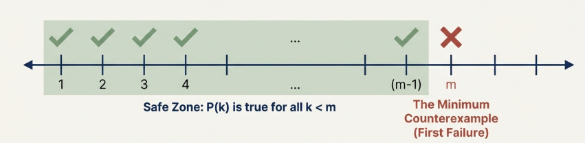
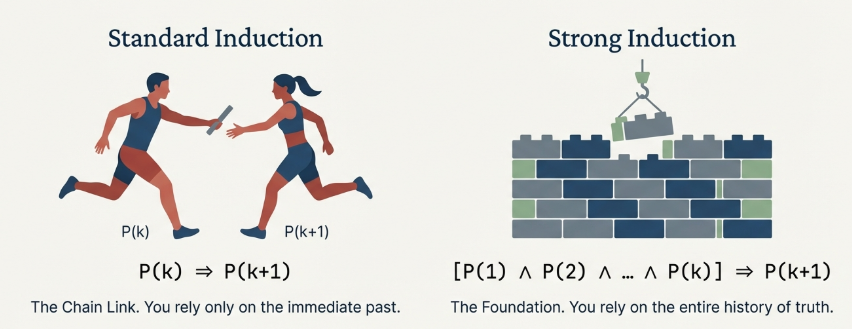
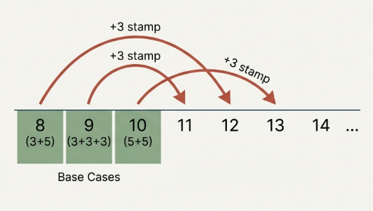

## The Principle of Mathematical Induction

In the study of discrete mathematics and formal logic, we frequently encounter propositions that assert a property for an infinite sequence of cases—most commonly for every natural number $n \in \mathbb{N}$. While proof techniques such as direct derivation, contraposition, or contradiction are indispensable, they are often insufficient for statements that possess a recursive or "step-by-step" structure.

The validity of any mathematical proof technique rests upon the underlying properties of the set under investigation. In the realm of natural numbers, we must establish a "ground floor" of logic.

> [!NOTE] **Least Element**
>
> A number $m \in A$ is defined as a **least element** (or minimum) if $x \geq m$ for every $x \in A$.

> [!NOTE] **Well-Ordered Sets**
>
> A set is considered **well-ordered** if every nonempty subset of that set contains a least element.

> [!TIP] **Uniqueness of Least Element**
>
> If a set possesses a least element, that element must be unique.

> **Proof**
>
> Assume $m_1$ and $m_2$ are both least elements of a set $A$. Because $m_1$ is a least element, it must be less than or equal to any element in $A$; thus, $m_2 \geq m_1$. Conversely, because $m_2$ is a least element, $m_1 \geq m_2$. From the antisymmetric property of the $\geq$ relation, it follows that $m_1 = m_2$.

The Well-Ordering Principle is the logical "safety net" for the integers. It ensures that if a property fails for any natural numbers, there must exist a first (minimum) number where it fails.

The Principle of Mathematical Induction (PMI) provides a dynamic strategy for moving from the finite to the infinite. It allows us to transition from verifying individual cases to proving quantified statements over the entire set $\mathbb{N}$.

> [!NOTE] **The Principle of Mathematical Induction**
>
> For each positive integer $n$, let $P(n)$ be a statement. The Principle of Mathematical Induction states:
>
> $$P(1) \land (\forall k \in \mathbb{N}, P(k) \rightarrow P(k + 1)) \rightarrow \forall n \in \mathbb{N}, P(n)$$

> **Synthesis of the Proof**
>
> The proof utilizes the Well-Ordering Principle through a contradiction.
>
> We assume there exists a nonempty set $S$ of integers for which $P(n)$ is false. By the Well-Ordering Principle, $S$ must contain a least element $s$, representing the "minimum counterexample."
>
> Since $P(1)$ is true, $s$ must be greater than $1$, meaning $s−1$ is a natural number. Because s is the least element of the set of counterexamples, $s−1$ cannot be in $S$.
>
> Therefore, $P(s−1)$ must be true. However, our inductive condition ($P(k) \rightarrow P(k+1)$) dictates that if $P(s−1)$ is true, then $P(s)$ must also be true. This contradicts the definition of s as a counterexample, thus proving $S$ must be empty.

Components of an Induction Proof

1. **Base Step (or Anchor)**: Verification that the statement $P(1)$ holds.
2. **Inductive Hypothesis**: The assumption that $P(k)$ is true for an arbitrary positive integer $k$.
3. **Inductive Step**: The logical deduction showing that if $P(k)$ is true, then $P(k+1)$ is necessarily true.

## A More General Principle of Mathematical Induction

Mathematical truths do not always commence at $n=1$. the **Generalized Principle of Mathematical Induction**, allows the domain to begin at any fixed integer $m$.

> [!NOTE] **Generalized Principle of Mathematical Induction**
>
> For each positive integers $n, m$, let $P(n)$ be a statement. The **Generalized Principle of Mathematical Induction** states:
>
> $$P(m) \land (\forall k \in \mathbb{N}, k \geq m, P(k) \rightarrow P(k + 1)) \rightarrow \forall n \in \mathbb{N}, P(n)$$

## Proof by Minimum Counterexample

As an alternative to standard induction, we employ Proof by Minimum Counterexample. This is a proof by contradiction that utilizes the Well-Ordering Principle directly. We assume a statement is false, let m be the smallest integer for which it fails, and then demonstrate that if $P(m−1)$ is true, $P(m)$ must also be true, thereby contradicting the existence of a "first" failure.

Ultimately, the Principle of Mathematical Induction and the Proof by Minimum Counterexample are two sides of the same logical coin. One uses the Well-Ordering Principle indirectly to build a tower of truth, while the other uses it directly to collapse a house of lies.

> Consider the proposition that $6|(n^3 - n)$ for every positive integer $n$.
>
> By testing $n=1$ and $n=2$, we confirm the property holds, implying the minimum counterexample m must satisfy $m \geq 3$. We leverage this boundary by writing $m=k+2$, where $1\leq k <m$.
>
> Substituting into the expression:
>
> $$m^3 - m = (k + 2)^3 - (k + 1) = (k^3 - k) + (6k^2 + 12k + 6)$$
>
> Since $k<m$, $P(k)$ is true, meaning $k^3 - k = 6x$ for some $x \in \mathbb{Z}$.
>
> $$m^3 - m = 6x + 6(k^2 + 2k + 1) = 6(x + k^2 + 2k + 1)$$
>
> As $x + k^2 + 2k + 1$ is an integer, $6|(m^3 - m)$, contradicting the assumption that $m$ is a counterexample.

## The Strong Principle of Mathematical Induction

The distinction between the Principle (PMI) and the Strong Principle (SPMI) lies in the latitude of the inductive hypothesis:

1. **Assumption**: $\forall i \in \mathbb{Z}, 1 \leq i \leq k, P(i) \text{ is true}$
2. **Requirement**: Show $[P(1) \land P(2) \land \cdots \land P(k)] \rightarrow P(k + 1)$

> [!NOTE] **Generalized Strong Induction**
>
> The Strong Principle is generalized for any fixed integer $m$: Let $S = \\{i \in \mathbb{Z} : i \geq m\\}$. For each $n \in S$, let $P(n)$ be a statement. If:
>
> 1. $P(m)$ is true.
> 2. The implication "If $P(i)$ is true for every integer $i$ with $m \leq i \leq k$, then $P(k+1)$ is true" holds for every $k \in S$. Then $P(n)$ is true for all $n \in S$.

The SPMI is a consequence of the Well-Ordering Principle, just as standard induction is. It is a "superior" tool in practice because it provides broader "permission" in the inductive step. One assumes a greater wealth of information ($P(1) \dots P(k)$) to reach the same conclusion

> Show that every integer $n \geq 8$ can be expressed as $n=3a+5b$ for nonnegative integers $a$ and $b$.
>
> We must verify $P(8)$, $P(9)$, and $P(10)$ manually. This is necessary because the inductive step for $k+1$ will look back three units to the case $(k+1)−3$.
>
> If we only verified $P(8)$, the step for $n=9$ would require the truth of $P(6)$, which is outside our valid set ($n \geq 8$).
>
> By verifying three consecutive cases, we ensure that for any $k+1 \geq 11$, the term $(k+1)−3$ is $\geq 8$ and its truth is guaranteed by the hypothesis. Since $(k+1)−3=3a+5b$, it follows that $k+1=3(a+1)+5b$, completing the proof.

