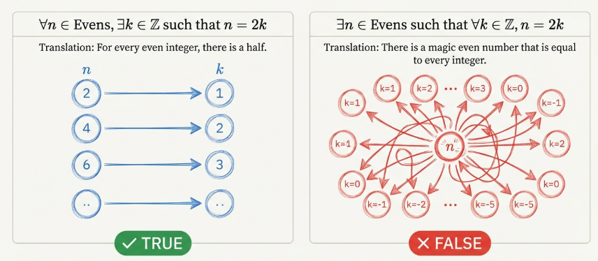
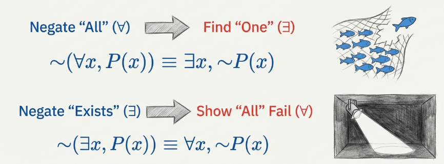
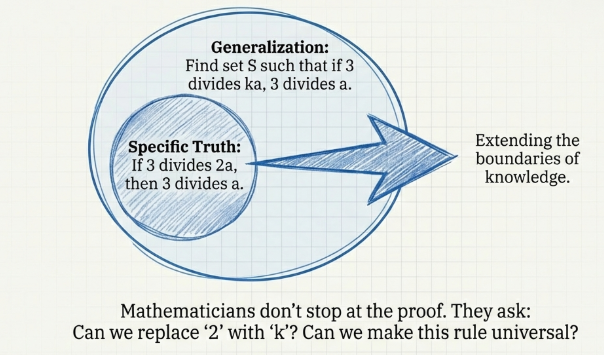

## Conjectures in Mathematics

The advancement of mathematical knowledge is not a linear progression of discovery but a cyclical process of rigorous investigation termed "prove or disprove." This strategic methodology is fundamental to the discipline; it is the mechanism by which we transition from the fog of uncertainty to the bedrock of established truth. When a mathematician encounters a statement of unknown truth value, they face a dual challenge: first, to determine the veracity of the claim through intuition and experimentation, and second, to provide an absolute verification of that belief.

> [!NOTE] **Conjecture**
>
> A **conjecture** is a statement believed to be true based on compelling patterns or evidence, yet lacking a formal proof.

It is essential to distinguish this from a theorem. A statement remains a conjecture only so long as its truth remains unsettled. Once a proof is provided, it is elevated to a theorem; if a counterexample is found, the conjecture is discarded or refined.

In the study of symmetry, we define a palindrome as a structure that remains invariant when reversed.

- Linguistic Palindromes: Words or sentences that read the same forward and backward, such as radar or noon.
- Numerical Palindromes: An integer $n \in \mathbb{Z}^+$ is a palindrome if it remains identical when its digits are reversed (e.g., $1221$ or $47374$).

A classic conjecture involves the "Reverse-and-Add" process. If an integer is not a palindrome, one reverses its digits and adds the result to the original number, repeating until a palindrome appears. Consider the integer $59$:

1. $59+95=154$ (Non-palindrome)
2. $154+451=605$ (Non-palindrome)
3. $605+506=1111$ (Palindrome)

It has been conjectured that for every $n \in \mathbb{Z}^+$, this algorithm eventually terminates in a palindrome. While this has been verified for all two-digit numbers, it remains an unproven conjecture for the general set of positive integers.

### The Evolution of Great Conjectures: From Guthrie to Goldbach

The following table summarizes the trajectory of several landmark claims.

| Conjecture Name       | Origin / Key Figures                                                       | Duration until Resolution | Current Status       |
| --------------------- | -------------------------------------------------------------------------- | ------------------------- | -------------------- |
| Four Color Conjecture | [Francis Guthrie](https://wikipedia.org/wiki/Francis_Guthrie) (1852)       | 124 Years                 | Theorem (1976)       |
| Fermat’s Last Theorem | [Pierre Fermat](https://wikipedia.org/wiki/Pierre_de_Fermat) (17th Cent.)  | ~350 Years                | Theorem (1993)       |
| Fermat’s Conjecture   | [Pierre Fermat](https://wikipedia.org/wiki/Pierre_de_Fermat) (1640)        | ~100 Years                | Disproved (False)    |
| Goldbach’s Conjecture | [Christian Goldbach](https://wikipedia.org/wiki/Christian_Goldbach) (1742) | 280+ Years                | Conjecture (Ongoing) |

Not all conjectures survive the scrutiny of time. Fermat proposed that every "Fermat number" $F_t = 2^{2^t} + 1$ is prime for $t \geq$. This was overturned by [Leonhard Euler](https://wikipedia.org/wiki/Leonhard_Euler) in $1739$. Euler utilized his own theorem regarding the factors of Fermat numbers:

> If $p$ is a prime factor of $F_t$, then $p = 2^{t + 1}k + 1$ for some $k \in \mathbb{Z}^+$.

For $F_5$, Euler tested prime factors of the form $2^{5 + 1}k + 1 = 64k + 1$. By testing the candidate primes $193,257,449,577$, and $641$, he discovered that $641$ divides $F_5$. Thus, $F_5=4,294,967,297$ is composite, disproving the conjecture.

## Revisiting Quantified Statements

Strategic precision in mathematics is achieved through the use of quantifiers, which turn an open sentence $P(x)$ into a statement with a definite truth value.

### Importance of Quantifier Order and Domain

The order of quantifiers is non-commutative and fundamentally alters the statement's meaning.

- $\forall x \in \mathbb{R},\exists n \in \mathbb{Z},∣x−n∣<1$: This is true. For any real number, we can always find a "close" integer.

Let $n=\lceil x \rceil$. By definition,

$$
\lceil x \rceil −1 < x \leq \lceil x \rceil
$$

It follows that $\lceil x \rceil − x < 1$, and since $\lceil x \rceil −x \geq 0$, then $∣x−\lceil x \rceil∣ < 1$.

- $\exists n \in \mathbb{Z},\forall x \in \mathbb{R},∣x−n∣ < 1$: This is false; it suggests one single integer is within a distance of 1 from all real numbers simultaneously.

### Rules of Negation

To negate a quantified statement, we swap the quantifier and negate the open sentence:

- $\neg (\forall x \in S,P(x)) \equiv \exists x \in S, \neg P(x)$
- $\neg (\exists x \in S,P(x)) \equiv \forall x \in S, \neg P(x)$

## Testing Statements

### Disproving Universal Claims

To disprove a statement of the form $\forall x \in S,P(x)$, one must only identify a single counterexample.

> To disprove "If $A \times C=B \times C$, then $A=B$," we let $C = \emptyset$. Since $A \times \emptyset= \emptyset$ and $B \times \emptyset= \emptyset$, the hypothesis is true for any sets $A$ and $B$, even if $A \neq B$.

### Generalization

The creative apex of mathematics lies in Generalization and Extension—the process of looking at a proven result and expanding its scope.

> Consider the result: "Let $a \in \mathbb{Z}$. If $3∣2a$, then $3∣a$." We can extend this by asking for which positive integers $k$ the implication "If $3∣ka$, then $3∣a$" holds.
>
> - For $k=1,2,4$, the statement is true.
> - For $k=3$, the statement is false (e.g., $3∣3(1)$ but $3 \not | 1$).

The ultimate goal of generalization is to find a set $S$ such that the statement is true if and only if $k \in S$. Finding this necessary and sufficient condition represents the transformation of a specific observation into a universal law.

