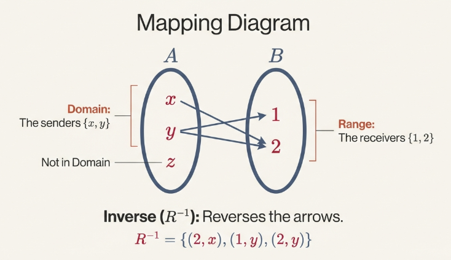
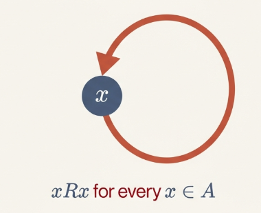
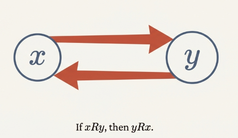
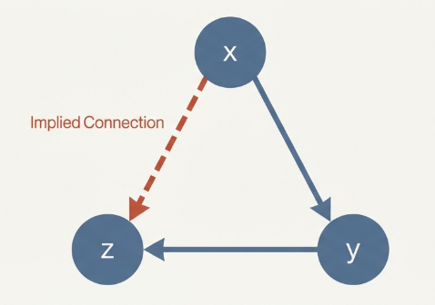
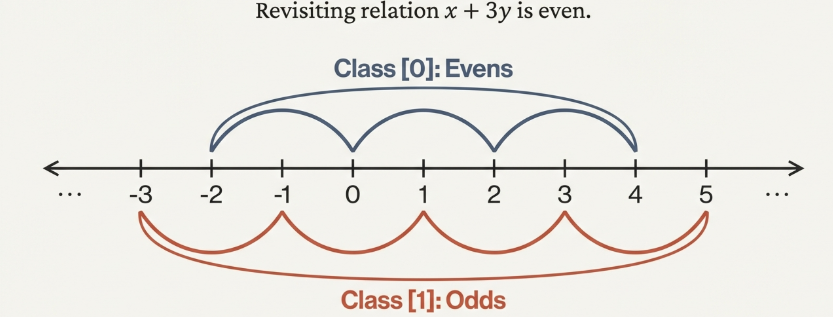

## Relations

In the pursuit of mathematical rigor, relations serve as a strategic framework for comparing and associating elements across disparate domains.

> [!NOTE] **Relation**
>
> A relation $R$ from set $A$ to set $B$ is defined as a subset of the Cartesian product $A \times B$.

It is essentially a collection of ordered pairs where the first element originates in $A$ and the second in $B$. We employ a specific notation to describe these associations:

- $a \text{ } R \text{ } b$ indicates that $(a, b) \in R$, that is $a$ is related to $b$.
- $a \text{ } \not R \text{ } b$ indicates that $(a, b) \not \in R$, that is $a$ is not related to $b$.

This abstract set-theoretic definition manifests in concrete mathematical objects. In geometry, we might relate a line $\mathcal{l}$ to a plane $\beta$ based on whether the line lies on the plane, is parallel to it, or intersects it at exactly one point. In arithmetic, we can relate integers $a$ and $b$ by divisibility ($a∣b$) or parity.

To analyze the internal structure of any given relation, we define three fundamental components:

- **Domain**
- **Range**
- **Inverse Relation**

> [!NOTE] **Domain**
>
> Given a relation $R$ defined over the sets $A$ and $B$, the **domain** of $R$ is defined as
>
> $$dom(R) = \{a \in A: (a, b) \in R \text{, for some } b \in B\}$$

> [!NOTE] **Range**
>
> Given a relation $R$ defined over the sets $A$ and $B$, the **range** of $R$ is defined as
>
> $$range(R) = \{b \in B: (a, b) \in R \text{, for some } a \in A\}$$

> [!NOTE] **Inverse Relation**
>
> Given a relation $R$ defined over the sets $A$ and $B$, the **inverse relation** of $R$, $R^{-1}$ is defined as
>
> $$\{(b, a): (a, b) \in R\}$$



## Properties of Relations

While relations can bridge two different sets, the most profound mathematical insights often emerge from the specialized study of relations defined on a single set, where $A=B$.

> [!TIP] **Properties of Relations**
>
> The three primary properties of relations are defined as follows:
>
> - **Reflexivity**: A relation $R$ is reflexive if for every $x \in A, xRx$.
> - **Symmetry**: A relation $R$ is symmetric if whenever $xRy$, then $yRx$ for all $x, y \in A$.
> - **Transitivity**: A relation $R$ is transitive if whenever $xRy$ and $yRz$, then $xRz$ for all $x,y,z \in A$.







> **Example: The Distance Relation**
>
> The "Distance Relation" on real numbers, defined by $aRb$ if $∣a−b∣ \leq 1$, demonstrates a relation that possesses **reflexivity** (as $∣a−a∣=0 \leq 1$) and **symmetry** (as $∣a−b∣=∣b−a∣$).
>
> However, **it fails the transitivity test** due to the nature of cumulative distance. Consider the values $3$, $2$, and $1$:
>
> 1. $3R2$ because $∣3−2∣=1\leq 1$.
> 2. $2R1$ because $∣2−1∣=1 \leq 1$.
>
> $3 \not R 1$ because $∣3−1∣=2$, which is not $\leq 1$. The cumulative distance across the chain of relations exceeds the defined threshold.

## Equivalence Relations

The equivalence relation acts as the mathematical generalization of equality. While strict equality (a=b) is the most fundamental form, equivalence relations allow us to group distinct elements together based on shared characteristics.

> [!NOTE] **Equivalence Relation**
>
> An **Equivalence Relation** is any relation that is simultaneously **reflexive**, **symmetric**, and **transitive**.

The importance of equivalence relations lies in their ability to partition a set into disjoint, meaningful subsets known as equivalence classes. This process simplifies complex sets by grouping "relatives" together.

> [!NOTE] **Equivalence Class**
>
> For an equivalence relation $R$ on set $A$, the **Equivalence Class** of an element $a$, denoted by $[a]$, is defined as:
>
> $$[a] = \{x \in A: x R a\}$$
>
> This set contains all elements $x$ in $A$ that are related to $a$. Because the relation is reflexive, a is always a member of its own class ($a \in [a]$).

A formal theorem is required to determine when two different elements represent the same equivalence class, preventing the redundant treatment of identical subsets.



## Properties of Equivalence Classes

> [!TIP] **The Equality of Classes**
>
> Let $R$ be an equivalence relation on a nonempty set $A$. For any $a,b \in A$:
>
> $$[a] = [b] \Leftrightarrow a R b$$

> **Proof**
>
> We must prove this biconditional statement in both directions.
>
> **I. The "if" direction ($\Leftarrow$)**
>
> Assume $aRb$. We must show $[a]=[b]$ by showing mutual inclusion.
>
> 1. Showing $[a]\subseteq [b]$: Let $x \in [a]$. Then $xRa$. Since we assume $aRb$, by transitivity, $xRb$. Thus $x \in [b]$.
> 2. Showing $[b] \subseteq [a]$: Let $y \in [b]$, so $yRb$. Since $aRb$ and $R$ is symmetric, $bRa$. By transitivity, $yRb$ and $bRa$ imply $yRa$. Thus $y \in [a]$.
>
> Since both inclusions hold, $[a]=[b]$.
>
> **II. The "only if" direction ($\Rightarrow$)**
>
> Assume $[a]=[b]$.
>
> By the reflexive property, we know $a \in [a]$. Since $[a]=[b]$, it must be that $a \in [b]$. By the definition of an equivalence class, $a\in[b]$ implies $aRb$.

The relationship between equivalence relations and partitions is bi-directional. A partition $P$ of a set $A$ is a collection of nonempty, pairwise disjoint subsets of $A$ whose union is $A$.

> [!NOTE] **Theorem 8.3**
>
> The set of distinct equivalence classes $P= \\{ [a]:a \in A \\}$ resulting from an equivalence relation $R$ constitutes a partition of $A$.

> **Proof**
> Because $a \in [a]$ for all $a$, the union of all classes is clearly $A$.
>
> To ensure each element belongs to a _unique_ class, we employ a direct proof: if an element $x$ belongs to both $[a]$ and $[b]$, then $xRa$ and $xRb$.
>
> Symmetry and transitivity then force $aRb$, thus $[a]=[b]$.
>
> Therefore, any two overlapping classes must be identical.

> [!NOTE] **Theorem 8.4**
>
> Any partition $P = \\{A_{\alpha}: \alpha \in I\\}$, where $I$ is an index set, induces an equivalence relation $R$.

## Congruence Modulo $n$

> [!NOTE] **Congruence Modulo $n$**
>
> We define two integers $a$ and $b$ to be congruent modulo $n$ if n divides their difference:
>
> $$a \equiv b (\text{mod } n) \Leftrightarrow n | (a - b)$$

> [!TIP] **Theorem 8.6**
>
> The **Congrunece Modulo $n$** is an equivalence relation on $\mathbb{Z}$.

> **Proof**
>
> **Reflexivity**: For any $a \in \mathbb{Z}$, $a−a=0$. Since $n∣0$, it follows that $a \equiv a(modn)$.
>
> **Symmetry**: If $a \equiv b(\text{mod } n)$, then $a−b=nk$ for some $k \in \mathbb{Z}$. It follows that $b−a=−(a−b)=n(−k)$. Since $−k \in \mathbb{Z}$, $n∣(b−a)$, so $b \equiv a(\text{mod} n)$.
>
> **Transitivity**: If $a \equiv b(\text{mod }n)$ and $b \equiv c(\text{mod } n)$, then $a−b=nk$ and $b−c=nl$ for $k,l \in \mathbb{Z}$. Adding these yields $(a−b)+(b−c)=n(k+l)$. Thus $a−c=n(k+l)$, implying $a \equiv c(\text{mod }n)$.

## The Integers Modulo $n$

> [!TIP] **Residue Classes**
>
> The set of all residue classes modulo $n$, denoted $\mathbb{Z}_n = \\{[0],[1], \dots,[n−1]\\}$, forms a quotient set.

The [Division Algorithm](/math/iam/05_integers/#the-division-algorithms-and-greatest-common-divisors) is fundamental here; it guarantees that for any integer $a$, there exist unique $q,r \in \mathbb{Z}$ such that $a=nq+r$ and $0 \leq r < n$.

This uniqueness ensures that each integer belongs to exactly one residue class $[r]$.

To treat $\mathbb{Z}_n$ as an algebraic system, we define addition and multiplication as:

$$
[a] + [c] = [a + c]
$$

$$
[a] \cdot [c] = [a \cdot c]
$$

For these operations to be valid, they must be **well-defined**, meaning the result must be independent of the class representative.

The operations in $\mathbb{Z}_n$ satisfy the commutative, associative, and distributive properties. The "cycling" nature of this modular system is visible in the tables for $\mathbb{Z}_6$:

**Addition in $\mathbb{Z}_6$**

```
+   [0] [1] [2] [3] [4] [5]
[0]  0   1   2   3   4   5
[1]  1   2   3   4   5   0
[2]  2   3   4   5   0   1
[3]  3   4   5   0   1   2
[4]  4   5   0   1   2   3
[5]  5   0   1   2   3   4
```

**Multiplication in $\mathbb{Z}_6$**

```
*   [0] [1] [2] [3] [4] [5]
[0]  0   0   0   0   0   0
[1]  0   1   2   3   4   5
[2]  0   2   4   0   2   4
[3]  0   3   0   3   0   3
[4]  0   4   2   0   4   2
[5]  0   5   4   3   2   1
```
