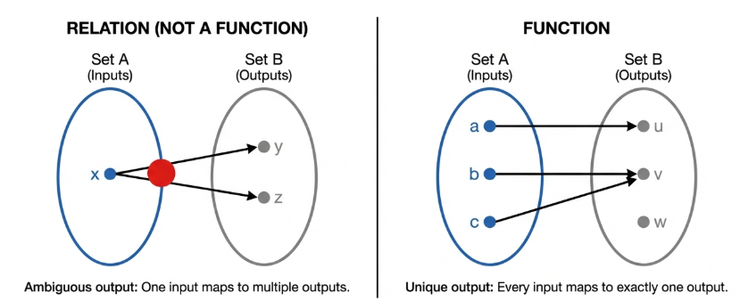
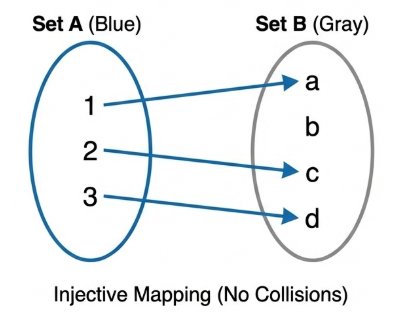
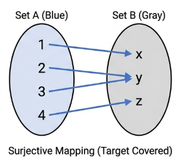
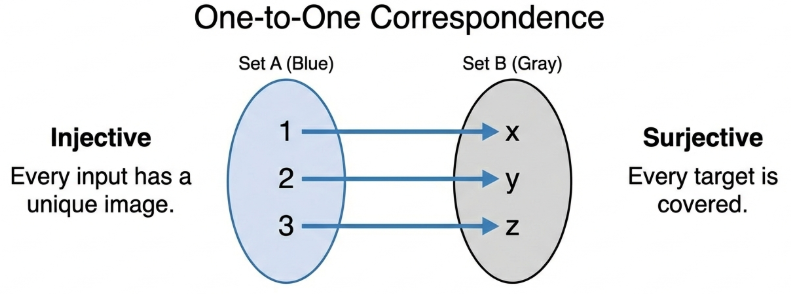

## The Definition of a Function

In the rigorous landscape of set theory, the transition from a general relation to a function represents a critical imposition of order. A relation $R$ from a set $A$ to a set $B$ is a subset of the Cartesian product $A \times B$, which admits a wide spectrum of associations. Within this framework, an element $x \in A$ may be related to no elements of $B$ (where R is the empty set $\emptyset$), to at least one element, or to all elements of $B$. However, when we refine this structure such that every element of $A$ is related to exactly one element of $B$, we arrive at the "most studied relation of all": the **function**.

> [!NOTE] **Function**
>
> Let $A$ and $B$ be nonempty sets. A **function** $f$ from $A$ to $B$, denoted $f: A \to B$, is a relation from $A$ to $B$ with the property that every element $a \in A$ is the first coordinate of exactly one ordered pair in $f$.

The "exactly one" coordinate property is the fundamental differentiator of functional mappings. If $(a, b) \in f$ and $(a, c) \in f$, then $b = c$.

A function is defined by the triple $(A, B, f)$, consisting of a **domain**, a **codomain**, and a set of ordered pairs.

- **Domain** ($dom(f)$): The set $A$, representing the source of all first coordinates.
- **Codomain**: The set $B$, representing the target set of possible outcomes.
- **Range** ($range(f)$): The subset of the codomain consisting of all actual images.

$$
\text{range}(f) = \{b \in B : b \text{ is an image under } f \text{ of some element of } A\} = \{f(x) : x \in A\}.
$$

The domain is of great importance on functional integrity. For example, the expression $h(x) = \frac{1}{x-1}$ fails as a function on $\mathbb{R}$ because it is undefined at $x=1$. To maintain validity, it must be defined as $h: \mathbb{R} \setminus \\{1\\} \to \mathbb{R}$.

To classify a relation $f$ from a set $A$ to a set $B$ as a formal function, two necessary conditions must be satisfied:

1. **Domain Coverage**: For every element $a \in A$, there must exist an element $b \in B$ such that $(a, b) \in f$. This ensures the function is defined for its entire domain.
2. **Image Uniqueness**: If $(a, b) \in f$ and $(a, c) \in f$, then $b = c$. This ensures that each element in the domain is mapped to exactly one unique element in the codomain.

> [!NOTE] **Logical Equivalence**
>
> Two functions $f: A \to B$ and $g: A \to B$ are considered equal ($f = g$) if and only if $f(a) = g(a)$ for every $a \in A$.

This definition implies that the sets of ordered pairs constituting the functions are identical.

Visually, functions can be represented using arrow diagrams, where a directed line segment is drawn from each $x \in A$ to its image $f(x) \in B$. The functional constraint requires that exactly one directed line segment leaves each element of the domain.

In higher-level mathematics, this set-theoretic rigor—viewing a function as a set of ordered pairs $\\{(x, f(x)) : x \in A\\}$ is superior to the common calculus shorthand (e.g., $f(x) = x^2$). While the shorthand refers to the rule or the image, it often neglects the domain and codomain, which are vital for the formal proofs and categorical analyses of advanced mathematics.

### Historical Evolution of the Functional Concept

The current rigor of functional theory is the result of centuries of refinement, moving from intuitive variable associations to abstract mappings.

- **Johann Bernoulli** (Early 18th Century): Functions were "variable magnitudes," quantities composed of variables and constants.
- **Leonhard Euler** (Late 18th Century): Defined functions as "analytic expressions," shifting the focus away from geometric diagrams toward symbolic formulas.
- **Peter Dirichlet** (Early 19th Century): Introduced the "unique correspondence" view, divorcing the concept from formulas. To illustrate this, he proposed the non-formulaic function:

$$
f(x) = \begin{cases} 1 & \text{if } x \in \mathbb{Q} \\ 0 & \text{if } x \in \mathbb{R} \setminus \mathbb{Q} \end{cases}
$$

- **Richard Dedekind** (Late 19th Century): Provided the precursor to the modern view, defining a function on a set $S$ as a "law" where every element $s$ has a "determinate thing" called a transform, denoted by $\phi(s)$.

## The Set of all Functions from $A$ to $B$

The space of all possible mappings between two sets $A$ and $B$ is denoted by $B^A$. For example, if $B = \\{0, 1\\}$, the set of all functions $2^A$ corresponds to the [Power Set](/math/iam/02_sets/#power-set), where each function serves as an indicator for a subset.

For finite sets, the cardinality of this functional space is given by:

$$
|B^A| = |B|^{|A|}
$$

This exponential growth is a consequence of the combinatorial independence of the mapping: for every element in $A$, there are $|B|$ independent choices of images in $B$.

To illustrate, let $A = \\{a, b\\}$ and $B = \\{x, y, z\\}$. There are $3^2 = 9$ possible functions, as each of the two elements in $A$ can be mapped to any of the three targets in $B$.

## One to One and Onto Functions

Functions are classified based on how they preserve distinctness and how they cover the codomain.

> [!NOTE] **Injective Function**
>
> A function $f: A \to B$ is **injective** or **one-to-one** if distinct elements in $A$ have distinct images in $B$.

The contrapositive formulation is most useful for proofs: $f$ is injective if $f(x) = f(y) \implies x = y$.

> [!NOTE] **Onto Function**
>
> A function $f: A \to B$ is **surjective** or **onto** if its range equals its codomain ($f(A) = B$).

To prove $f$ is onto, one must take an arbitrary element $r \in B$ and construct an $x \in A$ such that $f(x) = r$.

## Bijective Functions

> [!NOTE] **Bijective Function**
>
> A **bijective function**, or one-to-one correspondence, is a function that is both injective and surjective.

For finite sets, a bijection can exist if and only if $|A| = |B|$.

> [!TIP] **Theorem 9.7**
>
> For finite sets $A$ and $B$, if $|A| = |B| = n$, there are exactly $n!$ possible bijective configurations.

This factorial result emerges from the decreasing choices of available images as each domain element is paired, maintaining the one-to-one constraint.

> [!TIP] **Theorem 9.8**
>
> If $|A| = |B|$, then a function $f: A \to B$ is one-to-one if and only if it is onto.

**This equivalence only holds for finite sets**. In the infinite realm, this property collapses. For example,

$$
f: \mathbb{Z} \to \mathbb{Z}
$$

Defined by

$$
f(n) = 2n
$$

Is injective but not surjective (missing odd integers), while

$$
g: \mathbb{N} \to \mathbb{N}
$$

Defined by

$$
g(n) = n - 1 \text{ for } n \ge 2 \text{ and } g(1) = 1
$$

is surjective but not injective (as $g(1) = g(2) = 1$).

These counter-examples serve as a precursor to the study of transfinite cardinalities, where the intuition of finite sets no longer holds.

## Composition of Functions

> [!NOTE] **Composition of Functions**
>
> For nonempty sets $A, B$, and $C$, the **composition** $g \circ f$ of $f: A \to B$ and $g: B \to C$ is defined as
>
> $$(g \circ f)(a) = g(f(a))$$
>
> For the operation to be well-defined, the $\text{range}(f)$ must be a subset of the domain of $g$.

> [!TIP] **Theorem 9.11**
>
> Given functions $f: X \to Y$ and $g: Y \to Z$, if $f$ and $g$ are both injective, $g \circ f$ is injective.

> **Proof**
>
> Assume $(g \circ f)(a_1) = (g \circ f)(a_2)$.
>
> By definition, $g(f(a_1)) = g(f(a_2))$. Since $g$ is injective, $f(a_1) = f(a_2)$.
>
> Since $f$ is injective, $a_1 = a_2$.
>
> Thus the composition $g \circ f$ is injective.

> [!TIP] **Theorem 9.13**
>
> The composition of two functions **satisfies the associative property**.

> **Proof**
>
> Let $a \in A$ and suppose $f(a) = b, g(b) = c$, and $h(c) = d$. Then
>
> $$((h \circ g) \circ f)(a) = (h \circ g)(f(a)) = (h \circ g)(b) = h(g(b)) = h(c) = d$$
>
> And, also
>
> $$(h \circ (g \circ f))(a) = h((g \circ f)(a)) = h(g(f(a))) = h(g(b)) = h(c) = d$$
>
> Since the outputs are identical for all $a \in A$, the functions are equal:
>
> $$(h \circ g) \circ f = h \circ (g \circ f)$$

Despite this associativity, **composition is fundamentally non-commutative**.

## Inverse Functions

> [!NOTE] **Existence of the Inverse Function**
>
> An inverse relation $f^{-1}$ is a function if and only if $f: A \to B$ is **bijective**.

When this condition is met, $f^{-1} \circ f = i_A$ and $f \circ f^{-1} = i_B$, where $i$ represents the identity function.

## Permutations

> [!NOTE] **Permutation**
>
> A permutation is a bijective function $f: A \to A$.

For the finite set $A = \\{1, 2, 3\\}$, we utilize two-row matrix notation to represent the six possible permutations of S_3:

| Permutation                 | Mapping Notation                                         |
| --------------------------- | -------------------------------------------------------- |
| $\alpha_1$ (Identity $i_A$) | $$\begin{pmatrix} 1 & 2 & 3 \\ 1 & 2 & 3 \end{pmatrix}$$ |
| $\alpha_2$                  | $$\begin{pmatrix} 1 & 2 & 3 \\ 1 & 3 & 2 \end{pmatrix}$$ |
| $\alpha_3$                  | $$\begin{pmatrix} 1 & 2 & 3 \\ 3 & 2 & 1 \end{pmatrix}$$ |
| $\alpha_4$                  | $$\begin{pmatrix} 1 & 2 & 3 \\ 2 & 1 & 3 \end{pmatrix}$$ |
| $\alpha_5$                  | $$\begin{pmatrix} 1 & 2 & 3 \\ 2 & 3 & 1 \end{pmatrix}$$ |
| $\alpha_6$                  | $$\begin{pmatrix} 1 & 2 & 3 \\ 3 & 1 & 2 \end{pmatrix}$$ |

The set $S_n$ constitutes a closed mathematical system with rigorous properties:

**Identity**

$\alpha_1$ serves as the identity element $i_A$, such that $\alpha_i \circ \alpha_1 = \alpha_i$ for all $i$.

**Closure**

The composition of any two permutations remains in $S_n$.

For instance, in $\alpha_2 \circ \alpha_5$, we follow the mappings: $1 \xrightarrow{\alpha_5} 2 \xrightarrow{\alpha_2} 3, 2 \xrightarrow{\alpha_5} 3 \xrightarrow{\alpha_2} 2$, and $3 \xrightarrow{\alpha_5} 1 \xrightarrow{\alpha_2} 1$.

The resulting matrix

$$
\begin{pmatrix} 1 & 2 & 3 \\ 3 & 2 & 1 \end{pmatrix}
$$

is $\alpha_3$.

**Inverses**

Mechanics of inversion involve treating the permutation as a set of ordered pairs, interchanging the rows, and re-sorting the columns.

For

$$
\alpha_5 = \begin{pmatrix} 1 & 2 & 3 \\ 2 & 3 & 1 \end{pmatrix}
$$

interchanging rows gives

$$
\begin{pmatrix} 2 & 3 & 1 \\ 1 & 2 & 3 \end{pmatrix}
$$

Re-sorting the top row to $\\{1, 2, 3\\}$ yields

$$
\begin{pmatrix} 1 & 2 & 3 \\ 3 & 1 & 2 \end{pmatrix}
$$

which is $\alpha_6$. Thus, $\alpha_5^{-1} = \alpha_6$.
