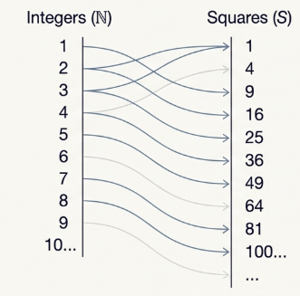
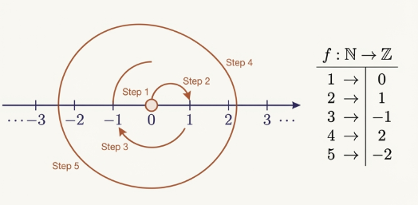
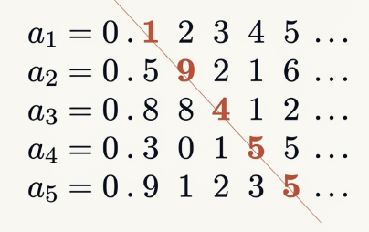

## Numerically Equivalent Sets

In the classical era, "size" was a property primarily associated with finite collections, where the terminal result of a counting process provided an absolute value. However, the necessity of defining "size" for infinite collections demanded a more sophisticated definition. This transition challenged the ancient axiom that "the whole is greater than the part," a principle that proved insufficient when applied to the non-finite.

The historical tension surrounding this development is most clearly seen in the intellectual progression from [Galileo Galilei](https://wikipedia.org/wiki/Galileo_Galilei) to [Bernhard Bolzano](https://wikipedia.org/wiki/Bernard_Bolzano) and [Richard Dedekind](https://wikipedia.org/wiki/Richard_Dedekind). In his 17th-century works, [Dialogue Concerning the Two Chief World Systems](https://wikipedia.org/wiki/Dialogue_Concerning_the_Two_Chief_World_Systems) and [Discourses and Mathematical Demonstrations Concerning Two New Sciences](https://wikipedia.org/wiki/Two_New_Sciences), Galileo observed a "bothersome" property of the infinite: a bijective correspondence could be established between the set of positive integers $\mathbb{N}$ and the set of their squares $S = \\{1, 4, 9, \dots\\}$. Galileo recognized that despite the existence of many integers that are not squares, there appeared to be "as many" squares as there are integers. He concluded that while the number of squares was not less than the number of integers, the two sets could not be considered "equal" in the traditional sense, as the correspondence between a set and its proper subset felt inherently paradoxical.

By the 19th century, Bernhard Bolzano began to normalize this phenomenon. In his work [Paradoxes of the Infinite](https://wikipedia.org/wiki/Paradoxes_of_the_Infinite), Bolzano expressed comfort with the fact that infinite sets could be numerically equivalent to their proper subsets. It was Richard Dedekind who eventually synthesized these observations into a formal definition. During the late 19th century, Dedekind transformed Galileo's paradox into a defining characteristic: **a set $S$ is infinite if and only if it contains a proper subset that can be put in one-to-one correspondence with $S$**.

In abstract mathematics, we replace the intuitive process of counting with the formal mechanism of "pairing" to determine cardinality. For finite sets, cardinality ($|S|$) is the number of elements in the collection. However, for a general theory applicable to all sets, we define **numerical equivalence**.

> [!NOTE] **Numerical Equivalence**
>
> Two sets $A$ and $B$ have the same cardinality, written $|A| = |B|$, if there exists a bijective function $f: A \to B$.

> [!TIP] **Theorem 10.1**
>
> Numerical equivalence is an equivalence relation.

> **Proof**
>
> - **Reflexivity**: For any set $A$, the identity function $i_A: A \to A$ is bijective, thus $A \approx A$.
> - **Symmetry**: If $|A| = |B|$ via bijection $f$, then $f$ has an inverse $f^{-1}: B \to A$ which is also bijective, ensuring $|B| = |A|$.
> - **Transitivity**: If $|A| = |B|$ and $|B| = |C|$ via bijections $f$ and $g$ respectively, then the composition $g \circ f: A \to C$ is bijective. Thus, $|A| = |C|$.

## Denumeral Sets

> [!NOTE] **Denumerable Set**
>
> A set $A$ is defined as denumerable if it is numerically equivalent to the set of natural numbers, $|A| = |\mathbb{N}|$.

This requires a bijective mapping $f: \mathbb{N} \to A$, allowing us to list the elements of $A$ as an infinite sequence $\\{a_1, a_2, a_3, \dots\\}$ where each $a_i = f(i)$.

> [!TIP] **Result 10.3**
>
> The set of integers $\mathbb{Z}$ is denumerable

> **Proof**
>
> We can construct a bijection $f: \mathbb{N} \to \mathbb{Z}$ by listing elements as $0, 1, -1, 2, -2, \dots$.
>
> Formally, this is defined by the function:
>
> $$f(n) = \frac{1 + (-1)^n(2n - 1)}{4}$$
>
> The alternating sign provided by $(-1)^n$ allows the function to oscillate between the positive and negative integers, ensuring that zero and all positive/negative integers are mapped exactly once, confirming that $\mathbb{Z}$ is no "larger" than $\mathbb{N}$ despite containing it as a proper subset.

> [!TIP] **Theorem 10.4**
>
> Every infinite subset of a denumerable set is itself denumerable.

> **Proof**
>
> Let $A = \\{a_1, a_2, \dots\\}$ and $B \subseteq A$. We define
>
> $$S = \{i \in \mathbb{N} : a_i \in B\}$$
>
> By the [Well-Ordering Principle](/math/dma/05_sequences_induction_recursion/#well-ordering-principle-for-the-integers), $S$ has a least element $i_1$, and we set $b_1 = a_{i_1}$.
>
> Inductively, we define $i_{k+1}$ as the minimum element of $S - \\{i_1, i_2, \dots, i_k\\}$ and set $b_{k+1} = a_{i_{k+1}}$.
>
> This inductive selection creates a list $\\{b_1, b_2, \dots\\}$ that bijectively maps $\mathbb{N}$ to $B$, proving $B$ is denumerable.

## Uncountable Sets

The conceptual breakthrough of the uncountable set demonstrated that the real number line possesses a magnitude that cannot be exhausted by any list.

> [!TIP] **Theorem 10.9**
>
> The open interval (0, 1) is uncountable.

> **Proof**
>
> The proof employs the Cantor Diagonal Argument.
>
> If we assume $(0, 1)$ is denumerable, we could list its elements as
>
> $$\{a_1, a_2, a_3, \dots\}$$
>
> in decimal form:
>
> $$a_1 = 0.a_{11}a_{12}a_{13}\dots a_2 = 0.a_{21}a_{22}a_{23}\dots a_3 = 0.a_{31}a_{32}a_{33}\dots$$
>
> We construct a number $b = 0.b_1b_2b_3\dots$ by defining each digit $b_i = 4$ if $a_{ii} = 5$, and $b_i = 5 if a_{ii} \neq 5$.
>
> This ensures $b$ differs from every $a_n$ in at least the $n$-th decimal place. Crucially, by avoiding the digit $9$, we ensure $b$ is not an "alternate expansion" (such as $0.499\dots$ being equal to $0.500\dots$), guaranteeing $b$ is a unique real number in $(0, 1)$ not present on the list. This contradiction proves $(0, 1)$ is uncountable.

To prove that two different infinite sets possess the same cardinality, we must demonstrate a bijective functional mapping between them.

> [!TIP]
>
> The interval $(-1, 1)$ and the set $\mathbb{R}$ are numerically equivalent.

> **Proof**
>
> Let us define a function $f$ as follows:
>
> $$f(x) = \frac{x}{1 - |x|}$$
>
> To verify its bijective nature, we first prove it is one-to-one.
>
> If $f(a) = f(b)$, we consider the case where $f(a) > 0$ (implying $a, b > 0$). Then
>
> $$\frac{a}{1-a} = \frac{b}{1-b} \implies a - ab = b - ab \implies a = b$$
>
> A similar logic applies for $a, b < 0$.
>
> Next, we prove it is onto.
>
> For any $r \in \mathbb{R}$, if $r > 0$, we find $x = \frac{r}{1+r} \in (0, 1)$ such that $f(x) = r$. If $r < 0, x = \frac{r}{1-r} \in (-1, 0)$ maps to $r$.
>
> Thus, $f$ is bijective.
