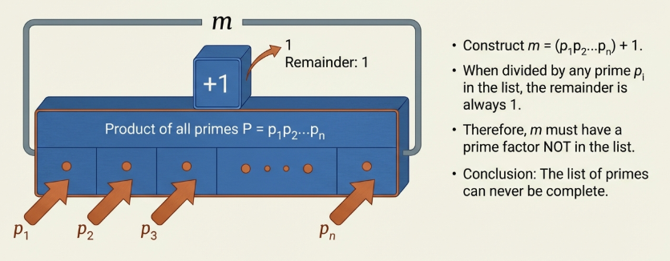

Number theory occupies a position of unparalleled historical prestige within the mathematical sciences. Often heralded as the "queen of mathematics". It focuses on the fundamental properties of the integers. Dating back at least to the Pythagoreans in 500 B.C., this field is celebrated not merely for its antiquity, but for the clarity and simplicity of its problems and the sophisticated style found in their solutions.

> [!NOTE] **Prime Number**
>
> Given an integer n \geq 2, we say $n$ is a **prime** if its positive divisors are $1$ and itself.

> [!NOTE] **Composite Number**
>
> An integer $n \geq 2$ that is not prime is classified as a **composite number**.

An integer $n \geq 2$ is composite if and only if there exist integers $a$ and $b$ such that

$$
n = ab
$$

where $1 < a < n$ and $1 < b < n$.

The integer $1$ **is considered neither prime nor composite**.

## Divisibility Properties of Integers

> [!TIP] **Rules of Divisibility I**
>
> Given integers $a, b$ and $c$, where $a \neq 0$:
>
> - If $a | b$, then $a | bc$.
>
> _Proof_: Since $a | b$, there exists an integer $q$ such that $b = aq$. Multiplying both sides by $c$, we obtain $bc = a(qc)$. Because $qc$ is an integer, it follows by definition that $a | bc$.
>
> - If $a | b$ and $b | c$ (where $b \neq 0$), then $a | c$.
>
> _Proof_: Let $b = aq_1$ and $c = bq_2$ for some integers $q_1, q_2$. Substituting the expression for $b$ into the second equation, we have $c = (aq_1)q_2 = a(q_1q_2)$. Since $q_1q_2$ is an integer, $a | c$.
>
> - If $a | b$ and $a | c$, then $a | (bx + cy)$ for all integers $x$ and $y$.
>
> _Proof_: Let $b = aq_1$ and $c = aq_2$. Then
>
> $$bx + cy = (aq_1)x + (aq_2)y = a(q_1x + q_2y)$$
>
> Since $q_1x + q_2y$ is an integer, $a | (bx + cy)$.

> [!TIP] **Rules of Divisibility II**
>
> - If $a | b$ and $b | a$, then $a = b$ or $a = -b$.
>
> _Proof_: From $b = aq_1$ and $a = bq_2$, we have
>
> $$a = (aq_1)q_2 = a(q_1q_2)$$
>
> Dividing by $a$, we obtain $1 = q_1q_2$. Since $q_1, q_2$ are integers, we must have $q_1 = q_2 = 1$ or $q_1 = q_2 = -1$, implying $a = b$ or $a = -b$.
>
> - If $a | b$, then $|a| \leq |b|$ (for nonzero $b$).
>
> _Proof_: If $b = aq$, then $q \neq 0$, implying $|q| \geq 1$.
>
> Utilizing the property $|xy| = |x||y|$, we have $|b| = |a||q| \geq |a| \cdot 1 = |a|$.

These results reveal that the essential mechanism for proving $r | s$ is the ability to express the relationship as $s = rt$ for some integer $t$.

## The Division Algorithm

> [!NOTE] **The Division Algorithm**
>
> For positive integers $a$ and $b$, there exist unique integers $q$ (_quotient_) and $r$ (_remainder_) such that $b = aq + r$ and $0 \leq r < a$.

> **Proof**
>
> _Existence_
>
> We consider the set
>
> $$S = \{b - ax : x \in \mathbb{Z} \text{ and } b - ax \geq 0\}$$
>
> By letting $x=0$, we see $b \in S$, so $S$ is non-empty.
>
> The Well-Ordering Principle guarantees a minimum value $r$ in $S$. Because $r \in S$, there exists some $q$ such that $b - aq = r$. If $r \geq a$, then $t = r - a$ would be a smaller element in $S$, contradicting the fact that $r$ is the smallest. Thus, $0 \leq r < a$.
>
> _Uniqueness_:
>
> If we assume another pair $q'$, $r'$ satisfies the conditions, we find
>
> $$a(q - q') = r' - r$$
>
> Since both remainders are bounded by $0$ and $a$, their difference $|r' - r|$ is strictly less than $a$. The only integer multiple of $a$ that is smaller than $a$ is zero, thus $r = r'$ and $q = q'$.

This leads to the concept of **Residue Classes** (Integers Modulo $n$). For $n=3$, the Division Algorithm partitions the integers into disjoint sets based on their remainders: $[0]$, $[1]$, and $[2]$.

## Greatest Common Divisors

> [!NOTE] **The Greatest Common Divisor (GCD)**
>
> The GCD of two integers $a$ and $b$ (not both zero) is the largest positive integer that divides both.

We characterize the GCD using the concept of a Linear Combination, which is an integer of the form $ax + by$ where $x, y \in \mathbb{Z}$. Because $a, b, x$, and $y$ are integers, every linear combination is itself an integer.

> [!TIP] **Theorem 11.7**
>
> Given two integers $a$ and $b$, not both zero, $gcd(a, b)$ is the least positive integer in the set of all linear combinations of $a$ and $b$.

> [!TIP] **Theorem 11.8**
>
> An integer $d$ is the $gcd(a, b)$ if and only if:
>
> 1. $d$ is a common divisor of $a$ and $b$.
> 2. If $c$ is any other common divisor of $a$ and $b$, then $c | d$.

## The Euclidean Algorithm

> [!TIP] **Lemma 11.9**
>
> Given two integers $a, b$, not both zero, if $b = aq + r$, then $gcd(a, b) = gcd(r, a)$.

> **Example**: Calculating $gcd(374, 946)$
>
> 1. $946 = 374 \cdot 2 + 198$
> 2. $374 = 198 \cdot 1 + 176$
> 3. $198 = 176 \cdot 1 + 22$
> 4. $176 = 22 \cdot 8 + 0$
>
> The last non-zero remainder is $22$, thus $gcd(374, 946) = 22$.

To express this GCD as a linear combination, we use Backward Substitution as seen in the previous example:

> 1. Start with the penultimate step: $22 = 198 + 176(-1)$.
> 2. Substitute
>
> $$176 = 374 + 198(-1): 22 = 198(1) + [374(1) + 198(-1)](-1) 22 = 198(1) + 374(-1) + 198(1) 22 = 198(2) + 374(-1)$$
>
> 3. Substitute
>
> $$198 = 946 + 374(-2): 22 = [946(1) + 374(-2)](2) + 374(-1) 22 = 946(2) + 374(-4) + 374(-1) 22 = 946(2) + 374(-5)$$
>
> Thus, $s=2$ and $t=-5$.

## The Relative Prime Numbers

> [!TIP] **Theorem 11.12**
>
> Let $a$ and $b$ be integers, not both $0$. Then $gcd(a, b) = 1$ if and only if there exist integers $s$ and $t$ such that $1 = as + bt$.

> **Proof**:
>
> Suppose $gcd(a, b) = 1)$. By the established properties of the GCD, we know that $gcd(a, b)$ can always be expressed as a linear combination. Thus, if the GCD is $1$, there must exist integers $s$ and $t$ such that $as + bt = 1$.
>
> Suppose $1 = as + bt$. We rely on the theorem that $gcd(a, b)$ is the smallest positive integer that is a linear combination of $a$ and $b$. Since $1$ is a linear combination of $a$ and $b$, and there is no positive integer smaller than $1$, it logically follows that $gcd(a, b)$ must be $1$.

> [!NOTE] **Relatively Prime**
>
> Two integers $a$ and $b$, not both $0$, are called relatively prime if their greatest common divisor is $1$ ($gcd(a, b) = 1$).

> [!TIP] **Euclid’s Lemma**
>
> Let $a, b$, and $c$ be integers, where $a \neq 0$. If $a | bc$ and $gcd(a, b) = 1$, then $a | c$.

> **Proof**
>
> Since $a | bc$, there exists some integer $q$ such that $bc = aq$.
>
> Since $a$ and $b$ are relatively prime, there exist integers $s$ and $t$ such that
>
> $$1 = as + bt$$
>
> Thus
>
> $$c = c \cdot 1 = c(as + bt) = a(cs) + (bc)t = a(cs) + (aq)t = a(cs + qt)$$
>
> Since $cs + qt$ is an integer, $a | c$.

> [!TIP] **Corollary 11.14**:
>
> If a prime $p$ divides $bc$, then $p | b$ or $p | c$. This follows from Euclid's Lemma because if $p$ does not divide $b$, then $gcd(p, b)$ must be $1$.

> [!TIP] **Corollary 11.15**
>
> If a prime $p$ divides a product $a_1 a_2 \dots a_n$, then $p$ divides at least one $a_i$.

> [!TIP] **Theorem 11.16**
>
> Let $a, b, c \in \mathbb{Z}$. If $a | c$ and $b | c$, and $gcd(a, b) = 1$, then $ab | c$.

## The Fundamental Theorem of Arithmetic

> [!NOTE] **The Fundamental Theorem of Arithmetic**
>
> Every integer $n \geq 2$ is either prime or can be expressed as a product of primes. Furthermore, this factorization is unique, regardless of the order of factors.

> **Proof**
>
> Existence
>
> We utilize the [Strong Principle of Mathematical Induction](/math/dma/05_sequences_induction_recursion/#strong-mathematical-induction-and-the-well-ordering-principle-for-the-integers).
>
> The statement is true for $n=2$. Assume it is true for all integers $i$ where $2 \leq i \leq k$. For the integer $k+1$, if it is composite, there must exist integers $a$ and $b$ such that $k+1 = ab$, where $2 \leq a \leq k$ and $2 \leq b \leq k$.
>
> By our inductive hypothesis, both $a$ and $b$ are primes or products of primes; thus, their product $k+1$ is also a product of primes.
>
> Uniqueness
>
> We use Proof by Contradiction. Assume $n$ has two different factorizations:
>
> $$p_1 p_2 \dots p_s = q_1 q_2 \dots q_t$$
>
> where primes are in nondecreasing order ($p_1 \leq p_2 \dots \leq p_s$). If the factorizations differ, we cancel common factors until we have
>
> $$p_r \dots p_s = q_r \dots q_t$$
>
> where $p_r \neq q_r$. By Euclid's Lemma, $p_r$ must divide the product on the right and thus equal some $q_j$. This eventually forces $p_r = q_r$, contradicting the assumption that the factorizations were different.

Grouping equal prime factors and ordering them $p_1 < p_2 < \dots < p_k$ yields the **Canonical Factorization**.

## Concepts Involving Sums of Divisors

> [!TIP] **The Infinitude of Primes**
>
> Assume there is a finite set of all primes
>
> $$\{p_1, p_2, \dots, p_n\}$$
>
> Construct $m = (p_1 p_2 \dots p_n) + 1$. Since $m \geq 2$, it must have a prime factor $p_i$ from our set. Thus $p_i | m$. However, $p_i$ also divides the product ($p_1 p_2 \dots p_n$).
>
> This implies $p_i$ must divide the difference: $1 = m - (p_1 p_2 \dots p_n)$. This yields $p_i | 1$, which is a logical impossibility, proving the number of primes is infinite.

> [!NOTE] **Proper Divisors and Perfect Numbers**
>
> A **proper divisor** of $n$ is any divisor $a | n$ such that $1 \leq a < n$. A **perfect number** is an integer equal to the sum of its proper divisors.

> [!NOTE] **Ruth-Aaron Pairs**
>
> Consecutive integers where the sums of their prime divisors are equal are called Ruth-Aaron pairs.

The pair $(714, 715)$ is the most famous example, named after the career home run records of Babe Ruth and Hank Aaron.

$$
714 = 2 \cdot 3 \cdot 7 \cdot 17 \implies 2 + 3 + 7 + 17 = 29
$$

$$
715 = 5 \cdot 11 \cdot 13 \implies 5 + 11 + 13 = 29
$$

[Paul Erdős](https://wikipedia.org/wiki/Paul_Erd%C5%91s) proved there are infinitely many such pairs.
