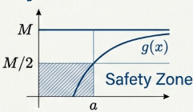

While an intuitive understanding of limits suggests a value "moving toward" another, formal calculus requires precise definitions for real-valued functions defined on sets of real numbers ($f : X \to \mathbb{R}$). Our study of limits generally follows two primary interests identified in the foundational literature:

1. **Limits of Sequences**: Where the domain $X$ is the set of natural numbers ($\mathbb{N}$), and we observe the behavior of functional values as $n$ increases indefinitely.
2. **Limits of Functions**: Where the function is defined near a specified real number $a$, and we analyze the functional values as $x$ approaches $a$.

## Limits of Sequences

In the study of sequences, terminology such as "nearness" or "large enough" lacks the precision required for analysis. To achieve rigor, we replace these descriptors with the precision of absolute values, defining the distance between two real numbers a and b as $|a - b|$.

> [!NOTE] **Sequence**
>
> A **sequence** is defined as a real-valued function
>
> $$f : \mathbb{N} \to \mathbb{R}$$
>
> If $f(n) = a_n$ for each $n \in \mathbb{N}$, the sequence is denoted by its terms: $a_1, a_2, a_3, \dots$ or simply $\\{a_n\\}$.

> [!NOTE] **Convergence**
>
> A sequence $\\{a_n\\}$ **converges** to a real number $L$ if, for every real number $\epsilon > 0$, there exists a positive integer $N$ such that if $n$ is an integer with $n > N$, then $|a_n - L| < \epsilon$.

Thus $\epsilon$ represents a pre-determined "closeness" threshold. Whereas $N$ serves as a threshold beyond which the "tail" of the sequence is captured; every subsequent term must reside within the interval $(L - \epsilon, L + \epsilon)$. If no such $L$ exists, the sequence is said to **diverge**.

> **Result: The sequence $\\{1/n\\}$ converges to $0$**
>
> Let $\epsilon > 0$. We choose $N = \lceil 1/\epsilon \rceil$.
>
> If $n > N$, then $n > 1/\epsilon$, which implies $1/n < \epsilon$. Thus, $|1/n - 0| < \epsilon$.
> The choice of $N$ using the ceiling function ensures $N$ is an integer. While any integer larger than $1/\epsilon$ is effective, this specific $N$ is sufficient to prove the result.

To establish divergence, we employ Proof by Contradiction. By assuming a limit $L$ exists and demonstrating a resulting impossibility.

> **Result: Analyzing Divergence**
>
> We examine the sequence $\\{(-1)^{n+1}\\}$. Assume the sequence converges to $L$.
>
> By choosing a specific $\epsilon = 1$, there must exist an $N$ such that all $n > N$ satisfy $|(-1)^{n+1} - L| < 1$.
>
> For odd $n > N, |1 - L| < 1 \implies 0 < L < 2$.
>
> For even $n > N, |-1 - L| < 1 \implies -2 < L < 0$.
>
> This forces $L$ to be simultaneously positive and negative, a clear contradiction. Thus, the sequence diverges.

> [!NOTE] **Divergence to Infinity**
>
> A sequence $\\{a_n\\}$ diverges to infinity ($\lim_{n \to \infty} a_n = \infty$) if for every positive number $M$, there exists a positive integer $N$ such that if $n > N$, then $a_n > M$.

> **Result: The sequence $\\{(n^2+1)/n\\}$ diverges to infinity**
>
> We observe that
>
> $$\frac{n^2+1}{n} = n + \frac{1}{n} > n$$
>
> For any $M$, if $n^2 > M$, then $n^2+1 > M$.
>
> Let $M > 0$. Choose $N = \lceil \sqrt{M} \rceil$.
>
> If $n > N$, then $n^2 > M$. Since $\frac{n^2+1}{n} > n$ and $n \ge 1$ implies $n^2 \ge n$, the relationship $\frac{n^2+1}{n} > n$ combined with the fact that $n^2 > M$ serves as a valid, conservative bound for the proof.

## Infinite Series

> [!NOTE] **Infinite Series**
>
> An infinite series $\sum_{k=1}^{\infty} a_k$ is conceptualized as a sequence of partial sums $\\{s_n\\}$, where $s_n = \sum_{k=1}^n a_k$.

The Harmonic Series ($\sum 1/k$) provides a classic study in divergence.

> Assume the harmonic series converges to $L$.
>
> For $\epsilon = 1/4$, there is an $N$ such that $n > N \implies |s_n - L| < 1/4$.
>
> We know $s_{2n} > s_n + 1/2$. This leads to a specific contradiction:
>
> $$1/4 > s_{2n} - L > (s_n - L) + 1/2 > -1/4 + 1/2 = 1/4$$
>
> The conclusion $1/4 > 1/4$ is a mathematical impossibility.

## Limits of Functions

Analyzing functions near a point a requires the concept of the Deleted Neighborhood. This is vital because the value of $f(a)$ may be undefined or irrelevant; we only analyze the behavior as $x$ approaches $a$. For example, $f(x) = |x|/x$ is undefined at $x=0$, yet the behavior near $0$ can be rigorously investigated.

> [!NOTE] **Limit**
>
> The real number $L$ is the **limit** of $f(x)$ as $x \to a$ if for every $\epsilon > 0$, there exists $a \delta > 0$ such that:
>
> $$0 < |x - a| < \delta \implies |f(x) - L| < \epsilon$$

For

$$
\lim_{x \to 4} (3x - 7) = 5
$$

choose $\delta = \epsilon/3$. Thus, $3|x-4| < 3(\epsilon/3) = \epsilon$.

## Fundamental Properties of Limit Functions

> [!NOTE] The Arithmetic of Limits
>
> If $\lim_{x \to a} f(x) = L$ and $\lim_{x \to a} g(x) = M$, then:
>
> $$\lim_{x \to a} (f(x) + g(x)) = L + M$$

> **Proof**
>
> Let $\epsilon > 0$. Since $\lim_{x \to a} f(x) = L$, there exists $\delta_1 > 0$ such that if $0 < |x - a| < \delta_1$, then $|f(x) - L| < \epsilon/2$.
>
> Similarly, since $\lim_{x \to a} g(x) = M$, there exists $\delta_2 > 0$ such that if $0 < |x - a| < \delta_2$, then $|g(x) - M| < \epsilon/2$
>
> Choose $\delta = \min(\delta_1, \delta_2)$ and let $x \in \mathbb{R}$ such that $0 < |x - a| < \delta$.
>
> This implies that both $0 < |x - a| < \delta_1$ and $0 < |x - a| < \delta_2$ are satisfied. Therefore:
>
> $$|(f(x) + g(x)) - (L + M)| = |(f(x) - L) + (g(x) - M)|$$
>
> Applying the [Triangle Inequality](/math/dma/04_elementary_number_theory/#absolute-value-and-the-triangle-inequality):
>
> $$|(f(x) - L) + (g(x) - M)| \leq |f(x) - L| + |g(x) - M| < \epsilon/2 + \epsilon/2 = \epsilon$$

The limit of a product is not a direct extension of the sum rule; it requires an intermediary understanding of local boundedness. In a product, the error of one function is scaled by the magnitude of the other. Thus, we must first prove that a function is contained within a finite range near the point of convergence.

> [!TIP] **The Boundedness Principle**
>
> If $\lim_{x \to a} f(x) = L$, then there exists a $\delta > 0$ such that if $0 < |x - a| < \delta$, then $|f(x)| < 1 + |L|$.

> **Proof**
>
> Let $\epsilon = 1$. By the definition of a limit, there exists $\delta > 0$ such that
>
> $$0 < |x - a| < \delta \implies |f(x) - L| < 1$$
>
> By the [Triangle Inequality](/math/dma/04_elementary_number_theory/#absolute-value-and-the-triangle-inequality):
>
> $$|f(x)| = |f(x) - L + L| \leq |f(x) - L| + |L| < 1 + |L|$$

> [!NOTE] **The Product Theorem**
>
> If $\lim_{x \to a} f(x) = L$ and $\lim_{x \to a} g(x) = M$, then
>
> $$\lim_{x \to a} f(x) \cdot g(x) = LM$$

> **Proof**
>
> Let $\epsilon > 0$. We know there exists $\delta_1 > 0$ such that if $0 < |x - a| < \delta_1$, then $|f(x)| < 1 + |L|$.
>
> Since $\lim_{x \to a} g(x) = M$, there exists $\delta_2 > 0$ such that if $0 < |x - a| < \delta_2$, then $|g(x) - M| < \frac{\epsilon}{2(1 + |L|)}$.
>
> _Case 1_: $M = 0$.
>
> Choose $\delta = \min(\delta_1, \delta_2)$. For $0 < |x - a| < \delta$:
>
> $$|f(x)g(x) - LM| = |f(x)g(x) - 0| = |f(x)||g(x) - M| < (1+|L|) \cdot \frac{\epsilon}{2(1+|L|)} = \epsilon/2 < \epsilon$$
>
> _Case 2_: $M \neq 0$.
>
> There exists $\delta_3 > 0$ such that if $0 < |x - a| < \delta_3$, then
>
> $$|f(x) - L| < \frac{\epsilon}{2|M|}$$
>
> Choose $\delta = \min(\delta_1, \delta_2, \delta_3)$. For $0 < |x - a| < \delta$:
>
> $$|f(x)g(x) - LM| = |f(x)g(x) - f(x)M + f(x)M - LM|$$
>
> $$= |f(x)(g(x) - M) + (f(x) - L)M| \leq |f(x)||g(x) - M| + |f(x) - L||M|$$
>
> $$< (1+|L|)\frac{\epsilon}{2(1+|L|)} + \left(\frac{\epsilon}{2|M|}\right)|M| = \epsilon/2 + \epsilon/2 = \epsilon$$

The primary analytical challenge of quotients is keeping the denominator away from zero. To perform a rigorous $\epsilon-\delta$ proof, we must establish a "safe zone"—a neighborhood where the denominator is bounded away from zero.

> [!TIP] **Lower Bounds of Functions**
>
> If $\lim_{x \to a} g(x) = M \neq 0$, then $1/|g(x)| < 2/|M|$ for all $x$ in some deleted neighborhood of $a$.

> **Proof**
>
> Let $\epsilon = |M|/2$. There exists $\delta > 0$ such that if $0 < |x - a| < \delta$, then
>
> $$|g(x) - M| < |M|/2$$
>
> By the [Triangle Inequality](/math/dma/04_elementary_number_theory/#absolute-value-and-the-triangle-inequality):
>
> $$|M| = |M - g(x) + g(x)| \leq |M - g(x)| + |g(x)|$$
>
> Thus,
>
> $$|g(x)| \geq |M| - |M - g(x)| > |M| - |M|/2 = |M|/2$$
>
> Inverting this gives $1/|g(x)| < 2/|M|$.

> [!NOTE] **The Quotient Theorem**
>
> If $\lim_{x \to a} f(x) = L$ and $\lim_{x \to a} g(x) = M \neq 0$, then
>
> $$\lim_{x \to a} \frac{f(x)}{g(x)} = \frac{L}{M}$$

> **Proof**
>
> Let $\epsilon > 0$. We know there exists $\delta_1 > 0$ such that if $0 < |x - a| < \delta_1$, then $1/|g(x)| < 2/|M|$.
>
> Also, there exists $\delta_2 > 0$ such that if $0 < |x - a| < \delta_2$, then $|f(x) - L| < |M|\epsilon/4$.
>
> _Case 1_: $L = 0$.
>
> Choose $\delta = \min(\delta_1, \delta_2)$. For $0 < |x - a| < \delta$:
>
> $$\left| \frac{f(x)}{g(x)} - \frac{L}{M} \right| \leq \frac{|f(x) - L|}{|g(x)|} < \left(\frac{|M|\epsilon}{4}\right)\left(\frac{2}{|M|}\right) = \epsilon/2 < \epsilon$$
>
> _Case 2_: $L \neq 0$.
>
> Since $\lim_{x \to a} g(x) = M$, there exists $\delta_3 > 0$ such that if $0 < |x - a| < \delta_3$, then $|g(x) - M| < \frac{|M|^2\epsilon}{4|L|}$. Choose $\delta = \min(\delta_1, \delta_2, \delta_3)$. For $0 < |x - a| < \delta$:
>
> $$\left| \frac{f(x)}{g(x)} - \frac{L}{M} \right| \leq \frac{|f(x) - L||M| + |L||M - g(x)|}{|g(x)||M|} < \frac{(|M|\epsilon/4)|M| + |L|(|M|^2\epsilon/4|L|)}{(|M|/2)|M|} = \frac{|M|^2\epsilon/4 + |M|^2\epsilon/4}{|M|^2/2} = \epsilon$$

> [!TIP] **Fundamental Theorems**
>
> **Constant Limits**: If $f(x) = c$, then
>
> $$\lim_{x \to a} f(x) = c$$
>
> **Identity Limits**: If $f(x) = x$, then
>
> $$\lim_{x \to a} f(x) = a$$
>
> **Limits of Power Functions**: For $n \in \mathbb{N}$,
>
> $$\lim_{x \to a} x^n = a^n$$
>
> **Limits of Sum of $n$ Functions**: For functions $f_1, \dots, f_n$ where $\lim_{x \to a} f_i(x) = L_i$:
>
> $$\lim_{x \to a} \sum_{i=1}^n f_i(x) = \sum_{i=1}^n L_i$$

## Continuity

> [!NOTE] **Continuity of a Function**
>
> A function $f$ is continuous at a if:
>
> 1. $f(a)$ is defined.
> 2. $\lim_{x \to a} f(x)$ exists.
> 3. $\lim_{x \to a} f(x) = f(a)$.

For

$$
f(x) = \frac{x^2 - 3x + 2}{x^2 - 1}
$$

the function is undefined at $x=1$. However, the limit exists:

$$
\lim_{x \to 1} \frac{(x-1)(x-2)}{(x-1)(x+1)} = \lim_{x \to 1} \frac{x-2}{x+1} = -1/2
$$

Thus, $f$ is continuous at $1$ only if we define $f(1) = -1/2$.

## Differentiability

We define the derivative of a function as the limit of a difference quotient, geometrically representing the tangent slope.

> [!NOTE] **The Derivative Definition**
>
> Given a function $f$, its derivative, denoted $f'(a)$, is defined as:
>
> $$f'(a) = \lim_{x \to a} \frac{f(x) - f(a)}{x - a}$$

For

$$
f(x) = 1/x^2
$$

at $a=1$, the difference quotient simplifies to

$$
\frac{-(x+1)}{x^2}
$$

which has a limit of $-2$. To prove this via $\epsilon-\delta$, we examine:

$$
\left| \frac{2x^2 - x - 1}{x^2} \right| = \frac{|x-1||2x+1|}{x^2}
$$

Restricting $\delta \leq 1/2$ ensures $1/2 < x < 3/2$. Consequently,

$$
x^2 > 1/4 \implies 1/x^2 < 4, and |2x+1| < 4
$$

Thus, the expression is bounded by $16|x-1|$. By choosing $\delta = \min(1/2, \epsilon/16)$, we satisfy the limit definition.

> [!TIP] **Theorem 12.38**
>
> If $f$ is differentiable at $a$, then $f$ is continuous at $a$.

> **Proof**
>
> $$f(x) = \frac{f(x) - f(a)}{x - a}(x - a) + f(a)$$
>
> Taking the limit:
>
> $$\lim_{x \to a} f(x) = [f'(a) \cdot 0] + f(a) = f(a)$$

While differentiability implies continuity, the converse is false. Functions such as $f(x) = |x|$ (proven non-differentiable at $0$) and $g(x) = \sqrt[3]{x}$ are continuous at zero but fail to be differentiable due to sharp corners or vertical tangents.
