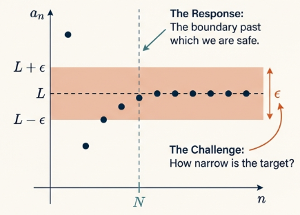
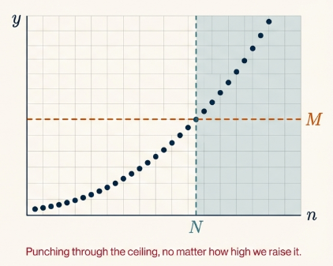
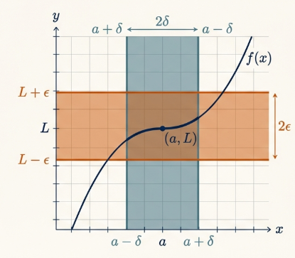

While an intuitive understanding of limits suggests a value "moving toward" another, formal calculus requires precise definitions for real-valued functions defined on sets of real numbers ($f : X \to \mathbb{R}$). Our study of limits generally follows two primary interests identified in the foundational literature:

1. **Limits of Sequences**: Where the domain $X$ is the set of natural numbers ($\mathbb{N}$), and we observe the behavior of functional values as $n$ increases indefinitely.
2. **Limits of Functions**: Where the function is defined near a specified real number $a$, and we analyze the functional values as $x$ approaches $a$.

## Limits of Sequences

In the study of sequences, terminology such as "nearness" or "large enough" lacks the precision required for analysis. To achieve rigor, we replace these descriptors with the precision of absolute values, defining the distance between two real numbers a and b as $|a - b|$.

> [!NOTE] **Sequence**
>
> A **sequence** is defined as a real-valued function
>
> $$f : \mathbb{N} \to \mathbb{R}$$
>
> If $f(n) = a_n$ for each $n \in \mathbb{N}$, the sequence is denoted by its terms: $a_1, a_2, a_3, \dots$ or simply $\\{a_n\\}$.

> [!NOTE] **Convergence**
>
> A sequence $\\{a_n\\}$ **converges** to a real number $L$ if, for every real number $\epsilon > 0$, there exists a positive integer $N$ such that if $n$ is an integer with $n > N$, then $|a_n - L| < \epsilon$.

Thus $\epsilon$ represents a pre-determined "closeness" threshold. Whereas $N$ serves as a threshold beyond which the "tail" of the sequence is captured; every subsequent term must reside within the interval $(L - \epsilon, L + \epsilon)$. If no such $L$ exists, the sequence is said to **diverge**.

> **Result: The sequence $\\{1/n\\}$ converges to $0$**
>
> Let $\epsilon > 0$. We choose $N = \lceil 1/\epsilon \rceil$.
>
> If $n > N$, then $n > 1/\epsilon$, which implies $1/n < \epsilon$. Thus, $|1/n - 0| < \epsilon$.
> The choice of $N$ using the ceiling function ensures $N$ is an integer. While any integer larger than $1/\epsilon$ is effective, this specific $N$ is sufficient to prove the result.

To establish divergence, we employ Proof by Contradiction. By assuming a limit $L$ exists and demonstrating a resulting impossibility.

> **Result: Analyzing Divergence**
>
> We examine the sequence $\\{(-1)^{n+1}\\}$. Assume the sequence converges to $L$.
>
> By choosing a specific $\epsilon = 1$, there must exist an $N$ such that all $n > N$ satisfy $|(-1)^{n+1} - L| < 1$.
>
> For odd $n > N, |1 - L| < 1 \implies 0 < L < 2$.
>
> For even $n > N, |-1 - L| < 1 \implies -2 < L < 0$.
>
> This forces $L$ to be simultaneously positive and negative, a clear contradiction. Thus, the sequence diverges.

> [!NOTE] **Divergence to Infinity**
>
> A sequence $\\{a_n\\}$ diverges to infinity ($\lim_{n \to \infty} a_n = \infty$) if for every positive number $M$, there exists a positive integer $N$ such that if $n > N$, then $a_n > M$.

> **Result: The sequence $\\{(n^2+1)/n\\}$ diverges to infinity**
>
> We observe that
>
> $$\frac{n^2+1}{n} = n + \frac{1}{n} > n$$
>
> For any $M$, if $n^2 > M$, then $n^2+1 > M$.
>
> Let $M > 0$. Choose $N = \lceil \sqrt{M} \rceil$.
>
> If $n > N$, then $n^2 > M$. Since $\frac{n^2+1}{n} > n$ and $n \ge 1$ implies $n^2 \ge n$, the relationship $\frac{n^2+1}{n} > n$ combined with the fact that $n^2 > M$ serves as a valid, conservative bound for the proof.

## Infinite Series

> [!NOTE] **Infinite Series**
>
> An infinite series $\sum_{k=1}^{\infty} a_k$ is conceptualized as a sequence of partial sums $\\{s_n\\}$, where $s_n = \sum_{k=1}^n a_k$.

The Harmonic Series ($\sum 1/k$) provides a classic study in divergence.

> Assume the harmonic series converges to $L$.
>
> For $\epsilon = 1/4$, there is an $N$ such that $n > N \implies |s_n - L| < 1/4$.
>
> We know $s_{2n} > s_n + 1/2$. This leads to a specific contradiction:
>
> $$1/4 > s_{2n} - L > (s_n - L) + 1/2 > -1/4 + 1/2 = 1/4$$
>
> The conclusion $1/4 > 1/4$ is a mathematical impossibility.

## Limits of Functions

Analyzing functions near a point a requires the concept of the Deleted Neighborhood. This is vital because the value of $f(a)$ may be undefined or irrelevant; we only analyze the behavior as $x$ approaches $a$. For example, $f(x) = |x|/x$ is undefined at $x=0$, yet the behavior near $0$ can be rigorously investigated.

> [!NOTE] **Limit**
>
> The real number $L$ is the **limit** of $f(x)$ as $x \to a$ if for every $\epsilon > 0$, there exists $a \delta > 0$ such that:
>
> $$0 < |x - a| < \delta \implies |f(x) - L| < \epsilon$$

For

$$
\lim_{x \to 4} (3x - 7) = 5
$$

choose $\delta = \epsilon/3$. Thus, $3|x-4| < 3(\epsilon/3) = \epsilon$.
