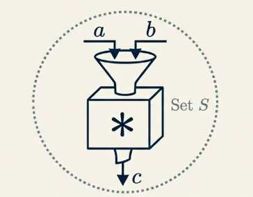
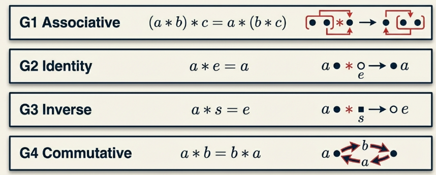
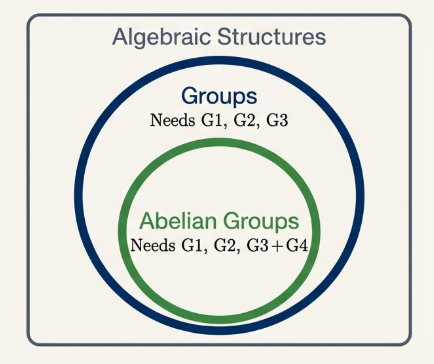
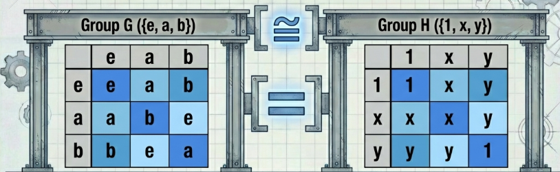

## Binary Operations

On this chapter we generalize our inquiry to the underlying methods of association—the rules by which two elements of a set are combined to produce a third. This abstraction allows us to identify universal structural patterns that transcend specific numerical systems, focusing instead on the operations that govern mathematical behavior.

The fundamental constituent of this study is the **binary operation**.

> [!NOTE] **Binary Operation**
>
> A **binary operation** ($\ast$) on a non-empty set $S$ is defined as a function mapping the Cartesian product $S \times S$ into $S$. We express this mapping as:
>
> $$\ast : S \times S \to S$$
>
> For any ordered pair $(a, b) \in S \times S$, the image is denoted $a \ast b$.

A binary operation must satisfy **closure** to be valid, that is the operation must map every possible pair of elements in $S$ to a unique, well-defined element that remains within $S$.

For example: addition on $\mathbb{Z}$ is a valid binary operation, as the sum of any two integers is invariably an integer.

### Algebraic Properties

We define four core properties that serve as the axiomatic foundation:

1. **G1 (Associative Law)**: The operation is invariant under alternative association.

$$
\forall a, b, c \in S, a \ast (b \ast c) = (a \ast b) \ast c
$$

2. **G2 (Existence of Identity)**: There exists an element $e \in S$ (the **identity**) such that

$$
a \ast e = e \ast a = a \forall a \in S
$$

3. **G3 (Existence of Inverses)**:

$$
\forall a \in S, \exists s \in S \text{ such that } a \ast s = s \ast a = e
$$

4. **G4 (Commutative Property)**:

$$
\forall a, b \in S, a \ast b = b \ast a.
$$

The following table analyzes how different structures satisfy or fail these properties:

| Structure                           | G1  | G2          | G3             | G4  | Note                                                                        |
| ----------------------------------- | --- | ----------- | -------------- | --- | --------------------------------------------------------------------------- | -------------------------------------- |
| $(\mathbb{Z}, +)$                   | Yes | Yes ($0$)   | Yes ($-n$)     | Yes | A classic abelian structure.                                                |
| $(\mathbb{Z}, \cdot)$               | Yes | Yes ($1$)   | No             | Yes | Lacks multiplicative inverses for elements $\neq 1, -1$.                    |
| $(\mathbb{M}_2(\mathbb{R}), +)$     | Yes | Yes         | $(\mathbf{0})$ | Yes | Yes                                                                         | Standard $2 \times 2$ matrix addition. |
| $(\mathbb{M}_2(\mathbb{R}), \cdot)$ | Yes | Yes ($I$)   | No             | No  | Fails G3 as singular matrices (determinant zero) lack inverses.             |
| $(\mathbb{Z}_n, \cdot)$             | Yes | Yes ([$1$]) | No             | Yes | [$0$] lacks an inverse; composite $n$ may fail closure in $\mathbb{Z}_n^*$. |

The failure of a specific property often dictates the necessary restriction of a set to maintain algebraic utility. For instance, (\mathbb{R}, \cdot) fails G3 because the element zero possesses no multiplicative inverse. To satisfy G3, we must restrict the set to the non-zero real numbers, denoted \mathbb{R}^\*.

## Groups

> [!NOTE] **Group**
>
> A **Group** is an algebraic structure $(G, \ast)$ satisfying properties G1, G2, and G3.

The Group structure is a necessity for the solution of linear equations of the form $a \ast x = b$. To ensure a unique solution $x$ exists within the set, the structure must provide the following mechanics:

1. **G1 (Associativity)**: Permits the regrouping of the expression:

$$
(s \ast a) \ast x = s \ast b
$$

2. **G3 (Inverse)**: Provides the "tool" $s$ (the inverse of $a$) to operate on both sides of the equation:

$$
s \ast (a \ast x) = s \ast b
$$

3. **G2 (Identity)**: Since $s \ast a = e$, the equation simplifies to $e \ast x = s \ast b$, and the identity ensures the result is $x = s \ast b$.

> [!TIP] **Types of Groups**
>
> - **Abelian Group**: A group that also satisfies G4, honoring the contributions of Niels Henrik Abel.
> - **Nonabelian Group**: A group that fails the commutative property G4.
> - **Order**: The cardinality of the group, denoted |G|. Groups may be Finite (e.g., \mathbb{Z}\_n) or Infinite (e.g., \mathbb{Z}).

> [!TIP] **Theorem 13.5**
>
> The set of non-zero residue classes $\mathbb{Z}_n^*$ is a group under multiplication if and only if $n$ is prime.

> **Proof**
>
> If $n$ is composite, there exist integers $a, b$ where $2 \le a, b \le n-1$ such that $ab = n$. In the context of $\mathbb{Z}_n^*$, this implies $[a][b] = [n] = [0]$. Since $[0] \notin \mathbb{Z}_n^*$, the operation fails closure, disqualifying it as a group.
>
> If $p$ is prime, closure is guaranteed because $p | ab$ implies $p | a$ or $p | b$ by primality, meaning the product of two non-zero residues remains non-zero.
>
> Regarding G3, for any $[r] \in \mathbb{Z}_p^*$, $\gcd(r, p) = 1$. According to the [Linear Combination Theorem](/math/mptam/04_more_direct_contrapositive_proof/#proofs-involving-divisibility-of-integers), there exist integers $x, y$ such that $rx + py = 1$. In residue notation, this becomes
>
> $$[r][x] + [p][y] = [1]$$
>
> Since $[p] = [0]$, we have $[r][x] = [1]$, proving that $[x]$ is the multiplicative inverse of $[r]$.

## Permutation Groups

> [!NOTE] **Permutation**
>
> A permutation of a set $A$ is defined as a bijective function
>
> $$f: A \to A$$

Under the operation of function composition ($\circ$), the set $S_A$ of all permutations forms a group, designated the **Symmetric Group**.

## Fundamental Properties of Groups

> [!NOTE] **The Cancellation Laws**
>
> In any group $(G, *)$, the following properties hold for all $a, b, c \in G$:
>
> - **Left Cancellation Law**: If $a * b = a * c$, then $b = c$.
> - **Right Cancellation Law**: If $b * a = c * a$, then $b = c$.

> **Proof of the Left Cancellation Law**:
>
> Assume $a * b = a * c$. By axiom G3, there exists an inverse $s$ for the element a such that
>
> $$s * a = e$$
>
> where $e$ is the identity. Multiplying both sides by $s$ on the left, we obtain
>
> $$s * (a * b) = s * (a * c)$$
>
> By the associative property (G1), this yields
>
> $$(s * a) * b = (s * a) * c$$
>
> Substituting the identity, we have $e * b = e * c$, which simplifies to $b = c$.

> [!TIP] **Unique Solutions to Linear Equations**
>
> For any $a, b \in G$, the linear equations $a * x = b$ and $x * a = b$ have unique solutions in $G$.

> **Proof**
>
> Let $e$ be the identity and $a^{-1}$ be the inverse of $a$.
>
> Define $x = a^{-1} * b$. Substitution shows
>
> $$a * (a^{-1} * b) = (a * a^{-1}) * b = e * b = b$$
>
> confirming $x = a^{-1} * b$ is a solution.
>
> To establish uniqueness, suppose $x_1$ and $x_2$ are both solutions. Then $a * x_1 = b$ and $a * x_2 = b$, so $a * x_1 = a * x_2$.
>
> By the Left Cancellation Law, $x_1 = x_2$.

**The "Latin Square" Property**, the unique solvability of these equations ensures that in a group table, every element $b$ must appear exactly once in the row corresponding to a and exactly once in every column. This "Latin Square" arrangement is mathematically significant because it prevents "information loss" during the group operation; every element remains distinct and reachable, ensuring the operation is a perfect rearrangement of the group's domain.

> [!NOTE] **Uniqueness of Identity and Inverses**
>
> In any group $G$:
>
> - The identity element is unique.
> - Each element $g \in G$ has a unique inverse.

> **Proof of the uniqueness of the identity**
>
> Assume $e$ and $f$ are both identities. Since $e$ is an identity, $ef = f$.
>
> Since $f$ is an identity, $ef = e$. Therefore, $e = ef = f$.

> **Proof of the uniqueness and existence of the inverse**
>
> Let $g \in G$ and suppose $s$ and $t$ are both inverses of $g$. Thus,
>
> $$gs = sg = e$$
>
> $$gt = tg = e$$
>
> It follows that
>
> $$s = se = s(gt) = (sg)t = et = t$$

In professional mathematics, we typically adopt multiplicative notation, writing $ab$ for $a * b$ and $a^{-1}$ for the inverse. In abelian groups using additive notation, we use $0$ and $-a$.

## Subgroups

> [!NOTE] **Subgroups**
>
> If $(G, *)$ is a group and $H \subseteq G$, $H$ is a subgroup if it satisfies the group axioms under the same operation.

Typical examples include $(\mathbb{Z}, +)$ as a subgroup of $(\mathbb{Q}, +)$ and $(2\mathbb{Z}, +)$ within $(\mathbb{Z}, +)$.

> [!NOTE] **The Subgroup Test**
>
> A nonempty subset $H$ of $G$ is a subgroup if and only if:
>
> - $ab \in H$ for all $a, b \in H$ (_Closure under multiplication_).
> - $a^{-1} \in H$ for all $a \in H$ (_Closure under inversion_).

> **Proof**
>
> If $H$ is a subgroup, these properties are required by definition of a group.
>
> Conversely, if $H$ satisfies these, it inherits G1 (Associativity) from $G$ because all elements of $H$ are also elements of $G$.
>
> Since $H$ is nonempty, $\exists a \in H$. By the closure under inversion, $a^{-1} \in H$, and by the closure under multiplication, $aa^{-1} = e \in H$. Thus $H$ contains the identity and all inverses, satisfying all axioms.

> [!NOTE] **Subgroup-Based Equivalenc**e
>
> For a subgroup $H$ of $G$, the relation $aRb$ defined by $a = bh$ for $h \in H$ is an equivalence relation.
>
> - **Reflexive**: $a = ae$, thus $aRa$.
> - **Symmetric**: If $a = bh$, then $b = ah^{-1}$. Since $h^{-1} \in H, bRa$.
> - **Transitive**: If $a = bh_1$ and $b = ch_2$, then $a = (ch_2)h_1 = c(h_2h_1)$. Since $h_2h_1 \in H, aRc$.

### Left Cosets and Cardinality

The equivalence classes are **Left Cosets**,

$$
gH = \{gh : h \in H\}
$$

## Isomorphic Groups

> [!NOTE] **Isomorphism**
>
> An isomorphism is a bijective, operation-preserving function
>
> $$\phi: G \to H$$
>
> such that
>
> $$\phi(a * b) = \phi(a) \circ \phi(b)$$

> [!TIP] **Theorem 13.18: Properties of Isomorphisms**
>
> Let $\phi: G \to H$ be an isomorphism, with identities $e \in G$ and $f \in H$.
>
> 1. $\phi(e) = f$: .
> 2. $\phi(g^{-1}) = (\phi(g))^{-1}$:

> **Proof of (1)**
>
> Let $h \in H$. Since $\phi$ is onto,
>
> $$\exists g \in G \text{ such that } \phi(g) = h$$
>
> Then
>
> $$f \circ h = h = \phi(g) = \phi(e * g) = \phi(e) \circ \phi(g) = \phi(e) \circ h. By Right Cancellation in H, f = \phi(e)$$

> **Proof of (2)**
>
> Since $g * g^{-1} = e$, then
>
> $$\phi(g * g^{-1}) = \phi(e) = f$$
>
> Because $\phi$ is operation-preserving,
>
> $$\phi(g) \circ \phi(g^{-1}) = f$$
>
> This confirms $\phi(g^{-1})$ is the unique inverse of $\phi(g)$.
