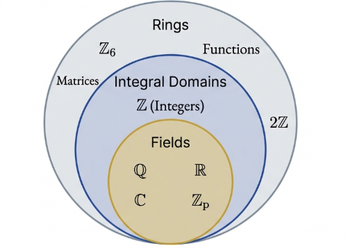

## Rings

> [!TIP] **Abelian Group Properties (Under Addition)**
>
> - **Commutative Law of Addition**: $a + b = b + a$.
> - **Associative Law of Addition**: $(a + b) + c = a + (b + c)$.
> - **Existence of Additive Identity**: The integer $0$ satisfies $a + 0 = a$.
> - **Existence of Additive Inverse**: For every integer $a$, there exists $-a$ such that $a + (-a) = 0$.

> [!TIP] **Multiplicative and Connecting Properties**
>
> - **Associative Law of Multiplication**: $a(bc) = (ab)c$.
> - **Distributive Law**: $a(b + c) = ab + ac$.

Evaluating these roles, we observe that properties (1) through (4) establish the integers as an Abelian group under addition. Property (5) extends this structure into the realm of multiplication. Crucially, property (6), the Distributive Law, serves as the "logical glue" of the system. Without it, addition and multiplication would remain two disparate operations, providing the essential framework required to define a **Ring**.

> [!NOTE] **Ring**
>
> A **Ring** is an algebraic structure consisting of a nonempty set $R$ equipped with two binary operations, typically denoted as **addition** ($+$) and **multiplication** ($\cdot$). To be formally classified as a ring $(R, +, \cdot)$, the set must satisfy the following six axioms:
>
> - **R1**: Commutative Law of Addition:
>
>   $$\forall a, b \in R, a + b = b + a$$
>
> - **R2**: Associative Law of Addition:
>
>   $$\forall a, b, c \in R, (a + b) + c = a + (b + c) $$
>
> - **R3**: Existence of Additive Identity:
>
>   There exists an element $0 \in R$ such that $a + 0 = a$ for all $a \in R$.
>
> - **R4**: Existence of Additive Inverse:
>
>   For each $a \in R$, there exists an element $-a \in R$ such that $a + (-a) = 0$.
>
> - **R5**: Associative Law of Multiplication:
>
>   $$\forall a, b, c \in R, a(bc) = (ab)c$$
>
> - **R6**: Distributive Laws:
>
>   $a(b + c) = ab + ac$ and $(a + b)c = ac + bc$ for all $a, b, c \in R$.

In this abstract context, the symbols $0$ and $-a$ must be viewed as algebraic roles rather than literal integers. The "additive identity" ($0$) is the unique neutral element under addition, and its existence in axiom **R3** guarantees that every ring is a non-empty set.

Similarly, the "additive inverse" ($-a$) is simply the element that satisfies the identity requirement, regardless of its form.

Rings may manifest as familiar number sets, arrays of data, or mappings between spaces, provided their operations are closed and meet the prescribed criteria.

> **The Ring of Even Integers ($2\mathbb{Z}$)**
>
> The set of even integers
>
> $$2\mathbb{Z} = \{2k : k \in \mathbb{Z}\}$$
>
> is closed under addition and multiplication, as the sum and product of any two even integers are always even.

This illustrates that a subset of a ring can function as a ring itself, even if it lacks certain features of the parent ring (such as a multiplicative identity).

> **Matrix and Function Rings ($M_n(\mathbb{R})$ and $F_{\mathbb{R}}$)**
>
> $M_n(\mathbb{R})$ is the set of $n \times n$ matrices (for $n \ge 2$) under matrix addition and multiplication. The additive identity is the zero matrix $Z$, and the additive inverse of $A$ is $-A$.
>
> This confirms that ring elements need not be "numbers" and that multiplication in a ring is not required to be commutative.
>
> $F_{\mathbb{R}}$ is the set of all real-valued functions $f: \mathbb{R} \to \mathbb{R}$. Addition and multiplication are defined pointwise. The additive identity is the zero function $f_0(x) = 0$.
>
> This establishes that rings can consist of mappings, expanding the theory into functional analysis.

## Elementary Properties of Rings

While the core axioms (R1–R6) define a ring, we classify higher-order structures by testing for additional properties: R7 (Commutativity of Multiplication) and R8 (Existence of Unity).

> [!TIP] **Additional Ring Properties**
>
> - **Commutative Ring (R7)**: A ring where $ab = ba$ for all $a, b \in R$.
> - **Ring with Unity (R8)**: A ring containing an element $1$ such that $a \cdot 1 = 1 \cdot a = a$ for all $a \in R$.

Certain properties are not merely observed but are derived from the ring axioms.

> [!TIP] **Uniqueness of Additive Identity and Inverses**
>
> The additive identity of a ring $(R, + , \cdot)$ is unique. The inverse of every $a \in R$ is unique.

> **Proof**
>
> **The additive identity is unique**
>
> Suppose $0$ and $0'$ are both additive identities for $R$. Since $0$ is an identity, $0' + 0 = 0'$. Since $0'$ is an identity, $0 + 0' = 0$.
>
> By commutativity (R1), $0' + 0 = 0 + 0'$, implying $0' = 0$.
>
> **The inverse of any ring element is unique**
>
> Suppose $x$ has additive inverses $-x$ and $x'$. Then
>
> $$x + (-x) = 0$$
>
> and
>
> $$x + x' = 0$$
>
> Thus:
>
> $$-x = -x + 0 = -x + (x + x') = (-x + x) + x' = 0 + x' = x'$$

> [!TIP] **Uniqueness of Unity**
>
> The unity of any ring is unique.

> **Proof**
>
> Suppose $1$ and $1'$ are both unities in $R$.
>
> Since $1$ is unity,
>
> $$1 \cdot 1' = 1'$$
>
> Since $1'$ is unity,
>
> $$1 \cdot 1' = 1$$
>
> Thus, 1 = 1'.

> [!TIP] **Cancellation Law of Addition**
>
> Given a ring $(R, +, \cdot)$, then $\forall a, b, c \in R$:
>
> $$a + b = a + c \Leftrightarrow b = c$$

> **Proof**
>
> If $a + b = a + c$, add the unique additive inverse $-a$ to both sides:
>
> $$(-a) + (a + b) = (-a) + (a + c)$$
>
> By R2,
>
> $$((-a) + a) + b = ((-a) + a) + c$$
>
> which simplifies to
>
> $$0 + b = 0 + c$$
>
> and thus $b = c$.

> [!TIP] **The Multiplicative Property of Zero**
>
> Given a ring $(R, + , \cdot)$, then $\forall a \in R$:
>
> $$a \cdot 0 = 0$$

> **Proof**
>
> For $a \in R$, observe
>
> $$a \cdot 0 + 0 = a \cdot 0 = a \cdot (0 + 0) = a \cdot 0 + a \cdot 0$$
>
> By The Cancellation Law, we cancel $a \cdot 0$ from both sides, yielding $0 = a \cdot 0$.

> [!TIP] **Relationship Between Inverses and Multiplication**
>
> Given a ring $(R, +, \cdot)$, then $\forall a, b \in R$:
>
> $$(-a)b = -(ab)$$

> **Proof**
>
> We must show that $(-a)b$ is the additive inverse of $ab$.
>
> We verify this by showing their sum is the additive identity:
>
> $$ab + (-a)b = (a + (-a))b$$
>
> by R6. This simplifies to $0 \cdot b$, which is 0 by The Multiplicative Property of Zero. Thus,
>
> $$(-a)b = -(ab)$$

These elementary properties establish a consistent "arithmetic" within any ring, mirroring the structural behavior of integers.

## Subrings

Identifying subrings—subsets of a ring that are rings in their own right—is a powerful tool because subrings inherit the "inherited" properties (associativity, commutativity, distributivity) of the parent ring.

> [!NOTE] **The Subring Test**
>
> A nonempty subset $S$ of a ring $R$ is a subring of $R$ if and only if $S$ is closed under subtraction ($a - b \in S$) and closed under multiplication ($ab \in S$).

> **Proof**
>
> Suppose $S$ is a nonempty subset of $R$ closed under subtraction and multiplication.
>
> **Identity**:
>
> Since $S$ is nonempty, there exists $s \in S$. Closure under subtraction implies
>
> $$s - s = 0 \in S$$
>
> **Inverses**
>
> For any $a \in S$, the closure under subtraction implies
>
> $$0 - a = -a \in S$$
>
> **Addition**
>
> For $a, b \in S$, we have $-b \in S$, so
>
> $$a - (-b) = a + b \in S$$
>
> $S$ is closed under addition.
>
> **Inheritance**
>
> Since $S \subseteq R$, the operations in $S$ are the same as in $R$.
>
> Therefore, property R1 (commutativity of addition), R2 (associativity of addition), R5 (associativity of multiplication), and R6 (distributive laws) are automatically satisfied in $S$.
>
> Since $S$ contains the additive identity and inverses and is closed under both operations, $S$ is a ring.

**Gaussian Integers** ($G$)

The set

$$\{a + bi : a, b \in \mathbb{Z}\}$$

is a subring of $\mathbb{C}$. The difference and product of any two Gaussian integers yield another Gaussian integer, satisfying the test.

**Intersection of Subrings**

If $S_1$ and $S_2$ are subrings, $S_1 \cap S_2$ is a subring because the zero element exists in both, and closure under subtraction and multiplication is maintained within the intersection.

## Integral Domains

The transition from general rings to integral domains marks a shift toward reclaiming the "Cancellation Law", that elegant property of integers where common factors can be eliminated from equations. In many abstract rings, this property is absent due to the existence of "zero divisors," which we must catalog and understand to appreciate the stability of more restricted domains.

> [!NOTE] **Zero Divisor**
>
> A nonzero element $a$ in a ring $R$ is a zero divisor if there exists a nonzero element $b \in R$ such that
>
> $$ab = 0 or ba = 0$$

While our intuition from \mathbb{Z} and \mathbb{R} suggests that a product can only be zero if at least one factor is zero, abstract ring theory presents us with various "pathological" counter-examples.

Consider $\mathbb{Z}_6$, in this system, the interaction of composite factors yields

$$[2] \cdot [3] = [6] = [0] and [4] \cdot [3] = [12] = [0]$$

Thus, $[2], [3]$, and $[4]$ are identified as zero divisors.

On the ring $F_{\mathbb{R}}$ consider $f(x) = 1$ for $x \in \mathbb{Q}$ and $0$ for $x \notin \mathbb{Q}$, and $g(x) = 0$ for $x \in \mathbb{Q}$ and $1$ for $x \notin \mathbb{Q}$.

Though neither function is the zero function, their product $(f \cdot g)(x) = 0$ for all $x$, rendering them zero divisors.

> [!TIP] **The Unity/Zero Distinction**
>
> In a nontrivial ring, the multiplicative identity cannot be the same as the additive identity.

> **Proof by Contradiction**
>
> Suppose $1 = 0$. For any nonzero element a \in R,
>
> $$a = a \cdot 1 = a \cdot 0 = 0$$
>
> This forces $a = 0$ for all elements, contradicting the definition of a nontrivial ring.

> [!NOTE] **Integral Domain**
>
> An **Integral Domain** is a nontrivial commutative ring with unity that contains no zero divisors.

Familiar systems such as $\mathbb{Z}$, $\mathbb{Q}$, $\mathbb{R}$, and $\mathbb{C}$ meet this standard. However, $2\mathbb{Z}$ fails this classification; despite being commutative and devoid of zero divisors, it lacks the requisite "unity" (the element $1$).

The utility of a ring for solving equations is dictated by the Cancellation Law of Multiplication.

> [!TIP] **The Equivalence Proof**
>
> The Cancellation Laws hold in a ring $R$ if and only if $R$ contains no zero divisors.

> **Proof**
>
> Assume $R$ has no zero divisors and let $ab = ac$ with $a \neq 0$. Then $ab - ac = 0$, implying $a(b - c) = 0$.
>
> Since $a \neq 0$ and zero divisors are absent, $b - c$ must be $0$, which yields $b = c$.
>
> Assume the Cancellation Laws hold. Let $ab = 0$. If $a \neq 0$, we observe $ab = a \cdot 0$. By canceling $a$, we find $b = 0$. Thus, $R$ possesses no zero divisors.

> [!TIP] **The Commutative Link**
>
> For a nontrivial commutative ring with unity, the ring is an integral domain if and only if the Cancellation Law of Multiplication holds.

## Fields

> [!TIP] **The Unit**
>
> A unit is any element $a$ on a ring $R$ that possesses a multiplicative inverse $b$ such that $ab = ba = 1$.

> [!NOTE] **Field**
>
> A nontrivial commutative ring, with unity in which every nonzero element is a unit is called a **field**.

> [!TIP] **Uniqueness of Inverses**
>
> In a nontrivial ring with unity, each unit has a unique multiplicative inverse.

> **Proof**
>
> Let $b$ and $c$ be inverses of $a$. Then
>
> $$b = b \cdot 1 = b(ac) = (ba)c = 1 \cdot c = c$$
>
> This uniqueness is a direct consequence of the associative law.

**Case Study: The Field of Complex Numbers ($\mathbb{C}$)**

To prove $\mathbb{C}$ is a field, we must derive an inverse for any $x = a + bi \neq 0$.

We seek $y = c + di$ such that $(a+bi)(c+di) = 1 + 0i$. Expanding this product yields the system:

1. $ac - bd = 1$
2. $ad + bc = 0$

To isolate $c$, multiply (1) by a and (2) by $b$:

$$
a^2c - abd = a abd + b^2c = 0
$$

Summing these gives $(a^2 + b^2)c = a$, hence $c = \frac{a}{a^2 + b^2}$.

To isolate $d$, multiply (1) by $-b$ and (2) by $a$:

$$
-abc + b^2d = -b a^2d + abc = 0
$$

Summing these gives $(a^2 + b^2)d = -b$, hence $d = \frac{-b}{a^2 + b^2}$.

Since $a+bi \neq 0$ implies $a^2+b^2 \neq 0$, the inverse

$$
x^{-1} = \frac{a}{a^2 + b^2} + \frac{-b}{a^2 + b^2}i
$$

always exists.

### The Hierarchical Relationship

> [!TIP] **Field to Domain Implication**
>
> Every field is an integral domain.

> **Proof**
>
> Let $F$ be a field. If $ab = 0$ and $a \neq 0$, we multiply by
>
> $$a^{-1}: a^{-1}(ab) = a^{-1} \cdot 0 \implies (a^{-1}a)b = 0 \implies 1b = 0 \implies b = 0$$
>
> Since $b$ must be zero, $F$ contains no zero divisors.

> [!TIP] **The Finite Constraint**
>
> Every finite integral domain is a field.

Summary Table

| Ring                       | Commutative | Unity | No Zero Divisors | Integral Domain | Field |
| -------------------------- | ----------- | ----- | ---------------- | --------------- | ----- |
| $\mathbb{Z}$               | Yes         | Yes   | Yes              | Yes             | No    |
| $\mathbb{Q}$               | Yes         | Yes   | Yes              | Yes             | Yes   |
| $\mathbb{Z}_n$ (composite) | Yes         | Yes   | No               | No              | No    |
| $\mathbb{Z}_p$ (prime)     | Yes         | Yes   | Yes              | Yes             | Yes   |
| $2\mathbb{Z}$              | Yes         | No    | Yes              | No              | No    |

