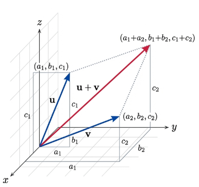
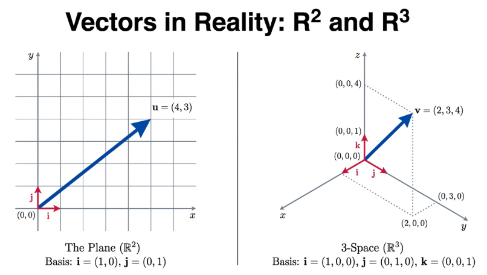
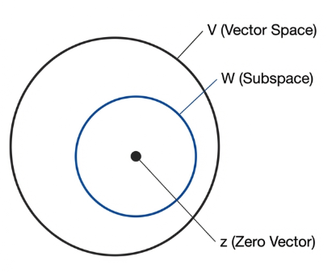
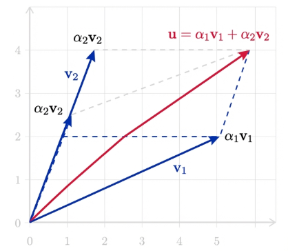
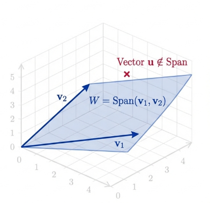
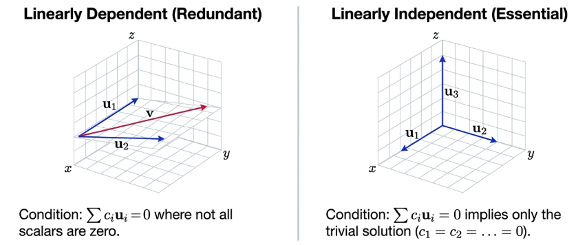
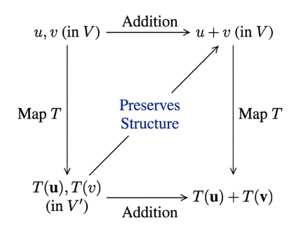
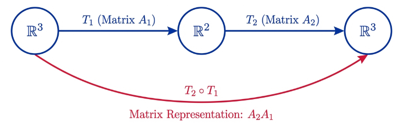

## Properties of Vectors in $3$-space

The study of Linear Algebra originates from the geometric intuition of Euclidean spaces, primarily the plane ($\mathbb{R}^2$) and 3-space ($\mathbb{R}^3$). Historically, we represent a vector as a directed line segment from the origin to a terminal point. By abstracting the properties of $\mathbb{R}^n$, we develop a framework capable of characterizing diverse objects such as functions and matrices.

In the concrete case of $\mathbb{R}^3$, let $\mathbf{u} = (a_1, b_1, c_1)$ and $\mathbf{v} = (a_2, b_2, c_2)$, where $a_i, b_i, c_i \in \mathbb{R}$. We define the fundamental operations as follows:

- **Vector Addition**:

$$
\mathbf{u} + \mathbf{v} = (a_1 + a_2, b_1 + b_2, c_1 + c_2)
$$

- **Scalar Multiplication**:

$$
\alpha \mathbf{u} = (\alpha a_1, \alpha b_1, \alpha c_1)
$$

for any scalar $\alpha \in \mathbb{R}$.

To illustrate the coordinate structure, we recreate the data from the foundational representations of vectors:

| Space          | Dimension | Exemplar Vectors         | Basis Vectors                                                |
| -------------- | --------- | ------------------------ | ------------------------------------------------------------ |
| $\mathbb{R}^2$ | 2-Space   | $\mathbf{u} = (4, 3)$    | $\mathbf{i}=(1,0), \mathbf{j}=(0,1)$                         |
| $\mathbb{R}^3$ | 3-Space   | $\mathbf{v} = (2, 3, 4)$ | $\mathbf{i}=(1,0,0), \mathbf{j}=(0,1,0), \mathbf{k}=(0,0,1)$ |

Vectors in $\mathbb{R}^3$ must satisfy eight fundamental properties.

**1. Commutative**:

$$
\mathbf{u} + \mathbf{v} = (a_1+b_1, a_2+b_2, a_3+b_3) = (b_1+a_1, b_2+a_2, b_3+a_3) = \mathbf{v} + \mathbf{u}
$$

relying on the commutativity of real numbers.

**2. Associative**:

$$
(\mathbf{u} + \mathbf{v}) + \mathbf{w} = \mathbf{u} + (\mathbf{v} + \mathbf{w})
$$

**3. Zero Vector**: There exists $\mathbf{z} = (0, 0, 0)$ such that

$$
\mathbf{u} + \mathbf{z} = \mathbf{u}
$$

**4. Additive Inverse**: For $\mathbf{v} = (b_1, b_2, b_3)$, there exists $-\mathbf{v} = (-b_1, -b_2, -b_3)$ such that

$$
\mathbf{v} + (-\mathbf{v}) = (b_1+(-b_1), b_2+(-b_2), b_3+(-b_3)) = (0, 0, 0) = \mathbf{z}
$$

**5. Distributive (Scalar over Vector)**:

$$
\alpha(\mathbf{u} + \mathbf{v}) = \alpha\mathbf{u} + \alpha\mathbf{v}
$$

**6. Distributive (Scalar Sum)**:

$$
(\alpha + \beta)\mathbf{u} = \alpha\mathbf{u} + \beta\mathbf{u}
$$

**7. Scalar Associative**:

$$
(\alpha\beta)\mathbf{u} = \alpha(\beta\mathbf{u})
$$

**8. Scalar Identity**:

$$
1\mathbf{u} = \mathbf{u}
$$

The transition from viewing vectors as "directed line segments" to "linear combinations of $\mathbf{i, j, k}$" is a shift toward computational abstraction. By expressing $\mathbf{u}$ as $a_1\mathbf{i} + b_1\mathbf{j} + c_1\mathbf{k}$, we move from a spatial domain to an algebraic one.

## Vector Spaces

> [!NOTE] **Vector Space**
>
> A nonempty set $V$ is a vector space over $\mathbb{R}$ if, for all $\mathbf{u, v, w} \in V$ and all $\alpha, \beta \in \mathbb{R}$, the following eight axioms hold:
>
> 1. $\mathbf{u} + \mathbf{v} = \mathbf{v} + \mathbf{u}$
> 2. $(\mathbf{u} + \mathbf{v}) + \mathbf{w} = \mathbf{u} + (\mathbf{v} + \mathbf{w})$
> 3. $\exists \mathbf{z} \in V such that \mathbf{v} + \mathbf{z} = \mathbf{v}$
> 4. $\forall \mathbf{v} \in V, \exists -\mathbf{v} \in V such that \mathbf{v} + (-\mathbf{v}) = \mathbf{z}$
> 5. $\alpha(\mathbf{u} + \mathbf{v}) = \alpha\mathbf{u} + \alpha\mathbf{v}$
> 6. $(\alpha + \beta)\mathbf{v} = \alpha\mathbf{v} + \beta\mathbf{v}$
> 7. $(\alpha\beta)\mathbf{v} = \alpha(\beta\mathbf{v})$
> 8. $1\mathbf{v} = \mathbf{v}$

This framework accommodates the standard $\mathbb{R}^n$ and abstract spaces like $F_{\mathbb{R}$ (all functions $f: \mathbb{R} \to \mathbb{R}$) and $\mathbb{R}[x]$ (polynomials).

> [!TIP] **Verification of the Function Space $F_R$**
>
> The verification of properties depends on the arithmetic of real numbers. Let $f, g, h \in F_R$ and $\alpha \in \mathbb{R}$:
>
> **Axiom 2 (Associative)**:
>
> $$((f + g) + h)(x) = (f(x) + g(x)) + h(x) = f(x) + (g(x) + h(x)) = (f + (g + h))(x)$$
>
> **Axiom 3 (Zero Vector)**: Define the zero function $f_0(x) = 0$. Then
>
> $$(f + f_0)(x) = f(x) + 0 = f(x)$$
>
> **Axiom 4 (Negative)**: Define $(-f)(x) = -(f(x))$. Then
>
> $$(f + (-f))(x) = f(x) + (-f(x)) = 0 = f_0(x)$$
>
> **Axiom 5 (Distributive)**:
>
> $$(\alpha(f + g))(x) = \alpha(f(x) + g(x)) = \alpha f(x) + \alpha g(x) = (\alpha f + \alpha g)(x)$$

## Matrices

> [!NOTE] **Matrices**
>
> **Matrices** are organized rectangular arrays that provide utility in representing linear systems.

Let $M_{mn}[\mathbb{R}]$ be the set of all $m \times n$ matrices with real entries $a_{ij}$. Two matrices $A = [a_{ij}]$ and $B = [b_{ij}]$ are equal if $a_{ij} = b_{ij}$ for all $i, j$.

Addition is defined as $A + B = [a_{ij} + b_{ij}]$ and scalar multiplication as $\alpha A = [\alpha a_{ij}]$.

> [!TIP] **Verification of $M_2[\mathbb{R}]$**
>
> Let $A = [a_{ij}]$, $B = [b_{ij}]$ be $2 \times 2$ matrices and $Z = [0]$ be the zero matrix:
>
> **Property 1 (Commutative)**:
>
> $$A + B = [a_{ij} + b_{ij}] = [b_{ij} + a_{ij}] = B + A, as a_{ij}, b_{ij} \in \mathbb{R}$$
>
> **Property 3 (Zero Matrix)**:
>
> $$A + Z = [a_{ij} + 0] = [a_{ij}] = A$$
>
> **Property 4 (Negative)**: Let $-A = [-a_{ij}]$. Then
>
> $$A + (-A) = [a_{ij} + (-a_{ij})] = [0] = Z$$
>
> **Property 5 (Distributive)**:
>
> $$\alpha(A + B) = [\alpha(a_{ij} + b_{ij})] = [\alpha a_{ij} + \alpha b_{ij}] = \alpha A + \alpha B$$

Note that the product $AB$ is defined by the inner product of the $i$-th row of $A$ and $j$-th column of $B$:

$$
c_{ij} = \sum_{k=1}^n a_{ik}b_{kj}
$$

It is very important to recognize that while matrix multiplication is a hallmark of matrix algebra, it is a separate operation not required for $M_{mn}[\mathbb{R}]$ to qualify as a vector space. Notably, $AB$ and $BA$ are not generally equal, and $BA$ may not even be defined when $AB$ is, further distinguishing multiplication from the strictly commutative and always-defined addition required of vector spaces.

## Some Properties of Vector Spaces

The integrity of an algebraic system requires the rigorous proof of "obvious" properties to prevent logical contradictions.

> [!TIP] **Unique Zero Vector**
>
> Every vector space has a unique zero vector.

> **Proof**:
>
> Assume $\mathbf{z}$ and $\mathbf{z'}$ are both zero vectors in $V$.
>
> Since $\mathbf{z}$ is a zero vector,
>
> $$\mathbf{z'} + \mathbf{z} = \mathbf{z'}$$
>
> Since $\mathbf{z'}$ is a zero vector,
>
> $$\mathbf{z} + \mathbf{z'} = \mathbf{z}$$
>
> By commutativity,
>
> $$\mathbf{z} = \mathbf{z} + \mathbf{z'} = \mathbf{z'} + \mathbf{z} = \mathbf{z'}$$
>
> Thus, $\mathbf{z} = \mathbf{z'}$.

> [!TIP] **Unique Negative**
>
> Every vector $\mathbf{v}$ in $V$ has a unique negative.

> **Proof**:
>
> Assume $\mathbf{v}_1$ and $\mathbf{v}_2$ are both negatives of $\mathbf{v}$. Then
>
> $$\mathbf{v} + \mathbf{v}_1 = \mathbf{z}$$
>
> and
>
> $$\mathbf{v} + \mathbf{v}_2 = \mathbf{z}$$
>
> By Axiom 3 and substitution,
>
> $$\mathbf{v}_1 = \mathbf{v}_1 + \mathbf{z} = \mathbf{v}_1 + (\mathbf{v} + \mathbf{v}_2)$$
>
> By Axiom 2,
>
> $$\mathbf{v}_1 + (\mathbf{v} + \mathbf{v}_2) = (\mathbf{v}_1 + \mathbf{v}) + \mathbf{v}_2 = \mathbf{z} + \mathbf{v}_2 = \mathbf{v}_2$$
>
> Thus $\mathbf{v}_1 = \mathbf{v}_2$.

> [!TIP] **Theorem 15.3**
>
> If $\mathbf{v} + \mathbf{v} = \mathbf{v}$, then $\mathbf{v} = \mathbf{z}$.

> **Proof**:
>
> Since $\mathbf{v} + (-\mathbf{v}) = \mathbf{z}$, we have
>
> $$\mathbf{z} = \mathbf{v} + (-\mathbf{v}) = (\mathbf{v} + \mathbf{v}) + (-\mathbf{v}) = \mathbf{v} + (\mathbf{v} + (-\mathbf{v})) = \mathbf{v} + \mathbf{z} = \mathbf{v}$$

> [!TIP] **Corollary 15.4**
>
> (i) $$0\mathbf{v} = \mathbf{z}$$ and
>
> (ii) $\alpha\mathbf{z} = \mathbf{z}$.

> **Proof**:
>
> (i)
>
> $$0\mathbf{v} = (0+0)\mathbf{v} = 0\mathbf{v} + 0\mathbf{v}$$
>
> By Theorem 15.3,
>
> $$0\mathbf{v} = \mathbf{z}$$
>
> (ii)
>
> $$\alpha\mathbf{z} = \alpha(\mathbf{z} + \mathbf{z}) = \alpha\mathbf{z} + \alpha\mathbf{z}$$
>
> By Theorem 15.3, $\alpha\mathbf{z} = \mathbf{z}$.

> [!TIP] **Theorem 15.5**
>
> If $\alpha\mathbf{v} = \mathbf{z}$, then $\alpha = 0$ or $\mathbf{v} = \mathbf{z}$.

> **Proof**:
>
> If $\alpha = 0$, the statement holds.
>
> If $\alpha \neq 0$, then there exists $1/\alpha \in \mathbb{R}$. Multiplying gives
>
> $$(1/\alpha)(\alpha\mathbf{v}) = (1/\alpha)\mathbf{z}$$
>
> Using Axioms 7, 8, and Corollary 15.4(ii), we find
>
> $$1\mathbf{v} = \mathbf{z}$$
>
> so $\mathbf{v} = \mathbf{z}$

## Subspaces

> [!NOTE] **Subspace**
>
> A subspace is a subset $W$ of a vector space $V$ that is itself a vector space under the same operations.

> [!NOTE] **The Subspace Test**
>
> A nonempty subset $W$ of a vector space $V$ is a subspace of $V$ iff $W$ is closed under addition and scalar multiplication.

> **Proof**
>
> If $W$ is a subspace, it must be closed under both.
>
> Conversely, if $W$ is nonempty and closed, it inherits Axioms 1, 2, and 5-8 from $V$. Nonemptiness implies
>
> $$\exists \mathbf{v} \in W$$
>
> Closure under scaling implies
>
> $$0\mathbf{v} = \mathbf{z} \in W$$
>
> that is, Axiom 3, and
>
> $$(-1)\mathbf{v} = -\mathbf{v} \in W$$
>
> that is, Axiom 4. Thus, $W$ is a vector space.

## Spans of Vectors

A **span** describes the total "reach" of a set of vectors through the operations of addition and scaling. It is the formal method by which we define a subspace $W$ within a larger vector space $V$.

> [!NOTE] **Linear Combination and Span**
>
> Given a set of vectors $S = \{v_1, v_2, \dots, v_n\}$ in $V$, a **linear combination** is any vector of the form $\alpha_1v_1 + \alpha_2v_2 + \dots + \alpha_nv_n$, where $\alpha_i \in \mathbb{R}$. The set of all such combinations is the **span**, denoted $\langle v_1, v_2, \dots, v_n \rangle$.

To visualize this, consider the subspace $W$ of $2 \times 2$ matrices $M_2(\mathbb{R})$ defined by the condition that the upper-right entry is zero. Any matrix $A \in W$ can be decomposed into a linear combination of three basis-like elements:

$$
A = \begin{bmatrix} a & 0 \\ b & c \end{bmatrix} = a \begin{bmatrix} 1 & 0 \\ 0 & 0 \end{bmatrix} + b \begin{bmatrix} 0 & 0 \\ 1 & 0 \end{bmatrix} + c \begin{bmatrix} 0 & 0 \\ 0 & 1 \end{bmatrix}
$$

Thus,

$$W = \langle \begin{bmatrix} 1 & 0 \\ 0 & 0 \end{bmatrix}, \begin{bmatrix} 0 & 0 \\ 1 & 0 \end{bmatrix}, \begin{bmatrix} 0 & 0 \\ 0 & 1 \end{bmatrix} \rangle$$

> [!TIP] **The Subspace Property of Spans**
>
> The set $W$ of all linear combinations of $\{v_1, \dots, v_n\}$ is a subspace of $V$.

> **Proof**
>
> We verify this using the formal two-step Subspace Test:
>
> **1. Non-emptiness (Zero Vector Inclusion)**:
>
> By setting all scalars $\alpha_i = 0$, we see that
>
> $$\mathbf{z} = 0v_1 + 0v_2 + \dots + 0v_n$$
>
> Thus, $\mathbf{z} \in W$.
>
> 2. **Closure under Addition and Scalar Multiplication**:
>
> Let $\mathbf{u}, \mathbf{w} \in W$ and $\alpha \in \mathbb{R}$. Then
>
> $$\mathbf{u} = \sum_{i=1}^n \alpha_i v_i$$
>
> and
>
> $$\mathbf{w} = \sum_{i=1}^n \beta_i v_i$$
>
> Addition:
>
> $$\mathbf{u} + \mathbf{w} = (\alpha_1 + \beta_1)v_1 + (\alpha_2 + \beta_2)v_2 + \dots + (\alpha_n + \beta_n)v_n$$
>
> Since $\alpha_i + \beta_i \in \mathbb{R}$, $\mathbf{u} + \mathbf{w} \in W$.
>
> Scalar Multiplication:
>
> $$\alpha \mathbf{u} = (\alpha \alpha_1)v_1 + (\alpha \alpha_2)v_2 + \dots + (\alpha \alpha_n)v_n$$
>
> Since $\alpha \alpha_i \in \mathbb{R}$, $\alpha \mathbf{u} \in W$.

Different sets can generate identical subspaces. For example, in the polynomial space $\mathbb{R}[x]$, the sets $S_1 = \{1, 1+x^2, 1+x^2+x^4\}$ and $S_2 = \{1, x^2, x^4\}$ span the same space. This highlights the pedagogical "So What?": we often have a choice in how we describe a space, and we generally seek the most efficient description.

Furthermore, $\langle v_1, \dots, v_n \rangle$ is the smallest (most restrictive) subspace containing those vectors. If any other subspace $W'$ contains $S$, it must also contain $\text{span}(S)$. This ensures that a span contains no elements other than those strictly required by the axioms of a vector space.

While the span describes the "reach" of a set, it does not account for redundancy. To determine the efficiency of our building blocks, we must turn to linear independence.

## Linear Dependence and Independence

> [!NOTE] **Linear Independence**
>
> A set is independent if no vector in it can be built from the others. That is, the vector equation $\sum c_i v_i = \mathbf{z}$ has only the trivial solution: $c_1 = c_2 = \dots = c_m = 0$.

> [!NOTE] **Linear Dependence**
>
> A set of vectors $v_1, \dots, v_m$ is linearly dependent if there exist scalars $c_1, \dots, c_m$, not all zero, such that $\sum c_i v_i = \mathbf{z}$.

The following comparison illustrates how system solutions dictate set classification:

> **Example 15.18**: Independence in $\mathbb{R}^3$
> Let the set: $\\{(1,1,1), (1,1,0), (0,1,1)\\}$
> We build the equation system:
>
> $$a + b = 0$$
>
> $$a + b + c = 0$$
>
> $$a + c = 0$$
>
> Subtracting (1) from (2) yields $c=0$, which implies $a=0$ and $b=0$. Only the trivial solution exists thus the set is **linearly independent**.

Note that **independence is "hereditary"**, removing elements from an independent set cannot create dependence. With these structural relationships established, we can now examine how linear transformations move these structures between spaces.

## Linear Transformations

> [!NOTE] **Linear Transformation**
>
> A **linear transformation** $T: V \to V'$ is a map that respects the algebraic properties of the vector space. They are "structure-preserving" because the relationship between vectors in the domain is mirrored in the codomain.

> [!NOTE] **Linear Function**
>
> A function is linear if and only if it satisfies:
>
> 1. **Preservation of Addition**:
>
> $$T(\mathbf{u} + \mathbf{v}) = T(\mathbf{u}) + T(\mathbf{v})$$
>
> 2. **Preservation of Scalar Multiplication**:
>
> $$T(\alpha \mathbf{v}) = \alpha T(\mathbf{v})$$

In $\mathbb{R}^n$, transformations are often expressed as matrix multiplications

$$
T(\mathbf{v}) = A\mathbf{v}
$$

For example,

$$
T(a, b, c) = (2a+c, 3c-b)
$$

corresponds to a $2 \times 3$ matrix.

$$
T(v) = \begin{bmatrix}
2 & 0 & 1 \\
0 & -1 & 3 \\
\end{bmatrix}
\begin{bmatrix}
a \\
b \\
c
\end{bmatrix}
= \begin{bmatrix}
2a + c \\
3c - b
\end{bmatrix}
$$

> [!TIP] **Composition of Transformations**
>
> The composition of two linear transformations $T_1: V \to V'$ and $T_2: V' \to V''$ is itself linear.

> **Proof**:
>
> 1. **Preservation of Addtition**:
>
> $$(T_2 \circ T_1)(\mathbf{u} + \mathbf{v}) = T_2(T_1(\mathbf{u} + \mathbf{v})) = T_2(T_1(\mathbf{u}) + T_1(\mathbf{v}))$$
>
> $$= T_2(T_1(\mathbf{u})) + T_2(T_1(\mathbf{v})) = (T_2 \circ T_1)(\mathbf{u}) + (T_2 \circ T_1)(\mathbf{v})$$
>
> 2. **Preservation of Scalar Multiplication**:
>
> $$(T_2 \circ T_1)(\alpha \mathbf{u}) = T_2(T_1(\alpha \mathbf{u})) $$
>
> $$= T_2(\alpha T_1(\mathbf{u})) = \alpha T_2(T_1(\mathbf{u})) = \alpha (T_2 \circ T_1)(\mathbf{u})$$

This property is the reason matrix multiplication is defined as it is; the product $A_2A_1$ represents the composition $T_2 \circ T_1$.

### Properties of Linear Transformations

Linearity imposes strict geometric constraints:

1. **A linear map must fix the origin**

$$
T(\mathbf{z}) = \mathbf{z}': T(0\mathbf{z}) = 0T(\mathbf{z}) = \mathbf{z}'
$$

2. **Inverting a vector in the domain results in an inverted image in the codomain**

$$
T(-\mathbf{v}) = -T(\mathbf{v})
$$

### The Kernel and Image

> [!TIP] **The Image**
>
> The Image $T(W)$ of a subspace is a subspace of the codomain.

> [!TIP] **The Kernel**
>
> The Kernel,
>
> $$\text{ker}(T) = \{\mathbf{v} \in V : T(\mathbf{v}) = \mathbf{z}'\}$$
>
> is a subspace of the domain.

> **Proof**
>
> Since $T(\mathbf{z}) = \mathbf{z}', \mathbf{z} \in \text{ker}(T)$
>
> If $\mathbf{u}, \mathbf{v} \in \text{ker}(T)$, then
>
> $$T(\mathbf{u}+\mathbf{v}) = T(\mathbf{u}) + T(\mathbf{v}) = \mathbf{z}' + \mathbf{z}' = \mathbf{z}'$$
>
> Similarly,
>
> $$T(\alpha \mathbf{u}) = \alpha T(\mathbf{u}) = \alpha \mathbf{z}' = \mathbf{z}'$$

> **Example**
>
> Consider $T(a, b, c) = (2a+c, 3c-b)$. To find the kernel, solve $T(a, b, c) = (0, 0)$:
>
> $$2a + c = 0 \implies a = -c/2$$
>
> $$3c - b = 0 \implies b = 3c$$
>
> This yields vectors of the form $(-c/2, 3c, c)$, or $c(-1/2, 3, 1)$. The kernel is thus the subspace $\langle (-1/2, 3, 1) \rangle$. This identifies the specific dimension of the domain that is "lost" or collapsed to zero by the transformation.
