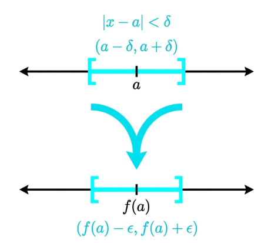
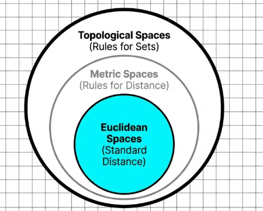
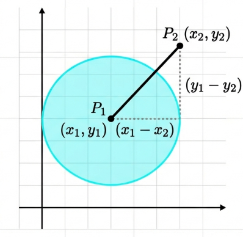
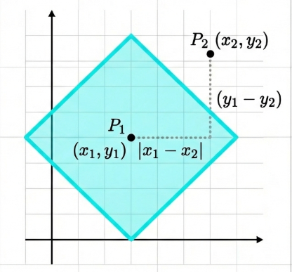
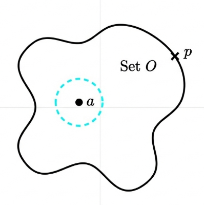

## Metric Spaces

The pedagogical arc of mathematical analysis traditionally commences with the $\epsilon-\delta$ characterization of continuity. In the standard Euclidean setting of $\mathbb{R}$, we assert that a function f is continuous at $a \in \mathbb{R}$ if, for every $\epsilon > 0$, there exists $a \delta > 0$ such that $|x - a| < \delta$ implies $|f(x) - f(a)| < \epsilon$. This formulation relies fundamentally on the distance-based intuition of "closeness." However, a rigorous examination reveals that the "closeness" of real numbers is merely a specific instantiation of a far more generalized structure.

By isolating the four fundamental properties of the absolute difference $|x - y|$:

- non-negativity,
- the identity of indiscernibles,
- symmetry, and
- the triangle inequality

we can abstract the concept of distance into a formal **metric**. This transition allows us to move beyond the real number line into arbitrary sets, where "distance" may be defined in various ways. Ultimately, we shall see that even the metric itself can be discarded in favor of a purely set-theoretic framework: the **topological space**.

> [!NOTE] **Metric Space**
>
> Let $X$ be a nonempty set. A function $d: X \times X \to \mathbb{R}$ is termed a metric on $X$ if it satisfies the following axioms for all $x, y, z \in X$:
>
> 1. **Non-negativity**: $d(x, y) \geq 0$.
> 2. **Identity of Indiscernibles**: $d(x, y) = 0$ if and only if $x = y$.
> 3. **Symmetry**: $d(x, y) = d(y, x)$.
> 4. **Triangle Inequality**: $d(x, z) \leq d(x, y) + d(y, z)$.
>
> The pair $(X, d)$ constitutes a **metric space**.

Consider $X = \mathbb{R}$ with $d(x, y) = |2^x - 2^y|$. We verify its metric properties:

- Properties (1) and (3): Inherited directly from the properties of absolute value.
- Property (2):

If $d(x, y) = 0$, then $|2^x - 2^y| = 0$, implying $2^x = 2^y$.

Since the function $f(x) = 2^x$ is strictly monotonic and thus injective, we may take the logarithm to the base $2$ of both sides to conclude $x = y$.

- Property (4):

$$
d(x, z) = |2^x - 2^z| = |(2^x - 2^y) + (2^y - 2^z)| \leq |2^x - 2^y| + |2^y - 2^z| = d(x, y) + d(y, z)
$$

The geometry of a space is dictated by the definition of its metric. We examine three fundamental examples:

**The Euclidean Metric** in $\mathbb{R}^2$

For $P_1 = (x_1, y_1)$ and $P_2 = (x_2, y_2)$,

$$
d(P_1, P_2) = \sqrt{(x_1 - x_2)^2 + (y_1 - y_2)^2}
$$

**The Manhattan (Taxicab) Metric** Defined as

$$
d(P_1, P_2) = |x_1 - x_2| + |y_1 - y_2|
$$

This metric models distance constrained to a grid, such as urban blocks.

**The Discrete Metric** For any nonempty set $A$,

$$
d(x, y) = \begin{cases}
0, & \text{ if } x = y \\
1, & \text{ if } x \neq y \\
\end{cases}
$$

The introduction of a metric provides the necessary machinery to define neighborhoods through the construction of open spheres.

## Open Sets in Metric Spaces

> [!NOTE] **Open Sphere**
>
> In a metric space $(X, d)$, the open sphere with center $a \in X$ and radius $r > 0$ is defined as the set:
>
> $$S_r(a) = \{x \in X : d(x, a) < r\}$$

The "shape" of $S_r(a)$ varies by metric:

- Euclidean $\mathbb{R}$: $S_r(a)$ is the open interval $(a - r, a + r)$.
- Euclidean $\mathbb{R}^2$: $S_r(a)$ is the interior of a disk.
- Manhattan $\mathbb{R}^2$: $S_3(5, 4)$ is the interior of a "tilted square" with vertices at $(2, 4), (8, 4), (5, 1)$, and $(5, 7)$.

> [!TIP] **The Openness of Spheres**
>
> Every open sphere is an open set.

> **Proof**
>
> Let $x \in S_r(a)$, so $d(x, a) < r$. Define
>
> $$r' = r - d(x, a) > 0$$
>
> For any $y \in S_{r'}(x)$, we have $d(y, x) < r'$. By the triangle inequality:
>
> $$d(y, a) \leq d(y, x) + d(x, a) < r' + d(x, a) = (r - d(x, a)) + d(x, a) = r$$
>
> Thus $y \in S_r(a)$, proving $S_{r'}(x) \subseteq S_r(a)$.

> [!TIP] **Characterization of Open Sets**
>
> A subset $O$ of a metric space is open if and only if it is a union of open spheres.

> **Proof**
>
> Assume $O$ is open. For each $x \in O$, there exists $r_x > 0$ such that $S_{r_x}(x) \subseteq O$.
>
> Then $\bigcup_{x \in O} S_{r_x}(x) \subseteq O$. Since $x \in S_{r_x}(x)$ for each $x$, it follows that $O \subseteq \bigcup_{x \in O} S_{r_x}(x)$. Thus $O = \bigcup_{x \in O} S_{r_x}(x)$.
>
> If $O$ is a union of open spheres, any $x \in O$ belongs to some $S_r(a) \subseteq O$. Since $S_r(a)$ is open, there exists $S_{r'}(x) \subseteq S_r(a) \subseteq O$. Hence $O$ is open.

> [!TIP] **Set Operations on Open Sets**
>
> 1. **Finite Intersections**: The intersection of a finite number of open sets $O_1, \dots, O_k$ is open.
> 2. **Arbitrary Unions**: Let
>
> $$\{O_\alpha\}_{\alpha \in I}$$
>
> be an indexed collection of open sets. $O = \bigcup_{\alpha \in I} O_\alpha$ is open because each $O_\alpha$ is a union of open spheres, making $O$ a union of open spheres.

> [!TIP] **Closed Sets**
>
> A set $F$ is closed if $F^c$ is open.

> **Proof**
>
> Let $x \in (S_r[a])^c$, meaning $d(x, a) > r$. Let $r^* = d(x, a) - r > 0$.
>
> For any $y \in S_{r^\*}(x)$, we have $d(y, x) < r^*.$ By the triangle inequality
>
> $$d(x, a) \leq d(x, y) + d(y, a)$$
>
> which implies:
>
> $$d(y, a) \geq d(x, a) - d(x, y) > d(x, a) - r^* = r$$
>
> Thus $y \in (S_r[a])^c$, proving **the complement is open**.

## Continuity in Metric Spaces

> [!NOTE] **Continuity Defined with Metric Spaces**
>
> Let $(X, d)$ and $(Y, d')$ be metric spaces. A function $f: X \to Y$ is **continuous** at $a \in X$ if for every $\epsilon > 0$, there exists $\delta > 0$ such that
>
> $$d(x, a) < \delta \implies d'(f(x), f(a)) < \epsilon$$

> [!TIP] **Open Set Characterization**
>
> The function $f: X \to Y$ is **continuous** if and only if $f^{-1}(O)$ is open in $X$ for every open set $O \subseteq Y$.

> **Proof**:
>
> If $f$ is continuous and $O$ is open, then for any $x \in f^{-1}(O)$, $f(x) \in O$. There exists $S_\epsilon(f(x)) \subseteq O$.
>
> By continuity, there exists $\delta$ such that
>
> $$f(S_\delta(x)) \subseteq S_\epsilon(f(x)) \subseteq O$$
>
> Thus $S_\delta(x) \subseteq f^{-1}(O)$, and $f^{-1}(O)$ is open. The converse follows by considering $O = S_\epsilon(f(a))$.
