## Quarter Notes and Half Notes

Music is made up of **short** and **long** tones, which are writter with **notes**.

A quarter note is written as follows:

This note has a count of $1$. A half note is written as follows:

This note has a count of $2$.

## The Whole Note

A whole note is written as follows:

This noe has a count of $4$.

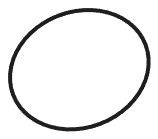

## Eighth Notes

Two eighth notes are played in the time of one quarter note.

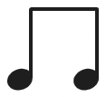

## Time Signature

Music has numbers at the beginning of a score called the **time signature**. Where the upper $4$ means $4$ beats per measure and the lower $4$ means that a **quarter note** get one beat.

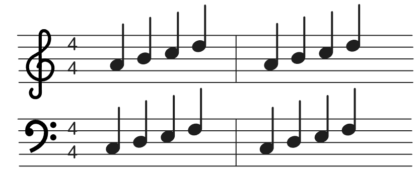

## Dynamic Signs

The signs that tell up how loud or soft to play are called **dynamic signs**. For example:

A $\textit{p (piano)}$ tells us to play soft.

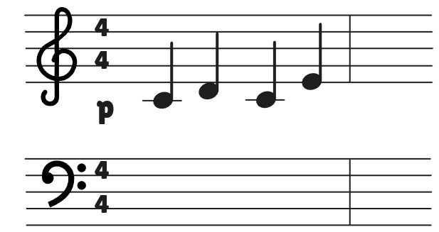

A $\textit{mf (mezzoforte)}$ tells us to moderately loud.

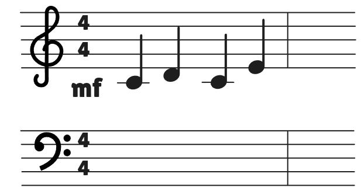

A $\textit{f (forte)}$ tells us to play loud.

A $\textit{ff (fortissimo)}$ tells us to play very loud.

A $\textit{mp (mezzopiano)}$ tells us to play medium soft.

## Tied Notes

Whe notes on the same line of space are joined with a curved line, we call them **tied notes**. And the key is held down for the duration of both notes.

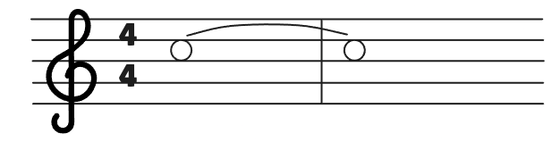

## Dotted Half Note

A **dotted half note** gets $3$ counts ($2$ counts for the half note, plus $1$ count for the dot).

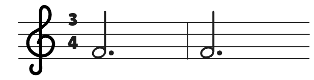

## Dotted Quarter Notes

A dotted quarter note is equivalent to a quarter note tied to a eighth note:

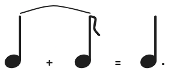

## The Grand Staff

The bass staff and the treble staff, when joined together with a brace, make up the **grand staff**.

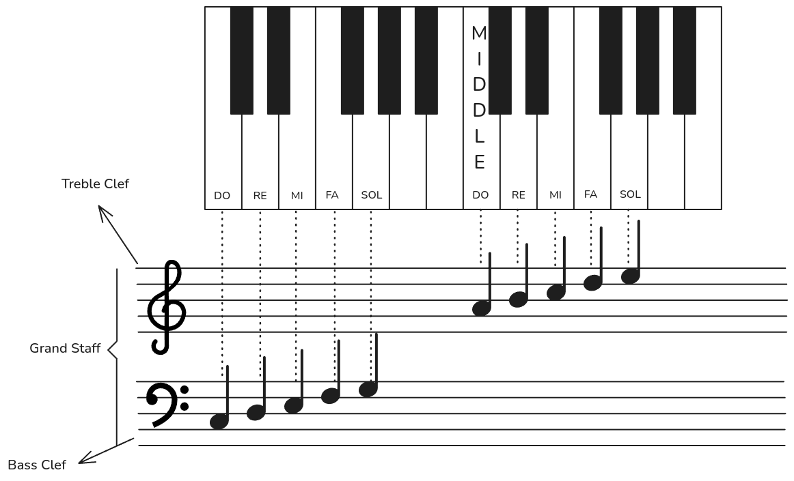

## Slur and Legato Playing

A **slur** is a curved line over or under notes on **different** lines or spaces. Slurs means play **legato** (smoothly connected), they often divide the music intro phrases (a musical thougth or sentence).

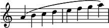

## Incomplete Measure

Some pieces begin with an **incomplete measure**, that is it has one missing count:

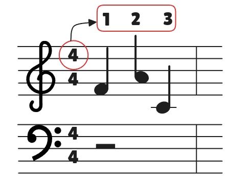

## The Sharp Sign

The **sharp sign** before a note means to play the next key to the right (wether black or white).

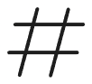

When a **sharp** appears before a note, it applies to that note for the rest of measure:

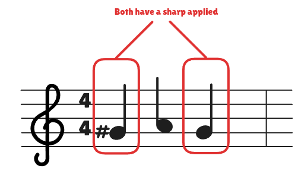

## The Flat Sign

The flat sign before a note means to play the next key to the left of said note.

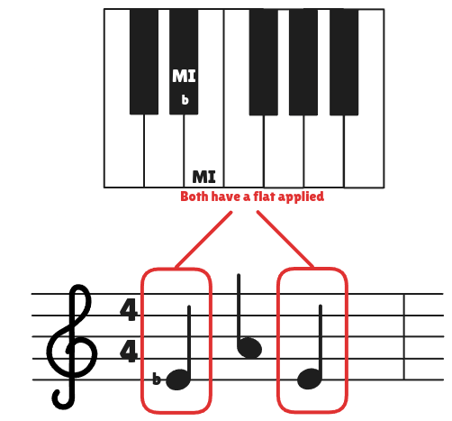

## Staccato

The dot over or under the notes indicates the **staccato** touch, which means: make the note very short.

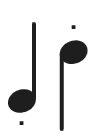

## Half Step

A half step is the distance between a key and the key directly above or below it (black or white).

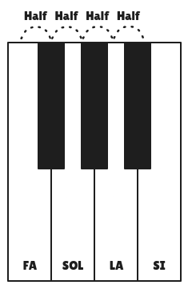

## Whole Step

A whole step is equal to two half steps.

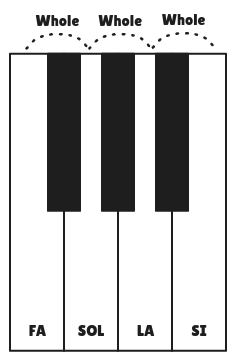

## Syncopated Notes

Notes that are played between the main beats of the measure and are held across the beat are called **syncopated notes**.

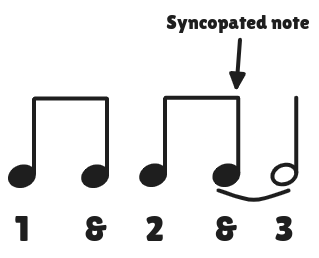

## Natural Sign

The **natural sign** cancels a sharp or flat, so a note after a natural sign is always a white key.

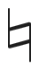

## Accent Sign

An **accent sign** mean that we have to play a note with special emphasis:

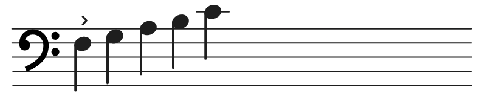

## Overlapping Pedal

The following sign is used to indicate the overlapping pedal:

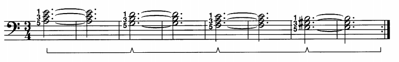

And this is how you play it:

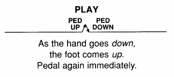

## Eighth Note Triplets

When three notes are grouped together with a figure $3$ bove of below the notes, the group is called a **triplet**.

The three notes of a eighth-note triplet group equal one quarter note.

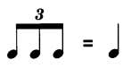
