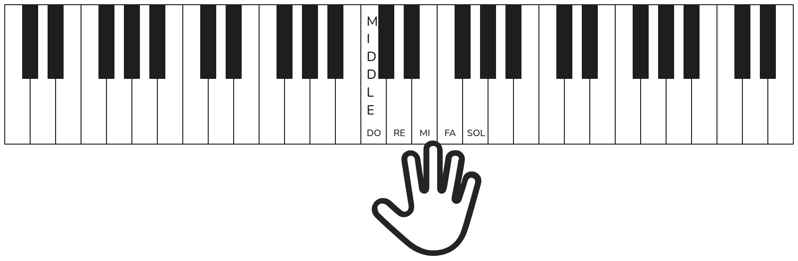
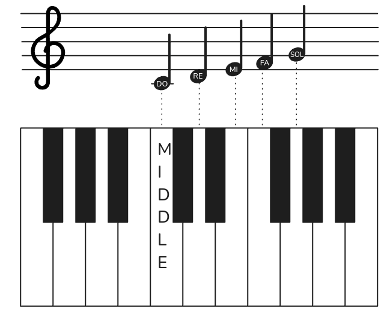
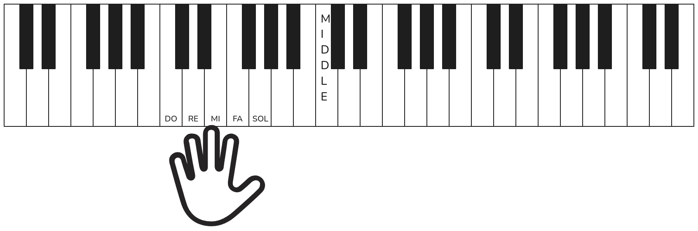
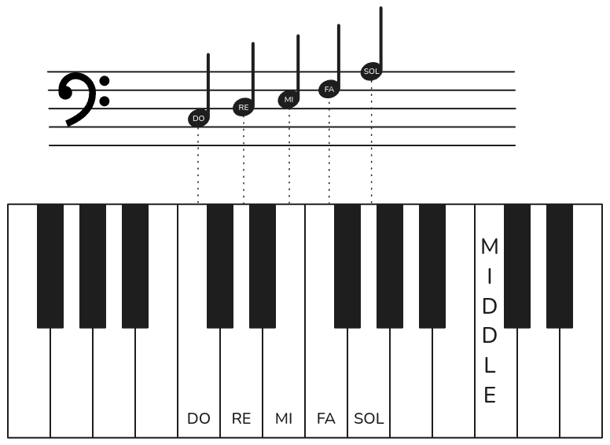
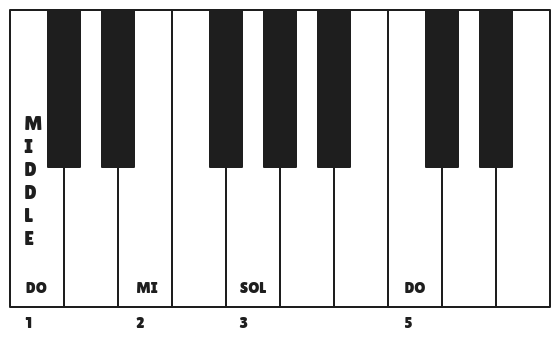
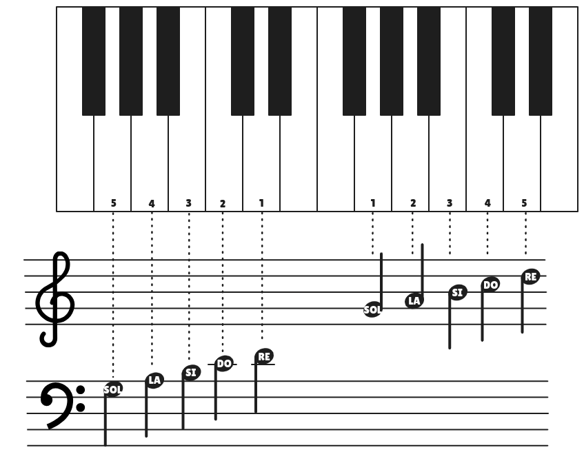
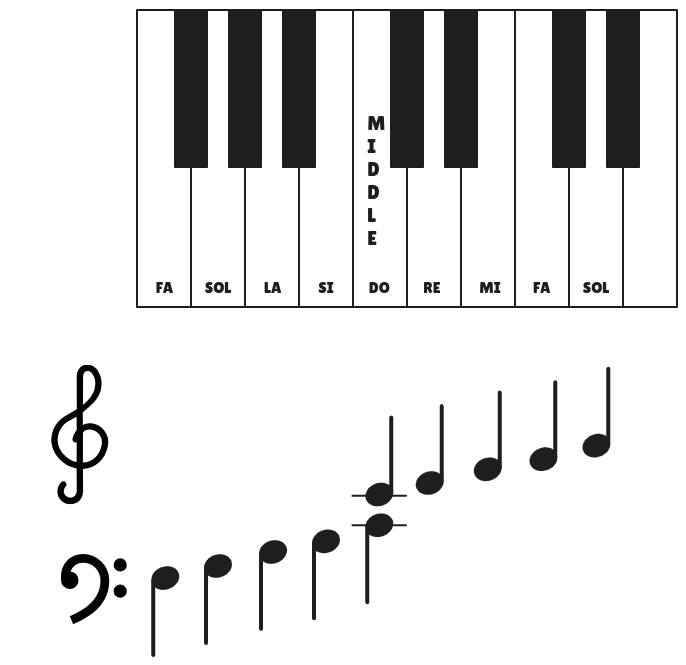

## Do Position

### Right Hand Do Position

Place the right hand on the keyboard so that the **1st finger** falls on **Middle Do**. The $4$ remaining fingers fall naturally on the next $4$ white keys:

The names of the $5$ keys are: **do**, **re**, **mi**, **fa**, **sol**.

Notes for this position are writter on the **trebble staff**. See the following figure:

The treble clef sign is used for right hand notes.

We see that middle do is writter on a short line below the staff, which is called a **leger line**.

### Left Hand Do Position

This position is obtained by moving the left hand so that the $5$th finger falls on the Do below the middle Do. The remaning $4$ fingers fall naturally on the next $4$ white keys.

Notes for this position are writter on the **bass staff**.

### Right Hand Extended Do Position

This position is similar to the standard Do position, but modified as follows:

So now the first three fingers are on Do, Mi and Sol, while the last finger is on the next Do, an octave higher.

## Sol Position

Until now you have played only in the Do POSITION. Now you will move to the Sol POSITION:

## Middle Do Position

On this position the right hand is on Do Position, however the left hand is one key down from Sol Position, like so:

So both thumbs are over the middle Do.
