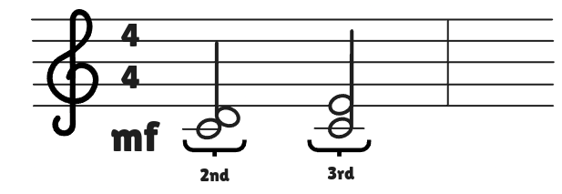

## Melodic Interval

Distances between tones are measured in **intervals**, called $2$nds, $3$rds, $4$ths, $5$ths, etc.

Notes playes separately make a **melody**, and we call the intervals between these notes **melodic intervals**.

## Harmonic Interval

Notes played together make **harmony**. We call the intervals between these notes **harmonic intervals**.

## Melodic Intervals in Do Position

## Harmonic Intervals in Do Position

## Melodic Intervals in Sol Position

## Harmonic Intervals in Sol Position

## 6ths

When you skip 4 white keys then the interval is a 6th.

## 7ths

When you skip 5 white keys then the interval is a 7th.

## Octave

When you skip 6 white keys then the interval is an **octave**.

