## Chords in Do Position

### Do Major

The **Do Major Chord** is made of three notes: **Do**, **Mi** and **Sol**.

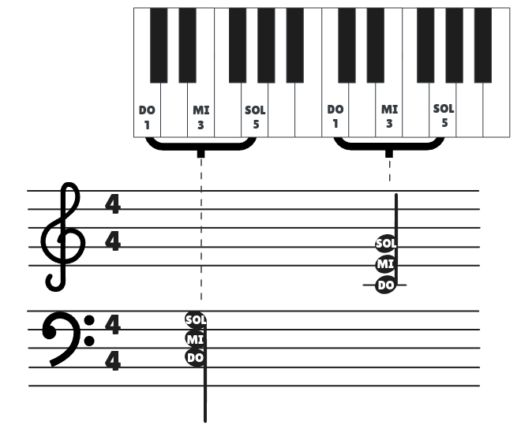

The $\textbf{Sol}^7$ chord is made of three notes: **Si**, **Fa** and **Sol**.

### Sol7

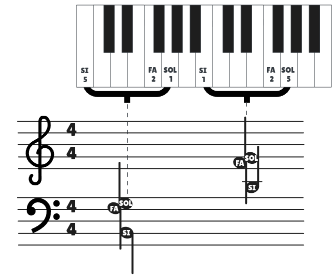

### Fa Major

The **Fa Major Chord** is made of three notes: **Do**, **Fa** and **La**.

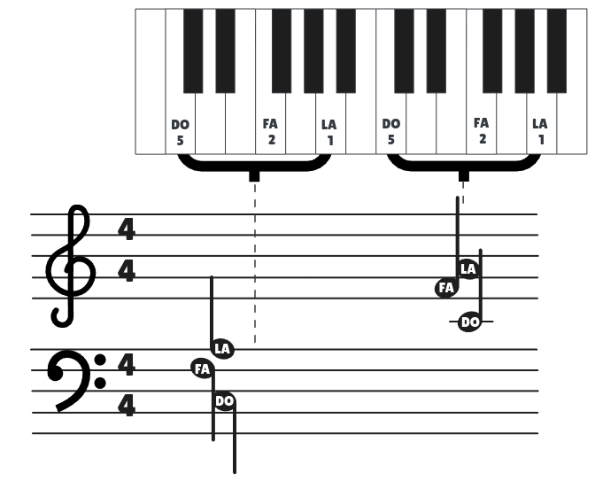

## Chords in Sol Position

### Sol Major

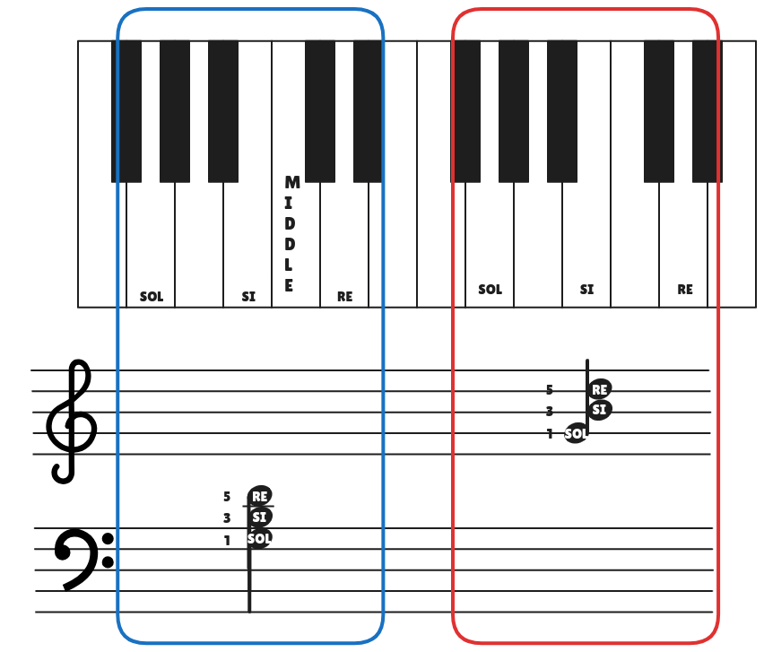

### Re7

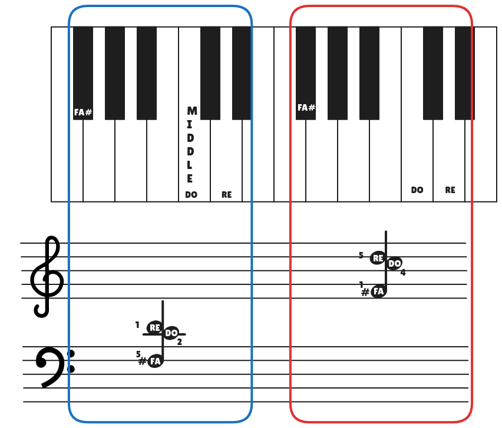

### Do Major in Sol Position

We know that the Do Major is composed of the following notes: Do, Mi, Sol. When you play the same notes of a chord in a different order, it’s still the same chord, but in what’s called an **inversion**. For example:

- Root position of the Do major chord: Do (root), Mi, Sol.
- First inversion: Mi, Sol, Do (Mi is the lowest note).
- Second inversion: Sol, Do, Mi (Sol is the lowest note).

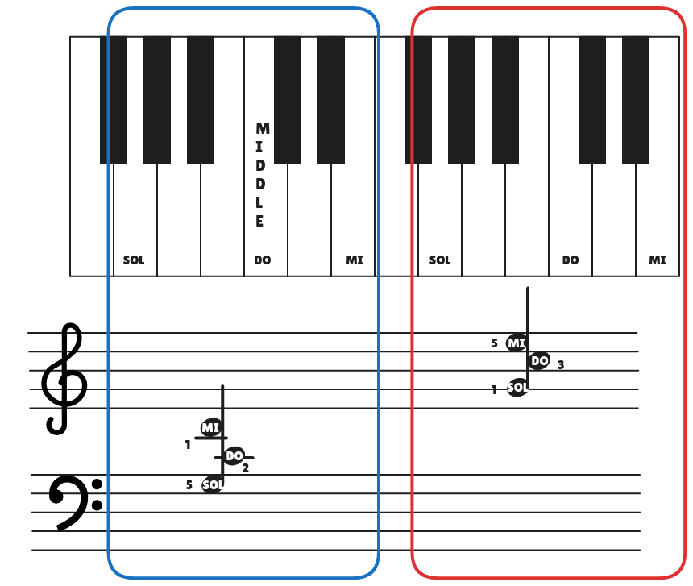

## Tetrachord

A tetrachord is a series of four notes having a pattern of:

Whole step, whole step, half step

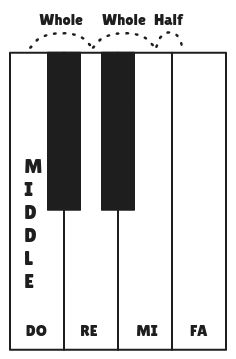

## Major 3rd

A Major 3rd is an interval between two notes that are four half steps (semitones) apart. This interval gives a bright and happy sound. For example:

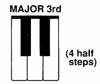

## Minor 3rd

A Minor 3rd is an interval between two notes that are three half steps (semitones) apart. This interval gives a slightly darker or sadder sound. For example:

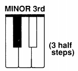

## Perfect 5th

A Perfect 5th is a musical interval that spans seven half steps (or semitones) between two notes. For example:

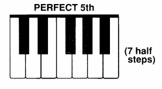

## Triads

A **triad** is a 3-note chord. The three notes of a triad are:

- Root
- Third
- Fifth

The root is the note from which the triad gets its name. The root of a Do Triad is Do.

Triads in **root position** are triads that have the root at the bottom.

### Major Triads

Major triads consist of a **root** a [Major 3rd](<#Major 3rd>) and a [Perfect 5th](<#Perfect 5th>).

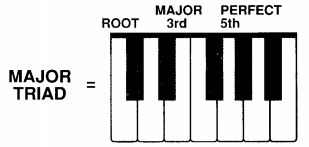

### Minor Triads

Major triads consist of a **root** a [Minor 3rd](<#Minor 3rd>) and a [Perfect 5th](<#Perfect 5th>).

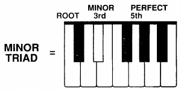

Any Major triad may be changed to a minor triad by lowering the 3rd one half step.

## Primary Chords

The three most important chords in any key are those built on the **1st**, **4th** and **5th** notes of the scale. These are called the **PRIMARY CHORDS** of the key.

The chords are identified by the roman numerals $\textbf{I}$, $\textbf{IV}$ and $\textbf{V}$. The $\textbf{V}$ chord usually adds the note a $7$th above the root to make a $\textbf{V}^7$.

### Primary Chords in Do Major

- The $\textbf{I}$ chord is the Do Major Triad.
- The $\textbf{IV}$ chord is the Fa Major Triad.
- The $\textbf{V}$ chord is the $\text{Sol}^7$ Major Triad. (Sol Major triad with an added $7$th).

### Primary Chords in Sol Major

- The $\textbf{I}$ chord is [Sol Major](<#Sol Major>).
- The $\textbf{IV}$ chord is the [Do Major in Sol position](<#Do Major in Sol Position>).
- The $\textbf{V}$ chord is the [Re7 Major](#Re7).

### Primary Chords in Fa Major

- The $\textbf{I}$ chord is **Fa Major**.
- The $\textbf{IV}$ chord is the **Sib Major**.
- The $\textbf{V}$ chord is the **Do Major**.

### Primary Chords in Re Minor

- The $\textbf{I}$ chord is **Re Minor** (Rem).
- The $\textbf{IV}$ chord is the **Sol Minor** (Solm).
- The $\textbf{V}$ chord is the **La7**.

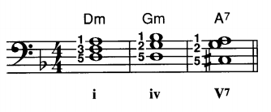

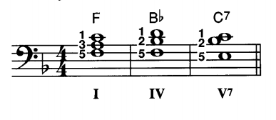

## Chord Progressions

When we change from one chord to another, we call this a **CHORD PROGRESSION**.

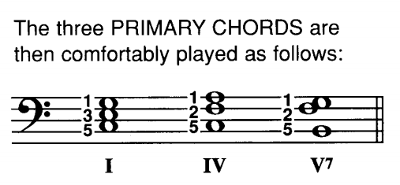

To make the chord progressions easier to play and sound better, the $IV$ and $V^7$ chords may be played in other positions by moving one or more of the higher chord tones down an octave. For example for the primary chords on Do Major:

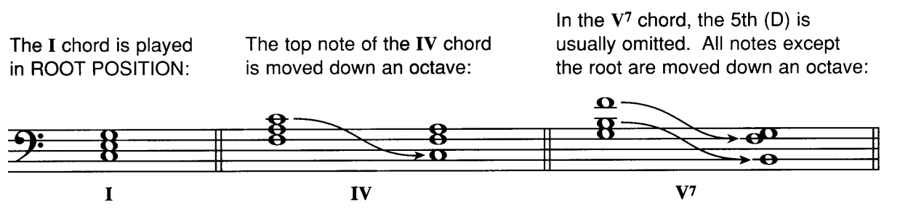

And the chord progressions for the primary chords Sol Major are:

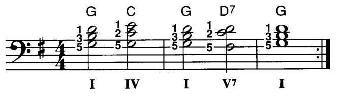

## Arpeggiated Progressions

When a wavy line appears beside a chord, the chord is said to be **arpeggiated**, that is broken or rolled. This means that you should play the lower note first, and quickly add the next higher notes one at a time until the chord is complete.

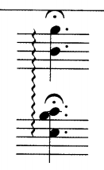
